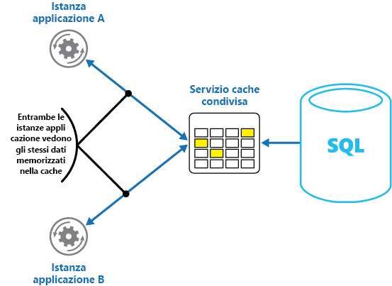

# <a name="caching"></a><span data-ttu-id="adba9-103">Memorizzazione nella cache</span><span class="sxs-lookup"><span data-stu-id="adba9-103">Caching</span></span>

<span data-ttu-id="adba9-104">La memorizzazione nella cache è una tecnica comune che ha l'obiettivo di migliorare le prestazioni e la scalabilità del sistema.</span><span class="sxs-lookup"><span data-stu-id="adba9-104">Caching is a common technique that aims to improve the performance and scalability of a system.</span></span> <span data-ttu-id="adba9-105">A tale scopo, i dati usati di frequente vengono copiati temporaneamente all'interno di una risorsa di archiviazione rapida vicina all'applicazione.</span><span class="sxs-lookup"><span data-stu-id="adba9-105">It does this by temporarily copying frequently accessed data to fast storage that's located close to the application.</span></span> <span data-ttu-id="adba9-106">Se questa risorsa di archiviazione rapida dei dati si trova più vicina all'applicazione rispetto all'origine iniziale, la memorizzazione nella cache può migliorare significativamente i tempi di risposta per le applicazioni client fornendo i dati più rapidamente.</span><span class="sxs-lookup"><span data-stu-id="adba9-106">If this fast data storage is located closer to the application than the original source, then caching can significantly improve response times for client applications by serving data more quickly.</span></span>

<span data-ttu-id="adba9-107">La memorizzazione nella cache è più efficace quando un'istanza di un client legge ripetutamente gli stessi dati, soprattutto se per l'archivio dati originale si verificano tutte le condizioni seguenti:</span><span class="sxs-lookup"><span data-stu-id="adba9-107">Caching is most effective when a client instance repeatedly reads the same data, especially if all the following conditions apply to the original data store:</span></span>

- <span data-ttu-id="adba9-108">Rimane relativamente statico.</span><span class="sxs-lookup"><span data-stu-id="adba9-108">It remains relatively static.</span></span>
- <span data-ttu-id="adba9-109">È lento rispetto alla velocità della cache.</span><span class="sxs-lookup"><span data-stu-id="adba9-109">It's slow compared to the speed of the cache.</span></span>
- <span data-ttu-id="adba9-110">È soggetto a un elevato livello di contesa.</span><span class="sxs-lookup"><span data-stu-id="adba9-110">It's subject to a high level of contention.</span></span>
- <span data-ttu-id="adba9-111">Si trova lontano a tal punto che una latenza di rete potrebbe comportare lentezza nell'accesso.</span><span class="sxs-lookup"><span data-stu-id="adba9-111">It's far away when network latency can cause access to be slow.</span></span>

## <a name="caching-in-distributed-applications"></a><span data-ttu-id="adba9-112">Memorizzazione nella cache di applicazioni distribuite</span><span class="sxs-lookup"><span data-stu-id="adba9-112">Caching in distributed applications</span></span>

<span data-ttu-id="adba9-113">Le applicazioni distribuite solitamente implementano una o entrambe le due strategie seguenti durante la memorizzazione nella cache dei dati:</span><span class="sxs-lookup"><span data-stu-id="adba9-113">Distributed applications typically implement either or both of the following strategies when caching data:</span></span>

- <span data-ttu-id="adba9-114">L'uso di una cache privata, in cui i dati vengono conservati in locale nel computer in cui è in esecuzione un'istanza di un'applicazione o di un servizio.</span><span class="sxs-lookup"><span data-stu-id="adba9-114">Using a private cache, where data is held locally on the computer that's running an instance of an application or service.</span></span>
- <span data-ttu-id="adba9-115">L'uso di una cache condivisa, che funga da origine comune a cui possono accedere più processi o macchine.</span><span class="sxs-lookup"><span data-stu-id="adba9-115">Using a shared cache, serving as a common source which can be accessed by multiple processes and/or machines.</span></span>

<span data-ttu-id="adba9-116">In entrambi i casi, la memorizzazione nella cache può essere eseguita sul lato client e/o sul lato server.</span><span class="sxs-lookup"><span data-stu-id="adba9-116">In both cases, caching can be performed client-side and/or server-side.</span></span> <span data-ttu-id="adba9-117">La memorizzazione nella cache sul lato client viene eseguita dal processo che fornisce l'interfaccia utente per un sistema, ad esempio un Web browser o un'applicazione desktop.</span><span class="sxs-lookup"><span data-stu-id="adba9-117">Client-side caching is done by the process that provides the user interface for a system, such as a web browser or desktop application.</span></span> <span data-ttu-id="adba9-118">La memorizzazione nella cache sul lato server viene eseguita dal processo che fornisce i servizi aziendali in esecuzione in remoto.</span><span class="sxs-lookup"><span data-stu-id="adba9-118">Server-side caching is done by the process that provides the business services that are running remotely.</span></span>

### <a name="private-caching"></a><span data-ttu-id="adba9-119">Memorizzazione nella cache privata</span><span class="sxs-lookup"><span data-stu-id="adba9-119">Private caching</span></span>

<span data-ttu-id="adba9-120">Il tipo più semplice di cache è un archivio in memoria.</span><span class="sxs-lookup"><span data-stu-id="adba9-120">The most basic type of cache is an in-memory store.</span></span> <span data-ttu-id="adba9-121">Questo è situato nello spazio di indirizzi di un singolo processo ed è accessibile direttamente da parte del codice in esecuzione nel processo.</span><span class="sxs-lookup"><span data-stu-id="adba9-121">It's held in the address space of a single process and accessed directly by the code that runs in that process.</span></span> <span data-ttu-id="adba9-122">Questo tipo di cache è accessibile molto rapidamente</span><span class="sxs-lookup"><span data-stu-id="adba9-122">This type of cache is very quick to access.</span></span> <span data-ttu-id="adba9-123">e può anche rappresentare un mezzo estremamente efficace per l'archiviazione di modeste quantità di dati statici, poiché la dimensione della cache è solitamente limitata dal volume della memoria disponibile nella macchina che ospita il processo.</span><span class="sxs-lookup"><span data-stu-id="adba9-123">It can also provide an extremely effective means for storing modest amounts of static data, since the size of a cache is typically constrained by the volume of memory that's available on the machine hosting the process.</span></span>

<span data-ttu-id="adba9-124">Se è necessario memorizzare nella cache un maggior numero di informazioni in memoria rispetto a quanto fisicamente possibile, sarà possibile scrivere i dati memorizzati nella cache nel file system locale.</span><span class="sxs-lookup"><span data-stu-id="adba9-124">If you need to cache more information than is physically possible in memory, you can write cached data to the local file system.</span></span> <span data-ttu-id="adba9-125">L'operazione di accesso ai dati sarà più lenta rispetto a quanto non avvenga con i dati contenuti in memoria, ma dovrebbe comunque essere più rapida e affidabile rispetto al recupero di dati attraverso una rete.</span><span class="sxs-lookup"><span data-stu-id="adba9-125">This will be slower to access than data that's held in-memory, but should still be faster and more reliable than retrieving data across a network.</span></span>

<span data-ttu-id="adba9-126">Se si dispone di più istanze di un'applicazione che usa questo modello in esecuzione in modo simultaneo, ciascuna istanza dell'applicazione dispone della propria cache indipendente, contenente una copia distinta dei dati.</span><span class="sxs-lookup"><span data-stu-id="adba9-126">If you have multiple instances of an application that uses this model running concurrently, each application instance has its own independent cache holding its own copy of the data.</span></span>

<span data-ttu-id="adba9-127">Si può pensare a una cache come a uno snapshot dei dati originali in un determinato momento nel passato.</span><span class="sxs-lookup"><span data-stu-id="adba9-127">Think of a cache as a snapshot of the original data at some point in the past.</span></span> <span data-ttu-id="adba9-128">Se i dati non sono statici, è probabile che istanze diverse di un'applicazione contengano versioni diverse dei dati nelle proprie cache.</span><span class="sxs-lookup"><span data-stu-id="adba9-128">If this data is not static, it is likely that different application instances hold different versions of the data in their caches.</span></span> <span data-ttu-id="adba9-129">Pertanto, la stessa query eseguita da tali istanze può restituire risultati diversi, come mostrato nella Figura 1.</span><span class="sxs-lookup"><span data-stu-id="adba9-129">Therefore, the same query performed by these instances can return different results, as shown in Figure 1.</span></span>


<span data-ttu-id="adba9-131">*Figura 1: uso di una cache in memoria in diverse istanze di un'applicazione.*</span><span class="sxs-lookup"><span data-stu-id="adba9-131">*Figure 1: Using an in-memory cache in different instances of an application.*</span></span>

### <a name="shared-caching"></a><span data-ttu-id="adba9-132">Memorizzazione nella cache condivisa</span><span class="sxs-lookup"><span data-stu-id="adba9-132">Shared caching</span></span>

<span data-ttu-id="adba9-133">L'uso di una cache condivisa consente di ridurre il problema della differenziazione dei dati in ciascuna cache, problema che può verificarsi con l'uso di cache in memoria.</span><span class="sxs-lookup"><span data-stu-id="adba9-133">Using a shared cache can help alleviate concerns that data might differ in each cache, which can occur with in-memory caching.</span></span> <span data-ttu-id="adba9-134">La memorizzazione nella cache condivisa garantisce che istanze diverse di un'applicazione abbiano accesso alla stessa visualizzazione di dati memorizzati nella cache.</span><span class="sxs-lookup"><span data-stu-id="adba9-134">Shared caching ensures that different application instances see the same view of cached data.</span></span> <span data-ttu-id="adba9-135">Questo si ottiene situando la cache in una posizione separata, di solito ospitata all'interno di un servizio separato, come mostrato nella Figura 2.</span><span class="sxs-lookup"><span data-stu-id="adba9-135">It does this by locating the cache in a separate location, typically hosted as part of a separate service, as shown in Figure 2.</span></span>



<span data-ttu-id="adba9-137">*Figura 2: uso di una cache condivisa.*</span><span class="sxs-lookup"><span data-stu-id="adba9-137">*Figure 2: Using a shared cache.*</span></span>

<span data-ttu-id="adba9-138">Un vantaggio importante dell'approccio basato sulla memorizzazione nella cache condivisa è rappresentato dalla scalabilità.</span><span class="sxs-lookup"><span data-stu-id="adba9-138">An important benefit of the shared caching approach is the scalability it provides.</span></span> <span data-ttu-id="adba9-139">Molti servizi di cache condivisa vengono implementati mediante l'uso di un cluster di server e usano software che distribuiscono i dati nel cluster in modo trasparente.</span><span class="sxs-lookup"><span data-stu-id="adba9-139">Many shared cache services are implemented by using a cluster of servers, and utilize software that distributes the data across the cluster in a transparent manner.</span></span> <span data-ttu-id="adba9-140">Un'istanza dell'applicazione invia semplicemente una richiesta al servizio cache.</span><span class="sxs-lookup"><span data-stu-id="adba9-140">An application instance simply sends a request to the cache service.</span></span> <span data-ttu-id="adba9-141">L'infrastruttura sottostante ha il compito di determinare la posizione dei dati del cluster memorizzati nella cache.</span><span class="sxs-lookup"><span data-stu-id="adba9-141">The underlying infrastructure is responsible for determining the location of the cached data in the cluster.</span></span> <span data-ttu-id="adba9-142">È possibile aumentare la quantità di cache aggiungendo più server.</span><span class="sxs-lookup"><span data-stu-id="adba9-142">You can easily scale the cache by adding more servers.</span></span>

<span data-ttu-id="adba9-143">L'approccio basato sulla memorizzazione nella cache condivisa presenta due svantaggi principali:</span><span class="sxs-lookup"><span data-stu-id="adba9-143">There are two main disadvantages of the shared caching approach:</span></span>

- <span data-ttu-id="adba9-144">L'accesso alla cache è più lento perché la cache non è più locale per ogni istanza dell'applicazione.</span><span class="sxs-lookup"><span data-stu-id="adba9-144">The cache is slower to access because it is no longer held locally to each application instance.</span></span>
- <span data-ttu-id="adba9-145">L'esigenza di implementare un servizio cache separato potrebbe comportare una maggiore complessità della soluzione.</span><span class="sxs-lookup"><span data-stu-id="adba9-145">The requirement to implement a separate cache service might add complexity to the solution.</span></span>

## <a name="considerations-for-using-caching"></a><span data-ttu-id="adba9-146">Considerazioni sull'uso della memorizzazione della cache</span><span class="sxs-lookup"><span data-stu-id="adba9-146">Considerations for using caching</span></span>

<span data-ttu-id="adba9-147">Nelle sezioni seguenti vengono descritte considerazioni in modo più dettagliato per la progettazione e l'uso di una cache.</span><span class="sxs-lookup"><span data-stu-id="adba9-147">The following sections describe in more detail the considerations for designing and using a cache.</span></span>

### <a name="decide-when-to-cache-data"></a><span data-ttu-id="adba9-148">Decidere quando memorizzare i dati nella cache</span><span class="sxs-lookup"><span data-stu-id="adba9-148">Decide when to cache data</span></span>

<span data-ttu-id="adba9-149">La memorizzazione nella cache può migliorare significativamente le prestazioni, la scalabilità e la disponibilità.</span><span class="sxs-lookup"><span data-stu-id="adba9-149">Caching can dramatically improve performance, scalability, and availability.</span></span> <span data-ttu-id="adba9-150">Maggiore la quantità di dati a disposizione e maggiore il numero di utenti che dovranno accedere a tali dati, maggiori saranno i vantaggi della memorizzazione nella cache.</span><span class="sxs-lookup"><span data-stu-id="adba9-150">The more data that you have and the larger the number of users that need to access this data, the greater the benefits of caching become.</span></span> <span data-ttu-id="adba9-151">Infatti la memorizzazione nella cache riduce la latenza e la contesa associati alla gestione di un'elevata quantità di richieste simultanee nell'archivio dati originale.</span><span class="sxs-lookup"><span data-stu-id="adba9-151">That's because caching reduces the latency and contention that's associated with handling large volumes of concurrent requests in the original data store.</span></span>

<span data-ttu-id="adba9-152">Ad esempio, un database potrebbe supportare un numero limitato di connessioni simultanee,</span><span class="sxs-lookup"><span data-stu-id="adba9-152">For example, a database might support a limited number of concurrent connections.</span></span> <span data-ttu-id="adba9-153">ma il recupero di dati da una cache condivisa, tuttavia, piuttosto che da un database sottostante consente a un'applicazione client di accedere ai dati anche se il numero di connessioni disponibili è esaurito.</span><span class="sxs-lookup"><span data-stu-id="adba9-153">Retrieving data from a shared cache, however, rather than the underlying database, makes it possible for a client application to access this data even if the number of available connections is currently exhausted.</span></span> <span data-ttu-id="adba9-154">Inoltre, se il database non fosse disponibile, l'esecuzione delle applicazioni client potrebbe continuare grazie ai dati contenuti nella cache.</span><span class="sxs-lookup"><span data-stu-id="adba9-154">Additionally, if the database becomes unavailable, client applications might be able to continue by using the data that's held in the cache.</span></span>

<span data-ttu-id="adba9-155">Si prenda in considerazione l'opportunità di memorizzare nella cache i dati letti di frequente, ma modificati raramente, ad esempio i dati che in proporzione subiscono più operazioni di lettura che di scrittura.</span><span class="sxs-lookup"><span data-stu-id="adba9-155">Consider caching data that is read frequently but modified infrequently (for example, data that has a higher proportion of read operations than write operations).</span></span> <span data-ttu-id="adba9-156">Non è però consigliabile usare la cache come archivio autorevole di informazioni di rilevanza critica.</span><span class="sxs-lookup"><span data-stu-id="adba9-156">However, we don't recommend that you use the cache as the authoritative store of critical information.</span></span> <span data-ttu-id="adba9-157">Verificare invece che tutte le modifiche che l'applicazione non deve assolutamente perdere vengano sempre salvate in un archivio dati permanente.</span><span class="sxs-lookup"><span data-stu-id="adba9-157">Instead, ensure that all changes that your application cannot afford to lose are always saved to a persistent data store.</span></span> <span data-ttu-id="adba9-158">Questo significa che, se la cache non è disponibile, l'applicazione può comunque continuare a funzionare usando l'archivio dati e non verranno perse informazioni importanti.</span><span class="sxs-lookup"><span data-stu-id="adba9-158">This means that if the cache is unavailable, your application can still continue to operate by using the data store, and you won't lose important information.</span></span>

### <a name="determine-how-to-cache-data-effectively"></a><span data-ttu-id="adba9-159">Determinare come memorizzare dati nella cache in modo efficace</span><span class="sxs-lookup"><span data-stu-id="adba9-159">Determine how to cache data effectively</span></span>

<span data-ttu-id="adba9-160">Il modo fondamentale in cui usare una cache in modo efficiente consiste nello stabilire i dati più importanti da memorizzare nella cache e l'orario più adatto.</span><span class="sxs-lookup"><span data-stu-id="adba9-160">The key to using a cache effectively lies in determining the most appropriate data to cache, and caching it at the appropriate time.</span></span> <span data-ttu-id="adba9-161">I dati possono essere aggiunti alla cache su richiesta la prima volta che vengono recuperati da un'applicazione.</span><span class="sxs-lookup"><span data-stu-id="adba9-161">The data can be added to the cache on demand the first time it is retrieved by an application.</span></span> <span data-ttu-id="adba9-162">Ciò significa che l'applicazione deve recuperare solo una volta i dati dall'archivio dati e che l'accesso successivo a tali dati può essere eseguito in modo soddisfacente tramite la cache.</span><span class="sxs-lookup"><span data-stu-id="adba9-162">This means that the application needs to fetch the data only once from the data store, and that subsequent access can be satisfied by using the cache.</span></span>

<span data-ttu-id="adba9-163">In alternativa, una cache può essere parzialmente o completamente popolata con i dati in anticipo, di solito all'avvio dell'applicazione (approccio noto come seeding).</span><span class="sxs-lookup"><span data-stu-id="adba9-163">Alternatively, a cache can be partially or fully populated with data in advance, typically when the application starts (an approach known as seeding).</span></span> <span data-ttu-id="adba9-164">Tuttavia, potrebbe non essere consigliabile implementare il seeding per una cache di grosse dimensioni, poiché tale approccio potrebbe imporre un carico elevato e improvviso sull'archivio dati originale all'inizio dell'esecuzione dell'applicazione.</span><span class="sxs-lookup"><span data-stu-id="adba9-164">However, it might not be advisable to implement seeding for a large cache because this approach can impose a sudden, high load on the original data store when the application starts running.</span></span>

<span data-ttu-id="adba9-165">Spesso un'analisi dei modelli di uso consente di decidere se prepopolare completamente o parzialmente una cache e di scegliere i dati da memorizzare nella cache.</span><span class="sxs-lookup"><span data-stu-id="adba9-165">Often an analysis of usage patterns can help you decide whether to fully or partially prepopulate a cache, and to choose the data to cache.</span></span> <span data-ttu-id="adba9-166">Ad esempio, può essere utile effettuare il seeding della cache con i dati statici del profilo utente per i clienti che usano l'applicazione regolarmente (forse ogni giorno), ma non per i clienti che usano l'applicazione solo una volta alla settimana.</span><span class="sxs-lookup"><span data-stu-id="adba9-166">For example, it can be useful to seed the cache with the static user profile data for customers who use the application regularly (perhaps every day), but not for customers who use the application only once a week.</span></span>

<span data-ttu-id="adba9-167">La memorizzazione nella cache solitamente funziona bene con i dati non modificabili o che non vengono modificati di frequente.</span><span class="sxs-lookup"><span data-stu-id="adba9-167">Caching typically works well with data that is immutable or that changes infrequently.</span></span> <span data-ttu-id="adba9-168">Tra i possibili casi, informazioni di riferimento, ad esempio i dati dei prodotti e dei prezzi in un'applicazione di e-commerce, o risorse statiche condivise costose da costruire.</span><span class="sxs-lookup"><span data-stu-id="adba9-168">Examples include reference information such as product and pricing information in an e-commerce application, or shared static resources that are costly to construct.</span></span> <span data-ttu-id="adba9-169">A|cuni o tutti questi dati possono essere caricati nella cache all'avvio dell'applicazione per ridurre al minimo la richiesta di risorse e per migliorare le prestazioni.</span><span class="sxs-lookup"><span data-stu-id="adba9-169">Some or all of this data can be loaded into the cache at application startup to minimize demand on resources and to improve performance.</span></span> <span data-ttu-id="adba9-170">Potrebbe inoltre essere opportuno disporre di un processo in background che aggiorni periodicamente i dati di riferimento nella cache per garantire che siano disponibili quelli più recenti o che aggiorni la cache quando i dati di riferimento vengono modificati.</span><span class="sxs-lookup"><span data-stu-id="adba9-170">It might also be appropriate to have a background process that periodically updates reference data in the cache to ensure it is up to date, or that refreshes the cache when reference data changes.</span></span>

<span data-ttu-id="adba9-171">La memorizzazione nella cache è meno utile per i dati dinamici, anche se ci sono alcune eccezioni. Per altre informazioni, vedere la sezione Memorizzazione nella cache di dati altamente dinamici più avanti in questo articolo.</span><span class="sxs-lookup"><span data-stu-id="adba9-171">Caching is less useful for dynamic data, although there are some exceptions to this consideration (see the section Cache highly dynamic data later in this article for more information).</span></span> <span data-ttu-id="adba9-172">Quando i dati originali vengono regolarmente modificati, le informazioni memorizzate nella cache diventano obsolete molto rapidamente o il sovraccarico dovuto alla sincronizzazione della cache con l'archivio dati originale riduce l'efficienza della memorizzazione nella cache.</span><span class="sxs-lookup"><span data-stu-id="adba9-172">When the original data changes regularly, either the cached information becomes stale very quickly or the overhead of synchronizing the cache with the original data store reduces the effectiveness of caching.</span></span>

<span data-ttu-id="adba9-173">Si noti che la cache non deve includere i dati completi relativi a un'entità.</span><span class="sxs-lookup"><span data-stu-id="adba9-173">Note that a cache does not have to include the complete data for an entity.</span></span> <span data-ttu-id="adba9-174">Ad esempio, se un elemento di dati rappresenta un oggetto a più valori, come il cliente di una banca (a cui sono collegati un nome, un indirizzo e un saldo di conto corrente), alcuni elementi potrebbero rimanere statici (ad esempio il nome e l'indirizzo), mentre altri (ad esempio, il saldo di conto corrente) potrebbero essere più dinamici.</span><span class="sxs-lookup"><span data-stu-id="adba9-174">For example, if a data item represents a multivalued object such as a bank customer with a name, address, and account balance, some of these elements might remain static (such as the name and address), while others (such as the account balance) might be more dynamic.</span></span> <span data-ttu-id="adba9-175">In tali situazioni, può essere utile memorizzare nella cache le parti statiche dei dati e recuperare o calcolare solo le informazioni rimanenti quando necessario.</span><span class="sxs-lookup"><span data-stu-id="adba9-175">In these situations, it can be useful to cache the static portions of the data and retrieve (or calculate) only the remaining information when it is required.</span></span>

<span data-ttu-id="adba9-176">È consigliabile effettuare il test delle prestazioni e l'analisi dell'uso per stabilire se sia opportuno il prepopolamento o il caricamento su richiesta della cache oppure una combinazione di entrambi.</span><span class="sxs-lookup"><span data-stu-id="adba9-176">We recommend that you carry out performance testing and usage analysis to determine whether pre-population or on-demand loading of the cache, or a combination of both, is appropriate.</span></span> <span data-ttu-id="adba9-177">La decisione dovrebbe basarsi sulla volatilità e sul modello di uso dei dati.</span><span class="sxs-lookup"><span data-stu-id="adba9-177">The decision should be based on the volatility and usage pattern of the data.</span></span> <span data-ttu-id="adba9-178">L'analisi dell'uso e delle prestazioni della cache è particolarmente importante nelle applicazioni che riscontrano carichi elevati e che devono essere altamente scalabili.</span><span class="sxs-lookup"><span data-stu-id="adba9-178">Cache utilization and performance analysis is particularly important in applications that encounter heavy loads and must be highly scalable.</span></span> <span data-ttu-id="adba9-179">Ad esempio, negli scenari a elevata scalabilità potrebbe avere senso effettuare il seeding della cache per ridurre il carico sull'archivio dati nei momenti di massima attività.</span><span class="sxs-lookup"><span data-stu-id="adba9-179">For example, in highly scalable scenarios it might make sense to seed the cache to reduce the load on the data store at peak times.</span></span>

<span data-ttu-id="adba9-180">La memorizzazione nella cache può essere usata anche per evitare la ripetizione di calcoli durante l'esecuzione dell'applicazione.</span><span class="sxs-lookup"><span data-stu-id="adba9-180">Caching can also be used to avoid repeating computations while the application is running.</span></span> <span data-ttu-id="adba9-181">Se un'operazione trasforma i dati o esegue un calcolo complicato, potrebbe salvare i risultati dell'operazione nella cache.</span><span class="sxs-lookup"><span data-stu-id="adba9-181">If an operation transforms data or performs a complicated calculation, it can save the results of the operation in the cache.</span></span> <span data-ttu-id="adba9-182">Se lo stesso calcolo è necessario successivamente, l'applicazione potrà semplicemente richiamare i risultati dalla cache.</span><span class="sxs-lookup"><span data-stu-id="adba9-182">If the same calculation is required afterward, the application can simply retrieve the results from the cache.</span></span>

<span data-ttu-id="adba9-183">Un'applicazione può modificare i dati conservati nella cache.</span><span class="sxs-lookup"><span data-stu-id="adba9-183">An application can modify data that's held in a cache.</span></span> <span data-ttu-id="adba9-184">È però consigliabile considerare la cache come un archivio dati temporaneo che potrebbe scomparire in qualsiasi momento.</span><span class="sxs-lookup"><span data-stu-id="adba9-184">However, we recommend thinking of the cache as a transient data store that could disappear at any time.</span></span> <span data-ttu-id="adba9-185">Non archiviare dati preziosi solo nella cache, ma assicurarsi di conservare le informazioni anche nell'archivio dati originale.</span><span class="sxs-lookup"><span data-stu-id="adba9-185">Do not store valuable data in the cache only; make sure that you maintain the information in the original data store as well.</span></span> <span data-ttu-id="adba9-186">In questo modo, se la cache dovesse diventare non disponibile, la possibilità di perdere i dati sarebbe ridotta al minimo.</span><span class="sxs-lookup"><span data-stu-id="adba9-186">This means that if the cache becomes unavailable, you minimize the chance of losing data.</span></span>

### <a name="cache-highly-dynamic-data"></a><span data-ttu-id="adba9-187">Memorizzazione nella cache di dati altamente dinamici</span><span class="sxs-lookup"><span data-stu-id="adba9-187">Cache highly dynamic data</span></span>

<span data-ttu-id="adba9-188">L'archiviazione di informazioni che cambiano rapidamente in un archivio dati permanente può comportare un sovraccarico nel sistema.</span><span class="sxs-lookup"><span data-stu-id="adba9-188">When you store rapidly-changing information in a persistent data store, it can impose an overhead on the system.</span></span> <span data-ttu-id="adba9-189">Ad esempio, si consideri un dispositivo che segnali continuamente uno stato o un altro tipo di misurazione.</span><span class="sxs-lookup"><span data-stu-id="adba9-189">For example, consider a device that continually reports status or some other measurement.</span></span> <span data-ttu-id="adba9-190">Se un'applicazione sceglie di non memorizzare nella cache i dati sulla base del fatto che le informazioni memorizzate nella cache saranno quasi sempre obsolete, le stesse considerazioni potrebbero valere anche durante l'archiviazione e il richiamo di tali informazioni dall'archivio dati.</span><span class="sxs-lookup"><span data-stu-id="adba9-190">If an application chooses not to cache this data on the basis that the cached information will nearly always be outdated, then the same consideration could be true when storing and retrieving this information from the data store.</span></span> <span data-ttu-id="adba9-191">Nel tempo necessario a salvare e recuperare i dati, questi potrebbero essere stati modificati.</span><span class="sxs-lookup"><span data-stu-id="adba9-191">In the time it takes to save and fetch this data, it might have changed.</span></span>

<span data-ttu-id="adba9-192">In una situazione simile, considerare i vantaggi di archiviare le informazioni dinamiche direttamente nella cache invece che nell'archivio dati permanente.</span><span class="sxs-lookup"><span data-stu-id="adba9-192">In a situation such as this, consider the benefits of storing the dynamic information directly in the cache instead of in the persistent data store.</span></span> <span data-ttu-id="adba9-193">Se i dati non sono critici e non richiedono un controllo, non importa se ogni tanto una modifica va persa.</span><span class="sxs-lookup"><span data-stu-id="adba9-193">If the data is non-critical and does not require auditing, then it doesn't matter if the occasional change is lost.</span></span>

### <a name="manage-data-expiration-in-a-cache"></a><span data-ttu-id="adba9-194">Gestire la scadenza dei dati nella cache</span><span class="sxs-lookup"><span data-stu-id="adba9-194">Manage data expiration in a cache</span></span>

<span data-ttu-id="adba9-195">Nella maggior parte dei casi, i dati conservati in una cache sono una copia dei dati conservati nell'archivio dati originale.</span><span class="sxs-lookup"><span data-stu-id="adba9-195">In most cases, data that's held in a cache is a copy of data that's held in the original data store.</span></span> <span data-ttu-id="adba9-196">I dati nell'archivio dati originale potrebbero cambiare dopo essere memorizzati nella cache, provocando l'obsolescenza dei dati memorizzati nella cache.</span><span class="sxs-lookup"><span data-stu-id="adba9-196">The data in the original data store might change after it was cached, causing the cached data to become stale.</span></span> <span data-ttu-id="adba9-197">Molti sistemi di memorizzazione nella cache consentono di configurare la cache per la scadenza dei dati e per la riduzione del periodo di tempo per cui i dati potrebbero risultare scaduti.</span><span class="sxs-lookup"><span data-stu-id="adba9-197">Many caching systems enable you to configure the cache to expire data and reduce the period for which data may be out of date.</span></span>

<span data-ttu-id="adba9-198">Quando i dati memorizzati nella cache scadono, vengono rimossi dalla cache e l'applicazione deve recuperare i dati dall'archivio dati originale, inserendo, se opportuno, le informazioni appena recuperate nella cache.</span><span class="sxs-lookup"><span data-stu-id="adba9-198">When cached data expires, it's removed from the cache, and the application must retrieve the data from the original data store (it can put the newly-fetched information back into cache).</span></span> <span data-ttu-id="adba9-199">Successivamente, sarà possibile impostare un criterio di scadenza predefinito durante la configurazione della cache.</span><span class="sxs-lookup"><span data-stu-id="adba9-199">You can set a default expiration policy when you configure the cache.</span></span> <span data-ttu-id="adba9-200">In molti servizi cache è anche possibile impostare il periodo di scadenza per i singoli oggetti al momento di archiviarli nella cache a livello di codice.</span><span class="sxs-lookup"><span data-stu-id="adba9-200">In many cache services, you can also stipulate the expiration period for individual objects when you store them programmatically in the cache.</span></span> <span data-ttu-id="adba9-201">Alcune cache consentono di specificare il periodo di scadenza come un valore assoluto o come un valore scorrevole che comporta la rimozione dell'elemento dalla cache se non vi si accede entro il periodo di tempo prestabilito.</span><span class="sxs-lookup"><span data-stu-id="adba9-201">Some caches enable you to specify the expiration period as an absolute value, or as a sliding value that causes the item to be removed from the cache if it is not accessed within the specified time.</span></span> <span data-ttu-id="adba9-202">Questa impostazione esegue l'override di qualsiasi criterio di scadenza relativo alla cache, ma solo per gli oggetti specificati.</span><span class="sxs-lookup"><span data-stu-id="adba9-202">This setting overrides any cache-wide expiration policy, but only for the specified objects.</span></span>

> [!NOTE]
> <span data-ttu-id="adba9-203">Si consideri attentamente il periodo di scadenza della cache e degli oggetti in essa contenuti.</span><span class="sxs-lookup"><span data-stu-id="adba9-203">Consider the expiration period for the cache and the objects that it contains carefully.</span></span> <span data-ttu-id="adba9-204">Se si imposta un periodo troppo ridotto, gli oggetti scadranno troppo rapidamente e si ridurranno i vantaggi dell'uso della cache.</span><span class="sxs-lookup"><span data-stu-id="adba9-204">If you make it too short, objects will expire too quickly and you will reduce the benefits of using the cache.</span></span> <span data-ttu-id="adba9-205">Se si imposta il periodo in modo troppo esteso, si rischi l'obsolescenza dei dati.</span><span class="sxs-lookup"><span data-stu-id="adba9-205">If you make the period too long, you risk the data becoming stale.</span></span>

<span data-ttu-id="adba9-206">È inoltre possibile che la cache si riempia se ai dati è consentita una permanenza prolungata.</span><span class="sxs-lookup"><span data-stu-id="adba9-206">It's also possible that the cache might fill up if data is allowed to remain resident for a long time.</span></span> <span data-ttu-id="adba9-207">In tal caso, qualsiasi richiesta di aggiungere nuovi elementi alla cache potrebbe comportare la rimozione forzata di alcuni elementi in un processo noto come rimozione.</span><span class="sxs-lookup"><span data-stu-id="adba9-207">In this case, any requests to add new items to the cache might cause some items to be forcibly removed in a process known as eviction.</span></span> <span data-ttu-id="adba9-208">I servizi cache tipicamente rimuovono i dati usati meno di recente, ma è solitamente possibile eseguire l'override di questo criterio e impedire la rimozione di elementi.</span><span class="sxs-lookup"><span data-stu-id="adba9-208">Cache services typically evict data on a least-recently-used (LRU) basis, but you can usually override this policy and prevent items from being evicted.</span></span> <span data-ttu-id="adba9-209">Tuttavia, se si adotta questo approccio, si rischia di superare la memoria disponibile nella cache.</span><span class="sxs-lookup"><span data-stu-id="adba9-209">However, if you adopt this approach, you risk exceeding the memory that's available in the cache.</span></span> <span data-ttu-id="adba9-210">Un'applicazione che tenta di aggiungere un elemento alla cache non completerà l'operazione, generando un'eccezione.</span><span class="sxs-lookup"><span data-stu-id="adba9-210">An application that attempts to add an item to the cache will fail with an exception.</span></span>

<span data-ttu-id="adba9-211">Alcune implementazioni di memorizzazione nella cache possono specificare altri criteri di rimozione.</span><span class="sxs-lookup"><span data-stu-id="adba9-211">Some caching implementations might provide additional eviction policies.</span></span> <span data-ttu-id="adba9-212">Esistono diversi tipi di criteri di rimozione.</span><span class="sxs-lookup"><span data-stu-id="adba9-212">There are several types of eviction policies.</span></span> <span data-ttu-id="adba9-213">incluse le seguenti:</span><span class="sxs-lookup"><span data-stu-id="adba9-213">These include:</span></span>

- <span data-ttu-id="adba9-214">Criteri basati sull'uso più recente (in previsione del fatto che i dati non saranno più necessari).</span><span class="sxs-lookup"><span data-stu-id="adba9-214">A most-recently-used policy (in the expectation that the data will not be required again).</span></span>
- <span data-ttu-id="adba9-215">Criteri First-In-First-Out (i dati meno recenti vengono rimossi per primi).</span><span class="sxs-lookup"><span data-stu-id="adba9-215">A first-in-first-out policy (oldest data is evicted first).</span></span>
- <span data-ttu-id="adba9-216">Criteri di rimozione esplicita in base all'attivazione di un evento (ad esempio la modifica dei dati).</span><span class="sxs-lookup"><span data-stu-id="adba9-216">An explicit removal policy based on a triggered event (such as the data being modified).</span></span>

### <a name="invalidate-data-in-a-client-side-cache"></a><span data-ttu-id="adba9-217">Annullare i dati in una cache lato client</span><span class="sxs-lookup"><span data-stu-id="adba9-217">Invalidate data in a client-side cache</span></span>

<span data-ttu-id="adba9-218">I dati contenuti in una cache lato client sono in genere considerati fuori dalla portata del servizio che fornisce i dati al client.</span><span class="sxs-lookup"><span data-stu-id="adba9-218">Data that's held in a client-side cache is generally considered to be outside the auspices of the service that provides the data to the client.</span></span> <span data-ttu-id="adba9-219">Un servizio non può imporre direttamente a un client di aggiungere o rimuovere informazioni da una cache lato client.</span><span class="sxs-lookup"><span data-stu-id="adba9-219">A service cannot directly force a client to add or remove information from a client-side cache.</span></span>

<span data-ttu-id="adba9-220">Ciò significa che per un client che usa una cache configurata in modo non corretto è possibile continuare a usare informazioni non aggiornate.</span><span class="sxs-lookup"><span data-stu-id="adba9-220">This means that it's possible for a client that uses a poorly configured cache to continue using outdated information.</span></span> <span data-ttu-id="adba9-221">Ad esempio, se i criteri di scadenza della cache non sono implementati correttamente, un client potrebbe usare informazioni obsolete memorizzate in locale quando le informazioni nell'origine dati originale sono state modificate.</span><span class="sxs-lookup"><span data-stu-id="adba9-221">For example, if the expiration policies of the cache aren't properly implemented, a client might use outdated information that's cached locally when the information in the original data source has changed.</span></span>

<span data-ttu-id="adba9-222">Se si compila un'applicazione Web che fornisce dati attraverso una connessione HTTP, è possibile forzare un client Web (ad esempio un browser o un proxy Web) in modo implicito a recuperare le informazioni più recenti.</span><span class="sxs-lookup"><span data-stu-id="adba9-222">If you are building a web application that serves data over an HTTP connection, you can implicitly force a web client (such as a browser or web proxy) to fetch the most recent information.</span></span> <span data-ttu-id="adba9-223">Ciò è possibile se una risorsa viene aggiornata modificando l'URI della risorsa stessa.</span><span class="sxs-lookup"><span data-stu-id="adba9-223">You can do this if a resource is updated by a change in the URI of that resource.</span></span> <span data-ttu-id="adba9-224">I client Web solitamente usano l'URI di una risorsa come chiave nella cache lato client, pertanto se l'URI cambia, il client Web ignora eventuali versioni di una risorsa memorizzate in precedenza nella cache e recupera la nuova versione.</span><span class="sxs-lookup"><span data-stu-id="adba9-224">Web clients typically use the URI of a resource as the key in the client-side cache, so if the URI changes, the web client ignores any previously cached versions of a resource and fetches the new version instead.</span></span>

## <a name="managing-concurrency-in-a-cache"></a><span data-ttu-id="adba9-225">Gestione della concorrenza in una cache</span><span class="sxs-lookup"><span data-stu-id="adba9-225">Managing concurrency in a cache</span></span>

<span data-ttu-id="adba9-226">Le cache sono spesso progettate per essere condivise da più istanze di un'applicazione.</span><span class="sxs-lookup"><span data-stu-id="adba9-226">Caches are often designed to be shared by multiple instances of an application.</span></span> <span data-ttu-id="adba9-227">Ciascuna istanza dell'applicazione può leggere e modificare i dati nella cache.</span><span class="sxs-lookup"><span data-stu-id="adba9-227">Each application instance can read and modify data in the cache.</span></span> <span data-ttu-id="adba9-228">Di conseguenza, gli stessi problemi di concorrenza che si verificano con qualsiasi archivio dati condiviso valgono anche per una cache.</span><span class="sxs-lookup"><span data-stu-id="adba9-228">Consequently, the same concurrency issues that arise with any shared data store also apply to a cache.</span></span> <span data-ttu-id="adba9-229">In una situazione in cui un'applicazione deve modificare i dati contenuti nella cache, potrebbe essere necessario garantire che gli aggiornamenti effettuati da un'istanza dell'applicazione non sovrascrivano le modifiche effettuate da un'altra istanza.</span><span class="sxs-lookup"><span data-stu-id="adba9-229">In a situation where an application needs to modify data that's held in the cache, you might need to ensure that updates made by one instance of the application do not overwrite the changes made by another instance.</span></span>

<span data-ttu-id="adba9-230">A seconda della natura dei dati e della probabilità delle collisioni, è possibile uno dei due seguenti approcci alla concorrenza:</span><span class="sxs-lookup"><span data-stu-id="adba9-230">Depending on the nature of the data and the likelihood of collisions, you can adopt one of two approaches to concurrency:</span></span>

- <span data-ttu-id="adba9-231">**Ottimistico**.</span><span class="sxs-lookup"><span data-stu-id="adba9-231">**Optimistic**.</span></span> <span data-ttu-id="adba9-232">Subito prima di aggiornare i dati, l'applicazione controlla se i dati nella cache siano stati modificati dopo che sono stati recuperati.</span><span class="sxs-lookup"><span data-stu-id="adba9-232">Immediately prior to updating the data, the application checks to see whether the data in the cache has changed since it was retrieved.</span></span> <span data-ttu-id="adba9-233">Se i dati sono ancora gli stessi, sarà possibile apportare la modifica.</span><span class="sxs-lookup"><span data-stu-id="adba9-233">If the data is still the same, the change can be made.</span></span> <span data-ttu-id="adba9-234">In caso contrario, l'applicazione deve decidere se aggiornarli</span><span class="sxs-lookup"><span data-stu-id="adba9-234">Otherwise, the application has to decide whether to update it.</span></span> <span data-ttu-id="adba9-235">in base alla logica di business specifica dell'applicazione stessa. Questo approccio è adatto a situazioni in cui sono frequenti aggiornamenti o in cui sia improbabile che si verifichino conflitti.</span><span class="sxs-lookup"><span data-stu-id="adba9-235">(The business logic that drives this decision will be application-specific.) This approach is suitable for situations where updates are infrequent, or where collisions are unlikely to occur.</span></span>
- <span data-ttu-id="adba9-236">**Pessimistico**.</span><span class="sxs-lookup"><span data-stu-id="adba9-236">**Pessimistic**.</span></span> <span data-ttu-id="adba9-237"> Quando recupera i dati, l'applicazione li blocca all'interno della cache, per evitarne la modifica da parte di un'altra istanza.</span><span class="sxs-lookup"><span data-stu-id="adba9-237">When it retrieves the data, the application locks it in the cache to prevent another instance from changing it.</span></span> <span data-ttu-id="adba9-238">Questo processo garantisce l'assenza di conflitti, che però potrebbero bloccare altre istanze che devono elaborare gli stessi dati.</span><span class="sxs-lookup"><span data-stu-id="adba9-238">This process ensures that collisions cannot occur, but they can also block other instances that need to process the same data.</span></span> <span data-ttu-id="adba9-239">La concorrenza pessimistica può influire sulla scalabilità di una soluzione ed è consigliabile solo per operazioni di breve durata.</span><span class="sxs-lookup"><span data-stu-id="adba9-239">Pessimistic concurrency can affect the scalability of a solution and is recommended only for short-lived operations.</span></span> <span data-ttu-id="adba9-240">Questo approccio potrebbe essere appropriato per situazioni in cui sono più probabili conflitti, soprattutto se un'applicazione aggiorna più elementi nella cache e deve assicurarsi che queste modifiche vengano applicate in modo coerente.</span><span class="sxs-lookup"><span data-stu-id="adba9-240">This approach might be appropriate for situations where collisions are more likely, especially if an application updates multiple items in the cache and must ensure that these changes are applied consistently.</span></span>

### <a name="implement-high-availability-and-scalability-and-improve-performance"></a><span data-ttu-id="adba9-241">Implementare disponibilità elevata e scalabilità e migliorare le prestazioni</span><span class="sxs-lookup"><span data-stu-id="adba9-241">Implement high availability and scalability, and improve performance</span></span>

<span data-ttu-id="adba9-242">Evitare di usare una cache come repository principale dei dati. Questo è il ruolo dell'archivio dati originale da cui la cache viene popolata.</span><span class="sxs-lookup"><span data-stu-id="adba9-242">Avoid using a cache as the primary repository of data; this is the role of the original data store from which the cache is populated.</span></span> <span data-ttu-id="adba9-243">L'archivio dati originale è responsabile di garantire la persistenza dei dati.</span><span class="sxs-lookup"><span data-stu-id="adba9-243">The original data store is responsible for ensuring the persistence of the data.</span></span>

<span data-ttu-id="adba9-244">Prestare attenzione a non introdurre dipendenze critiche per la disponibilità di un servizio di cache condivisa nelle soluzioni.</span><span class="sxs-lookup"><span data-stu-id="adba9-244">Be careful not to introduce critical dependencies on the availability of a shared cache service into your solutions.</span></span> <span data-ttu-id="adba9-245">Un'applicazione deve essere in grado di continuare a funzionare anche se il servizio che fornisce la cache condivisa non è disponibile.</span><span class="sxs-lookup"><span data-stu-id="adba9-245">An application should be able to continue functioning if the service that provides the shared cache is unavailable.</span></span> <span data-ttu-id="adba9-246">L'applicazione non deve bloccarsi o generare errori mentre attende che il servizio cache riprenda a funzionare.</span><span class="sxs-lookup"><span data-stu-id="adba9-246">The application should not hang or fail while waiting for the cache service to resume.</span></span>

<span data-ttu-id="adba9-247">Pertanto, l'applicazione deve essere preparata per rilevare la disponibilità del servizio cache e il fallback all'archivio dati originale se la cache non è accessibile.</span><span class="sxs-lookup"><span data-stu-id="adba9-247">Therefore, the application must be prepared to detect the availability of the cache service and fall back to the original data store if the cache is inaccessible.</span></span> <span data-ttu-id="adba9-248">Il [modello a interruttore](../patterns/circuit-breaker.md) è utile per la gestione di questo scenario.</span><span class="sxs-lookup"><span data-stu-id="adba9-248">The [Circuit-Breaker pattern](../patterns/circuit-breaker.md) is useful for handling this scenario.</span></span> <span data-ttu-id="adba9-249">È possibile ripristinare il servizio che fornisce la cache. Non appena questo torna disponibile, la cache può essere ripopolata man mano che i dati vengono letti dall'archivio dati originale, seguendo una strategia come il [modello cache-aside](../patterns/cache-aside.md).</span><span class="sxs-lookup"><span data-stu-id="adba9-249">The service that provides the cache can be recovered, and once it becomes available, the cache can be repopulated as data is read from the original data store, following a strategy such as the [Cache-aside pattern](../patterns/cache-aside.md).</span></span>

<span data-ttu-id="adba9-250">Tuttavia, se l'applicazione esegue il fallback all'archivio dati originale quando la cache è temporaneamente non disponibile, si potrebbe avere un impatto sulla scalabilità del sistema.</span><span class="sxs-lookup"><span data-stu-id="adba9-250">However, there might be a scalability impact on the system if the application falls back to the original data store when the cache is temporarily unavailable.</span></span> <span data-ttu-id="adba9-251">Mentre viene recuperato l'archivio dati, l'archivio dati originale potrebbe essere sovraccaricato da richieste di dati, con conseguenti timeout ed errori di connessione.</span><span class="sxs-lookup"><span data-stu-id="adba9-251">While the data store is being recovered, the original data store could be swamped with requests for data, resulting in timeouts and failed connections.</span></span>

<span data-ttu-id="adba9-252">Prendere in considerazione la possibilità di implementare una cache locale privata in ogni istanza di un'applicazione insieme alla cache condivisa a cui accedono tutte le istanze dell'applicazione.</span><span class="sxs-lookup"><span data-stu-id="adba9-252">Consider implementing a local, private cache in each instance of an application, together with the shared cache that all application instances access.</span></span> <span data-ttu-id="adba9-253">Quando l'applicazione deve recuperare un elemento, può cercarlo prima nella propria cache locale, quindi nella cache condivisa e infine nell'archivio dati originale.</span><span class="sxs-lookup"><span data-stu-id="adba9-253">When the application retrieves an item, it can check first in its local cache, then in the shared cache, and finally in the original data store.</span></span> <span data-ttu-id="adba9-254">La cache locale può essere popolata con i dati nella cache condivisa o nel database, se la cache condivisa non è disponibile.</span><span class="sxs-lookup"><span data-stu-id="adba9-254">The local cache can be populated using the data in either the shared cache, or in the database if the shared cache is unavailable.</span></span>

<span data-ttu-id="adba9-255">Questo approccio richiede una configurazione attenta per evitare che la cache locale diventi obsoleta rispetto alla cache condivisa.</span><span class="sxs-lookup"><span data-stu-id="adba9-255">This approach requires careful configuration to prevent the local cache from becoming too stale with respect to the shared cache.</span></span> <span data-ttu-id="adba9-256">Tuttavia, la cache locale funge da buffer se la cache condivisa non è raggiungibile.</span><span class="sxs-lookup"><span data-stu-id="adba9-256">However, the local cache acts as a buffer if the shared cache is unreachable.</span></span> <span data-ttu-id="adba9-257">Nella Figura 3 viene illustrata questa struttura.</span><span class="sxs-lookup"><span data-stu-id="adba9-257">Figure 3 shows this structure.</span></span>


<span data-ttu-id="adba9-259">*Figura 3: Uso di una cache privata locale con una cache condivisa.*</span><span class="sxs-lookup"><span data-stu-id="adba9-259">*Figure 3: Using a local private cache with a shared cache.*</span></span>

<span data-ttu-id="adba9-260">Per supportare la cache di grandi dimensioni che contengono dati di durata relativamente lunga, alcuni servizi cache forniscono un'opzione di disponibilità elevata che implementa il failover automatico, se la cache non è più disponibile.</span><span class="sxs-lookup"><span data-stu-id="adba9-260">To support large caches that hold relatively long-lived data, some cache services provide a high-availability option that implements automatic failover if the cache becomes unavailable.</span></span> <span data-ttu-id="adba9-261">Questo approccio implica in genere la replica in un server di cache secondario dei dati memorizzati nella cache archiviati in un server di cache primario, implicando anche il passaggio al server secondario se il server primario non funziona o se la connessione viene persa.</span><span class="sxs-lookup"><span data-stu-id="adba9-261">This approach typically involves replicating the cached data that's stored on a primary cache server to a secondary cache server, and switching to the secondary server if the primary server fails or connectivity is lost.</span></span>

<span data-ttu-id="adba9-262">Per ridurre la latenza associata a più destinazioni, la replica nel server secondario può verificarsi in modo asincrono quando i dati vengono scritti nella cache nel server primario.</span><span class="sxs-lookup"><span data-stu-id="adba9-262">To reduce the latency that's associated with writing to multiple destinations, the replication to the secondary server might occur asynchronously when data is written to the cache on the primary server.</span></span> <span data-ttu-id="adba9-263">Questo approccio comporta la possibilità che alcune informazioni memorizzate nella cache vengano perse in caso di errore, ma la proporzione di tali perdite dovrebbe essere ridotta rispetto alle dimensioni complessive della cache.</span><span class="sxs-lookup"><span data-stu-id="adba9-263">This approach leads to the possibility that some cached information might be lost in the event of a failure, but the proportion of this data shuld be small compared to the overall size of the cache.</span></span>

<span data-ttu-id="adba9-264">Se una cache condivisa è grande, potrebbe essere utile suddividere i dati memorizzati nella cache tra i nodi, per ridurre le probabilità di contesa e migliorare la scalabilità.</span><span class="sxs-lookup"><span data-stu-id="adba9-264">If a shared cache is large, it might be beneficial to partition the cached data across nodes to reduce the chances of contention and improve scalability.</span></span> <span data-ttu-id="adba9-265">Molte cache condivise supportano la possibilità di aggiungere in modo dinamico (e rimuovere) i nodi, ribilanciando i dati tra le partizioni.</span><span class="sxs-lookup"><span data-stu-id="adba9-265">Many shared caches support the ability to dynamically add (and remove) nodes and rebalance the data across partitions.</span></span> <span data-ttu-id="adba9-266">Questo approccio potrebbe richiedere il clustering, in cui la raccolta di nodi viene presentata alle applicazioni client come un'unica cache.</span><span class="sxs-lookup"><span data-stu-id="adba9-266">This approach might involve clustering, in which the collection of nodes is presented to client applications as a seamless, single cache.</span></span> <span data-ttu-id="adba9-267">Internamente, tuttavia, i dati sono suddivisi tra i nodi secondo una strategia di distribuzione predefinita che consente di bilanciare il carico in modo uniforme.</span><span class="sxs-lookup"><span data-stu-id="adba9-267">Internally, however, the data is dispersed between nodes following a predefined distribution strategy that balances the load evenly.</span></span> <span data-ttu-id="adba9-268">Per altre informazioni sulle possibili strategie di partizionamento, vedere [Linee guida di partizionamento di dati](https://msdn.microsoft.com/library/dn589795.aspx).</span><span class="sxs-lookup"><span data-stu-id="adba9-268">For more information about possible partitioning strategies, see [Data partitioning guidance](https://msdn.microsoft.com/library/dn589795.aspx).</span></span>

<span data-ttu-id="adba9-269">Il clustering può anche aumentare la disponibilità della cache.</span><span class="sxs-lookup"><span data-stu-id="adba9-269">Clustering can also increase the availability of the cache.</span></span> <span data-ttu-id="adba9-270">Se un nodo non funziona, il resto della cache è comunque disponibile.</span><span class="sxs-lookup"><span data-stu-id="adba9-270">If a node fails, the remainder of the cache is still accessible.</span></span> <span data-ttu-id="adba9-271">Il clustering viene spesso usato in combinazione con la replica e il failover.</span><span class="sxs-lookup"><span data-stu-id="adba9-271">Clustering is frequently used in conjunction with replication and failover.</span></span> <span data-ttu-id="adba9-272">Ogni nodo può essere replicato e la replica può essere rapidamente portata online se il nodo non funziona.</span><span class="sxs-lookup"><span data-stu-id="adba9-272">Each node can be replicated, and the replica can be quickly brought online if the node fails.</span></span>

<span data-ttu-id="adba9-273">È probabile che molte operazioni di lettura e di scrittura coinvolgano valori di dati o oggetti singoli.</span><span class="sxs-lookup"><span data-stu-id="adba9-273">Many read and write operations are likely to involve single data values or objects.</span></span> <span data-ttu-id="adba9-274">Tuttavia, talvolta potrebbe essere necessario archiviare o recuperare rapidamente elevati volumi di dati.</span><span class="sxs-lookup"><span data-stu-id="adba9-274">However, at times it might be necessary to store or retrieve large volumes of data quickly.</span></span> <span data-ttu-id="adba9-275">Ad esempio, il seeding di una cache può comportare la scrittura di centinaia o di migliaia di elementi nella cache.</span><span class="sxs-lookup"><span data-stu-id="adba9-275">For example, seeding a cache could involve writing hundreds or thousands of items to the cache.</span></span> <span data-ttu-id="adba9-276">Per un'applicazione potrebbe anche essere necessario recuperare dalla cache un numero elevato di elementi correlati con la stessa richiesta.</span><span class="sxs-lookup"><span data-stu-id="adba9-276">An application might also need to retrieve a large number of related items from the cache as part of the same request.</span></span>

<span data-ttu-id="adba9-277">Molte cache su larga scala forniscono operazioni batch per tali scopi.</span><span class="sxs-lookup"><span data-stu-id="adba9-277">Many large-scale caches provide batch operations for these purposes.</span></span> <span data-ttu-id="adba9-278">Ciò consente a un'applicazione client di creare il pacchetto di un volume elevato di elementi in una singola richiesta e riduce il sovraccarico associato all'esecuzione di un numero elevato di richieste di ridotte dimensioni.</span><span class="sxs-lookup"><span data-stu-id="adba9-278">This enables a client application to package up a large volume of items into a single request and reduces the overhead that's associated with performing a large number of small requests.</span></span>

## <a name="caching-and-eventual-consistency"></a><span data-ttu-id="adba9-279">Memorizzazione nella cache e coerenza finale</span><span class="sxs-lookup"><span data-stu-id="adba9-279">Caching and eventual consistency</span></span>

<span data-ttu-id="adba9-280">Perché il modello cache-aside funzioni, l'istanza dell'applicazione che popola la cache deve accedere alla versione più recente e coerente dei dati.</span><span class="sxs-lookup"><span data-stu-id="adba9-280">For the cache-aside pattern to work, the instance of the application that populates the cache must have access to the most recent and consistent version of the data.</span></span> <span data-ttu-id="adba9-281">In un sistema che implementa la coerenza finale (ad esempio, un archivio di dati replicati), ciò potrebbe non verificarsi.</span><span class="sxs-lookup"><span data-stu-id="adba9-281">In a system that implements eventual consistency (such as a replicated data store) this might not be the case.</span></span>

<span data-ttu-id="adba9-282">Un'istanza di un'applicazione può modificare un elemento di dati e invalidare la versione memorizzata nella cache dell'elemento.</span><span class="sxs-lookup"><span data-stu-id="adba9-282">One instance of an application could modify a data item and invalidate the cached version of that item.</span></span> <span data-ttu-id="adba9-283">Un'altra istanza dell'applicazione potrebbe tentare di leggere l'elemento dalla cache provocando un mancato riscontro nella cache, in modo da leggere i dati dall'archivio dati e aggiungerli alla cache.</span><span class="sxs-lookup"><span data-stu-id="adba9-283">Another instance of the application might attempt to read this item from a cache, which causes a cache-miss, so it reads the data from the data store and adds it to the cache.</span></span> <span data-ttu-id="adba9-284">Tuttavia, se l'archivio dati non è stato completamente sincronizzato con le altre repliche, l'istanza dell'applicazione può leggere e popolare la cache con il valore precedente.</span><span class="sxs-lookup"><span data-stu-id="adba9-284">However, if the data store has not been fully synchronized with the other replicas, the application instance could read and populate the cache with the old value.</span></span>

<span data-ttu-id="adba9-285">Per altre informazioni sulla gestione della coerenza dei dati, vedere [Data consistency primer](https://msdn.microsoft.com/library/dn589800.aspx) (Primer della coerenza dei dati).</span><span class="sxs-lookup"><span data-stu-id="adba9-285">For more information about handling data consistency, see the [Data consistency primer](https://msdn.microsoft.com/library/dn589800.aspx).</span></span>

### <a name="protect-cached-data"></a><span data-ttu-id="adba9-286">Proteggere i dati memorizzati nella cache</span><span class="sxs-lookup"><span data-stu-id="adba9-286">Protect cached data</span></span>

<span data-ttu-id="adba9-287">Qualunque sia il servizio cache in uso, è necessario considerare il modo in cui proteggere i dati contenuti nella cache da accessi non autorizzati.</span><span class="sxs-lookup"><span data-stu-id="adba9-287">Irrespective of the cache service you use, consider how to protect the data that's held in the cache from unauthorized access.</span></span> <span data-ttu-id="adba9-288">Esistono due problemi principali:</span><span class="sxs-lookup"><span data-stu-id="adba9-288">There are two main concerns:</span></span>

- <span data-ttu-id="adba9-289">La riservatezza dei dati nella cache.</span><span class="sxs-lookup"><span data-stu-id="adba9-289">The privacy of the data in the cache.</span></span>
- <span data-ttu-id="adba9-290">La riservatezza del flusso dei dati tra la cache e l'applicazione che usa la cache.</span><span class="sxs-lookup"><span data-stu-id="adba9-290">The privacy of data as it flows between the cache and the application that's using the cache.</span></span>

<span data-ttu-id="adba9-291">Per proteggere i dati nella cache, il servizio cache può implementare un meccanismo di autenticazione che richiede alle applicazioni di specificare quanto segue:</span><span class="sxs-lookup"><span data-stu-id="adba9-291">To protect data in the cache, the cache service might implement an authentication mechanism that requires that applications specify the following:</span></span>

- <span data-ttu-id="adba9-292">Le identità che possono accedere ai dati nella cache.</span><span class="sxs-lookup"><span data-stu-id="adba9-292">Which identities can access data in the cache.</span></span>
- <span data-ttu-id="adba9-293">Le operazioni (in lettura e in scrittura) che queste identità sono autorizzate a eseguire.</span><span class="sxs-lookup"><span data-stu-id="adba9-293">Which operations (read and write) that these identities are allowed to perform.</span></span>

<span data-ttu-id="adba9-294">Per ridurre il sovraccarico associato alla lettura e alla scrittura dei dati, dopo che a un'identità è stato concesso l'accesso in scrittura e/o in lettura alla cache, l'identità stessa potrà usare tutti i dati nella cache.</span><span class="sxs-lookup"><span data-stu-id="adba9-294">To reduce overhead that's associated with reading and writing data, after an identity has been granted write and/or read access to the cache, that identity can use any data in the cache.</span></span>

<span data-ttu-id="adba9-295">Se è necessario limitare l'accesso a subset di dati memorizzati nella cache, è possibile eseguire una delle operazioni seguenti:</span><span class="sxs-lookup"><span data-stu-id="adba9-295">If you need to restrict access to subsets of the cached data, you can do one of the following:</span></span>

- <span data-ttu-id="adba9-296">Suddividere la cache in partizioni (usando diversi server di cache) e concedere l'accesso alle identità solo per le partizioni che possono usare.</span><span class="sxs-lookup"><span data-stu-id="adba9-296">Split the cache into partitions (by using different cache servers) and only grant access to identities for the partitions that they should be allowed to use.</span></span>
- <span data-ttu-id="adba9-297">Crittografare i dati in ogni subset con chiavi diverse e fornire le chiavi di crittografia solo alle identità che devono disporre dell'accesso a ogni subset.</span><span class="sxs-lookup"><span data-stu-id="adba9-297">Encrypt the data in each subset by using different keys, and provide the encryption keys only to identities that should have access to each subset.</span></span> <span data-ttu-id="adba9-298">Un'applicazione client potrebbe comunque essere in grado di recuperare tutti i dati nella cache, ma sarà in grado di decrittografare solo i dati per i quali dispone delle chiavi.</span><span class="sxs-lookup"><span data-stu-id="adba9-298">A client application might still be able to retrieve all of the data in the cache, but it will only be able to decrypt the data for which it has the keys.</span></span>

<span data-ttu-id="adba9-299">È inoltre necessario proteggere i dati durante la trasmissione dalla cache e nella cache.</span><span class="sxs-lookup"><span data-stu-id="adba9-299">You must also protect the data as it flows in and out of the cache.</span></span> <span data-ttu-id="adba9-300">Il raggiungimento di questo scopo dipende dalle funzionalità di sicurezza fornite dall'infrastruttura di rete usata dalle applicazioni client per connettersi alla cache.</span><span class="sxs-lookup"><span data-stu-id="adba9-300">To do this, you depend on the security features provided by the network infrastructure that client applications use to connect to the cache.</span></span> <span data-ttu-id="adba9-301">Se la cache è implementata tramite un server locale all'interno della stessa organizzazione che ospita le applicazioni client, grazie all'isolamento della rete stessa potrebbe non essere necessario eseguire altri passaggi.</span><span class="sxs-lookup"><span data-stu-id="adba9-301">If the cache is implemented using an on-site server within the same organization that hosts the client applications, then the isolation of the network itself might not require you to take additional steps.</span></span> <span data-ttu-id="adba9-302">Se la cache è remota e richiede una connessione TCP o HTTP attraverso una rete pubblica (ad esempio Internet), prendere in considerazione l'implementazione del protocollo SSL.</span><span class="sxs-lookup"><span data-stu-id="adba9-302">If the cache is located remotely and requires a TCP or HTTP connection over a public network (such as the Internet), consider implementing SSL.</span></span>

## <a name="considerations-for-implementing-caching-in-azure"></a><span data-ttu-id="adba9-303">Considerazioni per l'implementazione della cache in Azure</span><span class="sxs-lookup"><span data-stu-id="adba9-303">Considerations for implementing caching in Azure</span></span>

<span data-ttu-id="adba9-304">[Cache Redis di Azure](/azure/redis-cache/) è un'implementazione della cache Redis open source che viene eseguita come servizio in un data center di Azure.</span><span class="sxs-lookup"><span data-stu-id="adba9-304">[Azure Redis Cache](/azure/redis-cache/) is an implementation of the open source Redis cache that runs as a service in an Azure datacenter.</span></span> <span data-ttu-id="adba9-305">Se l'applicazione viene implementata come un servizio cloud, un sito Web o all'interno di una macchina virtuale di Azure fornisce un servizio di caching a cui è possibile accedere da qualsiasi applicazione Azure.</span><span class="sxs-lookup"><span data-stu-id="adba9-305">It provides a caching service that can be accessed from any Azure application, whether the application is implemented as a cloud service, a website, or inside an Azure virtual machine.</span></span> <span data-ttu-id="adba9-306">Le cache possono essere condivise da applicazioni client che dispongono della chiave di accesso appropriato.</span><span class="sxs-lookup"><span data-stu-id="adba9-306">Caches can be shared by client applications that have the appropriate access key.</span></span>

<span data-ttu-id="adba9-307">Cache Redis di Azure è una soluzione di memorizzazione nella cache ad alte prestazioni che fornisce disponibilità, scalabilità e sicurezza.</span><span class="sxs-lookup"><span data-stu-id="adba9-307">Azure Redis Cache is a high-performance caching solution that provides availability, scalability and security.</span></span> <span data-ttu-id="adba9-308">In genere, viene eseguita come servizio distribuito in uno o più computer dedicati</span><span class="sxs-lookup"><span data-stu-id="adba9-308">It typically runs as a service spread across one or more dedicated machines.</span></span> <span data-ttu-id="adba9-309">e tenta di archiviare quante più informazioni possibile in memoria per garantire un rapido accesso.</span><span class="sxs-lookup"><span data-stu-id="adba9-309">It attempts to store as much information as it can in memory to ensure fast access.</span></span> <span data-ttu-id="adba9-310">Questa architettura è destinata a fornire bassa latenza e velocità effettiva elevata, riducendo la necessità di eseguire lente operazioni di I/O.</span><span class="sxs-lookup"><span data-stu-id="adba9-310">This architecture is intended to provide low latency and high throughput by reducing the need to perform slow I/O operations.</span></span>

<span data-ttu-id="adba9-311">Cache Redis di Azure è compatibile con molte delle varie API usate dalle applicazioni client.</span><span class="sxs-lookup"><span data-stu-id="adba9-311">Azure Redis Cache is compatible with many of the various APIs that are used by client applications.</span></span> <span data-ttu-id="adba9-312">Se si dispone di applicazioni che usano già Cache Redis di Azure in esecuzione in locale, Cache Redis di Azure fornisce un percorso di migrazione rapido per la memorizzazione nella cache nel cloud.</span><span class="sxs-lookup"><span data-stu-id="adba9-312">If you have existing applications that already use Azure Redis Cache running on-premises, the Azure Redis Cache provides a quick migration path to caching in the cloud.</span></span>

### <a name="features-of-redis"></a><span data-ttu-id="adba9-313">Funzionalità di Redis</span><span class="sxs-lookup"><span data-stu-id="adba9-313">Features of Redis</span></span>

<span data-ttu-id="adba9-314">Redis è più di un semplice server di cache.</span><span class="sxs-lookup"><span data-stu-id="adba9-314">Redis is more than a simple cache server.</span></span> <span data-ttu-id="adba9-315">Fornisce un database in memoria distribuito con un set di comandi completo che supporta molti scenari comuni</span><span class="sxs-lookup"><span data-stu-id="adba9-315">It provides a distributed in-memory database with an extensive command set that supports many common scenarios.</span></span> <span data-ttu-id="adba9-316">descritti più avanti in questo documento, nella sezione Uso della memorizzazione nella cache di Redis.</span><span class="sxs-lookup"><span data-stu-id="adba9-316">These are described later in this document, in the section Using Redis caching.</span></span> <span data-ttu-id="adba9-317">In questa sezione vengono riepilogate alcune delle funzionalità chiave fornite da Redis.</span><span class="sxs-lookup"><span data-stu-id="adba9-317">This section summarizes some of the key features that Redis provides.</span></span>

### <a name="redis-as-an-in-memory-database"></a><span data-ttu-id="adba9-318">Redis come un database in memoria</span><span class="sxs-lookup"><span data-stu-id="adba9-318">Redis as an in-memory database</span></span>

<span data-ttu-id="adba9-319">Redis supporta operazioni sia di lettura e che di scrittura.</span><span class="sxs-lookup"><span data-stu-id="adba9-319">Redis supports both read and write operations.</span></span> <span data-ttu-id="adba9-320">In Redis le operazioni di scrittura possono essere protette dagli errori di sistema mediante memorizzazione periodica in un file di snapshot locale o in un file di log di solo accodamento.</span><span class="sxs-lookup"><span data-stu-id="adba9-320">In Redis, writes can be protected from system failure either by being stored periodically in a local snapshot file or in an append-only log file.</span></span> <span data-ttu-id="adba9-321">Ciò non avviene in molte cache, che devono essere considerate archivi dati transitori.</span><span class="sxs-lookup"><span data-stu-id="adba9-321">This is not the case in many caches (which should be considered transitory data stores).</span></span>

<span data-ttu-id="adba9-322">Tutte le operazioni di scrittura sono asincrone e non impediscono ai client di leggere e scrivere dati.</span><span class="sxs-lookup"><span data-stu-id="adba9-322">All writes are asynchronous and do not block clients from reading and writing data.</span></span> <span data-ttu-id="adba9-323">Quando viene avviata l'esecuzione di Redis, verranno letti i dati dal file di snapshot o di log e verranno usati per costruire la cache in memoria.</span><span class="sxs-lookup"><span data-stu-id="adba9-323">When Redis starts running, it reads the data from the snapshot or log file and uses it to construct the in-memory cache.</span></span> <span data-ttu-id="adba9-324">Per altre informazioni, vedere la sezione relativa alla [persistenza di Redis](https://redis.io/topics/persistence) nel sito Web Redis.</span><span class="sxs-lookup"><span data-stu-id="adba9-324">For more information, see [Redis persistence](https://redis.io/topics/persistence) on the Redis website.</span></span>

> [!NOTE]
> <span data-ttu-id="adba9-325">Redis non garantisce che tutte le operazioni di scrittura vengano salvate in caso di errore irreversibile, ma nel peggiore dei casi potrebbe andare perso solo l'equivalente di pochi secondi di dati.</span><span class="sxs-lookup"><span data-stu-id="adba9-325">Redis does not guarantee that all writes will be saved in the event of a catastrophic failure, but at worst you might lose only a few seconds worth of data.</span></span> <span data-ttu-id="adba9-326">Tenere presente che una cache non è destinata a fungere da origine dati autorevole e spetta alle applicazioni che usano la cache garantire che i dati critici vengano salvati correttamente in un archivio dati appropriato.</span><span class="sxs-lookup"><span data-stu-id="adba9-326">Remember that a cache is not intended to act as an authoritative data source, and it is the responsibility of the applications using the cache to ensure that critical data is saved successfully to an appropriate data store.</span></span> <span data-ttu-id="adba9-327">Per altre informazioni, vedere il [modello cache-aside](../patterns/cache-aside.md).</span><span class="sxs-lookup"><span data-stu-id="adba9-327">For more information, see the [Cache-aside pattern](../patterns/cache-aside.md).</span></span>

#### <a name="redis-data-types"></a><span data-ttu-id="adba9-328">Tipi di dati Redis</span><span class="sxs-lookup"><span data-stu-id="adba9-328">Redis data types</span></span>

<span data-ttu-id="adba9-329">Redis è un archivio chiave-valore, dove i valori possono contenere tipi semplici o complesse strutture di dati, ad esempio gli hash, gli elenchi e i set.</span><span class="sxs-lookup"><span data-stu-id="adba9-329">Redis is a key-value store, where values can contain simple types or complex data structures such as hashes, lists, and sets.</span></span> <span data-ttu-id="adba9-330">Redis supporta una serie di operazioni atomiche su questi tipi di dati.</span><span class="sxs-lookup"><span data-stu-id="adba9-330">It supports a set of atomic operations on these data types.</span></span> <span data-ttu-id="adba9-331">Le chiavi possono essere permanenti o contrassegnate con un periodo di durata limitato, dopo il quale la chiave e il valore corrispondente vengono automaticamente rimossi dalla cache.</span><span class="sxs-lookup"><span data-stu-id="adba9-331">Keys can be permanent or tagged with a limited time-to-live, at which point the key and its corresponding value are automatically removed from the cache.</span></span> <span data-ttu-id="adba9-332">Per altre informazioni sulle chiavi e sui valori di Redis, visitare la pagina di [introduzione ai tipi di dati e alle astrazioni Redis](https://redis.io/topics/data-types-intro) nel sito Web Redis.</span><span class="sxs-lookup"><span data-stu-id="adba9-332">For more information about Redis keys and values, visit the page [An introduction to Redis data types and abstractions](https://redis.io/topics/data-types-intro) on the Redis website.</span></span>

#### <a name="redis-replication-and-clustering"></a><span data-ttu-id="adba9-333">Replica e cluster di Redis</span><span class="sxs-lookup"><span data-stu-id="adba9-333">Redis replication and clustering</span></span>

<span data-ttu-id="adba9-334">Redis supporta la replica master/subordinato per garantire la disponibilità e gestire la velocità effettiva.</span><span class="sxs-lookup"><span data-stu-id="adba9-334">Redis supports master/subordinate replication to help ensure availability and maintain throughput.</span></span> <span data-ttu-id="adba9-335">Le operazioni di scrittura in un nodo master di Redis vengono replicate su uno o più nodi subordinati.</span><span class="sxs-lookup"><span data-stu-id="adba9-335">Write operations to a Redis master node are replicated to one or more subordinate nodes.</span></span> <span data-ttu-id="adba9-336">Le operazioni di lettura possono essere fornite dal nodo master o da uno dei nodi subordinati.</span><span class="sxs-lookup"><span data-stu-id="adba9-336">Read operations can be served by the master or any of the subordinates.</span></span>

<span data-ttu-id="adba9-337">In caso di una partizione di rete, le forme subordinate possono continuare a fornire i dati e in modo trasparente risincronizzarsi con il nodo master quando viene ristabilita la connessione.</span><span class="sxs-lookup"><span data-stu-id="adba9-337">In the event of a network partition, subordinates can continue to serve data and then transparently resynchronize with the master when the connection is reestablished.</span></span> <span data-ttu-id="adba9-338">Per ulteriori informazioni, visitare la pagina relativa alla [replica](https://redis.io/topics/replication) sul sito Web di Redis.</span><span class="sxs-lookup"><span data-stu-id="adba9-338">For further details, visit the [Replication](https://redis.io/topics/replication) page on the Redis website.</span></span>

<span data-ttu-id="adba9-339">Redis fornisce inoltre il clustering, che consente di suddividere in modo trasparente i dati in partizioni tra server e distribuire il carico.</span><span class="sxs-lookup"><span data-stu-id="adba9-339">Redis also provides clustering, which enables you to transparently partition data into shards across servers and spread the load.</span></span> <span data-ttu-id="adba9-340">Questa funzionalità migliora la scalabilità, poiché man mano che la dimensione della cache aumenta è possibile aggiungere nuovi server Redis e partizionare di nuovo i dati.</span><span class="sxs-lookup"><span data-stu-id="adba9-340">This feature improves scalability, because new Redis servers can be added and the data repartitioned as the size of the cache increases.</span></span>

<span data-ttu-id="adba9-341">Inoltre, ogni server del cluster può essere replicato usando la replica master/subordinato.</span><span class="sxs-lookup"><span data-stu-id="adba9-341">Furthermore, each server in the cluster can be replicated by using master/subordinate replication.</span></span> <span data-ttu-id="adba9-342">Ciò garantisce la disponibilità in ogni nodo del cluster.</span><span class="sxs-lookup"><span data-stu-id="adba9-342">This ensures availability across each node in the cluster.</span></span> <span data-ttu-id="adba9-343">Per altre informazioni sul clustering e sul partizionamento orizzontale, visitare la [pagina dell'esercitazione sui cluster Redis](https://redis.io/topics/cluster-tutorial) nel sito Web Redis.</span><span class="sxs-lookup"><span data-stu-id="adba9-343">For more information about clustering and sharding, visit the [Redis cluster tutorial page](https://redis.io/topics/cluster-tutorial) on the Redis website.</span></span>

### <a name="redis-memory-use"></a><span data-ttu-id="adba9-344">uso della memoria di Redis</span><span class="sxs-lookup"><span data-stu-id="adba9-344">Redis memory use</span></span>

<span data-ttu-id="adba9-345">La cache Redis ha una dimensione limitata che dipende dalle risorse disponibili nel computer host.</span><span class="sxs-lookup"><span data-stu-id="adba9-345">A Redis cache has a finite size that depends on the resources available on the host computer.</span></span> <span data-ttu-id="adba9-346">Quando si configura un server Redis, è possibile specificare la quantità massima di memoria usabile.</span><span class="sxs-lookup"><span data-stu-id="adba9-346">When you configure a Redis server, you can specify the maximum amount of memory it can use.</span></span> <span data-ttu-id="adba9-347">In una cache Redis è anche possibile configurare una chiave con una scadenza, dopo la quale la chiave viene automaticamente rimossa dalla cache.</span><span class="sxs-lookup"><span data-stu-id="adba9-347">You can also configure a key in a Redis cache to have an expiration time, after which it is automatically removed from the cache.</span></span> <span data-ttu-id="adba9-348">Questa funzionalità consente di evitare il riempimento della cache in memoria con dati obsoleti o non aggiornati.</span><span class="sxs-lookup"><span data-stu-id="adba9-348">This feature can help prevent the in-memory cache from filling with old or stale data.</span></span>

<span data-ttu-id="adba9-349">Come la memoria si riempie, Redis automaticamente provvedere alla rimozione di chiavi e dei relativi valori seguendo un determinato numero di criteri.</span><span class="sxs-lookup"><span data-stu-id="adba9-349">As memory fills up, Redis can automatically evict keys and their values by following a number of policies.</span></span> <span data-ttu-id="adba9-350">L'impostazione predefinita è la rimozione degli elementi usati meno di recente (LRU), ma è anche possibile selezionare altri criteri, quale la rimozione casuale di chiavi o la disattivazione della rimozione. In questo caso, i tentativi di aggiungere elementi alla cache hanno esito negativo se questa è piena.</span><span class="sxs-lookup"><span data-stu-id="adba9-350">The default is LRU (least recently used), but you can also select other policies such as evicting keys at random or turning off eviction altogether (in which, case attempts to add items to the cache fail if it is full).</span></span> <span data-ttu-id="adba9-351">Altre informazioni sono disponibili nella pagina relativa all'[uso di Redis come cache LRU](https://redis.io/topics/lru-cache).</span><span class="sxs-lookup"><span data-stu-id="adba9-351">The page [Using Redis as an LRU cache](https://redis.io/topics/lru-cache) provides more information.</span></span>

### <a name="redis-transactions-and-batches"></a><span data-ttu-id="adba9-352">Transazioni e batch Redis</span><span class="sxs-lookup"><span data-stu-id="adba9-352">Redis transactions and batches</span></span>

<span data-ttu-id="adba9-353">Redis consente a un'applicazione client di inviare una serie di operazioni che consentono di leggere e scrivere dati nella cache come una transazione atomica.</span><span class="sxs-lookup"><span data-stu-id="adba9-353">Redis enables a client application to submit a series of operations that read and write data in the cache as an atomic transaction.</span></span> <span data-ttu-id="adba9-354">L'esecuzione di tutti i comandi della transazione è garantita come sequenziale. Non verrà interposto alcun comando emesso da altri client simultanei.</span><span class="sxs-lookup"><span data-stu-id="adba9-354">All the commands in the transaction are guaranteed to run sequentially, and no commands issued by other concurrent clients will be interwoven between them.</span></span>

<span data-ttu-id="adba9-355">Tuttavia, non si tratta di transazioni valide sarebbero eseguite da un database relazionale.</span><span class="sxs-lookup"><span data-stu-id="adba9-355">However, these are not true transactions as a relational database would perform them.</span></span> <span data-ttu-id="adba9-356">L'elaborazione delle transazioni è costituita da due fasi: la prima corrisponde all'inserimento dei comandi in coda e a seconda corrisponde all'esecuzione dei comandi stessi.</span><span class="sxs-lookup"><span data-stu-id="adba9-356">Transaction processing consists of two stages--the first is when the commands are queued, and the second is when the commands are run.</span></span> <span data-ttu-id="adba9-357">Durante la fase di accodamento messaggi del comando, i comandi che costituiscono la transazione vengono inviati dal client.</span><span class="sxs-lookup"><span data-stu-id="adba9-357">During the command queuing stage, the commands that comprise the transaction are submitted by the client.</span></span> <span data-ttu-id="adba9-358">Se si verificano errori di qualsiasi tipo a questo punto (ad esempio un errore di sintassi o un numero errato di parametri), Redis rifiuta di elaborare l'intera transazione e annulla le modifiche.</span><span class="sxs-lookup"><span data-stu-id="adba9-358">If some sort of error occurs at this point (such as a syntax error, or the wrong number of parameters) then Redis refuses to process the entire transaction and discards it.</span></span>

<span data-ttu-id="adba9-359">Durante la fase di esecuzione, Redis esegue ogni comando in coda in sequenza.</span><span class="sxs-lookup"><span data-stu-id="adba9-359">During the run phase, Redis performs each queued command in sequence.</span></span> <span data-ttu-id="adba9-360">Se un comando ha esito negativo durante questa fase, Redis continua con il comando seguente in coda senza ripristinare gli effetti di eventuali comandi già eseguiti.</span><span class="sxs-lookup"><span data-stu-id="adba9-360">If a command fails during this phase, Redis continues with the next queued command and does not roll back the effects of any commands that have already been run.</span></span> <span data-ttu-id="adba9-361">Questo tipo di transazione semplificata consente di mantenere le normali prestazioni e di evitare problemi di prestazioni causati da contese.</span><span class="sxs-lookup"><span data-stu-id="adba9-361">This simplified form of transaction helps to maintain performance and avoid performance problems that are caused by contention.</span></span>

<span data-ttu-id="adba9-362">Redis implementa una forma di blocco ottimistico per facilitare la gestione della coerenza.</span><span class="sxs-lookup"><span data-stu-id="adba9-362">Redis does implement a form of optimistic locking to assist in maintaining consistency.</span></span> <span data-ttu-id="adba9-363">Per informazioni dettagliate sulle transazioni e sul blocco di Redis, visitare la [pagina relativa alle transazioni](https://redis.io/topics/transactions) sul sito Web di Redis.</span><span class="sxs-lookup"><span data-stu-id="adba9-363">For detailed information about transactions and locking with Redis, visit the [Transactions page](https://redis.io/topics/transactions) on the Redis website.</span></span>

<span data-ttu-id="adba9-364">Redis supporta inoltre l'invio in batch non transazionale di richieste.</span><span class="sxs-lookup"><span data-stu-id="adba9-364">Redis also supports non-transactional batching of requests.</span></span> <span data-ttu-id="adba9-365">Il protocollo di Redis usato dai client per inviare comandi a un server di Redis consente ai client di inviare una serie di operazioni come parte della richiesta stessa.</span><span class="sxs-lookup"><span data-stu-id="adba9-365">The Redis protocol that clients use to send commands to a Redis server enables a client to send a series of operations as part of the same request.</span></span> <span data-ttu-id="adba9-366">Ciò può contribuire a ridurre la frammentazione del pacchetto in rete.</span><span class="sxs-lookup"><span data-stu-id="adba9-366">This can help to reduce packet fragmentation on the network.</span></span> <span data-ttu-id="adba9-367">Quando viene elaborato il batch, viene eseguito ogni comando.</span><span class="sxs-lookup"><span data-stu-id="adba9-367">When the batch is processed, each command is performed.</span></span> <span data-ttu-id="adba9-368">Se uno di questi comandi è in un formato non valido, verrà rifiutato (cosa che non accade durante una transazione) ma i comandi rimanenti verranno eseguiti.</span><span class="sxs-lookup"><span data-stu-id="adba9-368">If any of these commands are malformed, they will be rejected (which doesn't happen with a transaction), but the remaining commands will be performed.</span></span> <span data-ttu-id="adba9-369">Non esiste inoltre alcuna garanzia sull'ordine in cui verranno elaborati i comandi nel batch.</span><span class="sxs-lookup"><span data-stu-id="adba9-369">There is also no guarantee about the order in which the commands in the batch will be processed.</span></span>

### <a name="redis-security"></a><span data-ttu-id="adba9-370">Sicurezza di Redis</span><span class="sxs-lookup"><span data-stu-id="adba9-370">Redis security</span></span>

<span data-ttu-id="adba9-371">Redis è progettato esclusivamente per fornire accesso rapido ai dati e per l'esecuzione in un ambiente attendibile a cui possano accedere solo client attendibili.</span><span class="sxs-lookup"><span data-stu-id="adba9-371">Redis is focused purely on providing fast access to data, and is designed to run inside a trusted environment that can be accessed only by trusted clients.</span></span> <span data-ttu-id="adba9-372">Redis supporta un modello di sicurezza limitato basato sull'autenticazione della password.</span><span class="sxs-lookup"><span data-stu-id="adba9-372">Redis supports a limited security model based on password authentication.</span></span> <span data-ttu-id="adba9-373">È possibile rimuovere completamente, l'autenticazione, anche se questa operazione non è consigliata.</span><span class="sxs-lookup"><span data-stu-id="adba9-373">(It is possible to remove authentication completely, although we don't recommend this.)</span></span>

<span data-ttu-id="adba9-374">Tutti i client autenticati condividono la stessa password globale e hanno accesso alle stesse risorse.</span><span class="sxs-lookup"><span data-stu-id="adba9-374">All authenticated clients share the same global password and have access to the same resources.</span></span> <span data-ttu-id="adba9-375">Se è necessaria una sicurezza di accesso più completa, occorre implementare un livello di sicurezza personalizzato a protezione del server Redis e tutte le richieste dei client devono passare tramite questo livello aggiuntivo.</span><span class="sxs-lookup"><span data-stu-id="adba9-375">If you need more comprehensive sign-in security, you must implement your own security layer in front of the Redis server, and all client requests should pass through this additional layer.</span></span> <span data-ttu-id="adba9-376">Redis non deve essere esposto direttamente ai client non attendibili o non autenticati.</span><span class="sxs-lookup"><span data-stu-id="adba9-376">Redis should not be directly exposed to untrusted or unauthenticated clients.</span></span>

<span data-ttu-id="adba9-377">È possibile limitare l'accesso ai comandi disabilitandoli o rinominandoli e fornendo i nuovi nomi solo ai client privilegiati.</span><span class="sxs-lookup"><span data-stu-id="adba9-377">You can restrict access to commands by disabling them or renaming them (and by providing only privileged clients with the new names).</span></span>

<span data-ttu-id="adba9-378">Redis non supporta direttamente alcuna forma di crittografia dei dati, in modo che i tipi di codifica devono essere eseguiti da applicazioni client.</span><span class="sxs-lookup"><span data-stu-id="adba9-378">Redis does not directly support any form of data encryption, so all encoding must be performed by client applications.</span></span> <span data-ttu-id="adba9-379">Inoltre, Redis non fornisce alcuna forma di sicurezza del trasporto.</span><span class="sxs-lookup"><span data-stu-id="adba9-379">Additionally, Redis does not provide any form of transport security.</span></span> <span data-ttu-id="adba9-380">Se è necessario proteggere i dati trasmessi attraverso la rete, è consigliabile implementare un proxy SSL.</span><span class="sxs-lookup"><span data-stu-id="adba9-380">If you need to protect data as it flows across the network, we recommend implementing an SSL proxy.</span></span>

<span data-ttu-id="adba9-381">Per altre informazioni, visitare la pagina relativa alla [sicurezza di Redis](https://redis.io/topics/security) nel sito Web di Redis.</span><span class="sxs-lookup"><span data-stu-id="adba9-381">For more information, visit the [Redis security](https://redis.io/topics/security) page on the Redis website.</span></span>

> [!NOTE]
> <span data-ttu-id="adba9-382">Cache Redis di Azure offre un proprio livello di sicurezza tramite il quale i client possono connettersi.</span><span class="sxs-lookup"><span data-stu-id="adba9-382">Azure Redis Cache provides its own security layer through which clients connect.</span></span> <span data-ttu-id="adba9-383">I server Redis sottostanti non sono esposti alla rete pubblica.</span><span class="sxs-lookup"><span data-stu-id="adba9-383">The underlying Redis servers are not exposed to the public network.</span></span>

### <a name="azure-redis-cache"></a><span data-ttu-id="adba9-384">Cache Redis di Azure</span><span class="sxs-lookup"><span data-stu-id="adba9-384">Azure Redis cache</span></span>

<span data-ttu-id="adba9-385">Cache Redis di Azure fornisce l'accesso ai server Redis ospitati in un data center di Azure.</span><span class="sxs-lookup"><span data-stu-id="adba9-385">Azure Redis Cache provides access to Redis servers that are hosted at an Azure datacenter.</span></span> <span data-ttu-id="adba9-386">Il suo ruolo è quello di un'interfaccia che garantisce controllo dell'accesso e sicurezza.</span><span class="sxs-lookup"><span data-stu-id="adba9-386">It acts as a façade that provides access control and security.</span></span> <span data-ttu-id="adba9-387">È possibile eseguire il provisioning di una cache tramite il portale di Azure.</span><span class="sxs-lookup"><span data-stu-id="adba9-387">You can provision a cache by using the Azure portal.</span></span>

<span data-ttu-id="adba9-388">Il portale fornisce una serie di configurazioni predefinite.</span><span class="sxs-lookup"><span data-stu-id="adba9-388">The portal provides a number of predefined configurations.</span></span> <span data-ttu-id="adba9-389">Queste vanno da una cache di 53 GB in esecuzione come servizio dedicato che supporta le comunicazioni SSL, per la privacy, e la replica master/subordinato con un contratto di servizio con disponibilità del 99,9%, fino a 250 MB di cache senza replica, nessuna garanzia di disponibilità, in esecuzione su hardware condiviso.</span><span class="sxs-lookup"><span data-stu-id="adba9-389">These range from a 53 GB cache running as a dedicated service that supports SSL communications (for privacy) and master/subordinate replication with an SLA of 99.9% availability, down to a 250 MB cache without replication (no availability guarantees) running on shared hardware.</span></span>

<span data-ttu-id="adba9-390">Tramite il portale di Azure è possibile anche configurare il criterio di rimozione della cache e controllare l'accesso alla cache mediante l'aggiunta di utenti ai ruoli disponibili.</span><span class="sxs-lookup"><span data-stu-id="adba9-390">Using the Azure portal, you can also configure the eviction policy of the cache, and control access to the cache by adding users to the roles provided.</span></span> <span data-ttu-id="adba9-391">Questi ruoli, che definiscono le operazioni che i membri possono eseguire, sono Proprietario, Collaboratore e Lettore.</span><span class="sxs-lookup"><span data-stu-id="adba9-391">These roles, which define the operations that members can perform, include Owner, Contributor, and Reader.</span></span> <span data-ttu-id="adba9-392">Ad esempio, i membri del ruolo Proprietario dispongono di controllo completo sulla cache (inclusa la sicurezza) e il relativo contenuto, i membri del ruolo Collaboratore sono in grado di leggere e scrivere informazioni nella cache e i membri del ruolo Lettore possono recuperare solo i dati dalla cache.</span><span class="sxs-lookup"><span data-stu-id="adba9-392">For example, members of the Owner role have complete control over the cache (including security) and its contents, members of the Contributor role can read and write information in the cache, and members of the Reader role can only retrieve data from the cache.</span></span>

<span data-ttu-id="adba9-393">La maggior parte delle attività amministrative vengono eseguite tramite il portale di Azure.</span><span class="sxs-lookup"><span data-stu-id="adba9-393">Most administrative tasks are performed through the Azure portal.</span></span> <span data-ttu-id="adba9-394">Per questo motivo molti dei comandi amministrativi presenti nella versione standard di Redis non sono disponibili, ad esempio la possibilità di modificare la configurazione a livello di codice, arrestare il server Redis, configurare server subordinati aggiuntivi o forzare il salvataggio dei dati su disco.</span><span class="sxs-lookup"><span data-stu-id="adba9-394">For this reason, many of the administrative commands that are available in the standard version of Redis are not available, including the ability to modify the configuration programmatically, shut down the Redis server, configure additional subordinates, or forcibly save data to disk.</span></span>

<span data-ttu-id="adba9-395">Il portale di Azure include una pratica visualizzazione grafica che consente di monitorare le prestazioni della cache.</span><span class="sxs-lookup"><span data-stu-id="adba9-395">The Azure portal includes a convenient graphical display that enables you to monitor the performance of the cache.</span></span> <span data-ttu-id="adba9-396">Ad esempio, è possibile visualizzare il numero di connessioni in corso, il numero di richieste eseguite, il volume di letture e scritture e il numero di riscontri nella cache rispetto ai mancati riscontri.</span><span class="sxs-lookup"><span data-stu-id="adba9-396">For example, you can view the number of connections being made, the number of requests being performed, the volume of reads and writes, and the number of cache hits versus cache misses.</span></span> <span data-ttu-id="adba9-397">Queste informazioni consentono di determinare l'efficacia della cache e, se necessario, di passare a una configurazione diversa o di modificare i criteri di rimozione.</span><span class="sxs-lookup"><span data-stu-id="adba9-397">Using this information, you can determine the effectiveness of the cache and if necessary, switch to a different configuration or change the eviction policy.</span></span>

<span data-ttu-id="adba9-398">Inoltre, è possibile creare avvisi che inviano messaggi di posta elettronica a un amministratore se uno o più metriche scende al di sotto di un intervallo previsto.</span><span class="sxs-lookup"><span data-stu-id="adba9-398">Additionally, you can create alerts that send email messages to an administrator if one or more critical metrics fall outside of an expected range.</span></span> <span data-ttu-id="adba9-399">Ad esempio, può essere necessario avvertire un amministratore se il numero di mancati riscontri nella cache durante l'ultima ora supera il valore specificato, perché la cache potrebbe essere troppo piccola o i dati potrebbero essere rimossi troppo rapidamente.</span><span class="sxs-lookup"><span data-stu-id="adba9-399">For example, you might want to alert an administrator if the number of cache misses exceeds a specified value in the last hour, because it means the cache might be too small or data might be being evicted too quickly.</span></span>

<span data-ttu-id="adba9-400">È inoltre possibile monitorare la CPU, la memoria e l'uso della rete per la cache.</span><span class="sxs-lookup"><span data-stu-id="adba9-400">You can also monitor the CPU, memory, and network usage for the cache.</span></span>

<span data-ttu-id="adba9-401">Per ulteriori informazioni ed esempi che illustrano come creare e configurare una cache Redis di Azure, visitare la pagina relativa all' [Introduzione alla Cache Redis di Azure](https://azure.microsoft.com/blog/2014/06/04/lap-around-azure-redis-cache-preview/) sul blog di Azure.</span><span class="sxs-lookup"><span data-stu-id="adba9-401">For further information and examples showing how to create and configure an Azure Redis Cache, visit the page [Lap around Azure Redis Cache](https://azure.microsoft.com/blog/2014/06/04/lap-around-azure-redis-cache-preview/) on the Azure blog.</span></span>

## <a name="caching-session-state-and-html-output"></a><span data-ttu-id="adba9-402">Memorizzazione nella cache dello stato della sessione e dell'output HTML</span><span class="sxs-lookup"><span data-stu-id="adba9-402">Caching session state and HTML output</span></span>

<span data-ttu-id="adba9-403">Se si compilano applicazioni Web ASP.NET eseguite tramite i ruoli Web di Azure, è possibile salvare informazioni sullo stato della sessione e sull'output HTML in Cache Redis di Azure.</span><span class="sxs-lookup"><span data-stu-id="adba9-403">If you're building ASP.NET web applications that run by using Azure web roles, you can save session state information and HTML output in an Azure Redis Cache.</span></span> <span data-ttu-id="adba9-404">Il Provider di stato della sessione per la cache Redis di Azure consente di condividere le informazioni di sessione tra istanze diverse di un'applicazione Web ASP.NET e risulta particolarmente utile nelle situazioni di Web farm in cui l'affinità client-server non è disponibile e la memorizzazione nella cache dati sessione in memoria potrebbe non essere indicata.</span><span class="sxs-lookup"><span data-stu-id="adba9-404">The session state provider for Azure Redis Cache enables you to share session information between different instances of an ASP.NET web application, and is very useful in web farm situations where client-server affinity is not available and caching session data in-memory would not be appropriate.</span></span>

<span data-ttu-id="adba9-405">L'uso del provider di stato della sessione cache Redis di Azure offre diversi vantaggi, tra cui:</span><span class="sxs-lookup"><span data-stu-id="adba9-405">Using the session state provider with Azure Redis Cache delivers several benefits, including:</span></span>

- <span data-ttu-id="adba9-406">Condivisione dello stato della sessione con un numero elevato di istanze di applicazioni Web ASP.NET.</span><span class="sxs-lookup"><span data-stu-id="adba9-406">Sharing session state with a large number of instances of ASP.NET web applications.</span></span>
- <span data-ttu-id="adba9-407">Maggiore scalabilità.</span><span class="sxs-lookup"><span data-stu-id="adba9-407">Providing improved scalability.</span></span>
- <span data-ttu-id="adba9-408">Supporto dell'accesso controllato e simultaneo agli stessi dati di stato della sessione per più lettori e un unico scrittore.</span><span class="sxs-lookup"><span data-stu-id="adba9-408">Supporting controlled, concurrent access to the same session state data for multiple readers and a single writer.</span></span>
- <span data-ttu-id="adba9-409">Uso della compressione per risparmiare memoria e migliorare le prestazioni della rete.</span><span class="sxs-lookup"><span data-stu-id="adba9-409">Using compression to save memory and improve network performance.</span></span>

<span data-ttu-id="adba9-410">Per altre informazioni vedere [Provider di stato della sessione ASP.NET per Cache Redis di Azure](/azure/redis-cache/cache-aspnet-session-state-provider/).</span><span class="sxs-lookup"><span data-stu-id="adba9-410">For more information, see [ASP.NET session state provider for Azure Redis Cache](/azure/redis-cache/cache-aspnet-session-state-provider/).</span></span>

> [!NOTE]
> <span data-ttu-id="adba9-411">Non usare il provider di stato della sessione per Cache Redis di Azure con applicazioni ASP.NET eseguite all'esterno dell'ambiente Azure.</span><span class="sxs-lookup"><span data-stu-id="adba9-411">Do not use the session state provider for Azure Redis Cache with ASP.NET applications that run outside of the Azure environment.</span></span> <span data-ttu-id="adba9-412">La latenza di accesso alla cache dall'esterno di Azure consente di eliminare le prestazioni di memorizzazione nella cache di dati.</span><span class="sxs-lookup"><span data-stu-id="adba9-412">The latency of accessing the cache from outside of Azure can eliminate the performance benefits of caching data.</span></span>

<span data-ttu-id="adba9-413">Analogamente, il provider della cache di output per Cache Redis di Azure consente di salvare le risposte HTTP generate da un'applicazione Web ASP.NET.</span><span class="sxs-lookup"><span data-stu-id="adba9-413">Similarly, the output cache provider for Azure Redis Cache enables you to save the HTTP responses generated by an ASP.NET web application.</span></span> <span data-ttu-id="adba9-414">L'uso del provider della cache di output con Cache Redis di Azure può migliorare i tempi di risposta delle applicazioni che eseguono il rendering di output HTML complesso.</span><span class="sxs-lookup"><span data-stu-id="adba9-414">Using the output cache provider with Azure Redis Cache can improve the response times of applications that render complex HTML output.</span></span> <span data-ttu-id="adba9-415">Le istanze dell'applicazione che generano risposte simili possono usare frammenti di output condivisi nella cache anziché generare il modello di output HTML da zero.</span><span class="sxs-lookup"><span data-stu-id="adba9-415">Application instances that generate similar responses can make use of the shared output fragments in the cache rather than generating this HTML output afresh.</span></span> <span data-ttu-id="adba9-416">Per altre informazioni vedere [Provider di cache di output ASP.NET per la Cache Redis di Azure](/azure/redis-cache/cache-aspnet-output-cache-provider/).</span><span class="sxs-lookup"><span data-stu-id="adba9-416">For more information, see [ASP.NET output cache provider for Azure Redis Cache](/azure/redis-cache/cache-aspnet-output-cache-provider/).</span></span>

## <a name="building-a-custom-redis-cache"></a><span data-ttu-id="adba9-417">Creazione di una Cache Redis personalizzata</span><span class="sxs-lookup"><span data-stu-id="adba9-417">Building a custom Redis cache</span></span>

<span data-ttu-id="adba9-418">Cache Redis di Azure funge da interfaccia ai server Redis sottostanti.</span><span class="sxs-lookup"><span data-stu-id="adba9-418">Azure Redis Cache acts as a façade to the underlying Redis servers.</span></span> <span data-ttu-id="adba9-419">Se è necessaria una configurazione avanzata non fornita da Cache Redis di Azure, ad esempio una cache di dimensioni superiori a 53 GB, è possibile creare e ospitare i propri server Redis tramite macchine virtuali di Azure.</span><span class="sxs-lookup"><span data-stu-id="adba9-419">If you require an advanced configuration that is not covered by the Azure Redis cache (such as a cache bigger than 53 GB) you can build and host your own Redis servers by using Azure virtual machines.</span></span>

<span data-ttu-id="adba9-420">Si tratta di un processo potenzialmente complesso, poiché, se si desidera implementare la replica, potrebbe essere necessario creare più VM (Virtual Machine, macchina virtuale) con la funzione di nodi master e subordinati.</span><span class="sxs-lookup"><span data-stu-id="adba9-420">This is a potentially complex process because you might need to create several VMs to act as master and subordinate nodes if you want to implement replication.</span></span> <span data-ttu-id="adba9-421">Inoltre, se si desidera creare un cluster, sono necessari più server master e subordinati.</span><span class="sxs-lookup"><span data-stu-id="adba9-421">Furthermore, if you wish to create a cluster, then you need multiple masters and subordinate servers.</span></span> <span data-ttu-id="adba9-422">Una topologia di replica in cluster minima che fornisce un elevato livello di disponibilità e scalabilità è costituita da almeno sei VM organizzate come tre coppie di server master/subordinato (un cluster deve contenere almeno tre nodi master).</span><span class="sxs-lookup"><span data-stu-id="adba9-422">A minimal clustered replication topology that provides a high degree of availability and scalability comprises at least six VMs organized as three pairs of master/subordinate servers (a cluster must contain at least three master nodes).</span></span>

<span data-ttu-id="adba9-423">Ogni coppia master/subordinato deve trovarsi in posizione ravvicinata per ridurre al minimo la latenza.</span><span class="sxs-lookup"><span data-stu-id="adba9-423">Each master/subordinate pair should be located close together to minimize latency.</span></span> <span data-ttu-id="adba9-424">Tuttavia, ogni set di coppie può essere in esecuzione in data center di Azure diversi ubicati in aree diverse, se si desidera posizionare dati memorizzati nella cache vicino alle applicazioni che hanno maggiori probabilità di usarli.</span><span class="sxs-lookup"><span data-stu-id="adba9-424">However, each set of pairs can be running in different Azure datacenters located in different regions, if you wish to locate cached data close to the applications that are most likely to use it.</span></span> <span data-ttu-id="adba9-425">Per un esempio di creazione e configurazione di un nodo di Redis in esecuzione come una macchina virtuale di Azure, vedere [Esecuzione Redis in una macchina virtuale Linux CentOS in Azure](https://blogs.msdn.microsoft.com/tconte/2012/06/08/running-redis-on-a-centos-linux-vm-in-windows-azure/).</span><span class="sxs-lookup"><span data-stu-id="adba9-425">For an example of building and configuring a Redis node running as an Azure VM, see [Running Redis on a CentOS Linux VM in Azure](https://blogs.msdn.microsoft.com/tconte/2012/06/08/running-redis-on-a-centos-linux-vm-in-windows-azure/).</span></span>

> [!NOTE]
> <span data-ttu-id="adba9-426">Si noti che se si implementa la propria cache Redis in questo modo, si è responsabili del monitoraggio, della gestione e della protezione del servizio.</span><span class="sxs-lookup"><span data-stu-id="adba9-426">Please note that if you implement your own Redis cache in this way, you are responsible for monitoring, managing, and securing the service.</span></span>

## <a name="partitioning-a-redis-cache"></a><span data-ttu-id="adba9-427">Partizionamento di una cache Redis</span><span class="sxs-lookup"><span data-stu-id="adba9-427">Partitioning a Redis cache</span></span>

<span data-ttu-id="adba9-428">Il partizionamento della cache comporta la suddivisione della cache tra più computer.</span><span class="sxs-lookup"><span data-stu-id="adba9-428">Partitioning the cache involves splitting the cache across multiple computers.</span></span> <span data-ttu-id="adba9-429">Questa struttura offre diversi vantaggi rispetto all'uso di un singolo server di cache, tra cui:</span><span class="sxs-lookup"><span data-stu-id="adba9-429">This structure gives you several advantages over using a single cache server, including:</span></span>

- <span data-ttu-id="adba9-430">La creazione di una cache più grande di quanto non possa essere archiviata in un singolo server.</span><span class="sxs-lookup"><span data-stu-id="adba9-430">Creating a cache that is much bigger than can be stored on a single server.</span></span>
- <span data-ttu-id="adba9-431">Distribuzione dei dati tra server, migliorando la disponibilità.</span><span class="sxs-lookup"><span data-stu-id="adba9-431">Distributing data across servers, improving availability.</span></span> <span data-ttu-id="adba9-432">Se un server genera errori o non è accessibile, i dati che contiene non sono accessibili ma i dati negli altri server lo sono ancora.</span><span class="sxs-lookup"><span data-stu-id="adba9-432">If one server fails or becomes inaccessible, the data that it holds is unavailable, but the data on the remaining servers can still be accessed.</span></span> <span data-ttu-id="adba9-433">Per una cache questo non è fondamentale, poiché i dati memorizzati nella cache sono solo una copia temporanea dei dati contenuta in un database.</span><span class="sxs-lookup"><span data-stu-id="adba9-433">For a cache, this is not crucial because the cached data is only a transient copy of the data that's held in a database.</span></span> <span data-ttu-id="adba9-434">I dati memorizzati nella cache in un server non più accessibile possono essere memorizzati nella cache in un altro server.</span><span class="sxs-lookup"><span data-stu-id="adba9-434">Cached data on a server that becomes inaccessible can be cached on a different server instead.</span></span>
- <span data-ttu-id="adba9-435">Estensione del carico tra server, con conseguente miglioramento delle prestazioni e della scalabilità.</span><span class="sxs-lookup"><span data-stu-id="adba9-435">Spreading the load across servers, thereby improving performance and scalability.</span></span>
- <span data-ttu-id="adba9-436">Attivazione della geolocalizzazione dei dati vicini agli utenti che vi accedono, riducendo la latenza.</span><span class="sxs-lookup"><span data-stu-id="adba9-436">Geolocating data close to the users that access it, thus reducing latency.</span></span>

<span data-ttu-id="adba9-437">Per una cache, la forma più comune di partizionamento è il partizionamento orizzontale.</span><span class="sxs-lookup"><span data-stu-id="adba9-437">For a cache, the most common form of partitioning is sharding.</span></span> <span data-ttu-id="adba9-438">In questa strategia ogni partizione è una cache Redis in sé.</span><span class="sxs-lookup"><span data-stu-id="adba9-438">In this strategy, each partition (or shard) is a Redis cache in its own right.</span></span> <span data-ttu-id="adba9-439">I dati vengono indirizzati a una partizione specifica tramite la logica di partizionamento orizzontale, che consente di usare un'ampia gamma di approcci per distribuire i dati.</span><span class="sxs-lookup"><span data-stu-id="adba9-439">Data is directed to a specific partition by using sharding logic, which can use a variety of approaches to distribute the data.</span></span> <span data-ttu-id="adba9-440">Il [modello di partizionamento orizzontale](../patterns/sharding.md) fornisce ulteriori informazioni sull'implementazione del partizionamento orizzontale.</span><span class="sxs-lookup"><span data-stu-id="adba9-440">The [Sharding pattern](../patterns/sharding.md) provides more information about implementing sharding.</span></span>

<span data-ttu-id="adba9-441">Per implementare il partizionamento in una cache Redis, è possibile adottare uno degli approcci seguenti:</span><span class="sxs-lookup"><span data-stu-id="adba9-441">To implement partitioning in a Redis cache, you can take one of the following approaches:</span></span>

- <span data-ttu-id="adba9-442">*Routing di query lato server.*</span><span class="sxs-lookup"><span data-stu-id="adba9-442">*Server-side query routing.*</span></span> <span data-ttu-id="adba9-443">Con questa tecnica, un'applicazione client invia una richiesta a un qualsiasi server Redis che costituisca la cache (probabilmente il server più vicino).</span><span class="sxs-lookup"><span data-stu-id="adba9-443">In this technique, a client application sends a request to any of the Redis servers that comprise the cache (probably the closest server).</span></span> <span data-ttu-id="adba9-444">Ogni server Redis archivia i metadati che descrivono la partizione contenuta e contiene inoltre informazioni sulle partizioni che si trovano su altri server.</span><span class="sxs-lookup"><span data-stu-id="adba9-444">Each Redis server stores metadata that describes the partition that it holds, and also contains information about which partitions are located on other servers.</span></span> <span data-ttu-id="adba9-445">Il server Redis esamina la richiesta del client.</span><span class="sxs-lookup"><span data-stu-id="adba9-445">The Redis server examines the client request.</span></span> <span data-ttu-id="adba9-446">Se può risolverla in locale eseguirà l'operazione richiesta.</span><span class="sxs-lookup"><span data-stu-id="adba9-446">If it can be resolved locally, it will perform the requested operation.</span></span> <span data-ttu-id="adba9-447">In caso contrario inoltrerà la richiesta al server appropriato.</span><span class="sxs-lookup"><span data-stu-id="adba9-447">Otherwise it will forward the request on to the appropriate server.</span></span> <span data-ttu-id="adba9-448">Questo modello viene implementato dal clustering Redis e viene descritto più dettagliatamente nell'[esercitazione relativa al cluster Redis](https://redis.io/topics/cluster-tutorial) sulla relativa pagina Web.</span><span class="sxs-lookup"><span data-stu-id="adba9-448">This model is implemented by Redis clustering, and is described in more detail on the [Redis cluster tutorial](https://redis.io/topics/cluster-tutorial) page on the Redis website.</span></span> <span data-ttu-id="adba9-449">Il clustering di Redis è trasparente alle applicazioni client e gli ulteriori server Redis possono essere aggiunti al cluster (e i dati partizionati nuovamente) senza dover riconfigurare i client.</span><span class="sxs-lookup"><span data-stu-id="adba9-449">Redis clustering is transparent to client applications, and additional Redis servers can be added to the cluster (and the data re-partitioned) without requiring that you reconfigure the clients.</span></span>
- <span data-ttu-id="adba9-450">*Partizionamento lato client.*</span><span class="sxs-lookup"><span data-stu-id="adba9-450">*Client-side partitioning.*</span></span> <span data-ttu-id="adba9-451">In questo modello, l'applicazione client contiene la logica (possibilmente in forma di una libreria) le richieste vengono indirizzate al server Redis appropriato.</span><span class="sxs-lookup"><span data-stu-id="adba9-451">In this model, the client application contains logic (possibly in the form of a library) that routes requests to the appropriate Redis server.</span></span> <span data-ttu-id="adba9-452">Questo approccio può essere usato con Cache Redis di Azure.</span><span class="sxs-lookup"><span data-stu-id="adba9-452">This approach can be used with Azure Redis Cache.</span></span> <span data-ttu-id="adba9-453">È possibile creare più Cache Redis di Azure (una per ogni partizione di dati) e implementare la logica lato client che effettua il routing delle richieste verso la cache corretta.</span><span class="sxs-lookup"><span data-stu-id="adba9-453">Create multiple Azure Redis Caches (one for each data partition) and implement the client-side logic that routes the requests to the correct cache.</span></span> <span data-ttu-id="adba9-454">Se lo schema di partizionamento viene modificato, ad esempio se vengono create altre Cache Redis di Azure, potrebbe essere necessario riconfigurare le applicazioni client.</span><span class="sxs-lookup"><span data-stu-id="adba9-454">If the partitioning scheme changes (if additional Azure Redis Caches are created, for example), client applications might need to be reconfigured.</span></span>
- <span data-ttu-id="adba9-455">*Partizionamento assistito dal proxy.*</span><span class="sxs-lookup"><span data-stu-id="adba9-455">*Proxy-assisted partitioning.*</span></span> <span data-ttu-id="adba9-456">In questo schema, il client invia le applicazioni richieste al servizio proxy intermediario che comprende il modo in cui i dati sono partizionati e instrada la richiesta appropriata Redis server.</span><span class="sxs-lookup"><span data-stu-id="adba9-456">In this scheme, client applications send requests to an intermediary proxy service which understands how the data is partitioned and then routes the request to the appropriate Redis server.</span></span> <span data-ttu-id="adba9-457">Questo approccio può essere usato anche con Cache Redis di Azure; il servizio proxy è implementato come servizio cloud di Azure.</span><span class="sxs-lookup"><span data-stu-id="adba9-457">This approach can also be used with Azure Redis Cache; the proxy service can be implemented as an Azure cloud service.</span></span> <span data-ttu-id="adba9-458">Questo approccio richiede un ulteriore livello di complessità per implementare il servizio e le richieste potrebbero richiedere più tempo rispetto all'uso del partizionamento sul lato client.</span><span class="sxs-lookup"><span data-stu-id="adba9-458">This approach requires an additional level of complexity to implement the service, and requests might take longer to perform than using client-side partitioning.</span></span>

<span data-ttu-id="adba9-459">La pagina [Partizionamento: come suddividere i dati tra più istanze di Redis](https://redis.io/topics/partitioning) sul sito Web Redis fornisce ulteriori informazioni sull'implementazione del partizionamento con Redis.</span><span class="sxs-lookup"><span data-stu-id="adba9-459">The page [Partitioning: how to split data among multiple Redis instances](https://redis.io/topics/partitioning) on the Redis website provides further information about implementing partitioning with Redis.</span></span>

### <a name="implement-redis-cache-client-applications"></a><span data-ttu-id="adba9-460">Implementare applicazioni client della cache Redis</span><span class="sxs-lookup"><span data-stu-id="adba9-460">Implement Redis cache client applications</span></span>

<span data-ttu-id="adba9-461">Redis supporta le applicazioni client scritte in numerosi linguaggi di programmazione.</span><span class="sxs-lookup"><span data-stu-id="adba9-461">Redis supports client applications written in numerous programming languages.</span></span> <span data-ttu-id="adba9-462">Se si creano nuove applicazioni usando .NET Framework, l'approccio consigliato consiste nell'usare la libreria client Stackexchange.Redis.</span><span class="sxs-lookup"><span data-stu-id="adba9-462">If you are building new applications by using the .NET Framework, the recommended approach is to use the StackExchange.Redis client library.</span></span> <span data-ttu-id="adba9-463">Questa libreria fornisce un modello a oggetti .NET Framework che astrae i dettagli per la connessione a un server di Redis, l'invio di comandi e la ricezione delle risposte.</span><span class="sxs-lookup"><span data-stu-id="adba9-463">This library provides a .NET Framework object model that abstracts the details for connecting to a Redis server, sending commands, and receiving responses.</span></span> <span data-ttu-id="adba9-464">È disponibile in Visual Studio come pacchetto NuGet.</span><span class="sxs-lookup"><span data-stu-id="adba9-464">It is available in Visual Studio as a NuGet package.</span></span> <span data-ttu-id="adba9-465">Per connettersi a Cache Redis di Azure o a una cache Redis personalizzata ospitata in una VM è possibile usare la stessa libreria.</span><span class="sxs-lookup"><span data-stu-id="adba9-465">You can use this same library to connect to an Azure Redis Cache, or a custom Redis cache hosted on a VM.</span></span>

<span data-ttu-id="adba9-466">Per connettersi a un server Redis è possibile usare il metodo statico `Connect` della classe `ConnectionMultiplexer`.</span><span class="sxs-lookup"><span data-stu-id="adba9-466">To connect to a Redis server you use the static `Connect` method of the `ConnectionMultiplexer` class.</span></span> <span data-ttu-id="adba9-467">La connessione creata da questo metodo è progettata per essere usata per tutta la durata dell'applicazione client e la stessa connessione può essere usata da più thread simultanei.</span><span class="sxs-lookup"><span data-stu-id="adba9-467">The connection that this method creates is designed to be used throughout the lifetime of the client application, and the same connection can be used by multiple concurrent threads.</span></span> <span data-ttu-id="adba9-468">È sconsigliabile riconnettersi e disconnettersi ogni volta che si esegue un'operazione di Redis, poiché ciò può ridurre le prestazioni.</span><span class="sxs-lookup"><span data-stu-id="adba9-468">Do not reconnect and disconnect each time you perform a Redis operation because this can degrade performance.</span></span>

<span data-ttu-id="adba9-469">È possibile specificare i parametri di connessione, ad esempio l'indirizzo dell'host Redis e la password.</span><span class="sxs-lookup"><span data-stu-id="adba9-469">You can specify the connection parameters, such as the address of the Redis host and the password.</span></span> <span data-ttu-id="adba9-470">Se si usa Cache Redis di Azure, la password è la chiave primaria o secondaria generata per Cache Redis di Azure tramite il portale di gestione di Azure.</span><span class="sxs-lookup"><span data-stu-id="adba9-470">If you are using Azure Redis Cache, the password is either the primary or secondary key that is generated for Azure Redis Cache by using the Azure Management portal.</span></span>

<span data-ttu-id="adba9-471">Dopo aver completato la connessione al server di Redis, è possibile ottenere un handle per il database Redis che funge da cache.</span><span class="sxs-lookup"><span data-stu-id="adba9-471">After you have connected to the Redis server, you can obtain a handle on the Redis database that acts as the cache.</span></span> <span data-ttu-id="adba9-472">La connessione Redis fornisce il metodo `GetDatabase` a tale scopo.</span><span class="sxs-lookup"><span data-stu-id="adba9-472">The Redis connection provides the `GetDatabase` method to do this.</span></span> <span data-ttu-id="adba9-473">È quindi possibile recuperare elementi dalla cache e archiviare i dati nella cache usando i metodi `StringGet` e `StringSet`.</span><span class="sxs-lookup"><span data-stu-id="adba9-473">You can then retrieve items from the cache and store data in the cache by using the `StringGet` and `StringSet` methods.</span></span> <span data-ttu-id="adba9-474">Questi metodi presuppongono una chiave come parametro e restituiscono l'elemento nella cache con un valore corrispondente (`StringGet`) o aggiungono l'elemento alla cache con questa chiave (`StringSet`).</span><span class="sxs-lookup"><span data-stu-id="adba9-474">These methods expect a key as a parameter, and return the item either in the cache that has a matching value (`StringGet`) or add the item to the cache with this key (`StringSet`).</span></span>

<span data-ttu-id="adba9-475">A seconda della posizione del server Redis, molte operazioni potrebbero essere soggette a latenza mentre una richiesta viene trasmessa al server e la risposta viene restituita al client.</span><span class="sxs-lookup"><span data-stu-id="adba9-475">Depending on the location of the Redis server, many operations might incur some latency while a request is transmitted to the server and a response is returned to the client.</span></span> <span data-ttu-id="adba9-476">La libreria StackExchange offre versioni asincrone di molti dei metodi esposti per consentire ai client di rimanere attivi.</span><span class="sxs-lookup"><span data-stu-id="adba9-476">The StackExchange library provides asynchronous versions of many of the methods that it exposes to help client applications remain responsive.</span></span> <span data-ttu-id="adba9-477">Questi metodi supportano il [modello asincrono basato su attività](/dotnet/standard/asynchronous-programming-patterns/task-based-asynchronous-pattern-tap) in .NET Framework.</span><span class="sxs-lookup"><span data-stu-id="adba9-477">These methods support the [Task-based Asynchronous pattern](/dotnet/standard/asynchronous-programming-patterns/task-based-asynchronous-pattern-tap) in the .NET Framework.</span></span>

<span data-ttu-id="adba9-478">Il frammento di codice seguente mostra il metodo `RetrieveItem`.</span><span class="sxs-lookup"><span data-stu-id="adba9-478">The following code snippet shows a method named `RetrieveItem`.</span></span> <span data-ttu-id="adba9-479">Il codice illustra un esempio di implementazione del modello cache-aside basato su Redis e sulla libreria StackExchange.</span><span class="sxs-lookup"><span data-stu-id="adba9-479">It illustrates an implementation of the cache-aside pattern based on Redis and the StackExchange library.</span></span> <span data-ttu-id="adba9-480">Il metodo accetta un valore chiave stringa e tenta di recuperare l'elemento corrispondente dalla cache Redis chiamando il metodo `StringGetAsync` (la versione asincrona di `StringGet`).</span><span class="sxs-lookup"><span data-stu-id="adba9-480">The method takes a string key value and attempts to retrieve the corresponding item from the Redis cache by calling the `StringGetAsync` method (the asynchronous version of `StringGet`).</span></span>

<span data-ttu-id="adba9-481">Se l'elemento non viene trovato, viene recuperato dall'origine dati sottostante tramite il metodo `GetItemFromDataSourceAsync` (che è un metodo locale e non fa parte della libreria StackExchange).</span><span class="sxs-lookup"><span data-stu-id="adba9-481">If the item is not found, it is fetched from the underlying data source using the `GetItemFromDataSourceAsync` method (which is a local method and not part of the StackExchange library).</span></span> <span data-ttu-id="adba9-482">Viene quindi aggiunto alla cache tramite il metodo `StringSetAsync` , pertanto può essere recuperato più rapidamente in seguito.</span><span class="sxs-lookup"><span data-stu-id="adba9-482">It's then added to the cache by using the `StringSetAsync` method so it can be retrieved more quickly next time.</span></span>

```csharp
// Connect to the Azure Redis cache
ConfigurationOptions config = new ConfigurationOptions();
config.EndPoints.Add("<your DNS name>.redis.cache.windows.net");
config.Password = "<Redis cache key from management portal>";
ConnectionMultiplexer redisHostConnection = ConnectionMultiplexer.Connect(config);
IDatabase cache = redisHostConnection.GetDatabase();
...
private async Task<string> RetrieveItem(string itemKey)
{
    // Attempt to retrieve the item from the Redis cache
    string itemValue = await cache.StringGetAsync(itemKey);

    // If the value returned is null, the item was not found in the cache
    // So retrieve the item from the data source and add it to the cache
    if (itemValue == null)
    {
        itemValue = await GetItemFromDataSourceAsync(itemKey);
        await cache.StringSetAsync(itemKey, itemValue);
    }

    // Return the item
    return itemValue;
}
```

<span data-ttu-id="adba9-483">I metodi `StringGet` e `StringSet` non si limitano al recupero o all'archiviazione di valori di stringa</span><span class="sxs-lookup"><span data-stu-id="adba9-483">The `StringGet` and `StringSet` methods are not restricted to retrieving or storing string values.</span></span> <span data-ttu-id="adba9-484">ma possono recuperare qualsiasi elemento serializzato come matrice di byte.</span><span class="sxs-lookup"><span data-stu-id="adba9-484">They can take any item that is serialized as an array of bytes.</span></span> <span data-ttu-id="adba9-485">Se è necessario salvare un oggetto .NET, è possibile serializzarlo come flusso di byte e usare il metodo `StringSet` per scriverlo nella cache.</span><span class="sxs-lookup"><span data-stu-id="adba9-485">If you need to save a .NET object, you can serialize it as a byte stream and use the `StringSet` method to write it to the cache.</span></span>

<span data-ttu-id="adba9-486">Analogamente, è possibile leggere un oggetto dalla cache tramite il metodo `StringGet` e deserializzarlo come oggetto .NET.</span><span class="sxs-lookup"><span data-stu-id="adba9-486">Similarly, you can read an object from the cache by using the `StringGet` method and deserializing it as a .NET object.</span></span> <span data-ttu-id="adba9-487">Il codice seguente illustra un set di metodi di estensione per l'interfaccia IDatabase (il metodo `GetDatabase` di una connessione Redis restituisce un oggetto `IDatabase`). È mostrato anche un esempio di codice che usa questi metodi per leggere e scrivere un oggetto `BlogPost` nella cache:</span><span class="sxs-lookup"><span data-stu-id="adba9-487">The following code shows a set of extension methods for the IDatabase interface (the `GetDatabase` method of a Redis connection returns an `IDatabase` object),  and some sample code that uses these methods to read and write a `BlogPost` object to the cache:</span></span>

```csharp
public static class RedisCacheExtensions
{
    public static async Task<T> GetAsync<T>(this IDatabase cache, string key)
    {
        return Deserialize<T>(await cache.StringGetAsync(key));
    }

    public static async Task<object> GetAsync(this IDatabase cache, string key)
    {
        return Deserialize<object>(await cache.StringGetAsync(key));
    }

    public static async Task SetAsync(this IDatabase cache, string key, object value)
    {
        await cache.StringSetAsync(key, Serialize(value));
    }

    static byte[] Serialize(object o)
    {
        byte[] objectDataAsStream = null;

        if (o != null)
        {
            BinaryFormatter binaryFormatter = new BinaryFormatter();
            using (MemoryStream memoryStream = new MemoryStream())
            {
                binaryFormatter.Serialize(memoryStream, o);
                objectDataAsStream = memoryStream.ToArray();
            }
        }

        return objectDataAsStream;
    }

    static T Deserialize<T>(byte[] stream)
    {
        T result = default(T);

        if (stream != null)
        {
            BinaryFormatter binaryFormatter = new BinaryFormatter();
            using (MemoryStream memoryStream = new MemoryStream(stream))
            {
                result = (T)binaryFormatter.Deserialize(memoryStream);
            }
        }

        return result;
    }
}
```

<span data-ttu-id="adba9-488">Nell'esempio di codice riportato di seguito viene illustrato un metodo denominato `RetrieveBlogPost` che usa questi metodi di estensione per leggere e scrivere un oggetto `BlogPost` serializzabile nella cache del modello cache-aside:</span><span class="sxs-lookup"><span data-stu-id="adba9-488">The following code illustrates a method named `RetrieveBlogPost` that uses these extension methods to read and write a serializable `BlogPost` object to the cache following the cache-aside pattern:</span></span>

```csharp
// The BlogPost type
[Serializable]
public class BlogPost
{
    private HashSet<string> tags;

    public BlogPost(int id, string title, int score, IEnumerable<string> tags)
    {
        this.Id = id;
        this.Title = title;
        this.Score = score;
        this.tags = new HashSet<string>(tags);
    }

    public int Id { get; set; }
    public string Title { get; set; }
    public int Score { get; set; }
    public ICollection<string> Tags => this.tags;
}
...
private async Task<BlogPost> RetrieveBlogPost(string blogPostKey)
{
    BlogPost blogPost = await cache.GetAsync<BlogPost>(blogPostKey);
    if (blogPost == null)
    {
        blogPost = await GetBlogPostFromDataSourceAsync(blogPostKey);
        await cache.SetAsync(blogPostKey, blogPost);
    }

    return blogPost;
}
```

<span data-ttu-id="adba9-489">Redis supporta il pipelining di comandi se un'applicazione client invia più richieste asincrone.</span><span class="sxs-lookup"><span data-stu-id="adba9-489">Redis supports command pipelining if a client application sends multiple asynchronous requests.</span></span> <span data-ttu-id="adba9-490">Redis consente di eseguire il metodo multiplex delle richieste usando la stessa connessione piuttosto che ricevere e rispondere ai comandi in una sequenza rigorosa.</span><span class="sxs-lookup"><span data-stu-id="adba9-490">Redis can multiplex the requests using the same connection rather than receiving and responding to commands in a strict sequence.</span></span>

<span data-ttu-id="adba9-491">Questo approccio consente di ridurre la latenza effettuando un uso più efficiente della rete.</span><span class="sxs-lookup"><span data-stu-id="adba9-491">This approach helps to reduce latency by making more efficient use of the network.</span></span> <span data-ttu-id="adba9-492">Nel frammento di codice riportato di seguito viene illustrato un esempio in cui vengono recuperati i dettagli di due clienti contemporaneamente.</span><span class="sxs-lookup"><span data-stu-id="adba9-492">The following code snippet shows an example that retrieves the details of two customers concurrently.</span></span> <span data-ttu-id="adba9-493">Il codice invia due richieste e quindi esegue altre attività di elaborazione (non mostrate) prima di attendere di ricevere i risultati.</span><span class="sxs-lookup"><span data-stu-id="adba9-493">The code submits two requests and then performs some other processing (not shown) before waiting to receive the results.</span></span> <span data-ttu-id="adba9-494">Il metodo `Wait` dell'oggetto nella cache è simile al metodo `Task.Wait` in .NET Framework:</span><span class="sxs-lookup"><span data-stu-id="adba9-494">The `Wait` method of the cache object is similar to the .NET Framework `Task.Wait` method:</span></span>

```csharp
ConnectionMultiplexer redisHostConnection = ...;
IDatabase cache = redisHostConnection.GetDatabase();
...
var task1 = cache.StringGetAsync("customer:1");
var task2 = cache.StringGetAsync("customer:2");
...
var customer1 = cache.Wait(task1);
var customer2 = cache.Wait(task2);
```

<span data-ttu-id="adba9-495">Per altre informazioni sulla scrittura di applicazioni client che possono usare Cache Redis di Azure, vedere la [documentazione di Cache Redis di Azure](/azure/azure-cache-for-redis/).</span><span class="sxs-lookup"><span data-stu-id="adba9-495">For additional information on writing client applications that can the Azure Redis Cache, see the [Azure Cache for Redis documentation](/azure/azure-cache-for-redis/).</span></span> <span data-ttu-id="adba9-496">Altre informazioni sono disponibili anche su [StackExchange.Redis](https://github.com/StackExchange/StackExchange.Redis/blob/master/Docs/Basics.md).</span><span class="sxs-lookup"><span data-stu-id="adba9-496">More information is also available at [StackExchange.Redis](https://github.com/StackExchange/StackExchange.Redis/blob/master/Docs/Basics.md).</span></span>

<span data-ttu-id="adba9-497">La pagina relativa a [pipeline e multiplexer](https://stackexchange.github.io/StackExchange.Redis/PipelinesMultiplexers) nello stesso sito Web offre altre informazioni sulle operazioni asincrone e sul pipelining con Redis e la libreria StackExchange.</span><span class="sxs-lookup"><span data-stu-id="adba9-497">The page [Pipelines and multiplexers](https://stackexchange.github.io/StackExchange.Redis/PipelinesMultiplexers) on the same website provides more information about asynchronous operations and pipelining with Redis and the StackExchange library.</span></span>

## <a name="using-redis-caching"></a><span data-ttu-id="adba9-498">Uso della memorizzazione nella cache di Redis</span><span class="sxs-lookup"><span data-stu-id="adba9-498">Using Redis caching</span></span>

<span data-ttu-id="adba9-499">L'uso più semplice di Redis per risolvere i problemi di memorizzazione nella cache consiste in coppie chiave/valore in cui il valore è una stringa non interpretata di lunghezza arbitraria che può contenere qualsiasi dato binario.</span><span class="sxs-lookup"><span data-stu-id="adba9-499">The simplest use of Redis for caching concerns is key-value pairs where the value is an uninterpreted string of arbitrary length that can contain any binary data.</span></span> <span data-ttu-id="adba9-500">È essenzialmente una matrice di byte che può essere trattata come stringa.</span><span class="sxs-lookup"><span data-stu-id="adba9-500">(It is essentially an array of bytes that can be treated as a string).</span></span> <span data-ttu-id="adba9-501">Questo scenario è stato illustrato nella sezione Implementare applicazioni client della cache Redis più indietro in questo articolo.</span><span class="sxs-lookup"><span data-stu-id="adba9-501">This scenario was illustrated in the section Implement Redis Cache client applications earlier in this article.</span></span>

<span data-ttu-id="adba9-502">Si noti che le chiavi contengono anche dati non interpretati, pertanto è possibile utilizzare qualsiasi informazione binaria come chiave.</span><span class="sxs-lookup"><span data-stu-id="adba9-502">Note that keys also contain uninterpreted data, so you can use any binary information as the key.</span></span> <span data-ttu-id="adba9-503">Più lunga la chiave, tuttavia, maggiore sarà lo spazio necessario per archiviarla e maggiore sarà il tempo impiegato per eseguire operazioni di ricerca.</span><span class="sxs-lookup"><span data-stu-id="adba9-503">The longer the key is, however, the more space it will take to store, and the longer it will take to perform lookup operations.</span></span> <span data-ttu-id="adba9-504">Per l'usabilità e la facilità di manutenzione, progettare con attenzione lo spazio delle chiavi e usare chiavi significative, ma non dettagliate.</span><span class="sxs-lookup"><span data-stu-id="adba9-504">For usability and ease of maintenance, design your keyspace carefully and use meaningful (but not verbose) keys.</span></span>

<span data-ttu-id="adba9-505">Ad esempio, è possibile usare chiavi strutturate quali "customer:100" per rappresentare la chiave per il cliente con ID 100 anziché semplicemente "100".</span><span class="sxs-lookup"><span data-stu-id="adba9-505">For example, use structured keys such as "customer:100" to represent the key for the customer with ID 100 rather than simply "100".</span></span> <span data-ttu-id="adba9-506">Questo schema consente di distinguere facilmente tra i valori che consentono di archiviare diversi tipi di dati.</span><span class="sxs-lookup"><span data-stu-id="adba9-506">This scheme enables you to easily distinguish between values that store different data types.</span></span> <span data-ttu-id="adba9-507">Ad esempio, è possibile usare anche la chiave "orders: 100" per rappresentare la chiave per l'ordine con ID 100.</span><span class="sxs-lookup"><span data-stu-id="adba9-507">For example, you could also use the key "orders:100" to represent the key for the order with ID 100.</span></span>

<span data-ttu-id="adba9-508">Oltre alle stringhe binarie unidimensionali, un valore nella coppia chiave/valore Redis può contenere anche informazioni più strutturate: elenchi, set (ordinati e non ordinati) e hash.</span><span class="sxs-lookup"><span data-stu-id="adba9-508">Apart from one-dimensional binary strings, a value in a Redis key-value pair can also hold more structured information, including lists, sets (sorted and unsorted), and hashes.</span></span> <span data-ttu-id="adba9-509">Redis fornisce un set di comandi completo che consente di modificare questi tipi. Molti di questi comandi sono disponibili per le applicazioni .NET Framework tramite una libreria client, ad esempio StackExchange.</span><span class="sxs-lookup"><span data-stu-id="adba9-509">Redis provides a comprehensive command set that can manipulate these types, and many of these commands are available to .NET Framework applications through a client library such as StackExchange.</span></span> <span data-ttu-id="adba9-510">La pagina [An introduction to Redis data types and abstractions](https://redis.io/topics/data-types-intro) sul sito Web di Redis fornisce una panoramica più dettagliata su questi tipi e sui comandi che è possibile usare per gestirli.</span><span class="sxs-lookup"><span data-stu-id="adba9-510">The page [An introduction to Redis data types and abstractions](https://redis.io/topics/data-types-intro) on the Redis website provides a more detailed overview of these types and the commands that you can use to manipulate them.</span></span>

<span data-ttu-id="adba9-511">In questa sezione vengono riepilogati alcuni casi comuni di uso per questi tipi di dati e questi comandi.</span><span class="sxs-lookup"><span data-stu-id="adba9-511">This section summarizes some common use cases for these data types and commands.</span></span>

### <a name="perform-atomic-and-batch-operations"></a><span data-ttu-id="adba9-512">Eseguire operazioni atomiche e batch</span><span class="sxs-lookup"><span data-stu-id="adba9-512">Perform atomic and batch operations</span></span>

<span data-ttu-id="adba9-513">Redis supporta una serie di operazioni di lettura e scrittura atomiche su valori di stringa.</span><span class="sxs-lookup"><span data-stu-id="adba9-513">Redis supports a series of atomic get-and-set operations on string values.</span></span> <span data-ttu-id="adba9-514">Queste operazioni eliminano i rischi possibili di race condition che potrebbero verificarsi quando si usano i comandi `GET` e `SET` separati.</span><span class="sxs-lookup"><span data-stu-id="adba9-514">These operations remove the possible race hazards that might occur when using separate `GET` and `SET` commands.</span></span> <span data-ttu-id="adba9-515">Le operazioni disponibili sono:</span><span class="sxs-lookup"><span data-stu-id="adba9-515">The operations that are available include:</span></span>

- <span data-ttu-id="adba9-516">`INCR`, `INCRBY`, `DECR` e `DECRBY`, che eseguono operazioni di incremento e decremento atomiche su valori di dati numerici interi.</span><span class="sxs-lookup"><span data-stu-id="adba9-516">`INCR`, `INCRBY`, `DECR`, and `DECRBY`, which perform atomic increment and decrement operations on integer numeric data values.</span></span> <span data-ttu-id="adba9-517">La libreria StackExchange fornisce versioni di overload dei metodi `IDatabase.StringIncrementAsync` e `IDatabase.StringDecrementAsync` per eseguire queste operazioni e restituire il valore risultante memorizzato nella cache.</span><span class="sxs-lookup"><span data-stu-id="adba9-517">The StackExchange library provides overloaded versions of the `IDatabase.StringIncrementAsync` and `IDatabase.StringDecrementAsync` methods to perform these operations and return the resulting value that is stored in the cache.</span></span> <span data-ttu-id="adba9-518">Il frammento di codice riportato di seguito illustra come usare i metodi seguenti:</span><span class="sxs-lookup"><span data-stu-id="adba9-518">The following code snippet illustrates how to use these methods:</span></span>

  ```csharp
  ConnectionMultiplexer redisHostConnection = ...;
  IDatabase cache = redisHostConnection.GetDatabase();
  ...
  await cache.StringSetAsync("data:counter", 99);
  ...
  long oldValue = await cache.StringIncrementAsync("data:counter");
  // Increment by 1 (the default)
  // oldValue should be 100
  
  long newValue = await cache.StringDecrementAsync("data:counter", 50);
  // Decrement by 50
  // newValue should be 50
  ```

- <span data-ttu-id="adba9-519">`GETSET`, che recupera il valore associato a una chiave e lo modifica in un nuovo valore.</span><span class="sxs-lookup"><span data-stu-id="adba9-519">`GETSET`, which retrieves the value that's associated with a key and changes it to a new value.</span></span> <span data-ttu-id="adba9-520">La libreria StackExchange rende disponibile questa operazione tramite il metodo `IDatabase.StringGetSetAsync`.</span><span class="sxs-lookup"><span data-stu-id="adba9-520">The StackExchange library makes this operation available through the `IDatabase.StringGetSetAsync` method.</span></span> <span data-ttu-id="adba9-521">Nel frammento di codice seguente viene illustrato un esempio di questo metodo.</span><span class="sxs-lookup"><span data-stu-id="adba9-521">The code snippet below shows an example of this method.</span></span> <span data-ttu-id="adba9-522">Questo codice restituisce il valore corrente associato alla chiave "data:counter" dell'esempio precedente.</span><span class="sxs-lookup"><span data-stu-id="adba9-522">This code returns the current value that's associated with the key "data:counter" from the previous example.</span></span> <span data-ttu-id="adba9-523">Quindi reimposta il valore di questa chiave su zero, il tutto all'interno della stessa operazione:</span><span class="sxs-lookup"><span data-stu-id="adba9-523">Then it resets the value for this key back to zero, all as part of the same operation:</span></span>

  ```csharp
  ConnectionMultiplexer redisHostConnection = ...;
  IDatabase cache = redisHostConnection.GetDatabase();
  ...
  string oldValue = await cache.StringGetSetAsync("data:counter", 0);
  ```

- <span data-ttu-id="adba9-524">I metodi `MGET` e `MSET`, che possono restituire o modificare un set di valori stringa come un'unica operazione.</span><span class="sxs-lookup"><span data-stu-id="adba9-524">`MGET` and `MSET`, which can return or change a set of string values as a single operation.</span></span> <span data-ttu-id="adba9-525">I metodi `IDatabase.StringGetAsync` e `IDatabase.StringSetAsync` di sovraccarico per supportare questa funzionalità, come illustrato nell'esempio seguente:</span><span class="sxs-lookup"><span data-stu-id="adba9-525">The `IDatabase.StringGetAsync` and `IDatabase.StringSetAsync` methods are overloaded to support this functionality, as shown in the following example:</span></span>

  ```csharp
  ConnectionMultiplexer redisHostConnection = ...;
  IDatabase cache = redisHostConnection.GetDatabase();
  ...
  // Create a list of key-value pairs
  var keysAndValues =
      new List<KeyValuePair<RedisKey, RedisValue>>()
      {
          new KeyValuePair<RedisKey, RedisValue>("data:key1", "value1"),
          new KeyValuePair<RedisKey, RedisValue>("data:key99", "value2"),
          new KeyValuePair<RedisKey, RedisValue>("data:key322", "value3")
      };
  
  // Store the list of key-value pairs in the cache
  cache.StringSet(keysAndValues.ToArray());
  ...
  // Find all values that match a list of keys
  RedisKey[] keys = { "data:key1", "data:key99", "data:key322"};
  // values should contain { "value1", "value2", "value3" }
  RedisValue[] values = cache.StringGet(keys);

  ```

<span data-ttu-id="adba9-526">È anche possibile combinare più operazioni in una singola transazione Redis, come descritto nella sezione Transazioni e batch Redis in questo articolo.</span><span class="sxs-lookup"><span data-stu-id="adba9-526">You can also combine multiple operations into a single Redis transaction as described in the Redis transactions and batches section earlier in this article.</span></span> <span data-ttu-id="adba9-527">La libreria StackExchange fornisce supporto per le transazioni attraverso l'interfaccia `ITransaction`.</span><span class="sxs-lookup"><span data-stu-id="adba9-527">The StackExchange library provides support for transactions through the `ITransaction` interface.</span></span>

<span data-ttu-id="adba9-528">Per creare un oggetto `ITransaction`, usare il metodo `IDatabase.CreateTransaction`.</span><span class="sxs-lookup"><span data-stu-id="adba9-528">You create an `ITransaction` object by using the `IDatabase.CreateTransaction` method.</span></span> <span data-ttu-id="adba9-529">Per richiamare i comandi per la transazione, usare i metodi forniti dall'oggetto `ITransaction` .</span><span class="sxs-lookup"><span data-stu-id="adba9-529">You invoke commands to the transaction by using the methods provided by the `ITransaction` object.</span></span>

<span data-ttu-id="adba9-530">L'interfaccia `ITransaction` fornisce l'accesso a un set di metodi simile a quelli a cui si accede tramite l'interfaccia `IDatabase`, ad eccezione del fatto che tutti i metodi sono asincroni.</span><span class="sxs-lookup"><span data-stu-id="adba9-530">The `ITransaction` interface provides access to a set of methods that's similar to those accessed by the `IDatabase` interface, except that all the methods are asynchronous.</span></span> <span data-ttu-id="adba9-531">Ciò significa che vengono eseguiti quando viene richiamato il metodo `ITransaction.Execute` .</span><span class="sxs-lookup"><span data-stu-id="adba9-531">This means that they are only performed when the `ITransaction.Execute` method is invoked.</span></span> <span data-ttu-id="adba9-532">Il valore restituito dal metodo `ITransaction.Execute` indica se la transazione è stata creata (true) o meno (false).</span><span class="sxs-lookup"><span data-stu-id="adba9-532">The value that's returned by the `ITransaction.Execute` method indicates whether the transaction was created successfully (true) or if it failed (false).</span></span>

<span data-ttu-id="adba9-533">Nel frammento di codice riportato di seguito viene illustrato un esempio che incrementa e decrementa due contatori come parte della stessa transazione:</span><span class="sxs-lookup"><span data-stu-id="adba9-533">The following code snippet shows an example that increments and decrements two counters as part of the same transaction:</span></span>

```csharp
ConnectionMultiplexer redisHostConnection = ...;
IDatabase cache = redisHostConnection.GetDatabase();
...
ITransaction transaction = cache.CreateTransaction();
var tx1 = transaction.StringIncrementAsync("data:counter1");
var tx2 = transaction.StringDecrementAsync("data:counter2");
bool result = transaction.Execute();
Console.WriteLine("Transaction {0}", result ? "succeeded" : "failed");
Console.WriteLine("Result of increment: {0}", tx1.Result);
Console.WriteLine("Result of decrement: {0}", tx2.Result);
```

<span data-ttu-id="adba9-534">Tenere presente che le transazioni di Redis sono a differenza delle transazioni nei database relazionali.</span><span class="sxs-lookup"><span data-stu-id="adba9-534">Remember that Redis transactions are unlike transactions in relational databases.</span></span> <span data-ttu-id="adba9-535">Il metodo `Execute` semplicemente accoda tutti i comandi che costituiscono la transazione da eseguire e se uno qualsiasi di questi non è valido la transazione viene interrotta.</span><span class="sxs-lookup"><span data-stu-id="adba9-535">The `Execute` method simply queues all the commands that comprise the transaction to be run, and if any of them is malformed then the transaction is stopped.</span></span> <span data-ttu-id="adba9-536">Se tutti i comandi sono stati inseriti in coda correttamente, ogni comando viene eseguito in modo asincrono.</span><span class="sxs-lookup"><span data-stu-id="adba9-536">If all the commands have been queued successfully, each command runs asynchronously.</span></span>

<span data-ttu-id="adba9-537">Se un comando non riesce, l'elaborazione degli altri continua comunque.</span><span class="sxs-lookup"><span data-stu-id="adba9-537">If any command fails, the others still continue processing.</span></span> <span data-ttu-id="adba9-538">Se è necessario verificare che un comando sia stato completato correttamente, è necessario recuperare i risultati del comando stesso usando la proprietà **Result** dell'attività corrispondente, come illustrato nell'esempio precedente.</span><span class="sxs-lookup"><span data-stu-id="adba9-538">If you need to verify that a command has completed successfully, you must fetch the results of the command by using the **Result** property of the corresponding task, as shown in the example above.</span></span> <span data-ttu-id="adba9-539">La lettura della proprietà **Result** bloccherà il thread chiamante fino al completamento dell'attività.</span><span class="sxs-lookup"><span data-stu-id="adba9-539">Reading the **Result** property will block the calling thread until the task has completed.</span></span>

<span data-ttu-id="adba9-540">Per altre informazioni, vedere [Transazioni in Redis](https://stackexchange.github.io/StackExchange.Redis/Transactions).</span><span class="sxs-lookup"><span data-stu-id="adba9-540">For more information, see [Transactions in Redis](https://stackexchange.github.io/StackExchange.Redis/Transactions).</span></span>

<span data-ttu-id="adba9-541">Quando si eseguono operazioni batch, è possibile usare l'interfaccia `IBatch` della libreria StackExchange.</span><span class="sxs-lookup"><span data-stu-id="adba9-541">When performing batch operations, you can use the `IBatch` interface of the StackExchange library.</span></span> <span data-ttu-id="adba9-542">Questa interfaccia fornisce l'accesso a un set di metodi simile a quelli a cui si accede tramite l'interfaccia `IDatabase` , ad eccezione del fatto che tutti i metodi sono asincroni.</span><span class="sxs-lookup"><span data-stu-id="adba9-542">This interface provides access to a set of methods similar to those accessed by the `IDatabase` interface, except that all the methods are asynchronous.</span></span>

<span data-ttu-id="adba9-543">È possibile creare un oggetto `IBatch` tramite il metodo `IDatabase.CreateBatch` e quindi eseguire il batch tramite il metodo `IBatch.Execute`, come illustrato nell'esempio seguente.</span><span class="sxs-lookup"><span data-stu-id="adba9-543">You create an `IBatch` object by using the `IDatabase.CreateBatch` method, and then run the batch by using the `IBatch.Execute` method, as shown in the following example.</span></span> <span data-ttu-id="adba9-544">Questo codice semplicemente imposta un valore stringa, incrementa e decrementa gli stessi contatori usati nell'esempio precedente e visualizza i risultati:</span><span class="sxs-lookup"><span data-stu-id="adba9-544">This code simply sets a string value, increments and decrements the same counters used in the previous example, and displays the results:</span></span>

```csharp
ConnectionMultiplexer redisHostConnection = ...;
IDatabase cache = redisHostConnection.GetDatabase();
...
IBatch batch = cache.CreateBatch();
batch.StringSetAsync("data:key1", 11);
var t1 = batch.StringIncrementAsync("data:counter1");
var t2 = batch.StringDecrementAsync("data:counter2");
batch.Execute();
Console.WriteLine("{0}", t1.Result);
Console.WriteLine("{0}", t2.Result);
```

<span data-ttu-id="adba9-545">È importante comprendere che, a differenza di quanto avviene in una transazione, se un comando in un batch non riesce perché non è valido, gli altri comandi potrebbero comunque funzionare.</span><span class="sxs-lookup"><span data-stu-id="adba9-545">It is important to understand that unlike a transaction, if a command in a batch fails because it is malformed, the other commands might still run.</span></span> <span data-ttu-id="adba9-546">Il metodo `IBatch.Execute` non restituisce alcuna indicazione relativa all'esito, né in senso positivo né negativo.</span><span class="sxs-lookup"><span data-stu-id="adba9-546">The `IBatch.Execute` method does not return any indication of success or failure.</span></span>

### <a name="perform-fire-and-forget-cache-operations"></a><span data-ttu-id="adba9-547">Eseguire operazioni della cache "Fire and Forget"</span><span class="sxs-lookup"><span data-stu-id="adba9-547">Perform fire and forget cache operations</span></span>

<span data-ttu-id="adba9-548">Redis supporta operazioni "Fire and Forget" tramite i flag di comando.</span><span class="sxs-lookup"><span data-stu-id="adba9-548">Redis supports fire and forget operations by using command flags.</span></span> <span data-ttu-id="adba9-549">In questo caso, il client semplicemente inizia un'operazione ma non ha alcun interesse nel risultato e non attende il comando per il completamento.</span><span class="sxs-lookup"><span data-stu-id="adba9-549">In this situation, the client simply initiates an operation but has no interest in the result and does not wait for the command to be completed.</span></span> <span data-ttu-id="adba9-550">Nell'esempio seguente viene illustrato come eseguire il comando INCR come operazione "Fire and Forget":</span><span class="sxs-lookup"><span data-stu-id="adba9-550">The example below shows how to perform the INCR command as a fire and forget operation:</span></span>

```csharp
ConnectionMultiplexer redisHostConnection = ...;
IDatabase cache = redisHostConnection.GetDatabase();
...
await cache.StringSetAsync("data:key1", 99);
...
cache.StringIncrement("data:key1", flags: CommandFlags.FireAndForget);
```

### <a name="specify-automatically-expiring-keys"></a><span data-ttu-id="adba9-551">Specificare chiavi a scadenza automatica</span><span class="sxs-lookup"><span data-stu-id="adba9-551">Specify automatically expiring keys</span></span>

<span data-ttu-id="adba9-552">Quando si archivia un elemento in una cache Redis, è possibile specificare un timeout dopo il quale l'oggetto verrà automaticamente rimosso dalla cache.</span><span class="sxs-lookup"><span data-stu-id="adba9-552">When you store an item in a Redis cache, you can specify a timeout after which the item will be automatically removed from the cache.</span></span> <span data-ttu-id="adba9-553">Per sapere quanto manca alla scadenza di una chiave è anche possibile eseguire una query usando il comando `TTL` .</span><span class="sxs-lookup"><span data-stu-id="adba9-553">You can also query how much more time a key has before it expires by using the `TTL` command.</span></span> <span data-ttu-id="adba9-554">Questo comando è disponibile per le applicazioni StackExchange tramite il metodo `IDatabase.KeyTimeToLive` .</span><span class="sxs-lookup"><span data-stu-id="adba9-554">This command is available to StackExchange applications by using the `IDatabase.KeyTimeToLive` method.</span></span>

<span data-ttu-id="adba9-555">Il frammento di codice riportato di seguito mostra come impostare una durata pari a 20 secondi per una chiave e come eseguire una query per sapere la durata rimanente della chiave:</span><span class="sxs-lookup"><span data-stu-id="adba9-555">The following code snippet shows how to set an expiration time of 20 seconds on a key, and query the remaining lifetime of the key:</span></span>

```csharp
ConnectionMultiplexer redisHostConnection = ...;
IDatabase cache = redisHostConnection.GetDatabase();
...
// Add a key with an expiration time of 20 seconds
await cache.StringSetAsync("data:key1", 99, TimeSpan.FromSeconds(20));
...
// Query how much time a key has left to live
// If the key has already expired, the KeyTimeToLive function returns a null
TimeSpan? expiry = cache.KeyTimeToLive("data:key1");
```

<span data-ttu-id="adba9-556">È anche possibile impostare come scadenza un'ora e una data specifiche usando il comando EXPIRE, disponibile nella libreria StackExchange come metodo `KeyExpireAsync` :</span><span class="sxs-lookup"><span data-stu-id="adba9-556">You can also set the expiration time to a specific date and time by using the EXPIRE command, which is available in the StackExchange library as the `KeyExpireAsync` method:</span></span>

```csharp
ConnectionMultiplexer redisHostConnection = ...;
IDatabase cache = redisHostConnection.GetDatabase();
...
// Add a key with an expiration date of midnight on 1st January 2015
await cache.StringSetAsync("data:key1", 99);
await cache.KeyExpireAsync("data:key1",
    new DateTime(2015, 1, 1, 0, 0, 0, DateTimeKind.Utc));
...
```

> [!TIP]
> <span data-ttu-id="adba9-557">È possibile rimuovere un elemento dalla cache manualmente usando il comando DEL, disponibile tramite la libreria StackExchange come metodo `IDatabase.KeyDeleteAsync`.</span><span class="sxs-lookup"><span data-stu-id="adba9-557">You can manually remove an item from the cache by using the DEL command, which is available through the StackExchange library as the `IDatabase.KeyDeleteAsync` method.</span></span>

### <a name="use-tags-to-cross-correlate-cached-items"></a><span data-ttu-id="adba9-558">Usare tag per intercorrelare elementi memorizzati nella cache</span><span class="sxs-lookup"><span data-stu-id="adba9-558">Use tags to cross-correlate cached items</span></span>

<span data-ttu-id="adba9-559">Un set di Redis è un insieme di più elementi che condividono una singola chiave.</span><span class="sxs-lookup"><span data-stu-id="adba9-559">A Redis set is a collection of multiple items that share a single key.</span></span> <span data-ttu-id="adba9-560">È possibile creare un insieme usando il comando SADD.</span><span class="sxs-lookup"><span data-stu-id="adba9-560">You can create a set by using the SADD command.</span></span> <span data-ttu-id="adba9-561">È possibile recuperare gli elementi di un set usando il comando SMEMBERS.</span><span class="sxs-lookup"><span data-stu-id="adba9-561">You can retrieve the items in a set by using the SMEMBERS command.</span></span> <span data-ttu-id="adba9-562">La libreria StackExchange implementa il comando SADD con il metodo `IDatabase.SetAddAsync` e il comando SMEMBERS con il metodo `IDatabase.SetMembersAsync`.</span><span class="sxs-lookup"><span data-stu-id="adba9-562">The StackExchange library implements the SADD command with the `IDatabase.SetAddAsync` method, and the SMEMBERS command with the `IDatabase.SetMembersAsync` method.</span></span>

<span data-ttu-id="adba9-563">È inoltre possibile combinare set esistenti per creare nuovi set usando i comandi SDIFF (imposta differenzsa), SINTER (imposta intersezione) e SUNION (imposta unione).</span><span class="sxs-lookup"><span data-stu-id="adba9-563">You can also combine existing sets to create new sets by using the SDIFF (set difference), SINTER (set intersection), and SUNION (set union) commands.</span></span> <span data-ttu-id="adba9-564">La libreria StackExchange unifica queste operazioni nel metodo `IDatabase.SetCombineAsync` .</span><span class="sxs-lookup"><span data-stu-id="adba9-564">The StackExchange library unifies these operations in the `IDatabase.SetCombineAsync` method.</span></span> <span data-ttu-id="adba9-565">Il primo parametro da passare a questo metodo specifica l'operazione SetOperation da eseguire.</span><span class="sxs-lookup"><span data-stu-id="adba9-565">The first parameter to this method specifies the set operation to perform.</span></span>

<span data-ttu-id="adba9-566">Nei frammenti di codice riportati di seguito viene illustrato come i set possono rivelarsi utili per l'archiviazione e il recupero di raccolte di elementi correlati rapidamente.</span><span class="sxs-lookup"><span data-stu-id="adba9-566">The following code snippets show how sets can be useful for quickly storing and retrieving collections of related items.</span></span> <span data-ttu-id="adba9-567">Questo codice usa il tipo `BlogPost` descritto nella sezione Implementare applicazioni client della cache Redis più indietro in questo articolo.</span><span class="sxs-lookup"><span data-stu-id="adba9-567">This code uses the `BlogPost` type that was described in the section Implement Redis Cache Client Applications earlier in this article.</span></span>

<span data-ttu-id="adba9-568">Un oggetto `BlogPost` contiene quattro campi: un ID, un titolo, un punteggio di classificazione e una raccolta di tag.</span><span class="sxs-lookup"><span data-stu-id="adba9-568">A `BlogPost` object contains four fields—an ID, a title, a ranking score, and a collection of tags.</span></span> <span data-ttu-id="adba9-569">Il primo dei frammenti di codice che seguono mostra i dati di esempio usati per popolare un elenco C# di oggetti `BlogPost` :</span><span class="sxs-lookup"><span data-stu-id="adba9-569">The first code snippet below shows the sample data that's used for populating a C# list of `BlogPost` objects:</span></span>

```csharp
List<string[]> tags = new List<string[]>
{
    new[] { "iot","csharp" },
    new[] { "iot","azure","csharp" },
    new[] { "csharp","git","big data" },
    new[] { "iot","git","database" },
    new[] { "database","git" },
    new[] { "csharp","database" },
    new[] { "iot" },
    new[] { "iot","database","git" },
    new[] { "azure","database","big data","git","csharp" },
    new[] { "azure" }
};

List<BlogPost> posts = new List<BlogPost>();
int blogKey = 1;
int numberOfPosts = 20;
Random random = new Random();
for (int i = 0; i < numberOfPosts; i++)
{
    blogKey++;
    posts.Add(new BlogPost(
        blogKey,                  // Blog post ID
        string.Format(CultureInfo.InvariantCulture, "Blog Post #{0}",
            blogKey),             // Blog post title
        random.Next(100, 10000),  // Ranking score
        tags[i % tags.Count]));   // Tags--assigned from a collection
                                  // in the tags list
}
```

<span data-ttu-id="adba9-570">È possibile archiviare i tag per ogni oggetto `BlogPost` come set in una cache Redis e associare ogni set all'ID dell'oggetto `BlogPost`.</span><span class="sxs-lookup"><span data-stu-id="adba9-570">You can store the tags for each `BlogPost` object as a set in a Redis cache and associate each set with the ID of the `BlogPost`.</span></span> <span data-ttu-id="adba9-571">In questo modo un'applicazione può trovare rapidamente tutti i tag appartenenti a un post di blog specifico.</span><span class="sxs-lookup"><span data-stu-id="adba9-571">This enables an application to quickly find all the tags that belong to a specific blog post.</span></span> <span data-ttu-id="adba9-572">Per attivare la ricerca nella direzione opposta e trovare tutti i post di blog che condividono un tag specifico, è possibile creare un altro set che contiene il post di blog del riferimento all'ID di tag nella chiave:</span><span class="sxs-lookup"><span data-stu-id="adba9-572">To enable searching in the opposite direction and find all blog posts that share a specific tag, you can create another set that holds the blog posts referencing the tag ID in the key:</span></span>

```csharp
ConnectionMultiplexer redisHostConnection = ...;
IDatabase cache = redisHostConnection.GetDatabase();
...
// Tags are easily represented as Redis Sets
foreach (BlogPost post in posts)
{
    string redisKey = string.Format(CultureInfo.InvariantCulture,
        "blog:posts:{0}:tags", post.Id);
    // Add tags to the blog post in Redis
    await cache.SetAddAsync(
        redisKey, post.Tags.Select(s => (RedisValue)s).ToArray());

    // Now do the inverse so we can figure how which blog posts have a given tag
    foreach (var tag in post.Tags)
    {
        await cache.SetAddAsync(string.Format(CultureInfo.InvariantCulture,
            "tag:{0}:blog:posts", tag), post.Id);
    }
}
```

<span data-ttu-id="adba9-573">Queste strutture consentono di eseguire numerose query comuni in modo efficiente.</span><span class="sxs-lookup"><span data-stu-id="adba9-573">These structures enable you to perform many common queries very efficiently.</span></span> <span data-ttu-id="adba9-574">Ad esempio, è possibile trovare e visualizzare tutti i tag per i post di blog 1 simile al seguente:</span><span class="sxs-lookup"><span data-stu-id="adba9-574">For example, you can find and display all of the tags for blog post 1 like this:</span></span>

```csharp
// Show the tags for blog post #1
foreach (var value in await cache.SetMembersAsync("blog:posts:1:tags"))
{
    Console.WriteLine(value);
}
```

<span data-ttu-id="adba9-575">È possibile trovare tutti i tag comuni al post di blog 1 e 2 eseguendo un'operazione di intersezione di set, come indicato di seguito:</span><span class="sxs-lookup"><span data-stu-id="adba9-575">You can find all tags that are common to blog post 1 and blog post 2 by performing a set intersection operation, as follows:</span></span>

```csharp
// Show the tags in common for blog posts #1 and #2
foreach (var value in await cache.SetCombineAsync(SetOperation.Intersect, new RedisKey[]
    { "blog:posts:1:tags", "blog:posts:2:tags" }))
{
    Console.WriteLine(value);
}
```

<span data-ttu-id="adba9-576">Ed è possibile trovare tutti i post di blog che contengono un tag specifico:</span><span class="sxs-lookup"><span data-stu-id="adba9-576">And you can find all blog posts that contain a specific tag:</span></span>

```csharp
// Show the ids of the blog posts that have the tag "iot".
foreach (var value in await cache.SetMembersAsync("tag:iot:blog:posts"))
{
    Console.WriteLine(value);
}
```

### <a name="find-recently-accessed-items"></a><span data-ttu-id="adba9-577">Trovare elementi utilizzati più di recente</span><span class="sxs-lookup"><span data-stu-id="adba9-577">Find recently accessed items</span></span>

<span data-ttu-id="adba9-578">Un'attività comunemente richiesta a molte applicazioni è di trovare gli elementi utilizzati più di recente.</span><span class="sxs-lookup"><span data-stu-id="adba9-578">A common task required of many applications is to find the most recently accessed items.</span></span> <span data-ttu-id="adba9-579">Per un sito blog, ad esempio, è possibile visualizzare informazioni sui post di blog letti più di recente.</span><span class="sxs-lookup"><span data-stu-id="adba9-579">For example, a blogging site might want to display information about the most recently read blog posts.</span></span>

<span data-ttu-id="adba9-580">È possibile implementare questa funzionalità usando un elenco di Redis.</span><span class="sxs-lookup"><span data-stu-id="adba9-580">You can implement this functionality by using a Redis list.</span></span> <span data-ttu-id="adba9-581">Un elenco di Redis contiene più elementi che condividono la stessa chiave.</span><span class="sxs-lookup"><span data-stu-id="adba9-581">A Redis list contains multiple items that share the same key.</span></span> <span data-ttu-id="adba9-582">L'elenco funge da coda doppia.</span><span class="sxs-lookup"><span data-stu-id="adba9-582">The list acts as a double-ended queue.</span></span> <span data-ttu-id="adba9-583">È possibile inserire gli elementi in una delle parti dell'elenco usando i comandi LPUSH (push a sinistra) e RPUSH (push a destra).</span><span class="sxs-lookup"><span data-stu-id="adba9-583">You can push items to either end of the list by using the LPUSH (left push) and RPUSH (right push) commands.</span></span> <span data-ttu-id="adba9-584">È possibile recuperare gli elementi da delle estremità dell'elenco usando i comandi LPOP e RPOP.</span><span class="sxs-lookup"><span data-stu-id="adba9-584">You can retrieve items from either end of the list by using the LPOP and RPOP commands.</span></span> <span data-ttu-id="adba9-585">È inoltre possibile restituire un set di elementi usando i comandi LRANGE e RRANGE.</span><span class="sxs-lookup"><span data-stu-id="adba9-585">You can also return a set of elements by using the LRANGE and RRANGE commands.</span></span>

<span data-ttu-id="adba9-586">Nei frammenti di codice riportati di seguito viene illustrato come è possibile eseguire queste operazioni tramite la libreria StackExchange.</span><span class="sxs-lookup"><span data-stu-id="adba9-586">The code snippets below show how you can perform these operations by using the StackExchange library.</span></span> <span data-ttu-id="adba9-587">Questo codice usa il tipo `BlogPost` degli esempi precedenti.</span><span class="sxs-lookup"><span data-stu-id="adba9-587">This code uses the `BlogPost` type from the previous examples.</span></span> <span data-ttu-id="adba9-588">Mentre un post di blog viene letto da un utente, il metodo `IDatabase.ListLeftPushAsync` inserisce il titolo del post di blog in un elenco associato alla chiave "blog:recent_posts" nella cache Redis.</span><span class="sxs-lookup"><span data-stu-id="adba9-588">As a blog post is read by a user, the `IDatabase.ListLeftPushAsync` method pushes the title of the blog post onto a list that's associated with the key "blog:recent_posts" in the Redis cache.</span></span>

```csharp
ConnectionMultiplexer redisHostConnection = ...;
IDatabase cache = redisHostConnection.GetDatabase();
...
string redisKey = "blog:recent_posts";
BlogPost blogPost = ...; // Reference to the blog post that has just been read
await cache.ListLeftPushAsync(
    redisKey, blogPost.Title); // Push the blog post onto the list
```

<span data-ttu-id="adba9-589">Durante la lettura di ulteriori post di blog, i titoli vengono inseriti nello stesso elenco.</span><span class="sxs-lookup"><span data-stu-id="adba9-589">As more blog posts are read, their titles are pushed onto the same list.</span></span> <span data-ttu-id="adba9-590">L'elenco è ordinato in base alla sequenza in cui sono stati aggiunti i titoli.</span><span class="sxs-lookup"><span data-stu-id="adba9-590">The list is ordered by the sequence in which the titles have been added.</span></span> <span data-ttu-id="adba9-591">I post di blog letti più di recente si trovano verso l'estremità sinistra dell'elenco.</span><span class="sxs-lookup"><span data-stu-id="adba9-591">The most recently read blog posts are towards the left end of the list.</span></span> <span data-ttu-id="adba9-592">Se lo stesso post di blog viene letto più di una volta, avrà più voci nell'elenco.</span><span class="sxs-lookup"><span data-stu-id="adba9-592">(If the same blog post is read more than once, it will have multiple entries in the list.)</span></span>

<span data-ttu-id="adba9-593">È possibile visualizzare i titoli dei post letti più di recente usando il metodo `IDatabase.ListRange` .</span><span class="sxs-lookup"><span data-stu-id="adba9-593">You can display the titles of the most recently read posts by using the `IDatabase.ListRange` method.</span></span> <span data-ttu-id="adba9-594">Questo metodo accetta la chiave che contiene l'elenco, un punto di partenza e un punto finale.</span><span class="sxs-lookup"><span data-stu-id="adba9-594">This method takes the key that contains the list, a starting point, and an ending point.</span></span> <span data-ttu-id="adba9-595">Il codice seguente recupera i titoli dei post di blog 10 (voci da 0 a 9) alla fine dell'elenco più a sinistra:</span><span class="sxs-lookup"><span data-stu-id="adba9-595">The following code retrieves the titles of the 10 blog posts (items from 0 to 9) at the left-most end of the list:</span></span>

```csharp
// Show latest ten posts
foreach (string postTitle in await cache.ListRangeAsync(redisKey, 0, 9))
{
    Console.WriteLine(postTitle);
}
```

<span data-ttu-id="adba9-596">Si noti che il metodo `ListRangeAsync` non rimuove voci dall'elenco.</span><span class="sxs-lookup"><span data-stu-id="adba9-596">Note that the `ListRangeAsync` method does not remove items from the list.</span></span> <span data-ttu-id="adba9-597">A tale scopo, è possibile usare i metodi `IDatabase.ListLeftPopAsync` e `IDatabase.ListRightPopAsync`.</span><span class="sxs-lookup"><span data-stu-id="adba9-597">To do this, you can use the `IDatabase.ListLeftPopAsync` and `IDatabase.ListRightPopAsync` methods.</span></span>

<span data-ttu-id="adba9-598">Per impedire che l'elenco cresca indefinitamente, è possibile selezionare periodicamente elementi Trim nell'elenco.</span><span class="sxs-lookup"><span data-stu-id="adba9-598">To prevent the list from growing indefinitely, you can periodically cull items by trimming the list.</span></span> <span data-ttu-id="adba9-599">Il frammento di codice riportato di seguito mostra come rimuovere tutti gli elementi dall'elenco, tranne i cinque più a sinistra:</span><span class="sxs-lookup"><span data-stu-id="adba9-599">The code snippet below shows you how to remove all but the five left-most items from the list:</span></span>

```csharp
await cache.ListTrimAsync(redisKey, 0, 5);
```

### <a name="implement-a-leader-board"></a><span data-ttu-id="adba9-600">Implementare una classifica</span><span class="sxs-lookup"><span data-stu-id="adba9-600">Implement a leader board</span></span>

<span data-ttu-id="adba9-601">Per impostazione predefinita, gli elementi di un set non sono in un ordine specifico.</span><span class="sxs-lookup"><span data-stu-id="adba9-601">By default, the items in a set are not held in any specific order.</span></span> <span data-ttu-id="adba9-602">È possibile creare un set ordinato usando il comando ZADD (il metodo `IDatabase.SortedSetAdd` nella libreria StackExchange).</span><span class="sxs-lookup"><span data-stu-id="adba9-602">You can create an ordered set by using the ZADD command (the `IDatabase.SortedSetAdd` method in the StackExchange library).</span></span> <span data-ttu-id="adba9-603">Gli elementi vengono ordinati tramite un valore numerico, detto punteggio, fornito come parametro al comando.</span><span class="sxs-lookup"><span data-stu-id="adba9-603">The items are ordered by using a numeric value called a score, which is provided as a parameter to the command.</span></span>

<span data-ttu-id="adba9-604">Nel frammento di codice seguente viene aggiunto il titolo del post del blog per un elenco ordinato.</span><span class="sxs-lookup"><span data-stu-id="adba9-604">The following code snippet adds the title of a blog post to an ordered list.</span></span> <span data-ttu-id="adba9-605">In questo esempio ogni post di blog dispone anche di un campo relativo al punteggio che contiene la classificazione del post di blog stesso.</span><span class="sxs-lookup"><span data-stu-id="adba9-605">In this example, each blog post also has a score field that contains the ranking of the blog post.</span></span>

```csharp
ConnectionMultiplexer redisHostConnection = ...;
IDatabase cache = redisHostConnection.GetDatabase();
...
string redisKey = "blog:post_rankings";
BlogPost blogPost = ...; // Reference to a blog post that has just been rated
await cache.SortedSetAddAsync(redisKey, blogPost.Title, blogPost.Score);
```

<span data-ttu-id="adba9-606">È possibile recuperare i titoli e i punteggi dei post di blog in ordine crescente di punteggio usando il metodo `IDatabase.SortedSetRangeByRankWithScores`:</span><span class="sxs-lookup"><span data-stu-id="adba9-606">You can retrieve the blog post titles and scores in ascending score order by using the `IDatabase.SortedSetRangeByRankWithScores` method:</span></span>

```csharp
foreach (var post in await cache.SortedSetRangeByRankWithScoresAsync(redisKey))
{
    Console.WriteLine(post);
}
```

> [!NOTE]
> <span data-ttu-id="adba9-607">La libreria StackExchange fornisce anche il metodo `IDatabase.SortedSetRangeByRankAsync`, che restituisce i dati in ordine di punteggio, ma non restituisce i punteggi.</span><span class="sxs-lookup"><span data-stu-id="adba9-607">The StackExchange library also provides the `IDatabase.SortedSetRangeByRankAsync` method, which returns the data in score order, but does not return the scores.</span></span>

<span data-ttu-id="adba9-608">È inoltre possibile recuperare gli elementi in ordine decrescente di punteggio e limitare il numero di elementi restituiti fornendo parametri aggiuntivi al metodo `IDatabase.SortedSetRangeByRankWithScoresAsync`.</span><span class="sxs-lookup"><span data-stu-id="adba9-608">You can also retrieve items in descending order of scores, and limit the number of items that are returned by providing additional parameters to the `IDatabase.SortedSetRangeByRankWithScoresAsync` method.</span></span> <span data-ttu-id="adba9-609">L'esempio seguente consente di visualizzare i titoli e i punteggi dei primi 10 post di blog pertinenti:</span><span class="sxs-lookup"><span data-stu-id="adba9-609">The next example displays the titles and scores of the top 10 ranked blog posts:</span></span>

```csharp
foreach (var post in await cache.SortedSetRangeByRankWithScoresAsync(
                               redisKey, 0, 9, Order.Descending))
{
    Console.WriteLine(post);
}
```

<span data-ttu-id="adba9-610">Nell'esempio successivo viene usato il metodo `IDatabase.SortedSetRangeByScoreWithScoresAsync` , che è possibile usare per limitare gli elementi restituiti a quelli che rientrano in un determinato intervallo di punteggi:</span><span class="sxs-lookup"><span data-stu-id="adba9-610">The next example uses the `IDatabase.SortedSetRangeByScoreWithScoresAsync` method, which you can use to limit the items that are returned to those that fall within a given score range:</span></span>

```csharp
// Blog posts with scores between 5000 and 100000
foreach (var post in await cache.SortedSetRangeByScoreWithScoresAsync(
                               redisKey, 5000, 100000))
{
    Console.WriteLine(post);
}
```

### <a name="message-by-using-channels"></a><span data-ttu-id="adba9-611">Usare i canali di messaggistica</span><span class="sxs-lookup"><span data-stu-id="adba9-611">Message by using channels</span></span>

<span data-ttu-id="adba9-612">Oltre che funge da cache di dati, un server Redis fornisce funzionalità di messaggistica attraverso un meccanismo di pubblicazione/sottoscrizione ad alte prestazioni.</span><span class="sxs-lookup"><span data-stu-id="adba9-612">Apart from acting as a data cache, a Redis server provides messaging through a high-performance publisher/subscriber mechanism.</span></span> <span data-ttu-id="adba9-613">Le applicazioni client possono sottoscrivere un canale, mentre altre applicazioni o servizi possono pubblicare messaggi nel canale.</span><span class="sxs-lookup"><span data-stu-id="adba9-613">Client applications can subscribe to a channel, and other applications or services can publish messages to the channel.</span></span> <span data-ttu-id="adba9-614">Applicazioni in sottoscrizione riceveranno i messaggi e ne consentiranno l'elaborazione.</span><span class="sxs-lookup"><span data-stu-id="adba9-614">Subscribing applications will then receive these messages and can process them.</span></span>

<span data-ttu-id="adba9-615">Redis è dotato del comando SUBSCRIBE che le applicazioni client devono usare per la sottoscrizione ai canali.</span><span class="sxs-lookup"><span data-stu-id="adba9-615">Redis provides the SUBSCRIBE command for client applications to use to subscribe to channels.</span></span> <span data-ttu-id="adba9-616">Questo comando è previsto il nome di uno o più canali su cui l'applicazione accetta i messaggi.</span><span class="sxs-lookup"><span data-stu-id="adba9-616">This command expects the name of one or more channels on which the application will accept messages.</span></span> <span data-ttu-id="adba9-617">La libreria StackExchange include l'interfaccia `ISubscription` che consente a un'applicazione .NET Framework di effettuare la sottoscrizione e pubblicare all'interno di canali.</span><span class="sxs-lookup"><span data-stu-id="adba9-617">The StackExchange library includes the `ISubscription` interface, which enables a .NET Framework application to subscribe and publish to channels.</span></span>

<span data-ttu-id="adba9-618">È possibile creare un oggetto `ISubscription` tramite il metodo `GetSubscriber` della connessione al server Redis.</span><span class="sxs-lookup"><span data-stu-id="adba9-618">You create an `ISubscription` object by using the `GetSubscriber` method of the connection to the Redis server.</span></span> <span data-ttu-id="adba9-619">Quindi, per rimanere in ascolto dei messaggi su un canale si usa il metodo `SubscribeAsync` di questo oggetto.</span><span class="sxs-lookup"><span data-stu-id="adba9-619">Then you listen for messages on a channel by using the `SubscribeAsync` method of this object.</span></span> <span data-ttu-id="adba9-620">Nell'esempio di codice seguente viene illustrato come sottoscrivere un canale denominato "messages:blogPosts":</span><span class="sxs-lookup"><span data-stu-id="adba9-620">The following code example shows how to subscribe to a channel named "messages:blogPosts":</span></span>

```csharp
ConnectionMultiplexer redisHostConnection = ...;
ISubscriber subscriber = redisHostConnection.GetSubscriber();
...
await subscriber.SubscribeAsync("messages:blogPosts", (channel, message) => Console.WriteLine("Title is: {0}", message));
```

<span data-ttu-id="adba9-621">Il primo parametro del metodo `Subscribe` è il nome del canale.</span><span class="sxs-lookup"><span data-stu-id="adba9-621">The first parameter to the `Subscribe` method is the name of the channel.</span></span> <span data-ttu-id="adba9-622">Questo nome segue le stesse convenzioni usate dalle chiavi nella cache.</span><span class="sxs-lookup"><span data-stu-id="adba9-622">This name follows the same conventions that are used by keys in the cache.</span></span> <span data-ttu-id="adba9-623">Il nome può contenere qualsiasi dato binario ma è consigliabile usare stringhe significative relativamente brevi per garantire manutenibilità e prestazioni ottimali.</span><span class="sxs-lookup"><span data-stu-id="adba9-623">The name can contain any binary data, although it is advisable to use relatively short, meaningful strings to help ensure good performance and maintainability.</span></span>

<span data-ttu-id="adba9-624">Si noti anche che lo spazio dei nomi usato dai canali è separato da quello usato dalle chiavi.</span><span class="sxs-lookup"><span data-stu-id="adba9-624">Note also that the namespace used by channels is separate from that used by keys.</span></span> <span data-ttu-id="adba9-625">Ciò significa che canali e chiavi possono avere lo stesso nome. Questo però può rendere il codice dell'applicazione più difficile da gestire.</span><span class="sxs-lookup"><span data-stu-id="adba9-625">This means you can have channels and keys that have the same name, although this may make your application code more difficult to maintain.</span></span>

<span data-ttu-id="adba9-626">Il secondo parametro è un delegato Action.</span><span class="sxs-lookup"><span data-stu-id="adba9-626">The second parameter is an Action delegate.</span></span> <span data-ttu-id="adba9-627">Questo delegato viene eseguito in modo asincrono quando viene visualizzato un nuovo messaggio sul canale.</span><span class="sxs-lookup"><span data-stu-id="adba9-627">This delegate runs asynchronously whenever a new message appears on the channel.</span></span> <span data-ttu-id="adba9-628">Con questo esempio viene semplicemente visualizzato il messaggio sulla console (il messaggio conterrà il titolo di un post di blog).</span><span class="sxs-lookup"><span data-stu-id="adba9-628">This example simply displays the message on the console (the message will contain the title of a blog post).</span></span>

<span data-ttu-id="adba9-629">Per pubblicare su un canale, un'applicazione può usare il comando PUBLISH di Redis.</span><span class="sxs-lookup"><span data-stu-id="adba9-629">To publish to a channel, an application can use the Redis PUBLISH command.</span></span> <span data-ttu-id="adba9-630">La libreria StackExchange fornisce il metodo `IServer.PublishAsync` per eseguire questa operazione.</span><span class="sxs-lookup"><span data-stu-id="adba9-630">The StackExchange library provides the `IServer.PublishAsync` method to perform this operation.</span></span> <span data-ttu-id="adba9-631">Nel frammento di codice seguente viene illustrato come pubblicare un messaggio per il canale "messages:blogPosts":</span><span class="sxs-lookup"><span data-stu-id="adba9-631">The next code snippet shows how to publish a message to the "messages:blogPosts" channel:</span></span>

```csharp
ConnectionMultiplexer redisHostConnection = ...;
ISubscriber subscriber = redisHostConnection.GetSubscriber();
...
BlogPost blogPost = ...;
subscriber.PublishAsync("messages:blogPosts", blogPost.Title);
```

<span data-ttu-id="adba9-632">Esistono diversi punti, che è necessario comprendere sul meccanismo di pubblicazione/sottoscrizione:</span><span class="sxs-lookup"><span data-stu-id="adba9-632">There are several points you should understand about the publish/subscribe mechanism:</span></span>

- <span data-ttu-id="adba9-633">Più sottoscrittori possono sottoscrivere lo stesso canale e tutti riceveranno i messaggi pubblicati su questo canale.</span><span class="sxs-lookup"><span data-stu-id="adba9-633">Multiple subscribers can subscribe to the same channel, and they will all receive the messages that are published to that channel.</span></span>
- <span data-ttu-id="adba9-634">I sottoscrittori ricevono solo i messaggi che sono stati pubblicati dopo che hanno effettuato la sottoscrizione.</span><span class="sxs-lookup"><span data-stu-id="adba9-634">Subscribers only receive messages that have been published after they have subscribed.</span></span> <span data-ttu-id="adba9-635">I canali non vengono memorizzati nel buffer. Dopo che un messaggio è stato pubblicato, l'infrastruttura Redis lo invia a ciascun sottoscrittore e quindi lo rimuove.</span><span class="sxs-lookup"><span data-stu-id="adba9-635">Channels are not buffered, and once a message is published, the Redis infrastructure pushes the message to each subscriber and then removes it.</span></span>
- <span data-ttu-id="adba9-636">Per impostazione predefinita, i messaggi vengono ricevuti dai sottoscrittori nell'ordine in cui vengono inviati.</span><span class="sxs-lookup"><span data-stu-id="adba9-636">By default, messages are received by subscribers in the order in which they are sent.</span></span> <span data-ttu-id="adba9-637">In un sistema molto attivo con un numero elevato di messaggi e molte sottoscrittori e server di pubblicazione, recapito messaggi garantito sequenza può rallentare le prestazioni del sistema.</span><span class="sxs-lookup"><span data-stu-id="adba9-637">In a highly active system with a large number of messages and many subscribers and publishers, guaranteed sequential delivery of messages can slow performance of the system.</span></span> <span data-ttu-id="adba9-638">Se ogni messaggio è indipendente e l'ordine è irrilevante, è possibile abilitare per il sistema Redis l'elaborazione simultanea, che può contribuire a migliorare la velocità di risposta.</span><span class="sxs-lookup"><span data-stu-id="adba9-638">If each message is independent and the order is unimportant, you can enable concurrent processing by the Redis system, which can help to improve responsiveness.</span></span> <span data-ttu-id="adba9-639">Per ottenere questo risultato in un client StackExchange, impostare la proprietà PreserveAsyncOrder della connessione usata dal sottoscrittore su false:</span><span class="sxs-lookup"><span data-stu-id="adba9-639">You can achieve this in a StackExchange client by setting the PreserveAsyncOrder of the connection used by the subscriber to false:</span></span>

```csharp
ConnectionMultiplexer redisHostConnection = ...;
redisHostConnection.PreserveAsyncOrder = false;
ISubscriber subscriber = redisHostConnection.GetSubscriber();
```

### <a name="serialization-considerations"></a><span data-ttu-id="adba9-640">Considerazioni sulla serializzazione</span><span class="sxs-lookup"><span data-stu-id="adba9-640">Serialization considerations</span></span>

<span data-ttu-id="adba9-641">Quando si sceglie un formato di serializzazione, prendere in considerazione i compromessi tra prestazioni, interoperabilità, controllo delle versioni, compatibilità con i sistemi esistenti, compressione dei dati e memoria in generale.</span><span class="sxs-lookup"><span data-stu-id="adba9-641">When you choose a serialization format, consider tradeoffs between performance, interoperability, versioning, compatibility with existing systems, data compression, and memory overhead.</span></span> <span data-ttu-id="adba9-642">Quando si valutano le prestazioni, tenere presente che i benchmark dipendono molto dal contesto.</span><span class="sxs-lookup"><span data-stu-id="adba9-642">When you are evaluating performance, remember that benchmarks are highly dependent on context.</span></span> <span data-ttu-id="adba9-643">Potrebbero non riflettere il carico di lavoro effettivo e non considerare le librerie o le versioni più recenti.</span><span class="sxs-lookup"><span data-stu-id="adba9-643">They may not reflect your actual workload, and may not consider newer libraries or versions.</span></span> <span data-ttu-id="adba9-644">Non è presente alcun serializzatore "più veloce" per tutti gli scenari.</span><span class="sxs-lookup"><span data-stu-id="adba9-644">There is no single "fastest" serializer for all scenarios.</span></span>

<span data-ttu-id="adba9-645">Alcuni opzioni da considerare includono:</span><span class="sxs-lookup"><span data-stu-id="adba9-645">Some options to consider include:</span></span>

- <span data-ttu-id="adba9-646">[Buffer del protocollo](https://github.com/google/protobuf), definiti anche protobuf, sono un formato di serializzazione sviluppato da Google per la serializzazione dei dati strutturati in modo efficiente.</span><span class="sxs-lookup"><span data-stu-id="adba9-646">[Protocol Buffers](https://github.com/google/protobuf) (also called protobuf) is a serialization format developed by Google for serializing structured data efficiently.</span></span> <span data-ttu-id="adba9-647">Usa file con definizione fortemente tipizzata per definire le strutture del messaggio.</span><span class="sxs-lookup"><span data-stu-id="adba9-647">It uses strongly-typed definition files to define message structures.</span></span> <span data-ttu-id="adba9-648">Questi file di definizione vengono quindi compilati in un codice con linguaggio specifico per la serializzazione e deserializzazione dei messaggi.</span><span class="sxs-lookup"><span data-stu-id="adba9-648">These definition files are then compiled to language-specific code for serializing and deserializing messages.</span></span> <span data-ttu-id="adba9-649">Protobuf può essere usato tramite meccanismi RPC esistenti o può generare un servizio RPC.</span><span class="sxs-lookup"><span data-stu-id="adba9-649">Protobuf can be used over existing RPC mechanisms, or it can generate an RPC service.</span></span>

- <span data-ttu-id="adba9-650">[Thrift di Apache](https://thrift.apache.org/) usa un approccio simile, con file con definizione fortemente tipizzata e un passaggio di compilazione per generare il codice di serializzazione e i servizi RPC.</span><span class="sxs-lookup"><span data-stu-id="adba9-650">[Apache Thrift](https://thrift.apache.org/) uses a similar approach, with strongly typed definition files and a compilation step to generate the serialization code and RPC services.</span></span>

- <span data-ttu-id="adba9-651">[Apache Avro](https://avro.apache.org/) offre funzionalità simili per i buffer del protocollo e Thrift, ma non prevede un passaggio di compilazione.</span><span class="sxs-lookup"><span data-stu-id="adba9-651">[Apache Avro](https://avro.apache.org/) provides similar functionality to Protocol Buffers and Thrift, but there is no compilation step.</span></span> <span data-ttu-id="adba9-652">I dati serializzati invece includono sempre uno schema che descrive la struttura.</span><span class="sxs-lookup"><span data-stu-id="adba9-652">Instead, serialized data always includes a schema that describes the structure.</span></span>

- <span data-ttu-id="adba9-653">[JSON](https://json.org/) è uno standard aperto che usa i campi di testo leggibili.</span><span class="sxs-lookup"><span data-stu-id="adba9-653">[JSON](https://json.org/) is an open standard that uses human-readable text fields.</span></span> <span data-ttu-id="adba9-654">È dotato di un ampio supporto multipiattaforma.</span><span class="sxs-lookup"><span data-stu-id="adba9-654">It has broad cross-platform support.</span></span> <span data-ttu-id="adba9-655">JSON non usa gli schemi del messaggio.</span><span class="sxs-lookup"><span data-stu-id="adba9-655">JSON does not use message schemas.</span></span> <span data-ttu-id="adba9-656">Trattandosi di un formato basato su testo, non è molto efficiente in rete.</span><span class="sxs-lookup"><span data-stu-id="adba9-656">Being a text-based format, it is not very efficient over the wire.</span></span> <span data-ttu-id="adba9-657">In alcuni casi, tuttavia, è possibile restituire gli elementi memorizzati nella cache direttamente in un client tramite HTTP. In questo caso l'archiviazione JSON può risparmiare il costo della deserializzazione da un altro formato e quindi eseguire la serializzazione in JSON.</span><span class="sxs-lookup"><span data-stu-id="adba9-657">In some cases, however, you may be returning cached items directly to a client via HTTP, in which case storing JSON could save the cost of deserializing from another format and then serializing to JSON.</span></span>

- <span data-ttu-id="adba9-658">[BSON](http://bsonspec.org/) è un formato di serializzazione binaria che usa una struttura simile al JSON.</span><span class="sxs-lookup"><span data-stu-id="adba9-658">[BSON](http://bsonspec.org/) is a binary serialization format that uses a structure similar to JSON.</span></span> <span data-ttu-id="adba9-659">BSON è stato progettato per essere semplice, facile da analizzare e per una serializazione e deserializzazione rapida, per quanto riguarda il JSON.</span><span class="sxs-lookup"><span data-stu-id="adba9-659">BSON was designed to be lightweight, easy to scan, and fast to serialize and deserialize, relative to JSON.</span></span> <span data-ttu-id="adba9-660">I payload hanno dimensioni simili al JSON.</span><span class="sxs-lookup"><span data-stu-id="adba9-660">Payloads are comparable in size to JSON.</span></span> <span data-ttu-id="adba9-661">A seconda dei dati, un payload BSON può essere più piccolo o più grande di un payload JSON.</span><span class="sxs-lookup"><span data-stu-id="adba9-661">Depending on the data, a BSON payload may be smaller or larger than a JSON payload.</span></span> <span data-ttu-id="adba9-662">BSON dispone di tipi di dati aggiuntivi che non sono disponibili in JSON, in particolare BinData, per le matrici di byte, e date.</span><span class="sxs-lookup"><span data-stu-id="adba9-662">BSON has some additional data types that are not available in JSON, notably BinData (for byte arrays) and Date.</span></span>

- <span data-ttu-id="adba9-663">[MessagePack](https://msgpack.org/) è un formato di serializzazione binaria progettato per essere compatto nella trasmissione in rete.</span><span class="sxs-lookup"><span data-stu-id="adba9-663">[MessagePack](https://msgpack.org/) is a binary serialization format that is designed to be compact for transmission over the wire.</span></span> <span data-ttu-id="adba9-664">Non sono presenti schemi di messaggio o controlli dei tipi di messaggio.</span><span class="sxs-lookup"><span data-stu-id="adba9-664">There are no message schemas or message type checking.</span></span>

- <span data-ttu-id="adba9-665">[Bond](https://microsoft.github.io/bond/) è un framework multipiattaforma per l'uso di dati schematizzati.</span><span class="sxs-lookup"><span data-stu-id="adba9-665">[Bond](https://microsoft.github.io/bond/) is a cross-platform framework for working with schematized data.</span></span> <span data-ttu-id="adba9-666">Supporta la serializzazione e la deserializzazione tra i linguaggi.</span><span class="sxs-lookup"><span data-stu-id="adba9-666">It supports cross-language serialization and deserialization.</span></span> <span data-ttu-id="adba9-667">Differenze rilevanti rispetto agli altri sistemi elencati di seguito riguardano il supporto per l'ereditarietà, gli alias del tipo e generics.</span><span class="sxs-lookup"><span data-stu-id="adba9-667">Notable differences from other systems listed here are support for inheritance, type aliases, and generics.</span></span>

- <span data-ttu-id="adba9-668">[gRPC](https://www.grpc.io/) è un sistema RPC open source sviluppato da Google.</span><span class="sxs-lookup"><span data-stu-id="adba9-668">[gRPC](https://www.grpc.io/) is an open source RPC system developed by Google.</span></span> <span data-ttu-id="adba9-669">Per impostazione predefinita, usa i buffer del protocollo come linguaggio di definizione e un formato di interscambio messaggi sottostante.</span><span class="sxs-lookup"><span data-stu-id="adba9-669">By default, it uses Protocol Buffers as its definition language and underlying message interchange format.</span></span>

## <a name="related-patterns-and-guidance"></a><span data-ttu-id="adba9-670">Modelli correlati e informazioni aggiuntive</span><span class="sxs-lookup"><span data-stu-id="adba9-670">Related patterns and guidance</span></span>

<span data-ttu-id="adba9-671">Anche i modelli seguenti potrebbero essere importanti per lo scenario quando si implementa la memorizzazione nella cache nelle applicazioni:</span><span class="sxs-lookup"><span data-stu-id="adba9-671">The following patterns might also be relevant to your scenario when you implement caching in your applications:</span></span>

- <span data-ttu-id="adba9-672">[Modello cache-aside](../patterns/cache-aside.md): questo modello descrive come caricare i dati su richiesta in una cache da un archivio dati.</span><span class="sxs-lookup"><span data-stu-id="adba9-672">[Cache-aside pattern](../patterns/cache-aside.md): This pattern describes how to load data on demand into a cache from a data store.</span></span> <span data-ttu-id="adba9-673">Questo modello consente anche di mantenere la coerenza tra i dati memorizzati nella cache e i dati nell'archivio dati originale.</span><span class="sxs-lookup"><span data-stu-id="adba9-673">This pattern also helps to maintain consistency between data that's held in the cache and the data in the original data store.</span></span>

- <span data-ttu-id="adba9-674">Il [modello di partizionamento orizzontale](../patterns/sharding.md) fornisce informazioni sull'implementazione del partizionamento orizzontale per migliorare la scalabilità in caso di archiviazione e accesso a grandi volumi di dati.</span><span class="sxs-lookup"><span data-stu-id="adba9-674">The [Sharding pattern](../patterns/sharding.md) provides information about implementing horizontal partitioning to help improve scalability when storing and accessing large volumes of data.</span></span>

## <a name="more-information"></a><span data-ttu-id="adba9-675">Altre informazioni</span><span class="sxs-lookup"><span data-stu-id="adba9-675">More information</span></span>

- [<span data-ttu-id="adba9-676">Documentazione di Cache Redis di Azure</span><span class="sxs-lookup"><span data-stu-id="adba9-676">Azure Redis Cache documentation</span></span>](/azure/azure-cache-for-redis/)
- [<span data-ttu-id="adba9-677">Domande frequenti su Cache Redis di Azure</span><span class="sxs-lookup"><span data-stu-id="adba9-677">Azure Redis Cache FAQ</span></span>](/azure/redis-cache/cache-faq)
- [<span data-ttu-id="adba9-678">Modello asincrono basato su attività</span><span class="sxs-lookup"><span data-stu-id="adba9-678">Task-based Asynchronous pattern</span></span>](/dotnet/standard/asynchronous-programming-patterns/task-based-asynchronous-pattern-tap)
- [<span data-ttu-id="adba9-679">Documentazione di Redis</span><span class="sxs-lookup"><span data-stu-id="adba9-679">Redis documentation</span></span>](https://redis.io/documentation)
- [<span data-ttu-id="adba9-680">StackExchange.Redis</span><span class="sxs-lookup"><span data-stu-id="adba9-680">StackExchange.Redis</span></span>](https://stackexchange.github.io/StackExchange.Redis/)
- [<span data-ttu-id="adba9-681">Linee guida di partizionamento di dati</span><span class="sxs-lookup"><span data-stu-id="adba9-681">Data partitioning guide</span></span>](https://msdn.microsoft.com/library/dn589795.aspx)
