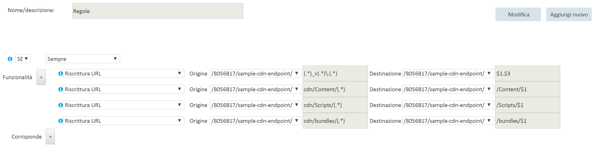

# <a name="content-delivery-network"></a><span data-ttu-id="1bb60-103">Rete per la distribuzione di contenuti (CDN)</span><span class="sxs-lookup"><span data-stu-id="1bb60-103">Content Delivery Network</span></span>
[!INCLUDE [header](../_includes/header.md)]

<span data-ttu-id="1bb60-104">La Rete di distribuzione dei contenuti di Microsoft Azure (CDN) offre agli sviluppatori una soluzione globale per distribuire contenuti a larghezza di banda elevata ospitati in Azure o in altre posizioni.</span><span class="sxs-lookup"><span data-stu-id="1bb60-104">The Microsoft Azure Content Delivery Network (CDN) offers developers a global solution for delivering high-bandwidth content that is hosted in Azure or any other location.</span></span> <span data-ttu-id="1bb60-105">Con la rete CDN è possibile memorizzare nella cache gli oggetti disponibili pubblicamente caricati dall'archivio BLOB di Azure un'applicazione Web, una macchina virtuale, una cartella dell'applicazione o altre posizioni HTTP/HTTPS.</span><span class="sxs-lookup"><span data-stu-id="1bb60-105">Using the CDN, you can cache publicly available objects loaded from Azure blob storage, a web application, virtual machine, application folder, or other HTTP/HTTPS location.</span></span> <span data-ttu-id="1bb60-106">La cache della rete CDN può essere mantenuta in posizioni strategiche per fornire la larghezza di banda massima per la distribuzione di contenuto agli utenti.</span><span class="sxs-lookup"><span data-stu-id="1bb60-106">The CDN cache can be held at strategic locations to provide maximum bandwidth for delivering content to users.</span></span> <span data-ttu-id="1bb60-107">In genere, la rete CDN viene usata per recapitare contenuto statico come immagini, fogli di stile, documenti, file script sul lato client e pagine HTML.</span><span class="sxs-lookup"><span data-stu-id="1bb60-107">The CDN is typically used for delivering static content such as images, style sheets, documents, files, client-side scripts, and HTML pages.</span></span>

<span data-ttu-id="1bb60-108">È anche possibile usare la rete CDN come una cache per la distribuzione di contenuto dinamico, ad esempio un report PDF o un grafico sulla base di input specificati. Se gli stessi valori di input sono forniti da utenti diversi, il risultato sarà lo stesso.</span><span class="sxs-lookup"><span data-stu-id="1bb60-108">You can also use the CDN as a cache for serving dynamic content, such as a PDF report or graph based on specified inputs; if the same input values are provided by different users the result should be the same.</span></span>

<span data-ttu-id="1bb60-109">I principali vantaggi dell'uso della rete CDN sono una latenza più bassa e la distribuzione più rapida di contenuto agli utenti, indipendentemente dalla loro posizione geografica in relazione al data center in cui è ospitata l'applicazione.</span><span class="sxs-lookup"><span data-stu-id="1bb60-109">The major advantages of using the CDN are lower latency and faster delivery of content to users irrespective of their geographical location in relation to the datacenter where the application is hosted.</span></span>  


<span data-ttu-id="1bb60-111">L'uso della rete CDN sarà utile anche per ridurre il carico sull'applicazione, perché diminuisce l'elaborazione richiesta per accedere al contenuto e distribuirlo.</span><span class="sxs-lookup"><span data-stu-id="1bb60-111">Using the CDN should also help to reduce the load on application because it is relieved of the processing required to access and deliver the content.</span></span> <span data-ttu-id="1bb60-112">La riduzione del carico può contribuire a migliorare le prestazioni e la scalabilità dell'applicazione, nonché a diminuire i costi di hosting riducendo le risorse di elaborazione necessarie per ottenere un livello specifico di prestazioni e disponibilità.</span><span class="sxs-lookup"><span data-stu-id="1bb60-112">This reduction in load can help to increase the performance and scalability of the application, as well as minimizing hosting costs by reducing the processing resources required to achieve a specific level of performance and availability.</span></span>

## <a name="how-and-why-a-cdn-is-used"></a><span data-ttu-id="1bb60-113">Come e perché si usa la rete CDN</span><span class="sxs-lookup"><span data-stu-id="1bb60-113">How and why a CDN is used</span></span>
<span data-ttu-id="1bb60-114">Ecco alcuni usi tipici della rete CDN:</span><span class="sxs-lookup"><span data-stu-id="1bb60-114">Typical uses for a CDN include:</span></span>  

* <span data-ttu-id="1bb60-115">Distribuzione di risorse statiche per applicazioni client, spesso da un sito Web.</span><span class="sxs-lookup"><span data-stu-id="1bb60-115">Delivering static resources for client applications, often from a website.</span></span> <span data-ttu-id="1bb60-116">Può trattarsi di immagini, fogli di stile, documenti, file, script sul lato client, pagine HTML, frammenti HTML o qualsiasi altro contenuto che il server non debba modificare per ogni richiesta.</span><span class="sxs-lookup"><span data-stu-id="1bb60-116">These resources can be images, style sheets, documents, files, client-side scripts, HTML pages, HTML fragments, or any other content that the server does not need to modify for each request.</span></span> <span data-ttu-id="1bb60-117">L'applicazione può creare gli elementi al runtime e renderli disponibili per la rete CDN (ad esempio, creando un elenco di titoli di notizie correnti), ma esegue queste operazioni per ogni richiesta.</span><span class="sxs-lookup"><span data-stu-id="1bb60-117">The application can create items at runtime and make them available to the CDN (for example, by creating a list of current news headlines), but it does not do so for each request.</span></span>
* <span data-ttu-id="1bb60-118">Distribuzione di contenuto statico e condiviso pubblico a dispositivi quali telefoni cellulari e tablet PC.</span><span class="sxs-lookup"><span data-stu-id="1bb60-118">Delivering public static and shared content to devices such as mobile phones and tablet computers.</span></span> <span data-ttu-id="1bb60-119">L'applicazione stessa è un servizio Web che offre un'API ai client in esecuzione sui vari dispositivi.</span><span class="sxs-lookup"><span data-stu-id="1bb60-119">The application itself is a web service that offers an API to clients running on the various devices.</span></span> <span data-ttu-id="1bb60-120">La rete CDN può anche recapitare set di dati statici, tramite il servizio Web, che i client useranno, ad esempio, per generare la propria interfaccia utente.</span><span class="sxs-lookup"><span data-stu-id="1bb60-120">The CDN can also deliver static datasets (via the web service) for the clients to use, perhaps to generate the client UI.</span></span> <span data-ttu-id="1bb60-121">Ad esempio, la rete CDN può essere usata per distribuire documenti JSON o XML.</span><span class="sxs-lookup"><span data-stu-id="1bb60-121">For example, the CDN could be used to distribute JSON or XML documents.</span></span>
* <span data-ttu-id="1bb60-122">Distribuzione di interi siti Web costituiti da solo contenuto pubblico statico ai client, senza richiedere risorse di calcolo dedicate.</span><span class="sxs-lookup"><span data-stu-id="1bb60-122">Serving entire websites that consist of only public static content to clients, without requiring any dedicated compute resources.</span></span>
* <span data-ttu-id="1bb60-123">File video in streaming al client on demand.</span><span class="sxs-lookup"><span data-stu-id="1bb60-123">Streaming video files to the client on demand.</span></span> <span data-ttu-id="1bb60-124">I video traggono vantaggio dalla latenza bassa e dalla connettività affidabile disponibili nei centri dati di tutto il mondo che offrono connessioni di rete CDN.</span><span class="sxs-lookup"><span data-stu-id="1bb60-124">Video benefits from the low latency and reliable connectivity available from the globally located datacenters that offer CDN connections.</span></span> <span data-ttu-id="1bb60-125">Servizi multimediali di Microsoft Azure si integra con la rete di distribuzione dei contenuti di Azure per inviare i contenuti direttamente alla rete di distribuzione dei contenuti al fine di eseguire una nuova distribuzione.</span><span class="sxs-lookup"><span data-stu-id="1bb60-125">Microsoft Azure Media Services (AMS) integrates with Azure CDN to deliver content directly to the CDN for further distribution.</span></span> <span data-ttu-id="1bb60-126">Per altre informazioni, vedere [Streaming endpoints overview](/azure/media-services/media-services-streaming-endpoints-overview) (Panoramica degli endpoint di streaming).</span><span class="sxs-lookup"><span data-stu-id="1bb60-126">For more information, see [Streaming endpoints overview](/azure/media-services/media-services-streaming-endpoints-overview).</span></span>
* <span data-ttu-id="1bb60-127">Miglioramento generale dell'esperienza per gli utenti, specialmente quelli che si trovano lontano dal data center che ospita l'applicazione,</span><span class="sxs-lookup"><span data-stu-id="1bb60-127">Generally improving the experience for users, especially those located far from the datacenter hosting the application.</span></span> <span data-ttu-id="1bb60-128">che altrimenti risentirebbero di una latenza più elevata.</span><span class="sxs-lookup"><span data-stu-id="1bb60-128">These users might otherwise suffer higher latency.</span></span> <span data-ttu-id="1bb60-129">Gran parte della dimensione totale del contenuto in un'applicazione Web è spesso statica e l’utilizzo della rete CDN consente di mantenere le prestazioni e l’esperienza complessiva dell’utente eliminando la necessità di distribuire l'applicazione in più centri dati.</span><span class="sxs-lookup"><span data-stu-id="1bb60-129">A large proportion of the total size of the content in a web application is often static, and using the CDN can help to maintain performance and overall user experience while eliminating the requirement to deploy the application to multiple data centers.</span></span>
* <span data-ttu-id="1bb60-130">Gestione del carico crescente sulle applicazioni che supportano soluzioni IoT (Internet of Things).</span><span class="sxs-lookup"><span data-stu-id="1bb60-130">Handling the growing load on applications that support IoT (Internet of Things) solutions.</span></span> <span data-ttu-id="1bb60-131">L'enorme numero di dispositivi e appliance interessati può facilmente sovraccaricare un'applicazione se fosse necessario elaborare i messaggi trasmessi e gestire direttamente la distribuzione degli aggiornamenti firmware a ogni dispositivo.</span><span class="sxs-lookup"><span data-stu-id="1bb60-131">The huge numbers of such devices and appliances involved could easily overwhelm an application if it was required to process broadcast messages and manage firmware update distribution directly to each device.</span></span>
* <span data-ttu-id="1bb60-132">Gestione dei picchi e della crescita della domanda senza richiedere il ridimensionamento dell'applicazione, evitando il conseguente aumento dei costi di esecuzione.</span><span class="sxs-lookup"><span data-stu-id="1bb60-132">Coping with peaks and surges in demand without requiring the application to scale, avoiding the consequent increased running costs.</span></span> <span data-ttu-id="1bb60-133">Ad esempio, quando viene rilasciato un aggiornamento del sistema operativo per un dispositivo hardware, come un modello specifico di router, o per un dispositivo di consumo come una smart TV, si verifica un grande picco nella domanda a causa del download eseguito da milioni di utenti e dispositivi in un breve periodo.</span><span class="sxs-lookup"><span data-stu-id="1bb60-133">For example, when an update to an operating system is released for a hardware device such as a specific model of router, or for a consumer device such as a smart TV, there will be a huge peak in demand as it is downloaded by millions of users and devices over a short period.</span></span>

<span data-ttu-id="1bb60-134">L'elenco seguente include esempi di tempi per il primo byte (TTFB), da diverse aree geografiche.</span><span class="sxs-lookup"><span data-stu-id="1bb60-134">The following list shows examples of the median time to first byte from various geographic locations.</span></span> <span data-ttu-id="1bb60-135">Il ruolo Web di destinazione viene distribuito in Azure West US.</span><span class="sxs-lookup"><span data-stu-id="1bb60-135">The target web role is deployed to Azure West US.</span></span> <span data-ttu-id="1bb60-136">Esiste una stretta correlazione tra un boost maggiore dovuto alla rete CDN e la vicinanza a un nodo della rete CDN.</span><span class="sxs-lookup"><span data-stu-id="1bb60-136">There is a strong correlation between greater boost due to the CDN and proximity to a CDN node.</span></span> <span data-ttu-id="1bb60-137">Per un elenco completo delle posizioni dei nodi della rete CDN, vedere [Posizione dei nodi nella rete per la distribuzione di contenuti (CDN) di Azure](/azure/cdn/cdn-pop-locations/).</span><span class="sxs-lookup"><span data-stu-id="1bb60-137">A complete list of Azure CDN node locations is available at [Azure Content Delivery Network (CDN) Node Locations](/azure/cdn/cdn-pop-locations/).</span></span>

|  | <span data-ttu-id="1bb60-138">Tempi (ms) per il primo byte (origine)</span><span class="sxs-lookup"><span data-stu-id="1bb60-138">Time (ms) to First Byte (Origin)</span></span> | <span data-ttu-id="1bb60-139">Tempi (ms) per il primo byte (CDN)</span><span class="sxs-lookup"><span data-stu-id="1bb60-139">Time (ms) to First (CDN)</span></span> | <span data-ttu-id="1bb60-140">% miglioramento tempi CDN</span><span class="sxs-lookup"><span data-stu-id="1bb60-140">%CDN time improvement</span></span> |
| --- | --- | --- | --- |
| <span data-ttu-id="1bb60-141">\*San Jose, CA</span><span class="sxs-lookup"><span data-stu-id="1bb60-141">\*San Jose, CA</span></span> |<span data-ttu-id="1bb60-142">47.5</span><span class="sxs-lookup"><span data-stu-id="1bb60-142">47.5</span></span> |<span data-ttu-id="1bb60-143">46.5</span><span class="sxs-lookup"><span data-stu-id="1bb60-143">46.5</span></span> |<span data-ttu-id="1bb60-144">2%</span><span class="sxs-lookup"><span data-stu-id="1bb60-144">2%</span></span> |
| <span data-ttu-id="1bb60-145">\*\*Dulles, VA</span><span class="sxs-lookup"><span data-stu-id="1bb60-145">\*\*Dulles, VA</span></span> |<span data-ttu-id="1bb60-146">109</span><span class="sxs-lookup"><span data-stu-id="1bb60-146">109</span></span> |<span data-ttu-id="1bb60-147">40.5</span><span class="sxs-lookup"><span data-stu-id="1bb60-147">40.5</span></span> |<span data-ttu-id="1bb60-148">169%</span><span class="sxs-lookup"><span data-stu-id="1bb60-148">169%</span></span> |
| <span data-ttu-id="1bb60-149">Buenos Aires, AR</span><span class="sxs-lookup"><span data-stu-id="1bb60-149">Buenos Aires, AR</span></span> |<span data-ttu-id="1bb60-150">210</span><span class="sxs-lookup"><span data-stu-id="1bb60-150">210</span></span> |<span data-ttu-id="1bb60-151">151</span><span class="sxs-lookup"><span data-stu-id="1bb60-151">151</span></span> |<span data-ttu-id="1bb60-152">39%</span><span class="sxs-lookup"><span data-stu-id="1bb60-152">39%</span></span> |
| <span data-ttu-id="1bb60-153">\*Londra, Regno Unito</span><span class="sxs-lookup"><span data-stu-id="1bb60-153">\*London, UK</span></span> |<span data-ttu-id="1bb60-154">195</span><span class="sxs-lookup"><span data-stu-id="1bb60-154">195</span></span> |<span data-ttu-id="1bb60-155">44</span><span class="sxs-lookup"><span data-stu-id="1bb60-155">44</span></span> |<span data-ttu-id="1bb60-156">343%</span><span class="sxs-lookup"><span data-stu-id="1bb60-156">343%</span></span> |
| <span data-ttu-id="1bb60-157">Shanghai, CN</span><span class="sxs-lookup"><span data-stu-id="1bb60-157">Shanghai, CN</span></span> |<span data-ttu-id="1bb60-158">242</span><span class="sxs-lookup"><span data-stu-id="1bb60-158">242</span></span> |<span data-ttu-id="1bb60-159">206</span><span class="sxs-lookup"><span data-stu-id="1bb60-159">206</span></span> |<span data-ttu-id="1bb60-160">17%</span><span class="sxs-lookup"><span data-stu-id="1bb60-160">17%</span></span> |
| <span data-ttu-id="1bb60-161">\*Singapore</span><span class="sxs-lookup"><span data-stu-id="1bb60-161">\*Singapore</span></span> |<span data-ttu-id="1bb60-162">214</span><span class="sxs-lookup"><span data-stu-id="1bb60-162">214</span></span> |<span data-ttu-id="1bb60-163">74</span><span class="sxs-lookup"><span data-stu-id="1bb60-163">74</span></span> |<span data-ttu-id="1bb60-164">189%</span><span class="sxs-lookup"><span data-stu-id="1bb60-164">189%</span></span> |
| <span data-ttu-id="1bb60-165">\*Tokyo, JP</span><span class="sxs-lookup"><span data-stu-id="1bb60-165">\*Tokyo, JP</span></span> |<span data-ttu-id="1bb60-166">163</span><span class="sxs-lookup"><span data-stu-id="1bb60-166">163</span></span> |<span data-ttu-id="1bb60-167">48</span><span class="sxs-lookup"><span data-stu-id="1bb60-167">48</span></span> |<span data-ttu-id="1bb60-168">204%</span><span class="sxs-lookup"><span data-stu-id="1bb60-168">204%</span></span> |
| <span data-ttu-id="1bb60-169">Seoul, KR</span><span class="sxs-lookup"><span data-stu-id="1bb60-169">Seoul, KR</span></span> |<span data-ttu-id="1bb60-170">190</span><span class="sxs-lookup"><span data-stu-id="1bb60-170">190</span></span> |<span data-ttu-id="1bb60-171">190</span><span class="sxs-lookup"><span data-stu-id="1bb60-171">190</span></span> |<span data-ttu-id="1bb60-172">0%</span><span class="sxs-lookup"><span data-stu-id="1bb60-172">0%</span></span> |

<span data-ttu-id="1bb60-173">\* Ha un nodo di rete CDN di Azure nella stessa città.</span><span class="sxs-lookup"><span data-stu-id="1bb60-173">\* Has an Azure CDN node in the same city.</span></span>  
<span data-ttu-id="1bb60-174">\*\* Ha un nodo di rete CDN di Azure in una città adiacente.</span><span class="sxs-lookup"><span data-stu-id="1bb60-174">\*\* Has an Azure CDN node in a neighboring city.</span></span>  

## <a name="challenges"></a><span data-ttu-id="1bb60-175">Problematiche</span><span class="sxs-lookup"><span data-stu-id="1bb60-175">Challenges</span></span>
<span data-ttu-id="1bb60-176">Esistono varie problematiche da considerare quando si intende utilizzare la rete CDN:</span><span class="sxs-lookup"><span data-stu-id="1bb60-176">There are several challenges to take into account when planning to use the CDN:</span></span>  

* <span data-ttu-id="1bb60-177">**Distribuzione**.</span><span class="sxs-lookup"><span data-stu-id="1bb60-177">**Deployment**.</span></span> <span data-ttu-id="1bb60-178">Decidere l'origine da cui la rete CDN recupera il contenuto e se è necessario distribuire il contenuto in più di un sistema di archiviazione, ad esempio nella rete CDN e in una posizione alternativa.</span><span class="sxs-lookup"><span data-stu-id="1bb60-178">Decide the origin from which the CDN fetches the content, and whether you need to deploy the content in more than one storage system (such as in the CDN and an alternative location).</span></span>

  <span data-ttu-id="1bb60-179">Il meccanismo di distribuzione delle applicazioni deve tener conto del processo per la distribuzione di contenuto statico e risorse, nonché dei file dell'applicazione, ad esempio le pagine ASPX.</span><span class="sxs-lookup"><span data-stu-id="1bb60-179">Your application deployment mechanism must take into account the process for deploying static content and resources as well as deploying the application files, such as ASPX pages.</span></span> <span data-ttu-id="1bb60-180">Ad esempio, potrebbe essere necessario implementare un passaggio separato per caricare il contenuto nell'archivio BLOB di Azure.</span><span class="sxs-lookup"><span data-stu-id="1bb60-180">For example, you may need to implement a separate step to load content into Azure blob storage.</span></span>
* <span data-ttu-id="1bb60-181">**Controllo delle versioni e controllo della cache**.</span><span class="sxs-lookup"><span data-stu-id="1bb60-181">**Versioning and cache-control**.</span></span> <span data-ttu-id="1bb60-182">Stabilire come aggiornare il contenuto statico e distribuire le nuove versioni.</span><span class="sxs-lookup"><span data-stu-id="1bb60-182">Consider how you will update static content and deploy new versions.</span></span> <span data-ttu-id="1bb60-183">Il contenuto della rete CDN può essere [eliminato definitivamente](/azure/cdn/cdn-purge-endpoint/) tramite il portale di Azure quando sono disponibili nuove versioni degli asset.</span><span class="sxs-lookup"><span data-stu-id="1bb60-183">The CDN content may be [purged](/azure/cdn/cdn-purge-endpoint/) using the Azure portal when new versions of your assets are available.</span></span> <span data-ttu-id="1bb60-184">Questo è un problema simile alla gestione della cache sul lato client, come quello che si verifica in un Web browser.</span><span class="sxs-lookup"><span data-stu-id="1bb60-184">This is a similar challenge to managing client-side caching, such as that which occurs in a web browser.</span></span>
* <span data-ttu-id="1bb60-185">**Test**.</span><span class="sxs-lookup"><span data-stu-id="1bb60-185">**Testing**.</span></span> <span data-ttu-id="1bb60-186">Può essere difficile eseguire il test locale delle impostazioni della rete CDN durante lo sviluppo e la verifica di un'applicazione in locale o in un ambiente di staging.</span><span class="sxs-lookup"><span data-stu-id="1bb60-186">It can be difficult to perform local testing of your CDN settings when developing and testing an application locally or in a staging environment.</span></span>
* <span data-ttu-id="1bb60-187">**Ottimizzazione motore di ricerca**.</span><span class="sxs-lookup"><span data-stu-id="1bb60-187">**Search engine optimization (SEO)**.</span></span> <span data-ttu-id="1bb60-188">Il contenuto, come immagini e documenti, viene fornito da un dominio diverso quando si usa la rete CDN</span><span class="sxs-lookup"><span data-stu-id="1bb60-188">Content such as images and documents are served from a different domain when you use the CDN.</span></span> <span data-ttu-id="1bb60-189">e questo approccio può avere un impatto su SEO per tale contenuto.</span><span class="sxs-lookup"><span data-stu-id="1bb60-189">This can have an effect on SEO for this content.</span></span>
* <span data-ttu-id="1bb60-190">**Sicurezza del contenuto**.</span><span class="sxs-lookup"><span data-stu-id="1bb60-190">**Content security**.</span></span> <span data-ttu-id="1bb60-191">Molti servizi CDN come la rete CDN di Azure non offrono attualmente alcun tipo di controllo di accesso al contenuto.</span><span class="sxs-lookup"><span data-stu-id="1bb60-191">Many CDN services such as Azure CDN do not currently offer any type of access control for the content.</span></span>
* <span data-ttu-id="1bb60-192">**Sicurezza del client**.</span><span class="sxs-lookup"><span data-stu-id="1bb60-192">**Client security**.</span></span> <span data-ttu-id="1bb60-193">I client possono connettersi da un ambiente che non consente l'accesso alle risorse nella rete CDN.</span><span class="sxs-lookup"><span data-stu-id="1bb60-193">Clients might connect from an environment that does not allow access to resources on the CDN.</span></span> <span data-ttu-id="1bb60-194">Potrebbe trattarsi di un ambiente con limitazioni di sicurezza che limita l'accesso solo a una serie di origini note oppure di un ambiente che impedisce il caricamento delle risorse da una posizione diversa dall'origine della pagina.</span><span class="sxs-lookup"><span data-stu-id="1bb60-194">This could be a security-constrained environment that limits access to only a set of known sources, or one that prevents loading of resources from anything other than the page origin.</span></span> <span data-ttu-id="1bb60-195">Per gestire questi casi è necessaria un'implementazione del fallback.</span><span class="sxs-lookup"><span data-stu-id="1bb60-195">A fallback implementation is required to handle these cases.</span></span>
* <span data-ttu-id="1bb60-196">**Resilienza**.</span><span class="sxs-lookup"><span data-stu-id="1bb60-196">**Resilience**.</span></span> <span data-ttu-id="1bb60-197">La rete CDN è un singolo punto di guasto potenziale per un'applicazione.</span><span class="sxs-lookup"><span data-stu-id="1bb60-197">The CDN is a potential single point of failure for an application.</span></span> <span data-ttu-id="1bb60-198">Presenta un contratto di servizio della disponibilità inferiore all’archiviazione BLOB (che può essere utilizzata per distribuire contenuto direttamente), per cui potrebbe essere necessario implementare un meccanismo di fallback per il contenuto critico.</span><span class="sxs-lookup"><span data-stu-id="1bb60-198">It has a lower availability SLA than blob storage (which can be used to deliver content directly) so you may need to consider implementing a fallback mechanism for critical content.</span></span>

  <span data-ttu-id="1bb60-199">È possibile monitorare la disponibilità del contenuto della rete CDN, la larghezza di banda, i dati trasferiti, gli accessi, la percentuale di riscontri nella cache e la metrica della cache dal portale di Azure in [tempo reale](/azure/cdn/cdn-real-time-stats/) e [aggregare i report](/azure/cdn/cdn-analyze-usage-patterns/).</span><span class="sxs-lookup"><span data-stu-id="1bb60-199">You can monitor your CDN content availability, bandwidth, data transferred, hits, cache hit ratio, and cache metrics from the Azure portal in [real-time](/azure/cdn/cdn-real-time-stats/) and [aggregate reports](/azure/cdn/cdn-analyze-usage-patterns/).</span></span>

<span data-ttu-id="1bb60-200">Scenari in cui la rete CDN può essere meno utile sono:</span><span class="sxs-lookup"><span data-stu-id="1bb60-200">Scenarios where CDN may be less useful include:</span></span>  

* <span data-ttu-id="1bb60-201">Se il contenuto ha una bassa percentuale di riscontri, è possibile che l'accesso avvenga solo poche volte durante la sua validità, in base all'impostazione della durata (TTL).</span><span class="sxs-lookup"><span data-stu-id="1bb60-201">If the content has a low hit rate, it might be accessed only few times while it is valid (determined by its time-to-live setting).</span></span> <span data-ttu-id="1bb60-202">La prima volta che si scarica un elemento avviene l'addebito di due transazioni, dall'origine alla rete CDN e quindi dalla rete CDN al cliente.</span><span class="sxs-lookup"><span data-stu-id="1bb60-202">The first time an item is downloaded you incur two transaction charges from the origin to the CDN, and then from the CDN to the customer.</span></span>
* <span data-ttu-id="1bb60-203">Se i dati sono privati, ad esempio per aziende di grandi dimensioni o ecosistemi di supply chain.</span><span class="sxs-lookup"><span data-stu-id="1bb60-203">If the data is private, such as for large enterprises or supply chain ecosystems.</span></span>

## <a name="general-guidelines-and-good-practices"></a><span data-ttu-id="1bb60-204">Linee guida generali e procedure consigliate</span><span class="sxs-lookup"><span data-stu-id="1bb60-204">General guidelines and good practices</span></span>
<span data-ttu-id="1bb60-205">L’utilizzo della rete CDN è un ottimo modo per ridurre al minimo il carico sull'applicazione e ottimizzare disponibilità e prestazioni.</span><span class="sxs-lookup"><span data-stu-id="1bb60-205">Using the CDN is a good way to minimize the load on your application, and maximize availability and performance.</span></span> <span data-ttu-id="1bb60-206">Valutare l'adozione di questa strategia per tutto il contenuto appropriato e le risorse usate dall'applicazione.</span><span class="sxs-lookup"><span data-stu-id="1bb60-206">Consider adopting this strategy for all of the appropriate content and resources your application uses.</span></span> <span data-ttu-id="1bb60-207">Quando si progetta la strategia per l'uso della rete CDN, considerare i punti nelle sezioni seguenti:</span><span class="sxs-lookup"><span data-stu-id="1bb60-207">Consider the points in the following sections when designing your strategy to use the CDN:</span></span>  

### <a name="origin"></a><span data-ttu-id="1bb60-208">Origine</span><span class="sxs-lookup"><span data-stu-id="1bb60-208">Origin</span></span>
<span data-ttu-id="1bb60-209">La distribuzione del contenuto attraverso la rete CDN richiede semplicemente di specificare un endpoint HTTP e/o HTTPS che il servizio della rete CDN userà per accedere al contenuto e memorizzarlo nella cache.</span><span class="sxs-lookup"><span data-stu-id="1bb60-209">Deploying content through the CDN simply requires you to specify an HTTP and/or HTTPS endpoint that the CDN service will use to access and cache the content.</span></span>

<span data-ttu-id="1bb60-210">L'endpoint può specificare un contenitore di archiviazione BLOB di Azure che include il contenuto statico da recapitare attraverso la rete CDN.</span><span class="sxs-lookup"><span data-stu-id="1bb60-210">The endpoint can specify an Azure blob storage container that holds the static content you want to deliver through the CDN.</span></span> <span data-ttu-id="1bb60-211">Il contenitore deve essere contrassegnato come pubblico.</span><span class="sxs-lookup"><span data-stu-id="1bb60-211">The container must be marked as public.</span></span> <span data-ttu-id="1bb60-212">Solo i BLOB di un contenitore pubblico con accesso in lettura sono disponibili tramite la rete CDN.</span><span class="sxs-lookup"><span data-stu-id="1bb60-212">Only blobs in a public container that have public read access are available through the CDN.</span></span>

<span data-ttu-id="1bb60-213">L'endpoint può specificare una cartella denominata **cdn** nella radice di uno dei livelli di calcolo dell'applicazione, ad esempio un ruolo Web o una macchina virtuale.</span><span class="sxs-lookup"><span data-stu-id="1bb60-213">The endpoint can specify a folder named **cdn** in the root of one of application’s compute layers (such as a web role or a virtual machine).</span></span> <span data-ttu-id="1bb60-214">I risultati dalle richieste di risorse, tra cui le risorse dinamiche, ad esempio le pagine ASPX, verranno memorizzati nella cache nella rete CDN.</span><span class="sxs-lookup"><span data-stu-id="1bb60-214">The results from requests for resources, including dynamic resources such as ASPX pages, will be cached on the CDN.</span></span> <span data-ttu-id="1bb60-215">Il periodo minimo di memorizzazione nella cache è 300 secondi.</span><span class="sxs-lookup"><span data-stu-id="1bb60-215">The minimum cache period is 300 seconds.</span></span> <span data-ttu-id="1bb60-216">Un periodo più breve impedirà la distribuzione del contenuto nella rete CDN. Per altre informazioni, vedere la sezione *Controllo cache* di seguito.</span><span class="sxs-lookup"><span data-stu-id="1bb60-216">Any shorter period prevents the content from being deployed to the CDN (for more information, see the following heading *Cache control* below).</span></span>

<span data-ttu-id="1bb60-217">Se si usa App Web di Azure, l'endpoint viene impostato sulla cartella radice del sito selezionando il sito quando si crea l'istanza di rete CDN.</span><span class="sxs-lookup"><span data-stu-id="1bb60-217">If you are using Azure Web Apps, the endpoint is set to the root folder of the site by selecting the site when creating the CDN instance.</span></span> <span data-ttu-id="1bb60-218">Tutto il contenuto per il sito sarà disponibile tramite la rete CDN.</span><span class="sxs-lookup"><span data-stu-id="1bb60-218">All of the content for the site will be available through the CDN.</span></span>

<span data-ttu-id="1bb60-219">Nella maggior parte dei casi, puntando l'endpoint della rete CDN a una cartella in uno dei livelli di calcolo dell'applicazione si ottiene maggiore flessibilità e controllo.</span><span class="sxs-lookup"><span data-stu-id="1bb60-219">In most cases, pointing your CDN endpoint at a folder within one of the compute layers of your application offers more flexibility and control.</span></span> <span data-ttu-id="1bb60-220">Ad esempio, se semplifica la gestione dei requisiti di routing attuali e futuri e la generazione dinamica di contenuto statico, ad esempio delle anteprime delle immagini.</span><span class="sxs-lookup"><span data-stu-id="1bb60-220">For instance, it makes it easier to manage current and future routing requirements, and dynamically generate static content such as image thumbnails.</span></span>

<span data-ttu-id="1bb60-221">È possibile usare [stringhe di query](/azure/cdn/cdn-query-string/) per differenziare gli oggetti nella cache quando il contenuto viene fornito da origini dinamiche, come le pagine ASPX.</span><span class="sxs-lookup"><span data-stu-id="1bb60-221">You can use [query strings](/azure/cdn/cdn-query-string/) to differentiate objects in the cache when content is delivered from dynamic sources, such as ASPX pages.</span></span> <span data-ttu-id="1bb60-222">Tuttavia, questo comportamento può essere disabilitato da un'impostazione nel portale di Azure quando si specifica l'endpoint della rete CDN.</span><span class="sxs-lookup"><span data-stu-id="1bb60-222">However, this behavior can be disabled by a setting in the Azure portal when you specify the CDN endpoint.</span></span> <span data-ttu-id="1bb60-223">Durante la distribuzione di contenuti dall'archiviazione BLOB, le stringhe di query vengono trattate come valori letterali stringa in modo che due elementi che hanno lo stesso nome ma stringhe di query diverse vengano archiviati come elementi separati sulla rete CDN.</span><span class="sxs-lookup"><span data-stu-id="1bb60-223">When delivering content from blob storage, query strings are treated as string literals so two items that have the same name but different query strings are stored as separate items on the CDN.</span></span>

<span data-ttu-id="1bb60-224">È possibile usare la riscrittura URL per le risorse, ad esempio script e altro contenuto, per evitare di spostare i file nella cartella di origine della rete CDN.</span><span class="sxs-lookup"><span data-stu-id="1bb60-224">You can utilize URL rewriting for resources, such as scripts and other content, to avoid moving your files to the CDN origin folder.</span></span>

<span data-ttu-id="1bb60-225">Quando si usano i BLOB di archiviazione di Azure per memorizzare il contenuto della rete CDN, l'URL delle risorse nei BLOB riconosce la differenza tra maiuscole e minuscole per il nome del contenitore e del BLOB.</span><span class="sxs-lookup"><span data-stu-id="1bb60-225">When using Azure storage blobs to hold content for the CDN, the URL of the resources in blobs is case-sensitive for the container and blob name.</span></span>

<span data-ttu-id="1bb60-226">Quando si usano origini personalizzate o App Web di Azure, è necessario specificare il percorso dell'istanza della rete CDN nei collegamenti alle risorse.</span><span class="sxs-lookup"><span data-stu-id="1bb60-226">When using custom origins or Azure Web Apps, you specify the path to the CDN instance in the links to resources.</span></span> <span data-ttu-id="1bb60-227">Ad esempio, di seguito è specificato un file di immagine nella cartella **Images** del sito che verrà distribuito tramite la rete CDN:</span><span class="sxs-lookup"><span data-stu-id="1bb60-227">For example, the following specifies an image file in the **Images** folder of the site that will be delivered through the CDN:</span></span>

```XML

```

### <a name="deployment"></a><span data-ttu-id="1bb60-228">Distribuzione</span><span class="sxs-lookup"><span data-stu-id="1bb60-228">Deployment</span></span>
<span data-ttu-id="1bb60-229">È possibile che debba essere effettuato il provisioning e sia necessario distribuire il contenuto indipendentemente dall'applicazione se non viene incluso nel processo o nel pacchetto di distribuzione dell'applicazione.</span><span class="sxs-lookup"><span data-stu-id="1bb60-229">Static content may need to be provisioned and deployed independently from the application if you do not include it in the application deployment package or process.</span></span> <span data-ttu-id="1bb60-230">Si consideri come tale eventualità influirà sull’approccio del controllo delle versioni utilizzato per gestire i componenti dell'applicazione e il contenuto stativo della risorsa.</span><span class="sxs-lookup"><span data-stu-id="1bb60-230">Consider how this will affect the versioning approach you use to manage both the application components and the static resource content.</span></span>

<span data-ttu-id="1bb60-231">Valutare la modalità di gestione dell’aggregazione in bundle (combinazione di diversi file in un solo file) e minimizzazione (rimozione di caratteri non necessari, ad esempio spazi, caratteri di nuova riga, commenti e così via) per i file CSS e script.</span><span class="sxs-lookup"><span data-stu-id="1bb60-231">Consider how bundling (combining several files into one file) and minification (removing unnecessary characters such as white space, new line characters, comments, and other characters) for script and CSS files will be handled.</span></span> <span data-ttu-id="1bb60-232">Queste tecniche sono comunemente usate per ridurre i tempi di caricamento per i client e sono compatibili con la distribuzione del contenuto tramite la rete CDN.</span><span class="sxs-lookup"><span data-stu-id="1bb60-232">These are commonly used techniques that can reduce load times for clients, and are compatible with delivering content through the CDN.</span></span> <span data-ttu-id="1bb60-233">Per ulteriori informazioni, vedere [Creazione di bundle e minimizzazione](http://www.asp.net/mvc/tutorials/mvc-4/bundling-and-minification).</span><span class="sxs-lookup"><span data-stu-id="1bb60-233">For more information, see [Bundling and Minification](http://www.asp.net/mvc/tutorials/mvc-4/bundling-and-minification).</span></span>

<span data-ttu-id="1bb60-234">Se è necessario distribuire il contenuto in un'altra posizione, è necessario un passaggio aggiuntivo nel processo di distribuzione.</span><span class="sxs-lookup"><span data-stu-id="1bb60-234">If you need to deploy the content to an additional location, this will be an extra step in the deployment process.</span></span> <span data-ttu-id="1bb60-235">Se l'applicazione aggiorna il contenuto per la rete CDN, ad esempio a intervalli regolari o in risposta a un evento, è necessario archiviare il contenuto aggiornato in tutti i percorsi aggiuntivi, nonché l'endpoint per la rete CDN.</span><span class="sxs-lookup"><span data-stu-id="1bb60-235">If the application updates the content for the CDN, perhaps at regular intervals or in response to an event, it must store the updated content in any additional locations as well as the endpoint for the CDN.</span></span>

<span data-ttu-id="1bb60-236">Non è possibile configurare un endpoint della rete CDN per un'applicazione nell'emulatore di Azure locale in Visual Studio.</span><span class="sxs-lookup"><span data-stu-id="1bb60-236">You cannot set up a CDN endpoint for an application in the local Azure emulator in Visual Studio.</span></span> <span data-ttu-id="1bb60-237">Questa operazione influirà su unit test, test funzionali e test pre-distribuzione finali.</span><span class="sxs-lookup"><span data-stu-id="1bb60-237">This restriction will affect unit testing, functional testing, and final pre-deployment testing.</span></span> <span data-ttu-id="1bb60-238">È necessario consentirla implementando un meccanismo alternativo.</span><span class="sxs-lookup"><span data-stu-id="1bb60-238">You must allow for this by implementing an alternative mechanism.</span></span> <span data-ttu-id="1bb60-239">Ad esempio, è possibile pre-distribuire il contenuto nella rete CDN usando un'applicazione o un'utilità personalizzata ed eseguire i test durante il periodo in cui è memorizzato nella cache.</span><span class="sxs-lookup"><span data-stu-id="1bb60-239">For example, you could pre-deploy the content to the CDN using a custom application or utility, and perform testing during the period in which it is cached.</span></span> <span data-ttu-id="1bb60-240">In alternativa, usare direttive di compilazione o costanti globali per controllare l'origine da cui l'applicazione carica le risorse.</span><span class="sxs-lookup"><span data-stu-id="1bb60-240">Alternatively, use compile directives or global constants to control from where the application loads the resources.</span></span> <span data-ttu-id="1bb60-241">Ad esempio, durante l'esecuzione in modalità di debug potrebbe caricare risorse quali i bundle di script lato client e altri contenuti da una cartella locale e utilizzare la rete CDN durante l'esecuzione in modalità di rilascio.</span><span class="sxs-lookup"><span data-stu-id="1bb60-241">For example, when running in debug mode it could load resources such as client-side script bundles and other content from a local folder, and use the CDN when running in release mode.</span></span>

<span data-ttu-id="1bb60-242">Determinare quale approccio di compressione dovrà supportare la rete CDN:</span><span class="sxs-lookup"><span data-stu-id="1bb60-242">Consider which compression approach you want your CDN to support:</span></span>

* <span data-ttu-id="1bb60-243">È possibile [abilitare la compressione](/azure/cdn/cdn-improve-performance/) nel server di origine, nel qual caso la rete CDN supporterà la compressione per impostazione predefinita e distribuirà file compressi ai client, in un formato come ZIP o GZIP.</span><span class="sxs-lookup"><span data-stu-id="1bb60-243">You can [enable compression](/azure/cdn/cdn-improve-performance/) on your origin server, in which case the CDN will support compression by default and deliver compressed content to clients in a format such as zip or gzip.</span></span> <span data-ttu-id="1bb60-244">Quando si usa una cartella dell'applicazione come endpoint della rete CDN, il server può comprimere il contenuto automaticamente come quando viene distribuito direttamente a un Web browser o a un altro tipo di client.</span><span class="sxs-lookup"><span data-stu-id="1bb60-244">When using an application folder as the CDN endpoint, the server may compress some content automatically in the same way as when delivering it directly to a web browser or other type of client.</span></span> <span data-ttu-id="1bb60-245">Il formato dipende dal valore dell'intestazione **Accept-Encoding** nella richiesta inviata dal client.</span><span class="sxs-lookup"><span data-stu-id="1bb60-245">The format depends on the value of the **Accept-Encoding** header in the request sent by the client.</span></span> <span data-ttu-id="1bb60-246">In Azure il meccanismo predefinito prevede la compressione automatica del contenuto quando l'utilizzo della CPU è inferiore al 50%.</span><span class="sxs-lookup"><span data-stu-id="1bb60-246">In Azure the default mechanism is to automatically compress content when CPU utilization is below 50%.</span></span> <span data-ttu-id="1bb60-247">Se si usa un servizio cloud per ospitare l'applicazione, la modifica delle impostazioni può richiedere l'uso di un'attività di avvio per attivare la compressione dell'output dinamico in IIS.</span><span class="sxs-lookup"><span data-stu-id="1bb60-247">If you are using a cloud service to host the application, changing the settings may require using a startup task to turn on compression of dynamic output in IIS.</span></span> <span data-ttu-id="1bb60-248">Per al,altre informazioni, vedere il blog relativo all' [abilitazione della compressione GZIP con la rete CDN di Microsoft Azure tramite un ruolo Web](http://blogs.msdn.com/b/avkashchauhan/archive/2012/03/05/enableing-gzip-compression-with-windows-azure-cdn-through-web-role.aspx) .</span><span class="sxs-lookup"><span data-stu-id="1bb60-248">See [Enabling gzip compression with Microsoft Azure CDN through a Web Role](http://blogs.msdn.com/b/avkashchauhan/archive/2012/03/05/enableing-gzip-compression-with-windows-azure-cdn-through-web-role.aspx) for more information.</span></span>
* <span data-ttu-id="1bb60-249">È possibile abilitare la compressione direttamente sui server edge CDN, nel qual caso la rete CDN comprimerà i file e li fornirà agli utenti finali.</span><span class="sxs-lookup"><span data-stu-id="1bb60-249">You can enable compression directly on CDN edge servers, in which case the CDN will compress the files and serve it to end users.</span></span> <span data-ttu-id="1bb60-250">Per altre informazioni, vedere [Compressione nella rete CDN di Azure](/azure/cdn/cdn-improve-performance/).</span><span class="sxs-lookup"><span data-stu-id="1bb60-250">For more information, see [Azure CDN Compression](/azure/cdn/cdn-improve-performance/).</span></span>

### <a name="routing-and-versioning"></a><span data-ttu-id="1bb60-251">Routing e controllo delle versioni</span><span class="sxs-lookup"><span data-stu-id="1bb60-251">Routing and versioning</span></span>
<span data-ttu-id="1bb60-252">Potrebbe essere necessario usare istanze diverse della rete CDN in momenti diversi.</span><span class="sxs-lookup"><span data-stu-id="1bb60-252">You may need to use different CDN instances at various times.</span></span> <span data-ttu-id="1bb60-253">Ad esempio, quando si distribuisce una nuova versione dell'applicazione, è consigliabile usare una nuova rete CDN e quella precedente, mantenendo il contenuto in un formato meno recente, per le versioni precedenti.</span><span class="sxs-lookup"><span data-stu-id="1bb60-253">For example, when you deploy a new version of the application you may want to use a new CDN and retain the old CDN (holding content in an older format) for previous versions.</span></span> <span data-ttu-id="1bb60-254">Se si usa l'archivio BLOB di Azure come origine di contenuto, è possibile creare un account di archiviazione separato o un contenitore separato e puntare l'endpoint della rete CDN ad esso.</span><span class="sxs-lookup"><span data-stu-id="1bb60-254">If you use Azure blob storage as the content origin, you can create a separate storage account or a separate container and point the CDN endpoint to it.</span></span> <span data-ttu-id="1bb60-255">Se si usa la cartella radice cdn all'interno dell'applicazione come endpoint della rete CDN è possibile usare tecniche di riscrittura degli URL per indirizzare le richieste a una cartella diversa.</span><span class="sxs-lookup"><span data-stu-id="1bb60-255">If you use the cdn root folder within the application as the CDN endpoint, you can use URL rewriting techniques to direct requests to a different folder.</span></span>

<span data-ttu-id="1bb60-256">Non usare la stringa di query per indicare le diverse versioni dell'applicazione nei collegamenti alle risorse sulla rete CDN, perché quando si recupera il contenuto dall'archivio BLOB di Azure la stringa di query fa parte del nome della risorsa, ovvero il nome del BLOB.</span><span class="sxs-lookup"><span data-stu-id="1bb60-256">Do not use the query string to denote different versions of the application in links to resources on the CDN because, when retrieving content from Azure blob storage, the query string is part of the resource name (the blob name).</span></span> <span data-ttu-id="1bb60-257">Questo approccio può anche influire sul modo in cui il client memorizza le risorse nella cache.</span><span class="sxs-lookup"><span data-stu-id="1bb60-257">This approach can also affect how the client caches resources.</span></span>

<span data-ttu-id="1bb60-258">La distribuzione di nuove versioni di contenuto statico quando si aggiorna un'applicazione può essere problematica se le risorse precedenti vengono memorizzate nella cache nella rete CDN.</span><span class="sxs-lookup"><span data-stu-id="1bb60-258">Deploying new versions of static content when you update an application can be a challenge if the previous resources are cached on the CDN.</span></span> <span data-ttu-id="1bb60-259">Per altre informazioni, vedere la sezione *Controllo cache*.</span><span class="sxs-lookup"><span data-stu-id="1bb60-259">For more information, see the section *Cache control*).</span></span>

<span data-ttu-id="1bb60-260">È consigliabile limitare l'accesso al contenuto della rete CDN in base al paese.</span><span class="sxs-lookup"><span data-stu-id="1bb60-260">Consider restricting the CDN content access by country.</span></span> <span data-ttu-id="1bb60-261">La rete CDN di Azure consente di filtrare le richieste in base al paese di origine e limitare il contenuto recapitato.</span><span class="sxs-lookup"><span data-stu-id="1bb60-261">Azure CDN allows you to filter requests based on the country of origin and restrict the content delivered.</span></span> <span data-ttu-id="1bb60-262">Per altre informazioni, vedere [Limitare l'accesso al contenuto in base al paese](/azure/cdn/cdn-restrict-access-by-country/).</span><span class="sxs-lookup"><span data-stu-id="1bb60-262">For more information, see [Restrict access to your content by country](/azure/cdn/cdn-restrict-access-by-country/).</span></span>

### <a name="cache-control"></a><span data-ttu-id="1bb60-263">Controllo cache</span><span class="sxs-lookup"><span data-stu-id="1bb60-263">Cache control</span></span>
<span data-ttu-id="1bb60-264">Considerare come gestire la memorizzazione nella cache all'interno del sistema.</span><span class="sxs-lookup"><span data-stu-id="1bb60-264">Consider how to manage caching within the system.</span></span> <span data-ttu-id="1bb60-265">Ad esempio, quando si usa una cartella come origine della rete CDN, è possibile specificare la possibilità di memorizzazione nella cache delle pagine che generano il contenuto e la scadenza del contenuto per tutte le risorse in una cartella specifica.</span><span class="sxs-lookup"><span data-stu-id="1bb60-265">For example, when using a folder as the CDN origin you can specify the cacheability of pages that generate the content, and the content expiry time for all the resources in a specific folder.</span></span> <span data-ttu-id="1bb60-266">È inoltre possibile specificare le proprietà della cache per la rete CDN e per il client utilizzando le intestazioni HTTP standard.</span><span class="sxs-lookup"><span data-stu-id="1bb60-266">You can also specify cache properties for the CDN, and for the client using standard HTTP headers.</span></span> <span data-ttu-id="1bb60-267">Anche se occorre gestire la memorizzazione nella cache sul server e sul client, l’utilizzo della rete CDN contribuisce a rendere gli utenti più consapevoli della modalità e dell’ubicazione in cui il contenuto viene memorizzato nella cache.</span><span class="sxs-lookup"><span data-stu-id="1bb60-267">Although you should already be managing caching on the server and client, using the CDN will help to make you more aware of how your content is cached, and where.</span></span>

<span data-ttu-id="1bb60-268">Per impedire che gli oggetti siano disponibili nella rete CDN, è possibile eliminarli dall'origine, ovvero contenitore BLOB o cartella radice *cdn* dell'applicazione, rimuovere o eliminare l'endpoint della rete CDN o, nel caso dell'archivio BLOB, rendere privato il contenitore o il BLOB.</span><span class="sxs-lookup"><span data-stu-id="1bb60-268">To prevent objects from being available on the CDN you can delete them from the origin (blob container or application *cdn* root folder), remove or delete the CDN endpoint, or, in the case of blob storage, make the container or blob private.</span></span> <span data-ttu-id="1bb60-269">Gli elementi saranno tuttavia rimossi dalla rete CDN solo alla scadenza della durata (TTL).</span><span class="sxs-lookup"><span data-stu-id="1bb60-269">However, items will be removed from the CDN only when their time-to-live expires.</span></span> <span data-ttu-id="1bb60-270">Se non viene specificato alcun periodo di scadenza della cache, ad esempio quando il contenuto viene caricato dall'archivio BLOB, il periodo di memorizzazione nella cache massimo nella rete CDN è di 7 giorni.</span><span class="sxs-lookup"><span data-stu-id="1bb60-270">If no cache expiry period is specified (such as when content is loaded from blob storage), it is cached on the CDN for up to seven days.</span></span>  <span data-ttu-id="1bb60-271">È anche possibile [Ripulire un endpoint della rete CDN di Azure](/azure/cdn/cdn-purge-endpoint/)manualmente.</span><span class="sxs-lookup"><span data-stu-id="1bb60-271">You can also manually [purge a CDN endpoint](/azure/cdn/cdn-purge-endpoint/).</span></span>

<span data-ttu-id="1bb60-272">In un'applicazione Web è possibile impostare la memorizzazione nella cache e la scadenza per tutto il contenuto usando l'elemento *clientCache* nella sezione *system.webServer/staticContent* di un file web.config.</span><span class="sxs-lookup"><span data-stu-id="1bb60-272">In a web application, you can set the caching and expiry for all content by using the *clientCache* element in the *system.webServer/staticContent* section of the web.config file.</span></span> <span data-ttu-id="1bb60-273">Tenere presente che quando si inserisce un file web.config in una cartella, verrà applicato ai file contenuti nella cartella e in tutte le sottocartelle.</span><span class="sxs-lookup"><span data-stu-id="1bb60-273">Remember that when you place a web.config file in a folder it affects the files in that folder and all subfolders.</span></span>

<span data-ttu-id="1bb60-274">Se si crea il contenuto per la rete CDN in modo dinamico, ad esempio nel codice dell'applicazione, assicurarsi di specificare la proprietà *Cache.SetExpires* in ogni pagina.</span><span class="sxs-lookup"><span data-stu-id="1bb60-274">If you create the content for the CDN dynamically (in your application code for example), ensure that you specify the *Cache.SetExpires* property on each page.</span></span> <span data-ttu-id="1bb60-275">La rete CDN non memorizza nella cache l'output di pagine che usano l'impostazione predefinita di memorizzazione nella cache, ovvero *pubblica*.</span><span class="sxs-lookup"><span data-stu-id="1bb60-275">The CDN will not cache the output from pages that use the default cacheability setting of *public*.</span></span>  <span data-ttu-id="1bb60-276">Impostare il periodo di scadenza della cache su un valore appropriato per garantire che il contenuto non venga eliminato e ricaricato dall'applicazione a intervalli molto brevi.</span><span class="sxs-lookup"><span data-stu-id="1bb60-276">Set the cache expiry period to a suitable value to ensure that the content is not discarded and reloaded from the application at very short intervals.</span></span>  

### <a name="security"></a><span data-ttu-id="1bb60-277">Sicurezza</span><span class="sxs-lookup"><span data-stu-id="1bb60-277">Security</span></span>
<span data-ttu-id="1bb60-278">La rete CDN può distribuire il contenuto tramite HTTPS (SSL) usando il certificato messo a disposizione dalla rete CDN, ma anche tramite HTTP.</span><span class="sxs-lookup"><span data-stu-id="1bb60-278">The CDN can deliver content over HTTPS (SSL), by using the certificate provided by the CDN, as well as over standard HTTP.</span></span> <span data-ttu-id="1bb60-279">Per evitare avvisi del browser sul contenuto misto potrebbe essere necessario usare HTTPS per richiedere il contenuto statico visualizzato nelle pagine caricate tramite HTTPS.</span><span class="sxs-lookup"><span data-stu-id="1bb60-279">To avoid browser warnings about mixed content, you might need to use HTTPS to request static content that is displayed in pages loaded through HTTPS.</span></span>

<span data-ttu-id="1bb60-280">Se si distribuiscono gli asset statici, ad esempio file di caratteri tramite la rete CDN, potrebbero verificarsi problemi relativi ai criteri di origine uguale se si usa una chiamata *XMLHttpRequest* per richiedere le risorse da un dominio diverso.</span><span class="sxs-lookup"><span data-stu-id="1bb60-280">If you deliver static assets such as font files by using the CDN, you might encounter same-origin policy issues if you use an *XMLHttpRequest* call to request these resources from a different domain.</span></span> <span data-ttu-id="1bb60-281">Molti browser impediscono la condivisione di risorse tra origini (CORS), a meno che il server Web non è configurato per impostare le intestazioni di risposta appropriate.</span><span class="sxs-lookup"><span data-stu-id="1bb60-281">Many web browsers prevent cross-origin resource sharing (CORS) unless the web server is configured to set the appropriate response headers.</span></span> <span data-ttu-id="1bb60-282">È possibile configurare la rete CDN per il supporto CORS tramite uno dei metodi seguenti:</span><span class="sxs-lookup"><span data-stu-id="1bb60-282">You can configure the CDN to support CORS by using one of the following methods:</span></span>

* <span data-ttu-id="1bb60-283">Usare il motore delle regole della rete CDN per aggiungere intestazioni CORS alle risposte.</span><span class="sxs-lookup"><span data-stu-id="1bb60-283">Use the CDN rules engine to add CORS headers to the responses.</span></span> <span data-ttu-id="1bb60-284">Questo metodo è in genere quello più adatto in quanto supporta sia i caratteri jolly e che le specifiche origini multiple consentite.</span><span class="sxs-lookup"><span data-stu-id="1bb60-284">This method is usually the best one to use because both wildcard and multiple specific-allowed origins are supported.</span></span> <span data-ttu-id="1bb60-285">Per altre informazioni, vedere [Uso della rete CDN di Azure con CORS](https://docs.microsoft.com/en-us/azure/cdn/cdn-cors).</span><span class="sxs-lookup"><span data-stu-id="1bb60-285">For more information, see [Using Azure CDN with CORS](https://docs.microsoft.com/en-us/azure/cdn/cdn-cors).</span></span> 
* <span data-ttu-id="1bb60-286">Aggiungere un *CorsRule* alle proprietà del servizio.</span><span class="sxs-lookup"><span data-stu-id="1bb60-286">Add a *CorsRule* to the service properties.</span></span> <span data-ttu-id="1bb60-287">È possibile usare questo metodo se l'origine da cui si distribuisce il contenuto è l'archivio BLOB di Azure.</span><span class="sxs-lookup"><span data-stu-id="1bb60-287">You can use this method if the origin from which you are delivering content is Azure blob storage.</span></span> <span data-ttu-id="1bb60-288">La regola può specificare le origini consentite per le richieste CORS, i metodi consentiti, ad esempio GET, e la durata massima in secondi per la regola (il periodo entro cui il client deve richiedere le risorse collegate dopo il caricamento del contenuto originale).</span><span class="sxs-lookup"><span data-stu-id="1bb60-288">The rule can specify the allowed origins for CORS requests, the allowed methods such as GET, and the maximum age in seconds for the rule (the period within which the client must request the linked resources after loading the original content).</span></span> <span data-ttu-id="1bb60-289">Quando si imposta l'uso di CORS con la rete CDN in Archiviazione, è supportato solo il caratteri jolly "*" per l'elenco di origini consentite.</span><span class="sxs-lookup"><span data-stu-id="1bb60-289">When you set CORS on Storage to use with CDN, only the ‘*’ wildcard is supported for the allowed origins list.</span></span> <span data-ttu-id="1bb60-290">Per altre informazioni, vedere [Supporto della condivisione delle risorse tra le origini (CORS) per i servizi di archiviazione Azure](http://msdn.microsoft.com/library/azure/dn535601.aspx).</span><span class="sxs-lookup"><span data-stu-id="1bb60-290">For more information, see [Cross-Origin Resource Sharing (CORS) Support for the Azure Storage Services](http://msdn.microsoft.com/library/azure/dn535601.aspx).</span></span>
* <span data-ttu-id="1bb60-291">Configurare le regole in uscita nel file di configurazione dell'applicazione per impostare un'intestazione *Access-Control-Allow-Origin* in tutte le risposte.</span><span class="sxs-lookup"><span data-stu-id="1bb60-291">Configure outbound rules in the application configuration file to set an *Access-Control-Allow-Origin* header on all responses.</span></span> <span data-ttu-id="1bb60-292">Se il server di origine esegue IIS, è possibile usare questo metodo.</span><span class="sxs-lookup"><span data-stu-id="1bb60-292">You can use this method if the origin server is running IIS.</span></span> <span data-ttu-id="1bb60-293">Quando si usa questo metodo con la rete CDN, è supportato solo il caratteri jolly "*" per l'elenco di origini consentite.</span><span class="sxs-lookup"><span data-stu-id="1bb60-293">When you use this method with CDN, only the ‘*’ wildcard is supported for the allowed origins list.</span></span> <span data-ttu-id="1bb60-294">Per ulteriori informazioni sull'utilizzo delle regole di riscrittura, vedere [Modulo di riscrittura URL](http://www.iis.net/learn/extensions/url-rewrite-module).</span><span class="sxs-lookup"><span data-stu-id="1bb60-294">For more information about using rewrite rules, see [URL Rewrite Module](http://www.iis.net/learn/extensions/url-rewrite-module).</span></span>

### <a name="custom-domains"></a><span data-ttu-id="1bb60-295">Domini personalizzati</span><span class="sxs-lookup"><span data-stu-id="1bb60-295">Custom domains</span></span>
<span data-ttu-id="1bb60-296">La rete di Azure consente di specificare un [nome di dominio personalizzato](/azure/cdn/cdn-map-content-to-custom-domain/) e usarlo per accedere alle risorse tramite la rete CDN.</span><span class="sxs-lookup"><span data-stu-id="1bb60-296">The Azure CDN allows you to specify a [custom domain name](/azure/cdn/cdn-map-content-to-custom-domain/) and use it to access resources through the CDN.</span></span> <span data-ttu-id="1bb60-297">È inoltre possibile impostare un nome di sottodominio personalizzato utilizzando un record *CNAME* nel sistema DNS.</span><span class="sxs-lookup"><span data-stu-id="1bb60-297">You can also set up a custom subdomain name using a *CNAME* record in your DNS.</span></span> <span data-ttu-id="1bb60-298">L’utilizzo di questo approccio fornisce un ulteriore livello di astrazione e controllo.</span><span class="sxs-lookup"><span data-stu-id="1bb60-298">Using this approach can provide an additional layer of abstraction and control.</span></span>

<span data-ttu-id="1bb60-299">Se si usa un *CNAME*, non è possibile usare anche SSL, perché la rete CDN usa il proprio certificato SSL singolo, che non corrisponderà ai nomi di dominio o sottodominio personalizzati.</span><span class="sxs-lookup"><span data-stu-id="1bb60-299">If you use a *CNAME*, you cannot use SSL because the CDN uses its own single SSL certificate, and this certificate will not match your custom domain/subdomain names.</span></span>

### <a name="cdn-fallback"></a><span data-ttu-id="1bb60-300">Fallback della rete CDN</span><span class="sxs-lookup"><span data-stu-id="1bb60-300">CDN fallback</span></span>
<span data-ttu-id="1bb60-301">Considerare come l'applicazione gestirà un errore o l'indisponibilità temporanea della rete CDN.</span><span class="sxs-lookup"><span data-stu-id="1bb60-301">Consider how your application will cope with a failure or temporary unavailability of the CDN.</span></span> <span data-ttu-id="1bb60-302">Le applicazioni client potrebbero riuscire a usare copie delle risorse memorizzate nella cache locale del client durante le richieste precedenti oppure è possibile includere codice che rilevi gli errori e richieda invece risorse dall'origine, ovvero la cartella dell'applicazione o il contenitore BLOB di Azure che contiene le risorse, se la rete CDN non è disponibile.</span><span class="sxs-lookup"><span data-stu-id="1bb60-302">Client applications may be able to use copies of the resources that were cached locally (on the client) during previous requests, or you can include code that detects failure and instead requests resources from the origin (the application folder or Azure blob container that holds the resources) if the CDN is unavailable.</span></span>

<span data-ttu-id="1bb60-303">L'esempio seguente mostra i meccanismi di fallback che usano gli [helper di Tag](https://docs.microsoft.com/en-us/aspnet/core/mvc/views/tag-helpers/intro) in una visualizzazione Razor.</span><span class="sxs-lookup"><span data-stu-id="1bb60-303">The example below shows the fallback mechanisms using [Tag Helpers](https://docs.microsoft.com/en-us/aspnet/core/mvc/views/tag-helpers/intro) in a Razor view.</span></span>

```HTML
...
<link rel="stylesheet" href="https://[your-cdn-endpoint].azureedge.net/lib/bootstrap/dist/css/bootstrap.min.css"
      asp-fallback-href="~/lib/bootstrap/dist/css/bootstrap.min.css"
      asp-fallback-test-class="sr-only" asp-fallback-test-property="position" asp-fallback-test-value="absolute"/>
<link rel="stylesheet" href="~/css/site.min.css" asp-append-version="true"/>
...
<script src="https://[your-cdn-endpoint].azureedge.net/lib/jquery/dist/jquery-2.2.0.min.js"
        asp-fallback-src="~/lib/jquery/dist/jquery.min.js"
        asp-fallback-test="window.jQuery">
</script>
<script src="https://[your-cdn-endpoint].azureedge.net/lib/bootstrap/dist/js/bootstrap.min.js"
        asp-fallback-src="~/lib/bootstrap/dist/js/bootstrap.min.js"
        asp-fallback-test="window.jQuery && window.jQuery.fn && window.jQuery.fn.modal">
</script>
...
```

### <a name="search-engine-optimization"></a><span data-ttu-id="1bb60-304">Ottimizzazione motore di ricerca</span><span class="sxs-lookup"><span data-stu-id="1bb60-304">Search engine optimization</span></span>
<span data-ttu-id="1bb60-305">Se SEO è un fattore importante nell'applicazione, eseguire queste attività:</span><span class="sxs-lookup"><span data-stu-id="1bb60-305">If SEO is an important consideration in your application, perform the following tasks:</span></span>

* <span data-ttu-id="1bb60-306">Includere un'intestazione canonica *Rel* in ogni pagina o risorsa.</span><span class="sxs-lookup"><span data-stu-id="1bb60-306">Include a *Rel* canonical header in each page or resource.</span></span>
* <span data-ttu-id="1bb60-307">Utilizzare un recird di sottodominio *CNAME* per accedere alle risorse utilizzando questo nome.</span><span class="sxs-lookup"><span data-stu-id="1bb60-307">Use a *CNAME* subdomain record and access the resources using this name.</span></span>
* <span data-ttu-id="1bb60-308">Valutare l'impatto dell’eventuale mancata corrispondenza tra paese/regione dell'indirizzo IP della rete CDN e quello dell'applicazione stessa.</span><span class="sxs-lookup"><span data-stu-id="1bb60-308">Consider the impact of the fact that the IP address of the CDN may be a country or region that differs from that of the application itself.</span></span>
* <span data-ttu-id="1bb60-309">Quando si utilizza l'archiviazione BLOB di Azure come origine, è necessario mantenere per le risorse nella rete CDN la stessa struttura di file delle cartelle delle applicazioni.</span><span class="sxs-lookup"><span data-stu-id="1bb60-309">When using Azure blob storage as the origin, maintain the same file structure for resources on the CDN as in the application folders.</span></span>

### <a name="monitoring-and-logging"></a><span data-ttu-id="1bb60-310">Monitoraggio e registrazione</span><span class="sxs-lookup"><span data-stu-id="1bb60-310">Monitoring and logging</span></span>
<span data-ttu-id="1bb60-311">Includere la rete CDN come parte della strategia di monitoraggio dell'applicazione per rilevare e misurare gli errori o le occorrenze di latenza estesa.</span><span class="sxs-lookup"><span data-stu-id="1bb60-311">Include the CDN as part of your application monitoring strategy to detect and measure failures or extended latency occurrences.</span></span>  <span data-ttu-id="1bb60-312">Il monitoraggio è disponibile nella gestione profili della rete CDN che si trova nel sito del portale di Azure.</span><span class="sxs-lookup"><span data-stu-id="1bb60-312">Monitoring is available from the CDN profile manager located on the Azure portal site.</span></span>

<span data-ttu-id="1bb60-313">Abilitare la registrazione per la rete CDN e monitorare il log come parte delle operazioni quotidiane.</span><span class="sxs-lookup"><span data-stu-id="1bb60-313">Enable logging for the CDN and monitor this log as part of your daily operations.</span></span>

<span data-ttu-id="1bb60-314">Prendere in considerazione l'analisi del traffico della rete CDN per i modelli di utilizzo.</span><span class="sxs-lookup"><span data-stu-id="1bb60-314">Consider analyzing the CDN traffic for usage patterns.</span></span> <span data-ttu-id="1bb60-315">Il portale di Azure fornisce strumenti che consentono di monitorare:</span><span class="sxs-lookup"><span data-stu-id="1bb60-315">The Azure portal provides tools that enable you to monitor:</span></span>

* <span data-ttu-id="1bb60-316">Larghezza di banda</span><span class="sxs-lookup"><span data-stu-id="1bb60-316">Bandwidth,</span></span>
* <span data-ttu-id="1bb60-317">Dati trasferiti</span><span class="sxs-lookup"><span data-stu-id="1bb60-317">Data Transferred,</span></span>
* <span data-ttu-id="1bb60-318">Riscontri (codici di stato)</span><span class="sxs-lookup"><span data-stu-id="1bb60-318">Hits (status codes),</span></span>
* <span data-ttu-id="1bb60-319">Stato della cache</span><span class="sxs-lookup"><span data-stu-id="1bb60-319">Cache Status,</span></span>
* <span data-ttu-id="1bb60-320">Percentuale di riscontri nella cache</span><span class="sxs-lookup"><span data-stu-id="1bb60-320">Cache HIT Ratio, and</span></span>
* <span data-ttu-id="1bb60-321">Percentuale di richieste IPV4/IPV6.</span><span class="sxs-lookup"><span data-stu-id="1bb60-321">Ratio of IPV4/IPV6 requests.</span></span>

<span data-ttu-id="1bb60-322">Per altre informazioni, vedere [Analizzare i modelli di utilizzo della rete CDN](/azure/cdn/cdn-analyze-usage-patterns/).</span><span class="sxs-lookup"><span data-stu-id="1bb60-322">For more information, see [Analyze CDN usage patterns](/azure/cdn/cdn-analyze-usage-patterns/).</span></span>

### <a name="cost-implications"></a><span data-ttu-id="1bb60-323">Implicazioni relative ai costi</span><span class="sxs-lookup"><span data-stu-id="1bb60-323">Cost implications</span></span>
<span data-ttu-id="1bb60-324">Vengono addebitati i trasferimenti di dati in uscita dalla rete CDN.</span><span class="sxs-lookup"><span data-stu-id="1bb60-324">You are charged for outbound data transfers from the CDN.</span></span>  <span data-ttu-id="1bb60-325">Inoltre, se si usa l'archiviazione BLOB per ospitare gli asset, vengono addebitate le transazioni di archiviazione quando la rete CDN carica i dati dall'applicazione.</span><span class="sxs-lookup"><span data-stu-id="1bb60-325">Additionally, if you're using blob storage to host your assets, you are charged for storage transactions when the CDN loads data from your application.</span></span> <span data-ttu-id="1bb60-326">Impostare periodi di scadenza della cache realistici per il contenuto in modo da garantire l'aggiornamento, ma non troppo brevi da causare il ricaricamento ripetuto del contenuto dall'applicazione o dall'archiviazione BLOB nella rete CDN.</span><span class="sxs-lookup"><span data-stu-id="1bb60-326">Set realistic cache expiry periods for content to ensure freshness, but not so short as to cause repeated reloading of content from the application or blob storage to the CDN.</span></span>

<span data-ttu-id="1bb60-327">Gli elementi che vengono scaricati raramente comporteranno addebiti di due transazioni senza fornire una riduzione significativa del carico del server.</span><span class="sxs-lookup"><span data-stu-id="1bb60-327">Items that are rarely downloaded will incur the two transaction charges without providing any significant reduction in server load.</span></span>

### <a name="bundling-and-minification"></a><span data-ttu-id="1bb60-328">Creazione di bundle e minimizzazione</span><span class="sxs-lookup"><span data-stu-id="1bb60-328">Bundling and minification</span></span>
<span data-ttu-id="1bb60-329">Usare la creazione di bundle e la minimizzazione per ridurre le dimensioni delle risorse, ad esempio il codice JavaScript e le pagine HTML archiviati nella rete CDN.</span><span class="sxs-lookup"><span data-stu-id="1bb60-329">Use bundling and minification to reduce the size of resources such as JavaScript code and HTML pages stored in the CDN.</span></span> <span data-ttu-id="1bb60-330">Questa strategia può contribuire a ridurre i tempi di download di questi elementi nel client.</span><span class="sxs-lookup"><span data-stu-id="1bb60-330">This strategy can help to reduce the time taken to download these items to the client.</span></span>

<span data-ttu-id="1bb60-331">La creazione di bundle e la minimizzazione possono essere gestite da ASP.NET.</span><span class="sxs-lookup"><span data-stu-id="1bb60-331">Bundling and minification can be handled by ASP.NET.</span></span> <span data-ttu-id="1bb60-332">In un progetto MVC, i bundle vengono definiti in *BundleConfig.cs*.</span><span class="sxs-lookup"><span data-stu-id="1bb60-332">In an MVC project, you define your bundles in *BundleConfig.cs*.</span></span> <span data-ttu-id="1bb60-333">Viene creato un riferimento al bundle di script minimizzato chiamando il metodo *Script.Render* , in genere nel codice nella classe di visualizzazione.</span><span class="sxs-lookup"><span data-stu-id="1bb60-333">A reference to the minified script bundle is created by calling the *Script.Render* method, typically in code in the view class.</span></span> <span data-ttu-id="1bb60-334">Questo riferimento contiene una stringa di query che include un hash basato sul contenuto del bundle.</span><span class="sxs-lookup"><span data-stu-id="1bb60-334">This reference contains a query string that includes a hash, which is based on the content of the bundle.</span></span> <span data-ttu-id="1bb60-335">Se il contenuto del bundle cambia, verrà modificato anche il valore hash generato.</span><span class="sxs-lookup"><span data-stu-id="1bb60-335">If the bundle contents change, the generated hash will also change.</span></span>  

<span data-ttu-id="1bb60-336">Per impostazione predefinita, le istanze della rete CDN di Azure hanno l’impostazione dello *stato di stringa query* disabilitata.</span><span class="sxs-lookup"><span data-stu-id="1bb60-336">By default, Azure CDN instances have the *Query String Status* setting disabled.</span></span> <span data-ttu-id="1bb60-337">Affinché i bundle di script aggiornati siano gestiti correttamente dalla rete CDN, è necessario abilitare l’impostazione dello *stato di stringa query* per l'istanza di rete CDN.</span><span class="sxs-lookup"><span data-stu-id="1bb60-337">In order for updated script bundles to be handled properly by the CDN, you must enable the *Query String Status* setting for the CDN instance.</span></span> <span data-ttu-id="1bb60-338">Per rendere effettiva l'impostazione, potrebbe essere necessaria più di un'ora.</span><span class="sxs-lookup"><span data-stu-id="1bb60-338">Note that it may take an hour or more before the setting takes effect.</span></span>

### <a name="features"></a><span data-ttu-id="1bb60-339">Funzionalità</span><span class="sxs-lookup"><span data-stu-id="1bb60-339">Features</span></span>

<span data-ttu-id="1bb60-340">Azure offre diversi prodotti della rete CDN.</span><span class="sxs-lookup"><span data-stu-id="1bb60-340">Azure has several CDN products.</span></span> <span data-ttu-id="1bb60-341">Quando si seleziona una rete CDN, prendere in considerazione le funzionalità supportate in ciascun prodotto.</span><span class="sxs-lookup"><span data-stu-id="1bb60-341">When selecting a CDN, consider the features that each product supports.</span></span> <span data-ttu-id="1bb60-342">Per informazioni dettagliate vedere [Funzionalità della rete CDN di Azure][cdn-features].</span><span class="sxs-lookup"><span data-stu-id="1bb60-342">See [Azure CDN Features][cdn-features] for details.</span></span> <span data-ttu-id="1bb60-343">Le funzionalità Premium da prendere in considerazione includono:</span><span class="sxs-lookup"><span data-stu-id="1bb60-343">Premium features that you may wish to consider include:</span></span>

- <span data-ttu-id="1bb60-344">**[Motore regole](/azure/cdn/cdn-rules-engine)**.</span><span class="sxs-lookup"><span data-stu-id="1bb60-344">**[Rules engine](/azure/cdn/cdn-rules-engine)**.</span></span> <span data-ttu-id="1bb60-345">Il motore regole consente di personalizzare la modalità con cui vengono gestite le richieste HTTP, come ad esempio il blocco della distribuzione di determinati tipi di contenuto, la definizione di un criterio di memorizzazione nella cache e la modifica della intestazioni HTTP.</span><span class="sxs-lookup"><span data-stu-id="1bb60-345">The rules engine allows you to customize how HTTP requests are handled, such as blocking the delivery of certain types of content, defining a caching policy, and modifying HTTP headers.</span></span> 

- <span data-ttu-id="1bb60-346">**[Statistiche in tempo reale](/azure/cdn/cdn-real-time-stats)**.</span><span class="sxs-lookup"><span data-stu-id="1bb60-346">**[Real-time statistics](/azure/cdn/cdn-real-time-stats)**.</span></span> <span data-ttu-id="1bb60-347">Monitora i dati in tempo reale, ad esempio larghezza di banda, stati della cache e connessioni simultanee al profilo della rete CDN e riceve [avvisi in tempo reale](/azure/cdn/cdn-real-time-alerts).</span><span class="sxs-lookup"><span data-stu-id="1bb60-347">Monitor real-time data, such as bandwidth, cache statuses, and concurrent connections to your CDN profile, and receive [real-time alerts](/azure/cdn/cdn-real-time-alerts).</span></span> 


## <a name="rules-engine-url-rewriting-example"></a><span data-ttu-id="1bb60-348">Esempio di riscrittura dell'URL del motore regole</span><span class="sxs-lookup"><span data-stu-id="1bb60-348">Rules engine URL rewriting example</span></span>

<span data-ttu-id="1bb60-349">Il diagramma seguente illustra come eseguire la [riscrittura dell'URL](https://technet.microsoft.com/library/ee215194.aspx) quando si usa la rete CDN.</span><span class="sxs-lookup"><span data-stu-id="1bb60-349">The following diagram demonstrates how to perform [URL rewriting](https://technet.microsoft.com/library/ee215194.aspx) when using the CDN.</span></span> <span data-ttu-id="1bb60-350">Le richieste di contenuto da memorizzare nella cache provenienti dalla rete CDN vengono reindirizzate a cartelle specifiche nella radice dell'applicazione in base al tipo di risorsa, ad esempio script e immagini.</span><span class="sxs-lookup"><span data-stu-id="1bb60-350">Requests from the CDN for content that is cached are redirected to specific folders within the application root based on the type of the resource (such as scripts and images).</span></span>  



<span data-ttu-id="1bb60-352">Queste regole di riscrittura eseguono i reindirizzamenti seguenti:</span><span class="sxs-lookup"><span data-stu-id="1bb60-352">These rewrite rules perform the following redirections:</span></span>

* <span data-ttu-id="1bb60-353">La prima regola consente di incorporare una versione nel nome del file di una risorsa, ma viene ignorata.</span><span class="sxs-lookup"><span data-stu-id="1bb60-353">The first rule allows you to embed a version in the file name of a resource, which is then ignored.</span></span> <span data-ttu-id="1bb60-354">Ad esempio, *Filename_v123.jpg* viene riscritto come *Filename.jpg*.</span><span class="sxs-lookup"><span data-stu-id="1bb60-354">For example, *Filename_v123.jpg* is rewritten as *Filename.jpg*.</span></span>
* <span data-ttu-id="1bb60-355">Le quattro regole successive illustrano come reindirizzare le richieste se non si vogliono archiviare le risorse in una cartella denominata *cdn** nella radice del ruolo Web.</span><span class="sxs-lookup"><span data-stu-id="1bb60-355">The next four rules show how to redirect requests if you do not want to store the resources in a folder named *cdn** in the root of the web role.</span></span> <span data-ttu-id="1bb60-356">Le regole mappano gli URL *cdn/Images*, *cdn/Content*, *cdn/Scripts* e *cdn/bundles* alle rispettive cartelle radice nel ruolo Web.</span><span class="sxs-lookup"><span data-stu-id="1bb60-356">The rules map the *cdn/Images*, *cdn/Content*, *cdn/Scripts*, and *cdn/bundles* URLs to their respective root folders in the web role.</span></span>

<span data-ttu-id="1bb60-357">L'uso della riscrittura di URL richiede di apportare alcune modifiche alla creazione di bundle delle risorse.</span><span class="sxs-lookup"><span data-stu-id="1bb60-357">Note that using URL rewriting requires you to make some changes to the bundling of resources.</span></span>     

## <a name="more-information"></a><span data-ttu-id="1bb60-358">Altre informazioni</span><span class="sxs-lookup"><span data-stu-id="1bb60-358">More information</span></span>
* [<span data-ttu-id="1bb60-359">Rete CDN di Azure</span><span class="sxs-lookup"><span data-stu-id="1bb60-359">Azure CDN</span></span>](https://azure.microsoft.com/services/cdn/)
* [<span data-ttu-id="1bb60-360">Documentazione relativa alla Rete di distribuzione dei contenuti</span><span class="sxs-lookup"><span data-stu-id="1bb60-360">Azure Content Delivery Network (CDN) Documentation</span></span>](https://azure.microsoft.com/documentation/services/cdn/)
* [<span data-ttu-id="1bb60-361">Uso della rete CDN di Azure</span><span class="sxs-lookup"><span data-stu-id="1bb60-361">Using Azure CDN</span></span>](/azure/cdn/cdn-create-new-endpoint/)
* <span data-ttu-id="1bb60-362">[Integrare un servizio cloud con la rete CDN di Azure](/azure/cdn/cdn-cloud-service-with-cdn/) (https://azure.microsoft.com/blog/2011/03/18/best-practices-for-the-windows-azure-content-delivery-network/)</span><span class="sxs-lookup"><span data-stu-id="1bb60-362">[Integrate a cloud service with Azure CDN](/azure/cdn/cdn-cloud-service-with-cdn/)(https://azure.microsoft.com/blog/2011/03/18/best-practices-for-the-windows-azure-content-delivery-network/)</span></span>


<!-- links -->

[cdn-features]: /azure/cdn/cdn-overview#azure-cdn-features
