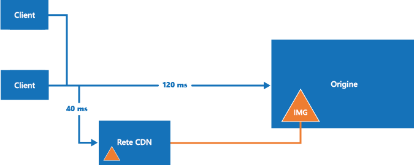

# Reti per la distribuzione di contenuti (CDN)Content delivery networks (CDNs)

Una rete per la distribuzione di contenuti (CDN) è una rete di server distribuita in grado di fornire contenuti Web agli utenti in modo efficiente.A content delivery network (CDN) is a distributed network of servers that can efficiently deliver web content to users. Per ridurre la latenza, le reti CDN archiviano il contenuto memorizzato nella cache in server perimetrali prossimi agli utenti finali.CDNs store cached content on edge servers that are close to end-users, to minimize latency.

In genere, le reti CDN vengono usate per distribuire contenuti statici, ad esempio immagini, fogli di stile, documenti, script lato client e pagine HTML.CDNs are typically used to deliver static content such as images, style sheets, documents, client-side scripts, and HTML pages. I principali vantaggi offerti dall'uso di una rete CDN sono una latenza più bassa e la distribuzione più rapida di contenuto agli utenti, indipendentemente dalla loro posizione geografica in relazione al data center in cui è ospitata l'applicazione.The major advantages of using a CDN are lower latency and faster delivery of content to users, regardless of their geographical location in relation to the datacenter where the application is hosted. Le reti CDN possono anche contribuire a ridurre il carico su un'applicazione Web poiché l'applicazione non ha le richieste di servizio per il contenuto ospitato nella rete CDN.CDNs can also help to reduce load on a web application, because the application does not have to service requests for the content that is hosted in the CDN.

[Rete di distribuzione dei contenuti di Azure](/azure/cdn/cdn-overview) è una soluzione CDN globale per la distribuzione di contenuti a larghezza di banda elevata ospitati in Azure o in altre posizioni.In Azure, the [Azure Content Delivery Network](/azure/cdn/cdn-overview) is a global CDN solution for delivering high-bandwidth content that is hosted in Azure or any other location. Con Rete CDN di Azure è possibile memorizzare nella cache gli oggetti disponibili pubblicamente, caricati dall'archivio BLOB di Azure, da un'applicazione Web, da una macchina virtuale e da qualsiasi server Web pubblico.Using Azure CDN, you can cache publicly available objects loaded from Azure blob storage, a web application, virtual machine, any publicly accessible web server.

Questo argomento descrive alcune procedure consigliate e offre considerazioni di carattere generale sull'uso di una rete CDN.This topic describes some general best practices and considerations when using a CDN. Per altre informazioni, consultare [Rete CDN di Azure](/azure/cdn/).For more information, see [Azure CDN](/azure/cdn/).

## Come e perché si usa la rete CDNHow and why a CDN is used

Ecco alcuni usi tipici della rete CDN:Typical uses for a CDN include:  

- Distribuzione di risorse statiche per applicazioni client, spesso da un sito Web.Delivering static resources for client applications, often from a website. Può trattarsi di immagini, fogli di stile, documenti, file, script sul lato client, pagine HTML, frammenti HTML o qualsiasi altro contenuto che il server non debba modificare per ogni richiesta.These resources can be images, style sheets, documents, files, client-side scripts, HTML pages, HTML fragments, or any other content that the server does not need to modify for each request. L'applicazione può creare gli elementi al runtime e renderli disponibili per la rete CDN (ad esempio, creando un elenco di titoli di notizie correnti), ma esegue queste operazioni per ogni richiesta.The application can create items at runtime and make them available to the CDN (for example, by creating a list of current news headlines), but it does not do so for each request.

- Distribuzione di contenuto statico e condiviso pubblico a dispositivi quali telefoni cellulari e tablet PC.Delivering public static and shared content to devices such as mobile phones and tablet computers. L'applicazione stessa è un servizio Web che offre un'API ai client in esecuzione sui vari dispositivi.The application itself is a web service that offers an API to clients running on the various devices. La rete CDN può anche recapitare set di dati statici, tramite il servizio Web, che i client useranno, ad esempio, per generare la propria interfaccia utente.The CDN can also deliver static datasets (via the web service) for the clients to use, perhaps to generate the client UI. Ad esempio, la rete CDN può essere usata per distribuire documenti JSON o XML.For example, the CDN could be used to distribute JSON or XML documents.

- Distribuzione di interi siti Web costituiti da solo contenuto pubblico statico ai client, senza richiedere risorse di calcolo dedicate.Serving entire websites that consist of only public static content to clients, without requiring any dedicated compute resources.

- File video in streaming al client on demand.Streaming video files to the client on demand. I video traggono vantaggio dalla latenza bassa e dalla connettività affidabile disponibili nei centri dati di tutto il mondo che offrono connessioni di rete CDN.Video benefits from the low latency and reliable connectivity available from the globally located datacenters that offer CDN connections. Servizi multimediali di Microsoft Azure si integra con la rete di distribuzione dei contenuti di Azure per inviare i contenuti direttamente alla rete di distribuzione dei contenuti al fine di eseguire una nuova distribuzione.Microsoft Azure Media Services (AMS) integrates with Azure CDN to deliver content directly to the CDN for further distribution. Per altre informazioni, vedere [Streaming endpoints overview](/azure/media-services/media-services-streaming-endpoints-overview) (Panoramica degli endpoint di streaming).For more information, see [Streaming endpoints overview](/azure/media-services/media-services-streaming-endpoints-overview).

- Miglioramento generale dell'esperienza per gli utenti, specialmente quelli che si trovano lontano dal data center che ospita l'applicazione,Generally improving the experience for users, especially those located far from the datacenter hosting the application. che altrimenti risentirebbero di una latenza più elevata.These users might otherwise suffer higher latency. Gran parte della dimensione totale del contenuto in un'applicazione Web è spesso statica e l’utilizzo della rete CDN consente di mantenere le prestazioni e l’esperienza complessiva dell’utente eliminando la necessità di distribuire l'applicazione in più centri dati.A large proportion of the total size of the content in a web application is often static, and using the CDN can help to maintain performance and overall user experience while eliminating the requirement to deploy the application to multiple data centers. Per un elenco delle posizioni dei nodi di Rete CDN di Azure, vedere [Località POP della rete CDN di Azure](/azure/cdn/cdn-pop-locations/).For a list of Azure CDN node locations, see [Azure CDN POP Locations](/azure/cdn/cdn-pop-locations/).

- Supporto di soluzioni IoT (Internet delle cose).Supporting IoT (Internet of Things) solutions. L'enorme numero di dispositivi e appliance in una soluzione IoT può facilmente sovraccaricare un'applicazione se deve distribuire aggiornamenti firmware direttamente in ogni dispositivo.The huge numbers of devices and appliances involved in an IoT solution could easily overwhelm an application if it had to distribute firmware updates directly to each device.

- Gestione dei picchi e della crescita della domanda senza richiedere il ridimensionamento dell'applicazione, evitando il conseguente aumento dei costi di esecuzione.Coping with peaks and surges in demand without requiring the application to scale, avoiding the consequent increased running costs. Ad esempio, quando viene rilasciato un aggiornamento del sistema operativo per un dispositivo hardware, come un modello specifico di router, o per un dispositivo di consumo come una smart TV, si verifica un grande picco nella domanda a causa del download eseguito da milioni di utenti e dispositivi in un breve periodo.For example, when an update to an operating system is released for a hardware device such as a specific model of router, or for a consumer device such as a smart TV, there will be a huge peak in demand as it is downloaded by millions of users and devices over a short period.

## ProblematicheChallenges

Esistono varie problematiche da considerare quando si pianifica l'uso di una rete CDN.There are several challenges to take into account when planning to use a CDN.

- **Distribuzione**.**Deployment**. Decidere l'origine da cui la rete CDN deve recuperare il contenuto e stabilire se è necessario distribuire tale contenuto in più sistemi di archiviazione.Decide the origin from which the CDN fetches the content, and whether you need to deploy the content in more than one storage system. Prendere in considerazione il processo per la distribuzione del contenuto statico e delle risorse.Take into account the process for deploying static content and resources. Ad esempio, potrebbe essere necessario implementare un passaggio separato per caricare il contenuto nell'archivio BLOB di Azure.For example, you may need to implement a separate step to load content into Azure blob storage.

- **Controllo delle versioni e controllo della cache**.**Versioning and cache-control**. Stabilire come aggiornare il contenuto statico e distribuire le nuove versioni.Consider how you will update static content and deploy new versions. Comprendere il modo in cui la rete CDN esegue la memorizzazione nella cache e determina la durata (TTL).Understand how the CDN performs caching and time-to-live (TTL). Per informazioni su Rete CDN di Azure, vedere [Funzionamento della memorizzazione nella cache](/azure/cdn/cdn-how-caching-works).For Azure CDN, see [How caching works](/azure/cdn/cdn-how-caching-works).

- **Test**.**Testing**. Può essere difficile eseguire il test locale delle impostazioni della rete CDN durante lo sviluppo e la verifica di un'applicazione in locale o in un ambiente di staging.It can be difficult to perform local testing of your CDN settings when developing and testing an application locally or in a staging environment.

- **Ottimizzazione motore di ricerca**.**Search engine optimization (SEO)**. Il contenuto, come immagini e documenti, viene fornito da un dominio diverso quando si usa la rete CDNContent such as images and documents are served from a different domain when you use the CDN. e questo approccio può avere un impatto su SEO per tale contenuto.This can have an effect on SEO for this content.

- **Sicurezza del contenuto**.**Content security**. Non tutte le reti CDN offrono forme di controllo degli accessi per il contento.Not all CDNs offer any form of access control for the content. Alcuni servizi CDN, tra cui Rete CDN di Azure, supportano l'autenticazione basata su token per proteggere il contenuto della rete CDN.Some CDN services, including Azure CDN, support token-based authentication to protect CDN content. Per altre informazioni, vedere [Protezione di asset della rete per la distribuzione di contenuti (CDN) di Azure con l'autenticazione basata su token](/azure/cdn/cdn-token-auth).For more information, see [Securing Azure Content Delivery Network assets with token authentication](/azure/cdn/cdn-token-auth).

- **Sicurezza del client**.**Client security**. I client possono connettersi da un ambiente che non consente l'accesso alle risorse nella rete CDN.Clients might connect from an environment that does not allow access to resources on the CDN. Potrebbe trattarsi di un ambiente con limitazioni di sicurezza che limita l'accesso solo a una serie di origini note oppure di un ambiente che impedisce il caricamento delle risorse da una posizione diversa dall'origine della pagina.This could be a security-constrained environment that limits access to only a set of known sources, or one that prevents loading of resources from anything other than the page origin. Per gestire questi casi è necessaria un'implementazione del fallback.A fallback implementation is required to handle these cases.

- **Resilienza**.**Resilience**. La rete CDN è un singolo punto di guasto potenziale per un'applicazione.The CDN is a potential single point of failure for an application.

Scenari in cui la rete CDN può essere meno utile sono:Scenarios where CDN may be less useful include:  

- Se il contenuto ha una bassa percentuale di riscontri, è possibile che l'accesso avvenga solo poche volte durante la sua validità, in base all'impostazione della durata (TTL).If the content has a low hit rate, it might be accessed only few times while it is valid (determined by its time-to-live setting).

- Se i dati sono privati, ad esempio per aziende di grandi dimensioni o ecosistemi di supply chain.If the data is private, such as for large enterprises or supply chain ecosystems.

## Linee guida generali e procedure consigliateGeneral guidelines and good practices

L'uso di una rete CDN è un ottimo modo per ridurre al minimo il carico sull'applicazione e ottimizzare disponibilità e prestazioni.Using a CDN is a good way to minimize the load on your application, and maximize availability and performance. Valutare l'adozione di questa strategia per tutto il contenuto appropriato e le risorse usate dall'applicazione.Consider adopting this strategy for all of the appropriate content and resources your application uses. Quando si progetta la strategia per l'uso di una rete CDN, tenere presenti i punti nelle sezioni seguenti.Consider the points in the following sections when designing your strategy to use a CDN.

### DistribuzioneDeployment

È possibile che debba essere effettuato il provisioning e sia necessario distribuire il contenuto indipendentemente dall'applicazione se non viene incluso nel processo o nel pacchetto di distribuzione dell'applicazione.Static content may need to be provisioned and deployed independently from the application if you do not include it in the application deployment package or process. Si consideri come tale eventualità influirà sull’approccio del controllo delle versioni utilizzato per gestire i componenti dell'applicazione e il contenuto stativo della risorsa.Consider how this will affect the versioning approach you use to manage both the application components and the static resource content.

Valutare se può essere opportuno usare tecniche di creazione di bundle e minimizzazione per ridurre i tempi di caricamento dei client.Consider using bundling and minification techniques to reduce load times for clients. La creazione di bundle consente di combinare più file in un unico file.Bundling combines multiple files into a single file. La minimizzazione consente invece di rimuovere i caratteri non necessari da script e file CSS senza modificare la funzionalità.Minification removes unnecessary characters from scripts and CSS files without altering functionality.

Se è necessario distribuire il contenuto in un'altra posizione, è necessario un passaggio aggiuntivo nel processo di distribuzione.If you need to deploy the content to an additional location, this will be an extra step in the deployment process. Se l'applicazione aggiorna il contenuto per la rete CDN, ad esempio a intervalli regolari o in risposta a un evento, è necessario archiviare il contenuto aggiornato in tutti i percorsi aggiuntivi, nonché l'endpoint per la rete CDN.If the application updates the content for the CDN, perhaps at regular intervals or in response to an event, it must store the updated content in any additional locations as well as the endpoint for the CDN.

Stabilire come devono essere gestite le operazioni di sviluppo e test locali quando si prevede che contenuti statici siano serviti da una rete CDN.Consider how you will handle local development and testing when some static content is expected to be served from a CDN. Ad esempio, è possibile distribuire preliminarmente il contenuto nella rete CDN durante l'esecuzione dello script di compilazione.For example, you could pre-deploy the content to the CDN as part of your build script. In alternativa, è possibile usare direttive di compilazione o flag per controllare la modalità di caricamento delle risorse da parte dell'applicazione.Alternatively, use compile directives or flags to control how the application loads the resources. Ad esempio, in modalità debug l'applicazione può caricare le risorse statiche da una cartella localeFor example, in debug mode, the application could load static resources from a local folder. e in modalità versione può usare la rete CDN.In release mode, the application would use the CDN.

Valutare se è opportuno usare opzioni per la compressione dei file, ad esempio gzip (GNU zip).Consider the options for file compression, such as gzip (GNU zip). La compressione può essere eseguita nel server di origine dall'applicazione Web ospitante oppure direttamente nei server perimetrali dalla rete CDN.Compression may be performed on the origin server by the web application hosting or directly on the edge servers by the CDN. Per altre informazioni, vedere [Migliorare le prestazioni con la compressione dei file nella rete CDN di Azure](/azure/cdn/cdn-improve-performance).For more information, see [Improve performance by compressing files in Azure CDN](/azure/cdn/cdn-improve-performance).

### Routing e controllo delle versioniRouting and versioning

Potrebbe essere necessario usare istanze diverse della rete CDN in momenti diversi.You may need to use different CDN instances at various times. Ad esempio, quando si distribuisce una nuova versione dell'applicazione, è consigliabile usare una nuova rete CDN e quella precedente, mantenendo il contenuto in un formato meno recente, per le versioni precedenti.For example, when you deploy a new version of the application you may want to use a new CDN and retain the old CDN (holding content in an older format) for previous versions. Se si usa l'archivio BLOB di Azure come origine di contenuto, è possibile creare un account di archiviazione separato o un contenitore separato e puntare l'endpoint della rete CDN ad esso.If you use Azure blob storage as the content origin, you can create a separate storage account or a separate container and point the CDN endpoint to it.

Non usare la stringa di query per indicare le diverse versioni dell'applicazione nei collegamenti alle risorse sulla rete CDN, perché quando si recupera il contenuto dall'archivio BLOB di Azure la stringa di query fa parte del nome della risorsa, ovvero il nome del BLOB.Do not use the query string to denote different versions of the application in links to resources on the CDN because, when retrieving content from Azure blob storage, the query string is part of the resource name (the blob name). Questo approccio può anche influire sul modo in cui il client memorizza le risorse nella cache.This approach can also affect how the client caches resources.

La distribuzione di nuove versioni di contenuto statico quando si aggiorna un'applicazione può essere problematica se le risorse precedenti vengono memorizzate nella cache nella rete CDN.Deploying new versions of static content when you update an application can be a challenge if the previous resources are cached on the CDN. Per altre informazioni, vedere più avanti la sezione sul controllo cache.For more information, see the section on cache control, below.

È consigliabile limitare l'accesso al contenuto della rete CDN in base al paese.Consider restricting the CDN content access by country. La rete CDN di Azure consente di filtrare le richieste in base al paese di origine e limitare il contenuto recapitato.Azure CDN allows you to filter requests based on the country of origin and restrict the content delivered. Per altre informazioni, vedere [Limitare l'accesso al contenuto in base al paese](/azure/cdn/cdn-restrict-access-by-country/).For more information, see [Restrict access to your content by country](/azure/cdn/cdn-restrict-access-by-country/).

### Controllo cacheCache control

Considerare come gestire la memorizzazione nella cache all'interno del sistema.Consider how to manage caching within the system. Ad esempio, in Rete CDN di Azure è possibile impostare le regole di memorizzazione nella cache globale e successivamente la memorizzazione nella cache personalizzata per endpoint di origine specifici.For example, in Azure CDN, you can set global caching rules, and then set custom caching for particular origin endpoints. È anche possibile controllare come viene eseguita la memorizzazione nella cache in una rete CDN inviando le intestazioni delle direttive della cache all'origine.You can also control how caching is performed in a CDN by sending cache-directive headers at the origin.

Per altre informazioni, vedere [Funzionamento della memorizzazione nella cache](/azure/cdn/cdn-how-caching-works).For more information, see [How caching works](/azure/cdn/cdn-how-caching-works).

Per evitare la presenza di oggetti nella rete CDN, è possibile eliminarli dall'origine, rimuovere o eliminare l'endpoint della rete CDN o, nel caso dell'archiviazione BLOB, rendere privato il contenitore o il BLOB.To prevent objects from being available on the CDN, you can delete them from the origin, remove or delete the CDN endpoint, or in the case of blob storage, make the container or blob private. Gli elementi, tuttavia, non vengono rimossi prima del termine della durata (TTL).However, items are not removed from the until the time-to-live expires. È anche possibile ripulire un endpoint della rete CDN manualmente.You can also manually purge a CDN endpoint.

### SecuritySecurity

La rete CDN può distribuire il contenuto tramite HTTPS (SSL) usando il certificato messo a disposizione dalla rete CDN, ma anche tramite HTTP.The CDN can deliver content over HTTPS (SSL), by using the certificate provided by the CDN, as well as over standard HTTP. Per evitare avvisi del browser sul contenuto misto potrebbe essere necessario usare HTTPS per richiedere il contenuto statico visualizzato nelle pagine caricate tramite HTTPS.To avoid browser warnings about mixed content, you might need to use HTTPS to request static content that is displayed in pages loaded through HTTPS.

Se si distribuiscono gli asset statici, ad esempio file di caratteri tramite la rete CDN, potrebbero verificarsi problemi relativi ai criteri di origine uguale se si usa una chiamata *XMLHttpRequest* per richiedere le risorse da un dominio diverso.If you deliver static assets such as font files by using the CDN, you might encounter same-origin policy issues if you use an *XMLHttpRequest* call to request these resources from a different domain. Molti browser impediscono la condivisione di risorse tra origini (CORS), a meno che il server Web non è configurato per impostare le intestazioni di risposta appropriate.Many web browsers prevent cross-origin resource sharing (CORS) unless the web server is configured to set the appropriate response headers. È possibile configurare la rete CDN per il supporto CORS tramite uno dei metodi seguenti:You can configure the CDN to support CORS by using one of the following methods:

- Configurare la rete CDN in modo che vengano aggiunte intestazioni CORS alle risposte.Configure the CDN to add CORS headers to the responses. Per altre informazioni, vedere [Uso della rete CDN di Azure con CORS](/azure/cdn/cdn-cors).For more information, see [Using Azure CDN with CORS](/azure/cdn/cdn-cors).

- Se l'origine è l'archiviazione BLOB di Azure, aggiungere le regole CORS all'endpoint di archiviazione.If the origin is Azure blob storage, add CORS rules to the storage endpoint. Per altre informazioni, vedere [Supporto della condivisione delle risorse tra le origini (CORS) per i servizi di archiviazione Azure](/rest/api/storageservices/Cross-Origin-Resource-Sharing--CORS--Support-for-the-Azure-Storage-Services).For more information, see [Cross-Origin Resource Sharing (CORS) Support for the Azure Storage Services](/rest/api/storageservices/Cross-Origin-Resource-Sharing--CORS--Support-for-the-Azure-Storage-Services).

- Configurare l'applicazione in modo da impostare le intestazioni CORS.Configure the application to set the CORS headers. Vedere ad esempio [Abilitare le richieste tra le origini (CORS)](/aspnet/core/security/cors) nella documentazione di ASP.NET Core.For example, see [Enabling Cross-Origin Requests (CORS)](/aspnet/core/security/cors) in the ASP.NET Core documentation.

### Fallback della rete CDNCDN fallback

Considerare come l'applicazione gestirà un errore o l'indisponibilità temporanea della rete CDN.Consider how your application will cope with a failure or temporary unavailability of the CDN. Le applicazioni client potrebbero riuscire a usare copie delle risorse memorizzate nella cache locale del client durante le richieste precedenti oppure è possibile includere codice che rilevi gli errori e richieda invece risorse dall'origine, ovvero la cartella dell'applicazione o il contenitore BLOB di Azure che contiene le risorse, se la rete CDN non è disponibile.Client applications may be able to use copies of the resources that were cached locally (on the client) during previous requests, or you can include code that detects failure and instead requests resources from the origin (the application folder or Azure blob container that holds the resources) if the CDN is unavailable.
