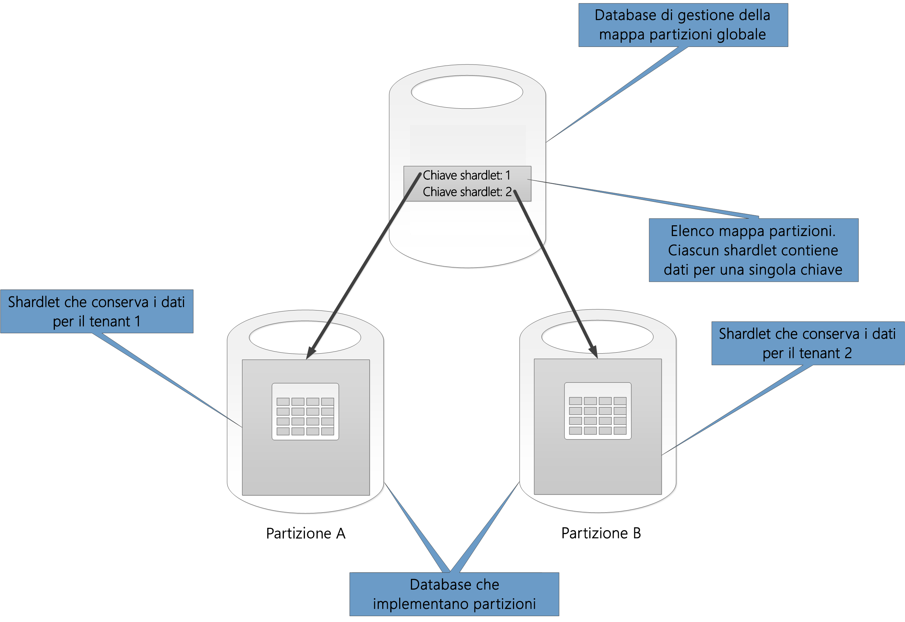
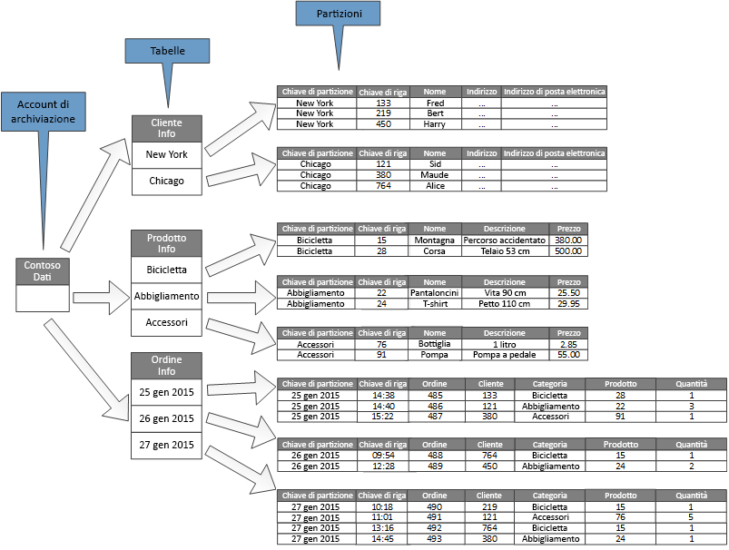

# Strategie di partizionamento dei dati

Questo articolo illustra alcune strategie per il partizionamento dei dati in vari archivi dati di Azure. Per indicazioni generali sui casi in cui è opportuno partizionare i dati e le procedure consigliate, vedere [Partizionamento dei dati](./data-partitioning.md).

## Partizionamento del database SQL di Azure

Un singolo database SQL ha un limite per il volume di dati che può contenere. La velocità effettiva è vincolata da fattori di architettura e dal numero di connessioni simultanee supportate.

I [pool elastici](/azure/sql-database/sql-database-elastic-pool) supportano la scalabilità orizzontale di un database SQL. Usando pool elastici, è possibile partizionare i dati in partizioni distribuite in più database SQL. È inoltre possibile aggiungere o rimuovere partizioni in base alla crescita o alla riduzione del volume di dati da gestire. I pool elastici consentono anche di ridurre la contesa distribuendo il carico tra i database.

Ogni partizione viene implementata come un database SQL. Una partizione può contenere più set di dati, denominati *shardlet*. Ogni database include metadati che descrivono gli shardlet contenuti al suo interno. Uno shardlet può essere un singolo elemento di dati oppure un gruppo di elementi che condividono la stessa chiave di shardlet. In un'applicazione multi-tenant, ad esempio, la chiave di shardlet può essere l'ID tenant e tutti i dati per un tenant possono essere contenuti nello stesso shardlet.

Le applicazioni client sono responsabili dell'associazione di un set di dati a una chiave di shardlet. Un database SQL separato effettua la gestione del mapping globale delle partizioni. Questo database ha un elenco di tutte le partizioni e tutti gli shardlet nel sistema. L'applicazione si connette al database di gestione delle mappe partizioni per ottenere una copia della mappa partizioni, la memorizza nella cache in locale e la usa per indirizzare le richieste di dati alla partizione appropriata. Questa funzionalità è nascosta dietro una serie di API contenute nella [libreria client dei database elastici](/azure/sql-database/sql-database-elastic-database-client-library), disponibile per Java e .NET.

Per altre informazioni sui pool elastici, vedere [Aumento del numero di istanze con il database SQL di Azure](/azure/sql-database/sql-database-elastic-scale-introduction).

Per ridurre la latenza e migliorare la disponibilità, è possibile replicare il database di gestione globale delle mappe partizioni. Con i piani tariffari Premium, si può configurare la replica geografica attiva per la copia continua dei dati in database di aree diverse.

In alternativa, usare la [sincronizzazione dati SQL di Azure](/azure/sql-database/sql-database-sync-data) o [Azure Data Factory](/azure/data-factory/) per replicare il database di gestione delle mappe partizioni tra le aree. Questa forma di replica, che non richiede un piano Premium, viene eseguita periodicamente e risulta più appropriata se la mappa partizioni viene modificata raramente.

Il database elastico offre due schemi per la mappature di dati per gli shardlet e per archiviarli in partizioni:

- Una **mappa partizioni di tipo elenco** associa una singola chiave a uno shardlet. Ad esempio, in un sistema multi-tenant, i dati per ogni tenant possono essere associati a una chiave univoca e archiviati in un proprio shardlet. Per garantire l'isolamento, ogni shardlet può essere contenuto all'interno di una specifica partizione.

    

- Una **mappa partizioni di tipo intervallo** associa un set di valori di chiave contigui a uno shardlet. Ad esempio, è possibile raggruppare i dati per un set di tenant (ognuno con una specifica chiave) all'interno dello stesso shardlet. Questo schema è meno costoso rispetto al primo, perché i tenant condividono l'archivio dati, ma offre minore isolamento.

    

Una singola partizione può contenere i dati di diversi shardlet. Ad esempio, è possibile usare gli shardlet dell'elenco per archiviare i dati per i diversi tenant non contigui nella stessa partizione. È anche possibile combinare shardlet di intervallo e di elenco nella stessa partizione, ma verranno gestiti tramite mappe diverse. Il diagramma seguente illustra questo approccio:

I pool elastici consentono di aggiungere e rimuovere partizioni con la crescita e la riduzione del volume dei dati. Le applicazioni client possono creare ed eliminare dinamicamente le partizioni e aggiornare il gestore delle mappe partizioni in modo trasparente. Tuttavia, la rimozione di una partizione è un'operazione distruttiva che richiede anche l'eliminazione di tutti i dati della partizione.

Se un'applicazione deve dividere una partizione in due partizioni separate o combinare partizioni, usare lo [strumento di divisione-unione](/azure/sql-database/sql-database-elastic-scale-overview-split-and-merge). Tale strumento, eseguito come servizio Web di Azure, effettua la migrazione dei dati tra le partizioni in modo sicuro.

Lo schema di partizionamento può influire in modo significativo le prestazioni del sistema. nonché sulla frequenza con cui è necessario aggiungere o rimuovere partizioni o ripartizionare i dati tra le partizioni. Tenere presente quanto segue:

- Raggruppare i dati usati insieme nella stessa partizione ed evitare le operazioni con accesso ai dati da più partizioni. Una partizione è di per sé un database SQL e i join tra database devono essere eseguiti sul lato client.

    Anche se Database SQL non supporta i join tra database, è possibile usare gli strumenti di Database elastici per eseguire [query su più partizioni](/azure/sql-database/sql-database-elastic-scale-multishard-querying). Una query su più partizioni invia singole query a ogni database e unisce i risultati.

- Non progettare un sistema con dipendenze tra le partizioni. I vincoli di integrità referenziale, i trigger e le stored procedure in un database non possono fare riferimento a oggetti in un altro.

- Se sono presenti dati di riferimento usati frequentemente dalle query, valutare la possibilità di replicare tali dati tra le partizioni. Questo approccio può eliminare l'esigenza di unire i dati in join tra database. Idealmente, per ridurre al minimo le attività di replica e limitare le probabilità che i dati diventino non aggiornati, tali dati dovrebbero essere statici o lenti.

- Gli shardlet appartenenti alla stessa mappa partizioni dovrebbero avere lo stesso schema. Questa regola non viene imposta dal database SQL, ma la gestione dei dati e l'esecuzione di query diventano molto complesse se ogni shardlet ha uno schema diverso. Creare invece mappe partizioni separate per ogni schema. Tenere presente che dati appartenenti a diversi shardlet possono essere archiviati nella stessa partizione.

- Le operazioni transazionali sono supportate solo per i dati all'interno della stessa partizione, non in partizioni diverse. Le transazioni possono estendere gli shardlet in quanto parti della stessa partizione. Se la logica di business deve eseguire transazioni, pertanto, archiviare i dati nella stessa partizione oppure implementare la coerenza finale.

- Posizionare le partizioni vicino agli utenti che accedono ai dati in esse contenuti. Questa strategia consente di ridurre la latenza.

- Evitare di usare una combinazione di partizioni molto attive e partizioni relativamente inattive. Provare a distribuire uniformemente il carico tra le partizioni. Questo potrebbe richiedere l'hashing delle chiavi di partizionamento. In caso di individuazione geografica delle partizioni, assicurarsi che le chiavi con hashing eseguano il mapping di shardlet contenuti in partizioni archiviate vicino agli utenti che accedono a tali dati.

### Partizionamento di archiviazione tabelle di Azure

L'archiviazione tabelle di Azure è un archivio chiave-valore progettato in base al partizionamento. Tutte le entità vengono archiviate in una partizione e le partizioni vengono gestite internamente dall'archiviazione tabelle di Azure. Ogni entità archiviata in una tabella deve fornire una chiave in due parti che include:

- **La chiave di partizione**. È un valore di stringa che determina la partizione in cui l'archivio tabelle di Azure inserirà l'entità. Tutte le entità con la stessa chiave di partizione vengono archiviate nella stessa partizione.

- **La chiave di riga**. È un valore di stringa che identifica l'entità all'interno della partizione. Tutte le entità all'interno di una partizione vengono ordinate in base al livello lessicale, in ordine crescente, per chiave. La combinazione chiave di partizione/chiave di riga deve essere univoca per ogni entità e non può superare 1 KB di lunghezza.

Se un'entità viene aggiunta a una tabella con una chiave di partizione precedentemente non usata, l'archiviazione tabelle di Azure crea una nuova partizione per questa entità. Tutte le altre entità con la stessa chiave di partizione verranno archiviate nella stessa partizione.

Questo meccanismo implementa in modo efficace una strategia di scalabilità automatica. Ogni partizione viene archiviata nello stesso server in un data center di Azure affinché le query che recuperano dati da una singola partizione vengano eseguite rapidamente.

Microsoft ha pubblicato gli [obiettivi di scalabilità] per Archiviazione di Azure. Se è probabile che il sistema superi tali limiti, valutare la possibilità di dividere le entità in più tabelle. Usare il partizionamento verticale per suddividere i campi in gruppi ai quali con maggior probabilità viene eseguito l'accesso contemporaneamente.

Il diagramma seguente illustra la struttura logica di un account di archiviazione di esempio. L'account di archiviazione contiene tre tabelle: Informazioni sul cliente, informazioni sul prodotto e Informazioni sull'ordine.

Ogni tabella include più partizioni.

- Nella tabella delle informazioni sui clienti, i dati vengono partizionati in base alla città in cui il cliente si trova. La chiave di riga contiene l'ID cliente.
- Nella tabella delle informazioni sui prodotti, i prodotti vengono partizionati per categoria e la chiave di riga contiene il numero prodotto.
- Nella tabella delle informazioni sugli ordini, gli ordini vengono partizionati in base alla relativa data e la chiave di riga specifica l'ora di ricezione dell'ordine. Si noti che tutti i dati sono ordinati per chiave di riga in ogni partizione.

Quando si progettano le entità per l'archiviazione tabelle di Azure, tenere presente quanto riportato di seguito:

- Selezionare una chiave di partizione e una chiave di riga in base alla modalità di accesso ai dati. Scegliere una combinazione di chiave di partizione/chiave di riga che supporti la maggior parte delle query. Le query più efficienti recuperano i dati specificando la chiave di partizione e la chiave di riga. Le query che specificano una chiave di partizione e un intervallo di chiavi di riga possono essere eseguite analizzando una singola partizione. L'operazione risulta relativamente veloce perché i dati seguono l'ordine delle chiavi di riga. Se le query non specificano la partizione da analizzare, devono essere analizzate tutte le partizioni.

- Se un'entità dispone di una chiave naturale, è consigliabile utilizzarla come chiave di partizione e specificare una stringa vuota come chiave di riga. Se un'entità ha una chiave composta costituita da due proprietà, selezionare la proprietà che cambia più lentamente come chiave di partizione e l'altra come chiave di riga. Se un'entità dispone di più di due proprietà chiave, utilizzare una concatenazione delle proprietà per fornire le chiavi di partizione e di riga.

- Se si eseguono regolarmente query che cercano i dati usando campi diversi dalle chiavi di partizione e di riga, valutare la possibilità di implementare un [modello di tabella degli indici](../patterns/index-table.md) oppure di usare un diverso archivio dati che supporti l'indicizzazione, come Cosmos DB.

- Se le chiavi di partizione vengono generate usando una sequenza costante (come "0001", "0002", "0003") e ogni partizione contiene solo una quantità limitata di dati, l'archivio tabelle di Azure può raggruppare fisicamente queste partizioni nello stesso server. Il servizio Archiviazione di Azure presuppone che l'applicazione esegua più probabilmente query su un intervallo contiguo di partizioni (query di intervallo) ed è ottimizzato per questo caso. Questo approccio può tuttavia causare aree ad accesso frequente, perché tutti gli inserimenti di nuove entità saranno probabilmente concentrati su un'estremità dell'intervallo contiguo. Permette inoltre di ridurre la scalabilità. Per distribuire più uniformemente il carico, prendere in considerazione l'hashing della chiave di partizione.

- Archiviazione tabelle di Azure supporta le operazioni transazionali per le entità che appartengono alla stessa partizione. Un'applicazione può eseguire più operazioni di inserimento, aggiornamento, eliminazione, sostituzione o unione come un'unità atomica, a condizione che la transazione non includa più di 100 entità e che il payload della richiesta non superi 4 MB. Le operazioni che interessano più partizioni non sono transazionali e potrebbero richiedere l'implementazione della coerenza finale. Per altre informazioni sull'archivio tabelle e le transazioni, vedere [Performing Entity Group Transactions] (Esecuzione di transazioni di gruppi di entità).

- Considerare la granularità della chiave di partizione:

  - Usando la stessa chiave di partizione per ogni entità si ottiene una singola partizione contenuta in un unico server. Ciò impedisce l'aumento del relativo numero di istanze e concentra il carico su un singolo server. Di conseguenza, questo approccio è adatto solo per l'archiviazione di un numero ridotto di entità. Garantisce tuttavia la possibilità per tutte le entità di partecipare a transazioni del gruppo di entità.

  - Usando una chiave di partizione univoca per ogni entità, il servizio di archiviazione tabelle crea una partizione separata per ogni entità e questo può causare un numero elevato di partizioni di piccole dimensioni. Questo approccio è più scalabile rispetto all'uso di una singola chiave di partizione, ma le transazioni dei gruppi di entità non saranno possibili. Inoltre, le query che recuperano più di un'entità potrebbero implicare la lettura da più di un server. Se l'applicazione esegue query di intervallo, tuttavia, l'uso di una sequenza costante per le chiavi di partizione può consentire l'ottimizzazione di tali query.

  - Condividendo la chiave di partizione in un subset di entità è possibile raggruppare le entità correlate nella stessa partizione. È possibile eseguire le operazioni che coinvolgono le entità correlate usando transazioni dei gruppi di entità, mentre le query che recuperano un set di entità correlate possono essere soddisfatte tramite l'accesso a un singolo server.

Per altre informazioni, vedere la [Azure Storage Table Design Guide].

## Partizionamento di archiviazione blob di Azure

L'archivio BLOB di Azure può contenere oggetti binari di grandi dimensioni. Usare BLOB in blocchi negli scenari in cui è necessario caricare o scaricare rapidamente grandi volumi di dati. Utilizzo dei BLOB di pagine per le applicazioni che richiedono accesso casuale anziché seriale a parti dei dati.

Ogni blob (blocco o pagina) viene conservato in un contenitore in un account di archiviazione Azure. È possibile usare i contenitori per raggruppare BLOB correlati con gli stessi requisiti di sicurezza. Questo raggruppamento è logico e non fisico. All'interno di un contenitore ogni BLOB ha un nome univoco.

La chiave di partizione per un BLOB è il nome account + il nome del contenitore + il nome del BLOB. La chiave di partizione è usata per suddividere i dati in intervalli; tali intervalli vengono bilanciati a livello di carico nell'intero sistema. I BLOB possono essere distribuiti in più server per aumentare il numero di istanze di accesso, ma ogni BLOB può essere gestito da un solo server.

Uno schema di denominazione che usa timestamp o identificatori numerici può causare un traffico eccessivo verso una partizione, limitando il bilanciamento efficace del carico nel sistema. Se vengono eseguite operazioni giornaliere che usano un oggetto BLOB con un timestamp come *aaaa-mm-gg*, ad esempio, tutto il traffico dell'operazione verrà indirizzato a un singolo server partizioni. Valutare invece la possibilità di anteporre al nome un hash di 3 cifre. Per altre informazioni, vedere [Convenzione di denominazione delle partizioni](/azure/storage/common/storage-performance-checklist#subheading47).

Le azioni di scrittura di un singolo blocco o una singola pagina sono atomiche, ma le operazioni che interessano blocchi, pagine o BLOB non lo sono. Se è necessario garantire la coerenza durante l'esecuzione di operazioni di scrittura in blocchi, pagine e BLOB, sarà necessario estrarre un blocco di scrittura usando un lease del BLOB.

## Partizionamento di code di archiviazione di Azure

Le code di archiviazione di Azure consentono di implementare la messaggistica asincrona tra processi. Un account di archiviazione di Azure può contenere qualsiasi numero di code e ogni coda può contenere qualsiasi numero di messaggi. L'unica limitazione è lo spazio disponibile nell'account di archiviazione. La dimensione massima di un singolo messaggio è di 64 KB. Se sono necessari messaggi di dimensioni superiori, utilizzare Code del bus di servizio di Azure.

Ogni coda di archiviazione ha un nome univoco all'interno dell'account di archiviazione in cui è contenuta. Le code di partizione di Azure sono basate sul nome. Tutti i messaggi per la stessa coda vengono archiviati nella stessa partizione, controllata da un singolo server. Code diverse possono essere gestite da server differenti per bilanciare il carico. L'allocazione di code da server è trasparente alle applicazioni e agli utenti.

In un'applicazione di grandi dimensioni, non usare la stessa coda di archiviazione per tutte le istanze dell'applicazione, poiché con questo approccio il server che ospita la coda potrebbe diventare un'area sensibile. È consigliabile usare code diverse per le diverse aree funzionali dell'applicazione. Le code di archiviazione di Azure non supportano le transazioni, in modo da indirizzare i messaggi a code diverse dovrebbe avere un impatto minimo sulla coerenza della messaggistica.

Una coda di archiviazione di Azure è in grado di gestire fino a 2.000 messaggi al secondo. Se è necessario elaborare i messaggi a una velocità più elevata, è consigliabile creare più code. In un'applicazione globale, ad esempio, è consigliabile creare code di archiviazione separate in account di archiviazione separati per gestire le istanze dell'applicazione in esecuzione in ogni area.

## Partizionamento del bus di servizio di Azure

Il bus di servizio di Azure usa un broker messaggi per gestire i messaggi inviati a una coda del bus di servizio o a un argomento. Per impostazione predefinita, tutti i messaggi inviati a una coda o a un argomento vengono gestiti dallo stesso processo di broker messaggi. Questa architettura può inserire un limite alla velocità effettiva complessiva della coda di messaggi. Tuttavia, è anche possibile partizionare una coda o argomento quando viene creato. A tale scopo, impostare la proprietà *EnablePartitioning* della descrizione della coda o dell'argomento su *true*.

Una coda o un argomento partizionato viene diviso in più frammenti, ognuno dei quali è supportato da un archivio messaggi e da un broker messaggi separato. Il Bus di servizio si assume la responsabilità per la creazione e la gestione di questi frammenti. Quando un'applicazione invia un messaggio a una coda o argomento partizionati, il Bus di servizio assegna il messaggio a un frammento per quella coda o quell’argomento. Quando un'applicazione riceve un messaggio da una coda o da una sottoscrizione, il Bus di servizio controlla ogni frammento per il successivo messaggio disponibile e quindi lo passa all'applicazione per l'elaborazione.

Questa struttura consente di distribuire il carico tra broker messaggi e archivi messaggi aumentando la scalabilità e migliorando la disponibilità. Se il broker messaggi o l'archivio messaggi di un frammento è temporaneamente non disponibile, il bus di servizio può recuperare i messaggi da uno dei frammenti disponibili rimanenti.

Il Bus di servizio assegna un messaggio a un frammento nel modo seguente:

- Se il messaggio appartiene a una sessione, tutti i messaggi con lo stesso valore per la proprietà *SessionId* vengono inviati allo stesso frammento.

- Se il messaggio non appartiene a una sessione, ma il mittente ha specificato un valore per la proprietà *PartitionKey*, tutti i messaggi con lo stesso valore *PartitionKey* vengono inviati allo stesso frammento.

  > [!NOTE]
  > Se entrambe le proprietà *SessionId* e *PartitionKey* sono specificate, è necessario che siano impostate sullo stesso valore altrimenti il messaggio verrà rifiutato.

- Se le proprietà *SessionId* e *PartitionKey* per un messaggio non sono specificate, ma è abilitato il rilevamento dei duplicati, verrà usata la proprietà *MessageId*. Tutti i messaggi con lo stesso *MessageId* verranno indirizzati allo stesso frammento.

- Se i messaggi non includono una proprietà *SessionId, PartitionKey,* o *MessageId*, il bus di servizio assegna i messaggi a frammenti in modo sequenziale. Se un frammento non è disponibile, il Bus di servizio passerà al successivo. In questo modo, un errore temporaneo nell'infrastruttura di messaggistica non determina l'esito negativo dell'operazione di invio del messaggio.

Quando si decide se e come partizionare una coda o un argomento dei messaggi del bus di servizio, tenere presente quanto riportato di seguito:

- Gli argomenti e le code del Bus di servizio vengono creati nell'ambito di uno spazio dei nomi del Bus di servizio. Il bus di servizio attualmente consente fino a 100 code o argomenti partizionati per spazio dei nomi.

- Ogni spazio dei nomi del bus di servizio impone delle quote per le risorse disponibili, ad esempio il numero di sottoscrizioni per argomento, il numero di trasmissioni e ricezioni simultanee di richieste al secondo e il numero massimo di connessioni simultanee che possono essere stabilite. Le quote sono documentate in [Quote del bus di servizio]. Se si prevede di superare questi valori, è consigliabile creare ulteriori spazi dei nomi con le proprie code e argomenti e distribuire il lavoro tra questi spazi dei nomi. Ad esempio, in un'applicazione globale, è consigliabile creare spazi dei nomi separati in ogni area e configurare le istanze dell'applicazione per utilizzare le code e argomenti dello spazio dei nomi più vicino.

- I messaggi inviati come parte di una transazione devono specificare una chiave di partizione. La chiave può essere costituita da una proprietà *SessionId*, *PartitionKey* o *MessageId*. Tutti i messaggi che vengono inviati come parte della stessa transazione devono specificare la stessa chiave di partizione perché essi devono essere gestiti dallo stesso processo del gestore dei messaggi. È possibile inviare messaggi a diverse code o argomenti all'interno della stessa transazione.

- Code e argomenti partizionati non possono essere configurati per essere eliminati automaticamente quando diventano inattivi.

- Se si creano soluzioni multipiattaforma o ibride, non è attualmente possibile usare code e argomenti partizionati con il protocollo AMQP (Advanced Message Queuing Protocol).

## Partizionamento di Cosmos DB

Azure Cosmos DB è un database NoSQL che può archiviare documenti JSON tramite l'[API SQL di Azure Cosmos DB][cosmosdb-sql-api]. Un documento in un database Cosmos DB è una rappresentazione serializzata JSON di un oggetto o di un altra parte di un dato. Nessuno schema fisso viene applicato ad eccezione del fatto che ogni documento deve contenere un ID univoco.

I documenti sono organizzati in raccolte. È possibile raggruppare i documenti correlati in una raccolta. Ad esempio, in un sistema che gestisce post di blog, è possibile archiviare il contenuto di ogni post di blog come documento in una raccolta. È anche possibile creare raccolte per ogni tipo di argomento. In alternativa, in un'applicazione multi-tenant, ad esempio un sistema in cui autori diversi controllano e gestiscono i propri post di blog, è possibile partizionare i blog per autore e creare una raccolta separata per ogni autore. Lo spazio di archiviazione allocato alle raccolte è flessibile e può essere ridotto o incrementato in base alle esigenze.

Cosmos DB supporta il partizionamento automatico dei dati basato su una chiave di partizione definita dall'applicazione. Un *partizione logica* è una partizione che archivia tutti i dati per un valore di una singola chiave di partizione. Tutti i documenti che condividono lo stesso valore per la chiave di partizione vengono posizionati all'interno della stessa partizione logica. Cosmos DB distribuisce i valori in base all'hash della chiave di partizione. Una partizione logica può avere una dimensione massima di 10 GB. La scelta della chiave di partizione è pertanto una decisione importante da prendere in fase di progettazione. Scegliere una proprietà con un'ampia gamma di valori e modelli di accesso uniformi. Per altre informazioni, vedere [Partizionamento e ridimensionamento in Azure Cosmos DB](/azure/cosmos-db/partition-data).

> [!NOTE]
> Ogni database Cosmos DB ha un *livello di prestazioni* che determina la quantità di risorse ottenute. A ogni livello di prestazioni è associato un limite di velocità dell'*unità richiesta*. Il limite di velocità dell'unità richiesta specifica il volume di risorse riservato e disponibile a uso esclusivo della raccolta. Il costo di una raccolta dipende dal livello di prestazioni selezionato per la raccolta. Più elevato è il livello di prestazioni e il limite di velocità dell'unità richiesta, maggiore sarà il costo. Il livello di prestazioni di una raccolta può essere regolato usando il portale di Azure. Per altre informazioni, vedere [Unità richiesta in Azure Cosmos DB][cosmos-db-ru].

Se il meccanismo di partizionamento offerto da Cosmos DB non è sufficiente, potrebbe essere necessario partizionare i dati a livello di applicazione. Le raccolte di documenti offrono un meccanismo naturale per partizionare i dati all'interno di un unico database. Il modo più semplice per implementare il partizionamento orizzontale consiste nel creare una raccolta per ogni partizione. I contenitori sono risorse logiche e possono comprendere uno o più server. I contenitori a dimensione fissa hanno un limite massimo di 10 GB e velocità effettiva di 10.000 UR/s. I contenitori senza limiti non hanno dimensioni di archiviazione massime, ma devono specificare una chiave di partizione. Con il partizionamento orizzontale, l'applicazione client indirizza le richieste alla partizione appropriata, in genere mediante l'implementazione del proprio meccanismo di mapping basato su alcuni attributi dei dati che definiscono la chiave di partizione.

Tutti i database vengono creati nel contesto di un account del database di Cosmos DB. Un singolo account può contenere più database e specifica in quale area vengono creati i database. Ogni account impone anche il proprio controllo di accesso. È possibile usare gli account Cosmos DB per individuare le partizioni a livello geografico, ovvero raccolte all'interno del database, prossime agli utenti che vi devono accedere e imporre restrizioni in modo che solo tali utenti possano connettersi a esse.

Quando si decide come partizionare i dati con un API SQL di Cosmos DB, tenere presente quanto riportato di seguito:

- **Le risorse disponibili per un database di Cosmos DB sono soggette alle limitazioni di quota dell'account**. Ogni database può contenere un numero di raccolte e ogni raccolta è associata a un livello di prestazioni che regola il limite di velocità RU (velocità effettiva riservata) per la raccolta. Per altre informazioni, vedere [Sottoscrizione di Azure e limiti, quote e vincoli dei servizi][azure-limits].

- **Ogni documento deve avere un attributo da usare per identificare in modo univoco tale documento all'interno della raccolta in cui è contenuto**. Questo attributo è diverso dalla chiave di partizione che definisce la raccolta contenente il documento. Una raccolta può contenere un numero elevato di documenti. In teoria, l'unico limite è la lunghezza massima dell'ID di documento. L'ID di documento può contenere fino a 255 caratteri.

- **Tutte le operazioni eseguite su un documento vengono eseguite nel contesto di una transazione. Le transazioni sono limitate alla raccolta in cui è contenuto il documento.** Se un'operazione ha esito negativo, viene eseguito il rollback del lavoro che è stato eseguito. Quando viene eseguita un'operazione su un documento, tutte le modifiche apportate sono soggette all'isolamento a livello di snapshot. Questo meccanismo garantisce ad esempio che nel caso in cui una richiesta di creazione di un nuovo documento ha esito negativo, un altro utente che contemporaneamente esegue una query nel database non visualizzi un documento parziale che verrà in seguito rimosso.

- **Anche le query del database sono limitate al livello di raccolta**. Una singola query può recuperare dati solo da una raccolta. Se è necessario recuperare dati da più raccolte, è necessario eseguire query in ogni raccolta singolarmente e incorporare i risultati nel codice dell'applicazione.

- **Cosmos DB supporta elementi programmabili che possono essere archiviati in una raccolta insieme ai documenti**. Questi includono stored procedure, funzioni definite dall'utente e trigger scritti in JavaScript. Questi elementi possono accedere a qualsiasi documento all'interno della stessa raccolta. Inoltre, questi elementi vengono eseguiti nell'ambito della transazione di ambiente (nel caso di un trigger che viene generato in seguito a una creazione, eliminazione o sostituzione eseguita su un documento) o avviando una nuova transazione (nel caso di una stored procedure eseguita in seguito a una richiesta client esplicita). Se il codice in un elemento programmabile genera un'eccezione, viene eseguito il rollback della transazione. È possibile utilizzare stored procedure e trigger per mantenere l'integrità e la coerenza tra i documenti, ma  tutti questi documenti devono far parte della stessa raccolta.

- **È improbabile che le raccolte che si prevede di mantenere nei database superino i limiti di velocità effettiva definiti dai livelli di prestazioni delle raccolte**. Per altre informazioni, vedere [Unità richiesta in Azure Cosmos DB][cosmos-db-ru]. Se si prevede di raggiungere questi limiti, considerare la suddivisione di raccolte tra database in account diversi per ridurre il carico per ogni raccolta.

## Partizionamento di Ricerca di Azure

La possibilità di ricercare dati è spesso il metodo principale di navigazione ed esplorazione offerto da molte applicazioni Web. Consente agli utenti di trovare le risorse rapidamente, ad esempio i prodotti in un'applicazione di e-commerce, in base a combinazioni di criteri di ricerca. Il servizio di ricerca di Azure offre funzionalità di ricerca full-text nel contenuto web e include funzionalità quali il suggerimento automatico di query basate su quasi corrispondenze ed esplorazione in base a facet. Per altre informazioni, vedere [Che cos'è la Ricerca di Azure?].

Ricerca di Azure memorizza il contenuto disponibile per la ricerca come documenti JSON all'interno di un database . Definire gli indici che specificano i campi disponibili per la ricerca nei documenti e inserire tali definizioni in Ricerca di Azure. Quando un utente invia una richiesta di ricerca, Ricerca di Azure usa gli indici appropriati per trovare gli elementi corrispondenti.

Per ridurre i conflitti, lo spazio di archiviazione usato da Ricerca di Azure può essere diviso in 1, 2, 3, 4, 6 o 12 partizioni e ogni partizione può essere replicata fino a 6 volte. Il prodotto del numero di partizioni moltiplicato per il numero di repliche è denominato *unità di ricerca*. Una singola istanza di Ricerca di Azure può contenere un massimo di 36 unità di ricerca. Un database con 12 partizioni supporta un massimo di 3 repliche.

Ogni SU allocata al servizio viene fatturata. Man mano che il volume dei contenuti disponibili per la ricerca o la frequenza delle richieste di ricerca aumenta, è possibile aggiungere unità di ricerca a un'istanza esistente di Ricerca di Azure per gestire il carico aggiuntivo. Ricerca di Azure distribuisce i documenti in modo uniforme in tutte le partizioni. Attualmente non sono supportate strategie di partizionamento manuale.

Ogni partizione può contenere un massimo di 15 milioni di documenti o può occupare 300 GB di spazio di archiviazione, in base al valore minore dei due. È possibile creare fino a 50 indici. Le prestazioni del servizio variano a seconda della complessità dei documenti, degli indici disponibili e degli effetti della latenza di rete. In media, una singola replica (1 unità di ricerca) deve essere in grado di gestire 15 query al secondo (QPS), anche se è consigliabile eseguire il benchmark con i propri dati per ottenere una misura della velocità effettiva più precisa. Per altre informazioni, vedere [Limiti dei servizi in Ricerca di Azure].

> [!NOTE]
> È possibile archiviare un set limitato di tipi di dati nei documenti disponibili per la ricerca, inclusi stringhe, valori booleani, dati numerici, dati di tipo datetime e alcuni dati geografici. Per altre informazioni, vedere la pagina [Tipi di dati supportati (Ricerca di Azure)] nel sito Web Microsoft.

Il controllo sul partizionamento dei dati da parte di Ricerca di Azure per ogni istanza del servizio è limitato. In un ambiente globale, tuttavia, è possibile migliorare le prestazioni e ridurre la latenza e i conflitti con un ulteriore partizionamento del servizio applicando una delle seguenti strategie:

- Creare un'istanza di Ricerca di Azure in ogni area geografica e assicurarsi che le applicazioni client vengano indirizzate verso l'istanza più vicina disponibile. Questa strategia richiede che tutti gli aggiornamenti al contenuto di ricerca siano replicati tempestivamente in tutte le istanze del servizio.

- Creare due livelli di Ricerca di Azure:

  - Un servizio locale in ogni area contenente i dati a cui gli utenti dell'area accedono più di frequente. Gli utenti possono indirizzare le richieste al servizio locale per ottenere risultati rapidi ma limitati.
  - Un servizio globale che comprende tutti i dati. Gli utenti possono indirizzare le richieste al servizio globale per ottenere risultati più lenti ma completi.

Questo approccio è più adatto quando esiste una variazione regionale significativa nei dati da ricercare.

## Partizionamento di Cache Redis di Azure

Cache Redis di Azure offre un servizio di memorizzazione nella cache condivisa nel cloud basato sull'archivio dati chiave-valore di Redis. Come suggerisce il nome, Cache Redis di Azure è una soluzione di memorizzazione nella cache. Usare questa soluzione solo per contenere dati temporanei e non come archivio dati permanente. Le applicazioni che usano Cache Redis di Azure sono in grado di continuare a funzionare anche se la cache non è disponibile. Cache Redis di Azure supporta la replica primaria o secondaria per garantire una disponibilità elevata, ma attualmente limita la dimensione massima della cache a 53 GB. Se è necessario più spazio, si devono creare cache aggiuntive. Per altre informazioni, vedere [Cache Redis di Azure].

Il partizionamento di un archivio dati Redis prevede la suddivisione dei dati tra istanze del servizio Redis. Ogni istanza rappresenta una singola partizione. Cache Redis di Azure consente di astrarre i servizi di Redis dietro un’interfaccia e non li espone direttamente. Il modo più semplice per implementare il partizionamento consiste nel creare più istanze della Cache Redis di Azure e distribuire i dati nelle cache.

È possibile associare ogni elemento di dati a un identificatore (chiave di partizione) che specifica la cache in cui è memorizzato l'elemento. La logica dell'applicazione client potrà usare l'identificatore per indirizzare le richieste alla partizione appropriata. Questo schema è molto semplice. Tuttavia, se lo schema di partizionamento viene modificato, ad esempio se vengono create altre istanze della Cache Redis di Azure, è possibile sia necessario riconfigurare le applicazioni client.

Redis nativo (non Cache Redis di Azure) supporta il partizionamento sul lato server basato sul clustering di Redis. Con questo approccio, è possibile dividere i dati in modo uniforme nei server usando un meccanismo hash. Ogni server Redis archivia i metadati che descrivono l’intervallo delle chiavi di hash che la partizione contiene e contiene inoltre informazioni su quali chiavi di hash si trovano nelle partizioni su altri server.

Le applicazioni client si limitano a inviare le richieste a un server Redis partecipante, probabilmente il più vicino. Il server Redis esamina la richiesta del client. Se la richiesta può essere risolta in locale, il server eseguirà l'operazione richiesta. In caso contrario, la richiesta verrà inoltrata al server appropriato.

Questo modello viene implementato dal clustering Redis e viene descritto più dettagliatamente alla pagina [Esercitazione del cluster Redis] sul sito Web Redis. Il clustering di Redis è trasparente per le applicazioni client. È possibile aggiungere altri server Redis al cluster e ripartizionare nuovamente i dati senza dover riconfigurare i client.

> [!IMPORTANT]
> Cache Redis di Azure attualmente supporta il clustering Redis solo nel livello [Premium](/azure/azure-cache-for-redis/cache-how-to-premium-clustering).

La pagina relativa al [partizionamento e alla suddivisione dei dati in più istanze di Redis] nel sito Web Redis fornisce ulteriori informazioni sull'implementazione del partizionamento con Redis. Il resto di questa sezione presuppone l'implementazione di partizionamento sul lato client o assistito dal proxy.

Quando si decide come partizionare i dati con Cache Redis di Azure, tenere presente quanto riportato di seguito:

- Poiché Cache Redis di Azure non è progettata per svolgere la funzione di archivio dati permanente, indipendentemente dallo schema di partizionamento implementato, è necessario che il codice dell'applicazione sia in grado di recuperare i dati da una posizione diversa dalla cache.

- È consigliabile mantenere nella stessa partizione i dati cui viene di frequente eseguito l'accesso contemporaneamente. Redis è un archivio chiave-valore avanzato che offre diversi meccanismi altamente ottimizzati per la definizione della struttura dei dati. I meccanismi possono essere i seguenti:
  - Stringhe semplici (dati binari di una lunghezza massima di 512 MB)
  - Tipi di aggregazione, ad esempio elenchi, che possono svolgere la funzione di code e stack
  - Set ordinati e non ordinati
  - Hash che consentono di raggruppare i campi correlati, ad esempio gli elementi che rappresentano i campi in un oggetto

- I tipi di aggregazione consentono di associare numerosi valori correlati alla stessa chiave. Una chiave Redis identifica un elenco, un set o un hash anziché gli elementi di dati in esso contenuti. Questi tipi sono tutti disponibili con Cache Redis di Azure e sono descritti nella pagina relativa ai [tipi di dati] nel sito Web Redis. Ad esempio, in una parte di un sistema di e-commerce che tiene traccia degli ordini effettuati dai clienti, i dettagli di ogni cliente possono essere archiviati in un hash Redis associato a una chiave costituita dall'ID cliente. Ogni hash può contenere un insieme di ID degli ordini del cliente. Un set di Redis separato può contenere gli ordini, anch'essi strutturati come hash e associati a una chiave costituita dall'ID ordine. Nella figura 8 viene illustrata questa struttura. Si noti che Redis non implementa alcuna forma di integrità referenziale, pertanto è responsabilità dello sviluppatore mantenere le relazioni tra clienti e ordini.

*Figura 8. Struttura consigliata nell'archivio Redis per la registrazione degli ordini dei clienti e dei relativi dettagli.*

> [!NOTE]
> In Redis, tutte le chiavi sono valori di dati binari, come le stringhe Redis, e possono contenere fino a 512 MB di dati. In teoria, una chiave può contenere qualsiasi informazione. Tuttavia, è consigliabile adottare una convenzione di denominazione coerente per le chiavi che descriva il tipo di dati e identifichi l'entità senza essere eccessivamente lunga. Un approccio comune consiste nell'usare chiavi nel formato "tipo_entità:ID". Ad esempio, è possibile usare "cliente:99" per indicare la chiave per il cliente con ID 99.

- È possibile implementare il partizionamento verticale archiviando le informazioni correlate in aggregazioni diverse nello stesso database. Ad esempio, in un'applicazione di e-commerce è possibile archiviare le informazioni sui prodotti cui viene eseguito l'accesso di frequente in un hash di Redis e le informazioni dettagliate usate meno frequentemente in un altro hash. Entrambi gli hash possono usare lo stesso ID prodotto come parte della chiave. Ad esempio, è possibile usare "prodotto: *nn*" (dove *nn* è l'ID prodotto) per le informazioni sul prodotto e "dettagli_prodotto: *nn*" per i dati dettagliati. Questa strategia può contribuire a ridurre il volume dei dati recuperati dalla maggior parte delle query.

- Sebbene sia possibile ripartizionare un archivio dati Redis, tenere presente che si tratta di un'attività lunga e complessa. Il clustering Redis può ripartizionare i dati automaticamente, ma questa funzionalità non è disponibile con Cache Redis di Azure. Di conseguenza, quando si progetta lo schema di partizionamento, cercare di lasciare spazio libero sufficiente in ogni partizione per consentire la crescita dei dati prevista nel tempo. Tuttavia, tenere presente che Cache Redis di Azure consente di memorizzare dati temporaneamente e che i dati contenuti nella cache possono avere una durata limitata, specificata come valore time-to-live (TTL). Per i dati relativamente volatili, il TTL può essere più breve, ma per i dati statici il TTL può essere molto più lungo. Evitare di archiviare grandi quantità di dati di lunga durata nella cache, se il volume dei dati riempe la cache. È possibile specificare un criterio di rimozione che spinge la Cache Redis di Azure a rimuovere i dati se lo spazio è prezioso.

  > [!NOTE]
  > Con Cache Redis di Azure è possibile specificare le dimensioni massime della cache (da 250 MB a 53 GB) selezionando il piano tariffario appropriato. Tuttavia, dopo aver creato una cache Redis di Azure, non è possibile aumentare o diminuire le dimensioni della cache.

- Poiché i batch e le transazioni di Redis non possono estendersi su più connessioni, è consigliabile mantenere tutti i dati interessati da un batch o da una transazione nello stesso database (partizione).

  > [!NOTE]
  > Una sequenza di operazioni in una transazione di Redis non è necessariamente atomica. I comandi che costituiscono una transazione vengono verificati e messi in coda prima dell'esecuzione. Se si verifica un errore durante questa fase, l'intera coda viene eliminata. Tuttavia, dopo che la transazione è stata inviata correttamente, i comandi in coda vengono eseguiti in sequenza. Se un comando non viene eseguito, viene interrotta soltanto l'esecuzione di quel comando. Tutti i comandi precedenti e successivi nella coda vengono eseguiti. Per altre informazioni, visitare la pagina relativa alle [transazioni] nel sito Web Redis.

- Redis supporta un numero limitato di operazioni atomiche. Le uniche operazioni di questo tipo che supportano più valori e chiavi sono le operazioni MGET e MSET. Le operazioni MGET restituiscono una raccolta di valori per un elenco di chiavi specificato, mentre le operazioni MSET archiviano una raccolta di valori per un elenco di chiavi specificato. Se è necessario usare queste operazioni, le coppie chiave-valore cui fanno riferimento i comandi MSET e MGET devono essere archiviate nello stesso database.

## Partizionamento di Azure Service Fabric

Azure Service Fabric è una piattaforma di microservizi che offre un runtime per le applicazioni distribuite nel cloud. Service Fabric supporta i file eseguibili guest .Net, i servizi con stato e senza stato e i contenitori. I servizi con stato offrono una [raccolta Reliable][service-fabric-reliable-collections] per archiviare in modo permanente i dati in una raccolta chiave-valore all'interno del cluster di Service Fabric. Per altre informazioni sulle strategie per le chiavi di partizionamento in una raccolta affidabile, vedere [Linee guida e consigli per Reliable Collections in Azure Service Fabric].

### Altre informazioni

- [Panoramica di Azure Service Fabric] è un'introduzione ad Azure Service Fabric.

- [Partizionare Reliable Services di Service Fabric] offre altre informazioni su Reliable Services in Azure Service Fabric.

## Partizionamento di Hub eventi di Azure

[Hub eventi di Azure][event-hubs] è progettato per consentire il flusso dei dati su larga scala e il partizionamento è incorporato nel servizio per abilitare la scalabilità orizzontale. Ogni consumer legge solo una partizione specifica del flusso di messaggi.

L'autore di eventi è a conoscenza solo della chiave di partizione, non la partizione in cui gli eventi vengono pubblicati. Questa separazione tra chiave e partizione evita che il mittente debba conoscere troppe informazioni sull'elaborazione downstream. È anche possibile inviare eventi direttamente a una determinata partizione, ma in genere non è consigliabile.  

Quando si seleziona il conteggio delle partizioni, prendere in considerazione la scalabilità a lungo termine. Dopo la creazione di un hub eventi, non è possibile modificare il numero di partizioni.

Per altre informazioni sull'uso delle partizioni in Hub eventi, vedere [Che cos'è Hub eventi?].

Per considerazioni sui compromessi tra disponibilità e coerenza, vedere [Disponibilità e coerenza nell'Hub eventi].

[Disponibilità e coerenza nell'Hub eventi]: /azure/event-hubs/event-hubs-availability-and-consistency
[azure-limits]: /azure/azure-subscription-service-limits
[Azure Content Delivery Network]: /azure/cdn/cdn-overview
[Cache Redis di Azure]: https://azure.microsoft.com/services/cache/
[Azure Storage Scalability and Performance Targets]: /azure/storage/storage-scalability-targets
[Azure Storage Table Design Guide]: /azure/storage/storage-table-design-guide
[Building a Polyglot Solution]: https://msdn.microsoft.com/library/dn313279.aspx
[cosmos-db-ru]: /azure/cosmos-db/request-units
[Data Access for Highly-Scalable Solutions: Using SQL, NoSQL, and Polyglot Persistence]: https://msdn.microsoft.com/library/dn271399.aspx
[Data consistency primer]: https://aka.ms/Data-Consistency-Primer
[Data Partitioning Guidance]: https://msdn.microsoft.com/library/dn589795.aspx
[Tipi di dati]: https://redis.io/topics/data-types
[cosmosdb-sql-api]: /azure/cosmos-db/sql-api-introduction
[Elastic Database features overview]: /azure/sql-database/sql-database-elastic-scale-introduction
[event-hubs]: /azure/event-hubs
[Federations Migration Utility]: https://code.msdn.microsoft.com/vstudio/Federations-Migration-ce61e9c1
[Linee guida e consigli per Reliable Collections in Azure Service Fabric]: /azure/service-fabric/service-fabric-reliable-services-reliable-collections-guidelines
[Multi-shard querying]: /azure/sql-database/sql-database-elastic-scale-multishard-querying
[Panoramica di Azure Service Fabric]: /azure/service-fabric/service-fabric-overview
[Partizionare Reliable Services di Service Fabric]: /azure/service-fabric/service-fabric-concepts-partitioning
[partizionamento e alla suddivisione dei dati in più istanze di Redis]: https://redis.io/topics/partitioning
[Performing Entity Group Transactions]: /rest/api/storageservices/Performing-Entity-Group-Transactions
[Esercitazione del cluster Redis]: https://redis.io/topics/cluster-tutorial
[Running Redis on a CentOS Linux VM in Azure]: https://blogs.msdn.microsoft.com/tconte/2012/06/08/running-redis-on-a-centos-linux-vm-in-windows-azure/
[Scaling using the Elastic Database split-merge tool]: /azure/sql-database/sql-database-elastic-scale-overview-split-and-merge
[Using Azure Content Delivery Network]: /azure/cdn/cdn-create-new-endpoint
[Quote del bus di servizio]: /azure/service-bus-messaging/service-bus-quotas
[service-fabric-reliable-collections]: /azure/service-fabric/service-fabric-reliable-services-reliable-collections
[Limiti dei servizi in Ricerca di Azure]:  /azure/search/search-limits-quotas-capacity
[Sharding pattern]: ../patterns/sharding.md
[Tipi di dati supportati (Ricerca di Azure)]:  https://msdn.microsoft.com/library/azure/dn798938.aspx
[Transazioni]: https://redis.io/topics/transactions
[Che cos'è Hub eventi?]: /azure/event-hubs/event-hubs-what-is-event-hubs
[Che cos'è la Ricerca di Azure?]: /azure/search/search-what-is-azure-search
[What is Azure SQL Database?]: /azure/sql-database/sql-database-technical-overview
[Obiettivi di scalabilità]: /azure/storage/common/storage-scalability-targets
