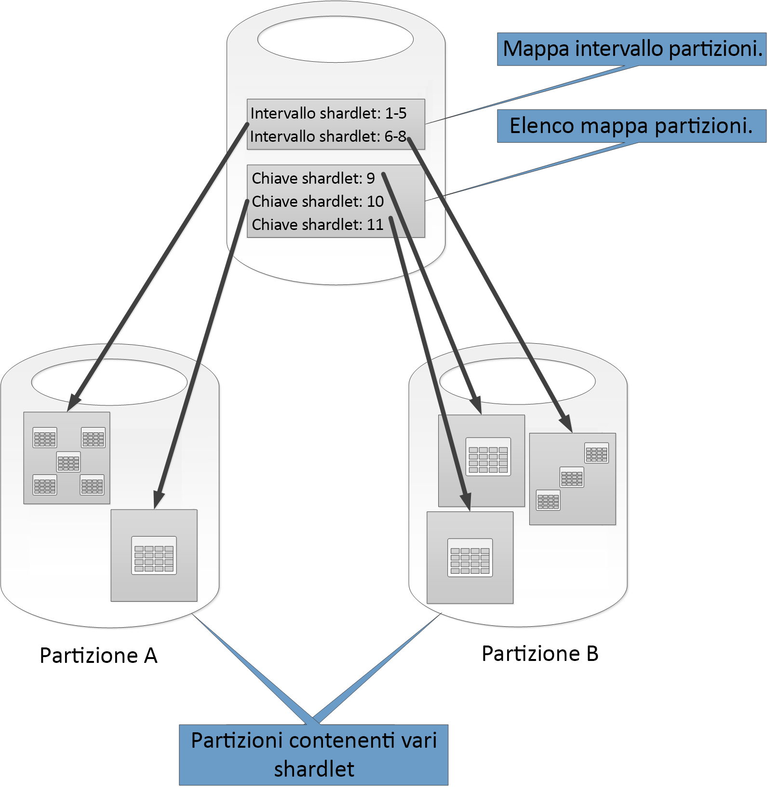
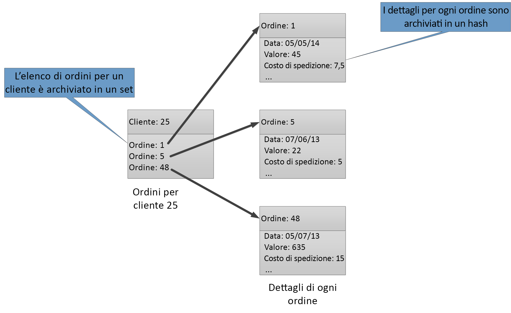

# Strategie di partizionamento dei datiData partitioning strategies

Questo articolo illustra alcune strategie per il partizionamento dei dati in vari archivi dati di Azure.This article describes some strategies for partitioning data in various Azure data stores. Per indicazioni generali sui casi in cui è opportuno partizionare i dati e le procedure consigliate, vedere [Partizionamento dei dati](./data-partitioning.md).For general guidance about when to partition data and best practices, see [Data partitioning](./data-partitioning.md)

## Partizionamento del database SQL di AzurePartitioning Azure SQL Database

Un singolo database SQL ha un limite per il volume di dati che può contenere.A single SQL database has a limit to the volume of data that it can contain. La velocità effettiva è vincolata da fattori di architettura e dal numero di connessioni simultanee supportate.Throughput is constrained by architectural factors and the number of concurrent connections that it supports.

I [pool elastici](/azure/sql-database/sql-database-elastic-pool) supportano la scalabilità orizzontale di un database SQL.[Elastic pools](/azure/sql-database/sql-database-elastic-pool) support horizontal scaling for a SQL database. Usando pool elastici, è possibile partizionare i dati in partizioni distribuite in più database SQL.Using elastic pools, you can partition your data into shards that are spread across multiple SQL databases. È inoltre possibile aggiungere o rimuovere partizioni in base alla crescita o alla riduzione del volume di dati da gestire.You can also add or remove shards as the volume of data that you need to handle grows and shrinks. I pool elastici consentono anche di ridurre la contesa distribuendo il carico tra i database.Elastic pools can also help reduce contention by distributing the load across databases.

Ogni partizione viene implementata come un database SQL.Each shard is implemented as a SQL database. Una partizione può contenere più set di dati, denominati *shardlet*.A shard can hold more than one dataset (called a *shardlet*). Ogni database include metadati che descrivono gli shardlet contenuti al suo interno.Each database maintains metadata that describes the shardlets that it contains. Uno shardlet può essere un singolo elemento di dati oppure un gruppo di elementi che condividono la stessa chiave di shardlet.A shardlet can be a single data item, or a group of items that share the same shardlet key. In un'applicazione multi-tenant, ad esempio, la chiave di shardlet può essere l'ID tenant e tutti i dati per un tenant possono essere contenuti nello stesso shardlet.For example, in a multitenant application, the shardlet key can be the tenant ID, and all data for a tenant can be held in the same shardlet.

Le applicazioni client sono responsabili dell'associazione di un set di dati a una chiave di shardlet.Client applications are responsible for associating a dataset with a shardlet key. Un database SQL separato effettua la gestione del mapping globale delle partizioni.A separate SQL database acts as a global shard map manager. Questo database ha un elenco di tutte le partizioni e tutti gli shardlet nel sistema.This database has a list of all the shards and shardlets in the system. L'applicazione si connette al database di gestione delle mappe partizioni per ottenere una copia della mappa partizioni,The application connects to the shard map manager database to obtain a copy of the shard map. la memorizza nella cache in locale e la usa per indirizzare le richieste di dati alla partizione appropriata.It caches the shard map locally, and uses the map to route data requests to the appropriate shard. Questa funzionalità è nascosta dietro una serie di API contenute nella [libreria client dei database elastici](/azure/sql-database/sql-database-elastic-database-client-library), disponibile per Java e .NET.This functionality is hidden behind a series of APIs that are contained in the [Elastic Database client library](/azure/sql-database/sql-database-elastic-database-client-library), which is available for Java and .NET.

Per altre informazioni sui pool elastici, vedere [Aumento del numero di istanze con il database SQL di Azure](/azure/sql-database/sql-database-elastic-scale-introduction).For more information about elastic pools, see [Scaling out with Azure SQL Database](/azure/sql-database/sql-database-elastic-scale-introduction).

Per ridurre la latenza e migliorare la disponibilità, è possibile replicare il database di gestione globale delle mappe partizioni.To reduce latency and improve availability, you can replicate the global shard map manager database. Con i piani tariffari Premium, si può configurare la replica geografica attiva per la copia continua dei dati in database di aree diverse.With the Premium pricing tiers, you can configure active geo-replication to continuously copy data to databases in different regions.

In alternativa, usare la [sincronizzazione dati SQL di Azure](/azure/sql-database/sql-database-sync-data) o [Azure Data Factory](/azure/data-factory/) per replicare il database di gestione delle mappe partizioni tra le aree.Alternatively, use [Azure SQL Data Sync](/azure/sql-database/sql-database-sync-data) or [Azure Data Factory](/azure/data-factory/) to replicate the shard map manager database across regions. Questa forma di replica, che non richiede un piano Premium, viene eseguita periodicamente e risulta più appropriata se la mappa partizioni viene modificata raramente.This form of replication runs periodically and is more suitable if the shard map changes infrequently, and does not require Premium tier.

Il database elastico offre due schemi per la mappature di dati per gli shardlet e per archiviarli in partizioni:Elastic Database provides two schemes for mapping data to shardlets and storing them in shards:

- Una **mappa partizioni di tipo elenco** associa una singola chiave a uno shardlet.A **list shard map** associates a single key to a shardlet. Ad esempio, in un sistema multi-tenant, i dati per ogni tenant possono essere associati a una chiave univoca e archiviati in un proprio shardlet.For example, in a multitenant system, the data for each tenant can be associated with a unique key and stored in its own shardlet. Per garantire l'isolamento, ogni shardlet può essere contenuto all'interno di una specifica partizione.To guarantee isolation, each shardlet can be held within its own shard.

    

- Una **mappa partizioni di tipo intervallo** associa un set di valori di chiave contigui a uno shardlet.A **range shard map** associates a set of contiguous key values to a shardlet. Ad esempio, è possibile raggruppare i dati per un set di tenant (ognuno con una specifica chiave) all'interno dello stesso shardlet.For example, you can group the data for a set of tenants (each with their own key) within the same shardlet. Questo schema è meno costoso rispetto al primo, perché i tenant condividono l'archivio dati, ma offre minore isolamento.This scheme is less expensive than the first, because tenants share data storage, but has less isolation.

    

Una singola partizione può contenere i dati di diversi shardlet.A single shard can contain the data for several shardlets. Ad esempio, è possibile usare gli shardlet dell'elenco per archiviare i dati per i diversi tenant non contigui nella stessa partizione.For example, you can use list shardlets to store data for different non-contiguous tenants in the same shard. È anche possibile combinare shardlet di intervallo e di elenco nella stessa partizione, ma verranno gestiti tramite mappe diverse.You can also mix range shardlets and list shardlets in the same shard, although they will be addressed through different maps. Il diagramma seguente illustra questo approccio:The following diagram shows this approach:

I pool elastici consentono di aggiungere e rimuovere partizioni con la crescita e la riduzione del volume dei dati.Elastic pools makes it possible to add and remove shards as the volume of data shrinks and grows. Le applicazioni client possono creare ed eliminare dinamicamente le partizioni e aggiornare il gestore delle mappe partizioni in modo trasparente.Client applications can create and delete shards dynamically, and transparently update the shard map manager. Tuttavia, la rimozione di una partizione è un'operazione distruttiva che richiede anche l'eliminazione di tutti i dati della partizione.However, removing a shard is a destructive operation that also requires deleting all the data in that shard.

Se un'applicazione deve dividere una partizione in due partizioni separate o combinare partizioni, usare lo [strumento di divisione-unione](/azure/sql-database/sql-database-elastic-scale-overview-split-and-merge).If an application needs to split a shard into two separate shards or combine shards, use the [split-merge tool](/azure/sql-database/sql-database-elastic-scale-overview-split-and-merge). Tale strumento, eseguito come servizio Web di Azure, effettua la migrazione dei dati tra le partizioni in modo sicuro.This tool runs as an Azure web service, and migrates data safely between shards.

Lo schema di partizionamento può influire significativamente sulle prestazioni del sistema,The partitioning scheme can significantly impact the performance of your system. nonché sulla frequenza con cui è necessario aggiungere o rimuovere partizioni o ripartizionare i dati tra le partizioni.It can also affect the rate at which shards have to be added or removed, or that data must be repartitioned across shards. Tenere presente quanto segue:Consider the following points:

- Raggruppare i dati usati insieme nella stessa partizione ed evitare le operazioni con accesso ai dati da più partizioni.Group data that is used together in the same shard, and avoid operations that access data from multiple shards. Una partizione è di per sé un database SQL e i join tra database devono essere eseguiti sul lato client.A shard is a SQL database in its own right, and cross-database joins must be performed on the client side.

    Anche se il database SQL non supporta i join tra database, è possibile usare gli strumenti dei database elastici per eseguire [query su più partizioni](/azure/sql-database/sql-database-elastic-scale-multishard-querying).Although SQL Database does not support cross-database joins, you can use the Elastic Database tools to perform [mutli-shard queries](/azure/sql-database/sql-database-elastic-scale-multishard-querying). Una query su più partizioni invia singole query a ogni database e unisce i risultati.A multi-shard query sends individual queries to each database and merges the results.

- Non progettare un sistema con dipendenze tra le partizioni.Don't design a system that has dependencies between shards. I vincoli di integrità referenziale, i trigger e le stored procedure in un database non possono fare riferimento a oggetti in un altro.Referential integrity constraints, triggers, and stored procedures in one database cannot reference objects in another.

- Se sono presenti dati di riferimento usati frequentemente dalle query, valutare la possibilità di replicare tali dati tra le partizioni.If you have reference data that is frequently used by queries, consider replicating this data across shards. Questo approccio può eliminare l'esigenza di unire i dati in join tra database.This approach can remove the need to join data across databases. Idealmente, per ridurre al minimo le attività di replica e limitare le probabilità che i dati diventino non aggiornati, tali dati dovrebbero essere statici o lenti.Ideally, such data should be static or slow-moving, to minimize the replication effort and reduce the chances of it becoming stale.

- Gli shardlet appartenenti alla stessa mappa partizioni dovrebbero avere lo stesso schema.Shardlets that belong to the same shard map should have the same schema. Questa regola non viene imposta dal database SQL, ma la gestione dei dati e l'esecuzione di query diventano molto complesse se ogni shardlet ha uno schema diverso.This rule is not enforced by SQL Database, but data management and querying becomes very complex if each shardlet has a different schema. Creare invece mappe partizioni separate per ogni schema.Instead, create separate shard maps for each schema. Tenere presente che dati appartenenti a diversi shardlet possono essere archiviati nella stessa partizione.Remember that data belonging to different shardlets can be stored in the same shard.

- Le operazioni transazionali sono supportate solo per i dati all'interno della stessa partizione, non in partizioni diverse.Transactional operations are only supported for data within a shard, and not across shards. Le transazioni possono estendere gli shardlet in quanto parti della stessa partizione.Transactions can span shardlets as long as they are part of the same shard. Se la logica di business deve eseguire transazioni, pertanto, archiviare i dati nella stessa partizione oppure implementare la coerenza finale.Therefore, if your business logic needs to perform transactions, either store the data in the same shard or implement eventual consistency.

- Posizionare le partizioni vicino agli utenti che accedono ai dati in esse contenuti.Place shards close to the users that access the data in those shards. Questa strategia consente di ridurre la latenza.This strategy helps reduce latency.

- Evitare di usare una combinazione di partizioni molto attive e partizioni relativamente inattive.Avoid having a mixture of highly active and relatively inactive shards. Provare a distribuire uniformemente il carico tra le partizioni.Try to spread the load evenly across shards. Questo potrebbe richiedere l'hashing delle chiavi di partizionamento.This might require hashing the sharding keys. In caso di individuazione geografica delle partizioni, assicurarsi che le chiavi con hashing eseguano il mapping di shardlet contenuti in partizioni archiviate vicino agli utenti che accedono a tali dati.If you are geo-locating shards, make sure that the hashed keys map to shardlets held in shards stored close to the users that access that data.

### Partizionamento di archiviazione tabelle di AzurePartitioning Azure table storage

L'archiviazione tabelle di Azure è un archivio chiave-valore progettato in base al partizionamento.Azure table storage is a key-value store that's designed around partitioning. Tutte le entità vengono archiviate in una partizione e le partizioni vengono gestite internamente dall'archiviazione tabelle di Azure.All entities are stored in a partition, and partitions are managed internally by Azure table storage. Ogni entità archiviata in una tabella deve fornire una chiave in due parti che include:Each entity stored in a table must provide a two-part key that includes:

- **La chiave di partizione**.**The partition key**. È un valore di stringa che determina la partizione in cui l'archivio tabelle di Azure inserirà l'entità.This is a string value that determines the partition where Azure table storage will place the entity. Tutte le entità con la stessa chiave di partizione vengono archiviate nella stessa partizione.All entities with the same partition key are stored in the same partition.

- **La chiave di riga**.**The row key**. È un valore di stringa che identifica l'entità all'interno della partizione.This is a string value that identifies the entity within the partition. Tutte le entità all'interno di una partizione vengono ordinate in base al livello lessicale, in ordine crescente, per chiave.All entities within a partition are sorted lexically, in ascending order, by this key. La combinazione chiave di partizione/chiave di riga deve essere univoca per ogni entità e non può superare 1 KB di lunghezza.The partition key/row key combination must be unique for each entity and cannot exceed 1 KB in length.

Se un'entità viene aggiunta a una tabella con una chiave di partizione precedentemente non usata, l'archiviazione tabelle di Azure crea una nuova partizione per questa entità.If an entity is added to a table with a previously unused partition key, Azure table storage creates a new partition for this entity. Tutte le altre entità con la stessa chiave di partizione verranno archiviate nella stessa partizione.Other entities with the same partition key will be stored in the same partition.

Questo meccanismo implementa in modo efficace una strategia di scalabilità automatica.This mechanism effectively implements an automatic scale-out strategy. Ogni partizione viene archiviata nello stesso server in un data center di Azure affinché le query che recuperano dati da una singola partizione vengano eseguite rapidamente.Each partition is stored on the same server in an Azure datacenter to help ensure that queries that retrieve data from a single partition run quickly.

Microsoft ha pubblicato gli [obiettivi di scalabilità] per Archiviazione di Azure.Microsoft has published [scalability targets] for Azure Storage. Se è probabile che il sistema superi tali limiti, valutare la possibilità di dividere le entità in più tabelle.If your system is likely to exceed these limits, consider splitting entities into multiple tables. Usare il partizionamento verticale per suddividere i campi in gruppi ai quali con maggior probabilità viene eseguito l'accesso contemporaneamente.Use vertical partitioning to divide the fields into the groups that are most likely to be accessed together.

Il diagramma seguente illustra la struttura logica di un account di archiviazione di esempio.The following diagram shows the logical structure of an example storage account. L'account di archiviazione contiene tre tabelle: Informazioni sul cliente, informazioni sul prodotto e Informazioni sull'ordine.The storage account contains three tables: Customer Info, Product Info, and Order Info.

Ogni tabella include più partizioni.Each table has multiple partitions.

- Nella tabella delle informazioni sui clienti, i dati vengono partizionati in base alla città in cui il cliente si trova.In the Customer Info table, the data is partitioned according to the city where the customer is located. La chiave di riga contiene l'ID cliente.The row key contains the customer ID.
- Nella tabella delle informazioni sui prodotti, i prodotti vengono partizionati per categoria e la chiave di riga contiene il numero prodotto.In the Product Info table, products are partitioned by product category, and the row key contains the product number.
- Nella tabella delle informazioni sugli ordini, gli ordini vengono partizionati in base alla relativa data e la chiave di riga specifica l'ora di ricezione dell'ordine.In the Order Info table, the orders are partitioned by order date, and the row key specifies the time the order was received. Si noti che tutti i dati sono ordinati per chiave di riga in ogni partizione.Note that all data is ordered by the row key in each partition.

Quando si progettano le entità per l'archiviazione tabelle di Azure, tenere presente quanto riportato di seguito:Consider the following points when you design your entities for Azure table storage:

- Selezionare una chiave di partizione e una chiave di riga in base alla modalità di accesso ai dati.Select a partition key and row key by how the data is accessed. Scegliere una combinazione di chiave di partizione/chiave di riga che supporti la maggior parte delle query.Choose a partition key/row key combination that supports the majority of your queries. Le query più efficienti recuperano i dati specificando la chiave di partizione e la chiave di riga.The most efficient queries retrieve data by specifying the partition key and the row key. Le query che specificano una chiave di partizione e un intervallo di chiavi di riga possono essere eseguite analizzando una singola partizione.Queries that specify a partition key and a range of row keys can be completed by scanning a single partition. L'operazione risulta relativamente veloce perché i dati seguono l'ordine delle chiavi di riga.This is relatively fast because the data is held in row key order. Se le query non specificano la partizione da analizzare, devono essere analizzate tutte le partizioni.If queries don't specify which partition to scan, every partition must be scanned.

- Se un'entità dispone di una chiave naturale, è consigliabile utilizzarla come chiave di partizione e specificare una stringa vuota come chiave di riga.If an entity has one natural key, then use it as the partition key and specify an empty string as the row key. Se un'entità ha una chiave composta costituita da due proprietà, selezionare la proprietà che cambia più lentamente come chiave di partizione e l'altra come chiave di riga.If an entity has a composite key consisting of two properties, select the slowest changing property as the partition key and the other as the row key. Se un'entità dispone di più di due proprietà chiave, utilizzare una concatenazione delle proprietà per fornire le chiavi di partizione e di riga.If an entity has more than two key properties, use a concatenation of properties to provide the partition and row keys.

- Se si eseguono regolarmente query che cercano i dati usando campi diversi dalle chiavi di partizione e di riga, valutare la possibilità di implementare un [modello di tabella degli indici](../patterns/index-table.md) oppure di usare un diverso archivio dati che supporti l'indicizzazione, come Cosmos DB.If you regularly perform queries that look up data by using fields other than the partition and row keys, consider implementing the [Index Table pattern](../patterns/index-table.md), or consider using a different data store that supports indexing, such as Cosmos DB.

- Se le chiavi di partizione vengono generate usando una sequenza costante (come "0001", "0002", "0003") e ogni partizione contiene solo una quantità limitata di dati, l'archivio tabelle di Azure può raggruppare fisicamente queste partizioni nello stesso server.If you generate partition keys by using a monotonic sequence (such as "0001", "0002", "0003") and each partition only contains a limited amount of data, Azure table storage can physically group these partitions together on the same server. Il servizio Archiviazione di Azure presuppone che l'applicazione esegua più probabilmente query su un intervallo contiguo di partizioni (query di intervallo) ed è ottimizzato per questo caso.Azure Storage assumes that the application is most likely to perform queries across a contiguous range of partitions (range queries) and is optimized for this case. Questo approccio può tuttavia causare aree ad accesso frequente, perché tutti gli inserimenti di nuove entità saranno probabilmente concentrati su un'estremità dell'intervallo contiguo.However, this approach can lead to hotspots, because all insertions of new entities are likely to be concentrated at one end the contiguous range. Permette inoltre di ridurre la scalabilità.It can also reduce scalability. Per distribuire più uniformemente il carico, prendere in considerazione l'hashing della chiave di partizione.To spread the load more evenly, consider hashing the partition key.

- Archiviazione tabelle di Azure supporta le operazioni transazionali per le entità che appartengono alla stessa partizione.Azure table storage supports transactional operations for entities that belong to the same partition. Un'applicazione può eseguire più operazioni di inserimento, aggiornamento, eliminazione, sostituzione o unione come un'unità atomica, a condizione che la transazione non includa più di 100 entità e che il payload della richiesta non superi 4 MB.An application can perform multiple insert, update, delete, replace, or merge operations as an atomic unit, as long as the transaction doesn't include more than 100 entities and the payload of the request doesn't exceed 4 MB. Le operazioni che interessano più partizioni non sono transazionali e potrebbero richiedere l'implementazione della coerenza finale.Operations that span multiple partitions are not transactional, and might require you to implement eventual consistency. Per altre informazioni sull'archivio tabelle e le transazioni, vedere [Performing Entity Group Transactions] (Esecuzione di transazioni di gruppi di entità).For more information about table storage and transactions, see [Performing entity group transactions].

- Considerare la granularità della chiave di partizione:Consider the granularity of the partition key:

  - Usando la stessa chiave di partizione per ogni entità si ottiene una singola partizione contenuta in un unico server.Using the same partition key for every entity results in a single partition that's held on one server. Ciò impedisce l'aumento del relativo numero di istanze e concentra il carico su un singolo server.This prevents the partition from scaling out and focuses the load on a single server. Di conseguenza, questo approccio è adatto solo per l'archiviazione di un numero ridotto di entità.As a result, this approach is only suitable for storing a small number of entities. Garantisce tuttavia la possibilità per tutte le entità di partecipare a transazioni del gruppo di entità.However, it does ensure that all entities can participate in entity group transactions.

  - Usando una chiave di partizione univoca per ogni entità, il servizio di archiviazione tabelle crea una partizione separata per ogni entità e questo può causare un numero elevato di partizioni di piccole dimensioni.Using a unique partition key for every entity causes the table storage service to create a separate partition for each entity, possibly resulting in a large number of small partitions. Questo approccio è più scalabile rispetto all'uso di una singola chiave di partizione, ma le transazioni dei gruppi di entità non saranno possibili.This approach is more scalable than using a single partition key, but entity group transactions are not possible. Inoltre, le query che recuperano più di un'entità potrebbero implicare la lettura da più di un server.Also, queries that fetch more than one entity might involve reading from more than one server. Se l'applicazione esegue query di intervallo, tuttavia, l'uso di una sequenza costante per le chiavi di partizione può consentire l'ottimizzazione di tali query.However, if the application performs range queries, then using a monotonic sequence for the partition keys might help to optimize these queries.

  - Condividendo la chiave di partizione in un subset di entità è possibile raggruppare le entità correlate nella stessa partizione.Sharing the partition key across a subset of entities makes it possible to group related entities in the same partition. È possibile eseguire le operazioni che coinvolgono le entità correlate usando transazioni dei gruppi di entità, mentre le query che recuperano un set di entità correlate possono essere soddisfatte tramite l'accesso a un singolo server.Operations that involve related entities can be performed by using entity group transactions, and queries that fetch a set of related entities can be satisfied by accessing a single server.

Per altre informazioni, vedere la [Azure Storage Table Design Guide].For more information, see [Azure storage table design guide].

## Partizionamento di archiviazione blob di AzurePartitioning Azure blob storage

L'archivio BLOB di Azure può contenere oggetti binari di grandi dimensioni.Azure blob storage makes it possible to hold large binary objects. Usare BLOB in blocchi negli scenari in cui è necessario caricare o scaricare rapidamente grandi volumi di dati.Use block blobs in scenarios when you need to upload or download large volumes of data quickly. Utilizzo dei BLOB di pagine per le applicazioni che richiedono accesso casuale anziché seriale a parti dei dati.Use page blobs for applications that require random rather than serial access to parts of the data.

Ogni blob (blocco o pagina) viene conservato in un contenitore in un account di archiviazione Azure.Each blob (either block or page) is held in a container in an Azure storage account. È possibile usare i contenitori per raggruppare BLOB correlati con gli stessi requisiti di sicurezza.You can use containers to group related blobs that have the same security requirements. Questo raggruppamento è logico e non fisico.This grouping is logical rather than physical. All'interno di un contenitore ogni BLOB ha un nome univoco.Inside a container, each blob has a unique name.

La chiave di partizione per un BLOB è il nome account + il nome del contenitore + il nome del BLOB.The partition key for a blob is account name + container name + blob name. La chiave di partizione è usata per suddividere i dati in intervalli; tali intervalli vengono bilanciati a livello di carico nell'intero sistema.The partition key is used to partition data into ranges and these ranges are load-balanced across the system. I BLOB possono essere distribuiti in più server per aumentare il numero di istanze di accesso, ma ogni BLOB può essere gestito da un solo server.Blobs can be distributed across many servers in order to scale out access to them, but a single blob can only be served by a single server.

Uno schema di denominazione che usa timestamp o identificatori numerici può causare un traffico eccessivo verso una partizione, limitando il bilanciamento efficace del carico nel sistema.If your naming scheme uses timestamps or numerical identifiers, it can lead to excessive traffic going to one partition, limiting the system from effectively load balancing. Se vengono eseguite operazioni giornaliere che usano un oggetto BLOB con un timestamp come *aaaa-mm-gg*, ad esempio, tutto il traffico dell'operazione verrà indirizzato a un singolo server partizioni.For instance, if you have daily operations that use a blob object with a timestamp such as *yyyy-mm-dd*, all the traffic for that operation would go to a single partition server. Valutare invece la possibilità di anteporre al nome un hash di 3 cifre.Instead, consider prefixing the name with a 3-digit hash. Per altre informazioni, vedere [Convenzione di denominazione delle partizioni](/azure/storage/common/storage-performance-checklist#subheading47).For more information, see [Partition Naming Convention](/azure/storage/common/storage-performance-checklist#subheading47)

Le azioni di scrittura di un singolo blocco o una singola pagina sono atomiche, ma le operazioni che interessano blocchi, pagine o BLOB non lo sono.The actions of writing a single block or page are atomic, but operations that span blocks, pages, or blobs are not. Se è necessario garantire la coerenza durante l'esecuzione di operazioni di scrittura in blocchi, pagine e BLOB, sarà necessario estrarre un blocco di scrittura usando un lease del BLOB.If you need to ensure consistency when performing write operations across blocks, pages, and blobs, take out a write lock by using a blob lease.

## Partizionamento di code di archiviazione di AzurePartitioning Azure storage queues

Le code di archiviazione di Azure consentono di implementare la messaggistica asincrona tra processi.Azure storage queues enable you to implement asynchronous messaging between processes. Un account di archiviazione di Azure può contenere qualsiasi numero di code e ogni coda può contenere qualsiasi numero di messaggi.An Azure storage account can contain any number of queues, and each queue can contain any number of messages. L'unica limitazione è lo spazio disponibile nell'account di archiviazione.The only limitation is the space that's available in the storage account. La dimensione massima di un singolo messaggio è di 64 KB.The maximum size of an individual message is 64 KB. Se sono necessari messaggi di dimensioni superiori, utilizzare Code del bus di servizio di Azure.If you require messages bigger than this, then consider using Azure Service Bus queues instead.

Ogni coda di archiviazione ha un nome univoco all'interno dell'account di archiviazione in cui è contenuta.Each storage queue has a unique name within the storage account that contains it. Le code di partizione di Azure sono basate sul nome.Azure partitions queues based on the name. Tutti i messaggi per la stessa coda vengono archiviati nella stessa partizione, controllata da un singolo server.All messages for the same queue are stored in the same partition, which is controlled by a single server. Code diverse possono essere gestite da server differenti per bilanciare il carico.Different queues can be managed by different servers to help balance the load. L'allocazione di code da server è trasparente alle applicazioni e agli utenti.The allocation of queues to servers is transparent to applications and users.

In un'applicazione di grandi dimensioni, non usare la stessa coda di archiviazione per tutte le istanze dell'applicazione, poiché con questo approccio il server che ospita la coda potrebbe diventare un'area sensibile.In a large-scale application, don't use the same storage queue for all instances of the application because this approach might cause the server that's hosting the queue to become a hotspot. È consigliabile usare code diverse per le diverse aree funzionali dell'applicazione.Instead, use different queues for different functional areas of the application. Le code di archiviazione di Azure non supportano le transazioni, quindi l’indirizzamento dei messaggi a code diverse dovrebbe avere un impatto minimo sulla coerenza della messaggistica.Azure storage queues do not support transactions, so directing messages to different queues should have little impact on messaging consistency.

Una coda di archiviazione di Azure è in grado di gestire fino a 2.000 messaggi al secondo.An Azure storage queue can handle up to 2,000 messages per second. Se è necessario elaborare i messaggi a una velocità più elevata, è consigliabile creare più code.If you need to process messages at a greater rate than this, consider creating multiple queues. In un'applicazione globale, ad esempio, è consigliabile creare code di archiviazione separate in account di archiviazione separati per gestire le istanze dell'applicazione in esecuzione in ogni area.For example, in a global application, create separate storage queues in separate storage accounts to handle application instances that are running in each region.

## Partizionamento del bus di servizio di AzurePartitioning Azure Service Bus

Il bus di servizio di Azure usa un broker messaggi per gestire i messaggi inviati a una coda del bus di servizio o a un argomento.Azure Service Bus uses a message broker to handle messages that are sent to a Service Bus queue or topic. Per impostazione predefinita, tutti i messaggi inviati a una coda o a un argomento vengono gestiti dallo stesso processo di broker messaggi.By default, all messages that are sent to a queue or topic are handled by the same message broker process. Questa architettura può inserire un limite alla velocità effettiva complessiva della coda di messaggi.This architecture can place a limitation on the overall throughput of the message queue. Tuttavia, è anche possibile partizionare una coda o argomento quando viene creato.However, you can also partition a queue or topic when it is created. A tale scopo, impostare la proprietà *EnablePartitioning* della descrizione della coda o dell'argomento su *true*.You do this by setting the *EnablePartitioning* property of the queue or topic description to *true*.

Una coda o un argomento partizionato viene diviso in più frammenti, ognuno dei quali è supportato da un archivio messaggi e da un broker messaggi separato.A partitioned queue or topic is divided into multiple fragments, each of which is backed by a separate message store and message broker. Il Bus di servizio si assume la responsabilità per la creazione e la gestione di questi frammenti.Service Bus takes responsibility for creating and managing these fragments. Quando un'applicazione invia un messaggio a una coda o argomento partizionati, il Bus di servizio assegna il messaggio a un frammento per quella coda o quell’argomento.When an application posts a message to a partitioned queue or topic, Service Bus assigns the message to a fragment for that queue or topic. Quando un'applicazione riceve un messaggio da una coda o da una sottoscrizione, il Bus di servizio controlla ogni frammento per il successivo messaggio disponibile e quindi lo passa all'applicazione per l'elaborazione.When an application receives a message from a queue or subscription, Service Bus checks each fragment for the next available message and then passes it to the application for processing.

Questa struttura consente di distribuire il carico tra broker messaggi e archivi messaggi aumentando la scalabilità e migliorando la disponibilità.This structure helps distribute the load across message brokers and message stores, increasing scalability and improving availability. Se il broker messaggi o l'archivio messaggi di un frammento è temporaneamente non disponibile, il bus di servizio può recuperare i messaggi da uno dei frammenti disponibili rimanenti.If the message broker or message store for one fragment is temporarily unavailable, Service Bus can retrieve messages from one of the remaining available fragments.

Il Bus di servizio assegna un messaggio a un frammento nel modo seguente:Service Bus assigns a message to a fragment as follows:

- Se il messaggio appartiene a una sessione, tutti i messaggi con lo stesso valore per la proprietà *SessionId* vengono inviati allo stesso frammento.If the message belongs to a session, all messages with the same value for the *SessionId*  property are sent to the same fragment.

- Se il messaggio non appartiene a una sessione, ma il mittente ha specificato un valore per la proprietà *PartitionKey*, tutti i messaggi con lo stesso valore *PartitionKey* vengono inviati allo stesso frammento.If the message does not belong to a session, but the sender has specified a value for the *PartitionKey* property, then all messages with the same *PartitionKey* value are sent to the same fragment.

  > [!NOTE]
  > Se entrambe le proprietà *SessionId* e *PartitionKey* sono specificate, è necessario che siano impostate sullo stesso valore altrimenti il messaggio verrà rifiutato.If the *SessionId* and *PartitionKey* properties are both specified, then they must be set to the same value or the message will be rejected.

- Se le proprietà *SessionId* e *PartitionKey* per un messaggio non sono specificate, ma è abilitato il rilevamento dei duplicati, verrà usata la proprietà *MessageId*.If the *SessionId* and *PartitionKey* properties for a message are not specified, but duplicate detection is enabled, the *MessageId* property will be used. Tutti i messaggi con lo stesso *MessageId* verranno indirizzati allo stesso frammento.All messages with the same *MessageId* will be directed to the same fragment.

- Se i messaggi non includono una proprietà *SessionId, PartitionKey,* o *MessageId*, il bus di servizio assegna i messaggi a frammenti in modo sequenziale.If messages do not include a *SessionId, PartitionKey,* or *MessageId* property, then Service Bus assigns messages to fragments sequentially. Se un frammento non è disponibile, il Bus di servizio passerà al successivo.If a fragment is unavailable, Service Bus will move on to the next. In questo modo, un errore temporaneo nell'infrastruttura di messaggistica non determina l'esito negativo dell'operazione di invio del messaggio.This means that a temporary fault in the messaging infrastructure does not cause the message-send operation to fail.

Quando si decide se e come partizionare una coda o un argomento dei messaggi del bus di servizio, tenere presente quanto riportato di seguito:Consider the following points when deciding if or how to partition a Service Bus message queue or topic:

- Gli argomenti e le code del Bus di servizio vengono creati nell'ambito di uno spazio dei nomi del Bus di servizio.Service Bus queues and topics are created within the scope of a Service Bus namespace. Il bus di servizio attualmente consente fino a 100 code o argomenti partizionati per spazio dei nomi.Service Bus currently allows up to 100 partitioned queues or topics per namespace.

- Ogni spazio dei nomi del bus di servizio impone delle quote per le risorse disponibili, ad esempio il numero di sottoscrizioni per argomento, il numero di trasmissioni e ricezioni simultanee di richieste al secondo e il numero massimo di connessioni simultanee che possono essere stabilite.Each Service Bus namespace imposes quotas on the available resources, such as the number of subscriptions per topic, the number of concurrent send and receive requests per second, and the maximum number of concurrent connections that can be established. Le quote sono documentate in [Quote del bus di servizio].These quotas are documented in [Service Bus quotas]. Se si prevede di superare questi valori, è consigliabile creare ulteriori spazi dei nomi con le proprie code e argomenti e distribuire il lavoro tra questi spazi dei nomi.If you expect to exceed these values, then create additional namespaces with their own queues and topics, and spread the work across these namespaces. Ad esempio, in un'applicazione globale, è consigliabile creare spazi dei nomi separati in ogni area e configurare le istanze dell'applicazione per utilizzare le code e argomenti dello spazio dei nomi più vicino.For example, in a global application, create separate namespaces in each region and configure application instances to use the queues and topics in the nearest namespace.

- I messaggi inviati come parte di una transazione devono specificare una chiave di partizione.Messages that are sent as part of a transaction must specify a partition key. La chiave può essere costituita da una proprietà *SessionId*, *PartitionKey* o *MessageId*.This can be a *SessionId*, *PartitionKey*, or *MessageId* property. Tutti i messaggi che vengono inviati come parte della stessa transazione devono specificare la stessa chiave di partizione perché essi devono essere gestiti dallo stesso processo del gestore dei messaggi.All messages that are sent as part of the same transaction must specify the same partition key because they must be handled by the same message broker process. È possibile inviare messaggi a diverse code o argomenti all'interno della stessa transazione.You cannot send messages to different queues or topics within the same transaction.

- Code e argomenti partizionati non possono essere configurati per essere eliminati automaticamente quando diventano inattivi.Partitioned queues and topics can't be configured to be automatically deleted when they become idle.

- Se si creano soluzioni multipiattaforma o ibride, non è attualmente possibile usare code e argomenti partizionati con il protocollo AMQP (Advanced Message Queuing Protocol).Partitioned queues and topics can't currently be used with the Advanced Message Queuing Protocol (AMQP) if you are building cross-platform or hybrid solutions.

## Partizionamento di Cosmos DBPartitioning Cosmos DB

Azure Cosmos DB è un database NoSQL che può archiviare documenti JSON tramite l'[API SQL di Azure Cosmos DB][cosmosdb-sql-api].Azure Cosmos DB is a NoSQL database that can store JSON documents using the [Azure Cosmos DB SQL API][cosmosdb-sql-api]. Un documento in un database Cosmos DB è una rappresentazione serializzata JSON di un oggetto o di un altra parte di un dato.A document in a Cosmos DB database is a JSON-serialized representation of an object or other piece of data. Nessuno schema fisso viene applicato ad eccezione del fatto che ogni documento deve contenere un ID univoco.No fixed schemas are enforced except that every document must contain a unique ID.

I documenti sono organizzati in raccolte.Documents are organized into collections. È possibile raggruppare i documenti correlati in una raccolta.You can group related documents together in a collection. Ad esempio, in un sistema che gestisce post di blog, è possibile archiviare il contenuto di ogni post di blog come documento in una raccolta.For example, in a system that maintains blog postings, you can store the contents of each blog post as a document in a collection. È anche possibile creare raccolte per ogni tipo di argomento.You can also create collections for each subject type. In alternativa, in un'applicazione multi-tenant, ad esempio un sistema in cui autori diversi controllano e gestiscono i propri post di blog, è possibile partizionare i blog per autore e creare una raccolta separata per ogni autore.Alternatively, in a multitenant application, such as a system where different authors control and manage their own blog posts, you can partition blogs by author and create separate collections for each author. Lo spazio di archiviazione allocato alle raccolte è flessibile e può essere ridotto o incrementato in base alle esigenze.The storage space that's allocated to collections is elastic and can shrink or grow as needed.

Cosmos DB supporta il partizionamento automatico dei dati basato su una chiave di partizione definita dall'applicazione.Cosmos DB supports automatic partitioning of data based on an application-defined partition key. Un *partizione logica* è una partizione che archivia tutti i dati per un valore di una singola chiave di partizione.A *logical partition* is a partition that stores all the data for a single partition key value. Tutti i documenti che condividono lo stesso valore per la chiave di partizione vengono posizionati all'interno della stessa partizione logica.All documents that share the same value for the partition key are placed within the same logical partition. Cosmos DB distribuisce i valori in base all'hash della chiave di partizione.Cosmos DB distributes values according to hash of the partition key. Una partizione logica può avere una dimensione massima di 10 GB.A logical partition has a maximum size of 10 GB. La scelta della chiave di partizione è pertanto una decisione importante da prendere in fase di progettazione.Therefore, the choice of the partition key is an important decision at design time. Scegliere una proprietà con un'ampia gamma di valori e modelli di accesso uniformi.Choose a property with a wide range of values and even access patterns. Per altre informazioni, vedere [Partizionamento e ridimensionamento in Azure Cosmos DB](/azure/cosmos-db/partition-data).For more information, see [Partition and scale in Azure Cosmos DB](/azure/cosmos-db/partition-data).

> [!NOTE]
> Ogni database Cosmos DB ha un *livello di prestazioni* che determina la quantità di risorse ottenute.Each Cosmos DB database has a *performance level* that determines the amount of resources it gets. A ogni livello di prestazioni è associato un limite di velocità dell'*unità richiesta*.A performance level is associated with a *request unit* (RU) rate limit. Il limite di velocità dell'unità richiesta specifica il volume di risorse riservato e disponibile a uso esclusivo della raccolta.The RU rate limit specifies the volume of resources that's reserved and available for exclusive use by that collection. Il costo di una raccolta dipende dal livello di prestazioni selezionato per la raccolta.The cost of a collection depends on the performance level that's selected for that collection. Più elevato è il livello di prestazioni e il limite di velocità dell'unità richiesta, maggiore sarà il costo.The higher the performance level (and RU rate limit) the higher the charge. Il livello di prestazioni di una raccolta può essere regolato usando il portale di Azure.You can adjust the performance level of a collection by using the Azure portal. Per altre informazioni, vedere [Unità richiesta in Azure Cosmos DB][cosmos-db-ru].For more information, see [Request Units in Azure Cosmos DB][cosmos-db-ru].

Se il meccanismo di partizionamento offerto da Cosmos DB non è sufficiente, potrebbe essere necessario partizionare i dati a livello di applicazione.If the partitioning mechanism that Cosmos DB provides is not sufficient, you may need to shard the data at the application level. Le raccolte di documenti offrono un meccanismo naturale per partizionare i dati all'interno di un unico database.Document collections provide a natural mechanism for partitioning data within a single database. Il modo più semplice per implementare il partizionamento orizzontale consiste nel creare una raccolta per ogni partizione.The simplest way to implement sharding is to create a collection for each shard. I contenitori sono risorse logiche e possono comprendere uno o più server.Containers are logical resources and can span one or more servers. I contenitori a dimensione fissa hanno un limite massimo di 10 GB e velocità effettiva di 10.000 UR/s.Fixed-size containers have a maximum limit of 10 GB and 10,000 RU/s throughput. I contenitori senza limiti non hanno dimensioni di archiviazione massime, ma devono specificare una chiave di partizione.Unlimited containers do not have a maximum storage size, but must specify a partition key. Con il partizionamento orizzontale, l'applicazione client indirizza le richieste alla partizione appropriata, in genere mediante l'implementazione del proprio meccanismo di mapping basato su alcuni attributi dei dati che definiscono la chiave di partizione.With application sharding, the client application must direct requests to the appropriate shard, usually by implementing its own mapping mechanism based on some attributes of the data that define the shard key.

Tutti i database vengono creati nel contesto di un account del database di Cosmos DB.All databases are created in the context of a Cosmos DB database account. Un singolo account può contenere più database e specifica in quale area vengono creati i database.A single account can contain several databases, and it specifies in which regions the databases are created. Ogni account impone anche il proprio controllo di accesso.Each account also enforces its own access control. È possibile usare gli account Cosmos DB per individuare le partizioni a livello geografico, ovvero raccolte all'interno del database, prossime agli utenti che vi devono accedere e imporre restrizioni in modo che solo tali utenti possano connettersi a esse.You can use Cosmos DB accounts to geo-locate shards (collections within databases) close to the users who need to access them, and enforce restrictions so that only those users can connect to them.

Quando si decide come partizionare i dati con un API SQL di Cosmos DB, tenere presente quanto riportato di seguito:Consider the following points when deciding how to partition data with the Cosmos DB SQL API:

- **Le risorse disponibili per un database di Cosmos DB sono soggette alle limitazioni di quota dell'account**.**The resources available to a Cosmos DB database are subject to the quota limitations of the account**. Ogni database può contenere un numero di raccolte e ogni raccolta è associata a un livello di prestazioni che regola il limite di velocità RU (velocità effettiva riservata) per la raccolta.Each database can hold a number of collections, and each collection is associated with a performance level that governs the RU rate limit (reserved throughput) for that collection. Per altre informazioni, vedere [Sottoscrizione di Azure e limiti, quote e vincoli dei servizi][azure-limits].For more information, see [Azure subscription and service limits, quotas, and constraints][azure-limits].

- **Ogni documento deve avere un attributo da usare per identificare in modo univoco tale documento all'interno della raccolta in cui è contenuto**.**Each document must have an attribute that can be used to uniquely identify that document within the collection in which it is held**. Questo attributo è diverso dalla chiave di partizione che definisce la raccolta contenente il documento.This attribute is different from the shard key, which defines which collection holds the document. Una raccolta può contenere un numero elevato di documenti.A collection can contain a large number of documents. In teoria, l'unico limite è la lunghezza massima dell'ID di documento.In theory, it's limited only by the maximum length of the document ID. L'ID di documento può contenere fino a 255 caratteri.The document ID can be up to 255 characters.

- **Tutte le operazioni eseguite su un documento vengono eseguite nel contesto di una transazione. Le transazioni sono limitate alla raccolta in cui è contenuto il documento.****All operations against a document are performed within the context of a transaction. Transactions are scoped to the collection in which the document is contained.** Se un'operazione ha esito negativo, viene eseguito il rollback del lavoro che è stato eseguito.If an operation fails, the work that it has performed is rolled back. Quando viene eseguita un'operazione su un documento, tutte le modifiche apportate sono soggette all'isolamento a livello di snapshot.While a document is subject to an operation, any changes that are made are subject to snapshot-level isolation. Questo meccanismo garantisce ad esempio che nel caso in cui una richiesta di creazione di un nuovo documento ha esito negativo, un altro utente che contemporaneamente esegue una query nel database non visualizzi un documento parziale che verrà in seguito rimosso.This mechanism guarantees that if, for example, a request to create a new document fails, another user who's querying the database simultaneously will not see a partial document that is then removed.

- **Amche le query del database sono limitate al livello di raccolta**.**Database queries are also scoped to the collection level**. Una singola query può recuperare dati solo da una raccolta.A single query can retrieve data from only one collection. Se è necessario recuperare dati da più raccolte, è necessario eseguire query in ogni raccolta singolarmente e incorporare i risultati nel codice dell'applicazione.If you need to retrieve data from multiple collections, you must query each collection individually and merge the results in your application code.

- **Cosmos DB supporta elementi programmabili che possono essere archiviati in una raccolta insieme ai documenti**.**Cosmos DB supports programmable items that can all be stored in a collection alongside documents**. Questi includono stored procedure, funzioni definite dall'utente e trigger scritti in JavaScript.These include stored procedures, user-defined functions, and triggers (written in JavaScript). Questi elementi possono accedere a qualsiasi documento all'interno della stessa raccolta.These items can access any document within the same collection. Inoltre, questi elementi vengono eseguiti nell'ambito della transazione di ambiente (nel caso di un trigger che viene generato in seguito a una creazione, eliminazione o sostituzione eseguita su un documento) o avviando una nuova transazione (nel caso di una stored procedure eseguita in seguito a una richiesta client esplicita).Furthermore, these items run either inside the scope of the ambient transaction (in the case of a trigger that fires as the result of a create, delete, or replace operation performed against a document), or by starting a new transaction (in the case of a stored procedure that is run as the result of an explicit client request). Se il codice in un elemento programmabile genera un'eccezione, viene eseguito il rollback della transazione.If the code in a programmable item throws an exception, the transaction is rolled back. È possibile utilizzare stored procedure e trigger per mantenere l'integrità e la coerenza tra i documenti, ma  tutti questi documenti devono far parte della stessa raccolta.You can use stored procedures and triggers to maintain integrity and consistency between documents, but these documents must all be part of the same collection.

- **È improbabile che le raccolte che si prevede di mantenere nei database superino i limiti di velocità effettiva definiti dai livelli di prestazioni delle raccolte**.**The collections that you intend to hold in the databases should be unlikely to exceed the throughput limits defined by the performance levels of the collections**. Per altre informazioni, vedere [Unità richiesta in Azure Cosmos DB][cosmos-db-ru].For more information, see [Request Units in Azure Cosmos DB][cosmos-db-ru]. Se si prevede di raggiungere questi limiti, considerare la suddivisione di raccolte tra database in account diversi per ridurre il carico per ogni raccolta.If you anticipate reaching these limits, consider splitting collections across databases in different accounts to reduce the load per collection.

## Partizionamento di Ricerca di AzurePartitioning Azure Search

La possibilità di ricercare dati è spesso il metodo principale di navigazione ed esplorazione offerto da molte applicazioni Web.The ability to search for data is often the primary method of navigation and exploration that's provided by many web applications. Consente agli utenti di trovare le risorse rapidamente, ad esempio i prodotti in un'applicazione di e-commerce, in base a combinazioni di criteri di ricerca.It helps users find resources quickly (for example, products in an e-commerce application) based on combinations of search criteria. Il servizio di ricerca di Azure offre funzionalità di ricerca full-text nel contenuto web e include funzionalità quali il suggerimento automatico di query basate su quasi corrispondenze ed esplorazione in base a facet.The Azure Search service provides full-text search capabilities over web content, and includes features such as type-ahead, suggested queries based on near matches, and faceted navigation. Per altre informazioni, vedere [Che cos'è la Ricerca di Azure?].For more information, see [What is Azure Search?].

Ricerca di Azure memorizza il contenuto disponibile per la ricerca come documenti JSON all'interno di un database .Azure Search stores searchable content as JSON documents in a database. Definire gli indici che specificano i campi disponibili per la ricerca nei documenti e inserire tali definizioni in Ricerca di Azure.You define indexes that specify the searchable fields in these documents and provide these definitions to Azure Search. Quando un utente invia una richiesta di ricerca, Ricerca di Azure usa gli indici appropriati per trovare gli elementi corrispondenti.When a user submits a search request, Azure Search uses the appropriate indexes to find matching items.

Per ridurre i conflitti, lo spazio di archiviazione usato da Ricerca di Azure può essere diviso in 1, 2, 3, 4, 6 o 12 partizioni e ogni partizione può essere replicata fino a 6 volte.To reduce contention, the storage that's used by Azure Search can be divided into 1, 2, 3, 4, 6, or 12 partitions, and each partition can be replicated up to 6 times. Il prodotto del numero di partizioni moltiplicato per il numero di repliche è denominato *unità di ricerca*.The product of the number of partitions multiplied by the number of replicas is called the *search unit* (SU). Una singola istanza di Ricerca di Azure può contenere un massimo di 36 unità di ricerca. Un database con 12 partizioni supporta un massimo di 3 repliche.A single instance of Azure Search can contain a maximum of 36 SUs (a database with 12 partitions only supports a maximum of 3 replicas).

Ogni SU allocata al servizio viene fatturata.You are billed for each SU that is allocated to your service. Man mano che il volume dei contenuti disponibili per la ricerca o la frequenza delle richieste di ricerca aumenta, è possibile aggiungere unità di ricerca a un'istanza esistente di Ricerca di Azure per gestire il carico aggiuntivo.As the volume of searchable content increases or the rate of search requests grows, you can add SUs to an existing instance of Azure Search to handle the extra load. Ricerca di Azure distribuisce i documenti in modo uniforme in tutte le partizioni.Azure Search itself distributes the documents evenly across the partitions. Attualmente non sono supportate strategie di partizionamento manuale.No manual partitioning strategies are currently supported.

Ogni partizione può contenere un massimo di 15 milioni di documenti o può occupare 300 GB di spazio di archiviazione, in base al valore minore dei due.Each partition can contain a maximum of 15 million documents or occupy 300 GB of storage space (whichever is smaller). È possibile creare fino a 50 indici.You can create up to 50 indexes. Le prestazioni del servizio variano a seconda della complessità dei documenti, degli indici disponibili e degli effetti della latenza di rete.The performance of the service varies and depends on the complexity of the documents, the available indexes, and the effects of network latency. In media, una singola replica (1 unità di ricerca) deve essere in grado di gestire 15 query al secondo (QPS), anche se è consigliabile eseguire il benchmark con i propri dati per ottenere una misura della velocità effettiva più precisa.On average, a single replica (1 SU) should be able to handle 15 queries per second (QPS), although we recommend performing benchmarking with your own data to obtain a more precise measure of throughput. Per altre informazioni, vedere [Limiti dei servizi in Ricerca di Azure].For more information, see [Service limits in Azure Search].

> [!NOTE]
> È possibile archiviare un set limitato di tipi di dati nei documenti disponibili per la ricerca, inclusi stringhe, valori booleani, dati numerici, dati di tipo datetime e alcuni dati geografici.You can store a limited set of data types in searchable documents, including strings, Booleans, numeric data, datetime data, and some geographical data. Per altre informazioni, vedere la pagina [Tipi di dati supportati (Ricerca di Azure)] nel sito Web Microsoft.For more details, see the page [Supported data types (Azure Search)] on the Microsoft website.

Il controllo sul partizionamento dei dati da parte di Ricerca di Azure per ogni istanza del servizio è limitato.You have limited control over how Azure Search partitions data for each instance of the service. In un ambiente globale, tuttavia, è possibile migliorare le prestazioni e ridurre la latenza e i conflitti con un ulteriore partizionamento del servizio applicando una delle seguenti strategie:However, in a global environment you might be able to improve performance and reduce latency and contention further by partitioning the service itself using either of the following strategies:

- Creare un'istanza di Ricerca di Azure in ogni area geografica e assicurarsi che le applicazioni client vengano indirizzate verso l'istanza più vicina disponibile.Create an instance of Azure Search in each geographic region, and ensure that client applications are directed towards the nearest available instance. Questa strategia richiede che tutti gli aggiornamenti al contenuto di ricerca siano replicati tempestivamente in tutte le istanze del servizio.This strategy requires that any updates to searchable content are replicated in a timely manner across all instances of the service.

- Creare due livelli di Ricerca di Azure:Create two tiers of Azure Search:

  - Un servizio locale in ogni area contenente i dati a cui gli utenti dell'area accedono più di frequente.A local service in each region that contains the data that's most frequently accessed by users in that region. Gli utenti possono indirizzare le richieste al servizio locale per ottenere risultati rapidi ma limitati.Users can direct requests here for fast but limited results.
  - Un servizio globale che comprende tutti i dati.A global service that encompasses all the data. Gli utenti possono indirizzare le richieste al servizio globale per ottenere risultati più lenti ma completi.Users can direct requests here for slower but more complete results.

Questo approccio è più adatto quando esiste una variazione regionale significativa nei dati da ricercare.This approach is most suitable when there is a significant regional variation in the data that's being searched.

## Partizionamento di Cache Redis di AzurePartitioning Azure Redis Cache

Cache Redis di Azure offre un servizio di memorizzazione nella cache condivisa nel cloud basato sull'archivio dati chiave-valore di Redis.Azure Redis Cache provides a shared caching service in the cloud that's based on the Redis key-value data store. Come suggerisce il nome, Cache Redis di Azure è una soluzione di memorizzazione nella cache.As its name implies, Azure Redis Cache is intended as a caching solution. Usare questa soluzione solo per contenere dati temporanei e non come archivio dati permanente.Use it only for holding transient data and not as a permanent data store. Le applicazioni che usano Cache Redis di Azure dovrebbero continuare a funzionare anche se la cache non è disponibile.Applications that utilize Azure Redis Cache should be able to continue functioning if the cache is unavailable. Cache Redis di Azure supporta la replica primaria o secondaria per garantire una disponibilità elevata, ma attualmente limita la dimensione massima della cache a 53 GB.Azure Redis Cache supports primary/secondary replication to provide high availability, but currently limits the maximum cache size to 53 GB. Se è necessario più spazio, si devono creare cache aggiuntive.If you need more space than this, you must create additional caches. Per altre informazioni, vedere [Cache Redis di Azure].For more information, see [Azure Redis Cache].

Il partizionamento di un archivio dati Redis prevede la suddivisione dei dati tra istanze del servizio Redis.Partitioning a Redis data store involves splitting the data across instances of the Redis service. Ogni istanza rappresenta una singola partizione.Each instance constitutes a single partition. Cache Redis di Azure consente di astrarre i servizi di Redis dietro un’interfaccia e non li espone direttamente.Azure Redis Cache abstracts the Redis services behind a façade and does not expose them directly. Il modo più semplice per implementare il partizionamento consiste nel creare più istanze della Cache Redis di Azure e distribuire i dati nelle cache.The simplest way to implement partitioning is to create multiple Azure Redis Cache instances and spread the data across them.

È possibile associare ogni elemento di dati a un identificatore (chiave di partizione) che specifica la cache in cui è memorizzato l'elemento.You can associate each data item with an identifier (a partition key) that specifies which cache stores the data item. La logica dell'applicazione client potrà usare l'identificatore per indirizzare le richieste alla partizione appropriata.The client application logic can then use this identifier to route requests to the appropriate partition. Questo schema è molto semplice. Tuttavia, se lo schema di partizionamento viene modificato, ad esempio se vengono create altre istanze della Cache Redis di Azure, è possibile sia necessario riconfigurare le applicazioni client.This scheme is very simple, but if the partitioning scheme changes (for example, if additional Azure Redis Cache instances are created), client applications might need to be reconfigured.

Redis nativo (non Cache Redis di Azure) supporta il partizionamento sul lato server basato sul clustering di Redis.Native Redis (not Azure Redis Cache) supports server-side partitioning based on Redis clustering. Con questo approccio, è possibile dividere i dati in modo uniforme nei server usando un meccanismo hash.In this approach, you can divide the data evenly across servers by using a hashing mechanism. Ogni server Redis archivia i metadati che descrivono l’intervallo delle chiavi di hash che la partizione contiene e contiene inoltre informazioni su quali chiavi di hash si trovano nelle partizioni su altri server.Each Redis server stores metadata that describes the range of hash keys that the partition holds, and also contains information about which hash keys are located in the partitions on other servers.

Le applicazioni client si limitano a inviare le richieste a un server Redis partecipante, probabilmente il più vicino.Client applications simply send requests to any of the participating Redis servers (probably the closest one). Il server Redis esamina la richiesta del client.The Redis server examines the client request. Se la richiesta può essere risolta in locale, il server eseguirà l'operazione richiesta.If it can be resolved locally, it performs the requested operation. In caso contrario, la richiesta verrà inoltrata al server appropriato.Otherwise it forwards the request on to the appropriate server.

Questo modello viene implementato dal clustering Redis e viene descritto più dettagliatamente alla pagina [Esercitazione del cluster Redis] sul sito Web Redis.This model is implemented by using Redis clustering, and is described in more detail on the [Redis cluster tutorial] page on the Redis website. Il clustering di Redis è trasparente per le applicazioni client.Redis clustering is transparent to client applications. È possibile aggiungere altri server Redis al cluster e ripartizionare nuovamente i dati senza dover riconfigurare i client.Additional Redis servers can be added to the cluster (and the data can be re-partitioned) without requiring that you reconfigure the clients.

> [!IMPORTANT]
> La Cache Redis di Azure non supporta attualmente il clustering.Azure Redis Cache does not currently support Redis clustering. Se si desidera implementare questo approccio con Azure, è necessario implementare i propri server Redis installando Redis in un set di macchine virtuali di Azure e configurandole manualmente.If you want to implement this approach with Azure, then you must implement your own Redis servers by installing Redis on a set of Azure virtual machines and configuring them manually. La pagina relativa all'[esecuzione di Redis in una macchina virtuale CentOS Linux in Azure] descrive un esempio che illustra come creare e configurare un nodo Redis eseguito come VM di Azure.The page [Running Redis on a CentOS Linux VM in Azure] walks through an example that shows you how to build and configure a Redis node running as an Azure VM.

La pagina relativa al [partizionamento e alla suddivisione dei dati in più istanze di Redis] nel sito Web Redis fornisce ulteriori informazioni sull'implementazione del partizionamento con Redis.The page [Partitioning: how to split data among multiple Redis instances] on the Redis website provides more information about implementing partitioning with Redis. Il resto di questa sezione presuppone l'implementazione di partizionamento sul lato client o assistito dal proxy.The remainder of this section assumes that you are implementing client-side or proxy-assisted partitioning.

Quando si decide come partizionare i dati con Cache Redis di Azure, tenere presente quanto riportato di seguito:Consider the following points when deciding how to partition data with Azure Redis Cache:

- Poiché Cache Redis di Azure non è progettata per svolgere la funzione di archivio dati permanente, indipendentemente dallo schema di partizionamento implementato, è necessario che il codice dell'applicazione sia in grado di recuperare i dati da una posizione diversa dalla cache.Azure Redis Cache is not intended to act as a permanent data store, so whatever partitioning scheme you implement, your application code must be able to retrieve data from a location that's not the cache.

- È consigliabile mantenere nella stessa partizione i dati cui viene di frequente eseguito l'accesso contemporaneamente.Data that is frequently accessed together should be kept in the same partition. Redis è un archivio chiave-valore avanzato che offre diversi meccanismi altamente ottimizzati per la definizione della struttura dei dati.Redis is a powerful key-value store that provides several highly optimized mechanisms for structuring data. I meccanismi possono essere i seguenti:These mechanisms can be one of the following:
  - Stringhe semplici (dati binari di una lunghezza massima di 512 MB)Simple strings (binary data up to 512 MB in length)
  - Tipi di aggregazione, ad esempio elenchi, che possono svolgere la funzione di code e stackAggregate types such as lists (which can act as queues and stacks)
  - Set ordinati e non ordinatiSets (ordered and unordered)
  - Hash che consentono di raggruppare i campi correlati, ad esempio gli elementi che rappresentano i campi in un oggettoHashes (which can group related fields together, such as the items that represent the fields in an object)

- I tipi di aggregazione consentono di associare numerosi valori correlati alla stessa chiave.The aggregate types enable you to associate many related values with the same key. Una chiave Redis identifica un elenco, un set o un hash anziché gli elementi di dati in esso contenuti.A Redis key identifies a list, set, or hash rather than the data items that it contains. Questi tipi sono tutti disponibili con Cache Redis di Azure e sono descritti nella pagina relativa ai [tipi di dati] nel sito Web Redis.These types are all available with Azure Redis Cache and are described by the [Data types] page on the Redis website. Ad esempio, in una parte di un sistema di e-commerce che tiene traccia degli ordini effettuati dai clienti, i dettagli di ogni cliente possono essere archiviati in un hash Redis associato a una chiave costituita dall'ID cliente.For example, in part of an e-commerce system that tracks the orders that are placed by customers, the details of each customer can be stored in a Redis hash that is keyed by using the customer ID. Ogni hash può contenere un insieme di ID degli ordini del cliente.Each hash can hold a collection of order IDs for the customer. Un set di Redis separato può contenere gli ordini, anch'essi strutturati come hash e associati a una chiave costituita dall'ID ordine.A separate Redis set can hold the orders, again structured as hashes, and keyed by using the order ID. Nella figura 8 viene illustrata questa struttura.Figure 8 shows this structure. Si noti che Redis non implementa alcuna forma di integrità referenziale, pertanto è responsabilità dello sviluppatore mantenere le relazioni tra clienti e ordini.Note that Redis does not implement any form of referential integrity, so it is the developer's responsibility to maintain the relationships between customers and orders.

*Figura 8. Struttura consigliata nell'archivio Redis per la registrazione degli ordini dei clienti e dei relativi dettagli.**Figure 8. Suggested structure in Redis storage for recording customer orders and their details.*

> [!NOTE]
> In Redis, tutte le chiavi sono valori di dati binari, come le stringhe Redis, e possono contenere fino a 512 MB di dati.In Redis, all keys are binary data values (like Redis strings) and can contain up to 512 MB of data. In teoria, una chiave può contenere qualsiasi informazione.In theory, a key can contain almost any information. Tuttavia, è consigliabile adottare una convenzione di denominazione coerente per le chiavi che descriva il tipo di dati e identifichi l'entità senza essere eccessivamente lunga.However, we recommend adopting a consistent naming convention for keys that is descriptive of the type of data and that identifies the entity, but is not excessively long. Un approccio comune consiste nell'usare chiavi nel formato "tipo_entità:ID".A common approach is to use keys of the form "entity_type:ID". Ad esempio, è possibile usare "cliente:99" per indicare la chiave per il cliente con ID 99.For example, you can use "customer:99" to indicate the key for a customer with the ID 99.

- È possibile implementare il partizionamento verticale archiviando le informazioni correlate in aggregazioni diverse nello stesso database.You can implement vertical partitioning by storing related information in different aggregations in the same database. Ad esempio, in un'applicazione di e-commerce è possibile archiviare le informazioni sui prodotti cui viene eseguito l'accesso di frequente in un hash di Redis e le informazioni dettagliate usate meno frequentemente in un altro hash.For example, in an e-commerce application, you can store commonly accessed information about products in one Redis hash and less frequently used detailed information in another. Entrambi gli hash possono usare lo stesso ID prodotto come parte della chiave.Both hashes can use the same product ID as part of the key. Ad esempio, è possibile usare "prodotto: *nn*" (dove *nn* è l'ID prodotto) per le informazioni sul prodotto e "dettagli_prodotto: *nn*" per i dati dettagliati.For example, you can use "product: *nn*" (where *nn* is the product ID) for the product information and "product_details: *nn*" for the detailed data. Questa strategia può contribuire a ridurre il volume dei dati recuperati dalla maggior parte delle query.This strategy can help reduce the volume of data that most queries are likely to retrieve.

- Sebbene sia possibile ripartizionare un archivio dati Redis, tenere presente che si tratta di un'attività lunga e complessa.You can repartition a Redis data store, but keep in mind that it's a complex and time-consuming task. Il clustering Redis può ripartizionare i dati automaticamente, ma questa funzionalità non è disponibile con Cache Redis di Azure.Redis clustering can repartition data automatically, but this capability is not available with Azure Redis Cache. Di conseguenza, quando si progetta lo schema di partizionamento, cercare di lasciare spazio libero sufficiente in ogni partizione per consentire la crescita dei dati prevista nel tempo.Therefore, when you design your partitioning scheme, try to leave sufficient free space in each partition to allow for expected data growth over time. Tuttavia, tenere presente che Cache Redis di Azure consente di memorizzare dati temporaneamente e che i dati contenuti nella cache possono avere una durata limitata, specificata come valore time-to-live (TTL).However, remember that Azure Redis Cache is intended to cache data temporarily, and that data held in the cache can have a limited lifetime specified as a time-to-live (TTL) value. Per i dati relativamente volatili, il TTL può essere più breve, ma per i dati statici il TTL può essere molto più lungo.For relatively volatile data, the TTL can be short, but for static data the TTL can be a lot longer. Evitare di archiviare grandi quantità di dati di lunga durata nella cache, se il volume dei dati riempe la cache.Avoid storing large amounts of long-lived data in the cache if the volume of this data is likely to fill the cache. È possibile specificare un criterio di rimozione che spinge la Cache Redis di Azure a rimuovere i dati se lo spazio è prezioso.You can specify an eviction policy that causes Azure Redis Cache to remove data if space is at a premium.

  > [!NOTE]
  > Con Cache Redis di Azure è possibile specificare le dimensioni massime della cache (da 250 MB a 53 GB) selezionando il piano tariffario appropriato.When you use Azure Redis cache, you specify the maximum size of the cache (from 250 MB to 53 GB) by selecting the appropriate pricing tier. Tuttavia, dopo aver creato una cache Redis di Azure, non è possibile aumentare o diminuire le dimensioni della cache.However, after an Azure Redis Cache has been created, you cannot increase (or decrease) its size.

- Poiché i batch e le transazioni di Redis non possono estendersi su più connessioni, è consigliabile mantenere tutti i dati interessati da un batch o da una transazione nello stesso database (partizione).Redis batches and transactions cannot span multiple connections, so all data that is affected by a batch or transaction should be held in the same database (shard).

  > [!NOTE]
  > Una sequenza di operazioni in una transazione di Redis non è necessariamente atomica.A sequence of operations in a Redis transaction is not necessarily atomic. I comandi che costituiscono una transazione vengono verificati e messi in coda prima dell'esecuzione.The commands that compose a transaction are verified and queued before they run. Se si verifica un errore durante questa fase, l'intera coda viene eliminata.If an error occurs during this phase, the entire queue is discarded. Tuttavia, dopo che la transazione è stata inviata correttamente, i comandi in coda vengono eseguiti in sequenza.However, after the transaction has been successfully submitted, the queued commands run in sequence. Se un comando non viene eseguito, viene interrotta soltanto l'esecuzione di quel comando.If any command fails, only that command stops running. Tutti i comandi precedenti e successivi nella coda vengono eseguiti.All previous and subsequent commands in the queue are performed. Per altre informazioni, visitare la pagina relativa alle [transazioni] nel sito Web Redis.For more information, go to the [Transactions] page on the Redis website.

- Redis supporta un numero limitato di operazioni atomiche.Redis supports a limited number of atomic operations. Le uniche operazioni di questo tipo che supportano più valori e chiavi sono le operazioni MGET e MSET.The only operations of this type that support multiple keys and values are MGET and MSET operations. Le operazioni MGET restituiscono una raccolta di valori per un elenco di chiavi specificato, mentre le operazioni MSET archiviano una raccolta di valori per un elenco di chiavi specificato.MGET operations return a collection of values for a specified list of keys, and MSET operations store a collection of values for a specified list of keys. Se è necessario usare queste operazioni, le coppie chiave-valore cui fanno riferimento i comandi MSET e MGET devono essere archiviate nello stesso database.If you need to use these operations, the key-value pairs that are referenced by the MSET and MGET commands must be stored within the same database.

## Partizionamento di Azure Service FabricPartitioning Azure Service Fabric

Azure Service Fabric è una piattaforma di microservizi che offre un runtime per le applicazioni distribuite nel cloud.Azure Service Fabric is a microservices platform that provides a runtime for distributed applications in the cloud. Service Fabric supporta i file eseguibili guest .Net, i servizi con stato e senza stato e i contenitori.Service Fabric supports .Net guest executables, stateful and stateless services, and containers. I servizi con stato offrono una [raccolta Reliable][service-fabric-reliable-collections] per archiviare in modo permanente i dati in una raccolta chiave-valore all'interno del cluster di Service Fabric.Stateful services provide a [reliable collection][service-fabric-reliable-collections] to persistently store data in a key-value collection within the Service Fabric cluster. Per altre informazioni sulle strategie per le chiavi di partizionamento in una raccolta affidabile, vedere [Linee guida e consigli per Reliable Collections in Azure Service Fabric].For more information about strategies for partitioning keys in a reliable collection, see [guidelines and recommendations for reliable collections in Azure Service Fabric].

### Altre informazioniMore information

- [Panoramica di Azure Service Fabric] è un'introduzione ad Azure Service Fabric.[Overview of Azure Service Fabric] is an introduction to Azure Service Fabric.

- [Partizionare Reliable Services di Service Fabric] offre altre informazioni su Reliable Services in Azure Service Fabric.[Partition Service Fabric reliable services] provides more information about reliable services in Azure Service Fabric.

## Partizionamento di Hub eventi di AzurePartitioning Azure Event Hubs

[Hub eventi di Azure][event-hubs] è progettato per consentire il flusso dei dati su larga scala e il partizionamento è incorporato nel servizio per abilitare la scalabilità orizzontale.[Azure Event Hubs][event-hubs] is designed for data streaming at massive scale, and partitioning is built into the service to enable horizontal scaling. Ogni consumer legge solo una partizione specifica del flusso di messaggi.Each consumer only reads a specific partition of the message stream.

L'autore di eventi è a conoscenza solo della chiave di partizione, non la partizione in cui gli eventi vengono pubblicati.The event publisher is only aware of its partition key, not the partition to which the events are published. Questa separazione tra chiave e partizione evita che il mittente debba conoscere troppe informazioni sull'elaborazione downstream.This decoupling of key and partition insulates the sender from needing to know too much about the downstream processing. È anche possibile inviare eventi direttamente a una determinata partizione, ma in genere non è consigliabile.(It's also possible send events directly to a given partition, but generally that's not recommended.)  

Quando si seleziona il conteggio delle partizioni, prendere in considerazione la scalabilità a lungo termine.Consider long-term scale when you select the partition count. Dopo la creazione di un hub eventi, non è possibile modificare il numero di partizioni.After an event hub is created, you can't change the number of partitions.

Per altre informazioni sull'uso delle partizioni in Hub eventi, vedere [Che cos'è Hub eventi?].For more information about using partitions in Event Hubs, see [What is Event Hubs?].

Per considerazioni sui compromessi tra disponibilità e coerenza, vedere [Disponibilità e coerenza nell'Hub eventi].For considerations about trade-offs between availability and consistency, see [Availability and consistency in Event Hubs].

[Disponibilità e coerenza nell'Hub eventi]: /azure/event-hubs/event-hubs-availability-and-consistency
[Availability and consistency in Event Hubs]: /azure/event-hubs/event-hubs-availability-and-consistency
[azure-limits]: /azure/azure-subscription-service-limits
[Azure Content Delivery Network]: /azure/cdn/cdn-overview
[Cache Redis di Azure]: https://azure.microsoft.com/services/cache/
[Azure Redis Cache]: https://azure.microsoft.com/services/cache/
[Azure Storage Scalability and Performance Targets]: /azure/storage/storage-scalability-targets
[Azure Storage Table Design Guide]: /azure/storage/storage-table-design-guide
[Building a Polyglot Solution]: https://msdn.microsoft.com/library/dn313279.aspx
[cosmos-db-ru]: /azure/cosmos-db/request-units
[Data Access for Highly-Scalable Solutions: Using SQL, NoSQL, and Polyglot Persistence]: https://msdn.microsoft.com/library/dn271399.aspx
[Data consistency primer]: https://aka.ms/Data-Consistency-Primer
[Data Partitioning Guidance]: https://msdn.microsoft.com/library/dn589795.aspx
[Tipi di dati]: https://redis.io/topics/data-types
[Data Types]: https://redis.io/topics/data-types
[cosmosdb-sql-api]: /azure/cosmos-db/sql-api-introduction
[Elastic Database features overview]: /azure/sql-database/sql-database-elastic-scale-introduction
[event-hubs]: /azure/event-hubs
[Federations Migration Utility]: https://code.msdn.microsoft.com/vstudio/Federations-Migration-ce61e9c1
[Linee guida e consigli per Reliable Collections in Azure Service Fabric]: /azure/service-fabric/service-fabric-reliable-services-reliable-collections-guidelines
[guidelines and recommendations for reliable collections in Azure Service Fabric]: /azure/service-fabric/service-fabric-reliable-services-reliable-collections-guidelines
[Multi-shard querying]: /azure/sql-database/sql-database-elastic-scale-multishard-querying
[Panoramica di Azure Service Fabric]: /azure/service-fabric/service-fabric-overview
[Overview of Azure Service Fabric]: /azure/service-fabric/service-fabric-overview
[Partizionare Reliable Services di Service Fabric]: /azure/service-fabric/service-fabric-concepts-partitioning
[Partition Service Fabric reliable services]: /azure/service-fabric/service-fabric-concepts-partitioning
[partizionamento e alla suddivisione dei dati in più istanze di Redis]: https://redis.io/topics/partitioning
[Partitioning: how to split data among multiple Redis instances]: https://redis.io/topics/partitioning
[Performing Entity Group Transactions]: /rest/api/storageservices/Performing-Entity-Group-Transactions
[Esercitazione del cluster Redis]: https://redis.io/topics/cluster-tutorial
[Redis cluster tutorial]: https://redis.io/topics/cluster-tutorial
[esecuzione di Redis in una macchina virtuale CentOS Linux in Azure]: https://blogs.msdn.microsoft.com/tconte/2012/06/08/running-redis-on-a-centos-linux-vm-in-windows-azure/
[Running Redis on a CentOS Linux VM in Azure]: https://blogs.msdn.microsoft.com/tconte/2012/06/08/running-redis-on-a-centos-linux-vm-in-windows-azure/
[Scaling using the Elastic Database split-merge tool]: /azure/sql-database/sql-database-elastic-scale-overview-split-and-merge
[Using Azure Content Delivery Network]: /azure/cdn/cdn-create-new-endpoint
[Quote del bus di servizio]: /azure/service-bus-messaging/service-bus-quotas
[Service Bus quotas]: /azure/service-bus-messaging/service-bus-quotas
[service-fabric-reliable-collections]: /azure/service-fabric/service-fabric-reliable-services-reliable-collections
[Limiti dei servizi in Ricerca di Azure]:  /azure/search/search-limits-quotas-capacity
[Service limits in Azure Search]:  /azure/search/search-limits-quotas-capacity
[Sharding pattern]: ../patterns/sharding.md
[Tipi di dati supportati (Ricerca di Azure)]:  https://msdn.microsoft.com/library/azure/dn798938.aspx
[Supported Data Types (Azure Search)]:  https://msdn.microsoft.com/library/azure/dn798938.aspx
[Transazioni]: https://redis.io/topics/transactions
[Transactions]: https://redis.io/topics/transactions
[Che cos'è Hub eventi?]: /azure/event-hubs/event-hubs-what-is-event-hubs
[What is Event Hubs?]: /azure/event-hubs/event-hubs-what-is-event-hubs
[Che cos'è la Ricerca di Azure?]: /azure/search/search-what-is-azure-search
[What is Azure Search?]: /azure/search/search-what-is-azure-search
[What is Azure SQL Database?]: /azure/sql-database/sql-database-technical-overview
[Obiettivi di scalabilità]: /azure/storage/common/storage-scalability-targets
[scalability targets]: /azure/storage/common/storage-scalability-targets
