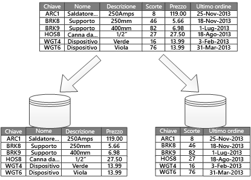
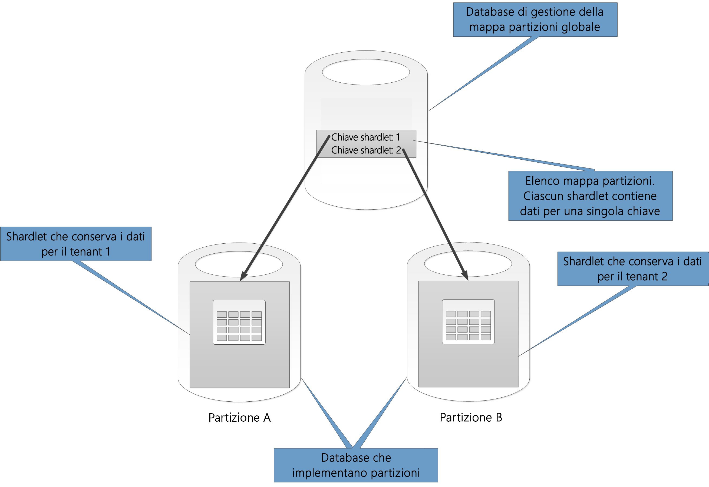
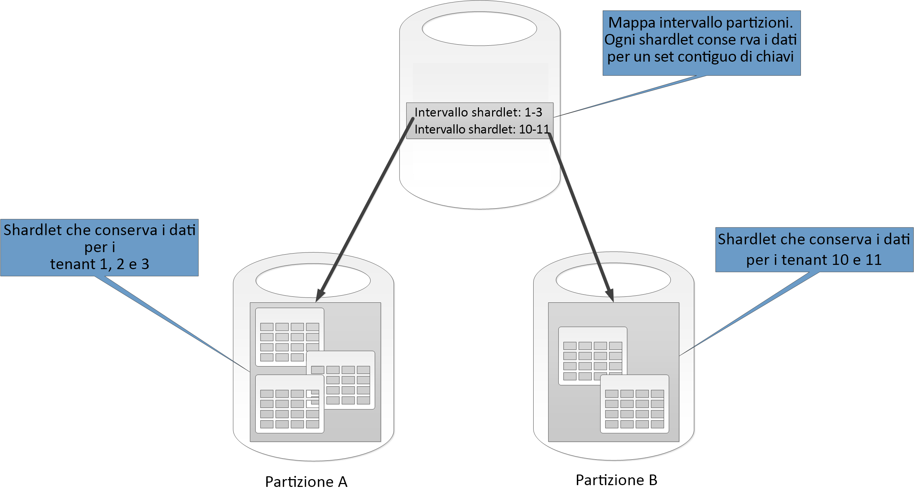
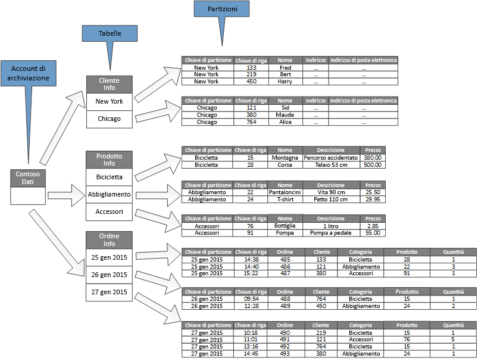
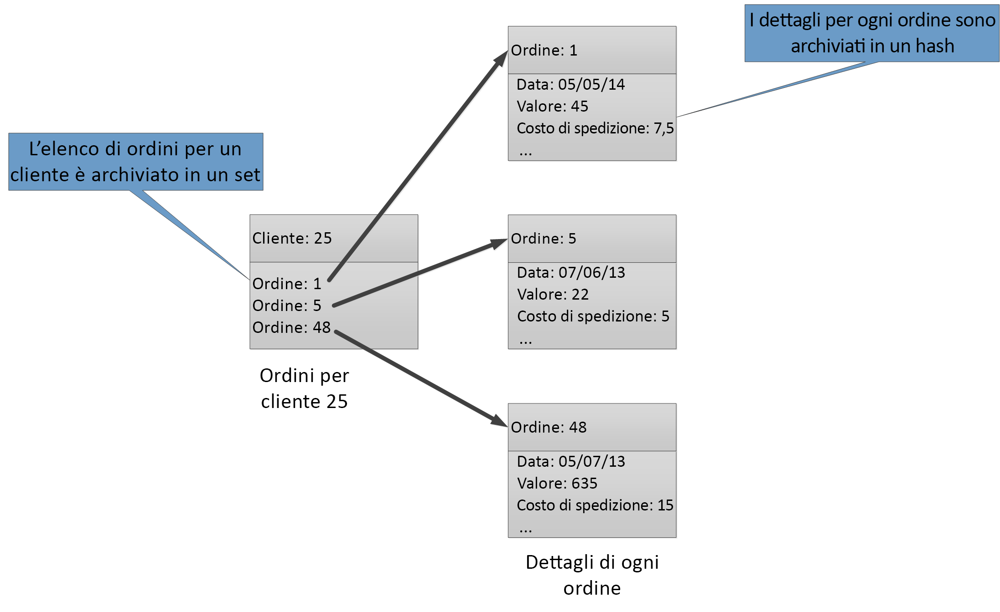

# Partizionamento dei datiData partitioning

In molte soluzioni su larga scala, i dati vengono suddivisi in partizioni separate per poter essere gestiti e per poter accedervi separatamente.In many large-scale solutions, data is divided into separate partitions that can be managed and accessed separately. La strategia di partizionamento deve essere scelta attentamente per ottimizzare le prestazioni riducendo al minimo gli effetti negativi.The partitioning strategy must be chosen carefully to maximize the benefits while minimizing adverse effects. Il partizionamento può aiutare a migliorare la scalabilità, ridurre i conflitti e ottimizzare le prestazioni.Partitioning can help improve scalability, reduce contention, and optimize performance. Un altro vantaggio offerto dal partizionamento è costituito dalla possibilità di suddividere i dati in base al modello di utilizzo.Another benefit of partitioning is that it can provide a mechanism for dividing data by the pattern of use. È possibile ad esempio archiviare i dati meno recenti e usati raramente in un archivio dati più economico.For example, you can archive older, less active (cold) data in cheaper data storage.

## Perché la partizione di dati?Why partition data?
La maggior parte dei servizi e delle applicazioni cloud archivia e recupera i dati come parte delle loro operazioni.Most cloud applications and services store and retrieve data as part of their operations. La progettazione degli archivi dati utilizzati da un'applicazione può avere un impatto significativo sulle prestazioni, sulla velocità effettiva e sulla scalabilità di un sistema.The design of the data stores that an application uses can have a significant bearing on the performance, throughput, and scalability of a system. Una tecnica comunemente applicata in sistemi di grandi dimensioni consiste nel suddividere i dati in partizioni separate.One technique that is commonly applied in large-scale systems is to divide the data into separate partitions.

> In questo articolo il termine *partizionamento* si riferisce al processo di suddivisione fisica dei dati in archivi dati separati.In this article, the term *partitioning* means the process of physically dividing data into separate data stores. Non si tratta del partizionamento delle tabelle SQL Server.It is not the same as SQL Server table partitioning.

Il partizionamento dei dati può offrire una serie di vantaggi.Partitioning data can offer a number of benefits. Ad esempio, può essere applicato al fine di:For example, it can be applied in order to:

* **Migliorare la scalabilità**.**Improve scalability**. L'aumento delle dimensioni del sistema del singolo database potrebbe causare il raggiungimento di un limite hardware fisico.When you scale up a single database system, it will eventually reach a physical hardware limit. Se si suddividono i dati in più partizioni, ognuna delle quali ospitata in un server separato, sarà possibile aumentare le dimensioni del sistema quasi all'infinito.If you divide data across multiple partitions, each of which is hosted on a separate server, you can scale out the system almost indefinitely.
* **Migliorare le prestazioni****Improve performance**. Le operazioni di accesso ai dati in ogni partizione vengono eseguite su un volume di dati più piccolo.Data access operations on each partition take place over a smaller volume of data. Se i dati sono partizionati in modo appropriato, il partizionamento può rendere il sistema più efficiente.Provided that the data is partitioned in a suitable way, partitioning can make your system more efficient. Le operazioni che interessano più di una partizione possono essere eseguite in parallelo.Operations that affect more than one partition can run in parallel. Ogni partizione può essere situata nell'applicazione che la utilizza per ridurre al minimo la latenza di rete.Each partition can be located near the application that uses it to minimize network latency.
* **Migliorare la disponibilità**.**Improve availability**. La separazione dei dati tra più server consente di evitare singoli punti di errore.Separating data across multiple servers avoids a single point of failure. Se un server fallisce, o è sottoposto a manutenzione pianificata, solo i dati collocati in quella partizione non sono disponibili.If a server fails, or is undergoing planned maintenance, only the data in that partition is unavailable. Le operazioni su altre partizioni possono continuare.Operations on other partitions can continue. L'aumento del numero di partizioni riduce l'impatto relativo di un singolo errore del server, riducendo la percentuale di dati che non saranno disponibili.Increasing the number of partitions reduces the relative impact of a single server failure by reducing the percentage of data that will be unavailable. Eseguire la replica di ogni partizione permette di ridurre ulteriormente le probabilità di un singolo errore della partizione singola che interessi le operazioni.Replicating each partition can further reduce the chance of a single partition failure affecting operations. Questa attività renderà anche possibile separare i dati critici per i quali deve essere garantita una disponibilità continua ed elevata dai dati di valore inferiore con minori requisiti di disponibilità (ad esempio i file di log).It also makes it possible to separate critical data that must be continually and highly available from low-value data that has lower availability requirements (log files, for example).
* **Migliorare la sicurezza**.**Improve security**. A seconda della natura dei dati e della modalità di partizionamento, è possibile separare i dati sensibili e non sensibili in partizioni diverse e, pertanto, in diversi server o archivi dati.Depending on the nature of the data and how it is partitioned, it might be possible to separate sensitive and non-sensitive data into different partitions, and therefore into different servers or data stores. La sicurezza può essere ottimizzata in modo specifico per i dati sensibili.Security can then be specifically optimized for the sensitive data.
* **Fornire flessibilità operativa**.**Provide operational flexibility**. Il partizionamento offre molte opportunità per operazioni di ottimizzazione, ottimizzazione dell'efficienza amministrativa e riduzione dei costi.Partitioning offers many opportunities for fine tuning operations, maximizing administrative efficiency, and minimizing cost. È possibile ad esempio definire diverse strategie per la gestione, il monitoraggio, il backup e il ripristino e altre attività amministrative in base all'importanza dei dati in ogni partizione.For example, you can define different strategies for management, monitoring, backup and restore, and other administrative tasks based on the importance of the data in each partition.
* **Combinare l'archivio dati al modello di utilizzo**.**Match the data store to the pattern of use**. Il partizionamento consente a ogni partizione di essere distribuita in un diverso tipo di archivio dati, basato sul costo e le funzionalità incorporate offerte dall’archivio dati.Partitioning allows each partition to be deployed on a different type of data store, based on cost and the built-in features that data store offers. Ad esempio, i dati binari di grandi dimensioni possono essere archiviati in un archivio di dati BLOB, mentre i dati più strutturati possono essere conservati in un database di documenti.For example, large binary data can be stored in a blob data store, while more structured data can be held in a document database. Per altre informazioni, vedere [Building a polyglot solution] (Creazione di una soluzione Polyglot) nella guida patterns & practices e [Data access for highly-scalable solutions: Using SQL, NoSQL, and polyglot persistence] (Accesso ai dati per le soluzioni altamente scalabili mediante SQL, NoSQL e persistenza Polyglot) nel sito Web Microsoft.For more information, see [Building a polyglot solution] in the patterns & practices guide and [Data access for highly-scalable solutions: Using SQL, NoSQL, and polyglot persistence] on the Microsoft website.

Alcuni sistemi non implementano il partizionamento perché viene considerato un costo anziché un vantaggio.Some systems do not implement partitioning because it is considered a cost rather than an advantage. Motivi comuni per questa spiegazione sono:Common reasons for this rationale include:

* Molti sistemi di archiviazione di dati non supportano i join tra le partizioni e può essere difficile mantenere l'integrità referenziale in un sistema partizionato.Many data storage systems do not support joins across partitions, and it can be difficult to maintain referential integrity in a partitioned system. Spesso è necessario implementare join e controlli di integrità nel codice dell'applicazione (nel livello di partizionamento), che può comportare I/O aggiuntive e la complessità dell'applicazione.It is frequently necessary to implement joins and integrity checks in application code (in the partitioning layer), which can result in additional I/O and application complexity.
* La gestione delle partizioni non è sempre un compito facile.Maintaining partitions is not always a trivial task. In un sistema in cui i dati sono volatili, potrebbe essere necessario ribilanciare periodicamente le partizioni per ridurre i conflitti e le aree sensibili.In a system where the data is volatile, you might need to rebalance partitions periodically to reduce contention and hot spots.
* Alcuni strumenti comuni non funzionano ovviamente con dati partizionati.Some common tools do not work naturally with partitioned data.

## Progettazione di partizioniDesigning partitions
I dati possono essere partizionati in modi diversi: orizzontalmente, verticalmente o dal punto di vista funzionale.Data can be partitioned in different ways: horizontally, vertically, or functionally. La strategia scelta dipende dal motivo del partizionamento dei dati e dai requisiti delle applicazioni e dei servizi che utilizzeranno i dati.The strategy you choose depends on the reason for partitioning the data, and the requirements of the applications and services that will use the data.

> [!NOTE]
> Gli schemi di partizionamento descritti in questa guida sono spiegati in modo indipendente dalla tecnologia di archiviazione dati sottostante.The partitioning schemes described in this guidance are explained in a way that is independent of the underlying data storage technology. Possono essere applicati a molti tipi di archivi dati, inclusi i database relazionali e NoSQL.They can be applied to many types of data stores, including relational and NoSQL databases.
>
>

### Strategie di partizionamentoPartitioning strategies
Le tre strategie più comuni per il partizionamento dei dati sono:The three typical strategies for partitioning data are:

* **Il partizionamento orizzontale** (spesso chiamato *sharding*).**Horizontal partitioning** (often called *sharding*). In questa strategia ogni partizione è un archivio dati indipendente, ma tutte le partizioni hanno lo stesso schema.In this strategy, each partition is a data store in its own right, but all partitions have the same schema. Ogni *partizione* contiene un sottoinsieme specifico dei dati, ad esempio tutti gli ordini per un set specifico di clienti in un'applicazione di e-commerce.Each partition is known as a *shard* and holds a specific subset of the data, such as all the orders for a specific set of customers in an e-commerce application.
* **Il partizionamento verticale**.**Vertical partitioning**. In questa strategia ogni partizione contiene un sottoinsieme dei campi per gli elementi nell'archivio dati.In this strategy, each partition holds a subset of the fields for items in the data store. I campi sono suddivisi in base ai loro modello di utilizzo.The fields are divided according to their pattern of use. I campi usati di frequente ad esempio possono essere collocati in una partizione verticale, mentre i campi usati raramente possono essere collocati in un'altra partizione.For example, frequently accessed fields might be placed in one vertical partition and less frequently accessed fields in another.
* **Partizionamento funzionale**.**Functional partitioning**. In questa strategia i dati vengono aggregati in base alla loro modalità di utilizzo da parte di ogni contesto limitato nel sistema.In this strategy, data is aggregated according to how it is used by each bounded context in the system. Ad esempio, un sistema di e-commerce che implementa funzioni di business separate per la fatturazione e la gestione dell'inventario dei prodotti può archiviare i dati delle fatture in una partizione e i dati di inventario dei prodotti in un'altra.For example, an e-commerce system that implements separate business functions for invoicing and managing product inventory might store invoice data in one partition and product inventory data in another.

È importante notare che le tre strategie descritte di seguito possono essere combinate.It’s important to note that the three strategies described here can be combined. Non si escludono a vicenda ed è consigliabile prenderle tutte in considerazione durante la progettazione di uno schema di partizionamento.They are not mutually exclusive, and we recommend that you consider them all when you design a partitioning scheme. Ad esempio, si potrebbe dividere i dati in partizioni e quindi utilizzare il partizionamento verticale per suddividere ulteriormente i dati in ogni partizione.For example, you might divide data into shards and then use vertical partitioning to further subdivide the data in each shard. Analogamente, i dati in una partizione funzionale possono essere suddivisi in partizioni che possono anche essere partizionate verticalmente.Similarly, the data in a functional partition can be split into shards (which can also be vertically partitioned).

Tuttavia, i diversi requisiti di ogni strategia possono generare diversi problemi di conflitto.However, the differing requirements of each strategy can raise a number of conflicting issues. È necessario valutare e bilanciare tutti questi elementi quando si progetta uno schema di partizionamento che soddisfi gli obiettivi di prestazioni di elaborazione dei dati complessivi del sistema.You must evaluate and balance all of these when designing a partitioning scheme that meets the overall data processing performance targets for your system. Nelle sezioni seguenti queste strategie vengono illustrate più in dettaglio.The following sections explore each of the strategies in more detail.

### Partizionamento orizzontale (sharding)Horizontal partitioning (sharding)
La figura 1 mostra una panoramica del partizionamento orizzontale o sharding.Figure 1 shows an overview of horizontal partitioning or sharding. In questo esempio, i dati di inventario del prodotto sono divisi in partizioni in base alla chiave di prodotto.In this example, product inventory data is divided into shards based on the product key. Ogni partizione contiene i dati per un intervallo contiguo di chiavi di partizione (A-G e H-Z), organizzati in ordine alfabetico.Each shard holds the data for a contiguous range of shard keys (A-G and H-Z), organized alphabetically.

*Figura 1. Partizionamento orizzontale (sharding) dei dati in base a una chiave di partizione**Figure 1. Horizontally partitioning (sharding) data based on a partition key*

Il partizionamento orizzontale consente di distribuire il carico su più computer, riducendo i conflitti e migliorando le prestazioni.Sharding helps you spread the load over more computers, which reduces contention and improves performance. È possibile scalare orizzontalmente il sistema aggiungendo ulteriori partizioni che vengono eseguite su altri server.You can scale the system out by adding further shards that run on additional servers.

Il fattore più importante quando si implementa questa strategia di partizionamento è la scelta della chiave di partizionamento orizzontale.The most important factor when implementing this partitioning strategy is the choice of sharding key. Può essere difficile modificare la chiave quando il sistema è in esecuzione.It can be difficult to change the key after the system is in operation. La chiave deve garantire che i dati siano partizionati in modo che il carico di lavoro sia il più possibile uniforme tra le partizioni.The key must ensure that data is partitioned so that the workload is as even as possible across the shards.

Si noti che le diverse partizioni non devono contenere volumi simili di dati.Note that different shards do not have to contain similar volumes of data. È invece importante bilanciare il numero di richieste.Rather, the more important consideration is to balance the number of requests. Alcune partizioni possono essere molto grandi, ma i singoli elementi possono essere oggetto di un numero ridotto di operazioni di accesso.Some shards might be very large, but each item is the subject of a low number of access operations. Altre partizioni invece possono essere più piccole, ma è possibile che ogni elemento venga usato più frequentemente.Other shards might be smaller, but each item is accessed much more frequently. È inoltre importante garantire che una singola partizione non superi i limiti di scalabilità (in termini di capacità e risorse di elaborazione) dell'archivio dati usato per ospitare la partizione.It is also important to ensure that a single shard does not exceed the scale limits (in terms of capacity and processing resources) of the data store that's being used to host that shard.

Se si usa uno schema di partizionamento, evitare di creare aree sensibili (o partizioni critiche) che possono influire sulle prestazioni e sulla disponibilità.If you use a sharding scheme, avoid creating hotspots (or hot partitions) that can affect performance and availability. Ad esempio, usare un hash di un identificatore di cliente anziché la prima lettera del nome di un cliente impedirà la distribuzione sbilanciata che risulterebbe dall'uso delle lettere iniziali, comuni e meno comuni.For example, if you use a hash of a customer identifier instead of the first letter of a customer’s name, you prevent the unbalanced distribution that results from common and less common initial letters. Questa è una tecnica tipica che consente di distribuire i dati in modo più uniforme tra le partizioni.This is a typical technique that helps distribute data more evenly across partitions.

Scegliere una chiave di partizionamento che riduca al minimo eventuali esigenze future di suddividere le partizioni di grandi dimensioni in parti più piccole, unire partizioni di piccole dimensioni in partizioni di dimensioni maggiori o modificare lo schema che descrive i dati archiviati in un set di partizioni.Choose a sharding key that minimizes any future requirements to split large shards into smaller pieces, coalesce small shards into larger partitions, or change the schema that describes the data stored in a set of partitions. Queste operazioni possono richiedere molto tempo e potrebbe essere necessario disconnettere una o più partizioni.These operations can be very time consuming, and might require taking one or more shards offline while they are performed.

Se viene eseguita la replica delle partizioni, potrebbe essere possibile mantenere alcune delle repliche online mentre altre vengono suddivise, unite o riconfigurate.If shards are replicated, it might be possible to keep some of the replicas online while others are split, merged, or reconfigured. È possibile tuttavia che il sistema limiti le operazioni che possono essere eseguite sui dati in tali partizioni durante la riconfigurazione.However, the system might need to limit the operations that can be performed on the data in these shards while the reconfiguration is taking place. Ad esempio, i dati nelle repliche possono essere contrassegnati come di sola lettura per limitare l'ambito di eventuali incoerenze che possono verificarsi durante la ristrutturazione delle partizioni.For example, the data in the replicas can be marked as read-only to limit the scope of inconsistences that might occur while shards are being restructured.

> Per altre informazioni e istruzioni sulla maggior parte di queste considerazioni e tecniche consigliate per la progettazione di archivi dati che implementano il partizionamento orizzontale, vedere [Modello di partizionamento orizzontale]For more detailed information and guidance about many of these considerations, and good practice techniques for designing data stores that implement horizontal partitioning, see [Sharding pattern].
>
>

### Il partizionamento verticaleVertical partitioning
L'utilizzo più comune per il partizionamento verticale è  la riduzione dei costi di I/O e delle prestazioni associati con il recupero degli elementi utilizzati più frequentemente.The most common use for vertical partitioning is to reduce the I/O and performance costs associated with fetching the items that are accessed most frequently. La Figura 2 mostra un esempio di partizionamento verticale.Figure 2 shows an example of vertical partitioning. Nell'esempio, le diverse proprietà di ogni elemento di dati vengono mantenute in partizioni diverse.In this example, different properties for each data item are held in different partitions. Una partizione contiene i dati cui viene eseguito l'accesso più frequentemente, inclusi nome, descrizione e informazioni sul prezzo dei prodotti.One partition holds data that is accessed more frequently, including the name, description, and price information for products. Un'altra partizione contiene il volume a magazzino e la data dell'ultimo ordine.Another holds the volume in stock and the last ordered date.

*Figura 2. Partizionamento verticale dei dati in base al modello di utilizzo**Figure 2. Vertically partitioning data by its pattern of use*

Nell'esempio, l'applicazione ricerca regolarmente il nome del prodotto, la descrizione e il prezzo quando visualizza i dettagli dei prodotti ai clienti.In this example, the application regularly queries the product name, description, and price when displaying the product details to customers. Poiché la data e il livello disponibile sono due elementi che vengono comunemente utilizzati insieme, quando il prodotto è stato ordinato dal produttore sono stati conservati in una partizione separata.The stock level and date when the product was last ordered from the manufacturer are held in a separate partition because these two items are commonly used together.

Questo schema di partizionamento offre il vantaggio che i dati relativamente lenti (nome prodotto, descrizione e prezzo) sono separati dai dati più dinamici (livello disponibile e ultima data ordinata).This partitioning scheme has the added advantage that the relatively slow-moving data (product name, description, and price) is separated from the more dynamic data (stock level and last ordered date). Per un'applicazione può risultare vantaggioso memorizzare nella cache i dati lenti usati di frequente.An application might find it beneficial to cache the slow-moving data in memory if it is frequently accessed.

Un altro scenario tipico per questa strategia di partizionamento è ottimizzare la sicurezza dei dati sensibili.Another typical scenario for this partitioning strategy is to maximize the security of sensitive data. È possibile ad esempio archiviare i numeri delle carte di credito e i corrispondenti numeri di verifica di sicurezza delle carte in partizioni separate.For example, you can do this by storing credit card numbers and the corresponding card security verification numbers in separate partitions.

Il partizionamento verticale può inoltre ridurre la quantità di accessi simultanei richiesta per i dati.Vertical partitioning can also reduce the amount of concurrent access that's needed to the data.

> Il partizionamento verticale opera a livello di entità all'interno di un archivio dati, normalizzando parzialmente un'entità per suddividerla da un elemento *di grandi dimensioni* a una raccolta di elementi *di dimensioni ridotte*.Vertical partitioning operates at the entity level within a data store, partially normalizing an entity to break it down from a *wide* item to a set of *narrow* items. È particolarmente adatto per gli archivi di dati orientati alla colonna, ad esempio HBase e Cassandra.It is ideally suited for column-oriented data stores such as HBase and Cassandra. Se è improbabile modificare i dati in una raccolta di colonne, è possibile utilizzare archivi di colonne in SQL Server.If the data in a collection of columns is unlikely to change, you can also consider using column stores in SQL Server.
>
>

### Partizionamento funzionaleFunctional partitioning
Per i sistemi in cui è possibile identificare un contesto delimitato per ogni area di attività distinta o per ogni servizio nell'applicazione, il partizionamento funzionale fornisce una tecnica per migliorare le prestazioni di accesso ai dati e di isolamento.For systems where it is possible to identify a bounded context for each distinct business area or service in the application, functional partitioning provides a technique for improving isolation and data access performance. Un altro utilizzo comune del partizionamento funzionale è la separazione dei dati di sola scrittura dai dati di sola lettura usati per la creazione di report.Another common use of functional partitioning is to separate read-write data from read-only data that's used for reporting purposes. La figura 3 mostra una panoramica del partizionamento funzionale in cui i dati di inventario sono separati dai dati del cliente.Figure 3 shows an overview of functional partitioning where inventory data is separated from customer data.

*Figura 3. Partizionamento funzionale dei dati in base al contesto limitato o al sottodominio**Figure 3. Functionally partitioning data by bounded context or subdomain*

Questa strategia di partizionamento può contribuire a ridurre i conflitti di accesso ai dati in diverse parti del sistema.This partitioning strategy can help reduce data access contention across different parts of a system.

## Progettazione di partizioni per la scalabilitàDesigning partitions for scalability
È importante considerare le dimensioni e il carico di lavoro di ogni partizione e bilanciarle in modo che i dati siano distribuiti per ottenere la massima scalabilità.It's vital to consider size and workload for each partition and balance them so that data is distributed to achieve maximum scalability. È tuttavia necessario partizionare i dati in modo che non superino i limiti di ridimensionamento della singola partizione di un archivio.However, you must also partition the data so that it does not exceed the scaling limits of a single partition store.

Quando si progettano le partizioni per la scalabilità, attenersi alla seguente procedura:Follow these steps when designing partitions for scalability:

1. Analizzare l'applicazione per comprendere i modelli di accesso ai dati, ad esempio la dimensione del set di risultati restituito da ogni query, la frequenza di accesso, la latenza intrinseca e i requisiti di elaborazione di calcolo sul lato server.Analyze the application to understand the data access patterns, such as the size of the result set returned by each query, the frequency of access, the inherent latency, and the server-side compute processing requirements. In molti casi, è possibile che alcune entità principali richiederanno la maggior parte delle risorse di elaborazione.In many cases, a few major entities will demand most of the processing resources.
2. Usare questa analisi per determinare gli obiettivi di scalabilità attuali e futuri, ad esempio la dimensione dei dati e il carico di lavoro.Use this analysis to determine the current and future scalability targets, such as data size and workload. Distribuire i dati nelle partizioni in modo da soddisfare l'obiettivo di scalabilità.Then distribute the data across the partitions to meet the scalability target. Nella strategia di partizionamento orizzontale è importante scegliere la chiave di partizionamento appropriata per assicurarsi che la distribuzione sia uniforme.In the horizontal partitioning strategy, choosing the appropriate shard key is important to make sure distribution is even. Per altre informazioni, vedere il [Modello di partizionamento orizzontale].For more information, see the [Sharding pattern].
3. È necessario assicurarsi che le risorse disponibili in ogni partizione siano sufficienti per gestire i requisiti di scalabilità in termini di dimensioni dei dati e di velocità.Make sure that the resources available to each partition are sufficient to handle the scalability requirements in terms of data size and throughput. Il nodo che ospita una partizione, ad esempio, potrebbe imporre un limite hardware sulla quantità di spazio di archiviazione, sulla potenza di elaborazione o sulla larghezza di banda di rete che fornisce.For example, the node that's hosting a partition might impose a hard limit on the amount of storage space, processing power, or network bandwidth that it provides. Se i requisiti di elaborazione e archiviazione dati rischiano di superare tali limiti, potrebbe essere necessario perfezionare la strategia di partizionamento o dividere ulteriormente i dati.If the data storage and processing requirements are likely to exceed these limits, it might be necessary to refine your partitioning strategy or split data out further. Ad esempio, un approccio di scalabilità potrebbe essere quello di separare i dati di registrazione dalle funzionalità principali dell'applicazione.For example, one scalability approach might be to separate logging data from the core application features. A tale scopo si usano archivi dati separati per impedire che i requisiti totali di archiviazione superino il limite di scalabilità del nodo.You do this by using separate data stores to prevent the total data storage requirements from exceeding the scaling limit of the node. Se il numero totale di archivi dati supera il limite del nodo, può essere necessario usare nodi di archiviazione separati.If the total number of data stores exceeds the node limit, it might be necessary to use separate storage nodes.
4. Monitorare il sistema durante l'uso per verificare che i dati vengano distribuiti come previsto e che le partizioni siano in grado di gestire il carico imposto.Monitor the system under use to verify that the data is distributed as expected and that the partitions can handle the load that is imposed on them. È possibile che l'utilizzo non corrisponda all'utilizzo previsto dall'analisi.It's possible that the usage does not match the usage that's anticipated by the analysis. In tal caso, potrebbe essere necessario ribilanciare le partizioni.In that case, it might be possible to rebalance the partitions. Se l'operazione non riesce, potrebbe essere necessario riprogettare alcune parti del sistema per ottenere il bilanciamento richiesto.Failing that, it might be necessary to redesign some parts of the system to gain the required balance.

Si noti che alcuni ambienti cloud allocano risorse in termini di limiti di infrastruttura.Note that some cloud environments allocate resources in terms of infrastructure boundaries. Assicurarsi che tali limiti forniscano spazio sufficiente per una crescita anticipata del volume di dati, in termini di archiviazione dei dati, potenza di elaborazione e larghezza di banda.Ensure that the limits of your selected boundary provide enough room for any anticipated growth in the volume of data, in terms of data storage, processing power, and bandwidth.

Ad esempio, se si usa l'archiviazione tabelle di Azure, una partizione occupata potrebbe richiedere più risorse rispetto a quelli disponibili per una singola partizione per gestire le richieste.For example, if you use Azure table storage, a busy shard might require more resources than are available to a single partition to handle requests. (È previsto un limite per il volume di richieste che possono essere gestite da una singola partizione in un determinato periodo di tempo.(There is a limit to the volume of requests that can be handled by a single partition in a particular period of time. Per altre informazioni, vedere la pagina [Obiettivi di scalabilità e prestazioni per Archiviazione di Azure] nel sito Web Microsoft.See the page [Azure storage scalability and performance targets] on the Microsoft website for more details.)

 In questo caso, è possibile che la partizione debba essere ripartizionata in modo da ripartire il carico.If this is the case, the shard might need to be repartitioned to spread the load. Se la dimensione totale o la velocità effettiva delle tabelle supera la capacità di un account di archiviazione, può essere necessario creare ulteriori account di archiviazione e suddividere le tabelle tra questi.If the total size or throughput of these tables exceeds the capacity of a storage account, it might be necessary to create additional storage accounts and spread the tables across these accounts. Se il numero di account di archiviazione supera il numero di account disponibili per una sottoscrizione, può essere necessario usare più sottoscrizioni.If the number of storage accounts exceeds the number of accounts that are available to a subscription, then it might be necessary to use multiple subscriptions.

## Progettazione di partizioni per le prestazioni delle queryDesigning partitions for query performance
Le prestazioni delle query possono spesso essere aumentate usando set di dati più piccoli ed eseguendo query parallele.Query performance can often be boosted by using smaller data sets and by running parallel queries. Ogni partizione deve contenere una piccola parte dell'intero set di dati.Each partition should contain a small proportion of the entire data set. La riduzione del volume può migliorare le prestazioni delle query.This reduction in volume can improve the performance of queries. Tuttavia, il partizionamento non è un'alternativa per la progettazione e la configurazione di un database in modo appropriato.However, partitioning is not an alternative for designing and configuring a database appropriately. Ad esempio, assicurarsi di disporre degli indici necessari richiesti se si utilizza un database relazionale.For example, make sure that you have the necessary indexes in place if you are using a relational database.

Quando si progettano le partizioni per le prestazioni delle query, attenersi alla seguente procedura:Follow these steps when designing partitions for query performance:

1. Esaminare i requisiti dell'applicazione e delle prestazioni:Examine the application requirements and performance:
   * Usare i requisiti aziendali per determinare le query critiche che devono sempre essere eseguite rapidamente.Use the business requirements to determine the critical queries that must always perform quickly.
   * Monitoraggio del sistema per identificare qualsiasi query eseguita lentamente.Monitor the system to identify any queries that perform slowly.
   * Stabilire quali le query vengono eseguite più frequentemente.Establish which queries are performed most frequently. Una singola istanza di ogni query potrebbe avere un costo minimo, ma il consumo cumulativo di risorse potrebbe essere significativo.A single instance of each query might have minimal cost, but the cumulative consumption of resources could be significant. Può essere vantaggioso separare i dati recuperati da queste query in una partizione distinta o anche in una cache.It might be beneficial to separate the data that's retrieved by these queries into a distinct partition, or even a cache.
2. Partizionare i dati che causano un rallentamento delle prestazioni:Partition the data that is causing slow performance:
   * Limitare le dimensioni di ogni partizione in modo che il tempo di risposta della query sia compreso nel target.Limit the size of each partition so that the query response time is within target.
   * Progettare la chiave di partizionamento in modo che l'applicazione possa trovare facilmente la partizione, se si implementa il partizionamento orizzontale.Design the shard key so that the application can easily find the partition if you are implementing horizontal partitioning. In questo modo la query non deve analizzare ogni partizione.This prevents the query from having to scan through every partition.
   * Considerare la posizione di una partizione.Consider the location of a partition. Se possibile, provare a mantenere i dati nelle partizioni geograficamente vicine alle applicazioni e gli utenti che vi accedono.If possible, try to keep data in partitions that are geographically close to the applications and users that access it.
3. Se un'entità dispone di requisiti relativi alle prestazioni di velocità effettiva e della query, utilizzare il partizionamento funzionale in base a tale entità.If an entity has throughput and query performance requirements, use functional partitioning based on that entity. Se tale entità non soddisfa i requisiti, è necessario applicare anche il partizionamento orizzontale.If this still doesn't satisfy the requirements, apply horizontal partitioning as well. Nella maggior parte dei casi è sufficiente una singola strategia di partizionamento, ma in alcuni casi è preferibile combinare entrambe le strategie.In most cases a single partitioning strategy will suffice, but in some cases it is more efficient to combine both strategies.
4. È possibile usare query asincrone che vengono eseguite in parallelo tra le partizioni per migliorare le prestazioni.Consider using asynchronous queries that run in parallel across partitions to improve performance.

## Progettazione di partizioni per la disponibilitàDesigning partitions for availability
Il partizionamento dei dati può migliorare la disponibilità delle applicazioni garantendo che l'intero set di dati non costituisca un singolo punto di errore e che i singoli sottoinsiemi del set di dati possano essere gestiti in modo indipendente.Partitioning data can improve the availability of applications by ensuring that the entire dataset does not constitute a single point of failure and that individual subsets of the dataset can be managed independently. Replicare le partizioni che contengono dati critici può inoltre migliorare la disponibilità.Replicating partitions that contain critical data can also improve availability.

Quando si progettano e implementano partizioni, considerare i seguenti fattori che influiscono sulla disponibilità:When designing and implementing partitions, consider the following factors that affect availability:

* **Criticità dei dati nelle operazioni aziendali**.**How critical the data is to business operations**. Alcuni dati potrebbero includere informazioni aziendali critiche, ad esempio dettagli di fatture o transazioni bancarie.Some data might include critical business information such as invoice details or bank transactions. Altri dati possono includere dati operativi meno critici, ad esempio i file di log, le tracce di prestazioni e così via.Other data might include less critical operational data, such as log files, performance traces, and so on. Dopo aver individuato tutti i tipi di dati, prendere in considerazione:After identifying each type of data, consider:
  * L'archiviazione dei dati critici in partizioni a disponibilità elevata con un piano di backup appropriato.Storing critical data in highly-available partitions with an appropriate backup plan.
  * La definizione di gestione separata e meccanismi di monitoraggio o procedure per le diverse criticità di ogni set di dati.Establishing separate management and monitoring mechanisms or procedures for the different criticalities of each dataset. Il posizionamento di dati che hanno lo stesso livello di criticità nella stessa partizione in modo da poter eseguire il backup con una frequenza appropriata.Place data that has the same level of criticality in the same partition so that it can be backed up together at an appropriate frequency. Le partizioni contenenti dati per le transazioni bancarie, ad esempio, potrebbero richiedere backup più frequenti rispetto alle partizioni che contengono informazioni di registrazione o di traccia.For example, partitions that hold data for bank transactions might need to be backed up more frequently than partitions that hold logging or trace information.
* **Gestione delle singole partizioni**.**How individual partitions can be managed**. La progettazione di partizioni per supportare la manutenzione e la gestione indipendenti offre diversi vantaggi.Designing partitions to support independent management and maintenance provides several advantages. Ad esempio: For example:
  * Se una partizione fallisce, può essere recuperata in modo indipendente, senza interferire con le istanze delle applicazioni che accedono ai dati di altre partizioni.If a partition fails, it can be recovered independently without affecting instances of applications that access data in other partitions.
  * Il partizionamento dei dati per aree geografiche può consentire attività di manutenzione pianificate che vengono eseguite in determinate fasce orarie per ogni posizione.Partitioning data by geographical area allows scheduled maintenance tasks to occur at off-peak hours for each location. Assicurarsi che le partizioni non siano troppo grandi per evitare che le operazioni di manutenzione pianificata non siano completate durante questo periodo.Ensure that partitions are not too big to prevent any planned maintenance from being completed during this period.
* **Replica dei dati critici tra le partizioni**.**Whether to replicate critical data across partitions**. Questa strategia può migliorare disponibilità e prestazioni, anche se può causare problemi di coerenza.This strategy can improve availability and performance, although it can also introduce consistency issues. La sincronizzazione delle modifiche apportate ai dati in una partizione in tutte le repliche richiede tempo.It takes time for changes made to data in a partition to be synchronized with every replica. Durante questo periodo, le diverse partizioni conterranno valori di dati diversi.During this period, different partitions will contain different data values.

## Informazioni sull'effetto del partizionamento sulla progettazione e sullo sviluppoUnderstanding how partitioning affects design and development
L'uso del partizionamento aggiunge complessità alla progettazione e allo sviluppo del sistema.Using partitioning adds complexity to the design and development of your system. Considerare il partizionamento come parte fondamentale della progettazione del sistema anche se inizialmente il sistema contiene una singola partizione.Consider partitioning as a fundamental part of system design even if the system initially only contains a single partition. Se il partizionamento viene considerato in un secondo momento quando il sistema inizia ad accusare problemi di prestazioni e scalabilità, l'operazione risulterà più complessa dal momento che esiste già un sistema in tempo reale da mantenere.If you address partitioning as an afterthought, when the system starts to suffer performance and scalability issues, the complexity increases because you already have a live system to maintain.

Se si aggiorna il sistema per incorporare il partizionamento in questo ambiente, è necessario modificare la logica di accesso ai dati.If you update the system to incorporate partitioning in this environment, it necessitates modifying the data access logic. Può inoltre essere necessario eseguire la migrazione di grandi quantità di dati esistenti per distribuirli nelle diverse partizioni, spesso mentre gli utenti si aspettano di poter continuare a usare il sistema.It can also involve migrating large quantities of existing data to distribute it across partitions, often while users expect to be able to continue using the system.

In alcuni casi, il partizionamento non è considerato importante perché il set di dati iniziale è ridotto e può essere facilmente gestito da un singolo server.In some cases, partitioning is not considered important because the initial dataset is small and can be easily handled by a single server. Ciò può verificarsi in un sistema che non prevede una scalabilità che supera le dimensioni iniziali, ma molti sistemi commerciali necessitano di espandersi se il numero di utenti aumenta.This might be true in a system that is not expected to scale beyond its initial size, but many commercial systems need to expand as the number of users increases. Questa espansione in genere è accompagnata da un aumento delle dimensioni del volume di dati.This expansion is typically accompanied by a growth in the volume of data.

È inoltre importante comprendere che il partizionamento non è sempre una funzione di archivi dati di grandi dimensioni.It's also important to understand that partitioning is not always a function of large data stores. Ad esempio, un archivio dati di piccole dimensioni potrebbe essere utilizzato molto frequentemente da centinaia di client simultanei.For example, a small data store might be heavily accessed by hundreds of concurrent clients. Il partizionamento dei dati in questa situazione può aiutare a ridurre i conflitti e a migliorare la velocità effettiva.Partitioning the data in this situation can help to reduce contention and improve throughput.

Quando si progetta un schema di partizionamento dei dati, tenere presente quanto riportato di seguito:Consider the following points when you design a data partitioning scheme:

* **Dove possibile, mantenere i dati per le operazioni di database più comuni insieme in ogni partizione per ridurre al minimo le operazioni di accesso ai dati tra partizioni**.**Where possible, keep data for the most common database operations together in each partition to minimize cross-partition data access operations**. Le query tra partizioni possono richiedere più tempo rispetto alle query all'interno di una singola partizione, ma ottimizzare le partizioni per un set di query potrebbe avere effetti negativi su latri set di query.Querying across partitions can be more time-consuming than querying only within a single partition, but optimizing partitions for one set of queries might adversely affect other sets of queries. Quando non è possibile evitare l'esecuzione di query tra partizioni, ridurre il tempo necessario per l'esecuzione delle query eseguendo query parallele e aggregando i risultati all'interno dell'applicazione.When you can't avoid querying across partitions, minimize query time by running parallel queries and aggregating the results within the application. Questo approccio potrebbe non essere possibile in alcuni casi, ad esempio quando è necessario ottenere da una query un risultato da usare nella query successiva.This approach might not be possible in some cases, such as when it's necessary to obtain a result from one query and use it in the next query.
* **Se le query usano dati di riferimento relativamente statici, ad esempio tabelle di codici postali o elenchi di prodotti, considerare la possibilità di eseguire la replica dei dati in tutte le partizioni per ridurre la richiesta di operazioni di ricerca separate in altre partizioni**.**If queries make use of relatively static reference data, such as postal code tables or product lists, consider replicating this data in all of the partitions to reduce the requirement for separate lookup operations in different partitions**. Questo approccio può inoltre ridurre la probabilità che i dati di riferimento diventino un set di dati "critici" soggetti a traffico elevato nell'intero sistema.This approach can also reduce the likelihood of the reference data becoming a "hot" dataset that is subject to heavy traffic from across the entire system. Esiste tuttavia un costo aggiuntivo relativo alla sincronizzazione di tutte le modifiche che potrebbero verificarsi per i dati di riferimento.However,   there is an additional cost associated with synchronizing any changes that might occur to this reference data.
* **Dove possibile, ridurre al minimo i requisiti per l'integrità referenziale tra le partizioni verticali e funzionali**.**Where possible, minimize requirements for referential integrity across vertical and functional partitions**. In questi schemi, l'applicazione stessa è responsabile della gestione dell'integrità referenziale tra le partizioni quando i dati vengono aggiornati e utilizzati.In these schemes, the application itself is responsible for maintaining referential integrity across partitions when data is updated and consumed. Le query che devono unire i dati tra più partizioni vengono eseguite più lentamente delle query che uniscono solo i dati all'interno della stessa partizione, poiché l'applicazione in genere richiede di eseguire query consecutive basate su una chiave e quindi su una chiave esterna.Queries that must join data across multiple partitions run more slowly than queries that join data only within the same partition because the application typically needs to perform consecutive queries based on a key and then on a foreign key. Si consiglia di replicare o de-normalizzare i dati rilevanti.Instead, consider replicating or de-normalizing the relevant data. Per ridurre al minimo il tempo di query in cui sono necessari i join tra partizioni, eseguire query parallele nelle partizioni e unire i dati all'interno dell'applicazione.To minimize the query time where cross-partition joins are necessary, run parallel queries over the partitions and join the data within the application.
* **È necessario considerare l'effetto che lo schema di partizionamento potrebbe avere sulla coerenza dei dati tra partizioni.****Consider the effect that the partitioning scheme might have on the data consistency across partitions.** Valutare se la coerenza assoluta è effettivamente un requisito.Evaluate whether strong consistency is actually a requirement. Al contrario, un approccio comune nel cloud consiste nell'implementare la coerenza finale.Instead, a common approach in the cloud is to implement eventual consistency. I dati in ogni partizione vengono aggiornati separatamente e la logica dell'applicazione garantisce che tutti gli aggiornamenti vengano completati correttamente.The data in each partition is updated separately, and the application logic ensures that the updates are all completed successfully. La logica gestisce inoltre le incoerenze che possono essere generate da query sui dati durante l'esecuzione di un'operazione coerente.It also handles the inconsistencies that can arise from querying data while an eventually consistent operation is running. Per altre informazioni sull'implementazione di coerenza finale, vedere le informazioni relative alla [Introduzione alla coerenza dei dati].For more information about implementing eventual consistency, see the [Data consistency primer].
* **È necessario considerare come le query individuano la partizione corretta**.**Consider how queries locate the correct partition**. Se una query deve analizzare tutte le partizioni per individuare i dati richiesti, ci sarà un impatto significativo sulle prestazioni, anche se sono in esecuzione più query parallele.If a query must scan all partitions to locate the required data, there is a significant impact on performance, even when multiple parallel queries are running. Le query usate con strategie di partizionamento verticale e funzionale possono naturalmente specificare le partizioni.Queries that are used with vertical and functional partitioning strategies can naturally specify the partitions. Tuttavia, quando si usa il partizionamento orizzontale, l'individuazione di un elemento può essere difficile poiché ogni partizione ha lo stesso schema.However, horizontal partitioning (sharding) can make locating an item difficult because every shard has the same schema. Una tipica soluzione di partizionamento orizzontale consiste nel mantenere una mappa che può essere utilizzata per cercare il percorso della partizione per elementi specifici di dati.A typical solution for sharding is to maintain a map that can be used to look up the shard location for specific items of data. Questa mappa può essere implementata nella logica di partizionamento orizzontale dell'applicazione o gestita dall'archivio dati se supporta il partizionamento orizzontale trasparente.This map can be implemented in the sharding logic of the application, or maintained by the data store if it supports transparent sharding.
* **Quando si usa una strategia di partizionamento orizzontale, prendere in considerazione la possibilità di ribilanciare periodicamente le partizioni**.**When using a horizontal partitioning strategy, consider periodically rebalancing the shards**. Ciò consente di distribuire uniformemente i dati secondo le dimensioni e il carico di lavoro per ridurre al minimo le aree sensibili, ottimizzare le prestazioni delle query e aggirare le limitazioni di archiviazione fisiche.This helps distribute the data evenly by size and by workload to minimize hotspots, maximize query performance, and work around physical storage limitations. Tuttavia, si tratta di un'attività complessa che spesso richiede l'utilizzo di uno strumento personalizzato o di un processo.However, this is a complex task that often requires the use of a custom tool or process.
* **La replica di ogni partizione offre ulteriore protezione dagli errori**.**If you replicate each partition, it provides additional protection against failure**. Se una singola replica ha esito negativo, le query possono essere indirizzate verso una copia di lavoro.If a single replica fails, queries can be directed towards a working copy.
* **Se si raggiungono i limiti fisici di una strategia di partizionamento, potrebbe essere necessario estendere la scalabilità a un livello diverso**.**If you reach the physical limits of a partitioning strategy, you might need to extend the scalability to a different level**. Ad esempio, se il partizionamento è a livello di database, potrebbe essere necessario individuare o eseguire la replica delle partizioni in più database.For example, if partitioning is at the database level, you might need to locate or replicate partitions in multiple databases. Se il partizionamento è già a livello di database e i limiti fisici sono un problema, può essere necessario individuare o eseguire la replica delle partizioni in più account di hosting.If partitioning is already at the database level, and physical limitations are an issue, it might mean that you need to locate or replicate partitions in multiple hosting accounts.
* **Evitare transazioni che accedono ai dati in più partizioni**.**Avoid transactions that access data in multiple partitions**. Alcuni archivi di dati implementano la coerenza transazionale e l'integrità per le operazioni che modificano i dati, ma solo quando i dati si trovano in una singola partizione.Some data stores implement transactional consistency and integrity for operations that modify data, but only when the data is located in a single partition. Se è necessario supporto transazionale tra più partizioni, probabilmente sarà necessario implementare questo come parte della logica dell'applicazione poiché la maggior parte dei sistemi di partizionamento non forniscono il supporto nativo.If you need transactional support across multiple partitions, you will probably need to implement this as part of your application logic because most partitioning systems do not provide native support.

Tutti gli archivi dati richiedono una gestione operativa e il monitoraggio dell'attività.All data stores require some operational management and monitoring activity. Le attività variano dal caricamento dei dati, backup e ripristino dei dati, riorganizzazione dei dati e la garanzia che il sistema funziona in modo corretto ed efficiente.The tasks can range from loading data, backing up and restoring data, reorganizing data, and ensuring that the system is performing correctly and efficiently.

Considerare i seguenti fattori che influiscono sulla gestione operativa:Consider the following factors that affect operational management:

* **Come implementare attività di gestione e operative appropriate quando i dati sono partizionati**.**How to implement appropriate management and operational tasks when the data is partitioned**. Queste attività possono includere il backup e il ripristino, l'archiviazione dei dati, il monitoraggio del sistema e altre attività amministrative.These tasks might include backup and restore, archiving data, monitoring the system, and other administrative tasks. Mantenere la coerenza logica durante le operazioni di backup e ripristino, ad esempio, può essere una sfida.For example, maintaining logical consistency during backup and restore operations can be a challenge.
* **Come caricare i dati in più partizioni e aggiungere nuovi dati provenienti da altre origini**.**How to load the data into multiple partitions and add new data that's arriving from other sources**. Alcuni strumenti e utilità potrebbero non supportare le operazioni di dati partizionati, quale il caricamento dei dati nella partizione corretta.Some tools and utilities might not support sharded data operations such as loading data into the correct partition. Ciò significa che potrebbe essere necessario creare o ottenere nuovi strumenti e utilità.This means that you might have to create or obtain new tools and utilities.
* **Come archiviare ed eliminare i dati a intervalli regolari**.**How to archive and delete the data on a regular basis**. Per impedire una crescita eccessiva delle partizioni, è necessario archiviare ed eliminare i dati a intervalli regolari, ad esempio ogni mese.To prevent the excessive growth of partitions, you need to archive and delete data on a regular basis (perhaps monthly). Può essere necessario trasformare i dati in base a uno schema di archiviazione differente.It might be necessary to transform the data to match a different archive schema.
* **Come individuare i problemi di integrità dei dati**.**How to locate data integrity issues**. Considerare la possibilità di eseguire regolarmente un processo per individuare eventuali problemi di integrità dei dati, ad esempio dati in una partizione che fanno riferimento a informazioni mancanti in un'altra partizione.Consider running a periodic process to locate any data integrity issues such as data in one partition that references missing information in another. Il processo potrebbe tentare di correggere automaticamente questi problemi o generare un avviso a un operatore per risolvere i problemi manualmente.The process can either attempt to fix these issues automatically or raise an alert to an operator to correct the problems manually. Ad esempio, in un'applicazione di e-commerce, le informazioni sugli ordini possono essere conservate in una partizione, mentre le voci che costituiscono ogni ordine possono essere conservate in un'altra partizione.For example, in an e-commerce application, order information might be held in one partition but the line items that constitute each order might be held in another. Il processo di inserimento di un ordine dovrà aggiungere i dati in entrambe le partizioni.The process of placing an order needs to add data to other partitions. Se questo processo fallisce, potrebbero essere archiviate voci per le quali non esiste alcun ordine corrispondente.If this process fails, there might be line items stored for which there is no corresponding order.

Le tecnologie di archiviazione di dati diversi in genere forniscono le proprie funzionalità per il supporto di partizionamento.Different data storage technologies typically provide their own features to support partitioning. Nelle sezioni seguenti sono descritte le opzioni che vengono implementate dagli archivi dati comunemente usati dalle applicazioni Azure.The following sections summarize the options that are implemented by data stores commonly used by Azure applications. Le sezioni includono anche considerazioni sulla progettazione di applicazioni che possono usare al meglio queste funzionalità.They also describe considerations for designing applications that can best take advantage of these features.

## Strategie di partizionamento per Database SQL AzurePartitioning strategies for Azure SQL Database
Il Database di SQL Azure è un database relazionale as-a-service che viene eseguito nel cloud.Azure SQL Database is a relational database-as-a-service that runs in the cloud. È basato su Microsoft SQL Server.It is based on Microsoft SQL Server. Un database relazionale divide le informazioni in tabelle e ogni tabella contiene informazioni sulle entità come una serie di righe.A relational database divides information into tables, and each table holds information about entities as a series of rows. Ogni riga include colonne che contengono i dati per i singoli campi di un'entità.Each row contains columns that hold the data for the individual fields of an entity. La pagina [Informazioni sul database SQL] del sito Web Microsoft contiene informazioni dettagliate sulla creazione e l'uso di database SQL.The page [What is Azure SQL Database?] on the Microsoft website provides detailed documentation about creating and using SQL databases.

## Partizionamento orizzontale con database elasticoHorizontal partitioning with Elastic Database
Un singolo database SQL ha un limite per il volume di dati che può contenere.A single SQL database has a limit to the volume of data that it can contain. La velocità effettiva è vincolata da fattori di architettura e dal numero di connessioni simultanee supportate.Throughput is constrained by architectural factors and the number of concurrent connections that it supports. La funzione Database elastico del database SQL supporta la scalabilità orizzontale per un database SQL.The Elastic Database feature of SQL Database supports horizontal scaling for a SQL database. Usando Database elastico è possibile suddividere i dati in partizioni che vengono distribuite in più database SQL.Using Elastic Database, you can partition your data into shards that are spread across multiple SQL databases. È inoltre possibile aggiungere o rimuovere partizioni in base alla crescita o alla riduzione del volume di dati da gestire.You can also add or remove shards as the volume of data that you need to handle grows and shrinks. Database elastico consente inoltre di ridurre i conflitti distribuendo il carico sui database.Using Elastic Database can also help reduce contention by distributing the load across databases.

> [!NOTE]
> Il Database elastico è una sostituzione della funzionalità per le federazioni del database SQL di Azure.Elastic Database is a replacement for the Federations feature of Azure SQL Database. È possibile eseguire la migrazione delle installazioni di federazioni di database SQL esistenti in Database elastico usando l'utilità di migrazione federazioni.Existing SQL Database Federation installations can be migrated to Elastic Database by using the Federations migration utility. In alternativa, è possibile implementare il proprio meccanismo di partizionamento orizzontale se lo scenario non si presta naturalmente alle funzionalità offerte da Database elastico.Alternatively, you can implement your own sharding mechanism if your scenario does not lend itself naturally to the features that are provided by Elastic Database.
>
>

Ogni partizione viene implementata come un database SQL.Each shard is implemented as a SQL database. Una partizione può contenere più di un set di dati (denominato *shardlet*).A shard can hold more than one dataset (referred to as a *shardlet*). Ogni database include metadati che descrivono gli shardlet contenuti al suo interno.Each database maintains metadata that describes the shardlets that it contains. Un shardlet può essere un singolo elemento dati o può essere un gruppo di elementi che condividono la stessa chiave shardlet.A shardlet can be a single data item, or it can be a group of items that share the same shardlet key. Ad esempio, se si stanno partizionando dati in un'applicazione multi-tenant, la chiave shardlet potrebbe essere l'ID tenant e tutti i dati per un tenant specificato possono essere conservati come parte dello shardlet stesso.For example, if you are sharding data in a multitenant application, the shardlet key can be the tenant ID, and all data for a given tenant can be held as part of the same shardlet. I dati per altri tenant saranno conservati in shardlet diversi.Data for other tenants would be held in different shardlets.

È compito del programmatore associare un set di dati a una chiave shardlet.It is the programmer's responsibility to associate a dataset with a shardlet key. Un database SQL separato effettua la gestione del mapping globale delle partizioni.A separate SQL database acts as a global shard map manager. Questo database contiene un elenco di tutte le partizioni e shardlet nel sistema.This database contains a list of all the shards and shardlets in the system. Un'applicazione client che accede ai dati si connette prima al database di gestione del mapping globale per ottenere una copia del mapping delle partizioni in cui sono elencate le partizioni e gli shardlet e la memorizza nella cache locale.A client application that accesses data connects first to the global shard map manager database to obtain a copy of the shard map (listing shards and shardlets), which it then caches locally.

Quindi, l'applicazione utilizza queste informazioni per indirizzare le richieste alla partizione appropriata.The application then uses this information to route data requests to the appropriate shard. Questa funzionalità è nascosta dietro una serie di API contenute nella libreria client del database elastico del database SQL di Azure, disponibile come pacchetto NuGet.This functionality is hidden behind a series of APIs that are contained in the Azure SQL Database Elastic Database Client Library, which is available as a NuGet package. La pagina [Panoramica sulle funzionalità di database elastico] nel sito Web Microsoft offre un'introduzione più completa al database elastico.The page [Elastic Database features overview] on the Microsoft website provides a more comprehensive introduction to Elastic Database.

> [!NOTE]
> È possibile replicare il database di gestione del mapping globale delle partizioni per ridurre la latenza e migliorare la disponibilità.You can replicate the global shard map manager database to reduce latency and improve availability. Se si implementa il database usando uno dei piani tariffari Premium è possibile configurare la replica geografica attiva per copiare continuamente i dati in database situati in diverse aree geografiche.If you implement the database by using one of the Premium pricing tiers, you can configure active geo-replication to continuously copy data to databases in different regions. Creare una copia del database in ogni area geografica in cui si trovano gli utenti.Create a copy of the database in each region in which users are based. Configurare quindi l'applicazione per connettersi a tale copia per ottenere la mappa delle partizioni.Then configure your application to connect to this copy to obtain the shard map.
>
> Un approccio alternativo consiste nell'usare la sincronizzazione dati SQL di Azure o una pipeline di Azure Data Factory per replicare il database di gestione del mapping delle partizioni nelle aree geografiche.An alternative approach is to use Azure SQL Data Sync or an Azure Data Factory pipeline to replicate the shard map manager database across regions. Il modulo di replica viene eseguito periodicamente e risulta più appropriato se il mapping della partizione viene modificato raramente.This form of replication runs periodically and is more suitable if the shard map changes infrequently. Inoltre, il database di gestione del mapping delle partizioni non deve essere creato usando un piano tariffario Premium.Additionally, the shard map manager database does not have to be created by using a Premium pricing tier.
>
>

Il database elastico offre due schemi per la mappature di dati per gli shardlet e per archiviarli in partizioni:Elastic Database provides two schemes for mapping data to shardlets and storing them in shards:

* Un **mapping delle partizioni di tipo elenco** descrive l'associazione tra una singola chiave e uno shardlet.A **list shard map** describes an association between a single key and a shardlet. Ad esempio, in un sistema multi-tenant, i dati per ogni tenant possono essere associati a una chiave univoca e archiviati in un proprio shardlet.For example, in a multitenant system, the data for each tenant can be associated with a unique key and stored in its own shardlet. Per garantire la riservatezza e l'isolamento, ovvero per impedire a un tenant di esaurire le risorse di archiviazione dati disponibili per altri tenant, ogni shardlet può essere bloccato all'interno della propria partizione.To guarantee privacy and isolation (that is, to prevent one tenant from exhausting the data storage resources available to others), each shardlet can be held within its own shard.

*Figura 4. Uso di un mapping delle partizioni di tipo elenco per l'archiviazione dei dati dei tenant in partizioni separate**Figure 4. Using a list shard map to store tenant data in separate shards*

* Un **mapping delle partizioni di tipo intervallo** descrive l'associazione tra un set di valori di chiavi contigue e uno shardlet.A **range shard map** describes an association between a set of contiguous key values and a shardlet. Nell'esempio di multi-tenant descritto in precedenza, come alternativa all'implementazione di shardlet dedicati, è possibile raggruppare i dati per un set di tenant (ognuno con la propria chiave) all'interno di uno stesso shardlet.In the multitenant example described previously, as an alternative to implementing dedicated shardlets, you can group the data for a set of tenants (each with their own key) within the same shardlet. Questo schema è meno costoso del primo poiché i tenant condividono le risorse di archiviazione dati ma crea un rischio di riduzione della privacy e dell'isolamento dei dati.This scheme is less expensive than the first (because tenants share data storage resources), but it also creates a risk of reduced data privacy and isolation.

*Figura 5. Uso di un mapping delle partizioni di tipo intervallo per l'archiviazione dei dati per un intervallo di tenant in una partizione**Figure 5. Using a range shard map to store data for a range of tenants in a shard*

Si noti che una singola partizione può contenere i dati per shardlet diversi.Note that a single shard can contain the data for several shardlets. Ad esempio, è possibile usare gli shardlet dell'elenco per archiviare i dati per i diversi tenant non contigui nella stessa partizione.For example, you can use list shardlets to store data for different non-contiguous tenants in the same shard. È inoltre possibile usare contemporaneamente shardlet di intervallo e di elenco nella stessa partizione, anche se verranno indirizzati tramite mapping diversi nel database di gestione del mapping globale delle partizioni.You can also mix range shardlets and list shardlets in the same shard, although they will be addressed through different maps in the global shard map manager database. Il database di gestione del mapping globale delle partizioni può contenere più mapping delle partizioni. La figura 6 descrive questo approccio.(The global shard map manager database can contain multiple shard maps.) Figure 6 depicts this approach.

*Figura 6. Implementazione di più mapping delle partizioni**Figure 6. Implementing multiple shard maps*

Lo schema di partizionamento implementato può avere un impatto significativo sulle prestazioni del sistema.The partitioning scheme that you implement can have a significant bearing on the performance of your system. Può influire inoltre sulla velocità con cui le partizioni devono essere aggiunte o rimosse o la velocità con cui i dati devono essere ripartizionati tra le partizioni.It can also affect the rate at which shards have to be added or removed, or the rate at which data must be repartitioned across shards. Quando si usa Database elastico per partizionare i dati, tenere presente quanto riportato di seguito:Consider the following points when you use Elastic Database to partition data:

* Raggruppare i dati usati insieme nella stessa partizione  ed evitare operazioni di accesso ai dati contenuti in più partizioni.Group data that is used together in the same shard, and avoid operations that need to access data that's held in multiple shards. Tenere presente che con Database elastico una partizione è un database SQL indipendente e che il database SQL di Azure non supporta i join tra database (che devono essere eseguiti sul lato client).Keep in mind that with Elastic Database, a shard is a SQL database in its own right, and Azure SQL Database does not support cross-database joins (which have to be performed on the client side). È importante ricordare anche che nel database SQL di Azure i vincoli di integrità referenziale, i trigger e le stored procedure presenti in un database non possono fare riferimento a oggetti presenti in un altro database.Remember also that in Azure SQL Database, referential integrity constraints, triggers, and stored procedures in one database cannot reference objects in another. Per questa ragione, non progettare un sistema con dipendenze tra le partizioni.Therefore, don't design a system that has dependencies between shards. Un database SQL può, tuttavia, contenere tabelle che includono copie dei dati di riferimento usati di frequente da query e altre operazioni.A SQL database can, however, contain tables that hold copies of reference data frequently used by queries and other operations. Queste tabelle non devono necessariamente appartenere a uno shardlet specifico.These tables do not have to belong to any specific shardlet. La replica dei dati tra partizioni elimina la necessità di unire dati che si estendono in più database.Replicating this data across shards can help remove the need to join data that spans databases. In teoria, tali dati devono essere statici o lenti per ridurre al minimo lo sforzo di replica e ridurre le probabilità di diventare obsoleti.Ideally, such data should be static or slow-moving to minimize the replication effort and reduce the chances of it becoming stale.

  > [!NOTE]
  > Anche se il database SQL non supporta i join tra database, è possibile eseguire in query in più partizioni tramite l'API Database elastico.Although SQL Database does not support cross-database joins, you can perform cross-shard queries with the Elastic Database API. Queste query possono eseguire in modo trasparente l'iterazione attraverso i dati contenuti in tutti gli shardlet cui viene fatto riferimento in un mapping delle partizioni.These queries can transparently iterate through the data held in all the shardlets that are referenced by a shard map. L'API Database elastico suddivide le query tra partizioni in una serie di singole query, una per ogni database, e quindi unisce i risultati.The Elastic Database API breaks cross-shard queries down into a series of individual queries (one for each database) and then merges the results. Per altre informazioni, vedere la pagina [Esecuzione di query su più partizioni] nel sito Web Microsoft.For more information, see the page [Multi-shard querying] on the Microsoft website.
  >
  >
* I dati archiviati in shardlet che appartengono alla stessa mappa di partizione devono avere lo stesso schema.The data stored in shardlets that belong to the same shard map should have the same schema. Ad esempio, non creare un elenco di mappe di partizionamento che puntano ad alcuni shardlet contenenti i dati del tenant e ad altri shardlet contenenti informazioni sul prodotto.For example, don't create a list shard map that points to some shardlets containing tenant data and other shardlets containing product information. Questa regola non viene applicata dal database elastico, ma la gestione dei dati e l'esecuzione di query diventa molto complessa se ogni shardlet ha uno schema diverso.This rule is not enforced by Elastic Database, but data management and querying becomes very complex if each shardlet has a different schema. Nell'esempio precedente un'ottima soluzione consiste nel creare due mapping delle partizioni di tipo elenco: uno che fa riferimento a dati dei tenant e un altro che punta alle informazioni sul prodotto.In the example just cited, a good solution is to create two list shard maps: one that references tenant data and another that points to product information. Si tenga presente che i dati appartenenti a diversi shardlet possono essere archiviati nella stessa partizione.Remember that the data belonging to different shardlets can be stored in the same shard.

  > [!NOTE]
  > La funzionalità di query tra partizioni dell'API del database elastico dipende da ogni shardlet nella mappa di partizione che contiene lo stesso schema.The cross-shard query functionality of the Elastic Database API depends on each shardlet in the shard map containing the same schema.
  >
  >
* Le operazioni transazionali sono supportate solo per i dati contenuti all'interno della stessa partizione e non in più partizioni.Transactional operations are only supported for data that's held within the same shard, and not across shards. Le transazioni possono estendere gli shardlet in quanto parti della stessa partizione.Transactions can span shardlets as long as they are part of the same shard. Pertanto, la logica di business deve eseguire transazioni, archiviare i dati nella partizione stessa oppure implementare la coerenza finale.Therefore, if your business logic needs to perform transactions, either store the affected data in the same shard or implement eventual consistency. Per altre informazioni, vedere l'articolo [Introduzione alla coerenza dei dati].For more information, see the [Data consistency primer].
* Posizionare le partizioni vicino agli utenti che accedono ai dati in tali partizioni, ovvero posizionarle in base all'area geografica.Place shards close to the users that access the data in those shards (in other words, geo-locate the shards). Questa strategia consente di ridurre la latenza.This strategy helps reduce latency.
* Evitare di utilizzare una combinazione di partizioni attive (hotspot) e partizioni relativamente inattive.Avoid having a mixture of highly active (hotspots) and relatively inactive shards. Provare a distribuire uniformemente il carico tra le partizioni.Try to spread the load evenly across shards. Questo potrebbe richiedere l'hashing delle chiavi degli shardlet.This might require hashing the shardlet keys.
* In caso di individuazione geografica delle partizioni, assicurarsi che le chiavi con hashing eseguano il mapping di shardlet contenuti in partizioni archiviate vicino agli utenti che accedono a tali dati.If you are geo-locating shards, make sure that the hashed keys map to shardlets held in shards stored close to the users that access that data.
* Attualmente, solo un set limitato di dati SQL è supportato come chiavi shardlet, ovvero *int, bigint, varbinary,* e *uniqueidentifier*.Currently, only a limited set of SQL data types are supported as shardlet keys; *int, bigint, varbinary,* and *uniqueidentifier*. I tipi SQL *int* e *bigint* corrispondono ai tipi di dati *int* e *long* in C# e sono caratterizzati dagli stessi intervalli.The SQL *int* and *bigint* types correspond to the *int* and *long* data types in C#, and have the same ranges. Il tipo SQL *varbinary* può essere gestito tramite una matrice *Byte* in C# e il tipo SQL *uniqueidentier* corrisponde alla classe *Guid* in .NET Framework.The SQL *varbinary* type can be handled by using a *Byte* array in C#, and the SQL *uniqueidentier* type corresponds to the *Guid* class in the .NET Framework.

Come suggerisce il nome, il database elastico consente al sistema di aggiungere e rimuovere partizioni quando il volume dei dati cresce e si riduce.As the name implies, Elastic Database makes it possible for a system to add and remove shards as the volume of data shrinks and grows. Le API nella libreria client di Database elastico del database SQL di Azure consentono a un'applicazione di creare ed eliminare le partizioni in modo dinamico e di aggiornare in modo trasparente la gestione del mapping delle partizioni.The APIs in the Azure SQL Database Elastic Database client library enable an application to create and delete shards dynamically (and transparently update the shard map manager). Tuttavia, la rimozione di una partizione è un'operazione distruttiva che richiede anche l'eliminazione di tutti i dati della partizione.However, removing a shard is a destructive operation that also requires deleting all the data in that shard.

Se un'applicazione deve suddividere una partizione in due partizioni separate o combinare partizioni, Database elastico offre un servizio di suddivisione/unione separato.If an application needs to split a shard into two separate shards or combine shards, Elastic Database provides a separate split-merge service. Questo servizio viene eseguito in un servizio ospitato nel cloud creato dallo sviluppatore ed esegue la migrazione dei dati in modo sicuro tra le partizioni.This service runs in a cloud-hosted service (which must be created by the developer) and migrates data safely between shards. Per altre informazioni, vedere l'argomento [Scalabilità tramite lo strumento di suddivisione-unione del database elastico] del sito Web Microsoft.For more information, see the topic [Scaling using the Elastic Database split-merge tool] on the Microsoft website.

## Strategie di partizionamento per l’archiviazione di AzurePartitioning strategies for Azure Storage
L'archiviazione di Azure offre tre astrazioni per la gestione dei dati:Azure storage provides four abstractions for managing data:

* L'archiviazione BLOB archivia dati oggetto non strutturati.Blob Storage stores unstructured object data. Un BLOB può essere qualsiasi tipo di dati di testo o binari, ad esempio un documento, un file multimediale o un programma di installazione di un'applicazione.A blob can be any type of text or binary data, such as a document, media file, or application installer. L'archivio BLOB è anche denominato archivio di oggetti.Blob storage is also referred to as Object storage.
* L'archiviazione tabelle archivia set di dati strutturati.Table Storage stores structured datasets. L'archiviazione delle tabelle utilizza un archivio dati chiave-attributo NoSQL, che consente lo sviluppo e l'accesso rapido a grandi quantità di dati.Table storage is a NoSQL key-attribute data store, which allows for rapid development and fast access to large quantities of data.
* L'archiviazione code offre un sistema di messaggistica affidabile per l'elaborazione del flusso di lavoro e per la comunicazione tra componenti dei servizi cloud.Queue Storage provides reliable messaging for workflow processing and for communication between components of cloud services.
* L'archiviazione file offre risorse di archiviazione condivise per le applicazioni legacy con il protocollo SMB standard.File Storage offers shared storage for legacy applications using the standard SMB protocol. Le macchine virtuali e i servizi cloud di Azure possono condividere dati file tra componenti delle applicazioni tramite le condivisioni montate e le applicazioni locali possono accedere ai dati file in una condivisione tramite l'API REST del servizio file.Azure virtual machines and cloud services can share file data across application components via mounted shares, and on-premises applications can access file data in a share via the File service REST API.

L'archiviazione tabelle e l'archiviazione BLOB sono essenzialmente archivi chiave-valore ottimizzati per contenere rispettivamente dati strutturati e non strutturati.Table storage and blob storage are essentially key-value stores that are optimized to hold structured and unstructured data respectively. Le code di archiviazione offrono un meccanismo per la creazione di applicazioni scalabili, a regime di controllo libero.Storage queues provide a mechanism for building loosely coupled, scalable applications. L'archiviazione tabelle, l'archiviazione file, l'archiviazione BLOB e le code di archiviazione vengono create all'interno del contesto di un account di archiviazione di Azure.Table storage, file storage, blob storage, and storage queues are created within the context of an Azure storage account. Gli account di archiviazione supportano tre forme di ridondanza:Storage accounts support three forms of redundancy:

* L'**archiviazione con ridondanza locale** che mantiene tre copie dei dati all'interno di un singolo data center.**Locally redundant storage**, which maintains three copies of data within a single datacenter. Questa forma di ridondanza protegge dagli errori hardware ma non da una situazione di emergenza che interessa l'intero centro dati.This form of redundancy protects against hardware failure but not against a disaster that encompasses the entire datacenter.
* L'**archiviazione con ridondanza della zona** che mantiene tre copie dei dati distribuiti tra più data center diversi nella stessa area o in due aree geograficamente vicine.**Zone-redundant storage**, which maintains three copies of data spread across different datacenters within the same region (or across two geographically close regions). Questa forma di ridondanza permette di proteggersi da emergenze che si verificano all'interno di un singolo centro dati, ma non offrono protezione da disconnessioni di rete su larga scala che interessano un'intera area.This form of redundancy can protect against disasters that occur within a single datacenter, but cannot protect against large-scale network disconnects that affect an entire region. Si noti che l'archiviazione con ridondanza della zona attualmente è disponibile solo per i BLOB in blocchi.Note that zone-redundant storage is currently only available for block blobs.
* L'**archiviazione con ridondanza geografica** che mantiene sei copie dei dati: tre copie in un'unica area (l'area locale) e le altre tre copie in un'area remota.**Geo-redundant storage**, which maintains six copies of data: three copies in one region (your local region), and another three copies in a remote region. Questa forma di ridondanza fornisce il massimo livello di protezione dalle emergenze.This form of redundancy provides the highest level of disaster protection.

Microsoft ha pubblicato gli obiettivi di scalabilità per Archiviazione di Azure.Microsoft has published scalability targets for Azure Storage. Per altre informazioni, vedere la pagina [Obiettivi di scalabilità e prestazioni per Archiviazione di Azure] nel sito Web Microsoft.For more information, see the page [Azure Storage scalability and performance targets] on the Microsoft website. Attualmente, la capacità dell'account di archiviazione totale non può superare i 500 TB.Currently, the total storage account capacity cannot exceed 500 TB. Sono incluse le dimensioni dei dati contenuti in archiviazione tabelle, archiviazione file e archiviazione BLOB, nonché i messaggi in sospeso mantenuti nella coda di archiviazione.(This includes the size of data that's held in table storage, file storage and blob storage, as well as outstanding messages that are held in storage queue).

La frequenza massima della richiesta per un account di archiviazione, presupponendo dimensioni di 1 kB per entità, BLOB o messaggio, è di 20.000 richieste al secondo.The maximum request rate for a storage account (assuming a 1-KB entity, blob, or message size) is 20,000 requests per second. Un account di archiviazione con un massimo di 1.000 operazioni di I/O al secondo, ovvero 8 kB, per ogni condivisione file.A storage account has a maximum of 1000 IOPS (8 KB in size) per file share. Se è probabile che il sistema superi questi limiti, è consigliabile partizionare il carico tra più account di archiviazione.If your system is likely to exceed these limits, consider partitioning the load across multiple storage accounts. Ogni sottoscrizione di Azure consente di creare fino a 200 account di archiviazione.A single Azure subscription can create up to 200 storage accounts. Si noti tuttavia che questi limiti possono cambiare nel tempo.However, note that these limits might change over time.

## Partizionamento di archiviazione tabelle di AzurePartitioning Azure table storage
L'archiviazione tabelle di Azure è un archivio chiave-valore progettato in base al partizionamento.Azure table storage is a key-value store that's designed around partitioning. Tutte le entità vengono archiviate in una partizione e le partizioni vengono gestite internamente dall'archiviazione tabelle di Azure.All entities are stored in a partition, and partitions are managed internally by Azure table storage. Ogni entità archiviata in una tabella deve fornire una chiave in due parti che comprende:Each entity that's stored in a table must provide a two-part key that includes:

* **La chiave di partizione**.**The partition key**. Si tratta di un valore di stringa che determina la partizione in cui l'archiviazione tabelle di Azure inserisce l'entità.This is a string value that determines in which partition Azure table storage will place the entity. Tutte le entità con la stessa chiave di partizione verranno archiviate nella stessa partizione.All entities with the same partition key will be stored in the same partition.
* **La chiave di riga**.**The row key**. Si tratta di un altro valore di stringa che identifica l'entità all'interno della partizione.This is another string value that identifies the entity within the partition. Tutte le entità all'interno di una partizione vengono ordinate in base al livello lessicale, in ordine crescente, per chiave.All entities within a partition are sorted lexically, in ascending order, by this key. La combinazione chiave di partizione/chiave di riga deve essere univoca per ogni entità e non può superare 1 KB di lunghezza.The partition key/row key combination must be unique for each entity and cannot exceed 1 KB in length.

Il resto dei dati di un'entità è costituito da campi definiti dall'applicazione.The remainder of the data for an entity consists of application-defined fields. Non vengono applicati schemi particolari e ogni riga può contenere un diverso set di campi definiti dall'applicazione.No particular schemas are enforced, and each row can contain a different set of application-defined fields. L'unica limitazione è che la dimensione massima di un'entità, incluse le chiavi di riga e di partizione, è attualmente di 1 MB.The only limitation is that the maximum size of an entity (including the partition and row keys) is currently 1 MB. La dimensione massima di una tabella è di 200 TB, ma questi valori potrebbero cambiare in futuro.The maximum size of a table is 200 TB, although these figures might change in the future. Per informazioni aggiornate su questi limiti, vedere la pagina [Obiettivi di scalabilità e prestazioni per Archiviazione di Azure] nel sito Web Microsoft.(Check the page [Azure Storage scalability and performance targets] on the Microsoft website for the most recent information about these limits.)

Se si sta tentando di archiviare entità che superano questa capacità, è possibile suddividerle in più tabelle.If you are attempting to store entities that exceed this capacity, then consider splitting them into multiple tables. Usare il partizionamento verticale per suddividere i campi in gruppi ai quali con maggior probabilità viene eseguito l'accesso contemporaneamente.Use vertical partitioning to divide the fields into the groups that are most likely to be accessed together.

La figura 7 mostra la struttura logica di un esempio di account di archiviazione (dati di Contoso) di un'applicazione di e-commerce fittizia.Figure 7 shows the logical structure of an example storage account (Contoso Data) for a fictitious e-commerce application. Gli account di archiviazione contengono tre tabelle: Informazioni sul cliente, Informazioni sul prodotto e Informazioni relative all'ordine.The storage account contains three tables: Customer Info, Product Info, and Order Info. Ogni tabella include più partizioni.Each table has multiple partitions.

Nella tabella Informazioni sul cliente, i dati vengono partizionati in base alle città in cui si trova il cliente e la chiave di riga contiene l'ID cliente.In the Customer Info table, the data is partitioned according to the city in which the customer is located, and the row key contains the customer ID. Nella tabella Informazioni sul prodotto, i prodotti vengono partizionati per categoria e la chiave di riga contiene il numero del prodotto.In the Product Info table, the products are partitioned by product category, and the row key contains the product number. Nella tabella Informazioni relative all'ordine, gli ordini vengono partizionati in base alla data in cui vengono inseriti e la chiave di riga specifica l'ora di ricezione dell'ordine.In the Order Info table, the orders are partitioned by the date on which they were placed, and the row key specifies the time the order was received. Si noti che tutti i dati sono ordinati per chiave di riga in ogni partizione.Note that all data is ordered by the row key in each partition.

*Figura 7. Tabelle e partizioni in un esempio di account di archiviazione**Figure 7. The tables and partitions in an example storage account*

> [!NOTE]
> Archiviazione tabelle di Azure aggiunge inoltre un campo timestamp per ogni entità.Azure table storage also adds a timestamp field to each entity. Il campo timestamp viene gestito dall'archiviazione tabelle e viene aggiornato ogni volta che l'entità viene modificata e scritta su una partizione.The timestamp field is maintained by table storage and is updated each time the entity is modified and written back to a partition. Il servizio di archiviazione tabelle usa questo campo per implementare la concorrenza ottimistica.The table storage service uses this field to implement optimistic concurrency. Ogni volta che un'applicazione scrive un'entità nell'archiviazione tabelle, il servizio di archiviazione tabelle confronta il valore del timestamp dell'entità da scrivere con il valore contenuto nell'archiviazione tabelle.(Each time an application writes an entity back to table storage, the table storage service compares the value of the timestamp in the entity that's being written with the value that's held in table storage. Se i valori sono diversi, significa che un'altra applicazione deve aver modificato l'entità dall'ultimo recupero e l'operazione di scrittura ha esito negativo.If the values are different, it means that another application must have modified the entity since it was last retrieved, and the write operation fails. Non modificare questo campo nel proprio codice e non specificare un valore per questo campo quando si crea una nuova entità.Don't modify this field in your own code, and don't specify a value for this field when you create a new entity.
>
>

Archiviazione tabelle di Azure utilizza la chiave di partizione per determinare come archiviare i dati.Azure table storage uses the partition key to determine how to store the data. Se un'entità viene aggiunta a una tabella con una chiave di partizione precedentemente non usata, l'archiviazione tabelle di Azure crea una nuova partizione per questa entità.If an entity is added to a table with a previously unused partition key, Azure table storage creates a new partition for this entity. Tutte le altre entità con la stessa chiave di partizione verranno archiviate nella stessa partizione.Other entities with the same partition key will be stored in the same partition.

Questo meccanismo implementa in modo efficace una strategia di scalabilità automatica.This mechanism effectively implements an automatic scale-out strategy. Ogni partizione viene archiviata in un singolo server in un data center di Azure in modo che le query che recuperano dati da una singola partizione vengano eseguite rapidamenteEach partition is stored on a single server in an Azure datacenter to help ensure that queries that retrieve data from a single partition run quickly. È tuttavia possibile distribuire diverse partizioni in più server.However, different partitions can be distributed across multiple servers. Inoltre, un singolo server può ospitare più partizioni, se queste partizioni hanno dimensioni limitate.Additionally, a single server can host multiple partitions if these partitions are limited in size.

Quando si progettano le entità per l'archiviazione tabelle di Azure, tenere presente quanto riportato di seguito:Consider the following points when you design your entities for Azure table storage:

* La selezione dei valori della chiave di partizione e della chiave e di riga deve essere guidata dal modo in cui si accede ai dati.The selection of partition key and row key values should be driven by the way in which the data is accessed. Scegliere una combinazione di chiave di partizione/chiave di riga che supporti la maggior parte delle query.Choose a partition key/row key combination that supports the majority of your queries. Le query più efficienti recuperano i dati specificando la chiave di partizione e la chiave di riga.The most efficient queries retrieve data by specifying the partition key and the row key. Le query che specificano una chiave di partizione e un intervallo di chiavi di riga possono essere eseguite analizzando una singola partizione.Queries that specify a partition key and a range of row keys can be completed by scanning a single partition. L'operazione risulta relativamente veloce perché i dati seguono l'ordine delle chiavi di riga.This is relatively fast because the data is held in row key order. Se le query non specificano la partizione da analizzare, è possibile che la chiave di partizione richieda all'archiviazione tabelle di Azure l'analisi di tutte le partizioni di dati.If queries don't specify which partition to scan, the partition key might require Azure table storage to scan every partition for your data.

  > [!TIP]
  > Se un'entità dispone di una chiave naturale, è consigliabile utilizzarla come chiave di partizione e specificare una stringa vuota come chiave di riga.If an entity has one natural key, then use it as the partition key and specify an empty string as the row key. Se un'entità dispone di una chiave composta che comprende due proprietà, selezionare la proprietà che cambia più lentamente come chiave di partizione e l'altra proprietà come chiave di riga.If an entity has a composite key comprising two properties, select the slowest changing property as the partition key and the other as the row key. Se un'entità dispone di più di due proprietà chiave, utilizzare una concatenazione delle proprietà per fornire le chiavi di partizione e di riga.If an entity has more than two key properties, use a concatenation of properties to provide the partition and row keys.
  >
  >
* Se si eseguono regolarmente query che ricercano i dati usando campi diversi dalle chiavi di partizione e di riga, si consiglia di implementare l' [ITP (Index Table Pattern)].If you regularly perform queries that look up data by using fields other than the partition and row keys, consider implementing the [index table pattern].
* Se le chiavi di partizione vengono generate usando una sequenza monotona di aumento o diminuzione (ad esempio "0001", "0002", "0003" e così via) e ogni partizione contiene solo una quantità limitata di dati, l'archiviazione tabelle di Azure può raggruppare fisicamente queste partizioni nello stesso server.If you generate partition keys by using a monotonic increasing or decreasing sequence (such as "0001", "0002", "0003", and so on) and each partition only contains a limited amount of data, then Azure table storage can physically group these partitions together on the same server. Questo meccanismo presuppone che l'applicazione più probabilmente eseguirà query su un intervallo contiguo di partizioni (query di intervallo) ed è ottimizzato per questo caso.This mechanism assumes that the application is most likely to perform queries across a contiguous range of partitions (range queries) and is optimized for this case. Questo approccio può tuttavia causare aree sensibili focalizzate su un singolo server poiché tutti gli inserimenti di nuove entità saranno probabilmente concentrati su una delle due estremità degli intervalli contigui.However, this approach can lead to hotspots focused on a single server because all insertions of new entities are likely to be concentrated at one end or the other of the contiguous ranges. Permette inoltre di ridurre la scalabilità.It can also reduce scalability. Per distribuire il carico in modo più uniforme tra i server, prendere in considerazione la chiave di partizione per rendere più casuale la sequenza.To spread the load more evenly across servers, consider hashing the partition key to make the sequence more random.
* Archiviazione tabelle di Azure supporta le operazioni transazionali per le entità che appartengono alla stessa partizione.Azure table storage supports transactional operations for entities that belong to the same partition. Ciò significa che un'applicazione può eseguire più operazioni di inserimento, aggiornamento, eliminazione, sostituzione o unione come unità atomica, a condizione che la transazione non includa più di 100 entità e che il payload della richiesta non superi i 4 MB.This means that an application can perform multiple insert, update, delete, replace, or merge operations as an atomic unit (as long as the transaction doesn't include more than 100 entities and the payload of the request doesn't exceed 4 MB). Le operazioni che si estendono su più partizioni non sono transazionali e potrebbe essere necessario implementare la coerenza finale come descritto nella sezione relativa [Introduzione alla coerenza dei dati].Operations that span multiple partitions are not transactional, and might require you to implement eventual consistency as described by the [Data consistency primer]. Per altre informazioni sull'archiviazione tabelle e sulle transazioni, visitare la pagina [Esecuzione di transazioni di gruppi di entità] nel sito Web Microsoft.For more information about table storage and transactions, go to the page [Performing entity group transactions] on the Microsoft website.
* Prestare attenzione alla granularità della chiave di partizione per le ragioni seguenti:Give careful attention to the granularity of the partition key because of the following reasons:
  * Se si usa la stessa chiave di partizione per ogni entità, il servizio di archiviazione tabelle crea una singola partizione di grandi dimensioni che viene mantenuta in un unico server.Using the same partition key for every entity causes the table storage service to create a single large partition that's held on one server. Questo impedisce di scalabilità orizzontale e concentra il carico su un singolo server.This prevents it from scaling out and instead focuses the load on a single server. Di conseguenza, questo approccio è adatto solo per sistemi che gestiscono un numero ridotto di entità.As a result, this approach is only suitable for systems that manage a small number of entities. Tuttavia, questo approccio garantisce che tutte le entità possano partecipare alle transazioni del gruppo di entità.However, this approach does ensure that all entities can participate in entity group transactions.
  * Se si usa una chiave di partizione univoca per ogni entità, il servizio di archiviazione tabelle crea una partizione separata per ogni entità causando la presenza di un numero elevato di partizioni piccole, a seconda delle dimensioni delle entità.Using a unique partition key for every entity causes the table storage service to create a separate partition for each entity, possibly resulting in a large number of small partitions (depending on the size of the entities). Questo approccio è più scalabile rispetto all'uso di una singola chiave di partizione, ma le transazioni dei gruppi di entità non saranno possibili.This approach is more scalable than using a single partition key, but entity group transactions are not possible. Inoltre, le query che recuperano più di un'entità potrebbero implicare la lettura da più di un server.Also, queries that fetch more than one entity might involve reading from more than one server. Tuttavia, se l'applicazione esegue query di intervallo,  l'utilizzo di una sequenza monotona per generare le chiavi di partizione può ottimizzare le query.However, if the application performs range queries, then using a monotonic sequence to generate the partition keys might help to optimize these queries.
  * La condivisione della chiave di partizione in un sottoinsieme di entità consente di raggruppare le entità correlate nella stessa partizione.Sharing the partition key across a subset of entities makes it possible for you to group related entities in the same partition. È possibile eseguire le operazioni che coinvolgono le entità correlate usando transazioni dei gruppi di entità, mentre le query che recuperano un set di entità correlate possono essere soddisfatte tramite l'accesso a un singolo server.Operations that involve related entities can be performed by using entity group transactions, and queries that fetch a set of related entities can be satisfied by accessing a single server.

Per altre informazioni sul partizionamento dei dati nell'archiviazione tabelle di Azure, vedere l'articolo [Guida alla progettazione della tabella di archiviazione di Azure] nel sito Web Microsoft.For additional information about partitioning data in Azure table storage, see the article [Azure storage table design guide] on the Microsoft website.

## Partizionamento di archiviazione blob di AzurePartitioning Azure blob storage
L'archivio BLOB di Azure consente di contenere oggetti binari di grandi dimensioni, attualmente fino a 5 TB per i BLOB in blocchi o 1 TB per i BLOB di pagine.Azure blob storage makes it possible to hold large binary objects--currently up to 5 TB in size for block blobs or 1 TB for page blobs. Per informazioni aggiornate, vedere la pagina [Obiettivi di scalabilità e prestazioni per Archiviazione di Azure] nel sito Web Microsoft. Utilizzo dei BLOB in blocchi in scenari come i flussi dove è necessario caricare o scaricare rapidamente grandi volumi di dati.(For the most recent information, go to the page [Azure Storage scalability and performance targets] on the Microsoft website.) Use block blobs in scenarios such as streaming where you need to upload or download large volumes of data quickly. Utilizzo dei BLOB di pagine per le applicazioni che richiedono accesso casuale anziché seriale a parti dei dati.Use page blobs for applications that require random rather than serial access to parts of the data.

Ogni blob (blocco o pagina) viene conservato in un contenitore in un account di archiviazione Azure.Each blob (either block or page) is held in a container in an Azure storage account. È possibile usare i contenitori per raggruppare BLOB correlati con gli stessi requisiti di sicurezza.You can use containers to group related blobs that have the same security requirements. Questo raggruppamento è logico e non fisico.This grouping is logical rather than physical. All'interno di un contenitore ogni BLOB ha un nome univoco.Inside a container, each blob has a unique name.

La chiave di partizione per un BLOB è il nome account + il nome del contenitore + il nome del BLOB.The partition key for a blob is account name + container name + blob name. Ciò significa che ogni BLOB può avere una partizione specifica se il caricamento nel BLOB la richiede.This means each blob can have its own partition if load on the blob demands it. I BLOB possono essere distribuiti in più server per aumentare il numero di istanze di accesso, ma ogni BLOB può essere gestito da un solo server.Blobs can be distributed across many servers in order to scale out access to them, but a single blob can only be served by a single server. 

Le operazioni di scrittura di un singolo blocco (blob in blocchi) o una pagina (blob di pagine) sono atomiche, ma le operazioni che interessano blocchi, pagine o BLOB non lo sono.The actions of writing a single block (block blob) or page (page blob) are atomic, but operations that span blocks, pages, or blobs are not. Se è necessario garantire la coerenza durante l'esecuzione di operazioni di scrittura in blocchi, pagine e BLOB, sarà necessario estrarre un blocco di scrittura usando un lease del BLOB.If you need to ensure consistency when performing write operations across blocks, pages, and blobs, take out a write lock by using a blob lease.

L'archivio BLOB di Azure supporta velocità di trasferimento fino a 60 MB al secondo o 500 richieste al secondo per ogni BLOB.Azure blob storage targets transfer rates of up to 60 MB per second or 500 requests per second for each blob. Se si prevede di superare tali limiti e i dati BLOB sono relativamente statici, provare a replicare BLOB usando la Rete di distribuzione dei contenuti di Azure.If you anticipate surpassing these limits, and the blob data is relatively static, then consider replicating blobs by using the Azure Content Delivery Network. Per altre informazioni, vedere la pagina [Rete di distribuzione dei contenuti di Microsoft Azure] nel sito Web Microsoft.For more information, see the page [Azure Content Delivery Network] on the Microsoft website. Per altre indicazioni e considerazioni, vedere [Uso di una rete di distribuzione dei contenuti di Azure].For additional guidance and considerations, see [Using Azure Content Delivery Network].

## Partizionamento di code di archiviazione di AzurePartitioning Azure storage queues
Le code di archiviazione di Azure consentono di implementare la messaggistica asincrona tra processi.Azure storage queues enable you to implement asynchronous messaging between processes. Un account di archiviazione di Azure può contenere qualsiasi numero di code e ogni coda può contenere qualsiasi numero di messaggi.An Azure storage account can contain any number of queues, and each queue can contain any number of messages. L'unica limitazione è lo spazio disponibile nell'account di archiviazione.The only limitation is the space that's available in the storage account. La dimensione massima di un singolo messaggio è di 64 KB.The maximum size of an individual message is 64 KB. Se sono necessari messaggi di dimensioni superiori, utilizzare Code del bus di servizio di Azure.If you require messages bigger than this, then consider using Azure Service Bus queues instead.

Ogni coda di archiviazione ha un nome univoco all'interno dell'account di archiviazione in cui è contenuta.Each storage queue has a unique name within the storage account that contains it. Le code di partizione di Azure sono basate sul nome.Azure partitions queues based on the name. Tutti i messaggi per la stessa coda vengono archiviati nella stessa partizione, controllata da un singolo server.All messages for the same queue are stored in the same partition, which is controlled by a single server. Code diverse possono essere gestite da server differenti per bilanciare il carico.Different queues can be managed by different servers to help balance the load. L'allocazione di code da server è trasparente alle applicazioni e agli utenti.The allocation of queues to servers is transparent to applications and users.

 In un'applicazione di grandi dimensioni, non usare la stessa coda di archiviazione per tutte le istanze dell'applicazione, poiché con questo approccio il server che ospita la coda potrebbe diventare un'area sensibile.In a large-scale application, don't use the same storage queue for all instances of the application because this approach might cause the server that's hosting the queue to become a hotspot. È consigliabile usare code diverse per le diverse aree funzionali dell'applicazione.Instead, use different queues for different functional areas of the application. Le code di archiviazione di Azure non supportano le transazioni, quindi l’indirizzamento dei messaggi a code diverse dovrebbe avere un impatto minimo sulla coerenza della messaggistica.Azure storage queues do not support transactions, so directing messages to different queues should have little impact on messaging consistency.

Una coda di archiviazione di Azure è in grado di gestire fino a 2.000 messaggi al secondo.An Azure storage queue can handle up to 2,000 messages per second.  Se è necessario elaborare i messaggi a una velocità più elevata, è consigliabile creare più code.If you need to process messages at a greater rate than this, consider creating multiple queues. In un'applicazione globale, ad esempio, è consigliabile creare code di archiviazione separate in account di archiviazione separati per gestire le istanze dell'applicazione in esecuzione in ogni area.For example, in a global application, create separate storage queues in separate storage accounts to handle application instances that are running in each region.

## Strategie di partizionamento per Bus di servizio di AzurePartitioning strategies for Azure Service Bus
Il bus di servizio di Azure usa un broker messaggi per gestire i messaggi inviati a una coda del bus di servizio o a un argomento.Azure Service Bus uses a message broker to handle messages that are sent to a Service Bus queue or topic. Per impostazione predefinita, tutti i messaggi inviati a una coda o a un argomento vengono gestiti dallo stesso processo di broker messaggi.By default, all messages that are sent to a queue or topic are handled by the same message broker process. Questa architettura può inserire un limite alla velocità effettiva complessiva della coda di messaggi.This architecture can place a limitation on the overall throughput of the message queue. Tuttavia, è anche possibile partizionare una coda o argomento quando viene creato.However, you can also partition a queue or topic when it is created. A tale scopo, impostare la proprietà *EnablePartitioning* della descrizione della coda o dell'argomento su *true*.You do this by setting the *EnablePartitioning* property of the queue or topic description to *true*.

Una coda o un argomento partizionato viene diviso in più frammenti, ognuno dei quali è supportato da un archivio messaggi e da un broker messaggi separato.A partitioned queue or topic is divided into multiple fragments, each of which is backed by a separate message store and message broker. Il Bus di servizio si assume la responsabilità per la creazione e la gestione di questi frammenti.Service Bus takes responsibility for creating and managing these fragments. Quando un'applicazione invia un messaggio a una coda o argomento partizionati, il Bus di servizio assegna il messaggio a un frammento per quella coda o quell’argomento.When an application posts a message to a partitioned queue or topic, Service Bus assigns the message to a fragment for that queue or topic. Quando un'applicazione riceve un messaggio da una coda o da una sottoscrizione, il Bus di servizio controlla ogni frammento per il successivo messaggio disponibile e quindi lo passa all'applicazione per l'elaborazione.When an application receives a message from a queue or subscription, Service Bus checks each fragment for the next available message and then passes it to the application for processing.

Questa struttura consente di distribuire il carico tra broker messaggi e archivi messaggi aumentando la scalabilità e migliorando la disponibilità.This structure helps distribute the load across message brokers and message stores, increasing scalability and improving availability. Se il broker messaggi o l'archivio messaggi di un frammento è temporaneamente non disponibile, il bus di servizio può recuperare i messaggi da uno dei frammenti disponibili rimanenti.If the message broker or message store for one fragment is temporarily unavailable, Service Bus can retrieve messages from one of the remaining available fragments.

Il Bus di servizio assegna un messaggio a un frammento nel modo seguente:Service Bus assigns a message to a fragment as follows:

* Se il messaggio appartiene a una sessione, tutti i messaggi con lo stesso valore per la proprietà *SessionId* vengono inviati allo stesso frammento.If the message belongs to a session, all messages with the same value for the * SessionId*  property are sent to the same fragment.
* Se il messaggio non appartiene a una sessione, ma il mittente ha specificato un valore per la proprietà *PartitionKey*, tutti i messaggi con lo stesso valore *PartitionKey* vengono inviati allo stesso frammento.If the message does not belong to a session, but the sender has specified a value for the *PartitionKey* property, then all messages with the same *PartitionKey* value are sent to the same fragment.

  > [!NOTE]
  > Se entrambe le proprietà *SessionId* e *PartitionKey* sono specificate, è necessario che siano impostate sullo stesso valore altrimenti il messaggio verrà rifiutato.If the *SessionId* and *PartitionKey* properties are both specified, then they must be set to the same value or the message will be rejected.
  >
  >
* Se le proprietà *SessionId* e *PartitionKey* per un messaggio non sono specificate, ma è abilitato il rilevamento dei duplicati, verrà usata la proprietà *MessageId*.If the *SessionId* and *PartitionKey* properties for a message are not specified, but duplicate detection is enabled, the *MessageId* property will be used. Tutti i messaggi con lo stesso *MessageId* verranno indirizzati allo stesso frammento.All messages with the same *MessageId* will be directed to the same fragment.
* Se i messaggi non includono una proprietà *SessionId, PartitionKey,* o *MessageId*, il bus di servizio assegna i messaggi a frammenti in modo sequenziale.If messages do not include a *SessionId, PartitionKey,* or *MessageId* property, then Service Bus assigns messages to fragments sequentially. Se un frammento non è disponibile, il Bus di servizio passerà al successivo.If a fragment is unavailable, Service Bus will move on to the next. In questo modo, un errore temporaneo nell'infrastruttura di messaggistica non determina l'esito negativo dell'operazione di invio del messaggio.This means that a temporary fault in the messaging infrastructure does not cause the message-send operation to fail.

Quando si decide se e come partizionare una coda o un argomento dei messaggi del bus di servizio, tenere presente quanto riportato di seguito:Consider the following points when deciding if or how to partition a Service Bus message queue or topic:

* Gli argomenti e le code del Bus di servizio vengono creati nell'ambito di uno spazio dei nomi del Bus di servizio.Service Bus queues and topics are created within the scope of a Service Bus namespace. Il bus di servizio attualmente consente fino a 100 code o argomenti partizionati per spazio dei nomi.Service Bus currently allows up to 100 partitioned queues or topics per namespace.
* Ogni spazio dei nomi del bus di servizio impone delle quote per le risorse disponibili, ad esempio il numero di sottoscrizioni per argomento, il numero di trasmissioni e ricezioni simultanee di richieste al secondo e il numero massimo di connessioni simultanee che possono essere stabilite.Each Service Bus namespace imposes quotas on the available resources, such as the number of subscriptions per topic, the number of concurrent send and receive requests per second, and the maximum number of concurrent connections that can be established. Queste quote sono documentate nel sito Web Microsoft alla pagina [Quote del bus di servizio].These quotas are documented on the Microsoft website on the page [Service Bus quotas]. Se si prevede di superare questi valori, è consigliabile creare ulteriori spazi dei nomi con le proprie code e argomenti e distribuire il lavoro tra questi spazi dei nomi.If you expect to exceed these values, then create additional namespaces with their own queues and topics, and spread the work across these namespaces. Ad esempio, in un'applicazione globale, è consigliabile creare spazi dei nomi separati in ogni area e configurare le istanze dell'applicazione per utilizzare le code e argomenti dello spazio dei nomi più vicino.For example, in a global application, create separate namespaces in each region and configure application instances to use the queues and topics in the nearest namespace.
* I messaggi inviati come parte di una transazione devono specificare una chiave di partizione.Messages that are sent as part of a transaction must specify a partition key. La chiave può essere costituita da una proprietà *SessionId*, *PartitionKey* o *MessageId*.This can be a *SessionId*, *PartitionKey*, or *MessageId* property. Tutti i messaggi che vengono inviati come parte della stessa transazione devono specificare la stessa chiave di partizione perché essi devono essere gestiti dallo stesso processo del gestore dei messaggi.All messages that are sent as part of the same transaction must specify the same partition key because they must be handled by the same message broker process. È possibile inviare messaggi a diverse code o argomenti all'interno della stessa transazione.You cannot send messages to different queues or topics within the same transaction.
* Code e argomenti partizionati non possono essere configurati per essere eliminati automaticamente quando diventano inattivi.Partitioned queues and topics can't be configured to be automatically deleted when they become idle.
* Se si creano soluzioni multipiattaforma o ibride, non è attualmente possibile usare code e argomenti partizionati con il protocollo AMQP (Advanced Message Queuing Protocol).Partitioned queues and topics can't currently be used with the Advanced Message Queuing Protocol (AMQP) if you are building cross-platform or hybrid solutions.

## Strategie di partizionamento per Cosmos DBPartitioning strategies for Cosmos DB

Azure Cosmos DB è un database NoSQL che può archiviare documenti JSON tramite l'[API SQL di Azure Cosmos DB][cosmosdb-sql-api].Azure Cosmos DB is a NoSQL database that can store JSON documents using the [Azure Cosmos DB SQL API][cosmosdb-sql-api]. Un documento in un database Cosmos DB è una rappresentazione serializzata JSON di un oggetto o di un altra parte di un dato.A document in a Cosmos DB database is a JSON-serialized representation of an object or other piece of data. Nessuno schema fisso viene applicato ad eccezione del fatto che ogni documento deve contenere un ID univoco.No fixed schemas are enforced except that every document must contain a unique ID.

I documenti sono organizzati in raccolte.Documents are organized into collections. È possibile raggruppare i documenti correlati in una raccolta.You can group related documents together in a collection. Ad esempio, in un sistema che gestisce post di blog, è possibile archiviare il contenuto di ogni post di blog come documento in una raccolta.For example, in a system that maintains blog postings, you can store the contents of each blog post as a document in a collection. È anche possibile creare raccolte per ogni tipo di argomento.You can also create collections for each subject type. In alternativa, in un'applicazione multi-tenant, ad esempio un sistema in cui autori diversi controllano e gestiscono i propri post di blog, è possibile partizionare i blog per autore e creare una raccolta separata per ogni autore.Alternatively, in a multitenant application, such as a system where different authors control and manage their own blog posts, you can partition blogs by author and create separate collections for each author. Lo spazio di archiviazione allocato alle raccolte è flessibile e può essere ridotto o incrementato in base alle esigenze.The storage space that's allocated to collections is elastic and can shrink or grow as needed.

Cosmos DB supporta il partizionamento automatico dei dati basato su una chiave di partizione definita dall'applicazione.Cosmos DB supports automatic partitioning of data based on an application-defined partition key. Un *partizione logica* è una partizione che archivia tutti i dati per un valore di una singola chiave di partizione.A *logical partition* is a partition that stores all the data for a single partition key value. Tutti i documenti che condividono lo stesso valore per la chiave di partizione vengono posizionati all'interno della stessa partizione logica.All documents that share the same value for the partition key are placed within the same logical partition. Cosmos DB distribuisce i valori in base all'hash della chiave di partizione.Cosmos DB distributes values according to hash of the partition key. Una partizione logica può avere una dimensione massima di 10 GB.A logical partition has a maximum size of 10 GB. La scelta della chiave di partizione è pertanto una decisione importante da prendere in fase di progettazione.Therefore, the choice of the partition key is an important decision at design time. Scegliere una proprietà con un'ampia gamma di valori e modelli di accesso uniformi.Choose a property with a wide range of values and even access patterns. Per altre informazioni, vedere [Partizionamento e ridimensionamento in Azure Cosmos DB](/azure/cosmos-db/partition-data).For more information, see [Partition and scale in Azure Cosmos DB](/azure/cosmos-db/partition-data).

> [!NOTE]
> Ogni database Cosmos DB ha un *livello di prestazioni* che determina la quantità di risorse ottenute.Each Cosmos DB database has a *performance level* that determines the amount of resources it gets. A ogni livello di prestazioni è associato un limite di velocità dell'*unità richiesta*.A performance level is associated with a *request unit* (RU) rate limit. Il limite di velocità dell'unità richiesta specifica il volume di risorse riservato e disponibile a uso esclusivo della raccolta.The RU rate limit specifies the volume of resources that's reserved and available for exclusive use by that collection. Il costo di una raccolta dipende dal livello di prestazioni selezionato per la raccolta.The cost of a collection depends on the performance level that's selected for that collection. Più elevato è il livello di prestazioni e il limite di velocità dell'unità richiesta, maggiore sarà il costo.The higher the performance level (and RU rate limit) the higher the charge. Il livello di prestazioni di una raccolta può essere regolato usando il portale di Azure.You can adjust the performance level of a collection by using the Azure portal. Per altre informazioni, vedere [Unità richiesta in Azure Cosmos DB][cosmos-db-ru].For more information, see [Request Units in Azure Cosmos DB][cosmos-db-ru].
>
>

Se il meccanismo di partitioning fornito da Cosmos DB non è sufficiente, potrebbe essere necessario partizionare i dati a livello di applicazione.If the paritioning mechanism that Cosmos DB provides is not sufficient, you may need to shard the data at the application level. Le raccolte di documenti offrono un meccanismo naturale per partizionare i dati all'interno di un unico database.Document collections provide a natural mechanism for partitioning data within a single database. Il modo più semplice per implementare il partizionamento orizzontale consiste nel creare una raccolta per ogni partizione.The simplest way to implement sharding is to create a collection for each shard. I contenitori sono risorse logiche e possono comprendere uno o più server.Containers are logical resources and can span one or more servers. I contenitori a dimensione fissa hanno un limite massimo di 10 GB e velocità effettiva di 10.000 UR/s.Fixed-size containers have a maximum limit of 10 GB and 10,000 RU/s throughput. I contenitori senza limiti non hanno dimensioni massime di archiviazione ma devono specificare una chiave di partizione.Unlimited containers do not have a maximum sotrage size, but must specify a partition key. Con il partizionamento orizzontale, l'applicazione client indirizza le richieste alla partizione appropriata, in genere mediante l'implementazione del proprio meccanismo di mapping basato su alcuni attributi dei dati che definiscono la chiave di partizione.With application sharding, the client application must direct requests to the appropriate shard, usually by implementing its own mapping mechanism based on some attributes of the data that define the shard key. 

Tutti i database vengono creati nel contesto di un account del database di Cosmos DB.All databases are created in the context of a Cosmos DB database account. Un singolo account può contenere più database e specifica in quale area vengono creati i database.A single account can contain several databases, and it specifies in which regions the databases are created. Ogni account impone anche il proprio controllo di accesso.Each account also enforces its own access control. È possibile usare gli account Cosmos DB per individuare le partizioni a livello geografico, ovvero raccolte all'interno del database, prossime agli utenti che vi devono accedere e imporre restrizioni in modo che solo tali utenti possano connettersi a esse.You can use Cosmos DB accounts to geo-locate shards (collections within databases) close to the users who need to access them, and enforce restrictions so that only those users can connect to them.

Quando si decide come partizionare i dati con un API SQL di Cosmos DB, tenere presente quanto riportato di seguito:Consider the following points when deciding how to partition data with the Cosmos DB SQL API:

* **Le risorse disponibili per un database di Cosmos DB sono soggette alle limitazioni di quota dell'account**.**The resources available to a Cosmos DB database are subject to the quota limitations of the account**. Ogni database può contenere un numero di raccolte e ogni raccolta è associata a un livello di prestazioni che regola il limite di velocità RU (velocità effettiva riservata) per la raccolta.Each database can hold a number of collections, and each collection is associated with a performance level that governs the RU rate limit (reserved throughput) for that collection. Per altre informazioni, vedere [Sottoscrizione di Azure e limiti, quote e vincoli dei servizi][azure-limits].For more information, see [Azure subscription and service limits, quotas, and constraints][azure-limits].
* **Ogni documento deve avere un attributo da usare per identificare in modo univoco tale documento all'interno della raccolta in cui è contenuto**.**Each document must have an attribute that can be used to uniquely identify that document within the collection in which it is held**. Questo attributo è diverso dalla chiave di partizione che definisce la raccolta contenente il documento.This attribute is different from the shard key, which defines which collection holds the document. Una raccolta può contenere un numero elevato di documenti.A collection can contain a large number of documents. In teoria, l'unico limite è la lunghezza massima dell'ID di documento.In theory, it's limited only by the maximum length of the document ID. L'ID di documento può contenere fino a 255 caratteri.The document ID can be up to 255 characters.
* **Tutte le operazioni eseguite su un documento vengono eseguite nel contesto di una transazione. Le transazioni sono limitate alla raccolta in cui è contenuto il documento.****All operations against a document are performed within the context of a transaction. Transactions are scoped to the collection in which the document is contained.** Se un'operazione ha esito negativo, viene eseguito il rollback del lavoro che è stato eseguito.If an operation fails, the work that it has performed is rolled back. Quando viene eseguita un'operazione su un documento, tutte le modifiche apportate sono soggette all'isolamento a livello di snapshot.While a document is subject to an operation, any changes that are made are subject to snapshot-level isolation. Questo meccanismo garantisce ad esempio che nel caso in cui una richiesta di creazione di un nuovo documento ha esito negativo, un altro utente che contemporaneamente esegue una query nel database non visualizzi un documento parziale che verrà in seguito rimosso.This mechanism guarantees that if, for example, a request to create a new document fails, another user who's querying the database simultaneously will not see a partial document that is then removed.
* **Amche le query del database sono limitate al livello di raccolta**.**Database queries are also scoped to the collection level**. Una singola query può recuperare dati solo da una raccolta.A single query can retrieve data from only one collection. Se è necessario recuperare dati da più raccolte, è necessario eseguire query in ogni raccolta singolarmente e incorporare i risultati nel codice dell'applicazione.If you need to retrieve data from multiple collections, you must query each collection individually and merge the results in your application code.
* **Cosmos DB supporta elementi programmabili che possono essere archiviati in una raccolta insieme ai documenti**.**Cosmos DB supports programmable items that can all be stored in a collection alongside documents**. Questi includono stored procedure, funzioni definite dall'utente e trigger scritti in JavaScript.These include stored procedures, user-defined functions, and triggers (written in JavaScript). Questi elementi possono accedere a qualsiasi documento all'interno della stessa raccolta.These items can access any document within the same collection. Inoltre, questi elementi vengono eseguiti nell'ambito della transazione di ambiente (nel caso di un trigger che viene generato in seguito a una creazione, eliminazione o sostituzione eseguita su un documento) o avviando una nuova transazione (nel caso di una stored procedure eseguita in seguito a una richiesta client esplicita).Furthermore, these items run either inside the scope of the ambient transaction (in the case of a trigger that fires as the result of a create, delete, or replace operation performed against a document), or by starting a new transaction (in the case of a stored procedure that is run as the result of an explicit client request). Se il codice in un elemento programmabile genera un'eccezione, viene eseguito il rollback della transazione.If the code in a programmable item throws an exception, the transaction is rolled back. È possibile utilizzare stored procedure e trigger per mantenere l'integrità e la coerenza tra i documenti, ma  tutti questi documenti devono far parte della stessa raccolta.You can use stored procedures and triggers to maintain integrity and consistency between documents, but these documents must all be part of the same collection.
* **È improbabile che le raccolte che si prevede di mantenere nei database superino i limiti di velocità effettiva definiti dai livelli di prestazioni delle raccolte**.**The collections that you intend to hold in the databases should be unlikely to exceed the throughput limits defined by the performance levels of the collections**. Per altre informazioni, vedere [Unità richiesta in Azure Cosmos DB][cosmos-db-ru].For more information, see [Request Units in Azure Cosmos DB][cosmos-db-ru]. Se si prevede di raggiungere questi limiti, considerare la suddivisione di raccolte tra database in account diversi per ridurre il carico per ogni raccolta.If you anticipate reaching these limits, consider splitting collections across databases in different accounts to reduce the load per collection.

## Strategie di partizionamento per Ricerca di AzurePartitioning strategies for Azure Search
La possibilità di ricercare dati è spesso il metodo principale di navigazione ed esplorazione offerto da molte applicazioni Web.The ability to search for data is often the primary method of navigation and exploration that's provided by many web applications. Consente agli utenti di trovare le risorse rapidamente, ad esempio i prodotti in un'applicazione di e-commerce, in base a combinazioni di criteri di ricerca.It helps users find resources quickly (for example, products in an e-commerce application) based on combinations of search criteria. Il servizio di ricerca di Azure offre funzionalità di ricerca full-text nel contenuto web e include funzionalità quali il suggerimento automatico di query basate su quasi corrispondenze ed esplorazione in base a facet.The Azure Search service provides full-text search capabilities over web content, and includes features such as type-ahead, suggested queries based on near matches, and faceted navigation. Una descrizione completa di queste funzionalità è disponibile nella pagina [Che cos'è la Ricerca di Azure?] nel sito Web Microsoft.A full description of these capabilities is available on the page [What is Azure Search?] on the Microsoft website.

Ricerca di Azure memorizza il contenuto disponibile per la ricerca come documenti JSON all'interno di un database .Azure Search stores searchable content as JSON documents in a database. Definire gli indici che specificano i campi disponibili per la ricerca nei documenti e inserire tali definizioni in Ricerca di Azure.You define indexes that specify the searchable fields in these documents and provide these definitions to Azure Search. Quando un utente invia una richiesta di ricerca, Ricerca di Azure usa gli indici appropriati per trovare gli elementi corrispondenti.When a user submits a search request, Azure Search uses the appropriate indexes to find matching items.

Per ridurre i conflitti, lo spazio di archiviazione usato da Ricerca di Azure può essere diviso in 1, 2, 3, 4, 6 o 12 partizioni e ogni partizione può essere replicata fino a 6 volte.To reduce contention, the storage that's used by Azure Search can be divided into 1, 2, 3, 4, 6, or 12 partitions, and each partition can be replicated up to 6 times. Il prodotto del numero di partizioni moltiplicato per il numero di repliche è denominato *unità di ricerca*.The product of the number of partitions multiplied by the number of replicas is called the *search unit* (SU). Una singola istanza di Ricerca di Azure può contenere un massimo di 36 unità di ricerca. Un database con 12 partizioni supporta un massimo di 3 repliche.A single instance of Azure Search can contain a maximum of 36 SUs (a database with 12 partitions only supports a maximum of 3 replicas).

Ogni SU allocata al servizio viene fatturata.You are billed for each SU that is allocated to your service. Man mano che il volume dei contenuti disponibili per la ricerca o la frequenza delle richieste di ricerca aumenta, è possibile aggiungere unità di ricerca a un'istanza esistente di Ricerca di Azure per gestire il carico aggiuntivo.As the volume of searchable content increases or the rate of search requests grows, you can add SUs to an existing instance of Azure Search to handle the extra load. Ricerca di Azure distribuisce i documenti in modo uniforme in tutte le partizioni.Azure Search itself distributes the documents evenly across the partitions. Attualmente non sono supportate strategie di partizionamento manuale.No manual partitioning strategies are currently supported.

Ogni partizione può contenere un massimo di 15 milioni di documenti o può occupare 300 GB di spazio di archiviazione, in base al valore minore dei due.Each partition can contain a maximum of 15 million documents or occupy 300 GB of storage space (whichever is smaller). È possibile creare fino a 50 indici.You can create up to 50 indexes. Le prestazioni del servizio variano a seconda della complessità dei documenti, degli indici disponibili e degli effetti della latenza di rete.The performance of the service varies and depends on the complexity of the documents, the available indexes, and the effects of network latency. In media, una singola replica (1 unità di ricerca) deve essere in grado di gestire 15 query al secondo (QPS), anche se è consigliabile eseguire il benchmark con i propri dati per ottenere una misura della velocità effettiva più precisa.On average, a single replica (1 SU) should be able to handle 15 queries per second (QPS), although we recommend performing benchmarking with your own data to obtain a more precise measure of throughput. Per altre informazioni, vedere la pagina [Limiti dei servizi in Ricerca di Azure] nel sito Web Microsoft.For more information, see the page [Service limits in Azure Search] on the Microsoft website.

> [!NOTE]
> È possibile archiviare un set limitato di tipi di dati nei documenti disponibili per la ricerca, inclusi stringhe, valori booleani, dati numerici, dati di tipo datetime e alcuni dati geografici.You can store a limited set of data types in searchable documents, including strings, Booleans, numeric data, datetime data, and some geographical data. Per altre informazioni, vedere la pagina [Tipi di dati supportati (Ricerca di Azure)] nel sito Web Microsoft.For more details, see the page [Supported data types (Azure Search)] on the Microsoft website.
>
>

Il controllo sul partizionamento dei dati da parte di Ricerca di Azure per ogni istanza del servizio è limitato.You have limited control over how Azure Search partitions data for each instance of the service. In un ambiente globale, tuttavia, è possibile migliorare le prestazioni e ridurre la latenza e i conflitti con un ulteriore partizionamento del servizio applicando una delle seguenti strategie:However, in a global environment you might be able to improve performance and reduce latency and contention further by partitioning the service itself using either of the following strategies:

* Creare un'istanza di Ricerca di Azure in ogni area geografica e assicurarsi che le applicazioni client vengano indirizzate verso l'istanza più vicina disponibile.Create an instance of Azure Search in each geographic region, and ensure that client applications are directed towards the nearest available instance. Questa strategia richiede che tutti gli aggiornamenti al contenuto di ricerca siano replicati tempestivamente in tutte le istanze del servizio.This strategy requires that any updates to searchable content are replicated in a timely manner across all instances of the service.
* Creare due livelli di Ricerca di Azure:Create two tiers of Azure Search:

  * Un servizio locale in ogni area contenente i dati a cui gli utenti dell'area accedono più di frequente.A local service in each region that contains the data that's most frequently accessed by users in that region. Gli utenti possono indirizzare le richieste al servizio locale per ottenere risultati rapidi ma limitati.Users can direct requests here for fast but limited results.
  * Un servizio globale che comprende tutti i dati.A global service that encompasses all the data. Gli utenti possono indirizzare le richieste al servizio globale per ottenere risultati più lenti ma completi.Users can direct requests here for slower but more complete results.

Questo approccio è più adatto quando esiste una variazione regionale significativa nei dati da ricercare.This approach is most suitable when there is a significant regional variation in the data that's being searched.

## Strategie di partizionamento per Cache Redis di AzurePartitioning strategies for Azure Redis Cache
Cache Redis di Azure offre un servizio di memorizzazione nella cache condivisa nel cloud basato sull'archivio dati chiave-valore di Redis.Azure Redis Cache provides a shared caching service in the cloud that's based on the Redis key-value data store. Come suggerisce il nome, Cache Redis di Azure è una soluzione di memorizzazione nella cache.As its name implies, Azure Redis Cache is intended as a caching solution. Usare questa soluzione solo per contenere dati temporanei e non come archivio dati permanente.Use it only for holding transient data and not as a permanent data store. Le applicazioni che usano Cache Redis di Azure dovrebbero continuare a funzionare anche se la cache non è disponibile.Applications that utilize Azure Redis Cache should be able to continue functioning if the cache is unavailable. Cache Redis di Azure supporta la replica primaria o secondaria per garantire una disponibilità elevata, ma attualmente limita la dimensione massima della cache a 53 GB.Azure Redis Cache supports primary/secondary replication to provide high availability, but currently limits the maximum cache size to 53 GB. Se è necessario più spazio, si devono creare cache aggiuntive.If you need more space than this, you must create additional caches. Per altre informazioni, visitare la pagina [Cache Redis di Azure] nel sito Web Microsoft.For more information, go to the page [Azure Redis Cache] on the Microsoft website.

Il partizionamento di un archivio dati Redis prevede la suddivisione dei dati tra istanze del servizio Redis.Partitioning a Redis data store involves splitting the data across instances of the Redis service. Ogni istanza rappresenta una singola partizione.Each instance constitutes a single partition. Cache Redis di Azure consente di astrarre i servizi di Redis dietro un’interfaccia e non li espone direttamente.Azure Redis Cache abstracts the Redis services behind a façade and does not expose them directly. Il modo più semplice per implementare il partizionamento consiste nel creare più istanze della Cache Redis di Azure e distribuire i dati nelle cache.The simplest way to implement partitioning is to create multiple Azure Redis Cache instances and spread the data across them.

È possibile associare ogni elemento di dati a un identificatore (chiave di partizione) che specifica la cache in cui è memorizzato l'elemento.You can associate each data item with an identifier (a partition key) that specifies which cache stores the data item. La logica dell'applicazione client potrà usare l'identificatore per indirizzare le richieste alla partizione appropriata.The client application logic can then use this identifier to route requests to the appropriate partition. Questo schema è molto semplice. Tuttavia, se lo schema di partizionamento viene modificato, ad esempio se vengono create altre istanze della Cache Redis di Azure, è possibile sia necessario riconfigurare le applicazioni client.This scheme is very simple, but if the partitioning scheme changes (for example, if additional Azure Redis Cache instances are created), client applications might need to be reconfigured.

Redis nativo (non Cache Redis di Azure) supporta il partizionamento sul lato server basato sul clustering di Redis.Native Redis (not Azure Redis Cache) supports server-side partitioning based on Redis clustering. Con questo approccio, è possibile dividere i dati in modo uniforme nei server usando un meccanismo hash.In this approach, you can divide the data evenly across servers by using a hashing mechanism. Ogni server Redis archivia i metadati che descrivono l’intervallo delle chiavi di hash che la partizione contiene e contiene inoltre informazioni su quali chiavi di hash si trovano nelle partizioni su altri server.Each Redis server stores metadata that describes the range of hash keys that the partition holds, and also contains information about which hash keys are located in the partitions on other servers.

Le applicazioni client si limitano a inviare le richieste a un server Redis partecipante, probabilmente il più vicino.Client applications simply send requests to any of the participating Redis servers (probably the closest one). Il server Redis esamina la richiesta del client.The Redis server examines the client request. Se la richiesta può essere risolta in locale, il server eseguirà l'operazione richiesta.If it can be resolved locally, it performs the requested operation. In caso contrario, la richiesta verrà inoltrata al server appropriato.Otherwise it forwards the request on to the appropriate server.

Questo modello viene implementato dal clustering Redis e viene descritto più dettagliatamente alla pagina [Esercitazione del cluster Redis] sul sito Web Redis.This model is implemented by using Redis clustering, and is described in more detail on the [Redis cluster tutorial] page on the Redis website. Il clustering di Redis è trasparente per le applicazioni client.Redis clustering is transparent to client applications. È possibile aggiungere altri server Redis al cluster e ripartizionare nuovamente i dati senza dover riconfigurare i client.Additional Redis servers can be added to the cluster (and the data can be re-partitioned) without requiring that you reconfigure the clients.

> [!IMPORTANT]
> La Cache Redis di Azure non supporta attualmente il clustering.Azure Redis Cache does not currently support Redis clustering. Se si desidera implementare questo approccio con Azure, è necessario implementare i propri server Redis installando Redis in un set di macchine virtuali di Azure e configurandole manualmente.If you want to implement this approach with Azure, then you must implement your own Redis servers by installing Redis on a set of Azure virtual machines and configuring them manually. La pagina relativa all' [esecuzione di Redis in una macchina virtuale CentOS Linux in Azure] nel sito Web Microsoft descrive un esempio di creazione e configurazione di un nodo Redis in esecuzione come macchina virtuale di Azure.The page [Running Redis on a CentOS Linux VM in Azure] on the Microsoft website walks through an example that shows you how to build and configure a Redis node running as an Azure VM.
>
>

La pagina relativa al [partizionamento e alla suddivisione dei dati in più istanze di Redis] nel sito Web Redis fornisce ulteriori informazioni sull'implementazione del partizionamento con Redis.The page [Partitioning: how to split data among multiple Redis instances] on the Redis website provides more information about implementing partitioning with Redis. Il resto di questa sezione presuppone l'implementazione di partizionamento sul lato client o assistito dal proxy.The remainder of this section assumes that you are implementing client-side or proxy-assisted partitioning.

Quando si decide come partizionare i dati con Cache Redis di Azure, tenere presente quanto riportato di seguito:Consider the following points when deciding how to partition data with Azure Redis Cache:

* Poiché Cache Redis di Azure non è progettata per svolgere la funzione di archivio dati permanente, indipendentemente dallo schema di partizionamento implementato, è necessario che il codice dell'applicazione sia in grado di recuperare i dati da una posizione diversa dalla cache.Azure Redis Cache is not intended to act as a permanent data store, so whatever partitioning scheme you implement, your application code must be able to retrieve data from a location that's not the cache.
* È consigliabile mantenere nella stessa partizione i dati cui viene di frequente eseguito l'accesso contemporaneamente.Data that is frequently accessed together should be kept in the same partition. Redis è un archivio chiave-valore avanzato che offre diversi meccanismi altamente ottimizzati per la definizione della struttura dei dati.Redis is a powerful key-value store that provides several highly optimized mechanisms for structuring data. I meccanismi possono essere i seguenti:These mechanisms can be one of the following:

  * Stringhe semplici (dati binari di una lunghezza massima di 512 MB)Simple strings (binary data up to 512 MB in length)
  * Tipi di aggregazione, ad esempio elenchi, che possono svolgere la funzione di code e stackAggregate types such as lists (which can act as queues and stacks)
  * Set ordinati e non ordinatiSets (ordered and unordered)
  * Hash che consentono di raggruppare i campi correlati, ad esempio gli elementi che rappresentano i campi in un oggettoHashes (which can group related fields together, such as the items that represent the fields in an object)
* I tipi di aggregazione consentono di associare numerosi valori correlati alla stessa chiave.The aggregate types enable you to associate many related values with the same key. Una chiave Redis identifica un elenco, un set o un hash anziché gli elementi di dati in esso contenuti.A Redis key identifies a list, set, or hash rather than the data items that it contains. Questi tipi sono tutti disponibili con Cache Redis di Azure e sono descritti nella pagina relativa ai [tipi di dati] nel sito Web Redis.These types are all available with Azure Redis Cache and are described by the [Data types] page on the Redis website. Ad esempio, in una parte di un sistema di e-commerce che tiene traccia degli ordini effettuati dai clienti, i dettagli di ogni cliente possono essere archiviati in un hash Redis associato a una chiave costituita dall'ID cliente.For example, in part of an e-commerce system that tracks the orders that are placed by customers, the details of each customer can be stored in a Redis hash that is keyed by using the customer ID. Ogni hash può contenere un insieme di ID degli ordini del cliente.Each hash can hold a collection of order IDs for the customer. Un set di Redis separato può contenere gli ordini, anch'essi strutturati come hash e associati a una chiave costituita dall'ID ordine.A separate Redis set can hold the orders, again structured as hashes, and keyed by using the order ID. Nella figura 8 viene illustrata questa struttura.Figure 8 shows this structure. Si noti che Redis non implementa alcuna forma di integrità referenziale, pertanto è responsabilità dello sviluppatore mantenere le relazioni tra clienti e ordini.Note that Redis does not implement any form of referential integrity, so it is the developer's responsibility to maintain the relationships between customers and orders.

*Figura 8. Struttura consigliata nell'archivio Redis per la registrazione degli ordini dei clienti e dei relativi dettagli**Figure 8. Suggested structure in Redis storage for recording customer orders and their details*

> [!NOTE]
> In Redis, tutte le chiavi sono valori di dati binari, come le stringhe Redis, e possono contenere fino a 512 MB di dati.In Redis, all keys are binary data values (like Redis strings) and can contain up to 512 MB of data. In teoria, una chiave può contenere qualsiasi informazione.In theory, a key can contain almost any information. Tuttavia, è consigliabile adottare una convenzione di denominazione coerente per le chiavi che descriva il tipo di dati e identifichi l'entità senza essere eccessivamente lunga.However, we recommend adopting a consistent naming convention for keys that is descriptive of the type of data and that identifies the entity, but is not excessively long. Un approccio comune consiste nell'usare chiavi nel formato "tipo_entità:ID".A common approach is to use keys of the form "entity_type:ID". Ad esempio, è possibile usare "cliente:99" per indicare la chiave per il cliente con ID 99.For example, you can use "customer:99" to indicate the key for a customer with the ID 99.
>
>

* È possibile implementare il partizionamento verticale archiviando le informazioni correlate in aggregazioni diverse nello stesso database.You can implement vertical partitioning by storing related information in different aggregations in the same database. Ad esempio, in un'applicazione di e-commerce è possibile archiviare le informazioni sui prodotti cui viene eseguito l'accesso di frequente in un hash di Redis e le informazioni dettagliate usate meno frequentemente in un altro hash.For example, in an e-commerce application, you can store commonly accessed information about products in one Redis hash and less frequently used detailed information in another.
  Entrambi gli hash possono usare lo stesso ID prodotto come parte della chiave.Both hashes can use the same product ID as part of the key. Ad esempio, è possibile usare "prodotto: *nn*", dove *nn* è l'ID prodotto, per le informazioni sul prodotto e "dettagli_prodotto: *nn*" per i dati dettagliati.For example, you can use "product: *nn*" (where *nn* is the product ID) for the product information and "product_details: *nn*" for the detailed data. Questa strategia può contribuire a ridurre il volume dei dati recuperati dalla maggior parte delle query.This strategy can help reduce the volume of data that most queries are likely to retrieve.
* Sebbene sia possibile ripartizionare un archivio dati Redis, tenere presente che si tratta di un'attività lunga e complessa.You can repartition a Redis data store, but keep in mind that it's a complex and time-consuming task. Il clustering Redis può ripartizionare i dati automaticamente, ma questa funzionalità non è disponibile con Cache Redis di Azure.Redis clustering can repartition data automatically, but this capability is not available with Azure Redis Cache. Di conseguenza, quando si progetta lo schema di partizionamento, cercare di lasciare spazio libero sufficiente in ogni partizione per consentire la crescita dei dati prevista nel tempo.Therefore, when you design your partitioning scheme, try to leave sufficient free space in each partition to allow for expected data growth over time. Tuttavia, tenere presente che Cache Redis di Azure consente di memorizzare dati temporaneamente e che i dati contenuti nella cache possono avere una durata limitata, specificata come valore time-to-live (TTL).However, remember that Azure Redis Cache is intended to cache data temporarily, and that data held in the cache can have a limited lifetime specified as a time-to-live (TTL) value. Per i dati relativamente volatili, il TTL può essere più breve, ma per i dati statici il TTL può essere molto più lungo.For relatively volatile data, the TTL can be short, but for static data the TTL can be a lot longer. Evitare di archiviare grandi quantità di dati di lunga durata nella cache, se il volume dei dati riempe la cache.Avoid storing large amounts of long-lived data in the cache if the volume of this data is likely to fill the cache. È possibile specificare un criterio di rimozione che spinge la Cache Redis di Azure a rimuovere i dati se lo spazio è prezioso.You can specify an eviction policy that causes Azure Redis Cache to remove data if space is at a premium.

  > [!NOTE]
  > Con Cache Redis di Azure è possibile specificare le dimensioni massime della cache (da 250 MB a 53 GB) selezionando il piano tariffario appropriato.When you use Azure Redis cache, you specify the maximum size of the cache (from 250 MB to 53 GB) by selecting the appropriate pricing tier. Tuttavia, dopo aver creato una cache Redis di Azure, non è possibile aumentare o diminuire le dimensioni della cache.However, after an Azure Redis Cache has been created, you cannot increase (or decrease) its size.
  >
  >
* Poiché i batch e le transazioni di Redis non possono estendersi su più connessioni, è consigliabile mantenere tutti i dati interessati da un batch o da una transazione nello stesso database (partizione).Redis batches and transactions cannot span multiple connections, so all data that is affected by a batch or transaction should be held in the same database (shard).

  > [!NOTE]
  > Una sequenza di operazioni in una transazione di Redis non è necessariamente atomica.A sequence of operations in a Redis transaction is not necessarily atomic. I comandi che costituiscono una transazione vengono verificati e messi in coda prima dell'esecuzione.The commands that compose a transaction are verified and queued before they run. Se si verifica un errore durante questa fase, l'intera coda viene eliminata.If an error occurs during this phase, the entire queue is discarded. Tuttavia, dopo che la transazione è stata inviata correttamente, i comandi in coda vengono eseguiti in sequenza.However, after the transaction has been successfully submitted, the queued commands run in sequence. Se un comando non viene eseguito, viene interrotta soltanto l'esecuzione di quel comando.If any command fails, only that command stops running. Tutti i comandi precedenti e successivi nella coda vengono eseguiti.All previous and subsequent commands in the queue are performed. Per altre informazioni, visitare la pagina relativa alle [transazioni] nel sito Web Redis.For more information, go to the [Transactions] page on the Redis website.
  >
  >
* Redis supporta un numero limitato di operazioni atomiche.Redis supports a limited number of atomic operations. Le uniche operazioni di questo tipo che supportano più valori e chiavi sono le operazioni MGET e MSET.The only operations of this type that support multiple keys and values are MGET and MSET operations. Le operazioni MGET restituiscono una raccolta di valori per un elenco di chiavi specificato, mentre le operazioni MSET archiviano una raccolta di valori per un elenco di chiavi specificato.MGET operations return a collection of values for a specified list of keys, and MSET operations store a collection of values for a specified list of keys. Se è necessario usare queste operazioni, le coppie chiave-valore cui fanno riferimento i comandi MSET e MGET devono essere archiviate nello stesso database.If you need to use these operations, the key-value pairs that are referenced by the MSET and MGET commands must be stored within the same database.

## Strategie di partizionamento per Azure Service FabricPartitioning Strategies for Azure Service Fabric
Azure Service Fabric è una piattaforma di microservizi che offre un runtime per le applicazioni distribuite nel cloud.Azure Service Fabric is a microservices platform that provides a runtime for distributed applications in the cloud. Service Fabric supporta i file eseguibili guest .Net, i servizi con stato e senza stato e i contenitori.Service Fabric supports .Net guest executables, stateful and stateless services, and containers. I servizi con stato offrono una [raccolta Reliable][service-fabric-reliable-collections] per archiviare in modo permanente i dati in una raccolta chiave-valore all'interno del cluster di Service Fabric.Stateful services provide a [reliable collection][service-fabric-reliable-collections] to persistently store data in a key-value collection within the Service Fabric cluster. Per altre informazioni sulle strategie per le chiavi di partizionamento in una raccolta Reliable, vedere [Linee guida e consigli per Reliable Collections in Azure Service Fabric].For more information about strategies for partioning keys in a reliable collection, see [guidelines and recommendations for reliable collections in Azure Service Fabric].

### Altre informazioniMore information
* [Panoramica di Azure Service Fabric] è un'introduzione ad Azure Service Fabric.[Overview of Azure Service Fabric] is an introduction to Azure Service Fabric.
* [Partizionare Reliable Services di Service Fabric] offre altre informazioni su Reliable Services in Azure Service Fabric.[Partition Service Fabric reliable services] provides more information about reliable services in Azure Service Fabric.

## Strategie di partizionamento per Hub eventi di AzurePartitioning strategies for Azure Event Hubs

[Hub eventi di Azure][event-hubs] è progettato per consentire il flusso dei dati su larga scala e il partizionamento è incorporato nel servizio per abilitare la scalabilità orizzontale.[Azure Event Hubs][event-hubs] is designed for data streaming at massive scale, and partitioning is built into the service to enable horizontal scaling. Ogni consumer legge solo una partizione specifica del flusso di messaggi.Each consumer only reads a specific partition of the message stream. 

L'autore di eventi è a conoscenza solo della chiave di partizione, non la partizione in cui gli eventi vengono pubblicati.The event publisher is only aware of its partition key, not the partition to which the events are published. Questa separazione tra chiave e partizione evita che il mittente debba conoscere troppe informazioni sull'elaborazione downstream.This decoupling of key and partition insulates the sender from needing to know too much about the downstream processing. È anche possibile inviare eventi direttamente a una determinata partizione, ma in genere non è consigliabile.(It's also possible send events directly to a given partition, but generally that's not recommended.)  

Quando si seleziona il conteggio delle partizioni, prendere in considerazione la scalabilità a lungo termine.Consider long-term scale when you select the partition count. Dopo la creazione di un hub eventi, non è possibile modificare il numero di partizioni.After an event hub is created, you can't change the number of partitions. 

Per altre informazioni sull'uso delle partizioni in Hub eventi, vedere [Che cos'è Hub eventi?].For more information about using partitions in Event Hubs, see [What is Event Hubs?].

Per considerazioni sui compromessi tra disponibilità e coerenza, vedere [Disponibilità e coerenza nell'Hub eventi].For considerations about trade-offs between availability and consistency, see [Availability and consistency in Event Hubs].

## Ribilanciamento delle partizioniRebalancing partitions
Man mano che il sistema cresce e se ne conoscono i modelli di utilizzo, può essere necessario modificare lo schema di partizionamento.As a system matures and you understand the usage patterns better, you might have to adjust the partitioning scheme. È possibile ad esempio che singole partizioni inizino ad attrarre un volume di traffico eccessivo e si trasformino in aree sensibili che causano un numero elevato di conflitti.For example, individual partitions might start attracting a disproportionate volume of traffic and become hot, leading to excessive contention. È anche possibile che il volume dei dati di alcune partizioni sia stato sottostimato, causando un avvicinamento ai limiti di capacità di archiviazione di queste partizioni.Additionally, you might have underestimated the volume of data in some partitions, causing you to approach the limits of the storage capacity in these partitions. Indipendentemente dall'origine, talvolta è necessario ribilanciare le partizioni per ripartire il carico in modo più uniforme.Whatever the cause, it is sometimes necessary to rebalance partitions to spread the load more evenly.

In alcuni casi, i sistemi di archiviazione di dati che non espongono pubblicamente il modo in cui i dati sono allocati nei server possono ribilanciare automaticamente le partizioni entro i limiti delle risorse disponibili.In some cases, data storage systems that don't publicly expose how data is allocated to servers can automatically rebalance partitions within the limits of the resources available. In altri casi, il ribilanciamento è un'attività amministrativa costituita da due fasi:In other situations, rebalancing is an administrative task that consists of two stages:

1. L'individuazione della nuova strategia di partizionamento da verificare:Determining the new partitioning strategy to ascertain:
   * Quali partizioni potrebbe essere necessario suddividere o eventualmente combinare.Which partitions might need to be split (or possibly combined).
   * Come allocare i dati in queste nuove partizioni progettando nuove chiavi di partizione.How to allocate data to these new partitions by designing new partition keys.
2. La migrazione dei dati interessati dallo schema di partizionamento precedente al nuovo set di partizioni.Migrating the affected data from the old partitioning scheme to the new set of partitions.

> [!NOTE]
> Il mapping delle raccolte del database sui server è trasparente, ma è ancora possibile raggiungere i limiti di capacità di archiviazione e di velocità effettiva di un account Cosmos DB.The mapping of database collections to servers is transparent, but you can still reach the storage capacity and throughput limits of a Cosmos DB account. Se ciò si verifica, potrebbe essere necessario riprogettare lo schema di partizionamento e migrare i dati.If this happens, you might need to redesign your partitioning scheme and migrate the data.
>
>

A seconda della tecnologia di archiviazione dati e della progettazione del sistema di archiviazione dati, può essere possibile eseguire la migrazione dei dati tra partizioni mentre sono in uso (migrazione online).Depending on the data storage technology and the design of your data storage system, you might be able to migrate data between partitions while they are in use (online migration). Se non è possibile, potrebbe essere necessario rendere temporaneamente non disponibili le partizioni interessate mentre i dati vengono spostati (migrazione offline).If this isn't possible, you might need to make the affected partitions temporarily unavailable while the data is relocated (offline migration).

## Migrazione offlineOffline migration
La migrazione offline è probabilmente l'approccio più semplice in quanto riduce le probabilità che si verifichino conflitti.Offline migration is arguably the simplest approach because it reduces the chances of contention occurring. Non apportare modifiche ai dati mentre vengono spostati e ristrutturati.Don't make any changes to the data while it is being moved and restructured.

Concettualmente, questo processo comprende i passaggi seguenti:Conceptually, this process includes the following steps:

1. Contrassegnare la partizione come offline.Mark the shard offline.
2. Dividere/unire e spostare i dati nelle nuove partizioni.Split-merge and move the data to the new shards.
3. Verificare i dati.Verify the data.
4. Portare online le nuove partizioni.Bring the new shards online.
5. Rimuovere la partizione precedente.Remove the old shard.

Per mantenere una disponibilità, è possibile contrassegnare la partizione originale come di sola lettura nel passaggio 1 anziché renderla non disponibile.To retain some availability, you can mark the original shard as read-only in step 1 rather than making it unavailable. Questo consentirebbe alle applicazioni di leggere i dati mentre vengono spostati ma non di modificarli.This allows applications to read the data while it is being moved but not to change it.

## Migrazione onlineOnline migration
La migrazione online è più complessa da eseguire ma meno problematica per gli utenti poiché i dati rimangono disponibili durante l'intera procedura.Online migration is more complex to perform but less disruptive to users because data remains available during the entire procedure. Il processo è simile a quella utilizzato dalla migrazione offline, ad eccezione del fatto che la partizione originale non è contrassegnata come non in linea (passaggio 1).The process is similar to that used by offline migration, except that the original shard is not marked offline (step 1). A seconda della granularità del processo di migrazione, ad esempio se viene eseguita per ogni singolo elemento o per ogni singola partizione, il codice di accesso ai dati nelle applicazioni client potrebbe dover gestire la lettura e scrittura dei dati contenuti in due posizioni, ovvero la partizione originale e la nuova partizione.Depending on the granularity of the migration process (for example, whether it's done item by item or shard by shard), the data access code in the client applications might have to handle reading and writing data that's held in two locations (the original shard and the new shard).

Per un esempio di soluzione che supporta la migrazione online, vedere l'articolo [Scalabilità tramite lo strumento di suddivisione-unione del database elastico] nel sito Web Microsoft.For an example of a solution that supports online migration, see the article [Scaling using the Elastic Database split-merge tool] on the Microsoft website.

## Modelli correlati e informazioni aggiuntiveRelated patterns and guidance
Quando si esaminano le strategie per l'implementazione della coerenza dei dati, anche i modelli seguenti possono essere rilevanti per il proprio scenario:When considering strategies for implementing data consistency, the following patterns might also be relevant to your scenario:

* La pagina relativa alla [Introduzione alla coerenza dei dati] nel sito Web Microsoft descrive le strategie per la gestione della coerenza in un ambiente distribuito, ad esempio il cloud.The [Data consistency primer] page on the Microsoft website describes strategies for maintaining consistency in a distributed environment such as the cloud.
* La pagina [Linee guida di partizionamento di dati] nel sito Web Microsoft offre una panoramica generale sulla progettazione delle partizioni per soddisfare diversi criteri in una soluzione distribuita.The [Data partitioning guidance] page on the Microsoft website provides a general overview of how to design partitions to meet various criteria in a distributed solution.
* Il [modello di partizionamento orizzontale] descritto nel sito Web Microsoft riepiloga alcune strategie comuni per il partizionamento orizzontale dei dati.The [sharding pattern] as described on the Microsoft website summarizes some common strategies for sharding data.
* L' [ITP (Index Table Pattern)] descritto nel sito Web Microsoft illustra come creare indici secondari nei dati.The [index table pattern] as described on the Microsoft website illustrates how to create secondary indexes over data. Un'applicazione consente di recuperare rapidamente i dati con questo approccio, usando le query che non fanno riferimento alla chiave primaria di una raccolta.An application can quickly retrieve data with this approach, by using queries that do not reference the primary key of a collection.
* Il [modello di vista materializzata] descritto nel sito Web Microsoft illustra come generare viste prepopolate che riepilogano i dati per favorire operazioni di query rapide.The [materialized view pattern] as described on the Microsoft website describes how to generate pre-populated views that summarize data to support fast query operations. Questo approccio può essere utile in un archivio dati partizionati se le partizioni che contengono dati riepilogati vengono distribuite tra più siti.This approach can be useful in a partitioned data store if the partitions that contain the data being summarized are distributed across multiple sites.
* L'articolo [Uso di una rete di distribuzione dei contenuti di Azure] nel sito Web Microsoft offre altre istruzioni per la configurazione e l'uso della rete per la distribuzione di contenuti di Azure.The [Using Azure Content Delivery Network] article on the Microsoft website provides additional guidance on configuring and using Content Delivery Network with Azure.

## Altre informazioniMore information
* La pagina [Informazioni sul database SQL] nel sito Web Microsoft contiene informazioni dettagliate sulla creazione e l'uso di database SQL.The page [What is Azure SQL Database?] on the Microsoft website provides detailed documentation that describes how to create and use SQL databases.
* La pagina [Panoramica sulle funzionalità di database elastico] nel sito Web Microsoft offre un'introduzione completa al database elastico.The page [Elastic Database features overview] on the Microsoft website provides a comprehensive introduction to Elastic Database.
* La pagina [Scalabilità tramite lo strumento di suddivisione-unione del database elastico] nel sito Web Microsoft contiene informazioni sull'uso del servizio di suddivisione-unione per gestire le partizioni del database elastico.The page [Scaling using the Elastic Database split-merge tool] on the Microsoft website contains information about using the split-merge service to manage Elastic Database shards.
* La pagina [Azure storage scalability and performance targets](https://msdn.microsoft.com/library/azure/dn249410.aspx) (Obiettivi di scalabilità e prestazioni per Archiviazione di Azure) nel sito Web Microsoft descrive gli attuali limiti di ridimensionamento e velocità effettiva dell'archiviazione di Azure.The page [Azure storage scalability and performance targets](https://msdn.microsoft.com/library/azure/dn249410.aspx) on the Microsoft website documents the current sizing and throughput limits of Azure Storage.
* La pagina [Esecuzione di transazioni di gruppi di entità] nel sito Web Microsoft offre informazioni dettagliate sull'implementazione di operazioni transazionali su entità archiviate nell'archiviazione tabelle di Azure.The page [Performing entity group transactions] on the Microsoft website provides detailed information about implementing transactional operations over entities that are stored in Azure table storage.
* L'articolo [Guida alla progettazione della tabella di archiviazione di Azure] nel sito Web Microsoft include informazioni dettagliate sul partizionamento dei dati nell'archiviazione tabelle di Azure.The article [Azure Storage table design guide] on the Microsoft website contains detailed information about partitioning data in Azure table storage.
* La pagina [Uso di una rete di distribuzione dei contenuti di Azure] nel sito Web Microsoft descrive come replicare i dati presenti nell'archivio BLOB di Azure usando la rete per la distribuzione di contenuti di Azure.The page [Using Azure Content Delivery Network] on the Microsoft website describes how to replicate data that's held in Azure blob storage by using the Azure Content Delivery Network.
* La pagina [Che cos'è la Ricerca di Azure?] nel sito Web Microsoft offre una descrizione completa delle funzionalità disponibili in Ricerca di Azure.The page [What is Azure Search?] on the Microsoft website provides a full description of the capabilities that are available in Azure Search.
* La pagina [Limiti dei servizi in Ricerca di Azure] nel sito Web Microsoft include informazioni sulla capacità di ogni istanza di Ricerca di Azure.The page [Service limits in Azure Search] on the Microsoft website contains information about the capacity of each instance of Azure Search.
* La pagina [Tipi di dati supportati (Ricerca di Azure)] nel sito Web Microsoft riepiloga i tipi di dati che è possibile usare nei documenti e indici in cui è possibile eseguire ricerche.The page [Supported data types (Azure Search)] on the Microsoft website summarizes the data types that you can use in searchable documents and indexes.
* La pagina [Cache Redis di Azure] nel sito Web Microsoft offre un'introduzione a Cache Redis di Azure.The page [Azure Redis Cache] on the Microsoft website provides an introduction to Azure Redis Cache.
* La pagina relativa al [partizionamento e alla suddivisione dei dati in più istanze di Redis] nel sito Web Redis include informazioni sull'implementazione del partizionamento con Redis.The [Partitioning: how to split data among multiple Redis instances] page on the Redis website provides information about how to implement partitioning with Redis.
* La pagina relativa all' [esecuzione di Redis in una macchina virtuale CentOS Linux in Azure] nel sito Web Microsoft descrive un esempio di creazione e configurazione di un nodo Redis in esecuzione come macchina virtuale di Azure.The page [Running Redis on a CentOS Linux VM in Azure] on the Microsoft website walks through an example that shows you how to build and configure a Redis node running as an Azure VM.
* La pagina relativa ai [tipi di dati] nel sito Web Redis descrive i tipi di dati che sono disponibili con Redis e Cache Redis di Azure.The [Data types] page on the Redis website describes the data types that are available with Redis and Azure Redis Cache.

[Disponibilità e coerenza nell'Hub eventi]: /azure/event-hubs/event-hubs-availability-and-consistency
[Availability and consistency in Event Hubs]: /azure/event-hubs/event-hubs-availability-and-consistency
[azure-limits]: /azure/azure-subscription-service-limits
[Rete di distribuzione dei contenuti di Microsoft Azure]: /azure/cdn/cdn-overview
[Azure Content Delivery Network]: /azure/cdn/cdn-overview
[Cache Redis di Azure]: http://azure.microsoft.com/services/cache/
[Azure Redis Cache]: http://azure.microsoft.com/services/cache/
[Obiettivi di scalabilità e prestazioni per Archiviazione di Azure]: /azure/storage/storage-scalability-targets
[Azure Storage Scalability and Performance Targets]: /azure/storage/storage-scalability-targets
[Guida alla progettazione della tabella di archiviazione di Azure]: /azure/storage/storage-table-design-guide
[Azure Storage Table Design Guide]: /azure/storage/storage-table-design-guide
[Building a Polyglot Solution]: https://msdn.microsoft.com/library/dn313279.aspx
[cosmos-db-ru]: /azure/cosmos-db/request-units
[Data Access for Highly-Scalable Solutions: Using SQL, NoSQL, and Polyglot Persistence]: https://msdn.microsoft.com/library/dn271399.aspx
[Introduzione alla coerenza dei dati]: http://aka.ms/Data-Consistency-Primer
[Data consistency primer]: http://aka.ms/Data-Consistency-Primer
[Data Partitioning Guidance]: https://msdn.microsoft.com/library/dn589795.aspx
[Tipi di dati]: http://redis.io/topics/data-types
[Data Types]: http://redis.io/topics/data-types
[cosmosdb-sql-api]: /azure/cosmos-db/sql-api-introduction
[Panoramica sulle funzionalità di database elastico]: /azure/sql-database/sql-database-elastic-scale-introduction
[Elastic Database features overview]: /azure/sql-database/sql-database-elastic-scale-introduction
[event-hubs]: /azure/event-hubs
[Federations Migration Utility]: https://code.msdn.microsoft.com/vstudio/Federations-Migration-ce61e9c1
[Linee guida e consigli per Reliable Collections in Azure Service Fabric]: /azure/service-fabric/service-fabric-reliable-services-reliable-collections-guidelines
[guidelines and recommendations for reliable collections in Azure Service Fabric]: /azure/service-fabric/service-fabric-reliable-services-reliable-collections-guidelines
[ITP (Index Table Pattern)]: http://aka.ms/Index-Table-Pattern
[Index Table Pattern]: http://aka.ms/Index-Table-Pattern
[modello di vista materializzata]: http://aka.ms/Materialized-View-Pattern
[Materialized View Pattern]: http://aka.ms/Materialized-View-Pattern
[Esecuzione di query su più partizioni]: /azure/sql-database/sql-database-elastic-scale-multishard-querying
[Multi-shard querying]: /azure/sql-database/sql-database-elastic-scale-multishard-querying
[Panoramica di Azure Service Fabric]: /azure/service-fabric/service-fabric-overview
[Overview of Azure Service Fabric]: /azure/service-fabric/service-fabric-overview
[Partizionare Reliable Services di Service Fabric]: /azure/service-fabric/service-fabric-concepts-partitioning
[Partition Service Fabric reliable services]: /azure/service-fabric/service-fabric-concepts-partitioning
[partizionamento e alla suddivisione dei dati in più istanze di Redis]: http://redis.io/topics/partitioning
[Partitioning: how to split data among multiple Redis instances]: http://redis.io/topics/partitioning
[Esecuzione di transazioni di gruppi di entità]: https://msdn.microsoft.com/library/azure/dd894038.aspx
[Performing Entity Group Transactions]: https://msdn.microsoft.com/library/azure/dd894038.aspx
[Esercitazione del cluster Redis]: http://redis.io/topics/cluster-tutorial
[Redis cluster tutorial]: http://redis.io/topics/cluster-tutorial
[esecuzione di Redis in una macchina virtuale CentOS Linux in Azure]: http://blogs.msdn.com/b/tconte/archive/2012/06/08/running-redis-on-a-centos-linux-vm-in-windows-azure.aspx
[Running Redis on a CentOS Linux VM in Azure]: http://blogs.msdn.com/b/tconte/archive/2012/06/08/running-redis-on-a-centos-linux-vm-in-windows-azure.aspx
[Scalabilità tramite lo strumento di suddivisione-unione del database elastico]: /azure/sql-database/sql-database-elastic-scale-overview-split-and-merge
[Scaling using the Elastic Database split-merge tool]: /azure/sql-database/sql-database-elastic-scale-overview-split-and-merge
[Uso di una rete di distribuzione dei contenuti di Azure]: /azure/cdn/cdn-create-new-endpoint
[Using Azure Content Delivery Network]: /azure/cdn/cdn-create-new-endpoint
[Quote del bus di servizio]: /azure/service-bus-messaging/service-bus-quotas
[Service Bus quotas]: /azure/service-bus-messaging/service-bus-quotas
[service-fabric-reliable-collections]: /azure/service-fabric/service-fabric-reliable-services-reliable-collections
[Limiti dei servizi in Ricerca di Azure]:  /azure/search/search-limits-quotas-capacity
[Service limits in Azure Search]:  /azure/search/search-limits-quotas-capacity
[Modello di partizionamento orizzontale]: http://aka.ms/Sharding-Pattern
[Sharding pattern]: http://aka.ms/Sharding-Pattern
[Tipi di dati supportati (Ricerca di Azure)]:  https://msdn.microsoft.com/library/azure/dn798938.aspx
[Supported Data Types (Azure Search)]:  https://msdn.microsoft.com/library/azure/dn798938.aspx
[transazioni]: http://redis.io/topics/transactions
[Transactions]: http://redis.io/topics/transactions
[Che cos'è Hub eventi?]: /azure/event-hubs/event-hubs-what-is-event-hubs
[What is Event Hubs?]: /azure/event-hubs/event-hubs-what-is-event-hubs
[Che cos'è la Ricerca di Azure?]: /azure/search/search-what-is-azure-search
[What is Azure Search?]: /azure/search/search-what-is-azure-search
[Informazioni sul database SQL]: /azure/sql-database/sql-database-technical-overview
[What is Azure SQL Database?]: /azure/sql-database/sql-database-technical-overview
