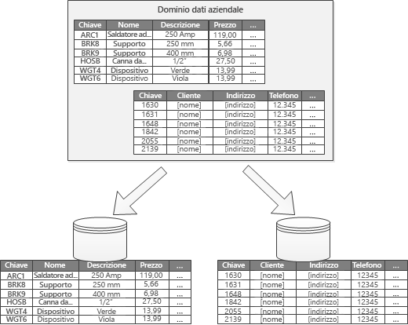

# Partizionamento orizzontale, verticale e funzionale dei dati

In molte soluzioni su larga scala, i dati vengono divisi in *partizioni* gestibili e accessibili separatamente. Il partizionamento può migliorare la scalabilità, ridurre la contesa e ottimizzare le prestazioni, nonché offrire un meccanismo per dividere i dati in base al modello di utilizzo. È ad esempio possibile archiviare i dati meno recenti in un archivio dati più economico.

È tuttavia necessario scegliere attentamente la strategia di partizionamento in modo da massimizzare i vantaggi riducendo al minimo gli effetti negativi.

> [!NOTE]
> In questo articolo il termine *partizionamento* si riferisce al processo di suddivisione fisica dei dati in archivi dati separati. Non si tratta del partizionamento delle tabelle SQL Server.

<!-- markdownlint-disable MD026 -->

## Perché la partizione di dati?

<!-- markdownlint-enable MD026 -->

- **Migliorare la scalabilità**. L'aumento delle dimensioni del sistema del singolo database potrebbe causare il raggiungimento di un limite hardware fisico. Dividendo i dati in più partizioni, ognuna ospitata in un server separato, è possibile aumentare il numero di istanze del sistema quasi all'infinito.

- **Migliorare le prestazioni** Le operazioni di accesso ai dati in ogni partizione vengono eseguite su un volume di dati più piccolo. Se eseguito correttamente, il partizionamento può rendere il sistema più efficiente. Le operazioni che interessano più di una partizione possono essere eseguite in parallelo.

- **Migliorare la sicurezza**. In alcuni casi, è possibile separare i dati sensibili e quelli non sensibili in partizioni diverse e applicare controlli di sicurezza diversi ai dati sensibili.

- **Fornire flessibilità operativa**. Il partizionamento offre molte opportunità per operazioni di ottimizzazione, ottimizzazione dell'efficienza amministrativa e riduzione dei costi. È possibile ad esempio definire diverse strategie per la gestione, il monitoraggio, il backup e il ripristino e altre attività amministrative in base all'importanza dei dati in ogni partizione.

- **Combinare l'archivio dati al modello di utilizzo**. Il partizionamento consente a ogni partizione di essere distribuita in un diverso tipo di archivio dati, basato sul costo e le funzionalità incorporate offerte dall’archivio dati. È ad esempio possibile archiviare i dati binari di grandi dimensioni in un archivio BLOB e i dati più strutturati in un database di documenti. Vedere [Scegliere l'archivio dati corretto](../guide/technology-choices/data-store-overview.md).

- **Migliorare la disponibilità**. La separazione dei dati tra più server consente di evitare singoli punti di errore. In caso di problemi in un'istanza, risultano non disponibili solo i dati in tale partizione. Le operazioni su altre partizioni possono continuare. Per gli archivi dati PaaS gestiti, questa considerazione è meno significativa perché tali servizi sono progettati con ridondanza predefinita.

## Progettazione di partizioni

Per il partizionamento dei dati esistono tre strategie tipiche:

- **Il partizionamento orizzontale** (spesso chiamato *sharding*). In questa strategia, ogni partizione è un archivio dati separato, ma tutte le partizioni hanno lo stesso schema. Ogni *partizione* contiene uno specifico subset di dati, ad esempio tutti gli ordini per un set specifico di clienti.

- **Il partizionamento verticale**. In questa strategia ogni partizione contiene un sottoinsieme dei campi per gli elementi nell'archivio dati. I campi sono suddivisi in base ai loro modello di utilizzo. I campi usati di frequente ad esempio possono essere collocati in una partizione verticale, mentre i campi usati raramente possono essere collocati in un'altra partizione.

- **Partizionamento funzionale**. In questa strategia i dati vengono aggregati in base alla loro modalità di utilizzo da parte di ogni contesto limitato nel sistema. Un sistema di e-commerce, ad esempio, potrebbe archiviare i dati delle fatture in una partizione e quelli relativi all'inventario dei prodotti in un'altra.

Queste strategie possono essere combinate ed è consigliabile prenderle tutte in considerazione quando si progetta uno schema di partizionamento. Ad esempio, si potrebbe dividere i dati in partizioni e quindi utilizzare il partizionamento verticale per suddividere ulteriormente i dati in ogni partizione.

### Partizionamento orizzontale (sharding)

La figura 1 illustra il partizionamento orizzontale. In questo esempio, i dati di inventario del prodotto sono divisi in partizioni in base alla chiave di prodotto. Ogni partizione contiene i dati per un intervallo contiguo di chiavi di partizione (A-G e H-Z), organizzati in ordine alfabetico. Il partizionamento orizzontale distribuisce il carico in più computer, riducendo la contesa e migliorando le prestazioni.

*Figura 1. Partizionamento orizzontale (sharding) dei dati in base a una chiave di partizione.*

Il fattore più importante è la scelta di una chiave di partizionamento. Può essere difficile modificare la chiave quando il sistema è in esecuzione. La chiave deve garantire che i dati siano partizionati in modo che la distribuzione del carico di lavoro tra le partizioni sia il più uniforme possibile.

Non è necessario che le partizioni siano di uguali dimensioni. È più importante bilanciare il numero di richieste. È possibile che in alcune partizioni molto grandi i singoli elementi abbiano un numero ridotto di operazioni di accesso. Altre partizioni invece possono essere più piccole, ma è possibile che ogni elemento venga usato più frequentemente. È anche importante garantire che una singola partizione non superi i limiti di scalabilità (in termini di capacità e risorse di elaborazione) dell'archivio dati.

Evitare di creare partizioni ad accesso frequente che possono influire sulle prestazioni e sulla disponibilità. L'uso della prima lettera del nome di un cliente, ad esempio, può determinare una distribuzione non bilanciata perché alcune lettere sono più comuni. Usare invece un hash dell'identificatore cliente per distribuire più uniformemente i dati tra le partizioni.

Scegliere una chiave di partizionamento che riduca al minimo eventuali esigenze future di dividere le partizioni di grandi dimensioni, unire le partizioni piccole in partizioni di dimensioni maggiori o modificare lo schema. Queste operazioni possono richiedere molto tempo e potrebbe essere necessario disconnettere una o più partizioni.

Se viene eseguita la replica delle partizioni, potrebbe essere possibile mantenere alcune delle repliche online mentre altre vengono suddivise, unite o riconfigurate. Il sistema potrebbe tuttavia richiedere una limitazione delle operazioni eseguibili durante la riconfigurazione. Ad esempio, i dati nelle repliche potrebbero essere contrassegnati come di sola lettura per evitare incoerenze dei dati.

Per altre informazioni sul partizionamento orizzontale, vedere [Modello di partizionamento orizzontale].

### Il partizionamento verticale

Il partizionamento verticale viene prevalentemente usato per ridurre i costi di I/O e prestazioni associati al recupero degli elementi a cui si accede frequentemente. La Figura 2 mostra un esempio di partizionamento verticale. Nell'esempio, le diverse proprietà di un elemento vengono archiviate in partizioni diverse. Una partizione contiene i dati a cui si accede più frequentemente, come nome, descrizione e prezzo dei prodotti. Un'altra partizione contiene i dati di inventario, ossia il conteggio delle scorte e la data dell'ultimo ordine.

*Figura 2. Partizionamento verticale dei dati in base al modello di utilizzo.*

Nell'esempio, l'applicazione ricerca regolarmente il nome del prodotto, la descrizione e il prezzo quando visualizza i dettagli dei prodotti ai clienti. Il conteggio delle scorte e la data dell'ultimo ordine vengono mantenuti in una partizione separata perché questi due elementi vengono in genere usati insieme.

Altri vantaggi del partizionamento verticale:

- I dati relativamente lenti (come nome, descrizione e prezzo dei prodotti) possono essere separati dai dati più dinamici (come livello delle scorte e data dell'ultimo ordine). I dati lenti si prestano bene a essere inseriti da un'applicazione nella cache in memoria.

- È possibile archiviare i dati sensibili in una partizione separata con controlli di sicurezza aggiuntivi.

- Il partizionamento verticale può ridurre il numero di accessi simultanei necessario.

Il partizionamento verticale opera a livello di entità all'interno di un archivio dati, normalizzando parzialmente un'entità per suddividerla da un elemento *di grandi dimensioni* a una raccolta di elementi *di dimensioni ridotte*. È particolarmente adatto per gli archivi di dati orientati alla colonna, ad esempio HBase e Cassandra. Se è improbabile modificare i dati in una raccolta di colonne, è possibile utilizzare archivi di colonne in SQL Server.

### Partizionamento funzionale

Quando è possibile identificare un contesto delimitato per ogni distinta area di attività in un'applicazione, il partizionamento funzionale consente di migliorare l'isolamento e le prestazioni di accesso ai dati. Un altro uso comune del partizionamento funzionale è la separazione dei dati di lettura/scrittura dai dati di sola lettura. La figura 3 mostra una panoramica del partizionamento funzionale in cui i dati di inventario sono separati dai dati del cliente.

*Figura 3. Partizionamento funzionale dei dati in base al contesto limitato o al sottodominio.*

Questa strategia di partizionamento può contribuire a ridurre i conflitti di accesso ai dati in diverse parti del sistema.

## Progettazione di partizioni per la scalabilità

È importante considerare le dimensioni e il carico di lavoro di ogni partizione e bilanciarle in modo che i dati siano distribuiti per ottenere la massima scalabilità. È tuttavia necessario partizionare i dati in modo che non superino i limiti di ridimensionamento della singola partizione di un archivio.

Quando si progettano le partizioni per la scalabilità, attenersi alla seguente procedura:

1. Analizzare l'applicazione per comprendere i modelli di accesso ai dati, ad esempio la dimensione del set di risultati restituito da ogni query, la frequenza di accesso, la latenza intrinseca e i requisiti di elaborazione di calcolo sul lato server. In molti casi, è possibile che alcune entità principali richiederanno la maggior parte delle risorse di elaborazione.
2. Usare questa analisi per determinare gli obiettivi di scalabilità attuali e futuri, ad esempio la dimensione dei dati e il carico di lavoro. Distribuire i dati nelle partizioni in modo da soddisfare l'obiettivo di scalabilità. Per il partizionamento orizzontale, la scelta della chiave di partizione corretta è importante per garantire una distribuzione uniforme. Per altre informazioni, vedere il [Modello di partizionamento orizzontale].
3. Assicurarsi che ogni partizione abbia risorse sufficienti per gestire i requisiti di scalabilità in termini di dimensioni dei dati e di velocità effettiva. A seconda dell'archivio dati, può esistere un limite alla quantità di spazio di archiviazione, alla potenza di elaborazione o alla larghezza di banda di rete per partizione. Se è probabile che i requisiti superino tali limiti, potrebbe essere necessario perfezionare la strategia di partizionamento o suddividere ulteriormente i dati, combinando eventualmente due o più strategie.
4. Monitorare il sistema per verificare che i dati vengano distribuiti come previsto e che le partizioni possano gestire il carico. L'utilizzo effettivo non sempre corrisponde a quanto previsto da un'analisi. In tal caso, è possibile ribilanciare le partizioni o in alternativa riprogettare alcune parti del sistema per ottenere il bilanciamento necessario.

Alcuni ambienti cloud allocano le risorse in termini di limiti di infrastruttura. Assicurarsi che tali limiti forniscano spazio sufficiente per una crescita anticipata del volume di dati, in termini di archiviazione dei dati, potenza di elaborazione e larghezza di banda.

Se si usa l'archivio tabelle di Azure, ad esempio, esiste un limite al volume di richieste che può essere gestito da una singola partizione in un determinato periodo di tempo. Vedere [Obiettivi di scalabilità e prestazioni per Archiviazione di Azure]. Una partizione occupata potrebbe richiedere una quantità di risorse superiore a quella che può essere gestita da una singola partizione. In tal caso, potrebbe essere necessario un ripartizionamento per distribuire il carico. Se le dimensioni totali o la velocità effettiva delle tabelle supera la capacità di un account di archiviazione, potrebbe essere necessario creare altri account di archiviazione e suddividere le tabelle tra questi.

## Progettazione di partizioni per le prestazioni delle query

Le prestazioni delle query possono spesso essere aumentate usando set di dati più piccoli ed eseguendo query parallele. Ogni partizione deve contenere una piccola parte dell'intero set di dati. La riduzione del volume può migliorare le prestazioni delle query. Tuttavia, il partizionamento non è un'alternativa per la progettazione e la configurazione di un database in modo appropriato. Assicurarsi ad esempio che siano presenti gli indici necessari.

Quando si progettano le partizioni per le prestazioni delle query, attenersi alla seguente procedura:

1. Esaminare i requisiti dell'applicazione e delle prestazioni:

   - Usare i requisiti aziendali per determinare le query critiche che devono sempre essere eseguite rapidamente.
   - Monitoraggio del sistema per identificare qualsiasi query eseguita lentamente.
   - Individuare le query eseguite con maggiore frequenza. Anche se una singola query ha un costo minimo, l'utilizzo complessivo delle risorse potrebbe essere significativo.

2. Partizionare i dati che causano un rallentamento delle prestazioni:
   - Limitare le dimensioni di ogni partizione in modo che il tempo di risposta della query sia compreso nel target.
   - Se si usa il partizionamento orizzontale, progettare la chiave di partizione in modo che l'applicazione possa selezionare facilmente la partizione corretta. In questo modo la query non deve analizzare ogni partizione.
   - Considerare la posizione di una partizione. Se possibile, provare a mantenere i dati nelle partizioni geograficamente vicine alle applicazioni e gli utenti che vi accedono.

3. Se un'entità dispone di requisiti relativi alle prestazioni di velocità effettiva e della query, utilizzare il partizionamento funzionale in base a tale entità. Se tale entità non soddisfa i requisiti, è necessario applicare anche il partizionamento orizzontale. Nella maggior parte dei casi è sufficiente una singola strategia di partizionamento, ma in alcuni casi è preferibile combinare entrambe le strategie.

4. Valutare la possibilità di eseguire le query in parallelo nelle partizioni per migliorare le prestazioni.

## Progettazione di partizioni per la disponibilità

Il partizionamento dei dati può migliorare la disponibilità delle applicazioni garantendo che l'intero set di dati non costituisca un singolo punto di errore e che i singoli sottoinsiemi del set di dati possano essere gestiti in modo indipendente.

Considerare i fattori seguenti, che influiscono sulla disponibilità:

**Criticità dei dati nelle operazioni aziendali**. Identificare i dati che sono informazioni aziendali critiche, come le transazioni, e i dati operativi meno critici, come i file di log.

- Valutare la possibilità di archiviare i dati critici in partizioni a disponibilità elevata con un piano di backup appropriato.

- Stabilire procedure di gestione e monitoraggio separate per i diversi set di dati.

- Il posizionamento di dati che hanno lo stesso livello di criticità nella stessa partizione in modo da poter eseguire il backup con una frequenza appropriata. Le partizioni contenenti i dati delle transazioni, ad esempio, potrebbero richiedere backup più frequenti rispetto alle partizioni che contengono informazioni di traccia o di log.

**Gestione delle singole partizioni**. La progettazione di partizioni per supportare la manutenzione e la gestione indipendenti offre diversi vantaggi. Ad esempio: 

- In caso di problemi in una partizione, questa può essere ripristinata in modo indipendente senza le applicazioni che accedono ai dati in altre partizioni.

- Il partizionamento dei dati per aree geografiche può consentire attività di manutenzione pianificate che vengono eseguite in determinate fasce orarie per ogni posizione. Assicurarsi che le partizioni non siano troppo grandi per evitare che le operazioni di manutenzione pianificata non siano completate durante questo periodo.

**Replica dei dati critici tra le partizioni**. Questa strategia può migliorare la disponibilità e le prestazioni, ma anche introdurre problemi di coerenza. La sincronizzazione delle modifiche con ogni replica richiede tempo. Durante questo periodo, le diverse partizioni conterranno valori di dati diversi.

## Considerazioni sulla progettazione di applicazioni

Il partizionamento aumenta la complessità di progettazione e sviluppo del sistema. Considerare il partizionamento come parte fondamentale della progettazione del sistema anche se inizialmente il sistema contiene una singola partizione. Se eseguito a posteriori, il partizionamento è più complicato perché è già presente un sistema attivo da gestire:

- La logica di accesso ai dati dovrà essere modificata.
- Potrebbe essere necessario eseguire la migrazione di grandi quantità di dati esistenti per distribuire i dati tra le partizioni.
- Gli utenti si aspettano di poter continuare a usare il sistema durante la migrazione.

In alcuni casi, il partizionamento non è considerato importante perché il set di dati iniziale è ridotto e può essere facilmente gestito da un singolo server. Questo può essere vero per alcuni carichi di lavoro, ma molti sistemi commerciali devono espandersi con l'aumento del numero di utenti.

Il partizionamento, inoltre, è vantaggioso non solo per archivi dati di grandi dimensioni. Ad esempio, un archivio dati di piccole dimensioni potrebbe essere utilizzato molto frequentemente da centinaia di client simultanei. Il partizionamento dei dati in questa situazione può aiutare a ridurre i conflitti e a migliorare la velocità effettiva.

Quando si progetta un schema di partizionamento dei dati, tenere presente quanto riportato di seguito:

**Ridurre al minimo le operazioni di accesso ai dati tra partizioni**. Quando possibile, mantenere insieme i dati per le operazioni di database più comuni in ogni partizione per ridurre al minimo le operazioni di accesso ai dati tra partizioni. Le query tra partizioni possono richiedere più tempo rispetto alle query all'interno di una singola partizione, ma ottimizzare le partizioni per un set di query potrebbe influire negativamente sugli altri set di query. Se è necessario eseguire query tra partizioni, ridurne al minimo la durata eseguendo query parallele e aggregando i risultati all'interno dell'applicazione. Questo approccio potrebbe non essere possibile in alcuni casi, ad esempio quando il risultato di una query viene usato nella successiva.

**Valutare la possibilità di replicare i dati di riferimento statici.** Se le query usano dati di riferimento relativamente statici, come tabelle di codici postali o elenchi di prodotti, valutare la possibilità di replicare tali dati in tutte le partizioni per ridurre le operazioni separate di ricerca in altre partizioni. Questo approccio può ridurre anche la probabilità che i dati di riferimento diventino un set di dati ad accesso frequente e traffico elevato nell'intero sistema. Alla sincronizzazione di tutte le modifiche ai dati di riferimento è tuttavia associato un costo aggiuntivo.

**Ridurre al minimo i join tra partizioni.** Quando possibile, ridurre al minimo i requisiti di integrità referenziale tra le partizioni verticali e funzionali. In questi schemi, l'applicazione è responsabile del mantenimento dell'integrità referenziale tra le partizioni. Le query che uniscono in join i dati in più partizioni sono inefficienti perché l'applicazione in genere deve eseguire query consecutive in base a una chiave e quindi a una chiave esterna. Si consiglia di replicare o de-normalizzare i dati rilevanti. Se sono necessari join tra partizioni, eseguire query parallele sulle partizioni e unire i dati all'interno dell'applicazione.

**Implementare la coerenza finale**.  Valutare se la coerenza assoluta è effettivamente un requisito. Nei sistemi distribuiti, un approccio comune consiste nell'implementare la coerenza finale. I dati in ogni partizione vengono aggiornati separatamente e la logica dell'applicazione garantisce che tutti gli aggiornamenti vengano completati correttamente. La logica gestisce inoltre le incoerenze che possono essere generate da query sui dati durante l'esecuzione di un'operazione coerente.

**È necessario considerare come le query individuano la partizione corretta**. Se una query deve analizzare tutte le partizioni per individuare i dati richiesti, ci sarà un impatto significativo sulle prestazioni, anche se sono in esecuzione più query parallele. Con il partizionamento verticale e funzionale, le query possono naturalmente specificare le partizioni. Con il partizionamento orizzontale, invece, può essere difficile individuare un elemento perché ogni partizione ha lo stesso schema. Una soluzione tipica consiste nel mantenere una mappa che verrà usata per cercare elementi specifici nel percorso delle partizioni. Questa mappa può essere implementata nella logica di partizionamento orizzontale dell'applicazione o gestita dall'archivio dati se supporta il partizionamento orizzontale trasparente.

**Valutare la possibilità di ribilanciare periodicamente le partizioni**. Con il partizionamento orizzontale, il ribilanciamento delle partizioni consente di distribuire uniformemente i dati in base alle dimensioni e al carico di lavoro per ridurre al minimo le aree ad accesso frequente, ottimizzare le prestazioni delle query e aggirare le limitazioni fisiche dello spazio di archiviazione. Tuttavia, si tratta di un'attività complessa che spesso richiede l'utilizzo di uno strumento personalizzato o di un processo.

**Replicare le partizioni.** La replica di ogni partizione offre protezione aggiuntiva dagli errori. Se una singola replica ha esito negativo, le query possono essere indirizzate verso una copia di lavoro.

**Se si raggiungono i limiti fisici di una strategia di partizionamento, potrebbe essere necessario estendere la scalabilità a un livello diverso**. Ad esempio, se il partizionamento è a livello di database, potrebbe essere necessario individuare o eseguire la replica delle partizioni in più database. Se il partizionamento è già a livello di database e i limiti fisici sono un problema, può essere necessario individuare o eseguire la replica delle partizioni in più account di hosting.

**Evitare transazioni che accedono ai dati in più partizioni**. Alcuni archivi di dati implementano la coerenza transazionale e l'integrità per le operazioni che modificano i dati, ma solo quando i dati si trovano in una singola partizione. Se è necessario supporto transazionale tra più partizioni, probabilmente sarà necessario implementare questo come parte della logica dell'applicazione poiché la maggior parte dei sistemi di partizionamento non forniscono il supporto nativo.

Tutti gli archivi dati richiedono una gestione operativa e il monitoraggio dell'attività. Le attività variano dal caricamento dei dati, backup e ripristino dei dati, riorganizzazione dei dati e la garanzia che il sistema funziona in modo corretto ed efficiente.

Considerare i seguenti fattori che influiscono sulla gestione operativa:

- **Come implementare attività di gestione e operative appropriate quando i dati sono partizionati**. Queste attività possono includere il backup e il ripristino, l'archiviazione dei dati, il monitoraggio del sistema e altre attività amministrative. Mantenere la coerenza logica durante le operazioni di backup e ripristino, ad esempio, può essere una sfida.

- **Come caricare i dati in più partizioni e aggiungere nuovi dati provenienti da altre origini**. Alcuni strumenti e utilità potrebbero non supportare le operazioni di dati partizionati, quale il caricamento dei dati nella partizione corretta.

- **Come archiviare ed eliminare i dati a intervalli regolari**. Per impedire una crescita eccessiva delle partizioni, è necessario archiviare ed eliminare i dati a intervalli regolari, ad esempio ogni mese. Può essere necessario trasformare i dati in base a uno schema di archiviazione differente.

- **Come individuare i problemi di integrità dei dati**. Valutare la possibilità di eseguire periodicamente un processo per individuare eventuali problemi di integrità dei dati, ad esempio dati in una partizione che fanno riferimento a informazioni mancanti in un'altra. Il processo potrà tentare di correggere automaticamente i problemi oppure generare semplicemente un report per la verifica manuale.

## Ribilanciamento delle partizioni

Con l'evoluzione del sistema potrebbe essere necessario modificare lo schema di partizionamento. È ad esempio possibile che singole partizioni inizino a ricevere un volume di traffico sproporzionato e diventino ad accesso frequente, causando una contesa eccessiva, oppure che il volume dei dati in alcune partizioni sia stato sottostimato e che di conseguenza alcune partizioni stiano per raggiungere i limiti di capacità.

Alcuni archivi dati, come Cosmos DB, possono ribilanciare automaticamente le partizioni. In altri casi, il ribilanciamento è un'attività amministrativa in due fasi:

1. Determinare una nuova strategia di partizionamento.

    - Quali partizioni è necessario dividere o eventualmente combinare?
    - Qual è la nuova chiave di partizione?

2. Eseguire la migrazione dei dati dallo schema di partizionamento precedente al nuovo set di partizioni.

A seconda dell'archivio dati, potrebbe essere possibile eseguire la migrazione dei dati tra le partizioni mentre vengono usate. Questo approccio è denominato *migrazione online*. Se non è possibile, potrebbe essere necessario rendere le partizioni non disponibili durante la rilocazione dei dati (*migrazione offline*).

### Migrazione offline

La migrazione offline è in genere più semplice perché riduce le probabilità di contesa. A livello concettuale, la migrazione offline funziona nel modo seguente:

1. Contrassegnare la partizione come offline.
2. Dividere/unire e spostare i dati nelle nuove partizioni.
3. Verificare i dati.
4. Portare le nuove partizioni online.
5. Rimuovere la partizione precedente.

Facoltativamente, è possibile contrassegnare una partizione come di sola lettura nel passaggio 1, in modo che le applicazioni possano comunque leggere i dati mentre vengono spostati.

## Migrazione online

La migrazione online è più complessa ma comporta minori interruzioni. Il processo è simile alla migrazione offline, ad eccezione del fatto che la partizione originale non viene contrassegnata come offline. A seconda della granularità del processo di migrazione (ad esempio, elemento per elemento o partizione per partizione), il codice di accesso ai dati nelle applicazioni client potrebbe dover gestire la lettura e la scrittura di dati contenuti in due posizioni, ossia la partizione originale e quella nuova.

## Modelli correlati

Per uno specifico scenario potrebbero essere rilevanti i modelli di progettazione seguenti:

- Il [modello di partizionamento orizzontale](../patterns/sharding.md) descrive alcune strategie comuni per il partizionamento orizzontale dei dati.

- Il [modello di tabella degli indici](../patterns/index-table.md) illustra come creare indici secondari sui dati. Un'applicazione consente di recuperare rapidamente i dati con questo approccio, usando le query che non fanno riferimento alla chiave primaria di una raccolta.

- Il [modello di vista materializzata](../patterns/materialized-view.md) descrive come generare viste prepopolate con un riepilogo dei dati per supportare operazioni di query rapide. Questo approccio può essere utile in un archivio dati partizionati se le partizioni che contengono dati riepilogati vengono distribuite tra più siti.

## Passaggi successivi

- Informazioni sulle strategie di partizionamento per servizi di Azure specifici. Vedere [Strategie di partizionamento dei dati](./data-partitioning-strategies.md)

[Obiettivi di scalabilità e prestazioni per Archiviazione di Azure]: /azure/storage/storage-scalability-targets
