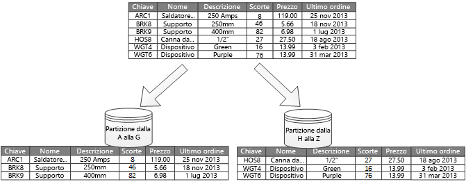

# Partizionamento orizzontale, verticale e funzionale dei datiHorizontal, vertical, and functional data partitioning

In molte soluzioni su larga scala, i dati vengono divisi in *partizioni* gestibili e accessibili separatamente.In many large-scale solutions, data is divided into *partitions* that can be managed and accessed separately. Il partizionamento può migliorare la scalabilità, ridurre la contesa e ottimizzare le prestazioni,Partitioning can improve scalability, reduce contention, and optimize performance. nonché offrire un meccanismo per dividere i dati in base al modello di utilizzo.It can also provide a mechanism for dividing data by usage pattern. È ad esempio possibile archiviare i dati meno recenti in un archivio dati più economico.For example, you can archive older data in cheaper data storage.

È tuttavia necessario scegliere attentamente la strategia di partizionamento in modo da massimizzare i vantaggi riducendo al minimo gli effetti negativi.However, the partitioning strategy must be chosen carefully to maximize the benefits while minimizing adverse effects.

> [!NOTE]
> In questo articolo il termine *partizionamento* si riferisce al processo di suddivisione fisica dei dati in archivi dati separati.In this article, the term *partitioning* means the process of physically dividing data into separate data stores. Non si tratta del partizionamento delle tabelle SQL Server.It is not the same as SQL Server table partitioning.

<!-- markdownlint-disable MD026 -->

## Perché la partizione di dati?Why partition data?

<!-- markdownlint-enable MD026 -->

- **Migliorare la scalabilità**.**Improve scalability**. L'aumento delle dimensioni del sistema del singolo database potrebbe causare il raggiungimento di un limite hardware fisico.When you scale up a single database system, it will eventually reach a physical hardware limit. Dividendo i dati in più partizioni, ognuna ospitata in un server separato, è possibile aumentare il numero di istanze del sistema quasi all'infinito.If you divide data across multiple partitions, each hosted on a separate server, you can scale out the system almost indefinitely.

- **Migliorare le prestazioni****Improve performance**. Le operazioni di accesso ai dati in ogni partizione vengono eseguite su un volume di dati più piccolo.Data access operations on each partition take place over a smaller volume of data. Se eseguito correttamente, il partizionamento può rendere il sistema più efficiente.Correctly done, partitioning can make your system more efficient. Le operazioni che interessano più di una partizione possono essere eseguite in parallelo.Operations that affect more than one partition can run in parallel.

- **Migliorare la sicurezza**.**Improve security**. In alcuni casi, è possibile separare i dati sensibili e quelli non sensibili in partizioni diverse e applicare controlli di sicurezza diversi ai dati sensibili.In some cases, you can separate sensitive and non-sensitive data into different partitions and apply different security controls to the sensitive data.

- **Fornire flessibilità operativa**.**Provide operational flexibility**. Il partizionamento offre molte opportunità per operazioni di ottimizzazione, ottimizzazione dell'efficienza amministrativa e riduzione dei costi.Partitioning offers many opportunities for fine tuning operations, maximizing administrative efficiency, and minimizing cost. È possibile ad esempio definire diverse strategie per la gestione, il monitoraggio, il backup e il ripristino e altre attività amministrative in base all'importanza dei dati in ogni partizione.For example, you can define different strategies for management, monitoring, backup and restore, and other administrative tasks based on the importance of the data in each partition.

- **Combinare l'archivio dati al modello di utilizzo**.**Match the data store to the pattern of use**. Il partizionamento consente a ogni partizione di essere distribuita in un diverso tipo di archivio dati, basato sul costo e le funzionalità incorporate offerte dall’archivio dati.Partitioning allows each partition to be deployed on a different type of data store, based on cost and the built-in features that data store offers. È ad esempio possibile archiviare i dati binari di grandi dimensioni in un archivio BLOB e i dati più strutturati in un database di documenti.For example, large binary data can be stored in blob storage, while more structured data can be held in a document database. Vedere [Scegliere l'archivio dati corretto](../guide/technology-choices/data-store-overview.md).See [Choose the right data store](../guide/technology-choices/data-store-overview.md).

- **Migliorare la disponibilità**.**Improve availability**. La separazione dei dati tra più server consente di evitare singoli punti di errore.Separating data across multiple servers avoids a single point of failure. In caso di problemi in un'istanza, risultano non disponibili solo i dati in tale partizione.If one instance fails, only the data in that partition is unavailable. Le operazioni su altre partizioni possono continuare.Operations on other partitions can continue. Per gli archivi dati PaaS gestiti, questa considerazione è meno significativa perché tali servizi sono progettati con ridondanza predefinita.For managed PaaS data stores, this consideration is less relevant, because these services are designed with built-in redundancy.

## Progettazione di partizioniDesigning partitions

Per il partizionamento dei dati esistono tre strategie tipiche:There are three typical strategies for partitioning data:

- **Il partizionamento orizzontale** (spesso chiamato *sharding*).**Horizontal partitioning** (often called *sharding*). In questa strategia, ogni partizione è un archivio dati separato, ma tutte le partizioni hanno lo stesso schema.In this strategy, each partition is a separate data store, but all partitions have the same schema. Ogni *partizione* contiene uno specifico subset di dati, ad esempio tutti gli ordini per un set specifico di clienti.Each partition is known as a *shard* and holds a specific subset of the data, such as all the orders for a specific set of customers.

- **Il partizionamento verticale**.**Vertical partitioning**. In questa strategia ogni partizione contiene un sottoinsieme dei campi per gli elementi nell'archivio dati.In this strategy, each partition holds a subset of the fields for items in the data store. I campi sono suddivisi in base ai loro modello di utilizzo.The fields are divided according to their pattern of use. I campi usati di frequente ad esempio possono essere collocati in una partizione verticale, mentre i campi usati raramente possono essere collocati in un'altra partizione.For example, frequently accessed fields might be placed in one vertical partition and less frequently accessed fields in another.

- **Partizionamento funzionale**.**Functional partitioning**. In questa strategia i dati vengono aggregati in base alla loro modalità di utilizzo da parte di ogni contesto limitato nel sistema.In this strategy, data is aggregated according to how it is used by each bounded context in the system. Un sistema di e-commerce, ad esempio, potrebbe archiviare i dati delle fatture in una partizione e quelli relativi all'inventario dei prodotti in un'altra.For example, an e-commerce system might store invoice data in one partition and product inventory data in another.

Queste strategie possono essere combinate ed è consigliabile prenderle tutte in considerazione quando si progetta uno schema di partizionamento.These strategies can be combined, and we recommend that you consider them all when you design a partitioning scheme. Ad esempio, si potrebbe dividere i dati in partizioni e quindi utilizzare il partizionamento verticale per suddividere ulteriormente i dati in ogni partizione.For example, you might divide data into shards and then use vertical partitioning to further subdivide the data in each shard.

### Partizionamento orizzontale (sharding)Horizontal partitioning (sharding)

La figura 1 illustra il partizionamento orizzontale.Figure 1 shows horizontal partitioning or sharding. In questo esempio, i dati di inventario del prodotto sono divisi in partizioni in base alla chiave di prodotto.In this example, product inventory data is divided into shards based on the product key. Ogni partizione contiene i dati per un intervallo contiguo di chiavi di partizione (A-G e H-Z), organizzati in ordine alfabetico.Each shard holds the data for a contiguous range of shard keys (A-G and H-Z), organized alphabetically. Il partizionamento orizzontale distribuisce il carico in più computer, riducendo la contesa e migliorando le prestazioni.Sharding spreads the load over more computers, which reduces contention and improves performance.

*Figura 1. Partizionamento orizzontale (sharding) dei dati in base a una chiave di partizione.**Figure 1. Horizontally partitioning (sharding) data based on a partition key.*

Il fattore più importante è la scelta di una chiave di partizionamento.The most important factor is the choice of a sharding key. Può essere difficile modificare la chiave quando il sistema è in esecuzione.It can be difficult to change the key after the system is in operation. La chiave deve garantire che i dati siano partizionati in modo che la distribuzione del carico di lavoro tra le partizioni sia il più uniforme possibile.The key must ensure that data is partitioned to spread the workload as evenly as possible across the shards.

Non è necessario che le partizioni siano di uguali dimensioni.The shards don't have to be the same size. È più importante bilanciare il numero di richieste.It's more important to balance the number of requests. È possibile che in alcune partizioni molto grandi i singoli elementi abbiano un numero ridotto di operazioni di accesso.Some shards might be very large, but each item has a low number of access operations. Altre partizioni invece possono essere più piccole, ma è possibile che ogni elemento venga usato più frequentemente.Other shards might be smaller, but each item is accessed much more frequently. È anche importante garantire che una singola partizione non superi i limiti di scalabilità (in termini di capacità e risorse di elaborazione) dell'archivio dati.It's also important to ensure that a single shard does not exceed the scale limits (in terms of capacity and processing resources) of the data store.

Evitare di creare partizioni ad accesso frequente che possono influire sulle prestazioni e sulla disponibilità.Avoid creating "hot" partitions that can affect performance and availability. L'uso della prima lettera del nome di un cliente, ad esempio, può determinare una distribuzione non bilanciata perché alcune lettere sono più comuni. Usare invece un hash dell'identificatore cliente per distribuire più uniformemente i dati tra le partizioni.For example, using the first letter of a customer’s name causes an unbalanced distribution, because some letters are more common Instead, use a hash of a customer identifier to distribute data more evenly across partitions.

Scegliere una chiave di partizionamento che riduca al minimo eventuali esigenze future di dividere le partizioni di grandi dimensioni, unire le partizioni piccole in partizioni di dimensioni maggiori o modificare lo schema.Choose a sharding key that minimizes any future requirements to split large shards, coalesce small shards into larger partitions, or change the schema. Queste operazioni possono richiedere molto tempo e potrebbe essere necessario disconnettere una o più partizioni.These operations can be very time consuming, and might require taking one or more shards offline while they are performed.

Se viene eseguita la replica delle partizioni, potrebbe essere possibile mantenere alcune delle repliche online mentre altre vengono suddivise, unite o riconfigurate.If shards are replicated, it might be possible to keep some of the replicas online while others are split, merged, or reconfigured. Il sistema potrebbe tuttavia richiedere una limitazione delle operazioni eseguibili durante la riconfigurazione.However, the system might need to limit the operations that can be performed during the reconfiguration. Ad esempio, i dati nelle repliche potrebbero essere contrassegnati come di sola lettura per evitare incoerenze dei dati.For example, the data in the replicas might be marked as read-only to prevent data inconsistences.

Per altre informazioni sul partizionamento orizzontale, vedere [Modello di partizionamento orizzontale].For more information about horizontal partitioning, see [Sharding pattern].

### Il partizionamento verticaleVertical partitioning

Il partizionamento verticale viene prevalentemente usato per ridurre i costi di I/O e prestazioni associati al recupero degli elementi a cui si accede frequentemente.The most common use for vertical partitioning is to reduce the I/O and performance costs associated with fetching items that are frequently accessed. La Figura 2 mostra un esempio di partizionamento verticale.Figure 2 shows an example of vertical partitioning. Nell'esempio, le diverse proprietà di un elemento vengono archiviate in partizioni diverse.In this example, different properties of an item are stored in different partitions. Una partizione contiene i dati a cui si accede più frequentemente, come nome, descrizione e prezzo dei prodotti.One partition holds data that is accessed more frequently, including product name, description, and price. Un'altra partizione contiene i dati di inventario, ossia il conteggio delle scorte e la data dell'ultimo ordine.Another partition holds inventory data: the stock count and last-ordered date.

*Figura 2. Partizionamento verticale dei dati in base al modello di utilizzo.**Figure 2. Vertically partitioning data by its pattern of use.*

Nell'esempio, l'applicazione ricerca regolarmente il nome del prodotto, la descrizione e il prezzo quando visualizza i dettagli dei prodotti ai clienti.In this example, the application regularly queries the product name, description, and price when displaying the product details to customers. Il conteggio delle scorte e la data dell'ultimo ordine vengono mantenuti in una partizione separata perché questi due elementi vengono in genere usati insieme.Stock count and last- ordered date are held in a separate partition because these two items are commonly used together.

Altri vantaggi del partizionamento verticale:Other advantages of vertical partitioning:

- I dati relativamente lenti (come nome, descrizione e prezzo dei prodotti) possono essere separati dai dati più dinamici (come livello delle scorte e data dell'ultimo ordine).Relatively slow-moving data (product name, description, and price) can be separated from the more dynamic data (stock level and last ordered date). I dati lenti si prestano bene a essere inseriti da un'applicazione nella cache in memoria.Slow moving data is a good candidate for an application to cache in memory.

- È possibile archiviare i dati sensibili in una partizione separata con controlli di sicurezza aggiuntivi.Sensitive data can be stored in a separate partition with additional security controls.

- Il partizionamento verticale può ridurre il numero di accessi simultanei necessario.Vertical partitioning can reduce the amount of concurrent access that's needed.

Il partizionamento verticale opera a livello di entità all'interno di un archivio dati, normalizzando parzialmente un'entità per suddividerla da un elemento *di grandi dimensioni* a una raccolta di elementi *di dimensioni ridotte*.Vertical partitioning operates at the entity level within a data store, partially normalizing an entity to break it down from a *wide* item to a set of *narrow* items. È particolarmente adatto per gli archivi di dati orientati alla colonna, ad esempio HBase e Cassandra.It is ideally suited for column-oriented data stores such as HBase and Cassandra. Se è improbabile modificare i dati in una raccolta di colonne, è possibile utilizzare archivi di colonne in SQL Server.If the data in a collection of columns is unlikely to change, you can also consider using column stores in SQL Server.

### Partizionamento funzionaleFunctional partitioning

Quando è possibile identificare un contesto delimitato per ogni distinta area di attività in un'applicazione, il partizionamento funzionale consente di migliorare l'isolamento e le prestazioni di accesso ai dati.When it's possible to identify a bounded context for each distinct business area in an application, functional partitioning is a way to improve isolation and data access performance. Un altro uso comune del partizionamento funzionale è la separazione dei dati di lettura/scrittura dai dati di sola lettura.Another common use for functional partitioning is to separate read-write data from read-only data. La figura 3 mostra una panoramica del partizionamento funzionale in cui i dati di inventario sono separati dai dati del cliente.Figure 3 shows an overview of functional partitioning where inventory data is separated from customer data.

*Figura 3. Partizionamento funzionale dei dati in base al contesto limitato o al sottodominio.**Figure 3. Functionally partitioning data by bounded context or subdomain.*

Questa strategia di partizionamento può contribuire a ridurre i conflitti di accesso ai dati in diverse parti del sistema.This partitioning strategy can help reduce data access contention across different parts of a system.

## Progettazione di partizioni per la scalabilitàDesigning partitions for scalability

È importante considerare le dimensioni e il carico di lavoro di ogni partizione e bilanciarle in modo che i dati siano distribuiti per ottenere la massima scalabilità.It's vital to consider size and workload for each partition and balance them so that data is distributed to achieve maximum scalability. È tuttavia necessario partizionare i dati in modo che non superino i limiti di ridimensionamento della singola partizione di un archivio.However, you must also partition the data so that it does not exceed the scaling limits of a single partition store.

Quando si progettano le partizioni per la scalabilità, attenersi alla seguente procedura:Follow these steps when designing partitions for scalability:

1. Analizzare l'applicazione per comprendere i modelli di accesso ai dati, ad esempio la dimensione del set di risultati restituito da ogni query, la frequenza di accesso, la latenza intrinseca e i requisiti di elaborazione di calcolo sul lato server.Analyze the application to understand the data access patterns, such as the size of the result set returned by each query, the frequency of access, the inherent latency, and the server-side compute processing requirements. In molti casi, è possibile che alcune entità principali richiederanno la maggior parte delle risorse di elaborazione.In many cases, a few major entities will demand most of the processing resources.
2. Usare questa analisi per determinare gli obiettivi di scalabilità attuali e futuri, ad esempio la dimensione dei dati e il carico di lavoro.Use this analysis to determine the current and future scalability targets, such as data size and workload. Distribuire i dati nelle partizioni in modo da soddisfare l'obiettivo di scalabilità.Then distribute the data across the partitions to meet the scalability target. Per il partizionamento orizzontale, la scelta della chiave di partizione corretta è importante per garantire una distribuzione uniforme.For horizontal partitioning, choosing the right shard key is important to make sure distribution is even. Per altre informazioni, vedere il [Modello di partizionamento orizzontale].For more information, see the [Sharding pattern].
3. Assicurarsi che ogni partizione abbia risorse sufficienti per gestire i requisiti di scalabilità in termini di dimensioni dei dati e di velocità effettiva.Make sure each partition has enough resources to handle the scalability requirements, in terms of data size and throughput. A seconda dell'archivio dati, può esistere un limite alla quantità di spazio di archiviazione, alla potenza di elaborazione o alla larghezza di banda di rete per partizione.Depending on the data store, there might be a limit on the amount of storage space, processing power, or network bandwidth per partition. Se è probabile che i requisiti superino tali limiti, potrebbe essere necessario perfezionare la strategia di partizionamento o suddividere ulteriormente i dati, combinando eventualmente due o più strategie.If the requirements are likely to exceed these limits, you may need to refine your partitioning strategy or split data out further, possibly combining two or more strategies.
4. Monitorare il sistema per verificare che i dati vengano distribuiti come previsto e che le partizioni possano gestire il carico.Monitor the system to verify that data is distributed as expected and that the partitions can handle the load. L'utilizzo effettivo non sempre corrisponde a quanto previsto da un'analisi.Actual usage does not always match what an analysis predicts. In tal caso, è possibile ribilanciare le partizioni o in alternativa riprogettare alcune parti del sistema per ottenere il bilanciamento necessario.If so, it might be possible to rebalance the partitions, or else redesign some parts of the system to gain the required balance.

Alcuni ambienti cloud allocano le risorse in termini di limiti di infrastruttura.Some cloud environments allocate resources in terms of infrastructure boundaries. Assicurarsi che tali limiti forniscano spazio sufficiente per una crescita anticipata del volume di dati, in termini di archiviazione dei dati, potenza di elaborazione e larghezza di banda.Ensure that the limits of your selected boundary provide enough room for any anticipated growth in the volume of data, in terms of data storage, processing power, and bandwidth.

Se si usa l'archivio tabelle di Azure, ad esempio, esiste un limite al volume di richieste che può essere gestito da una singola partizione in un determinato periodo di tempo.For example, if you use Azure table storage, there is a limit to the volume of requests that can be handled by a single partition in a particular period of time. Vedere [Obiettivi di scalabilità e prestazioni per Archiviazione di Azure]. Una partizione occupata potrebbe richiedere una quantità di risorse superiore a quella che può essere gestita da una singola partizione.(See [Azure storage scalability and performance targets].) A busy shard might require more resources than a single partition can handle. In tal caso, potrebbe essere necessario un ripartizionamento per distribuire il carico.If so, the shard might need to be repartitioned to spread the load. Se le dimensioni totali o la velocità effettiva delle tabelle supera la capacità di un account di archiviazione, potrebbe essere necessario creare altri account di archiviazione e suddividere le tabelle tra questi.If the total size or throughput of these tables exceeds the capacity of a storage account, you might need to create additional storage accounts and spread the tables across these accounts.

## Progettazione di partizioni per le prestazioni delle queryDesigning partitions for query performance

Le prestazioni delle query possono spesso essere aumentate usando set di dati più piccoli ed eseguendo query parallele.Query performance can often be boosted by using smaller data sets and by running parallel queries. Ogni partizione deve contenere una piccola parte dell'intero set di dati.Each partition should contain a small proportion of the entire data set. La riduzione del volume può migliorare le prestazioni delle query.This reduction in volume can improve the performance of queries. Tuttavia, il partizionamento non è un'alternativa per la progettazione e la configurazione di un database in modo appropriato.However, partitioning is not an alternative for designing and configuring a database appropriately. Assicurarsi ad esempio che siano presenti gli indici necessari.For example, make sure that you have the necessary indexes in place.

Quando si progettano le partizioni per le prestazioni delle query, attenersi alla seguente procedura:Follow these steps when designing partitions for query performance:

1. Esaminare i requisiti dell'applicazione e delle prestazioni:Examine the application requirements and performance:

   - Usare i requisiti aziendali per determinare le query critiche che devono sempre essere eseguite rapidamente.Use business requirements to determine the critical queries that must always perform quickly.
   - Monitoraggio del sistema per identificare qualsiasi query eseguita lentamente.Monitor the system to identify any queries that perform slowly.
   - Individuare le query eseguite con maggiore frequenza.Find which queries are performed most frequently. Anche se una singola query ha un costo minimo, l'utilizzo complessivo delle risorse potrebbe essere significativo.Even if a single query has a minimal cost, the cumulative resource consumption could be significant.

2. Partizionare i dati che causano un rallentamento delle prestazioni:Partition the data that is causing slow performance:
   - Limitare le dimensioni di ogni partizione in modo che il tempo di risposta della query sia compreso nel target.Limit the size of each partition so that the query response time is within target.
   - Se si usa il partizionamento orizzontale, progettare la chiave di partizione in modo che l'applicazione possa selezionare facilmente la partizione corretta.If you use horizontal partitioning, design the shard key so that the application can easily select the right partition. In questo modo la query non deve analizzare ogni partizione.This prevents the query from having to scan through every partition.
   - Considerare la posizione di una partizione.Consider the location of a partition. Se possibile, provare a mantenere i dati nelle partizioni geograficamente vicine alle applicazioni e gli utenti che vi accedono.If possible, try to keep data in partitions that are geographically close to the applications and users that access it.

3. Se un'entità dispone di requisiti relativi alle prestazioni di velocità effettiva e della query, utilizzare il partizionamento funzionale in base a tale entità.If an entity has throughput and query performance requirements, use functional partitioning based on that entity. Se tale entità non soddisfa i requisiti, è necessario applicare anche il partizionamento orizzontale.If this still doesn't satisfy the requirements, apply horizontal partitioning as well. Nella maggior parte dei casi è sufficiente una singola strategia di partizionamento, ma in alcuni casi è preferibile combinare entrambe le strategie.In most cases a single partitioning strategy will suffice, but in some cases it is more efficient to combine both strategies.

4. Valutare la possibilità di eseguire le query in parallelo nelle partizioni per migliorare le prestazioni.Consider running queries in parallel across partitions to improve performance.

## Progettazione di partizioni per la disponibilitàDesigning partitions for availability

Il partizionamento dei dati può migliorare la disponibilità delle applicazioni garantendo che l'intero set di dati non costituisca un singolo punto di errore e che i singoli sottoinsiemi del set di dati possano essere gestiti in modo indipendente.Partitioning data can improve the availability of applications by ensuring that the entire dataset does not constitute a single point of failure and that individual subsets of the dataset can be managed independently.

Considerare i fattori seguenti, che influiscono sulla disponibilità:Consider the following factors that affect availability:

**Criticità dei dati nelle operazioni aziendali**.**How critical the data is to business operations**. Identificare i dati che sono informazioni aziendali critiche, come le transazioni, e i dati operativi meno critici, come i file di log.Identify which data is critical business information, such as transactions, and which data is less critical operational data, such as log files.

- Valutare la possibilità di archiviare i dati critici in partizioni a disponibilità elevata con un piano di backup appropriato.Consider storing critical data in highly-available partitions with an appropriate backup plan.

- Stabilire procedure di gestione e monitoraggio separate per i diversi set di dati.Establish separate management and monitoring procedures for the different datasets.

- Il posizionamento di dati che hanno lo stesso livello di criticità nella stessa partizione in modo da poter eseguire il backup con una frequenza appropriata.Place data that has the same level of criticality in the same partition so that it can be backed up together at an appropriate frequency. Le partizioni contenenti i dati delle transazioni, ad esempio, potrebbero richiedere backup più frequenti rispetto alle partizioni che contengono informazioni di traccia o di log.For example, partitions that hold transaction data might need to be backed up more frequently than partitions that hold logging or trace information.

**Gestione delle singole partizioni**.**How individual partitions can be managed**. La progettazione di partizioni per supportare la manutenzione e la gestione indipendenti offre diversi vantaggi.Designing partitions to support independent management and maintenance provides several advantages. Ad esempio: For example:

- In caso di problemi in una partizione, questa può essere ripristinata in modo indipendente senza le applicazioni che accedono ai dati in altre partizioni.If a partition fails, it can be recovered independently without applications that access data in other partitions.

- Il partizionamento dei dati per aree geografiche può consentire attività di manutenzione pianificate che vengono eseguite in determinate fasce orarie per ogni posizione.Partitioning data by geographical area allows scheduled maintenance tasks to occur at off-peak hours for each location. Assicurarsi che le partizioni non siano troppo grandi per evitare che le operazioni di manutenzione pianificata non siano completate durante questo periodo.Ensure that partitions are not too big to prevent any planned maintenance from being completed during this period.

**Replica dei dati critici tra le partizioni**.**Whether to replicate critical data across partitions**. Questa strategia può migliorare la disponibilità e le prestazioni, ma anche introdurre problemi di coerenza.This strategy can improve availability and performance, but can also introduce consistency issues. La sincronizzazione delle modifiche con ogni replica richiede tempo.It takes time to synchronize changes with every replica. Durante questo periodo, le diverse partizioni conterranno valori di dati diversi.During this period, different partitions will contain different data values.

## Considerazioni sulla progettazione di applicazioniApplication design considerations

Il partizionamento aumenta la complessità di progettazione e sviluppo del sistema.Partitioning adds complexity to the design and development of your system. Considerare il partizionamento come parte fondamentale della progettazione del sistema anche se inizialmente il sistema contiene una singola partizione.Consider partitioning as a fundamental part of system design even if the system initially only contains a single partition. Se eseguito a posteriori, il partizionamento è più complicato perché è già presente un sistema attivo da gestire:If you address partitioning as an afterthought, it will be more challenging because you already have a live system to maintain:

- La logica di accesso ai dati dovrà essere modificata.Data access logic will need to be modified.
- Potrebbe essere necessario eseguire la migrazione di grandi quantità di dati esistenti per distribuire i dati tra le partizioni.Large quantities of existing data may need to be migrated, to distribute it across partitions
- Gli utenti si aspettano di poter continuare a usare il sistema durante la migrazione.Users expect to be able to continue using the system during the migration.

In alcuni casi, il partizionamento non è considerato importante perché il set di dati iniziale è ridotto e può essere facilmente gestito da un singolo server.In some cases, partitioning is not considered important because the initial dataset is small and can be easily handled by a single server. Questo può essere vero per alcuni carichi di lavoro, ma molti sistemi commerciali devono espandersi con l'aumento del numero di utenti.This might be true for some workloads, but many commercial systems need to expand as the number of users increases.

Il partizionamento, inoltre, è vantaggioso non solo per archivi dati di grandi dimensioni.Moreover, it's not only large data stores that benefit from partitioning. Ad esempio, un archivio dati di piccole dimensioni potrebbe essere utilizzato molto frequentemente da centinaia di client simultanei.For example, a small data store might be heavily accessed by hundreds of concurrent clients. Il partizionamento dei dati in questa situazione può aiutare a ridurre i conflitti e a migliorare la velocità effettiva.Partitioning the data in this situation can help to reduce contention and improve throughput.

Quando si progetta un schema di partizionamento dei dati, tenere presente quanto riportato di seguito:Consider the following points when you design a data partitioning scheme:

**Ridurre al minimo le operazioni di accesso ai dati tra partizioni**.**Minimize cross-partition data access operations**. Quando possibile, mantenere insieme i dati per le operazioni di database più comuni in ogni partizione per ridurre al minimo le operazioni di accesso ai dati tra partizioni.Where possible, keep data for the most common database operations together in each partition to minimize cross-partition data access operations. Le query tra partizioni possono richiedere più tempo rispetto alle query all'interno di una singola partizione, ma ottimizzare le partizioni per un set di query potrebbe influire negativamente sugli altri set di query.Querying across partitions can be more time-consuming than querying within a single partition, but optimizing partitions for one set of queries might adversely affect other sets of queries. Se è necessario eseguire query tra partizioni, ridurne al minimo la durata eseguendo query parallele e aggregando i risultati all'interno dell'applicazione.If you must query across partitions, minimize query time by running parallel queries and aggregating the results within the application. Questo approccio potrebbe non essere possibile in alcuni casi, ad esempio quando il risultato di una query viene usato nella successiva.(This approach might not be possible in some cases, such as when the result from one query is used in the next query.)

**Valutare la possibilità di replicare i dati di riferimento statici.****Consider replicating static reference data.** Se le query usano dati di riferimento relativamente statici, come tabelle di codici postali o elenchi di prodotti, valutare la possibilità di replicare tali dati in tutte le partizioni per ridurre le operazioni separate di ricerca in altre partizioni.If queries use relatively static reference data, such as postal code tables or product lists, consider replicating this data in all of the partitions to reduce separate lookup operations in different partitions. Questo approccio può ridurre anche la probabilità che i dati di riferimento diventino un set di dati ad accesso frequente e traffico elevato nell'intero sistema.This approach can also reduce the likelihood of the reference data becoming a "hot" dataset, with heavy traffic from across the entire system. Alla sincronizzazione di tutte le modifiche ai dati di riferimento è tuttavia associato un costo aggiuntivo.However, there is an additional cost associated with synchronizing any changes to the reference data.

**Ridurre al minimo i join tra partizioni.****Minimize cross-partition joins.** Quando possibile, ridurre al minimo i requisiti di integrità referenziale tra le partizioni verticali e funzionali.Where possible, minimize requirements for referential integrity across vertical and functional partitions. In questi schemi, l'applicazione è responsabile del mantenimento dell'integrità referenziale tra le partizioni.In these schemes, the application is responsible for maintaining referential integrity across partitions. Le query che uniscono in join i dati in più partizioni sono inefficienti perché l'applicazione in genere deve eseguire query consecutive in base a una chiave e quindi a una chiave esterna.Queries that join data across multiple partitions are inefficient because the application typically needs to perform consecutive queries based on a key and then a foreign key. Si consiglia di replicare o de-normalizzare i dati rilevanti.Instead, consider replicating or de-normalizing the relevant data. Se sono necessari join tra partizioni, eseguire query parallele sulle partizioni e unire i dati all'interno dell'applicazione.If cross-partition joins are necessary, run parallel queries over the partitions and join the data within the application.

**Implementare la coerenza finale**.**Embrace eventual consistency**.  Valutare se la coerenza assoluta è effettivamente un requisito.Evaluate whether strong consistency is actually a requirement. Nei sistemi distribuiti, un approccio comune consiste nell'implementare la coerenza finale.A common approach in distributed systems is to implement eventual consistency. I dati in ogni partizione vengono aggiornati separatamente e la logica dell'applicazione garantisce che tutti gli aggiornamenti vengano completati correttamente.The data in each partition is updated separately, and the application logic ensures that the updates are all completed successfully. La logica gestisce inoltre le incoerenze che possono essere generate da query sui dati durante l'esecuzione di un'operazione coerente.It also handles the inconsistencies that can arise from querying data while an eventually consistent operation is running.

**È necessario considerare come le query individuano la partizione corretta**.**Consider how queries locate the correct partition**. Se una query deve analizzare tutte le partizioni per individuare i dati richiesti, ci sarà un impatto significativo sulle prestazioni, anche se sono in esecuzione più query parallele.If a query must scan all partitions to locate the required data, there is a significant impact on performance, even when multiple parallel queries are running. Con il partizionamento verticale e funzionale, le query possono naturalmente specificare le partizioni.With vertical and functional partitioning, queries can naturally specify the partition. Con il partizionamento orizzontale, invece, può essere difficile individuare un elemento perché ogni partizione ha lo stesso schema.Horizontal partitioning, on the other hand, can make locating an item difficult, because every shard has the same schema. Una soluzione tipica consiste nel mantenere una mappa che verrà usata per cercare elementi specifici nel percorso delle partizioni.A typical solution to maintain a map that is used to look up the shard location for specific items. Questa mappa può essere implementata nella logica di partizionamento orizzontale dell'applicazione o gestita dall'archivio dati se supporta il partizionamento orizzontale trasparente.This map can be implemented in the sharding logic of the application, or maintained by the data store if it supports transparent sharding.

**Valutare la possibilità di ribilanciare periodicamente le partizioni**.**Consider periodically rebalancing shards**. Con il partizionamento orizzontale, il ribilanciamento delle partizioni consente di distribuire uniformemente i dati in base alle dimensioni e al carico di lavoro per ridurre al minimo le aree ad accesso frequente, ottimizzare le prestazioni delle query e aggirare le limitazioni fisiche dello spazio di archiviazione.With horizontal partitioning, rebalancing shards can help distribute the data evenly by size and by workload to minimize hotspots, maximize query performance, and work around physical storage limitations. Tuttavia, si tratta di un'attività complessa che spesso richiede l'utilizzo di uno strumento personalizzato o di un processo.However, this is a complex task that often requires the use of a custom tool or process.

**Replicare le partizioni.****Replicate partitions.** La replica di ogni partizione offre protezione aggiuntiva dagli errori.If you replicate each partition, it provides additional protection against failure. Se una singola replica ha esito negativo, le query possono essere indirizzate verso una copia di lavoro.If a single replica fails, queries can be directed towards a working copy.

**Se si raggiungono i limiti fisici di una strategia di partizionamento, potrebbe essere necessario estendere la scalabilità a un livello diverso**.**If you reach the physical limits of a partitioning strategy, you might need to extend the scalability to a different level**. Ad esempio, se il partizionamento è a livello di database, potrebbe essere necessario individuare o eseguire la replica delle partizioni in più database.For example, if partitioning is at the database level, you might need to locate or replicate partitions in multiple databases. Se il partizionamento è già a livello di database e i limiti fisici sono un problema, può essere necessario individuare o eseguire la replica delle partizioni in più account di hosting.If partitioning is already at the database level, and physical limitations are an issue, it might mean that you need to locate or replicate partitions in multiple hosting accounts.

**Evitare transazioni che accedono ai dati in più partizioni**.**Avoid transactions that access data in multiple partitions**. Alcuni archivi di dati implementano la coerenza transazionale e l'integrità per le operazioni che modificano i dati, ma solo quando i dati si trovano in una singola partizione.Some data stores implement transactional consistency and integrity for operations that modify data, but only when the data is located in a single partition. Se è necessario supporto transazionale tra più partizioni, probabilmente sarà necessario implementare questo come parte della logica dell'applicazione poiché la maggior parte dei sistemi di partizionamento non forniscono il supporto nativo.If you need transactional support across multiple partitions, you will probably need to implement this as part of your application logic because most partitioning systems do not provide native support.

Tutti gli archivi dati richiedono una gestione operativa e il monitoraggio dell'attività.All data stores require some operational management and monitoring activity. Le attività variano dal caricamento dei dati, backup e ripristino dei dati, riorganizzazione dei dati e la garanzia che il sistema funziona in modo corretto ed efficiente.The tasks can range from loading data, backing up and restoring data, reorganizing data, and ensuring that the system is performing correctly and efficiently.

Considerare i seguenti fattori che influiscono sulla gestione operativa:Consider the following factors that affect operational management:

- **Come implementare attività di gestione e operative appropriate quando i dati sono partizionati**.**How to implement appropriate management and operational tasks when the data is partitioned**. Queste attività possono includere il backup e il ripristino, l'archiviazione dei dati, il monitoraggio del sistema e altre attività amministrative.These tasks might include backup and restore, archiving data, monitoring the system, and other administrative tasks. Mantenere la coerenza logica durante le operazioni di backup e ripristino, ad esempio, può essere una sfida.For example, maintaining logical consistency during backup and restore operations can be a challenge.

- **Come caricare i dati in più partizioni e aggiungere nuovi dati provenienti da altre origini**.**How to load the data into multiple partitions and add new data that's arriving from other sources**. Alcuni strumenti e utilità potrebbero non supportare le operazioni di dati partizionati, quale il caricamento dei dati nella partizione corretta.Some tools and utilities might not support sharded data operations such as loading data into the correct partition.

- **Come archiviare ed eliminare i dati a intervalli regolari**.**How to archive and delete the data on a regular basis**. Per impedire una crescita eccessiva delle partizioni, è necessario archiviare ed eliminare i dati a intervalli regolari, ad esempio ogni mese.To prevent the excessive growth of partitions, you need to archive and delete data on a regular basis (perhaps monthly). Può essere necessario trasformare i dati in base a uno schema di archiviazione differente.It might be necessary to transform the data to match a different archive schema.

- **Come individuare i problemi di integrità dei dati**.**How to locate data integrity issues**. Valutare la possibilità di eseguire periodicamente un processo per individuare eventuali problemi di integrità dei dati, ad esempio dati in una partizione che fanno riferimento a informazioni mancanti in un'altra.Consider running a periodic process to locate any data integrity issues, such as data in one partition that references missing information in another. Il processo potrà tentare di correggere automaticamente i problemi oppure generare semplicemente un report per la verifica manuale.The process can either attempt to fix these issues automatically or simply generate a report for manual review.

## Ribilanciamento delle partizioniRebalancing partitions

Con l'evoluzione del sistema potrebbe essere necessario modificare lo schema di partizionamento.As a system matures, you might have to adjust the partitioning scheme. È ad esempio possibile che singole partizioni inizino a ricevere un volume di traffico sproporzionato e diventino ad accesso frequente, causando una contesa eccessiva,For example, individual partitions might start get a disproportionate volume of traffic and become hot, leading to excessive contention. oppure che il volume dei dati in alcune partizioni sia stato sottostimato e che di conseguenza alcune partizioni stiano per raggiungere i limiti di capacità.Or you might have underestimated the volume of data in some partitions, causing some partitions to approach capacity limits.

Alcuni archivi dati, come Cosmos DB, possono ribilanciare automaticamente le partizioni.Some data stores, such as Cosmos DB, can automatically rebalance partitions. In altri casi, il ribilanciamento è un'attività amministrativa in due fasi:In other cases, rebalancing is an administrative task that consists of two stages:

1. Determinare una nuova strategia di partizionamento.Determine a new partitioning strategy.

    - Quali partizioni è necessario dividere o eventualmente combinare?Which partitions need to be split (or possibly combined)?
    - Qual è la nuova chiave di partizione?What is the new partition key?

2. Eseguire la migrazione dei dati dallo schema di partizionamento precedente al nuovo set di partizioni.Migrate data from the old partitioning scheme to the new set of partitions.

A seconda dell'archivio dati, potrebbe essere possibile eseguire la migrazione dei dati tra le partizioni mentre vengono usate.Depending on the data store, you might be able to migrate data between partitions while they are in use. Questo approccio è denominato *migrazione online*.This is called *online migration*. Se non è possibile, potrebbe essere necessario rendere le partizioni non disponibili durante la rilocazione dei dati (*migrazione offline*).If that's not possible, you might need to make partitions unavailable while the data is relocated (*offline migration*).

### Migrazione offlineOffline migration

La migrazione offline è in genere più semplice perché riduce le probabilità di contesa.Offline migration is generally simpler, because it reduces the chances of contention occurring. A livello concettuale, la migrazione offline funziona nel modo seguente:Conceptually, offline migration works as follows:

1. Contrassegnare la partizione come offline.Mark the partition offline.
2. Dividere/unire e spostare i dati nelle nuove partizioni.Split-merge and move the data to the new partitions.
3. Verificare i dati.Verify the data.
4. Portare le nuove partizioni online.Bring the new partitions online.
5. Rimuovere la partizione precedente.Remove the old partition.

Facoltativamente, è possibile contrassegnare una partizione come di sola lettura nel passaggio 1, in modo che le applicazioni possano comunque leggere i dati mentre vengono spostati.Optionally, you can mark a partition as read-only in step 1, so that applications can still read the data while it is being moved.

## Migrazione onlineOnline migration

La migrazione online è più complessa ma comporta minori interruzioni.Online migration is more complex to perform but less disruptive. Il processo è simile alla migrazione offline, ad eccezione del fatto che la partizione originale non viene contrassegnata come offline.The process is similar to offline migration, except the original partition is not marked offline. A seconda della granularità del processo di migrazione (ad esempio, elemento per elemento o partizione per partizione), il codice di accesso ai dati nelle applicazioni client potrebbe dover gestire la lettura e la scrittura di dati contenuti in due posizioni, ossia la partizione originale e quella nuova.Depending on the granularity of the migration process (for example, item by item versus shard by shard), the data access code in the client applications might have to handle reading and writing data that's held in two locations, the original partition and the new partition.

## Modelli correlatiRelated patterns

Per uno specifico scenario potrebbero essere rilevanti i modelli di progettazione seguenti:The following design patterns might be relevant to your scenario:

- Il [modello di partizionamento orizzontale](../patterns/sharding.md) descrive alcune strategie comuni per il partizionamento orizzontale dei dati.The [sharding pattern](../patterns/sharding.md) describes some common strategies for sharding data.

- Il [modello di tabella degli indici](../patterns/index-table.md) illustra come creare indici secondari sui dati.The [index table pattern](../patterns/index-table.md) shows how to create secondary indexes over data. Un'applicazione consente di recuperare rapidamente i dati con questo approccio, usando le query che non fanno riferimento alla chiave primaria di una raccolta.An application can quickly retrieve data with this approach, by using queries that do not reference the primary key of a collection.

- Il [modello di vista materializzata](../patterns/materialized-view.md) descrive come generare viste prepopolate con un riepilogo dei dati per supportare operazioni di query rapide.The [materialized view pattern](../patterns/materialized-view.md) describes how to generate pre-populated views that summarize data to support fast query operations. Questo approccio può essere utile in un archivio dati partizionati se le partizioni che contengono dati riepilogati vengono distribuite tra più siti.This approach can be useful in a partitioned data store if the partitions that contain the data being summarized are distributed across multiple sites.

## Passaggi successiviNext steps

- Informazioni sulle strategie di partizionamento per servizi di Azure specifici.Learn about partitioning strategies for specific Azure services. Vedere [Strategie di partizionamento dei dati](./data-partitioning-strategies.md)See [Data partitioning strategies](./data-partitioning-strategies.md)

[Obiettivi di scalabilità e prestazioni per Archiviazione di Azure]: /azure/storage/storage-scalability-targets
[Azure Storage Scalability and Performance Targets]: /azure/storage/storage-scalability-targets
