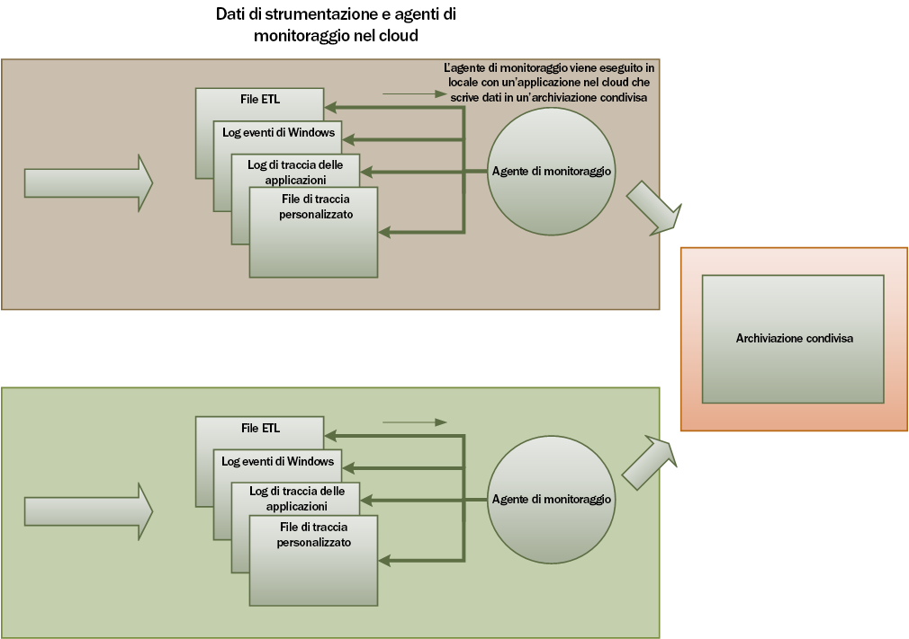
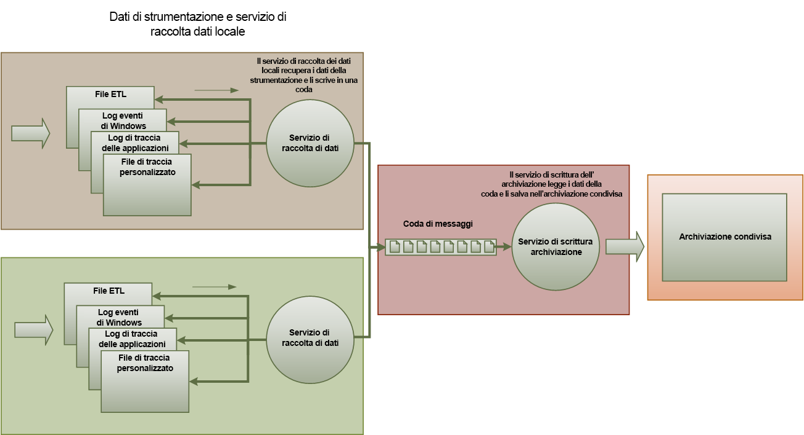

# <a name="monitoring-and-diagnostics"></a><span data-ttu-id="43258-103">Monitoraggio e diagnostica</span><span class="sxs-lookup"><span data-stu-id="43258-103">Monitoring and diagnostics</span></span>

<span data-ttu-id="43258-104">Le applicazioni distribuite e i servizi in esecuzione nel cloud sono, per loro natura, componenti software complessi che comprendono molte parti mobili.</span><span class="sxs-lookup"><span data-stu-id="43258-104">Distributed applications and services running in the cloud are, by their nature, complex pieces of software that comprise many moving parts.</span></span> <span data-ttu-id="43258-105">In un ambiente di produzione è importante essere in grado di rilevare il modo in cui gli utenti usano il sistema, di tracciare l'utilizzo delle risorse e, in generale, di monitorare l'integrità e le prestazioni del sistema stesso.</span><span class="sxs-lookup"><span data-stu-id="43258-105">In a production environment, it's important to be able to track the way in which users utilize your system, trace resource utilization, and generally monitor the health and performance of your system.</span></span> <span data-ttu-id="43258-106">Queste informazioni possono essere usate come strumento diagnostico per rilevare e correggere i problemi, nonché per individuare potenziali problemi e impedire che si verifichino.</span><span class="sxs-lookup"><span data-stu-id="43258-106">You can use this information as a diagnostic aid to detect and correct issues, and also to help spot potential problems and prevent them from occurring.</span></span>

## <a name="monitoring-and-diagnostics-scenarios"></a><span data-ttu-id="43258-107">Scenari di monitoraggio e diagnostica</span><span class="sxs-lookup"><span data-stu-id="43258-107">Monitoring and diagnostics scenarios</span></span>

<span data-ttu-id="43258-108">È possibile usare il monitoraggio per ottenere informazioni dettagliate sulla correttezza del funzionamento di un sistema.</span><span class="sxs-lookup"><span data-stu-id="43258-108">You can use monitoring to gain an insight into how well a system is functioning.</span></span> <span data-ttu-id="43258-109">Il monitoraggio è una parte fondamentale della gestione degli obiettivi di qualità del servizio.</span><span class="sxs-lookup"><span data-stu-id="43258-109">Monitoring is a crucial part of maintaining quality-of-service targets.</span></span> <span data-ttu-id="43258-110">Alcuni scenari comuni per la raccolta dei dati di monitoraggio sono:</span><span class="sxs-lookup"><span data-stu-id="43258-110">Common scenarios for collecting monitoring data include:</span></span>

- <span data-ttu-id="43258-111">Assicurarsi che il sistema rimanga integro.</span><span class="sxs-lookup"><span data-stu-id="43258-111">Ensuring that the system remains healthy.</span></span>
- <span data-ttu-id="43258-112">Tracciare la disponibilità del sistema e dei relativi elementi componenti.</span><span class="sxs-lookup"><span data-stu-id="43258-112">Tracking the availability of the system and its component elements.</span></span>
- <span data-ttu-id="43258-113">Gestione delle prestazioni per assicurarsi che la velocità effettiva del sistema non si riduca in modo imprevisto all’aumento del volume di lavoro.</span><span class="sxs-lookup"><span data-stu-id="43258-113">Maintaining performance to ensure that the throughput of the system does not degrade unexpectedly as the volume of work increases.</span></span>
- <span data-ttu-id="43258-114">Garantire che il sistema soddisfi eventuali contratti di servizio (SLA) definiti con i clienti.</span><span class="sxs-lookup"><span data-stu-id="43258-114">Guaranteeing that the system meets any service-level agreements (SLAs) established with customers.</span></span>
- <span data-ttu-id="43258-115">Proteggere la privacy e la sicurezza del sistema, utenti e i relativi dati.</span><span class="sxs-lookup"><span data-stu-id="43258-115">Protecting the privacy and security of the system, users, and their data.</span></span>
- <span data-ttu-id="43258-116">Tracciare le operazioni eseguite a scopo di controllo o a fini normativi.</span><span class="sxs-lookup"><span data-stu-id="43258-116">Tracking the operations that are performed for auditing or regulatory purposes.</span></span>
- <span data-ttu-id="43258-117">Monitorare l'utilizzo quotidiano del sistema e individuare le tendenze che, se non affrontate, potrebbero creare problemi.</span><span class="sxs-lookup"><span data-stu-id="43258-117">Monitoring the day-to-day usage of the system and spotting trends that might lead to problems if they're not addressed.</span></span>
- <span data-ttu-id="43258-118">Rilevamento di problemi che si verificano, dal report iniziale tramite l’analisi delle possibili cause, la rettifica, gli aggiornamenti software conseguenti e la distribuzione.</span><span class="sxs-lookup"><span data-stu-id="43258-118">Tracking issues that occur, from initial report through to analysis of possible causes, rectification, consequent software updates, and deployment.</span></span>
- <span data-ttu-id="43258-119">Operazioni di rilevamento e debug di versioni del software.</span><span class="sxs-lookup"><span data-stu-id="43258-119">Tracing operations and debugging software releases.</span></span>

> [!NOTE]
> <span data-ttu-id="43258-120">Questo elenco non vuole essere completo.</span><span class="sxs-lookup"><span data-stu-id="43258-120">This list is not intended to be comprehensive.</span></span> <span data-ttu-id="43258-121">In questo documento vengono trattati principalmente questi scenari, perché rappresentano le situazioni più comuni in cui viene eseguito il monitoraggio.</span><span class="sxs-lookup"><span data-stu-id="43258-121">This document focuses on these scenarios as the most common situations for performing monitoring.</span></span> <span data-ttu-id="43258-122">Potrebbero esistere altre situazioni meno comuni o specifiche dell'ambiente in uso.</span><span class="sxs-lookup"><span data-stu-id="43258-122">There might be others that are less common or are specific to your environment.</span></span>

<span data-ttu-id="43258-123">Le sezioni seguenti descrivono questi scenari in modo più dettagliato.</span><span class="sxs-lookup"><span data-stu-id="43258-123">The following sections describe these scenarios in more detail.</span></span> <span data-ttu-id="43258-124">Le informazioni per ogni scenario sono esaminate nel seguente formato:</span><span class="sxs-lookup"><span data-stu-id="43258-124">The information for each scenario is discussed in the following format:</span></span>

1. <span data-ttu-id="43258-125">Breve panoramica dello scenario.</span><span class="sxs-lookup"><span data-stu-id="43258-125">A brief overview of the scenario</span></span>
2. <span data-ttu-id="43258-126">Requisiti tipici di questo scenario.</span><span class="sxs-lookup"><span data-stu-id="43258-126">The typical requirements of this scenario</span></span>
3. <span data-ttu-id="43258-127">Dati di strumentazione non elaborati richiesti per supportare lo scenario e le possibili origini di queste informazioni.</span><span class="sxs-lookup"><span data-stu-id="43258-127">The raw instrumentation data that's required to support the scenario, and possible sources of this information</span></span>
4. <span data-ttu-id="43258-128">Modalità di analisi dei dati non elaborati e possibili combinazioni di questi per generare informazioni diagnostiche significative.</span><span class="sxs-lookup"><span data-stu-id="43258-128">How this raw data can be analyzed and combined to generate meaningful diagnostic information</span></span>

## <a name="health-monitoring"></a><span data-ttu-id="43258-129">Monitoraggio dell’integrità</span><span class="sxs-lookup"><span data-stu-id="43258-129">Health monitoring</span></span>

<span data-ttu-id="43258-130">Un sistema è integro se funziona ed è in grado di elaborare le richieste.</span><span class="sxs-lookup"><span data-stu-id="43258-130">A system is healthy if it is running and capable of processing requests.</span></span> <span data-ttu-id="43258-131">Lo scopo del monitoraggio dello stato è generare uno snapshot dello stato attuale di integrità del sistema che consenta di verificare che tutti i componenti del sistema funzionino come previsto.</span><span class="sxs-lookup"><span data-stu-id="43258-131">The purpose of health monitoring is to generate a snapshot of the current health of the system so that you can verify that all components of the system are functioning as expected.</span></span>

### <a name="requirements-for-health-monitoring"></a><span data-ttu-id="43258-132">Requisiti per il monitoraggio dell’integrità</span><span class="sxs-lookup"><span data-stu-id="43258-132">Requirements for health monitoring</span></span>

<span data-ttu-id="43258-133">Un operatore deve ricevere un avviso rapidamente (entro pochi secondi) se qualsiasi parte del sistema è ritenuta non integra.</span><span class="sxs-lookup"><span data-stu-id="43258-133">An operator should be alerted quickly (within a matter of seconds) if any part of the system is deemed to be unhealthy.</span></span> <span data-ttu-id="43258-134">L'operatore deve essere in grado di verificare quali parti del sistema funzionano normalmente e in quali parti si verificano problemi.</span><span class="sxs-lookup"><span data-stu-id="43258-134">The operator should be able to ascertain which parts of the system are functioning normally, and which parts are experiencing problems.</span></span> <span data-ttu-id="43258-135">L'integrità del sistema può essere evidenziata tramite un sistema di semafori:</span><span class="sxs-lookup"><span data-stu-id="43258-135">System health can be highlighted through a traffic-light system:</span></span>

- <span data-ttu-id="43258-136">Rosso, che indica mancanza di integrità (sistema arrestato)</span><span class="sxs-lookup"><span data-stu-id="43258-136">Red for unhealthy (the system has stopped)</span></span>
- <span data-ttu-id="43258-137">Giallo, che indica integrità parziale (il sistema è in esecuzione con funzionalità ridotte)</span><span class="sxs-lookup"><span data-stu-id="43258-137">Yellow for partially healthy (the system is running with reduced functionality)</span></span>
- <span data-ttu-id="43258-138">Verde, che indica integrità totale</span><span class="sxs-lookup"><span data-stu-id="43258-138">Green for completely healthy</span></span>

<span data-ttu-id="43258-139">Un sistema di monitoraggio completo consente a un operatore di eseguire il drill-down attraverso il sistema per visualizzare lo stato di integrità di sottosistemi e componenti.</span><span class="sxs-lookup"><span data-stu-id="43258-139">A comprehensive health-monitoring system enables an operator to drill down through the system to view the health status of subsystems and components.</span></span> <span data-ttu-id="43258-140">Ad esempio, se tutto il sistema viene rappresentato come parzialmente integro, l'operatore deve essere in grado di eseguire lo zoom avanti e determinare quale funzionalità sia attualmente disponibile.</span><span class="sxs-lookup"><span data-stu-id="43258-140">For example, if the overall system is depicted as partially healthy, the operator should be able to zoom in and determine which functionality is currently unavailable.</span></span>

### <a name="data-sources-instrumentation-and-data-collection-requirements"></a><span data-ttu-id="43258-141">Requisiti per le origini, la raccolta dati e la strumentazione</span><span class="sxs-lookup"><span data-stu-id="43258-141">Data sources, instrumentation, and data-collection requirements</span></span>

<span data-ttu-id="43258-142">I dati non elaborati richiesti per supportare il monitoraggio dello stato possono essere generati come risultato di:</span><span class="sxs-lookup"><span data-stu-id="43258-142">The raw data that's required to support health monitoring can be generated as a result of:</span></span>

- <span data-ttu-id="43258-143">Tracciare l'esecuzione delle richieste degli utenti.</span><span class="sxs-lookup"><span data-stu-id="43258-143">Tracing execution of user requests.</span></span> <span data-ttu-id="43258-144">Queste informazioni permettono di determinare quali richieste hanno avuto esito positivo, quali esito negativo e la durata di ogni richiesta.</span><span class="sxs-lookup"><span data-stu-id="43258-144">This information can be used to determine which requests have succeeded, which have failed, and how long each request takes.</span></span>
- <span data-ttu-id="43258-145">Monitoraggio sintetico degli utenti.</span><span class="sxs-lookup"><span data-stu-id="43258-145">Synthetic user monitoring.</span></span> <span data-ttu-id="43258-146">Questo processo simula i passaggi eseguiti da un utente e segue una serie di passaggi predefiniti.</span><span class="sxs-lookup"><span data-stu-id="43258-146">This process simulates the steps performed by a user and follows a predefined series of steps.</span></span> <span data-ttu-id="43258-147">I risultati di ogni passaggio devono essere acquisiti.</span><span class="sxs-lookup"><span data-stu-id="43258-147">The results of each step should be captured.</span></span>
- <span data-ttu-id="43258-148">Eccezioni di registrazione, errori e avvisi.</span><span class="sxs-lookup"><span data-stu-id="43258-148">Logging exceptions, faults, and warnings.</span></span> <span data-ttu-id="43258-149">Queste informazioni possono essere acquisite a seguito di istruzioni di traccia incorporate nel codice dell'applicazione e recuperando informazioni dai registri eventi dei servizi a cui il sistema fa riferimento.</span><span class="sxs-lookup"><span data-stu-id="43258-149">This information can be captured as a result of trace statements embedded into the application code, as well as retrieving information from the event logs of any services that the system references.</span></span>
- <span data-ttu-id="43258-150">Monitoraggio dell'integrità di eventuali servizi di terze parti usati dal sistema.</span><span class="sxs-lookup"><span data-stu-id="43258-150">Monitoring the health of any third-party services that the system uses.</span></span> <span data-ttu-id="43258-151">Questo monitoraggio potrebbe richiedere il recupero e l'analisi dei dati di integrità forniti da questi servizi.</span><span class="sxs-lookup"><span data-stu-id="43258-151">This monitoring might require retrieving and parsing health data that these services supply.</span></span> <span data-ttu-id="43258-152">Queste informazioni possono avere diversi formati.</span><span class="sxs-lookup"><span data-stu-id="43258-152">This information might take a variety of formats.</span></span>
- <span data-ttu-id="43258-153">Monitoraggio endpoint</span><span class="sxs-lookup"><span data-stu-id="43258-153">Endpoint monitoring.</span></span> <span data-ttu-id="43258-154">Questo meccanismo è descritto più dettagliatamente nella sezione "Monitoraggio della disponibilità".</span><span class="sxs-lookup"><span data-stu-id="43258-154">This mechanism is described in more detail in the "Availability monitoring" section.</span></span>
- <span data-ttu-id="43258-155">Raccolta di informazioni sulle prestazioni dell’ambiente, ad esempio l'utilizzo della CPU in background o un'attività I/O (rete compresa).</span><span class="sxs-lookup"><span data-stu-id="43258-155">Collecting ambient performance information, such as background CPU utilization or I/O (including network) activity.</span></span>

### <a name="analyzing-health-data"></a><span data-ttu-id="43258-156">Analisi dei dati di integrità</span><span class="sxs-lookup"><span data-stu-id="43258-156">Analyzing health data</span></span>

<span data-ttu-id="43258-157">L'obiettivo principale del monitoraggio dell’integrità è indicare rapidamente se il sistema è in esecuzione.</span><span class="sxs-lookup"><span data-stu-id="43258-157">The primary focus of health monitoring is to quickly indicate whether the system is running.</span></span> <span data-ttu-id="43258-158">L'analisi critica dei dati immediati può attivare un avviso se un componente critico viene rilevato come non integro,</span><span class="sxs-lookup"><span data-stu-id="43258-158">Hot analysis of the immediate data can trigger an alert if a critical component is detected as unhealthy.</span></span> <span data-ttu-id="43258-159">perché, ad esempio, non risponde a una serie consecutiva di ping. L'operatore può quindi richiedere l'azione correttiva appropriata.</span><span class="sxs-lookup"><span data-stu-id="43258-159">(It fails to respond to a consecutive series of pings, for example.) The operator can then take the appropriate corrective action.</span></span>

<span data-ttu-id="43258-160">Un sistema più avanzato potrebbe includere un elemento predittivo che esegue un'analisi a freddo sui carichi di lavoro recenti e attuali.</span><span class="sxs-lookup"><span data-stu-id="43258-160">A more advanced system might include a predictive element that performs a cold analysis over recent and current workloads.</span></span> <span data-ttu-id="43258-161">Un'analisi a freddo è in grado di individuare tendenze e di determinare se è probabile che il sistema rimanga integro o se necessita di risorse aggiuntive.</span><span class="sxs-lookup"><span data-stu-id="43258-161">A cold analysis can spot trends and determine whether the system is likely to remain healthy or whether the system will need additional resources.</span></span> <span data-ttu-id="43258-162">Questo elemento predittivo deve basarsi sulle metriche di prestazioni critiche, ad esempio:</span><span class="sxs-lookup"><span data-stu-id="43258-162">This predictive element should be based on critical performance metrics, such as:</span></span>

- <span data-ttu-id="43258-163">La frequenza delle richieste dirette a ogni servizio o sottosistema.</span><span class="sxs-lookup"><span data-stu-id="43258-163">The rate of requests directed at each service or subsystem.</span></span>
- <span data-ttu-id="43258-164">I tempi di risposta di tali richieste.</span><span class="sxs-lookup"><span data-stu-id="43258-164">The response times of these requests.</span></span>
- <span data-ttu-id="43258-165">Il volume del flusso dei dati in entrata e in uscita da ogni servizio.</span><span class="sxs-lookup"><span data-stu-id="43258-165">The volume of data flowing into and out of each service.</span></span>

<span data-ttu-id="43258-166">Se il valore di qualsiasi metrica supera una soglia definita, il sistema può generare un avviso per consentire a un operatore o alla scalabilità automatica (se disponibile) di eseguire le azioni preventive necessarie per garantire l'integrità del sistema.</span><span class="sxs-lookup"><span data-stu-id="43258-166">If the value of any metric exceeds a defined threshold, the system can raise an alert to enable an operator or autoscaling (if available) to take the preventative actions necessary to maintain system health.</span></span> <span data-ttu-id="43258-167">Queste azioni possono implicare l'aggiunta di risorse, riavviare uno o più i servizi con esito negativo o applicare la limitazione per le richieste di priorità inferiore.</span><span class="sxs-lookup"><span data-stu-id="43258-167">These actions might involve adding resources, restarting one or more services that are failing, or applying throttling to lower-priority requests.</span></span>

## <a name="availability-monitoring"></a><span data-ttu-id="43258-168">Monitoraggio della disponibilità</span><span class="sxs-lookup"><span data-stu-id="43258-168">Availability monitoring</span></span>

<span data-ttu-id="43258-169">Un sistema realmente integro richiede la disponibilità dei componenti e dei sottosistemi che lo costituiscono.</span><span class="sxs-lookup"><span data-stu-id="43258-169">A truly healthy system requires that the components and subsystems that compose the system are available.</span></span> <span data-ttu-id="43258-170">Il monitoraggio della disponibilità è strettamente correlato al monitoraggio dello stato,</span><span class="sxs-lookup"><span data-stu-id="43258-170">Availability monitoring is closely related to health monitoring.</span></span> <span data-ttu-id="43258-171">ma mentre il monitoraggio dello stato fornisce una visualizzazione immediata dell'integrità del sistema in quel momento, il monitoraggio della disponibilità rileva la disponibilità del sistema e dei relativi componenti per generare statistiche riguardanti il tempo di attività del sistema stesso.</span><span class="sxs-lookup"><span data-stu-id="43258-171">But whereas health monitoring provides an immediate view of the current health of the system, availability monitoring is concerned with tracking the availability of the system and its components to generate statistics about the uptime of the system.</span></span>

<span data-ttu-id="43258-172">In molti sistemi, alcuni componenti (ad esempio un database) sono configurati con ridondanza incorporata per consentire il failover rapido in caso di errore grave o perdita di connettività.</span><span class="sxs-lookup"><span data-stu-id="43258-172">In many systems, some components (such as a database) are configured with built-in redundancy to permit rapid failover in the event of a serious fault or loss of connectivity.</span></span> <span data-ttu-id="43258-173">In una situazione ideale, gli utenti non dovrebbero rendersi conto che si è verificato un errore di questo tipo,</span><span class="sxs-lookup"><span data-stu-id="43258-173">Ideally, users should not be aware that such a failure has occurred.</span></span> <span data-ttu-id="43258-174">ma dal punto di vista di monitoraggio della disponibilità è necessario raccogliere quante più informazioni possibile su tali errori per determinarne la causa e intraprendere azioni correttive per impedire che si verifichino di nuovo.</span><span class="sxs-lookup"><span data-stu-id="43258-174">But from an availability monitoring perspective, it's necessary to gather as much information as possible about such failures to determine the cause and take corrective actions to prevent them from recurring.</span></span>

<span data-ttu-id="43258-175">I dati necessari per tener traccia della disponibilità potrebbero dipendere da diversi fattori di basso livello,</span><span class="sxs-lookup"><span data-stu-id="43258-175">The data that's required to track availability might depend on a number of lower-level factors.</span></span> <span data-ttu-id="43258-176">molti dei quali potrebbero essere specifici dell'applicazione, del sistema e dell'ambiente.</span><span class="sxs-lookup"><span data-stu-id="43258-176">Many of these factors might be specific to the application, system, and environment.</span></span> <span data-ttu-id="43258-177">Un sistema di monitoraggio efficace acquisisce i dati di disponibilità che corrispondono a questi fattori di basso livello e quindi vengono aggregati in modo da offrire una panoramica del sistema.</span><span class="sxs-lookup"><span data-stu-id="43258-177">An effective monitoring system captures the availability data that corresponds to these low-level factors and then aggregates them to give an overall picture of the system.</span></span> <span data-ttu-id="43258-178">Ad esempio, in un sistema di e-commerce, la funzionalità di business che consente a un cliente di effettuare ordini può dipendere dall'archivio in cui vengono archiviati i dettagli dell'ordine e dal sistema di pagamento che gestisce le transazioni monetarie di pagamento di tali ordini.</span><span class="sxs-lookup"><span data-stu-id="43258-178">For example, in an e-commerce system, the business functionality that enables a customer to place orders might depend on the repository where order details are stored and the payment system that handles the monetary transactions for paying for these orders.</span></span> <span data-ttu-id="43258-179">La disponibilità della parte del sistema relativa alla creazione degli ordini è pertanto funzione della disponibilità dell'archivio e del sottosistema di pagamento.</span><span class="sxs-lookup"><span data-stu-id="43258-179">The availability of the order-placement part of the system is therefore a function of the availability of the repository and the payment subsystem.</span></span>

### <a name="requirements-for-availability-monitoring"></a><span data-ttu-id="43258-180">Requisiti per il monitoraggio della disponibilità</span><span class="sxs-lookup"><span data-stu-id="43258-180">Requirements for availability monitoring</span></span>

<span data-ttu-id="43258-181">Un operatore deve anche essere in grado di visualizzare la disponibilità cronologica di ogni sistema e sottosistema e usare queste informazioni per individuare eventuali tendenze che possono causare periodicamente errori di uno o più sottosistemi.</span><span class="sxs-lookup"><span data-stu-id="43258-181">An operator should also be able to view the historical availability of each system and subsystem, and use this information to spot any trends that might cause one or more subsystems to periodically fail.</span></span> <span data-ttu-id="43258-182">Gli errori dei servizi iniziano a una determinata ora,corrispondente a un picco delle operazioni di elaborazione?</span><span class="sxs-lookup"><span data-stu-id="43258-182">(Do services start to fail at a particular time of day that corresponds to peak processing hours?)</span></span>

<span data-ttu-id="43258-183">Una soluzione di monitoraggio deve offrire una visualizzazione immediata e cronologica della disponibilità o dell'indisponibilità di ogni sistema.</span><span class="sxs-lookup"><span data-stu-id="43258-183">A monitoring solution should provide an immediate and historical view of the availability or unavailability of each subsystem.</span></span> <span data-ttu-id="43258-184">Deve anche essere in grado di avvisare rapidamente un operatore quando uno o più servizi non funzionano o quando gli utenti non riescono a connettersi ai servizi.</span><span class="sxs-lookup"><span data-stu-id="43258-184">It should also be capable of quickly alerting an operator when one or more services fail or when users can't connect to services.</span></span> <span data-ttu-id="43258-185">Non si tratta semplicemente di monitorare ogni servizio ma anche di esaminare le azioni eseguite da ogni utente, se tali azioni hanno esito negativo quando tentano di comunicare con un servizio.</span><span class="sxs-lookup"><span data-stu-id="43258-185">This is a matter of not only monitoring each service, but also examining the actions that each user performs if these actions fail when they attempt to communicate with a service.</span></span> <span data-ttu-id="43258-186">Entro certi limiti qualche problema di connettività è normale e può essere dovuto a errori temporanei,</span><span class="sxs-lookup"><span data-stu-id="43258-186">To some extent, a degree of connectivity failure is normal and might be due to transient errors.</span></span> <span data-ttu-id="43258-187">ma può essere utile consentire al sistema di generare un avviso relativo al numero di errori di connessione a un sottosistema specifico durante un determinato periodo di tempo.</span><span class="sxs-lookup"><span data-stu-id="43258-187">But it might be useful to allow the system to raise an alert for the number of connectivity failures to a specified subsystem that occur during a specific period.</span></span>

<!-- markdownlint-disable MD024 MD033 -->

### <a name="data-sources-instrumentation-and-data-collection-requirements"></a><span data-ttu-id="43258-188">Requisiti per le origini, la raccolta dati e la strumentazione</span><span class="sxs-lookup"><span data-stu-id="43258-188">Data sources, instrumentation, and data-collection requirements</span></span>

<span data-ttu-id="43258-189">Come nel monitoraggio dello stato, i dati non elaborati necessari per supportare il monitoraggio della disponibilità possono essere generati tramite Synthetic User Monitoring e mediante registrazione delle eccezioni, degli errori e degli avvisi che potrebbero verificarsi.</span><span class="sxs-lookup"><span data-stu-id="43258-189">As with health monitoring, the raw data that's required to support availability monitoring can be generated as a result of synthetic user monitoring and logging any exceptions, faults, and warnings that might occur.</span></span> <span data-ttu-id="43258-190">Inoltre, è possibile ottenere i dati sulla disponibilità dal monitoraggio degli endpoint.</span><span class="sxs-lookup"><span data-stu-id="43258-190">In addition, availability data can be obtained from performing endpoint monitoring.</span></span> <span data-ttu-id="43258-191">L'applicazione può esporre uno o più endpoint di integrità, ogni test di accesso a un'area funzionale all'interno del sistema.</span><span class="sxs-lookup"><span data-stu-id="43258-191">The application can expose one or more health endpoints, each testing access to a functional area within the system.</span></span> <span data-ttu-id="43258-192">Il sistema di monitoraggio può eseguire il ping di ogni endpoint in base a una pianificazione definita e raccogliere i risultati (esito positivo o esito negativo).</span><span class="sxs-lookup"><span data-stu-id="43258-192">The monitoring system can ping each endpoint by following a defined schedule and collect the results (success or fail).</span></span>

<span data-ttu-id="43258-193">Tutti i timeout, gli errori di connettività di rete e i tentativi di connessione devono essere registrati.</span><span class="sxs-lookup"><span data-stu-id="43258-193">All timeouts, network connectivity failures, and connection retry attempts must be recorded.</span></span> <span data-ttu-id="43258-194">Tutti i dati devono riportare un timestamp.</span><span class="sxs-lookup"><span data-stu-id="43258-194">All data should be time-stamped.</span></span>

### <a name="analyzing-availability-data"></a><span data-ttu-id="43258-195">Analisi dei dati di disponibilità</span><span class="sxs-lookup"><span data-stu-id="43258-195">Analyzing availability data</span></span>

<span data-ttu-id="43258-196">I dati di strumentazione devono essere aggregati e correlati per supportare i seguenti tipi di analisi:</span><span class="sxs-lookup"><span data-stu-id="43258-196">The instrumentation data must be aggregated and correlated to support the following types of analysis:</span></span>

- <span data-ttu-id="43258-197">La disponibilità immediata del sistema e dei sottosistemi.</span><span class="sxs-lookup"><span data-stu-id="43258-197">The immediate availability of the system and subsystems.</span></span>
- <span data-ttu-id="43258-198">La frequenza degli errori di disponibilità del sistema e dei sottosistemi.</span><span class="sxs-lookup"><span data-stu-id="43258-198">The availability failure rates of the system and subsystems.</span></span> <span data-ttu-id="43258-199">In una situazione ideale, un operatore deve essere in grado di mettere in relazione gli errori con attività specifiche, identificando il problema alla base di un errore del sistema.</span><span class="sxs-lookup"><span data-stu-id="43258-199">Ideally, an operator should be able to correlate failures with specific activities: what was happening when the system failed?</span></span>
- <span data-ttu-id="43258-200">Una visualizzazione cronologica della frequenza degli errori del sistema o di qualsiasi sottosistema in qualsiasi periodo di tempo specificato e il carico d lavoro del sistema, ad esempio il numero di richieste degli utenti, al momento dell'errore.</span><span class="sxs-lookup"><span data-stu-id="43258-200">A historical view of failure rates of the system or any subsystems across any specified period, and the load on the system (number of user requests, for example) when a failure occurred.</span></span>
- <span data-ttu-id="43258-201">I motivi della mancata disponibilità del sistema o dei sottosistemi.</span><span class="sxs-lookup"><span data-stu-id="43258-201">The reasons for unavailability of the system or any subsystems.</span></span> <span data-ttu-id="43258-202">Ad esempio, servizio non in esecuzione, perdita di connettività, timeout della connessione o ricezione di errori.</span><span class="sxs-lookup"><span data-stu-id="43258-202">For example, the reasons might be service not running, connectivity lost, connected but timing out, and connected but returning errors.</span></span>

<span data-ttu-id="43258-203">È possibile calcolare la percentuale di disponibilità di un servizio in un periodo di tempo specifico tramite la formula seguente:</span><span class="sxs-lookup"><span data-stu-id="43258-203">You can calculate the percentage availability of a service over a period of time by using the following formula:</span></span>

```console
%Availability =  ((Total Time – Total Downtime) / Total Time ) * 100
```

<span data-ttu-id="43258-204">Ciò è utile per gli scopi dei contratti di servizio.</span><span class="sxs-lookup"><span data-stu-id="43258-204">This is useful for SLA purposes.</span></span> <span data-ttu-id="43258-205">Il [monitoraggio del contratto di servizio](#sla-monitoring) è descritto in dettaglio più avanti in queste indicazioni. La definizione di *tempo di inattività* dipende dal servizio.</span><span class="sxs-lookup"><span data-stu-id="43258-205">([SLA monitoring](#sla-monitoring) is described in more detail later in this guidance.) The definition of *downtime* depends on the service.</span></span> <span data-ttu-id="43258-206">Ad esempio, il Servizio di compilazione Visual Studio Team Services definisce il tempo di inattività come il periodo durante il quale il Servizio di compilazione non è disponibile (minuti totali accumulati).</span><span class="sxs-lookup"><span data-stu-id="43258-206">For example, Visual Studio Team Services Build Service defines downtime as the period (total accumulated minutes) during which Build Service is unavailable.</span></span> <span data-ttu-id="43258-207">Un minuto è considerato tempo di non disponibilità se tutte le richieste HTTP continue al Servizio di compilazione per l'esecuzione di operazioni avviate dal cliente per l'intero minuto generano un codice errore o non restituiscono alcuna risposta.</span><span class="sxs-lookup"><span data-stu-id="43258-207">A minute is considered unavailable if all continuous HTTP requests to Build Service to perform customer-initiated operations throughout the minute either result in an error code or do not return a response.</span></span>

## <a name="performance-monitoring"></a><span data-ttu-id="43258-208">Monitoraggio delle prestazioni</span><span class="sxs-lookup"><span data-stu-id="43258-208">Performance monitoring</span></span>

<span data-ttu-id="43258-209">Quando il sistema si trova in condizioni di carico sempre maggiore per l'aumento del volume di utenti, la dimensione dei set di dati a cui tali utenti accedono aumenta, così come la probabilità di errori di uno o più componenti.</span><span class="sxs-lookup"><span data-stu-id="43258-209">As the system is placed under more and more stress (by increasing the volume of users), the size of the datasets that these users access grows and the possibility of failure of one or more components becomes more likely.</span></span> <span data-ttu-id="43258-210">Spesso, il guasto di un componente è preceduto da una riduzione delle prestazioni.</span><span class="sxs-lookup"><span data-stu-id="43258-210">Frequently, component failure is preceded by a decrease in performance.</span></span> <span data-ttu-id="43258-211">Se si è in grado di rilevare tale riduzione, è possibile adottare misure proattive per ovviare al problema.</span><span class="sxs-lookup"><span data-stu-id="43258-211">If you're able detect such a decrease, you can take proactive steps to remedy the situation.</span></span>

<span data-ttu-id="43258-212">Le prestazioni del sistema dipendono da numerosi fattori.</span><span class="sxs-lookup"><span data-stu-id="43258-212">System performance depends on a number of factors.</span></span> <span data-ttu-id="43258-213">Ogni fattore in genere viene misurato tramite indicatori di prestazioni chiave (KPI, Key Performance Indicator), ad esempio il numero di transazioni di database al secondo o il volume di richieste di rete gestite correttamente nell'intervallo di tempo specificato.</span><span class="sxs-lookup"><span data-stu-id="43258-213">Each factor is typically measured through key performance indicators (KPIs), such as the number of database transactions per second or the volume of network requests that are successfully serviced in a specified time frame.</span></span> <span data-ttu-id="43258-214">Alcuni di questi indicatori KPI possono essere disponibili come misure di prestazioni specifiche, mentre altri possono derivare da una combinazione di metriche.</span><span class="sxs-lookup"><span data-stu-id="43258-214">Some of these KPIs might be available as specific performance measures, whereas others might be derived from a combination of metrics.</span></span>

> [!NOTE]
> <span data-ttu-id="43258-215">Determinando buone o scarse prestazioni, è necessario comprendere il livello di prestazioni in cui il sistema deve essere in grado di funzionare.</span><span class="sxs-lookup"><span data-stu-id="43258-215">Determining poor or good performance requires that you understand the level of performance at which the system should be capable of running.</span></span> <span data-ttu-id="43258-216">È necessario osservare il sistema mentre è sottoposto al carico di lavoro abituale e acquisire i dati per ogni indicatore KPI in un determinato periodo di tempo.</span><span class="sxs-lookup"><span data-stu-id="43258-216">This requires observing the system while it's functioning under a typical load and capturing the data for each KPI over a period of time.</span></span> <span data-ttu-id="43258-217">Questo potrebbe comportare l'esecuzione del sistema sotto un carico simulato in un ambiente di test e raccogliere i dati appropriati prima di distribuire il sistema in un ambiente di produzione.</span><span class="sxs-lookup"><span data-stu-id="43258-217">This might involve running the system under a simulated load in a test environment and gathering the appropriate data before deploying the system to a production environment.</span></span>
>
> <span data-ttu-id="43258-218">Assicurarsi poi che il monitoraggio delle prestazioni non diventi un onere per il sistema.</span><span class="sxs-lookup"><span data-stu-id="43258-218">You should also ensure that monitoring for performance purposes does not become a burden on the system.</span></span> <span data-ttu-id="43258-219">È possibile regolare dinamicamente il livello di dettaglio relativo ai dati raccolti dal processo di monitoraggio delle prestazioni.</span><span class="sxs-lookup"><span data-stu-id="43258-219">You might be able to dynamically adjust the level of detail for the data that the performance monitoring process gathers.</span></span>

### <a name="requirements-for-performance-monitoring"></a><span data-ttu-id="43258-220">Requisiti per il monitoraggio delle prestazioni</span><span class="sxs-lookup"><span data-stu-id="43258-220">Requirements for performance monitoring</span></span>

<span data-ttu-id="43258-221">Per esaminare le prestazioni del sistema, un operatore in genere deve visualizzare le informazioni relative a:</span><span class="sxs-lookup"><span data-stu-id="43258-221">To examine system performance, an operator typically needs to see information that includes:</span></span>

- <span data-ttu-id="43258-222">Velocità di risposta per le richieste degli utenti.</span><span class="sxs-lookup"><span data-stu-id="43258-222">The response rates for user requests.</span></span>
- <span data-ttu-id="43258-223">Il numero di richieste utente simultanee.</span><span class="sxs-lookup"><span data-stu-id="43258-223">The number of concurrent user requests.</span></span>
- <span data-ttu-id="43258-224">Il volume di traffico di rete.</span><span class="sxs-lookup"><span data-stu-id="43258-224">The volume of network traffic.</span></span>
- <span data-ttu-id="43258-225">La velocità a cui le transazioni aziendali vengono completate.</span><span class="sxs-lookup"><span data-stu-id="43258-225">The rates at which business transactions are being completed.</span></span>
- <span data-ttu-id="43258-226">Tempo medio di elaborazione delle richieste.</span><span class="sxs-lookup"><span data-stu-id="43258-226">The average processing time for requests.</span></span>

<span data-ttu-id="43258-227">Può inoltre essere utile fornire strumenti che consentono a un operatore di individuare delle correlazioni, ad esempio:</span><span class="sxs-lookup"><span data-stu-id="43258-227">It can also be helpful to provide tools that enable an operator to help spot correlations, such as:</span></span>

- <span data-ttu-id="43258-228">Il numero di utenti simultanei rispetto al tempo di latenza della richiesta, ovvero il tempo che trascorre tra l'invio di una richiesta da parte di un utente e l'inizio dell'elaborazione della richiesta stessa.</span><span class="sxs-lookup"><span data-stu-id="43258-228">The number of concurrent users versus request latency times (how long it takes to start processing a request after the user has sent it).</span></span>
- <span data-ttu-id="43258-229">Il numero di utenti simultanei rispetto al tempo medio di risposta, ovvero il tempo necessario per il completamento di una richiesta dall'avvio dell'elaborazione.</span><span class="sxs-lookup"><span data-stu-id="43258-229">The number of concurrent users versus the average response time (how long it takes to complete a request after it has started processing).</span></span>
- <span data-ttu-id="43258-230">Il volume di richieste rispetto al numero di errori di elaborazione.</span><span class="sxs-lookup"><span data-stu-id="43258-230">The volume of requests versus the number of processing errors.</span></span>

<span data-ttu-id="43258-231">Oltre a queste informazioni funzionali di alto livello, un operatore deve anche essere in grado di ottenere una visualizzazione dettagliata delle prestazioni per ogni componente nel sistema.</span><span class="sxs-lookup"><span data-stu-id="43258-231">Along with this high-level functional information, an operator should be able to obtain a detailed view of the performance for each component in the system.</span></span> <span data-ttu-id="43258-232">Questi dati vengono in genere forniti tramite contatori di prestazioni di basso livello che tengono traccia di informazioni quali:</span><span class="sxs-lookup"><span data-stu-id="43258-232">This data is typically provided through low-level performance counters that track information such as:</span></span>

- <span data-ttu-id="43258-233">Utilizzo della memoria.</span><span class="sxs-lookup"><span data-stu-id="43258-233">Memory utilization.</span></span>
- <span data-ttu-id="43258-234">Numero di thread.</span><span class="sxs-lookup"><span data-stu-id="43258-234">Number of threads.</span></span>
- <span data-ttu-id="43258-235">Tempo di elaborazione della CPU.</span><span class="sxs-lookup"><span data-stu-id="43258-235">CPU processing time.</span></span>
- <span data-ttu-id="43258-236">Lunghezza della coda di richieste.</span><span class="sxs-lookup"><span data-stu-id="43258-236">Request queue length.</span></span>
- <span data-ttu-id="43258-237">Velocità ed errori di I/O del disco o della rete.</span><span class="sxs-lookup"><span data-stu-id="43258-237">Disk or network I/O rates and errors.</span></span>
- <span data-ttu-id="43258-238">Numero di byte scritti o letti.</span><span class="sxs-lookup"><span data-stu-id="43258-238">Number of bytes written or read.</span></span>
- <span data-ttu-id="43258-239">Indicatori di middleware, ad esempio lunghezza della coda.</span><span class="sxs-lookup"><span data-stu-id="43258-239">Middleware indicators, such as queue length.</span></span>

<span data-ttu-id="43258-240">Tutte le visualizzazioni devono consentire a un operatore di specificare un periodo di tempo.</span><span class="sxs-lookup"><span data-stu-id="43258-240">All visualizations should allow an operator to specify a time period.</span></span> <span data-ttu-id="43258-241">I dati visualizzati possono costituire lo snapshot della situazione corrente e/o la visualizzazione cronologica delle prestazioni.</span><span class="sxs-lookup"><span data-stu-id="43258-241">The displayed data might be a snapshot of the current situation and/or a historical view of the performance.</span></span>

<span data-ttu-id="43258-242">Un operatore deve essere in grado di generare un avviso in base alla misura di qualsiasi prestazione per qualsiasi valore dato durante un intervallo di tempo specificato.</span><span class="sxs-lookup"><span data-stu-id="43258-242">An operator should be able to raise an alert based on any performance measure for any specified value during any specified time interval.</span></span>

### <a name="data-sources-instrumentation-and-data-collection-requirements"></a><span data-ttu-id="43258-243">Requisiti per le origini, la raccolta dati e la strumentazione</span><span class="sxs-lookup"><span data-stu-id="43258-243">Data sources, instrumentation, and data-collection requirements</span></span>

<span data-ttu-id="43258-244">È possibile raccogliere dati di alto livello relativi alle prestazioni (velocità effettiva, numero di utenti simultanei, numero di transazioni aziendali, frequenza di errori e così via) tramite il monitoraggio dello stato delle richieste degli utenti nel momento in cui arrivano e passano attraverso il sistema.</span><span class="sxs-lookup"><span data-stu-id="43258-244">You can gather high-level performance data (throughput, number of concurrent users, number of business transactions, error rates, and so on) by monitoring the progress of users' requests as they arrive and pass through the system.</span></span> <span data-ttu-id="43258-245">Ciò implica che in corrispondenza di punti chiave del codice dell'applicazione siano presenti istruzioni di traccia e informazioni di temporizzazione.</span><span class="sxs-lookup"><span data-stu-id="43258-245">This involves incorporating tracing statements at key points in the application code, together with timing information.</span></span> <span data-ttu-id="43258-246">Tutti gli errori, le eccezioni e gli avvisi devono essere acquisiti con i dati sufficienti a metterli in relazione alle richieste che li hanno causati.</span><span class="sxs-lookup"><span data-stu-id="43258-246">All faults, exceptions, and warnings should be captured with sufficient data for correlating them with the requests that caused them.</span></span> <span data-ttu-id="43258-247">Un'altra utile fonte di informazioni è costituita dal log di Internet Information Services (IIS).</span><span class="sxs-lookup"><span data-stu-id="43258-247">The Internet Information Services (IIS) log is another useful source.</span></span>

<span data-ttu-id="43258-248">Se possibile, è inoltre consigliabile acquisire dati sulle prestazioni per i sistemi esterni utilizzati dall'applicazione.</span><span class="sxs-lookup"><span data-stu-id="43258-248">If possible, you should also capture performance data for any external systems that the application uses.</span></span> <span data-ttu-id="43258-249">Questi sistemi esterni potrebbero fornire i propri contatori delle prestazioni o altre funzionalità per la richiesta di dati sulle prestazioni.</span><span class="sxs-lookup"><span data-stu-id="43258-249">These external systems might provide their own performance counters or other features for requesting performance data.</span></span> <span data-ttu-id="43258-250">Se ciò non è possibile, registrare informazioni quali l'ora di inizio e l'ora di fine di ogni richiesta effettuata a un sistema esterno insieme allo stato dell'operazione (esito positivo, errore o avviso).</span><span class="sxs-lookup"><span data-stu-id="43258-250">If this is not possible, record information such as the start time and end time of each request made to an external system, together with the status (success, fail, or warning) of the operation.</span></span> <span data-ttu-id="43258-251">Per le richieste di tempo, ad esempio, è possibile usare un approccio simile al funzionamento di un cronometro, avviando un timer al momento dell'avvio della richiesta e arrestando il timer al completamento della richiesta stessa.</span><span class="sxs-lookup"><span data-stu-id="43258-251">For example, you can use a stopwatch approach to time requests: start a timer when the request starts and then stop the timer when the request finishes.</span></span>

<span data-ttu-id="43258-252">Dati di basso livello sulle prestazioni per singoli componenti all'interno di un sistema possono essere disponibili tramite funzionalità e servizi quali i contatori delle prestazioni Windows e Diagnostica di Azure.</span><span class="sxs-lookup"><span data-stu-id="43258-252">Low-level performance data for individual components in a system might be available through features and services such as Windows performance counters and Azure Diagnostics.</span></span>

### <a name="analyzing-performance-data"></a><span data-ttu-id="43258-253">Analisi dei dati sulle prestazioni</span><span class="sxs-lookup"><span data-stu-id="43258-253">Analyzing performance data</span></span>

<span data-ttu-id="43258-254">Gran parte delle attività di analisi consistono nell'aggregazione dei dati sulle prestazioni per tipo di richiesta utente e/o sottosistema o servizio a cui viene inviata ogni richiesta.</span><span class="sxs-lookup"><span data-stu-id="43258-254">Much of the analysis work consists of aggregating performance data by user request type and/or the subsystem or service to which each request is sent.</span></span> <span data-ttu-id="43258-255">Esempi di richiesta utente sono l'aggiunta di un articolo al carrello o la procedura di completamento della transazione in un sistema di e-commerce.</span><span class="sxs-lookup"><span data-stu-id="43258-255">An example of a user request is adding an item to a shopping cart or performing the checkout process in an e-commerce system.</span></span>

<span data-ttu-id="43258-256">Un altro requisito comune è il riepilogo dei dati sulle prestazioni in percentili selezionati.</span><span class="sxs-lookup"><span data-stu-id="43258-256">Another common requirement is summarizing performance data in selected percentiles.</span></span> <span data-ttu-id="43258-257">Un operatore, ad esempio, può determinare i tempi di risposta per il 99%, il 95% e il 70% delle richieste.</span><span class="sxs-lookup"><span data-stu-id="43258-257">For example, an operator might determine the response times for 99 percent of requests, 95 percent of requests, and 70 percent of requests.</span></span> <span data-ttu-id="43258-258">Per ogni percentile potrebbero essere impostati obiettivi del contratto di servizio o altri obiettivi.</span><span class="sxs-lookup"><span data-stu-id="43258-258">There might be SLA targets or other goals set for each percentile.</span></span> <span data-ttu-id="43258-259">I risultati devono essere segnalati quasi in tempo reale per consentire il rilevamento di problemi immediati.</span><span class="sxs-lookup"><span data-stu-id="43258-259">The ongoing results should be reported in near real time to help detect immediate issues.</span></span> <span data-ttu-id="43258-260">I risultati devono anche essere aggregati in base a periodi più lunghi per scopi statistici.</span><span class="sxs-lookup"><span data-stu-id="43258-260">The results should also be aggregated over the longer time for statistical purposes.</span></span>

<span data-ttu-id="43258-261">Nel caso di problemi di latenza che influiscono sulle prestazioni, un operatore deve essere rapidamente in grado di identificare la causa del collo di bottiglia esaminando la latenza di ogni passaggio di ogni richiesta.</span><span class="sxs-lookup"><span data-stu-id="43258-261">In the case of latency issues affecting performance, an operator should be able to quickly identify the cause of the bottleneck by examining the latency of each step that each request performs.</span></span> <span data-ttu-id="43258-262">I dati sulle prestazioni devono pertanto fornire un mezzo di correlazione di misure delle prestazioni per ogni passaggio per collegarle a una richiesta specifica.</span><span class="sxs-lookup"><span data-stu-id="43258-262">The performance data must therefore provide a means of correlating performance measures for each step to tie them to a specific request.</span></span>

<span data-ttu-id="43258-263">A seconda dei requisiti di visualizzazione, potrebbe essere utile generare e archiviare un cubo dati contenente visualizzazioni dei dati non elaborati.</span><span class="sxs-lookup"><span data-stu-id="43258-263">Depending on the visualization requirements, it might be useful to generate and store a data cube that contains views of the raw data.</span></span> <span data-ttu-id="43258-264">Il cubo consente di eseguire query ad hoc e analisi complesse delle informazioni relative alle prestazioni.</span><span class="sxs-lookup"><span data-stu-id="43258-264">This data cube can allow complex ad hoc querying and analysis of the performance information.</span></span>

## <a name="security-monitoring"></a><span data-ttu-id="43258-265">Monitoraggio della protezione</span><span class="sxs-lookup"><span data-stu-id="43258-265">Security monitoring</span></span>

<span data-ttu-id="43258-266">Tutti i sistemi commerciali che contengono dati riservati devono implementare una struttura di protezione.</span><span class="sxs-lookup"><span data-stu-id="43258-266">All commercial systems that include sensitive data must implement a security structure.</span></span> <span data-ttu-id="43258-267">La complessità del meccanismo di sicurezza è in genere una funzione di riservatezza dei dati.</span><span class="sxs-lookup"><span data-stu-id="43258-267">The complexity of the security mechanism is usually a function of the sensitivity of the data.</span></span> <span data-ttu-id="43258-268">In un sistema che richiede l'autenticazione degli utenti è necessario registrare:</span><span class="sxs-lookup"><span data-stu-id="43258-268">In a system that requires users to be authenticated, you should record:</span></span>

- <span data-ttu-id="43258-269">Tutti i tentativi di accesso, sia quelli con esito positivo che quelli con esito negativo.</span><span class="sxs-lookup"><span data-stu-id="43258-269">All sign-in attempts, whether they fail or succeed.</span></span>
- <span data-ttu-id="43258-270">Tutte le operazioni eseguite da un utente autenticato, con i dettagli relativi a tutte le risorse usate.</span><span class="sxs-lookup"><span data-stu-id="43258-270">All operations performed by &mdash; and the details of all resources accessed by &mdash; an authenticated user.</span></span>
- <span data-ttu-id="43258-271">Data e ora in cui l'utente ha terminato una sessione e si è disconnesso.</span><span class="sxs-lookup"><span data-stu-id="43258-271">When a user ends a session and signs out.</span></span>

<span data-ttu-id="43258-272">Il monitoraggio può consentire di rilevare attacchi al sistema.</span><span class="sxs-lookup"><span data-stu-id="43258-272">Monitoring might be able to help detect attacks on the system.</span></span> <span data-ttu-id="43258-273">Un numero elevato di tentativi di accesso non riusciti, ad esempio, potrebbe indicare un attacco di forza bruta.</span><span class="sxs-lookup"><span data-stu-id="43258-273">For example, a large number of failed sign-in attempts might indicate a brute-force attack.</span></span> <span data-ttu-id="43258-274">Un aumento imprevisto delle richieste potrebbe essere il risultato di attacchi Distributed Denial of Service (DDoS).</span><span class="sxs-lookup"><span data-stu-id="43258-274">An unexpected surge in requests might be the result of a distributed denial-of-service (DDoS) attack.</span></span> <span data-ttu-id="43258-275">È necessario monitorare tutte le richieste a tutte le risorse, indipendentemente dall'origine di tali richieste.</span><span class="sxs-lookup"><span data-stu-id="43258-275">You must be prepared to monitor all requests to all resources regardless of the source of these requests.</span></span> <span data-ttu-id="43258-276">Un sistema che presenta una vulnerabilità di accesso potrebbe esporre accidentalmente le risorse al mondo esterno senza che un utente debba effettivamente accedere.</span><span class="sxs-lookup"><span data-stu-id="43258-276">A system that has a sign-in vulnerability might accidentally expose resources to the outside world without requiring a user to actually sign in.</span></span>

### <a name="requirements-for-security-monitoring"></a><span data-ttu-id="43258-277">Requisiti per il monitoraggio della protezione</span><span class="sxs-lookup"><span data-stu-id="43258-277">Requirements for security monitoring</span></span>

<span data-ttu-id="43258-278">Gli aspetti più critici del monitoraggio della protezione devono consentire rapidamente a un operatore di:</span><span class="sxs-lookup"><span data-stu-id="43258-278">The most critical aspects of security monitoring should enable an operator to quickly:</span></span>

- <span data-ttu-id="43258-279">Rilevare tentativi di intrusione di entità non autenticate.</span><span class="sxs-lookup"><span data-stu-id="43258-279">Detect attempted intrusions by an unauthenticated entity.</span></span>
- <span data-ttu-id="43258-280">Identificare i tentativi di esecuzione di operazioni su dati da parte di entità non autorizzate ad accedere a tali dati.</span><span class="sxs-lookup"><span data-stu-id="43258-280">Identify attempts by entities to perform operations on data for which they have not been granted access.</span></span>
- <span data-ttu-id="43258-281">Determinare se il sistema o una parte di questo è sotto attacco dall'esterno o dall'interno,</span><span class="sxs-lookup"><span data-stu-id="43258-281">Determine whether the system, or some part of the system, is under attack from outside or inside.</span></span> <span data-ttu-id="43258-282">ad esempio se un utente malintenzionato autenticato sta tentando di arrestare il sistema.</span><span class="sxs-lookup"><span data-stu-id="43258-282">(For example, a malicious authenticated user might be attempting to bring the system down.)</span></span>

<span data-ttu-id="43258-283">Per supportare tali requisiti, un operatore deve ricevere una notifica:</span><span class="sxs-lookup"><span data-stu-id="43258-283">To support these requirements, an operator should be notified:</span></span>

- <span data-ttu-id="43258-284">Se un account esegue una serie di tentativi non riusciti di accesso entro un periodo specificato.</span><span class="sxs-lookup"><span data-stu-id="43258-284">If one account makes repeated failed sign-in attempts within a specified period.</span></span>
- <span data-ttu-id="43258-285">Se un solo account autenticato tenta ripetutamente di accedere a una risorsa non autorizzata durante un periodo specificato.</span><span class="sxs-lookup"><span data-stu-id="43258-285">If one authenticated account repeatedly tries to access a prohibited resource during a specified period.</span></span>
- <span data-ttu-id="43258-286">Se si verifica un numero elevato di richieste non autenticate o non autorizzate durante un periodo specificato.</span><span class="sxs-lookup"><span data-stu-id="43258-286">If a large number of unauthenticated or unauthorized requests occur during a specified period.</span></span>

<span data-ttu-id="43258-287">Le informazioni fornite a un operatore devono includere l'indirizzo dell'host di origine di ogni richiesta.</span><span class="sxs-lookup"><span data-stu-id="43258-287">The information that's provided to an operator should include the host address of the source for each request.</span></span> <span data-ttu-id="43258-288">Se si verificano regolarmente violazioni della sicurezza da un intervallo di indirizzi specifico, è possibile bloccare gli host corrispondenti.</span><span class="sxs-lookup"><span data-stu-id="43258-288">If security violations regularly arise from a particular range of addresses, these hosts might be blocked.</span></span>

<span data-ttu-id="43258-289">Una parte fondamentale nella gestione della sicurezza di un sistema è in grado di rilevare rapidamente azioni che si discostano dai modello abituale.</span><span class="sxs-lookup"><span data-stu-id="43258-289">A key part in maintaining the security of a system is being able to quickly detect actions that deviate from the usual pattern.</span></span> <span data-ttu-id="43258-290">Per facilitare la rilevazione di picchi di attività in orari insoliti, è possibile rappresentare visivamente informazioni quali il numero di richieste di accesso con esito positivo e/o con esito negativo.</span><span class="sxs-lookup"><span data-stu-id="43258-290">Information such as the number of failed and/or successful sign-in requests can be displayed visually to help detect whether there is a spike in activity at an unusual time.</span></span> <span data-ttu-id="43258-291">Un esempio di attività insolita è l'accesso di utenti alle 3.00 e l'esecuzione di un gran numero di operazioni fino all'inizio della giornata di lavoro, alle 9.00.</span><span class="sxs-lookup"><span data-stu-id="43258-291">(An example of this activity is users signing in at 3:00 AM and performing a large number of operations when their working day starts at 9:00 AM).</span></span> <span data-ttu-id="43258-292">Queste informazioni possono essere usate anche per semplificare la configurazione della scalabilità automatica pianificata.</span><span class="sxs-lookup"><span data-stu-id="43258-292">This information can also be used to help configure time-based autoscaling.</span></span> <span data-ttu-id="43258-293">Se ad esempio un operatore osserva che un numero elevato di utenti accede regolarmente a una determinata ora del giorno, può disporre l'avvio di servizi di autenticazione aggiuntivi per gestire il volume di lavoro, arrestandoli quando il periodo di picco è stato superato.</span><span class="sxs-lookup"><span data-stu-id="43258-293">For example, if an operator observes that a large number of users regularly sign in at a particular time of day, the operator can arrange to start additional authentication services to handle the volume of work, and then shut down these additional services when the peak has passed.</span></span>

### <a name="data-sources-instrumentation-and-data-collection-requirements"></a><span data-ttu-id="43258-294">Requisiti per le origini, la raccolta dati e la strumentazione</span><span class="sxs-lookup"><span data-stu-id="43258-294">Data sources, instrumentation, and data-collection requirements</span></span>

<span data-ttu-id="43258-295">La sicurezza è un aspetto onnicomprensivo della maggior parte dei sistemi distribuiti.</span><span class="sxs-lookup"><span data-stu-id="43258-295">Security is an all-encompassing aspect of most distributed systems.</span></span> <span data-ttu-id="43258-296">È probabile che i dati pertinenti vengano generati in più punti all'interno di un sistema.</span><span class="sxs-lookup"><span data-stu-id="43258-296">The pertinent data is likely to be generated at multiple points throughout a system.</span></span> <span data-ttu-id="43258-297">È consigliabile adottare un approccio di gestione delle informazioni e degli eventi di sicurezza (SIEM, Security Information and Event Management) per raccogliere le informazioni relative alla sicurezza derivanti da eventi generati dall'applicazione nonché da apparecchiature di rete, server, firewall, software antivirus e altri elementi di prevenzione delle intrusioni.</span><span class="sxs-lookup"><span data-stu-id="43258-297">You should consider adopting a Security Information and Event Management (SIEM) approach to gather the security-related information that results from events raised by the application, network equipment, servers, firewalls, antivirus software, and other intrusion-prevention elements.</span></span>

<span data-ttu-id="43258-298">Il monitoraggio della sicurezza può incorporare dati da strumenti che non fanno parte dell'applicazione,</span><span class="sxs-lookup"><span data-stu-id="43258-298">Security monitoring can incorporate data from tools that are not part of your application.</span></span> <span data-ttu-id="43258-299">ad esempio utilità che identificano attività di analisi delle porte da parte di agenzie esterne o filtri di rete in grado di rilevare tentativi di accesso non autenticato all'applicazione e ai dati.</span><span class="sxs-lookup"><span data-stu-id="43258-299">These tools can include utilities that identify port-scanning activities by external agencies, or network filters that detect attempts to gain unauthenticated access to your application and data.</span></span>

<span data-ttu-id="43258-300">In tutti i casi i dati raccolti devono consentire a un amministratore di determinare la natura di qualsiasi attacco e di intraprendere le contromisure appropriate.</span><span class="sxs-lookup"><span data-stu-id="43258-300">In all cases, the gathered data must enable an administrator to determine the nature of any attack and take the appropriate countermeasures.</span></span>

### <a name="analyzing-security-data"></a><span data-ttu-id="43258-301">Analisi dei dati di protezione</span><span class="sxs-lookup"><span data-stu-id="43258-301">Analyzing security data</span></span>

<span data-ttu-id="43258-302">Una funzionalità di monitoraggio della protezione è la varietà di origini da cui si verificano i dati.</span><span class="sxs-lookup"><span data-stu-id="43258-302">A feature of security monitoring is the variety of sources from which the data arises.</span></span> <span data-ttu-id="43258-303">I diversi formati e il diverso livello di dettaglio richiedono spesso complesse analisi dei dati acquisiti perché sia possibile collegare tali dati tra loro in un thread di informazioni coerente.</span><span class="sxs-lookup"><span data-stu-id="43258-303">The different formats and level of detail often require complex analysis of the captured data to tie it together into a coherent thread of information.</span></span> <span data-ttu-id="43258-304">A parte i casi più semplici, ad esempio la rilevazione di un numero elevato di accessi non riusciti o di tentativi ripetuti di accesso non autorizzato a risorse critiche, non è sempre possibile eseguire in modo automatizzato elaborazioni complesse dei dati relativi alla sicurezza.</span><span class="sxs-lookup"><span data-stu-id="43258-304">Apart from the simplest of cases (such as detecting a large number of failed sign-ins, or repeated attempts to gain unauthorized access to critical resources), it might not be possible to perform any complex automated processing of security data.</span></span> <span data-ttu-id="43258-305">Potrebbe invece essere preferibile scrivere i dati, nella forma originale, a parte l'aggiunta del timestamp, in un archivio protetto per consentirne l'analisi manuale da parte di esperti.</span><span class="sxs-lookup"><span data-stu-id="43258-305">Instead, it might be preferable to write this data, time-stamped but otherwise in its original form, to a secure repository to allow for expert manual analysis.</span></span>

## <a name="sla-monitoring"></a><span data-ttu-id="43258-306">monitoraggio del contratto di servizio </span><span class="sxs-lookup"><span data-stu-id="43258-306">SLA monitoring</span></span>

<span data-ttu-id="43258-307">Molti sistemi commerciali che supportano i clienti paganti forniscono garanzie sulle prestazioni del sistema sotto forma di contratti di servizio.</span><span class="sxs-lookup"><span data-stu-id="43258-307">Many commercial systems that support paying customers make guarantees about the performance of the system in the form of SLAs.</span></span> <span data-ttu-id="43258-308">In pratica, un contratto di servizio dichiara che il sistema è in grado di gestire un volume di lavoro definito all'interno di un intervallo di tempo concordato e senza perdita di dati critici.</span><span class="sxs-lookup"><span data-stu-id="43258-308">Essentially, SLAs state that the system can handle a defined volume of work within an agreed time frame and without losing critical information.</span></span> <span data-ttu-id="43258-309">Il monitoraggio del contratto di servizio si occupa di garantire che il sistema è in grado di soddisfare i contratti di servizio misurabili.</span><span class="sxs-lookup"><span data-stu-id="43258-309">SLA monitoring is concerned with ensuring that the system can meet measurable SLAs.</span></span>

> [!NOTE]
> <span data-ttu-id="43258-310">Il monitoraggio del contratto di servizio è strettamente correlato al monitoraggio delle prestazioni,</span><span class="sxs-lookup"><span data-stu-id="43258-310">SLA monitoring is closely related to performance monitoring.</span></span> <span data-ttu-id="43258-311">ma mentre il monitoraggio delle prestazioni si occupa di garantire il funzionamento *ottimale* del sistema, il monitoraggio del contratto di servizio è disciplinato da obblighi contrattuali che definiscono il significato di *ottimale*.</span><span class="sxs-lookup"><span data-stu-id="43258-311">But whereas performance monitoring is concerned with ensuring that the system functions *optimally*, SLA monitoring is governed by a contractual obligation that defines what *optimally* actually means.</span></span>

<span data-ttu-id="43258-312">I contratti di servizio vengono spesso definiti in termini di:</span><span class="sxs-lookup"><span data-stu-id="43258-312">SLAs are often defined in terms of:</span></span>

- <span data-ttu-id="43258-313">Disponibilità complessiva del sistema.</span><span class="sxs-lookup"><span data-stu-id="43258-313">Overall system availability.</span></span> <span data-ttu-id="43258-314">Ad esempio, un'organizzazione può garantire la disponibilità del sistema per il 99,9% del tempo.</span><span class="sxs-lookup"><span data-stu-id="43258-314">For example, an organization might guarantee that the system will be available for 99.9 percent of the time.</span></span> <span data-ttu-id="43258-315">Ciò equivale a non più di 9 ore di inattività all'anno o a circa 10 minuti alla settimana.</span><span class="sxs-lookup"><span data-stu-id="43258-315">This equates to no more than 9 hours of downtime per year, or approximately 10 minutes a week.</span></span>
- <span data-ttu-id="43258-316">Velocità effettiva operativa.</span><span class="sxs-lookup"><span data-stu-id="43258-316">Operational throughput.</span></span> <span data-ttu-id="43258-317">Questo aspetto viene spesso espresso sotto forma di uno o più limiti massimi, garantendo, ad esempio, che il sistema è in grado di supportare fino a 100.000 richieste utente simultanee o di gestire 10.000 transazioni aziendali simultanee.</span><span class="sxs-lookup"><span data-stu-id="43258-317">This aspect is often expressed as one or more high-water marks, such as guaranteeing that the system can support up to 100,000 concurrent user requests or handle 10,000 concurrent business transactions.</span></span>
- <span data-ttu-id="43258-318">Tempo di risposta operativa.</span><span class="sxs-lookup"><span data-stu-id="43258-318">Operational response time.</span></span> <span data-ttu-id="43258-319">Il sistema potrebbe anche offrire garanzie in relazione alla velocità di elaborazione delle richieste,</span><span class="sxs-lookup"><span data-stu-id="43258-319">The system might also make guarantees for the rate at which requests are processed.</span></span> <span data-ttu-id="43258-320">garantendo, ad esempio, il completamento del 99% di tutte le transazioni aziendali entro 2 secondi e una durata massima di ciascuna transazione non superiore a 10 secondi.</span><span class="sxs-lookup"><span data-stu-id="43258-320">An example is that 99 percent of all business transactions will finish within 2 seconds, and no single transaction will take longer than 10 seconds.</span></span>

> [!NOTE]
> <span data-ttu-id="43258-321">Alcuni contratti relativi a sistemi commerciali possono includere anche clausole relative all'assistenza clienti,</span><span class="sxs-lookup"><span data-stu-id="43258-321">Some contracts for commercial systems might also include SLAs for customer support.</span></span> <span data-ttu-id="43258-322">garantendo, ad esempio, che tutte le richieste all'help desk ricevano una risposta entro 5 minuti e che il 99% di tutti i problemi venga affrontato entro un giorno lavorativo.</span><span class="sxs-lookup"><span data-stu-id="43258-322">An example is that all help-desk requests will elicit a response within 5 minutes, and that 99 percent of all problems will be fully addressed within 1 working day.</span></span> <span data-ttu-id="43258-323">Un'efficace [gestione dei problemi](#issue-tracking), descritta più avanti in questa sezione, è la chiave per soddisfare i contratti di servizio di questo tipo.</span><span class="sxs-lookup"><span data-stu-id="43258-323">Effective [issue tracking](#issue-tracking) (described later in this section) is key to meeting SLAs such as these.</span></span>

### <a name="requirements-for-sla-monitoring"></a><span data-ttu-id="43258-324">Requisiti per il monitoraggio del contratto di servizio</span><span class="sxs-lookup"><span data-stu-id="43258-324">Requirements for SLA monitoring</span></span>

<span data-ttu-id="43258-325">Al livello più alto, un operatore deve essere in grado di determinare a colpo d'occhio se il sistema soddisfa i contratti di servizio concordati o meno.</span><span class="sxs-lookup"><span data-stu-id="43258-325">At the highest level, an operator should be able to determine at a glance whether the system is meeting the agreed SLAs or not.</span></span> <span data-ttu-id="43258-326">In caso negativo, l'operatore deve essere in grado di eseguire il drill-down dei fattori sottostanti e di esaminarli per determinare i motivi delle prestazioni insoddisfacenti.</span><span class="sxs-lookup"><span data-stu-id="43258-326">And if not, the operator should be able to drill down and examine the underlying factors to determine the reasons for substandard performance.</span></span>

<span data-ttu-id="43258-327">Gli indicatori di alto livello tipici che possono essere rappresentati visivamente includono:</span><span class="sxs-lookup"><span data-stu-id="43258-327">Typical high-level indicators that can be depicted visually include:</span></span>

- <span data-ttu-id="43258-328">La percentuale di tempo di attività di servizio.</span><span class="sxs-lookup"><span data-stu-id="43258-328">The percentage of service uptime.</span></span>
- <span data-ttu-id="43258-329">La velocità effettiva dell'applicazione (misurata in termini di transazioni completate e/o operazioni al secondo).</span><span class="sxs-lookup"><span data-stu-id="43258-329">The application throughput (measured in terms of successful transactions and/or operations per second).</span></span>
- <span data-ttu-id="43258-330">Il numero di richieste dell’applicazione con esito positivo/negativo.</span><span class="sxs-lookup"><span data-stu-id="43258-330">The number of successful/failing application requests.</span></span>
- <span data-ttu-id="43258-331">Il numero di errori di sistema e delle applicazioni, le eccezioni e gli avvisi.</span><span class="sxs-lookup"><span data-stu-id="43258-331">The number of application and system faults, exceptions, and warnings.</span></span>

<span data-ttu-id="43258-332">Tutti questi indicatori devono poter essere filtrati per un periodo di tempo specificato.</span><span class="sxs-lookup"><span data-stu-id="43258-332">All of these indicators should be capable of being filtered by a specified period of time.</span></span>

<span data-ttu-id="43258-333">Un'applicazione cloud includerà probabilmente un numero di componenti e sottosistemi.</span><span class="sxs-lookup"><span data-stu-id="43258-333">A cloud application will likely comprise a number of subsystems and components.</span></span> <span data-ttu-id="43258-334">Un operatore deve essere in grado di selezionare un indicatore di alto livello e identificarne la composizione dallo stato degli elementi sottostanti.</span><span class="sxs-lookup"><span data-stu-id="43258-334">An operator should be able to select a high-level indicator and see how it's composed from the health of the underlying elements.</span></span> <span data-ttu-id="43258-335">Ad esempio, se il tempo di attività dell'intero sistema scende al di sotto di un valore accettabile, un operatore deve essere in grado di eseguire lo zoom avanti e determinare quali elementi contribuiscono a questo problema.</span><span class="sxs-lookup"><span data-stu-id="43258-335">For example, if the uptime of the overall system falls below an acceptable value, an operator should be able to zoom in and determine which elements are contributing to this failure.</span></span>

> [!NOTE]
> <span data-ttu-id="43258-336">Il tempo di attività del sistema deve essere definito accuratamente.</span><span class="sxs-lookup"><span data-stu-id="43258-336">System uptime needs to be defined carefully.</span></span> <span data-ttu-id="43258-337">In un sistema che usa la ridondanza per garantire la massima disponibilità, il sistema può continuare a funzionare anche se singole istanze di alcuni elementi non funzionano.</span><span class="sxs-lookup"><span data-stu-id="43258-337">In a system that uses redundancy to ensure maximum availability, individual instances of elements might fail, but the system can remain functional.</span></span> <span data-ttu-id="43258-338">I tempi di corretto funzionamento visualizzato dal monitoraggio dell'integrità devono indicare i tempi di corretto funzionamento aggregato di ogni elemento e non necessariamente se il sistema è stato effettivamente interrotto.</span><span class="sxs-lookup"><span data-stu-id="43258-338">System uptime as presented by health monitoring should indicate the aggregate uptime of each element and not necessarily whether the system has actually halted.</span></span> <span data-ttu-id="43258-339">Gli errori, poi, possono essere isolati.</span><span class="sxs-lookup"><span data-stu-id="43258-339">Additionally, failures might be isolated.</span></span> <span data-ttu-id="43258-340">Quindi, anche se un sistema specifico non è disponibile, il resto del sistema può esserlo, anche se con una diminuzione della funzionalità.</span><span class="sxs-lookup"><span data-stu-id="43258-340">So even if a specific system is unavailable, the remainder of the system might remain available, although with decreased functionality.</span></span> <span data-ttu-id="43258-341">In un sistema di e-commerce, ad esempio, un errore nel sistema potrebbe impedire ai clienti di creare ordini, ma non di sfogliare il catalogo dei prodotti.</span><span class="sxs-lookup"><span data-stu-id="43258-341">(In an e-commerce system, a failure in the system might prevent a customer from placing orders, but the customer might still be able to browse the product catalog.)</span></span>

<span data-ttu-id="43258-342">A scopo di avvertimento, il sistema deve essere in grado di generare un evento se uno qualsiasi degli indicatori di alto livello supera una soglia specificata.</span><span class="sxs-lookup"><span data-stu-id="43258-342">For alerting purposes, the system should be able to raise an event if any of the high-level indicators exceed a specified threshold.</span></span> <span data-ttu-id="43258-343">I dettagli di basso livello dei diversi fattori che costituiscono l'indicatore di alto livello devono essere disponibili per il sistema di generazione degli avvisi come dati contestuali.</span><span class="sxs-lookup"><span data-stu-id="43258-343">The lower-level details of the various factors that compose the high-level indicator should be available as contextual data to the alerting system.</span></span>

### <a name="data-sources-instrumentation-and-data-collection-requirements"></a><span data-ttu-id="43258-344">Requisiti per le origini, la raccolta dati e la strumentazione</span><span class="sxs-lookup"><span data-stu-id="43258-344">Data sources, instrumentation, and data-collection requirements</span></span>

<span data-ttu-id="43258-345">I dati non elaborati necessari per supportare il monitoraggio del contratto di servizio sono simili a quelli richiesti per il monitoraggio delle prestazioni, con alcuni aspetti del monitoraggio dello stato e della disponibilità.</span><span class="sxs-lookup"><span data-stu-id="43258-345">The raw data that's required to support SLA monitoring is similar to the raw data that's required for performance monitoring, together with some aspects of health and availability monitoring.</span></span> <span data-ttu-id="43258-346">Per altri dettagli, vedere le sezioni corrispondenti. È possibile acquisire dati da:</span><span class="sxs-lookup"><span data-stu-id="43258-346">(See those sections for more details.) You can capture this data by:</span></span>

- <span data-ttu-id="43258-347">Esecuzione del monitoraggio degli endpoint.</span><span class="sxs-lookup"><span data-stu-id="43258-347">Performing endpoint monitoring.</span></span>
- <span data-ttu-id="43258-348">Eccezioni di registrazione, errori e avvisi.</span><span class="sxs-lookup"><span data-stu-id="43258-348">Logging exceptions, faults, and warnings.</span></span>
- <span data-ttu-id="43258-349">Traccia dell'esecuzione delle richieste degli utenti.</span><span class="sxs-lookup"><span data-stu-id="43258-349">Tracing the execution of user requests.</span></span>
- <span data-ttu-id="43258-350">Monitoraggio della disponibilità dei servizi di terze parti usati dal sistema.</span><span class="sxs-lookup"><span data-stu-id="43258-350">Monitoring the availability of any third-party services that the system uses.</span></span>
- <span data-ttu-id="43258-351">Utilizzo di contatori e delle metriche delle prestazioni.</span><span class="sxs-lookup"><span data-stu-id="43258-351">Using performance metrics and counters.</span></span>

<span data-ttu-id="43258-352">Tutti i dati devono essere programmati e corredati di timestamp.</span><span class="sxs-lookup"><span data-stu-id="43258-352">All data must be timed and time-stamped.</span></span>

### <a name="analyzing-sla-data"></a><span data-ttu-id="43258-353">Analisi dei dati del contratto di servizio</span><span class="sxs-lookup"><span data-stu-id="43258-353">Analyzing SLA data</span></span>

<span data-ttu-id="43258-354">I dati di strumentazione devono essere aggregati per generare un'immagine delle prestazioni complessive del sistema.</span><span class="sxs-lookup"><span data-stu-id="43258-354">The instrumentation data must be aggregated to generate a picture of the overall performance of the system.</span></span> <span data-ttu-id="43258-355">I dati aggregati devono anche supportare il drill down per consentire l'analisi delle prestazioni dei sottosistemi sottostanti.</span><span class="sxs-lookup"><span data-stu-id="43258-355">Aggregated data must also support drill-down to enable examination of the performance of the underlying subsystems.</span></span> <span data-ttu-id="43258-356">Ad esempio, essere in grado di:</span><span class="sxs-lookup"><span data-stu-id="43258-356">For example, you should be able to:</span></span>

- <span data-ttu-id="43258-357">Calcolare il numero totale delle richieste degli utenti durante il periodo specificato e determinare la frequenza della riuscita o dell'esito negativo di queste richieste.</span><span class="sxs-lookup"><span data-stu-id="43258-357">Calculate the total number of user requests during a specified period and determine the success and failure rate of these requests.</span></span>
- <span data-ttu-id="43258-358">Combinare i tempi di risposta delle richieste degli utenti per generare una panoramica globale dei tempi di risposta del sistema.</span><span class="sxs-lookup"><span data-stu-id="43258-358">Combine the response times of user requests to generate an overall view of system response times.</span></span>
- <span data-ttu-id="43258-359">Analizzare lo stato delle richieste degli utenti per suddividere il tempo di risposta complessivo di una richiesta nei tempi di risposta per i singoli elementi di lavoro di tale richiesta.</span><span class="sxs-lookup"><span data-stu-id="43258-359">Analyze the progress of user requests to break down the overall response time of a request into the response times of the individual work items in that request.</span></span>
- <span data-ttu-id="43258-360">Determinare la disponibilità complessiva del sistema sotto forma di percentuale del tempo di attività per un periodo specifico.</span><span class="sxs-lookup"><span data-stu-id="43258-360">Determine the overall availability of the system as a percentage of uptime for any specific period.</span></span>
- <span data-ttu-id="43258-361">Analizzare la percentuale del tempo di disponibilità dei singoli componenti e dei singoli servizi del sistema.</span><span class="sxs-lookup"><span data-stu-id="43258-361">Analyze the percentage time availability of the individual components and services in the system.</span></span> <span data-ttu-id="43258-362">Questo potrebbe comportare l'analisi dei log generati dai servizi di terze parti.</span><span class="sxs-lookup"><span data-stu-id="43258-362">This might involve parsing logs that third-party services have generated.</span></span>

<span data-ttu-id="43258-363">Molti sistemi commerciali sono necessari per segnalare i dati di performance reali rispetto al contratto di servizio concordato per un periodo specificato, in genere un mese.</span><span class="sxs-lookup"><span data-stu-id="43258-363">Many commercial systems are required to report real performance figures against agreed SLAs for a specified period, typically a month.</span></span> <span data-ttu-id="43258-364">Queste informazioni possono essere utilizzate per calcolare i crediti o altre forme di rimborso per i clienti se durante questo periodo non vengono soddisfatti i contratti di servizio.</span><span class="sxs-lookup"><span data-stu-id="43258-364">This information can be used to calculate credits or other forms of repayments for customers if the SLAs are not met during that period.</span></span> <span data-ttu-id="43258-365">È possibile calcolare la disponibilità di un servizio usando la tecnica descritta nella sezione [Analisi dei dati di disponibilità](#analyzing-availability-data).</span><span class="sxs-lookup"><span data-stu-id="43258-365">You can calculate availability for a service by using the technique described in the section [Analyzing availability data](#analyzing-availability-data).</span></span>

<span data-ttu-id="43258-366">Per scopi interni, un'organizzazione potrebbe inoltre monitorare il numero e la natura degli eventi imprevisti che causato guasti ai servizi.</span><span class="sxs-lookup"><span data-stu-id="43258-366">For internal purposes, an organization might also track the number and nature of incidents that caused services to fail.</span></span> <span data-ttu-id="43258-367">Informazioni su come risolvere questi problemi rapidamente o eliminarli completamente, consentiranno di ridurre i tempi di inattività e di soddisfare i contratti di servizio.</span><span class="sxs-lookup"><span data-stu-id="43258-367">Learning how to resolve these issues quickly, or eliminate them completely, will help to reduce downtime and meet SLAs.</span></span>

## <a name="auditing"></a><span data-ttu-id="43258-368">Controllo</span><span class="sxs-lookup"><span data-stu-id="43258-368">Auditing</span></span>

<span data-ttu-id="43258-369">A seconda della natura dell'applicazione, potrebbero esserci disposizioni imposte per legge o altre normative legali che specificano i requisiti per il controllo delle operazioni degli utenti e la registrazione dell'accesso a tutti i dati.</span><span class="sxs-lookup"><span data-stu-id="43258-369">Depending on the nature of the application, there might be statutory or other legal regulations that specify requirements for auditing users' operations and recording all data access.</span></span> <span data-ttu-id="43258-370">Il controllo può collegare in modo dimostrabile i clienti a richieste specifiche.</span><span class="sxs-lookup"><span data-stu-id="43258-370">Auditing can provide evidence that links customers to specific requests.</span></span> <span data-ttu-id="43258-371">Il non ripudio è un fattore importante in molti sistemi di e-business per mantenere la fiducia tra un cliente e l'organizzazione responsabile dell'applicazione o del servizio.</span><span class="sxs-lookup"><span data-stu-id="43258-371">Non-repudiation is an important factor in many e-business systems to help maintain trust be between a customer and the organization that's responsible for the application or service.</span></span>

### <a name="requirements-for-auditing"></a><span data-ttu-id="43258-372">Requisiti per il controllo</span><span class="sxs-lookup"><span data-stu-id="43258-372">Requirements for auditing</span></span>

<span data-ttu-id="43258-373">Per ricostruire le azioni degli utenti, un analista deve essere in grado di tener traccia della sequenza di operazioni commerciali eseguite dagli utenti stessi.</span><span class="sxs-lookup"><span data-stu-id="43258-373">An analyst must be able to trace the sequence of business operations that users are performing so that you can reconstruct users' actions.</span></span> <span data-ttu-id="43258-374">Ciò potrebbe servire semplicemente per l'archivio oppure nell'ambito di un'indagine giudiziaria.</span><span class="sxs-lookup"><span data-stu-id="43258-374">This might be necessary simply as a matter of record, or as part of a forensic investigation.</span></span>

<span data-ttu-id="43258-375">Le informazioni di controllo sono estremamente riservate.</span><span class="sxs-lookup"><span data-stu-id="43258-375">Audit information is highly sensitive.</span></span> <span data-ttu-id="43258-376">Contengono probabilmente dati che identificano gli utenti del sistema e le attività eseguite da questi.</span><span class="sxs-lookup"><span data-stu-id="43258-376">It will likely include data that identifies the users of the system, together with the tasks that they're performing.</span></span> <span data-ttu-id="43258-377">Per questo motivo, è molto probabile che le informazioni di controllo abbiano la forma di report disponibili solo per analisti di fiducia, anziché di sistema interattivo in grado di supportare il drill down di grafici.</span><span class="sxs-lookup"><span data-stu-id="43258-377">For this reason, audit information will most likely take the form of reports that are available only to trusted analysts rather than as an interactive system that supports drill-down of graphical operations.</span></span> <span data-ttu-id="43258-378">Un analista deve essere in grado di generare un'ampia gamma di report,</span><span class="sxs-lookup"><span data-stu-id="43258-378">An analyst should be able to generate a range of reports.</span></span> <span data-ttu-id="43258-379">ad esempio l'elenco delle attività di tutti gli utenti entro un intervallo di tempo specificato con i dettagli sulla cronologia dell'attività per ogni utente, oppure l'elenco della sequenza di operazioni eseguite su una o più risorse.</span><span class="sxs-lookup"><span data-stu-id="43258-379">For example, reports might list all users' activities occurring during a specified time frame, detail the chronology of activity for a single user, or list the sequence of operations performed against one or more resources.</span></span>

### <a name="data-sources-instrumentation-and-data-collection-requirements"></a><span data-ttu-id="43258-380">Requisiti per le origini, la raccolta dati e la strumentazione</span><span class="sxs-lookup"><span data-stu-id="43258-380">Data sources, instrumentation, and data-collection requirements</span></span>

<span data-ttu-id="43258-381">Le fonti principali di informazioni per il controllo possono includere:</span><span class="sxs-lookup"><span data-stu-id="43258-381">The primary sources of information for auditing can include:</span></span>

- <span data-ttu-id="43258-382">Il sistema di sicurezza che gestisce l'autenticazione utente.</span><span class="sxs-lookup"><span data-stu-id="43258-382">The security system that manages user authentication.</span></span>
- <span data-ttu-id="43258-383">Log di traccia che registrano l'attività dell'utente.</span><span class="sxs-lookup"><span data-stu-id="43258-383">Trace logs that record user activity.</span></span>
- <span data-ttu-id="43258-384">Log di sicurezza che effettuano il monitoraggio di tutte le richieste di rete identificabili e non identificabili.</span><span class="sxs-lookup"><span data-stu-id="43258-384">Security logs that track all identifiable and unidentifiable network requests.</span></span>

<span data-ttu-id="43258-385">Il formato dei dati di controllo e il modo in cui vengono archiviati potrebbe dipendere dai requisiti normativi,</span><span class="sxs-lookup"><span data-stu-id="43258-385">The format of the audit data and the way in which it's stored might be driven by regulatory requirements.</span></span> <span data-ttu-id="43258-386">ad esempio potrebbe non essere consentito cancellare in alcun modo i dati,</span><span class="sxs-lookup"><span data-stu-id="43258-386">For example, it might not be possible to clean the data in any way.</span></span> <span data-ttu-id="43258-387">che devono essere registrati nel formato originale. L'accesso all'archivio in cui sono mantenuti deve essere protetto dalle manomissioni.</span><span class="sxs-lookup"><span data-stu-id="43258-387">(It must be recorded in its original format.) Access to the repository where it's held must be protected to prevent tampering.</span></span>

### <a name="analyzing-audit-data"></a><span data-ttu-id="43258-388">Analisi dei dati di controllo</span><span class="sxs-lookup"><span data-stu-id="43258-388">Analyzing audit data</span></span>

<span data-ttu-id="43258-389">Un analista deve essere in grado di accedere ai dati non elaborati nella loro interezza e nella loro forma originale.</span><span class="sxs-lookup"><span data-stu-id="43258-389">An analyst must be able to access the raw data in its entirety, in its original form.</span></span> <span data-ttu-id="43258-390">A parte la necessità di generare report di controllo comuni, è probabile che gli strumenti per l'analisi dei dati siano specializzati ed esterni al sistema.</span><span class="sxs-lookup"><span data-stu-id="43258-390">Aside from the requirement to generate common audit reports, the tools for analyzing this data are likely to be specialized and kept external to the system.</span></span>

## <a name="usage-monitoring"></a><span data-ttu-id="43258-391">Monitoraggio dell'utilizzo</span><span class="sxs-lookup"><span data-stu-id="43258-391">Usage monitoring</span></span>

<span data-ttu-id="43258-392">Il monitoraggio dell'utilizzo rileva l'utilizzo delle funzionalità e dei componenti di un'applicazione.</span><span class="sxs-lookup"><span data-stu-id="43258-392">Usage monitoring tracks how the features and components of an application are used.</span></span> <span data-ttu-id="43258-393">L'operatore può usare i dati raccolti per:</span><span class="sxs-lookup"><span data-stu-id="43258-393">An operator can use the gathered data to:</span></span>

- <span data-ttu-id="43258-394">Determinare quali funzionalità siano utilizzate di frequente e determinare le potenziali aree sensibili nel sistema.</span><span class="sxs-lookup"><span data-stu-id="43258-394">Determine which features are heavily used and determine any potential hotspots in the system.</span></span> <span data-ttu-id="43258-395">Gli elementi a traffico elevato potrebbero trarre vantaggio dal partizionamento funzionale o persino dalla replica per distribuire il carico in modo più uniforme.</span><span class="sxs-lookup"><span data-stu-id="43258-395">High-traffic elements might benefit from functional partitioning or even replication to spread the load more evenly.</span></span> <span data-ttu-id="43258-396">Un operatore può usare queste informazioni consentono anche per verificare quali funzionalità vengono usate raramente e possono essere prese in considerazione per il ritiro o la sostituzione in una versione futura del sistema.</span><span class="sxs-lookup"><span data-stu-id="43258-396">An operator can also use this information to ascertain which features are infrequently used and are possible candidates for retirement or replacement in a future version of the system.</span></span>

- <span data-ttu-id="43258-397">Ottenere informazioni sugli eventi operativi del sistema durante il normale utilizzo.</span><span class="sxs-lookup"><span data-stu-id="43258-397">Obtain information about the operational events of the system under normal use.</span></span> <span data-ttu-id="43258-398">In un sito di e-commerce, ad esempio, è possibile registrare le informazioni statistiche sul numero di transazioni e sul volume di clienti che ne è responsabile.</span><span class="sxs-lookup"><span data-stu-id="43258-398">For example, in an e-commerce site, you can record the statistical information about the number of transactions and the volume of customers that are responsible for them.</span></span> <span data-ttu-id="43258-399">Queste informazioni possono essere usate per la pianificazione della capacità man mano che il numero di clienti aumenta.</span><span class="sxs-lookup"><span data-stu-id="43258-399">This information can be used for capacity planning as the number of customers grows.</span></span>

- <span data-ttu-id="43258-400">Consente di rilevare (possibilmente in modo indiretto) soddisfazione dell'utente con le prestazioni o la funzionalità del sistema.</span><span class="sxs-lookup"><span data-stu-id="43258-400">Detect (possibly indirectly) user satisfaction with the performance or functionality of the system.</span></span> <span data-ttu-id="43258-401">Ad esempio, se un numero elevato di clienti in un sistema di e-commerce abbandona regolarmente il carrello, questo potrebbe dipendere da un problema della funzionalità di completamento delle transazioni.</span><span class="sxs-lookup"><span data-stu-id="43258-401">For example, if a large number of customers in an e-commerce system regularly abandon their shopping carts, this might be due to a problem with the checkout functionality.</span></span>

- <span data-ttu-id="43258-402">Genera informazioni di fatturazione.</span><span class="sxs-lookup"><span data-stu-id="43258-402">Generate billing information.</span></span> <span data-ttu-id="43258-403">Un'applicazione commerciale o un servizio multi-tenant può addebitare ai clienti le risorse usate.</span><span class="sxs-lookup"><span data-stu-id="43258-403">A commercial application or multitenant service might charge customers for the resources that they use.</span></span>

- <span data-ttu-id="43258-404">Applicare quote.</span><span class="sxs-lookup"><span data-stu-id="43258-404">Enforce quotas.</span></span> <span data-ttu-id="43258-405">Se un utente in un sistema multi-tenant supera la quota acquistata per l'utilizzo di tempo o risorse di elaborazione durante un periodo specificato, possono essere attivati limiti di accesso o di elaborazione.</span><span class="sxs-lookup"><span data-stu-id="43258-405">If a user in a multitenant system exceeds their paid quota of processing time or resource usage during a specified period, their access can be limited or processing can be throttled.</span></span>

### <a name="requirements-for-usage-monitoring"></a><span data-ttu-id="43258-406">Requisiti per il monitoraggio dell'utilizzo</span><span class="sxs-lookup"><span data-stu-id="43258-406">Requirements for usage monitoring</span></span>

<span data-ttu-id="43258-407">Per esaminare l'utilizzo del sistema, un operatore in genere deve visualizzare le informazioni relative a:</span><span class="sxs-lookup"><span data-stu-id="43258-407">To examine system usage, an operator typically needs to see information that includes:</span></span>

- <span data-ttu-id="43258-408">Numero di richieste elaborate per ogni sottosistema e dirette a ogni risorsa.</span><span class="sxs-lookup"><span data-stu-id="43258-408">The number of requests that are processed by each subsystem and directed to each resource.</span></span>
- <span data-ttu-id="43258-409">Lavoro eseguito da ogni utente.</span><span class="sxs-lookup"><span data-stu-id="43258-409">The work that each user is performing.</span></span>
- <span data-ttu-id="43258-410">Volume dell'archivio dati occupato da ogni utente.</span><span class="sxs-lookup"><span data-stu-id="43258-410">The volume of data storage that each user occupies.</span></span>
- <span data-ttu-id="43258-411">Risorse a cui ogni utente accede.</span><span class="sxs-lookup"><span data-stu-id="43258-411">The resources that each user is accessing.</span></span>

<span data-ttu-id="43258-412">Un operatore deve anche essere in grado di generare grafici.</span><span class="sxs-lookup"><span data-stu-id="43258-412">An operator should also be able to generate graphs.</span></span> <span data-ttu-id="43258-413">Un grafico, ad esempio, può visualizzare gli utenti che usano più risorse o le risorse o le funzionalità di sistema usate con maggiore frequenza.</span><span class="sxs-lookup"><span data-stu-id="43258-413">For example, a graph might display the most resource-hungry users, or the most frequently accessed resources or system features.</span></span>

### <a name="data-sources-instrumentation-and-data-collection-requirements"></a><span data-ttu-id="43258-414">Requisiti per le origini, la raccolta dati e la strumentazione</span><span class="sxs-lookup"><span data-stu-id="43258-414">Data sources, instrumentation, and data-collection requirements</span></span>

<span data-ttu-id="43258-415">Il monitoraggio dell'utilizzo può essere eseguito a un livello relativamente elevato.</span><span class="sxs-lookup"><span data-stu-id="43258-415">Usage tracking can be performed at a relatively high level.</span></span> <span data-ttu-id="43258-416">Può rilevare l'ora di inizio e fine di ogni richiesta e la natura della richiesta stessa, ovvero di lettura, di scrittura e così via, a seconda della risorsa in questione.</span><span class="sxs-lookup"><span data-stu-id="43258-416">It can note the start and end times of each request and the nature of the request (read, write, and so on, depending on the resource in question).</span></span> <span data-ttu-id="43258-417">È possibile ottenere queste informazioni da:</span><span class="sxs-lookup"><span data-stu-id="43258-417">You can obtain this information by:</span></span>

- <span data-ttu-id="43258-418">Traccia attività dell'utente.</span><span class="sxs-lookup"><span data-stu-id="43258-418">Tracing user activity.</span></span>
- <span data-ttu-id="43258-419">Acquisizione di contatori delle prestazioni che misurano l'utilizzo per ogni risorsa.</span><span class="sxs-lookup"><span data-stu-id="43258-419">Capturing performance counters that measure the utilization for each resource.</span></span>
- <span data-ttu-id="43258-420">Monitoraggio dell'utilizzo di risorse da parte di ogni utente.</span><span class="sxs-lookup"><span data-stu-id="43258-420">Monitoring the resource consumption by each user.</span></span>

<span data-ttu-id="43258-421">Per scopi di misurazione è anche necessario essere in grado di identificare gli utenti responsabili dell'esecuzione delle operazioni e le risorse usate da queste operazioni.</span><span class="sxs-lookup"><span data-stu-id="43258-421">For metering purposes, you also need to be able to identify which users are responsible for performing which operations, and the resources that these operations utilize.</span></span> <span data-ttu-id="43258-422">Le informazioni raccolte devono contenere dettagli sufficienti a consentire una fatturazione corretta.</span><span class="sxs-lookup"><span data-stu-id="43258-422">The gathered information should be detailed enough to enable accurate billing.</span></span>

## <a name="issue-tracking"></a><span data-ttu-id="43258-423">Gestione dei problemi</span><span class="sxs-lookup"><span data-stu-id="43258-423">Issue tracking</span></span>

<span data-ttu-id="43258-424">I clienti e gli altri utenti possono segnalare problemi se nel sistema si verificano eventi o comportamenti imprevisti.</span><span class="sxs-lookup"><span data-stu-id="43258-424">Customers and other users might report issues if unexpected events or behavior occurs in the system.</span></span> <span data-ttu-id="43258-425">Il rilevamento dei problemi riguarda la loro gestione, la loro associazione al tentativo di risolvere qualsiasi problema di fondo nel sistema e informare i clienti sulle possibili risoluzioni.</span><span class="sxs-lookup"><span data-stu-id="43258-425">Issue tracking is concerned with managing these issues, associating them with efforts to resolve any underlying problems in the system, and informing customers of possible resolutions.</span></span>

### <a name="requirements-for-issue-tracking"></a><span data-ttu-id="43258-426">Requisiti per la gestione dei problemi</span><span class="sxs-lookup"><span data-stu-id="43258-426">Requirements for issue tracking</span></span>

<span data-ttu-id="43258-427">Gli operatori spesso eseguono la gestione dei problemi tramite un sistema distinto che consente di registrare e segnalare i dettagli dei problemi segnalati dagli utenti.</span><span class="sxs-lookup"><span data-stu-id="43258-427">Operators often perform issue tracking by using a separate system that enables them to record and report the details of problems that users report.</span></span> <span data-ttu-id="43258-428">Questi dettagli possono includere le attività che l'utente stava tentando di eseguire, i sintomi del problema, la sequenza di eventi e i messaggi di errore o di avviso visualizzati.</span><span class="sxs-lookup"><span data-stu-id="43258-428">These details can include the tasks that the user was trying to perform, symptoms of the problem, the sequence of events, and any error or warning messages that were issued.</span></span>

### <a name="data-sources-instrumentation-and-data-collection-requirements"></a><span data-ttu-id="43258-429">Requisiti per le origini, la raccolta dati e la strumentazione</span><span class="sxs-lookup"><span data-stu-id="43258-429">Data sources, instrumentation, and data-collection requirements</span></span>

<span data-ttu-id="43258-430">L'origine dati iniziale per i dati di gestione di un problema è l'utente che ha segnalato il problema.</span><span class="sxs-lookup"><span data-stu-id="43258-430">The initial data source for issue-tracking data is the user who reported the issue in the first place.</span></span> <span data-ttu-id="43258-431">L'utente potrebbe essere in grado di fornire dati aggiuntivi, ad esempio:</span><span class="sxs-lookup"><span data-stu-id="43258-431">The user might be able to provide additional data such as:</span></span>

- <span data-ttu-id="43258-432">I dettagli dell'arresto anomalo del sistema, se l'applicazione include un componente in esecuzione nel desktop dell'utente.</span><span class="sxs-lookup"><span data-stu-id="43258-432">A crash dump (if the application includes a component that runs on the user's desktop).</span></span>
- <span data-ttu-id="43258-433">Uno snapshot della schermata.</span><span class="sxs-lookup"><span data-stu-id="43258-433">A screen snapshot.</span></span>
- <span data-ttu-id="43258-434">La data e l'ora in cui si è verificato l'errore, insieme a eventuali altre informazioni a livello di ambiente, ad esempio la posizione dell'utente.</span><span class="sxs-lookup"><span data-stu-id="43258-434">The date and time when the error occurred, together with any other environmental information such as the user's location.</span></span>

<span data-ttu-id="43258-435">Queste informazioni possono essere usate per facilitare il debug e la creazione di un backlog per le versioni future del software.</span><span class="sxs-lookup"><span data-stu-id="43258-435">This information can be used to help the debugging effort and help construct a backlog for future releases of the software.</span></span>

### <a name="analyzing-issue-tracking-data"></a><span data-ttu-id="43258-436">Analisi dei dati di gestione dei problemi</span><span class="sxs-lookup"><span data-stu-id="43258-436">Analyzing issue-tracking data</span></span>

<span data-ttu-id="43258-437">Utenti diversi potrebbero segnalare lo stesso problema.</span><span class="sxs-lookup"><span data-stu-id="43258-437">Different users might report the same problem.</span></span> <span data-ttu-id="43258-438">Il sistema di gestione dei problemi deve associare le segnalazioni comuni.</span><span class="sxs-lookup"><span data-stu-id="43258-438">The issue-tracking system should associate common reports.</span></span>

<span data-ttu-id="43258-439">Per ogni segnalazione di problemi deve essere registrato lo stato del debug.</span><span class="sxs-lookup"><span data-stu-id="43258-439">The progress of the debugging effort should be recorded against each issue report.</span></span> <span data-ttu-id="43258-440">Una volta risolto il problema, si può informare il cliente della soluzione.</span><span class="sxs-lookup"><span data-stu-id="43258-440">When the problem is resolved, the customer can be informed of the solution.</span></span>

<span data-ttu-id="43258-441">Se un utente segnala un problema con una soluzione presente nel sistema di gestione dei problemi, l'operatore deve essere in grado di informare immediatamente l'utente della soluzione.</span><span class="sxs-lookup"><span data-stu-id="43258-441">If a user reports an issue that has a known solution in the issue-tracking system, the operator should be able to inform the user of the solution immediately.</span></span>

## <a name="tracing-operations-and-debugging-software-releases"></a><span data-ttu-id="43258-442">Operazioni di rilevamento e debug di versioni del software.</span><span class="sxs-lookup"><span data-stu-id="43258-442">Tracing operations and debugging software releases</span></span>

<span data-ttu-id="43258-443">Quando un utente segnala un problema, spesso è consapevole solo dell'impatto immediato sulle operazioni che lo riguardano da vicino.</span><span class="sxs-lookup"><span data-stu-id="43258-443">When a user reports an issue, the user is often only aware of the immediate impact that it has on their operations.</span></span> <span data-ttu-id="43258-444">Può quindi segnalare a un operatore responsabile della gestione del sistema solo i risultati della propria esperienza.</span><span class="sxs-lookup"><span data-stu-id="43258-444">The user can only report the results of their own experience back to an operator who is responsible for maintaining the system.</span></span> <span data-ttu-id="43258-445">Queste esperienze sono in genere solo un sintomo visibile di uno o più problemi fondamentali.</span><span class="sxs-lookup"><span data-stu-id="43258-445">These experiences are usually just a visible symptom of one or more fundamental problems.</span></span> <span data-ttu-id="43258-446">In molti casi, per stabilire la causa radice del problema un analista deve esaminare la cronologia delle operazioni sottostanti.</span><span class="sxs-lookup"><span data-stu-id="43258-446">In many cases, an analyst will need to dig through the chronology of the underlying operations to establish the root cause of the problem.</span></span> <span data-ttu-id="43258-447">Questo processo è detto *analisi della causa radice*.</span><span class="sxs-lookup"><span data-stu-id="43258-447">This process is called *root cause analysis*.</span></span>

> [!NOTE]
> <span data-ttu-id="43258-448">L'analisi della causa radice può rivelare inefficienze nella progettazione di un'applicazione.</span><span class="sxs-lookup"><span data-stu-id="43258-448">Root cause analysis might uncover inefficiencies in the design of an application.</span></span> <span data-ttu-id="43258-449">In queste situazioni, è possibile rielaborare gli elementi interessati e distribuirli nell'ambito di una versione successiva.</span><span class="sxs-lookup"><span data-stu-id="43258-449">In these situations, it might be possible to rework the affected elements and deploy them as part of a subsequent release.</span></span> <span data-ttu-id="43258-450">Questo processo richiede un attento controllo e i componenti aggiornati devono essere controllati attentamente.</span><span class="sxs-lookup"><span data-stu-id="43258-450">This process requires careful control, and the updated components should be monitored closely.</span></span>

### <a name="requirements-for-tracing-and-debugging"></a><span data-ttu-id="43258-451">Requisiti per la traccia e il  debug</span><span class="sxs-lookup"><span data-stu-id="43258-451">Requirements for tracing and debugging</span></span>

<span data-ttu-id="43258-452">Per la traccia di eventi imprevisti e di altri problemi, è fondamentale che i dati di monitoraggio forniscano informazioni sufficienti a consentire a un analista di risalire all'origine dei problemi e ricostruire la sequenza degli eventi.</span><span class="sxs-lookup"><span data-stu-id="43258-452">For tracing unexpected events and other problems, it's vital that the monitoring data provides enough information to enable an analyst to trace back to the origins of these issues and reconstruct the sequence of events that occurred.</span></span> <span data-ttu-id="43258-453">Queste informazioni devono essere sufficienti a consentire a un analista di diagnosticare la causa radice dei problemi.</span><span class="sxs-lookup"><span data-stu-id="43258-453">This information must be sufficient to enable an analyst to diagnose the root cause of any problems.</span></span> <span data-ttu-id="43258-454">Uno sviluppatore può quindi apportare le modifiche necessarie per impedire che i problemi si ripetano.</span><span class="sxs-lookup"><span data-stu-id="43258-454">A developer can then make the necessary modifications to prevent them from recurring.</span></span>

### <a name="data-sources-instrumentation-and-data-collection-requirements"></a><span data-ttu-id="43258-455">Requisiti per le origini, la raccolta dati e la strumentazione</span><span class="sxs-lookup"><span data-stu-id="43258-455">Data sources, instrumentation, and data-collection requirements</span></span>

<span data-ttu-id="43258-456">La risoluzione dei problemi può implicare la traccia di tutti i metodi, e dei relativi parametri, richiamati nell'ambito di un'operazione per creare un albero che rappresenti il flusso logico attraverso il sistema quando un cliente effettua una richiesta specifica.</span><span class="sxs-lookup"><span data-stu-id="43258-456">Troubleshooting can involve tracing all the methods (and their parameters) invoked as part of an operation to build up a tree that depicts the logical flow through the system when a customer makes a specific request.</span></span> <span data-ttu-id="43258-457">Eccezioni e avvisi generati dal sistema a seguito di questo flusso devono essere acquisiti e registrati.</span><span class="sxs-lookup"><span data-stu-id="43258-457">Exceptions and warnings that the system generates as a result of this flow need to be captured and logged.</span></span>

<span data-ttu-id="43258-458">Per supportare il debug, il sistema può fornire hook che consentono a un operatore di acquisire informazioni sullo stato in corrispondenza di punti critici del sistema.</span><span class="sxs-lookup"><span data-stu-id="43258-458">To support debugging, the system can provide hooks that enable an operator to capture state information at crucial points in the system.</span></span> <span data-ttu-id="43258-459">In alternativa, il sistema può fornire informazioni dettagliate man mano che le operazioni selezionate progrediscono.</span><span class="sxs-lookup"><span data-stu-id="43258-459">Or, the system can deliver detailed step-by-step information as selected operations progress.</span></span> <span data-ttu-id="43258-460">L'acquisizione di dati a questo livello di dettaglio può imporre un carico aggiuntivo al sistema e deve essere un processo temporaneo.</span><span class="sxs-lookup"><span data-stu-id="43258-460">Capturing data at this level of detail can impose an additional load on the system and should be a temporary process.</span></span> <span data-ttu-id="43258-461">Un operatore usa questo processo principalmente quando si verifica una serie di eventi molto insolita e difficile da replicare o quando una nuova versione di uno o più elementi in un sistema richiede un attento monitoraggio, per garantire che tali elementi funzionino come previsto.</span><span class="sxs-lookup"><span data-stu-id="43258-461">An operator uses this process mainly when a highly unusual series of events occurs and is difficult to replicate, or when a new release of one or more elements into a system requires careful monitoring to ensure that the elements function as expected.</span></span>

## <a name="the-monitoring-and-diagnostics-pipeline"></a><span data-ttu-id="43258-462">La pipeline di monitoraggio e diagnostica</span><span class="sxs-lookup"><span data-stu-id="43258-462">The monitoring and diagnostics pipeline</span></span>

<span data-ttu-id="43258-463">Il monitoraggio di un sistema distribuito su vasta scala costituisce una sfida significativa.</span><span class="sxs-lookup"><span data-stu-id="43258-463">Monitoring a large-scale distributed system poses a significant challenge.</span></span> <span data-ttu-id="43258-464">Non si deve ritenere che ognuno degli scenari descritti nella sezione precedente si presenti in modo isolato.</span><span class="sxs-lookup"><span data-stu-id="43258-464">Each of the scenarios described in the previous section should not necessarily be considered in isolation.</span></span> <span data-ttu-id="43258-465">È probabile che ci sia una sovrapposizione significativa nei dati di monitoraggio e di diagnostica necessari per ogni situazione, anche se questi dati devono essere elaborati e presentati in modi diversi.</span><span class="sxs-lookup"><span data-stu-id="43258-465">There is likely to be a significant overlap in the monitoring and diagnostic data that's required for each situation, although this data might need to be processed and presented in different ways.</span></span> <span data-ttu-id="43258-466">Per questi motivi, è necessario avere una visione olistica di monitoraggio e diagnostica.</span><span class="sxs-lookup"><span data-stu-id="43258-466">For these reasons, you should take a holistic view of monitoring and diagnostics.</span></span>

<span data-ttu-id="43258-467">È possibile prevedere l’intero processo di diagnostica e monitoraggio come una pipeline che comprende le fasi illustrate nella figura 1.</span><span class="sxs-lookup"><span data-stu-id="43258-467">You can envisage the entire monitoring and diagnostics process as a pipeline that comprises the stages shown in Figure 1.</span></span>


<span data-ttu-id="43258-469">*Figura 1. Le fasi della pipeline di monitoraggio e diagnostica.*</span><span class="sxs-lookup"><span data-stu-id="43258-469">*Figure 1. The stages in the monitoring and diagnostics pipeline.*</span></span>

<span data-ttu-id="43258-470">La figura 1 evidenzia come i dati per il monitoraggio e la diagnostica possono provenire da una varietà di origini dati.</span><span class="sxs-lookup"><span data-stu-id="43258-470">Figure 1 highlights how the data for monitoring and diagnostics can come from a variety of data sources.</span></span> <span data-ttu-id="43258-471">Le fasi di strumentazione e raccolta riguardano l'individuazione delle fonti da cui è necessario acquisire i dati, la determinazione dei dati da acquisire, la modalità di acquisizione dei dati e il tipo di formattazione di questi per semplificarne l'analisi.</span><span class="sxs-lookup"><span data-stu-id="43258-471">The instrumentation and collection stages are concerned with identifying the sources from where the data needs to be captured, determining which data to capture, how to capture it, and how to format this data so that it can be easily examined.</span></span> <span data-ttu-id="43258-472">La fase di analisi/diagnosi riceve i dati non elaborati e li usa per generare informazioni significative utilizzabili da un operatore per determinare lo stato del sistema.</span><span class="sxs-lookup"><span data-stu-id="43258-472">The analysis/diagnosis stage takes the raw data and uses it to generate meaningful information that an operator can use to determine the state of the system.</span></span> <span data-ttu-id="43258-473">L'operatore può usare queste informazioni per decidere le possibili azioni da intraprendere e quindi immettere i risultati nelle fasi di strumentazione e raccolta.</span><span class="sxs-lookup"><span data-stu-id="43258-473">The operator can use this information to make decisions about possible actions to take, and then feed the results back into the instrumentation and collection stages.</span></span> <span data-ttu-id="43258-474">La fase di visualizzazione/avviso presenta una visualizzazione riproducibile dello stato del sistema</span><span class="sxs-lookup"><span data-stu-id="43258-474">The visualization/alerting stage phase presents a consumable view of the system state.</span></span> <span data-ttu-id="43258-475">in grado di visualizzare informazioni quasi in tempo reale tramite una serie di dashboard.</span><span class="sxs-lookup"><span data-stu-id="43258-475">It can display information in near real time by using a series of dashboards.</span></span> <span data-ttu-id="43258-476">Può anche generare report, grafici e diagrammi per fornire una visualizzazione cronologica dei dati che consentono di identificare tendenze a lungo termine.</span><span class="sxs-lookup"><span data-stu-id="43258-476">And it can generate reports, graphs, and charts to provide a historical view of the data that can help identify long-term trends.</span></span> <span data-ttu-id="43258-477">Se le informazioni indicano che probabilmente un indicatore KPI supererà i limiti accettabili, questa fase può anche attivare un avviso per un operatore.</span><span class="sxs-lookup"><span data-stu-id="43258-477">If information indicates that a KPI is likely to exceed acceptable bounds, this stage can also trigger an alert to an operator.</span></span> <span data-ttu-id="43258-478">In alcuni casi, è possibile usare un avviso anche per attivare un processo automatizzato che tenta di effettuare operazioni correttive, ad esempio la scalabilità automatica.</span><span class="sxs-lookup"><span data-stu-id="43258-478">In some cases, an alert can also be used to trigger an automated process that attempts to take corrective actions, such as autoscaling.</span></span>

<span data-ttu-id="43258-479">Si noti che questi passaggi costituiscono un processo di flusso continuo in cui le fasi si verificano in parallelo.</span><span class="sxs-lookup"><span data-stu-id="43258-479">Note that these steps constitute a continuous-flow process where the stages are happening in parallel.</span></span> <span data-ttu-id="43258-480">In una situazione ideale, tutte le fasi sono configurabili dinamicamente.</span><span class="sxs-lookup"><span data-stu-id="43258-480">Ideally, all the phases should be dynamically configurable.</span></span> <span data-ttu-id="43258-481">In alcuni momenti, soprattutto se un sistema è stato appena distribuito o si sono verificati problemi, potrebbe essere necessario raccogliere dati estesi con maggiore frequenza.</span><span class="sxs-lookup"><span data-stu-id="43258-481">At some points, especially when a system has been newly deployed or is experiencing problems, it might be necessary to gather extended data on a more frequent basis.</span></span> <span data-ttu-id="43258-482">In altri momenti, per verificare che il sistema funzioni correttamente è possibile ripristinare l'acquisizione di un livello base di informazioni essenziali.</span><span class="sxs-lookup"><span data-stu-id="43258-482">At other times, it should be possible to revert to capturing a base level of essential information to verify that the system is functioning properly.</span></span>

<span data-ttu-id="43258-483">L'intero processo di monitoraggio, poi, deve essere considerato una soluzione in corso in tempo reale, soggetta a miglioramenti e ottimizzazione grazie al feedback ricevuto.</span><span class="sxs-lookup"><span data-stu-id="43258-483">Additionally, the entire monitoring process should be considered a live, ongoing solution that's subject to fine-tuning and improvements as a result of feedback.</span></span> <span data-ttu-id="43258-484">Ad esempio, per determinare l'integrità del sistema, all'inizio è possibile misurare molti fattori,</span><span class="sxs-lookup"><span data-stu-id="43258-484">For example, you might start with measuring many factors to determine system health.</span></span> <span data-ttu-id="43258-485">ma nel tempo l'analisi potrebbe perfezionarsi con l'eliminazione di misure non importanti e una maggiore concentrazione sui dati necessari, riducendo al minimo eventuali rumori di fondo.</span><span class="sxs-lookup"><span data-stu-id="43258-485">Analysis over time might lead to a refinement as you discard measures that aren't relevant, enabling you to more precisely focus on the data that you need while minimizing background noise.</span></span>

## <a name="sources-of-monitoring-and-diagnostic-data"></a><span data-ttu-id="43258-486">Origini dei dati di monitoraggio e diagnostici</span><span class="sxs-lookup"><span data-stu-id="43258-486">Sources of monitoring and diagnostic data</span></span>

<span data-ttu-id="43258-487">Le informazioni usate dal processo di monitoraggio possono provenire da origini diverse, come illustrato nella figura 1.</span><span class="sxs-lookup"><span data-stu-id="43258-487">The information that the monitoring process uses can come from several sources, as illustrated in Figure 1.</span></span> <span data-ttu-id="43258-488">A livello di applicazione, le informazioni provengono dai log di traccia incorporati nel codice del sistema.</span><span class="sxs-lookup"><span data-stu-id="43258-488">At the application level, information comes from trace logs incorporated into the code of the system.</span></span> <span data-ttu-id="43258-489">Per tenere traccia del flusso di controllo attraverso il codice, gli sviluppatori devono seguire un approccio standard.</span><span class="sxs-lookup"><span data-stu-id="43258-489">Developers should follow a standard approach for tracking the flow of control through their code.</span></span> <span data-ttu-id="43258-490">Ad esempio, l'ingresso in un metodo può generare un messaggio di traccia che specifichi il nome del metodo, l'ora corrente, il valore di ogni parametro e qualsiasi altra informazione utile.</span><span class="sxs-lookup"><span data-stu-id="43258-490">For example, an entry to a method can emit a trace message that specifies the name of the method, the current time, the value of each parameter, and any other pertinent information.</span></span> <span data-ttu-id="43258-491">Può essere utile anche registrare l'ora di ingresso e di uscita.</span><span class="sxs-lookup"><span data-stu-id="43258-491">Recording the entry and exit times can also prove useful.</span></span>

<span data-ttu-id="43258-492">È necessario registrare tutte le eccezioni e gli avvisi e assicurarsi di mantenere un'analisi completa di tutte le eccezioni annidate e di tutti gli avvisi.</span><span class="sxs-lookup"><span data-stu-id="43258-492">You should log all exceptions and warnings, and ensure that you retain a full trace of any nested exceptions and warnings.</span></span> <span data-ttu-id="43258-493">In una situazione ideale, è anche consigliabile acquisire informazioni che identifichino l'utente che esegue il codice, unitamente alle informazioni di correlazione delle attività, per tenere traccia delle richieste durante il passaggio di queste attraverso il sistema.</span><span class="sxs-lookup"><span data-stu-id="43258-493">Ideally, you should also capture information that identifies the user who is running the code, together with activity correlation information (to track requests as they pass through the system).</span></span> <span data-ttu-id="43258-494">È anche consigliabile eseguire tentativi di accesso a tutte le risorse, ad esempio code di messaggi, database, file e altri servizi dipendenti.</span><span class="sxs-lookup"><span data-stu-id="43258-494">And you should log attempts to access all resources such as message queues, databases, files, and other dependent services.</span></span> <span data-ttu-id="43258-495">Queste informazioni possono essere usate per scopi di controllo e misurazione.</span><span class="sxs-lookup"><span data-stu-id="43258-495">This information can be used for metering and auditing purposes.</span></span>

<span data-ttu-id="43258-496">Molte applicazioni utilizzano librerie e framework per eseguire attività comuni, ad esempio l'accesso a un archivio dati o la comunicazione in rete.</span><span class="sxs-lookup"><span data-stu-id="43258-496">Many applications make use of libraries and frameworks to perform common tasks such as accessing a data store or communicating over a network.</span></span> <span data-ttu-id="43258-497">Questi framework possono essere configurati in modo da generare messaggi di traccia specifici e particolari informazioni di diagnostica non elaborate, ad esempio la frequenza delle transazioni e l'esito positivo o negativo della trasmissione di dati.</span><span class="sxs-lookup"><span data-stu-id="43258-497">These frameworks might be configurable to provide their own trace messages and raw diagnostic information, such as transaction rates and data transmission successes and failures.</span></span>

> [!NOTE]
> <span data-ttu-id="43258-498">Molti framework moderni pubblicano automaticamente gli eventi prestazioni e di traccia.</span><span class="sxs-lookup"><span data-stu-id="43258-498">Many modern frameworks automatically publish performance and trace events.</span></span> <span data-ttu-id="43258-499">Per acquisire queste informazioni è sufficiente fornire un mezzo per recuperarle e archiviarle dove possono essere elaborate e analizzate.</span><span class="sxs-lookup"><span data-stu-id="43258-499">Capturing this information is simply a matter of providing a means to retrieve and store it where it can be processed and analyzed.</span></span>

<span data-ttu-id="43258-500">Il sistema operativo in cui è in esecuzione l'applicazione può essere fonte di informazioni di basso livello a livello di sistema, ad esempio i contatori delle prestazioni che indicano la velocità di I/O e l'utilizzo della memoria e della CPU.</span><span class="sxs-lookup"><span data-stu-id="43258-500">The operating system where the application is running can be a source of low-level system-wide information, such as performance counters that indicate I/O rates, memory utilization, and CPU usage.</span></span> <span data-ttu-id="43258-501">È anche possibile segnalare errori del sistema operativo, ad esempio l'impossibilità di aprire un file.</span><span class="sxs-lookup"><span data-stu-id="43258-501">Operating system errors (such as the failure to open a file correctly) might also be reported.</span></span>

<span data-ttu-id="43258-502">Si consiglia inoltre l'infrastruttura sottostante e dei componenti in cui viene eseguito il sistema.</span><span class="sxs-lookup"><span data-stu-id="43258-502">You should also consider the underlying infrastructure and components on which your system runs.</span></span> <span data-ttu-id="43258-503">Macchine virtuali, reti virtuali e servizi di archiviazione possono essere origine di contatori delle prestazioni a livello di infrastruttura importanti e di altri dati di diagnostica.</span><span class="sxs-lookup"><span data-stu-id="43258-503">Virtual machines, virtual networks, and storage services can all be sources of important infrastructure-level performance counters and other diagnostic data.</span></span>

<span data-ttu-id="43258-504">Se l'applicazione utilizza servizi esterni, ad esempio un server web o un sistema di gestione di database, questi servizi possono pubblicare le proprie informazioni di traccia, log e i contatori delle prestazioni.</span><span class="sxs-lookup"><span data-stu-id="43258-504">If your application uses other external services, such as a web server or database management system, these services might publish their own trace information, logs, and performance counters.</span></span> <span data-ttu-id="43258-505">Tra i possibili esempi, le viste a gestione dinamica di SQL Server per la traccia delle operazioni eseguite in un database SQL Server e i log di traccia di IIS per la registrazione delle richieste inviate a un server Web.</span><span class="sxs-lookup"><span data-stu-id="43258-505">Examples include SQL Server Dynamic Management Views for tracking operations performed against a SQL Server database, and IIS trace logs for recording requests made to a web server.</span></span>

<span data-ttu-id="43258-506">Appena i componenti di un sistema vengono modificati e le nuove versioni vengono distribuite, è importante essere in grado di riconoscere i problemi, gli eventi e le metriche di ogni versione.</span><span class="sxs-lookup"><span data-stu-id="43258-506">As the components of a system are modified and new versions are deployed, it's important to be able to attribute issues, events, and metrics to each version.</span></span> <span data-ttu-id="43258-507">Queste informazioni devono essere collegate alla pipeline di rilascio in modo che  i problemi con una versione specifica di un componente siano rilevati e corretti rapidamente.</span><span class="sxs-lookup"><span data-stu-id="43258-507">This information should be tied back to the release pipeline so that problems with a specific version of a component can be tracked quickly and rectified.</span></span>

<span data-ttu-id="43258-508">Problemi di protezione che potrebbero verificarsi in qualsiasi punto nel sistema.</span><span class="sxs-lookup"><span data-stu-id="43258-508">Security issues might occur at any point in the system.</span></span> <span data-ttu-id="43258-509">Ad esempio, un utente potrebbe tentare di accedere con un ID utente o una password non valida.</span><span class="sxs-lookup"><span data-stu-id="43258-509">For example, a user might attempt to sign in with an invalid user ID or password.</span></span> <span data-ttu-id="43258-510">Un utente autenticato potrebbe tentare di ottenere un accesso non autorizzato a una risorsa</span><span class="sxs-lookup"><span data-stu-id="43258-510">An authenticated user might try to obtain unauthorized access to a resource.</span></span> <span data-ttu-id="43258-511">o un utente potrebbe specificare una chiave non valida o non aggiornata per accedere a informazioni crittografate.</span><span class="sxs-lookup"><span data-stu-id="43258-511">Or a user might provide an invalid or outdated key to access encrypted information.</span></span> <span data-ttu-id="43258-512">Informazioni relative alla sicurezza per le richieste con esito positivo e negativo devono sempre essere registrate.</span><span class="sxs-lookup"><span data-stu-id="43258-512">Security-related information for successful and failing requests should always be logged.</span></span>

<span data-ttu-id="43258-513">La sezione [Strumentazione di un'applicazione](#instrumenting-an-application) contiene altre indicazioni sulle informazioni che è consigliabile acquisire.</span><span class="sxs-lookup"><span data-stu-id="43258-513">The section [Instrumenting an application](#instrumenting-an-application) contains more guidance on the information that you should capture.</span></span> <span data-ttu-id="43258-514">Per raccogliere queste informazioni, tuttavia, è possibile usare strategie diverse:</span><span class="sxs-lookup"><span data-stu-id="43258-514">But you can use a variety of strategies to gather this information:</span></span>

- <span data-ttu-id="43258-515">**Monitoraggio applicazione/sistema**.</span><span class="sxs-lookup"><span data-stu-id="43258-515">**Application/system monitoring**.</span></span> <span data-ttu-id="43258-516">Questa strategia usa origini interne comprese all'interno dell'applicazione, dei framework di applicazione, del sistema operativo e dell'infrastruttura.</span><span class="sxs-lookup"><span data-stu-id="43258-516">This strategy uses internal sources within the application, application frameworks, operating system, and infrastructure.</span></span> <span data-ttu-id="43258-517">Durante il ciclo di vita di una richiesta client il codice dell'applicazione può generare dati di monitoraggio specifici in corrispondenza di punti significativi.</span><span class="sxs-lookup"><span data-stu-id="43258-517">The application code can generate its own monitoring data at notable points during the lifecycle of a client request.</span></span> <span data-ttu-id="43258-518">L'applicazione può includere istruzioni di traccia che possono essere abilitate o disabilitate in modo selettivo a seconda delle circostanze.</span><span class="sxs-lookup"><span data-stu-id="43258-518">The application can include tracing statements that might be selectively enabled or disabled as circumstances dictate.</span></span> <span data-ttu-id="43258-519">È anche possibile inserire dinamicamente dati di diagnostica usando un framework di diagnostica.</span><span class="sxs-lookup"><span data-stu-id="43258-519">It might also be possible to inject diagnostics dynamically by using a diagnostics framework.</span></span> <span data-ttu-id="43258-520">In genere, questi framework sono dotati di plug-in collegabili a diversi punti di strumentazione del codice in corrispondenza dei quali possono acquisire dati di traccia.</span><span class="sxs-lookup"><span data-stu-id="43258-520">These frameworks typically provide plug-ins that can attach to various instrumentation points in your code and capture trace data at these points.</span></span>
  
    <span data-ttu-id="43258-521">Il codice e/o l'infrastruttura sottostante possono anche generare eventi in corrispondenza di punti critici.</span><span class="sxs-lookup"><span data-stu-id="43258-521">Additionally, your code and/or the underlying infrastructure might raise events at critical points.</span></span> <span data-ttu-id="43258-522">Il monitoraggio degli agenti che sono configurati per l'ascolto di questi eventi può registrare le informazioni sull'evento.</span><span class="sxs-lookup"><span data-stu-id="43258-522">Monitoring agents that are configured to listen for these events can record the event information.</span></span>

- <span data-ttu-id="43258-523">**Real User Monitoring**.</span><span class="sxs-lookup"><span data-stu-id="43258-523">**Real user monitoring**.</span></span> <span data-ttu-id="43258-524">Questo approccio registra le interazioni tra un utente e l'applicazione e osserva il flusso di ogni richiesta e risposta.</span><span class="sxs-lookup"><span data-stu-id="43258-524">This approach records the interactions between a user and the application and observes the flow of each request and response.</span></span> <span data-ttu-id="43258-525">Queste informazioni possono avere un duplice scopo: possono essere usate per la misurazione dell'utilizzo da parte di ogni utente e per determinare se gli utenti ricevono una qualità del servizio appropriata, ad esempio tempi di risposta rapidi, bassa latenza ed errori minimi.</span><span class="sxs-lookup"><span data-stu-id="43258-525">This information can have a two-fold purpose: it can be used for metering usage by each user, and it can be used to determine whether users are receiving a suitable quality of service (for example, fast response times, low latency, and minimal errors).</span></span> <span data-ttu-id="43258-526">È possibile usare i dati acquisiti per identificare aree problematiche in cui si verificano più spesso errori.</span><span class="sxs-lookup"><span data-stu-id="43258-526">You can use the captured data to identify areas of concern where failures occur most often.</span></span> <span data-ttu-id="43258-527">È anche possibile usare i dati per identificare gli elementi in corrispondenza dei quali il sistema subisce un rallentamento, probabilmente a causa di aree sensibili nell'applicazione o di altre forme di collo di bottiglia.</span><span class="sxs-lookup"><span data-stu-id="43258-527">You can also use the data to identify elements where the system slows down, possibly due to hotspots in the application or some other form of bottleneck.</span></span> <span data-ttu-id="43258-528">Se si implementa questo approccio con attenzione, è possibile ricostruire i flussi degli utenti attraverso l'applicazione a scopo di debug e test.</span><span class="sxs-lookup"><span data-stu-id="43258-528">If you implement this approach carefully, it might be possible to reconstruct users' flows through the application for debugging and testing purposes.</span></span>
  
  > [!IMPORTANT]
  > <span data-ttu-id="43258-529">È necessario tenere conto del fatto che i dati acquisiti tramite Real User Monitoring sono estremamente sensibili, perché potrebbero includere materiale riservato.</span><span class="sxs-lookup"><span data-stu-id="43258-529">You should consider the data that's captured by monitoring real users to be highly sensitive because it might include confidential material.</span></span> <span data-ttu-id="43258-530">Se si salvano i dati acquisiti, archiviarli in modo protetto.</span><span class="sxs-lookup"><span data-stu-id="43258-530">If you save captured data, store it securely.</span></span> <span data-ttu-id="43258-531">Se si vogliono usare i dati a scopo di monitoraggio delle prestazioni o di debug, eliminare prima di tutto tutte le informazioni personali.</span><span class="sxs-lookup"><span data-stu-id="43258-531">If you want to use the data for performance monitoring or debugging purposes, strip out all personally identifiable information first.</span></span>

- <span data-ttu-id="43258-532">**Synthetic User Monitoring**.</span><span class="sxs-lookup"><span data-stu-id="43258-532">**Synthetic user monitoring**.</span></span> <span data-ttu-id="43258-533">In questo approccio, è possibile scrivere il proprio client di test che simula un utente ed esegue una serie configurabile ma tipica delle operazioni.</span><span class="sxs-lookup"><span data-stu-id="43258-533">In this approach, you write your own test client that simulates a user and performs a configurable but typical series of operations.</span></span> <span data-ttu-id="43258-534">È possibile rilevare le prestazioni dei client di test per determinare lo stato del sistema.</span><span class="sxs-lookup"><span data-stu-id="43258-534">You can track the performance of the test client to help determine the state of the system.</span></span> <span data-ttu-id="43258-535">È inoltre possibile utilizzare più istanze del client di test come parte di un'operazione di test di carico per stabilire la risposta del sistema in condizioni di stress e il tipo di monitoraggio di output che viene generato in queste condizioni.</span><span class="sxs-lookup"><span data-stu-id="43258-535">You can also use multiple instances of the test client as part of a load-testing operation to establish how the system responds under stress, and what sort of monitoring output is generated under these conditions.</span></span>
  
  > [!NOTE]
  > <span data-ttu-id="43258-536">È possibile implementare il monitoraggio degli utenti reali e sintetici includendo il codice che registra regola l'esecuzione di chiamate al metodo e altre parti critiche di un'applicazione.</span><span class="sxs-lookup"><span data-stu-id="43258-536">You can implement real and synthetic user monitoring by including code that traces and times the execution of method calls and other critical parts of an application.</span></span>

- <span data-ttu-id="43258-537">**Profiling**.</span><span class="sxs-lookup"><span data-stu-id="43258-537">**Profiling**.</span></span> <span data-ttu-id="43258-538">Questo approccio è principalmente destinato al monitoraggio e al miglioramento delle prestazioni dell'applicazione.</span><span class="sxs-lookup"><span data-stu-id="43258-538">This approach is primarily targeted at monitoring and improving application performance.</span></span> <span data-ttu-id="43258-539">Invece di operare al livello di funzionalità di Real User Monitoring e Synthetic User Monitoring, questo approccio acquisisce informazioni di basso livello durante l'esecuzione dell'applicazione.</span><span class="sxs-lookup"><span data-stu-id="43258-539">Rather than operating at the functional level of real and synthetic user monitoring, it captures lower-level information as the application runs.</span></span> <span data-ttu-id="43258-540">È possibile implementare la profilatura tramite campionamento periodico dello stato di esecuzione di un'applicazione, determinando quale parte di codice l'applicazione sta eseguendo in un determinato momento.</span><span class="sxs-lookup"><span data-stu-id="43258-540">You can implement profiling by using periodic sampling of the execution state of an application (determining which piece of code that the application is running at a given point in time).</span></span> <span data-ttu-id="43258-541">È anche possibile usare strumentazione che inserisca sonde all'interno del codice in corrispondenza di punti nevralgici, ad esempio l'inizio e la fine della chiamata di un metodo, e registri i metodi richiamati, l'ora di ogni chiamata e la durata di ciascuna.</span><span class="sxs-lookup"><span data-stu-id="43258-541">You can also use instrumentation that inserts probes into the code at important junctures (such as the start and end of a method call) and records which methods were invoked, at what time, and how long each call took.</span></span> <span data-ttu-id="43258-542">È quindi possibile analizzare questi dati per stabilire quali parti dell'applicazione potrebbero causare problemi di prestazioni.</span><span class="sxs-lookup"><span data-stu-id="43258-542">You can then analyze this data to determine which parts of the application might cause performance problems.</span></span>

- <span data-ttu-id="43258-543">**Monitoraggio degli endpoint**.</span><span class="sxs-lookup"><span data-stu-id="43258-543">**Endpoint monitoring**.</span></span> <span data-ttu-id="43258-544">Questa tecnica usa uno o più endpoint diagnostici esposti dall'applicazione proprio per abilitare il monitoraggio.</span><span class="sxs-lookup"><span data-stu-id="43258-544">This technique uses one or more diagnostic endpoints that the application exposes specifically to enable monitoring.</span></span> <span data-ttu-id="43258-545">Un endpoint fornisce un percorso nel codice dell'applicazione e può restituire informazioni sull’integrità del sistema.</span><span class="sxs-lookup"><span data-stu-id="43258-545">An endpoint provides a pathway into the application code and can return information about the health of the system.</span></span> <span data-ttu-id="43258-546">Endpoint diversi possono concentrarsi su diversi aspetti della funzionalità.</span><span class="sxs-lookup"><span data-stu-id="43258-546">Different endpoints can focus on various aspects of the functionality.</span></span> <span data-ttu-id="43258-547">È possibile scrivere il proprio client di diagnostica che invia richieste periodiche a questi endpoint e assimilare le risposte.</span><span class="sxs-lookup"><span data-stu-id="43258-547">You can write your own diagnostics client that sends periodic requests to these endpoints and assimilate the responses.</span></span> <span data-ttu-id="43258-548">Per altre informazioni, vedere [Modello di monitoraggio dell'integrità dell'endpoint](../patterns/health-endpoint-monitoring.md).</span><span class="sxs-lookup"><span data-stu-id="43258-548">For more information, see the [Health Endpoint Monitoring pattern](../patterns/health-endpoint-monitoring.md).</span></span>

<span data-ttu-id="43258-549">Per la massima copertura, è consigliabile usare una combinazione di queste tecniche.</span><span class="sxs-lookup"><span data-stu-id="43258-549">For maximum coverage, you should use a combination of these techniques.</span></span>

## <a name="instrumenting-an-application"></a><span data-ttu-id="43258-550">Strumentazione di un'applicazione</span><span class="sxs-lookup"><span data-stu-id="43258-550">Instrumenting an application</span></span>

<span data-ttu-id="43258-551">La strumentazione è una parte essenziale del processo di monitoraggio.</span><span class="sxs-lookup"><span data-stu-id="43258-551">Instrumentation is a critical part of the monitoring process.</span></span> <span data-ttu-id="43258-552">È possibile prendere decisioni significative sulle prestazioni e l'integrità di un sistema solo se prima si acquisiscono i dati che consentono di prendere queste decisioni.</span><span class="sxs-lookup"><span data-stu-id="43258-552">You can make meaningful decisions about the performance and health of a system only if you first capture the data that enables you to make these decisions.</span></span> <span data-ttu-id="43258-553">Le informazioni raccolte tramite la strumentazione dovrebbero essere sufficienti per valutare le prestazioni, diagnosticare i problemi e prendere decisioni senza dover accedere a un server di produzione remoto ed eseguire la traccia e il debug manualmente.</span><span class="sxs-lookup"><span data-stu-id="43258-553">The information that you gather by using instrumentation should be sufficient to enable you to assess performance, diagnose problems, and make decisions without requiring you to sign in to a remote production server to perform tracing (and debugging) manually.</span></span> <span data-ttu-id="43258-554">I dati di strumentazione di solito includono metriche e informazioni scritte nei log di traccia.</span><span class="sxs-lookup"><span data-stu-id="43258-554">Instrumentation data typically comprises metrics and information that's written to trace logs.</span></span>

<span data-ttu-id="43258-555">I contenuti di un log di traccia possono essere il risultato di dati testuali scritti dall'applicazione o di dati binari creati a seguito di un evento di traccia, se l'applicazione usa ETW (Event Tracing for Windows).</span><span class="sxs-lookup"><span data-stu-id="43258-555">The contents of a trace log can be the result of textual data that's written by the application or binary data that's created as the result of a trace event (if the application is using Event Tracing for Windows--ETW).</span></span> <span data-ttu-id="43258-556">Possono essere creati anche partendo dai log di sistema che registrano gli eventi generati dalle parti dell'infrastruttura, ad esempio un server Web.</span><span class="sxs-lookup"><span data-stu-id="43258-556">They can also be generated from system logs that record events arising from parts of the infrastructure, such as a web server.</span></span> <span data-ttu-id="43258-557">I messaggi di testo dei log sono spesso progettati per essere leggibili, ma devono anche essere scritti in un formato che ne consenta facilmente l'analisi da parte di un sistema automatizzato.</span><span class="sxs-lookup"><span data-stu-id="43258-557">Textual log messages are often designed to be human-readable, but they should also be written in a format that enables an automated system to parse them easily.</span></span>

<span data-ttu-id="43258-558">È anche consigliabile suddividere i log in categorie.</span><span class="sxs-lookup"><span data-stu-id="43258-558">You should also categorize logs.</span></span> <span data-ttu-id="43258-559">Evitare di scrivere tutti i dati di traccia in un unico log, ma usare log separati per registrare l'output di traccia dei diversi aspetti operativi del sistema.</span><span class="sxs-lookup"><span data-stu-id="43258-559">Don't write all trace data to a single log, but use separate logs to record the trace output from different operational aspects of the system.</span></span> <span data-ttu-id="43258-560">Sarà quindi possibile filtrare rapidamente i messaggi di log leggendoli nel log appropriato, anziché dover elaborare un unico file di notevole lunghezza.</span><span class="sxs-lookup"><span data-stu-id="43258-560">You can then quickly filter log messages by reading from the appropriate log rather than having to process a single lengthy file.</span></span> <span data-ttu-id="43258-561">Non si devono mai scrivere informazioni con requisiti di sicurezza diversi (ad esempio informazioni di controllo e i dati di debug) per lo stesso log.</span><span class="sxs-lookup"><span data-stu-id="43258-561">Never write information that has different security requirements (such as audit information and debugging data) to the same log.</span></span>

> [!NOTE]
> <span data-ttu-id="43258-562">Un log può essere implementato sotto forma di file nel file system o in un altro formato, ad esempio un BLOB nell'archiviazione BLOB.</span><span class="sxs-lookup"><span data-stu-id="43258-562">A log might be implemented as a file on the file system, or it might be held in some other format, such as a blob in blob storage.</span></span> <span data-ttu-id="43258-563">Informazioni sul log potrebbero essere conservate anche in un servizio di archiviazione più strutturato, ad esempio le righe di una tabella.</span><span class="sxs-lookup"><span data-stu-id="43258-563">Log information might also be held in more structured storage, such as rows in a table.</span></span>

<span data-ttu-id="43258-564">Una metrica è in genere una misura o un conteggio di alcuni aspetti o di alcune risorse del sistema in un momento specifico. A una metrica sono associati uno o più tag o dimensioni, che nel loro insieme sono detti talvolta *campione*.</span><span class="sxs-lookup"><span data-stu-id="43258-564">Metrics will generally be a measure or count of some aspect or resource in the system at a specific time, with one or more associated tags or dimensions (sometimes called a *sample*).</span></span> <span data-ttu-id="43258-565">Una singola istanza isolata di una metrica in genere non è utile.</span><span class="sxs-lookup"><span data-stu-id="43258-565">A single instance of a metric is usually not useful in isolation.</span></span> <span data-ttu-id="43258-566">Le metriche, invece, devono essere acquisite nel corso del tempo.</span><span class="sxs-lookup"><span data-stu-id="43258-566">Instead, metrics have to be captured over time.</span></span> <span data-ttu-id="43258-567">La questione chiave da considerare è la scelta delle metriche da registrare e la frequenza di registrazione.</span><span class="sxs-lookup"><span data-stu-id="43258-567">The key issue to consider is which metrics you should record and how frequently.</span></span> <span data-ttu-id="43258-568">La generazione troppo frequente di dati per le metriche può imporre un carico aggiuntivo significativo al sistema, mentre l'acquisizione sporadica di metriche può far sì che vengano ignorate circostanze alla base di eventi significativi.</span><span class="sxs-lookup"><span data-stu-id="43258-568">Generating data for metrics too often can impose a significant additional load on the system, whereas capturing metrics infrequently might cause you to miss the circumstances that lead to a significant event.</span></span> <span data-ttu-id="43258-569">Le considerazioni possono variare da una metrica all’altra.</span><span class="sxs-lookup"><span data-stu-id="43258-569">The considerations will vary from metric to metric.</span></span> <span data-ttu-id="43258-570">Ad esempio, l'utilizzo della CPU in un server può variare significativamente da secondo a secondo, ma un utilizzo elevato diventa un problema solo se dura diversi minuti.</span><span class="sxs-lookup"><span data-stu-id="43258-570">For example, CPU utilization on a server might vary significantly from second to second, but high utilization becomes an issue only if it's long-lived over a number of minutes.</span></span>

### <a name="information-for-correlating-data"></a><span data-ttu-id="43258-571">Informazioni per la correlazione dei dati</span><span class="sxs-lookup"><span data-stu-id="43258-571">Information for correlating data</span></span>

<span data-ttu-id="43258-572">È possibile usare diversi file di log per eseguire con facilità attività quali monitorare singoli contatori di prestazioni a livello di sistema, acquisire metriche per le risorse e ottenere informazioni di traccia per le applicazioni.</span><span class="sxs-lookup"><span data-stu-id="43258-572">You can easily monitor individual system-level performance counters, capture metrics for resources, and obtain application trace information from various log files.</span></span> <span data-ttu-id="43258-573">La pipeline di alcuni tipi di monitoraggio, tuttavia, contiene una fase di analisi e diagnostica il cui scopo è di mettere in correlazione i dati recuperati da origini diverse.</span><span class="sxs-lookup"><span data-stu-id="43258-573">But some forms of monitoring require the analysis and diagnostics stage in the monitoring pipeline to correlate the data that's retrieved from several sources.</span></span> <span data-ttu-id="43258-574">Sotto forma di dati non elaborati, questi dati possono assumere forme diverse ed è necessario fornire al processo di analisi dati di strumentazione sufficienti per il mapping di queste.</span><span class="sxs-lookup"><span data-stu-id="43258-574">This data might take several forms in the raw data, and the analysis process must be provided with sufficient instrumentation data to be able to map these different forms.</span></span> <span data-ttu-id="43258-575">A livello di framework applicazione, ad esempio, un'attività può essere identificata da un ID di thread.</span><span class="sxs-lookup"><span data-stu-id="43258-575">For example, at the application framework level, a task might be identified by a thread ID.</span></span> <span data-ttu-id="43258-576">All'interno di un'applicazione, la stessa attività può essere associata all'ID dell'utente che la sta eseguendo.</span><span class="sxs-lookup"><span data-stu-id="43258-576">Within an application, the same work might be associated with the user ID for the user who is performing that task.</span></span>

<span data-ttu-id="43258-577">È improbabile, poi, che esista un mapping 1:1 tra thread e richieste utente, poiché le operazioni asincrone possono usare più volte gli stessi thread per eseguire operazioni per conto di più utenti.</span><span class="sxs-lookup"><span data-stu-id="43258-577">Also, there's unlikely to be a 1:1 mapping between threads and user requests, because asynchronous operations might reuse the same threads to perform operations on behalf of more than one user.</span></span> <span data-ttu-id="43258-578">A complicare ancora di più il tutto, man mano che l'esecuzione interessa una dopo l'altra le diverse parti del sistema, una singola richiesta può essere gestita da più thread.</span><span class="sxs-lookup"><span data-stu-id="43258-578">To complicate matters further, a single request might be handled by more than one thread as execution flows through the system.</span></span> <span data-ttu-id="43258-579">Se possibile, è consigliabile associare ogni richiesta a un ID attività univoco propagato attraverso il sistema nell'ambito del contesto della richiesta.</span><span class="sxs-lookup"><span data-stu-id="43258-579">If possible, associate each request with a unique activity ID that's propagated through the system as part of the request context.</span></span> <span data-ttu-id="43258-580">La tecnica per la generazione e l'inserimento di ID attività nelle informazioni di traccia dipende dalla tecnologia usata per acquisire i dati di traccia.</span><span class="sxs-lookup"><span data-stu-id="43258-580">(The technique for generating and including activity IDs in trace information depends on the technology that's used to capture the trace data.)</span></span>

<span data-ttu-id="43258-581">Tutti i dati di monitoraggio devono riportare il timestamp nello stesso modo.</span><span class="sxs-lookup"><span data-stu-id="43258-581">All monitoring data should be time-stamped in the same way.</span></span> <span data-ttu-id="43258-582">Per coerenza, registrare tutte le date e le ore tramite Coordinated Universal Time.</span><span class="sxs-lookup"><span data-stu-id="43258-582">For consistency, record all dates and times by using Coordinated Universal Time.</span></span> <span data-ttu-id="43258-583">Ciò consentirà di rintracciare più facilmente le sequenze di eventi.</span><span class="sxs-lookup"><span data-stu-id="43258-583">This will help you more easily trace sequences of events.</span></span>

> [!NOTE]
> <span data-ttu-id="43258-584">Computer che operano in reti e fusi orari diversi potrebbero non essere sincronizzati.</span><span class="sxs-lookup"><span data-stu-id="43258-584">Computers operating in different time zones and networks might not be synchronized.</span></span> <span data-ttu-id="43258-585">Evitare di affidarsi solo ai timestamp per la correlazione dei dati di strumentazione che si estendono su più computer.</span><span class="sxs-lookup"><span data-stu-id="43258-585">Don't depend on using time stamps alone for correlating instrumentation data that spans multiple machines.</span></span>

### <a name="information-to-include-in-the-instrumentation-data"></a><span data-ttu-id="43258-586">Informazioni da includere nei dati di strumentazione</span><span class="sxs-lookup"><span data-stu-id="43258-586">Information to include in the instrumentation data</span></span>

<span data-ttu-id="43258-587">Quando si decide quali dati di strumentazione è necessario raccogliere, tenere presente quanto segue:</span><span class="sxs-lookup"><span data-stu-id="43258-587">Consider the following points when you're deciding which instrumentation data you need to collect:</span></span>

- <span data-ttu-id="43258-588">Assicurarsi che le informazioni acquisite dagli eventi di traccia siano leggibili per i computer e per gli utenti.</span><span class="sxs-lookup"><span data-stu-id="43258-588">Make sure that information captured by trace events is machine and human readable.</span></span> <span data-ttu-id="43258-589">Adottare schemi ben definiti per queste informazioni per facilitare l'elaborazione automatizzata tra sistemi diversi dei dati di log e garantire coerenza al personale operativo e tecnico che deve leggere i log.</span><span class="sxs-lookup"><span data-stu-id="43258-589">Adopt well-defined schemas for this information to facilitate automated processing of log data across systems, and to provide consistency to operations and engineering staff reading the logs.</span></span> <span data-ttu-id="43258-590">Includere informazioni ambientali, ad esempio l'ambiente di distribuzione, il computer in cui viene eseguito il processo, i dettagli del processo e lo stack di chiamate.</span><span class="sxs-lookup"><span data-stu-id="43258-590">Include environmental information, such as the deployment environment, the machine on which the process is running, the details of the process, and the call stack.</span></span>

- <span data-ttu-id="43258-591">Abilitare la profilatura solo se necessario, perché può sovraccaricare in modo significativo il sistema.</span><span class="sxs-lookup"><span data-stu-id="43258-591">Enable profiling only when necessary because it can impose a significant overhead on the system.</span></span> <span data-ttu-id="43258-592">La profilatura tramite strumentazione registra un evento, ad esempio la chiamata di un metodo, ogni volta che questo si verifica, mentre il campionamento registra solo eventi selezionati.</span><span class="sxs-lookup"><span data-stu-id="43258-592">Profiling by using instrumentation records an event (such as a method call) every time it occurs, whereas sampling records only selected events.</span></span> <span data-ttu-id="43258-593">La selezione potrebbe essere basata sul tempo (una volta ogni *n* secondi) o sulla frequenza (una volta ogni *n* richieste).</span><span class="sxs-lookup"><span data-stu-id="43258-593">The selection can be time-based (once every *n* seconds), or frequency-based (once every *n* requests).</span></span> <span data-ttu-id="43258-594">Se gli eventi si verificano molto spesso, la profilatura tramite strumentazione potrebbe rappresentare un onere eccessivo e influire essa stessa sulle prestazioni globali.</span><span class="sxs-lookup"><span data-stu-id="43258-594">If events occur very frequently, profiling by instrumentation might cause too much of a burden and itself affect overall performance.</span></span> <span data-ttu-id="43258-595">In questo caso è preferibile l'approccio tramite campionamento.</span><span class="sxs-lookup"><span data-stu-id="43258-595">In this case, the sampling approach might be preferable.</span></span> <span data-ttu-id="43258-596">Se la frequenza degli eventi è bassa, tuttavia, il campionamento potrebbe perderli.</span><span class="sxs-lookup"><span data-stu-id="43258-596">However, if the frequency of events is low, sampling might miss them.</span></span> <span data-ttu-id="43258-597">In questo caso, la strumentazione potrebbe essere l'approccio migliore.</span><span class="sxs-lookup"><span data-stu-id="43258-597">In this case, instrumentation might be the better approach.</span></span>

- <span data-ttu-id="43258-598">Fornire un contesto sufficiente per consentire a uno sviluppatore o a un amministratore di determinare l'origine di ogni richiesta.</span><span class="sxs-lookup"><span data-stu-id="43258-598">Provide sufficient context to enable a developer or administrator to determine the source of each request.</span></span> <span data-ttu-id="43258-599">Questo può includere una qualche forma di ID di attività che identifichi un'istanza specifica di una richiesta.</span><span class="sxs-lookup"><span data-stu-id="43258-599">This might include some form of activity ID that identifies a specific instance of a request.</span></span> <span data-ttu-id="43258-600">Potrebbe includere anche informazioni utilizzabili per correlare l'attività con le operazioni di calcolo eseguite e le risorse usate.</span><span class="sxs-lookup"><span data-stu-id="43258-600">It might also include information that can be used to correlate this activity with the computational work performed and the resources used.</span></span> <span data-ttu-id="43258-601">Si noti che queste operazioni possono svolgersi su più processi e in più computer.</span><span class="sxs-lookup"><span data-stu-id="43258-601">Note that this work might cross process and machine boundaries.</span></span> <span data-ttu-id="43258-602">Per la misurazione, il contesto deve includere, direttamente o indirettamente tramite altre informazioni correlate, anche un riferimento al cliente che ha effettuato la richiesta.</span><span class="sxs-lookup"><span data-stu-id="43258-602">For metering, the context should also include (either directly or indirectly via other correlated information) a reference to the customer who caused the request to be made.</span></span> <span data-ttu-id="43258-603">Questo contesto fornisce informazioni utili sullo stato dell'applicazione nel momento in cui sono stati acquisiti i dati di monitoraggio.</span><span class="sxs-lookup"><span data-stu-id="43258-603">This context provides valuable information about the application state at the time that the monitoring data was captured.</span></span>

- <span data-ttu-id="43258-604">Registrare tutte le richieste e le posizioni o aree da cui queste richieste vengono effettuate.</span><span class="sxs-lookup"><span data-stu-id="43258-604">Record all requests, and the locations or regions from which these requests are made.</span></span> <span data-ttu-id="43258-605">Queste informazioni rendono più semplice determinare l'eventuale presenza di aree sensibili specifiche di una posizione.</span><span class="sxs-lookup"><span data-stu-id="43258-605">This information can assist in determining whether there are any location-specific hotspots.</span></span> <span data-ttu-id="43258-606">Queste informazioni sono utili anche per stabilire se ripartizionare un'applicazione o i dati che questa usa.</span><span class="sxs-lookup"><span data-stu-id="43258-606">This information can also be useful in determining whether to repartition an application or the data that it uses.</span></span>

- <span data-ttu-id="43258-607">Registrare e acquisire i dettagli delle eccezioni con attenzione.</span><span class="sxs-lookup"><span data-stu-id="43258-607">Record and capture the details of exceptions carefully.</span></span> <span data-ttu-id="43258-608">Informazioni di debug critiche vengono spesso perse a causa di una gestione inefficiente delle eccezioni.</span><span class="sxs-lookup"><span data-stu-id="43258-608">Often, critical debug information is lost as a result of poor exception handling.</span></span> <span data-ttu-id="43258-609">È necessario acquisire tutti i dettagli delle eccezioni generate dall'applicazione, inclusa qualsiasi eccezione interna e altre informazioni di contesto.</span><span class="sxs-lookup"><span data-stu-id="43258-609">Capture the full details of exceptions that the application throws, including any inner exceptions and other context information.</span></span> <span data-ttu-id="43258-610">Includere lo stack di chiamate, se possibile.</span><span class="sxs-lookup"><span data-stu-id="43258-610">Include the call stack if possible.</span></span>

- <span data-ttu-id="43258-611">È necessario garantire la coerenza dei dati acquisiti dai diversi elementi dell'applicazione, poiché questo rende più semplice l'analisi degli eventi e la correlazione di questi con le richieste degli utenti.</span><span class="sxs-lookup"><span data-stu-id="43258-611">Be consistent in the data that the different elements of your application capture, because this can assist in analyzing events and correlating them with user requests.</span></span> <span data-ttu-id="43258-612">Per raccogliere le informazioni, prendere in considerazione l'uso di un pacchetto di registrazione completo e configurabile, anziché fare affidamento sul fatto che gli sviluppatori adottino lo stesso approccio nell'implementazione delle diverse parti del sistema.</span><span class="sxs-lookup"><span data-stu-id="43258-612">Consider using a comprehensive and configurable logging package to gather information, rather than depending on developers to adopt the same approach as they implement different parts of the system.</span></span> <span data-ttu-id="43258-613">Raccogliere dati dai contatori di prestazioni chiave, ad esempio il volume di I/O eseguiti, l'utilizzo della rete, il numero di richieste, l’utilizzo della memoria e l'utilizzo della CPU.</span><span class="sxs-lookup"><span data-stu-id="43258-613">Gather data from key performance counters, such as the volume of I/O being performed, network utilization, number of requests, memory use, and CPU utilization.</span></span> <span data-ttu-id="43258-614">Alcuni servizi di infrastruttura possono fornire contatori delle prestazioni specifici, ad esempio il numero di connessioni a un database, la velocità di esecuzione delle transazioni e il numero di transazioni con esito positivo o negativo.</span><span class="sxs-lookup"><span data-stu-id="43258-614">Some infrastructure services might provide their own specific performance counters, such as the number of connections to a database, the rate at which transactions are being performed, and the number of transactions that succeed or fail.</span></span> <span data-ttu-id="43258-615">Le applicazioni potrebbero inoltre definire i propri specifici contatori delle prestazioni.</span><span class="sxs-lookup"><span data-stu-id="43258-615">Applications might also define their own specific performance counters.</span></span>

- <span data-ttu-id="43258-616">Registrare tutte le chiamate a servizi esterni, ad esempio sistemi di database, servizi Web o altri servizi a livello di sistema all'interno dell'infrastruttura.</span><span class="sxs-lookup"><span data-stu-id="43258-616">Log all calls made to external services, such as database systems, web services, or other system-level services that are part of the infrastructure.</span></span> <span data-ttu-id="43258-617">Registrare le informazioni relative al tempo impiegato per eseguire ogni chiamata e  il relativo esito positivo o negativo.</span><span class="sxs-lookup"><span data-stu-id="43258-617">Record information about the time taken to perform each call, and the success or failure of the call.</span></span> <span data-ttu-id="43258-618">Se possibile, acquisire informazioni su tutti i tentativi ed errori per eventuali errori temporanei.</span><span class="sxs-lookup"><span data-stu-id="43258-618">If possible, capture information about all retry attempts and failures for any transient errors that occur.</span></span>

### <a name="ensuring-compatibility-with-telemetry-systems"></a><span data-ttu-id="43258-619">Garantire la compatibilità con sistemi di telemetria</span><span class="sxs-lookup"><span data-stu-id="43258-619">Ensuring compatibility with telemetry systems</span></span>

<span data-ttu-id="43258-620">In molti casi, le informazioni prodotte dalla strumentazione sono generate sotto forma di una serie di eventi e vengono passate a un sistema di telemetria separato per l'elaborazione e l'analisi.</span><span class="sxs-lookup"><span data-stu-id="43258-620">In many cases, the information that instrumentation produces is generated as a series of events and passed to a separate telemetry system for processing and analysis.</span></span> <span data-ttu-id="43258-621">Un sistema di telemetria è in genere indipendente da qualsiasi applicazione o tecnologia specifica ma richiede che le informazioni seguano un formato specifico, in genere definito da uno schema.</span><span class="sxs-lookup"><span data-stu-id="43258-621">A telemetry system is typically independent of any specific application or technology, but it expects information to follow a specific format that's usually defined by a schema.</span></span> <span data-ttu-id="43258-622">Lo schema specifica in modo efficace un contratto che definisce i campi e i tipi di dati che il sistema di telemetria è in grado di acquisire.</span><span class="sxs-lookup"><span data-stu-id="43258-622">The schema effectively specifies a contract that defines the data fields and types that the telemetry system can ingest.</span></span> <span data-ttu-id="43258-623">Lo schema deve essere generalizzato per consentire dati provenienti da una gamma di dispositivi e piattaforme.</span><span class="sxs-lookup"><span data-stu-id="43258-623">The schema should be generalized to allow for data arriving from a range of platforms and devices.</span></span>

<span data-ttu-id="43258-624">Uno schema comune deve includere i campi comuni a tutti gli eventi di strumentazione, ad esempio il nome e l'ora dell'evento, l'indirizzo IP del mittente e i dettagli necessari per la correlazione con altri eventi, ad esempio un ID utente, un ID dispositivo e un ID applicazione.</span><span class="sxs-lookup"><span data-stu-id="43258-624">A common schema should include fields that are common to all instrumentation events, such as the event name, the event time, the IP address of the sender, and the details that are required for correlating with other events (such as a user ID, a device ID, and an application ID).</span></span> <span data-ttu-id="43258-625">Si tenga presente che gli eventi possono essere generati da qualsiasi numero di dispositivi. Lo schema, quindi, non deve dipendere dal tipo di dispositivo.</span><span class="sxs-lookup"><span data-stu-id="43258-625">Remember that any number of devices might raise events, so the schema should not depend on the device type.</span></span> <span data-ttu-id="43258-626">Dispositivi diversi, poi, possono generare eventi per la stessa applicazione e questa potrebbe supportare il roaming o un'altra forma di distribuzione tra più dispositivi.</span><span class="sxs-lookup"><span data-stu-id="43258-626">Additionally, various devices might raise events for the same application; the application might support roaming or some other form of cross-device distribution.</span></span>

<span data-ttu-id="43258-627">Lo schema può includere anche campi di dominio pertinenti a uno scenario specifico comune ad applicazioni diverse.</span><span class="sxs-lookup"><span data-stu-id="43258-627">The schema might also include domain fields that are relevant to a particular scenario that's common across different applications.</span></span> <span data-ttu-id="43258-628">Potrebbe trattarsi di informazioni sulle eccezioni, di eventi di avvio e fine dell'applicazione e/o di errori di chiamate di API di servizi Web.</span><span class="sxs-lookup"><span data-stu-id="43258-628">This might be information about exceptions, application start and end events, and success and/or failure of web service API calls.</span></span> <span data-ttu-id="43258-629">Tutte le applicazioni che utilizzano lo stesso set di campi di dominio devono creare lo stesso set di eventi, l'abilitazione di un set di report e analisi dei dati da generare comuni.</span><span class="sxs-lookup"><span data-stu-id="43258-629">All applications that use the same set of domain fields should emit the same set of events, enabling a set of common reports and analytics to be built.</span></span>

<span data-ttu-id="43258-630">Infine, uno schema può contenere campi personalizzati per l'acquisizione dei dettagli di eventi specifici dell'applicazione.</span><span class="sxs-lookup"><span data-stu-id="43258-630">Finally, a schema might contain custom fields for capturing the details of application-specific events.</span></span>

### <a name="best-practices-for-instrumenting-applications"></a><span data-ttu-id="43258-631">Procedure consigliate per le applicazioni di strumentazione</span><span class="sxs-lookup"><span data-stu-id="43258-631">Best practices for instrumenting applications</span></span>

<span data-ttu-id="43258-632">Nell'elenco seguente sono riepilogate le procedure consigliate per la strumentazione di un'applicazione distribuita in esecuzione nel cloud.</span><span class="sxs-lookup"><span data-stu-id="43258-632">The following list summarizes best practices for instrumenting a distributed application running in the cloud.</span></span>

- <span data-ttu-id="43258-633">Semplificare i registri per la lettura e l’analisi.</span><span class="sxs-lookup"><span data-stu-id="43258-633">Make logs easy to read and easy to parse.</span></span> <span data-ttu-id="43258-634">Utilizzare la registrazione strutturata dove possibile.</span><span class="sxs-lookup"><span data-stu-id="43258-634">Use structured logging where possible.</span></span> <span data-ttu-id="43258-635">Essere concisi e descrittivi nei messaggi di log.</span><span class="sxs-lookup"><span data-stu-id="43258-635">Be concise and descriptive in log messages.</span></span>

- <span data-ttu-id="43258-636">In tutti i log, identificare l'origine e fornire il contesto e le informazioni di temporizzazione come ogni record di log.</span><span class="sxs-lookup"><span data-stu-id="43258-636">In all logs, identify the source and provide context and timing information as each log record is written.</span></span>

- <span data-ttu-id="43258-637">Usare lo stesso fuso orario e lo stesso formato per tutti i timestamp.</span><span class="sxs-lookup"><span data-stu-id="43258-637">Use the same time zone and format for all time stamps.</span></span> <span data-ttu-id="43258-638">Questo consente di correlare gli eventi per le operazioni che si estendono su hardware e servizi in esecuzione in aree geografiche diverse.</span><span class="sxs-lookup"><span data-stu-id="43258-638">This will help to correlate events for operations that span hardware and services running in different geographic regions.</span></span>

- <span data-ttu-id="43258-639">Classificare i registri e scrivere messaggi nel file di log appropriato.</span><span class="sxs-lookup"><span data-stu-id="43258-639">Categorize logs and write messages to the appropriate log file.</span></span>

- <span data-ttu-id="43258-640">Non rivelare informazioni riservate sul sistema o informazioni personali degli utenti.</span><span class="sxs-lookup"><span data-stu-id="43258-640">Do not disclose sensitive information about the system or personal information about users.</span></span> <span data-ttu-id="43258-641">Eseguire lo scrubbing di queste informazioni prima di registrarle, assicurandosi che i dettagli pertinenti vengano mantenuti.</span><span class="sxs-lookup"><span data-stu-id="43258-641">Scrub this information before it's logged, but ensure that the relevant details are retained.</span></span> <span data-ttu-id="43258-642">Ad esempio, rimuovere l'ID e la password da qualsiasi stringa di connessione di database, ma scrivere le informazioni rimanenti nel log in modo che un analista possa determinare che il sistema accede al database corretto.</span><span class="sxs-lookup"><span data-stu-id="43258-642">For example, remove the ID and password from any database connection strings, but write the remaining information to the log so that an analyst can determine that the system is accessing the correct database.</span></span> <span data-ttu-id="43258-643">Registrare tutte le eccezioni critiche, ma consentire agli amministratori di attivare e disattivare la registrazione per i livelli inferiori di eccezioni e avvisi.</span><span class="sxs-lookup"><span data-stu-id="43258-643">Log all critical exceptions, but enable the administrator to turn logging on and off for lower levels of exceptions and warnings.</span></span> <span data-ttu-id="43258-644">Inoltre, acquisire e registrare tutte le informazioni di logica di ripetizione.</span><span class="sxs-lookup"><span data-stu-id="43258-644">Also, capture and log all retry logic information.</span></span> <span data-ttu-id="43258-645">Questi dati possono essere utili per monitorare l'integrità del sistema temporaneo.</span><span class="sxs-lookup"><span data-stu-id="43258-645">This data can be useful in monitoring the transient health of the system.</span></span>

- <span data-ttu-id="43258-646">Tracciare le chiamate di processo, ad esempio le richieste a servizi Web o a database esterni.</span><span class="sxs-lookup"><span data-stu-id="43258-646">Trace out of process calls, such as requests to external web services or databases.</span></span>

- <span data-ttu-id="43258-647">Non combinare i messaggi di log con requisiti di sicurezza diversi nello stesso file di log.</span><span class="sxs-lookup"><span data-stu-id="43258-647">Don't mix log messages with different security requirements in the same log file.</span></span> <span data-ttu-id="43258-648">Ad esempio, non scrivere debug e informazioni per lo stesso log.</span><span class="sxs-lookup"><span data-stu-id="43258-648">For example, don't write debug and audit information to the same log.</span></span>

- <span data-ttu-id="43258-649">Fatta eccezione per gli eventi di controllo, assicurarsi che tutte le chiamate di registrazione siano operazioni "Fire and Forget" che non devono bloccare l'esecuzione delle operazioni aziendali.</span><span class="sxs-lookup"><span data-stu-id="43258-649">With the exception of auditing events, make sure that all logging calls are fire-and-forget operations that do not block the progress of business operations.</span></span> <span data-ttu-id="43258-650">Gli eventi di controllo sono eccezionali perché sono critici per l'azienda e possono essere classificati come una parte fondamentale delle operazioni aziendali.</span><span class="sxs-lookup"><span data-stu-id="43258-650">Auditing events are exceptional because they are critical to the business and can be classified as a fundamental part of business operations.</span></span>

- <span data-ttu-id="43258-651">Assicurarsi che la registrazione sia estensibile e non abbia dipendenze dirette da una destinazione concreta.</span><span class="sxs-lookup"><span data-stu-id="43258-651">Make sure that logging is extensible and does not have any direct dependencies on a concrete target.</span></span> <span data-ttu-id="43258-652">Ad esempio, anziché scrivere informazioni usando *System.Diagnostics.Trace*, definire un'interfaccia astratta, ad esempio *ILogger*, che esponga metodi di registrazione e possa essere implementata con qualsiasi mezzo appropriato.</span><span class="sxs-lookup"><span data-stu-id="43258-652">For example, rather than writing information by using *System.Diagnostics.Trace*, define an abstract interface (such as *ILogger*) that exposes logging methods and that can be implemented through any appropriate means.</span></span>

- <span data-ttu-id="43258-653">Assicurarsi che tutte le registrazioni siano a prova di errore e non attivino errori a catena.</span><span class="sxs-lookup"><span data-stu-id="43258-653">Make sure that all logging is fail-safe and never triggers any cascading errors.</span></span> <span data-ttu-id="43258-654">La registrazione non deve generare eccezioni.</span><span class="sxs-lookup"><span data-stu-id="43258-654">Logging must not throw any exceptions.</span></span>

- <span data-ttu-id="43258-655">Considerare la strumentazione come un processo iterativo in corso ed esaminare i registri regolarmente, non solo quando si verifica un problema.</span><span class="sxs-lookup"><span data-stu-id="43258-655">Treat instrumentation as an ongoing iterative process and review logs regularly, not just when there is a problem.</span></span>

## <a name="collecting-and-storing-data"></a><span data-ttu-id="43258-656">Raccolta e archiviazione dei dati</span><span class="sxs-lookup"><span data-stu-id="43258-656">Collecting and storing data</span></span>

<span data-ttu-id="43258-657">La fase di raccolta del processo di monitoraggio riguarda il recupero di informazioni generate da strumentazione, la formattazione di questi dati per renderne più semplice l'uso in fase di analisi/diagnosi e il salvataggio dei dati trasformati in un archivio affidabile.</span><span class="sxs-lookup"><span data-stu-id="43258-657">The collection stage of the monitoring process is concerned with retrieving the information that instrumentation generates, formatting this data to make it easier for the analysis/diagnosis stage to consume, and saving the transformed data in reliable storage.</span></span> <span data-ttu-id="43258-658">I dati di strumentazione raccolti da diverse parti di un sistema distribuito possono essere mantenuti in svariate posizioni e in diversi formati.</span><span class="sxs-lookup"><span data-stu-id="43258-658">The instrumentation data that you gather from different parts of a distributed system can be held in a variety of locations and with varying formats.</span></span> <span data-ttu-id="43258-659">Ad esempio, il codice dell'applicazione potrebbe generare file di log di traccia e dati del log eventi dell'applicazione, mentre i contatori delle prestazioni che consentono di monitorare gli aspetti chiave dell'infrastruttura usata dall'applicazione possono essere acquisiti tramite altre tecnologie.</span><span class="sxs-lookup"><span data-stu-id="43258-659">For example, your application code might generate trace log files and generate application event log data, whereas performance counters that monitor key aspects of the infrastructure that your application uses can be captured through other technologies.</span></span> <span data-ttu-id="43258-660">Eventuali componenti e servizi di terze parti usati dall'applicazione potrebbero fornire informazioni di strumentazione in formati diversi tramite file di traccia separati, archiviazione BLOB o persino un archivio dati personalizzato.</span><span class="sxs-lookup"><span data-stu-id="43258-660">Any third-party components and services that your application uses might provide instrumentation information in different formats, by using separate trace files, blob storage, or even a custom data store.</span></span>

<span data-ttu-id="43258-661">La raccolta dei dati viene spesso eseguita tramite un servizio di raccolta che può essere eseguito in modo autonomo dall'applicazione che genera i dati di strumentazione.</span><span class="sxs-lookup"><span data-stu-id="43258-661">Data collection is often performed through a collection service that can run autonomously from the application that generates the instrumentation data.</span></span> <span data-ttu-id="43258-662">La Figura 2 illustra un esempio di questa architettura, evidenziando il sottosistema di raccolta dei dati di strumentazione.</span><span class="sxs-lookup"><span data-stu-id="43258-662">Figure 2 illustrates an example of this architecture, highlighting the instrumentation data-collection subsystem.</span></span>


<span data-ttu-id="43258-664">*Figura 2. Raccolta di dati di strumentazione.*</span><span class="sxs-lookup"><span data-stu-id="43258-664">*Figure 2. Collecting instrumentation data.*</span></span>

<span data-ttu-id="43258-665">Si tratta di una vista semplificata.</span><span class="sxs-lookup"><span data-stu-id="43258-665">Note that this is a simplified view.</span></span> <span data-ttu-id="43258-666">Il servizio di raccolta non è necessariamente un unico processo e può comprendere molti elementi costitutivi in esecuzione in computer diversi, come descritto nelle sezioni seguenti.</span><span class="sxs-lookup"><span data-stu-id="43258-666">The collection service is not necessarily a single process and might comprise many constituent parts running on different machines, as described in the following sections.</span></span> <span data-ttu-id="43258-667">Se è anche necessario eseguire rapidamente l'analisi di alcuni dati di telemetria (analisi critica, come descritto nella sezione [Supporto di analisi critiche, a caldo e a freddo](#supporting-hot-warm-and-cold-analysis) più avanti in questo documento), i componenti locali che operano all'esterno del servizio di raccolta possono eseguire l'attività di analisi immediatamente.</span><span class="sxs-lookup"><span data-stu-id="43258-667">Additionally, if the analysis of some telemetry data must be performed quickly (hot analysis, as described in the section [Supporting hot, warm, and cold analysis](#supporting-hot-warm-and-cold-analysis) later in this document), local components that operate outside the collection service might perform the analysis tasks immediately.</span></span> <span data-ttu-id="43258-668">La Figura 2 illustra questa situazione per eventi selezionati.</span><span class="sxs-lookup"><span data-stu-id="43258-668">Figure 2 depicts this situation for selected events.</span></span> <span data-ttu-id="43258-669">Dopo l'elaborazione analitica i risultati possono essere inviati direttamente al sottosistema di visualizzazione e avviso.</span><span class="sxs-lookup"><span data-stu-id="43258-669">After analytical processing, the results can be sent directly to the visualization and alerting subsystem.</span></span> <span data-ttu-id="43258-670">Mentre attendono di essere elaborati, i dati sottoposti ad analisi a caldo o a freddo vengono mantenuti nell'archivio.</span><span class="sxs-lookup"><span data-stu-id="43258-670">Data that's subjected to warm or cold analysis is held in storage while it awaits processing.</span></span>

<span data-ttu-id="43258-671">Per i servizi e le applicazioni di Azure, Diagnostica di Azure fornisce una possibile soluzione per l'acquisizione di dati.</span><span class="sxs-lookup"><span data-stu-id="43258-671">For Azure applications and services, Azure Diagnostics provides one possible solution for capturing data.</span></span> <span data-ttu-id="43258-672">Per ogni nodo di calcolo Diagnostica di Azure raccoglie i dati dalle origini riportate di seguito, li aggrega e quindi li carica in Archiviazione di Azure:</span><span class="sxs-lookup"><span data-stu-id="43258-672">Azure Diagnostics gathers data from the following sources for each compute node, aggregates it, and then uploads it to Azure Storage:</span></span>

- <span data-ttu-id="43258-673">Log di IIS</span><span class="sxs-lookup"><span data-stu-id="43258-673">IIS logs</span></span>
- <span data-ttu-id="43258-674">Log delle richieste non riuscite di IIS</span><span class="sxs-lookup"><span data-stu-id="43258-674">IIS Failed Request logs</span></span>
- <span data-ttu-id="43258-675">Registri eventi di Windows</span><span class="sxs-lookup"><span data-stu-id="43258-675">Windows event logs</span></span>
- <span data-ttu-id="43258-676">Contatori delle prestazioni</span><span class="sxs-lookup"><span data-stu-id="43258-676">Performance counters</span></span>
- <span data-ttu-id="43258-677">Dump di arresto anomalo del sistema</span><span class="sxs-lookup"><span data-stu-id="43258-677">Crash dumps</span></span>
- <span data-ttu-id="43258-678">Log dell'infrastruttura Diagnostica di Azure</span><span class="sxs-lookup"><span data-stu-id="43258-678">Azure Diagnostics infrastructure logs</span></span>  
- <span data-ttu-id="43258-679">Log degli errori personalizzati</span><span class="sxs-lookup"><span data-stu-id="43258-679">Custom error logs</span></span>
- <span data-ttu-id="43258-680">EventSource .NET</span><span class="sxs-lookup"><span data-stu-id="43258-680">.NET EventSource</span></span>
- <span data-ttu-id="43258-681">ETW basato su manifesto</span><span class="sxs-lookup"><span data-stu-id="43258-681">Manifest-based ETW</span></span>

<span data-ttu-id="43258-682">Per altre informazioni, consultare l'articolo [Azure: nozioni fondamentali di telemetria e risoluzione dei problemi](https://social.technet.microsoft.com/wiki/contents/articles/18146.windows-azure-telemetry-basics-and-troubleshooting.aspx).</span><span class="sxs-lookup"><span data-stu-id="43258-682">For more information, see the article [Azure: Telemetry Basics and Troubleshooting](https://social.technet.microsoft.com/wiki/contents/articles/18146.windows-azure-telemetry-basics-and-troubleshooting.aspx).</span></span>

### <a name="strategies-for-collecting-instrumentation-data"></a><span data-ttu-id="43258-683">Strategie per la raccolta dei dati di strumentazione</span><span class="sxs-lookup"><span data-stu-id="43258-683">Strategies for collecting instrumentation data</span></span>

<span data-ttu-id="43258-684">Considerando la natura elastica del cloud e per evitare la necessità di recuperare manualmente i dati di telemetria da ogni nodo nel sistema, è consigliabile organizzare il trasferimento dei dati in una posizione centrale e il loro consolidamento.</span><span class="sxs-lookup"><span data-stu-id="43258-684">Considering the elastic nature of the cloud, and to avoid the necessity of manually retrieving telemetry data from every node in the system, you should arrange for the data to be transferred to a central location and consolidated.</span></span> <span data-ttu-id="43258-685">In un sistema che si estende su più centri dati, potrebbe essere utile prima raccogliere, consolidare e archiviare i dati area per area e quindi aggregare i dati di ogni area in un unico sistema centrale.</span><span class="sxs-lookup"><span data-stu-id="43258-685">In a system that spans multiple datacenters, it might be useful to first collect, consolidate, and store data on a region-by-region basis, and then aggregate the regional data into a single central system.</span></span>

<span data-ttu-id="43258-686">Per ottimizzare l'utilizzo della larghezza di banda, è possibile scegliere di trasferire i dati meno urgenti in blocchi, come batch.</span><span class="sxs-lookup"><span data-stu-id="43258-686">To optimize the use of bandwidth, you can elect to transfer less urgent data in chunks, as batches.</span></span> <span data-ttu-id="43258-687">Tuttavia, i dati non devono essere rimandati indefinitamente, soprattutto se contengono informazioni sensibili al tempo.</span><span class="sxs-lookup"><span data-stu-id="43258-687">However, the data must not be delayed indefinitely, especially if it contains time-sensitive information.</span></span>

#### <a name="pulling-and-pushing-instrumentation-data"></a><span data-ttu-id="43258-688">*Eseguire il pull e push dei dati di strumentazione*</span><span class="sxs-lookup"><span data-stu-id="43258-688">*Pulling and pushing instrumentation data*</span></span>

<span data-ttu-id="43258-689">Il sottosistema di raccolta dei dati di strumentazione può recuperare attivamente i dati di strumentazione dai diversi log e da altre origini per ogni istanza dell'applicazione ( *modello pull*).</span><span class="sxs-lookup"><span data-stu-id="43258-689">The instrumentation data-collection subsystem can actively retrieve instrumentation data from the various logs and other sources for each instance of the application (the *pull model*).</span></span> <span data-ttu-id="43258-690">In alternativa, può fungere da ricevitore passivo che attende che i dati vengano inviati dai componenti che costituiscono ogni istanza dell'applicazione ( *modello push*).</span><span class="sxs-lookup"><span data-stu-id="43258-690">Or, it can act as a passive receiver that waits for the data to be sent from the components that constitute each instance of the application (the *push model*).</span></span>

<span data-ttu-id="43258-691">Un approccio all'implementazione del modello pull consiste nell'uso di agenti di monitoraggio eseguiti in locale con ogni istanza dell'applicazione.</span><span class="sxs-lookup"><span data-stu-id="43258-691">One approach to implementing the pull model is to use monitoring agents that run locally with each instance of the application.</span></span> <span data-ttu-id="43258-692">Un agente di monitoraggio è un processo separato che recupera periodicamente (pull) i dati di telemetria raccolti in corrispondenza del nodo locale e scrive queste informazioni direttamente nell'archivio centralizzato condiviso da tutte le istanze della condivisione delle applicazioni.</span><span class="sxs-lookup"><span data-stu-id="43258-692">A monitoring agent is a separate process that periodically retrieves (pulls) telemetry data collected at the local node and writes this information directly to centralized storage that all instances of the application share.</span></span> <span data-ttu-id="43258-693">Questo è il meccanismo implementato da Diagnostica di Azure.</span><span class="sxs-lookup"><span data-stu-id="43258-693">This is the mechanism that Azure Diagnostics implements.</span></span> <span data-ttu-id="43258-694">Ogni istanza di un ruolo Web o di lavoro di Azure può essere configurata per l'acquisizione di informazioni di diagnostica e di altre informazioni di traccia archiviate in locale.</span><span class="sxs-lookup"><span data-stu-id="43258-694">Each instance of an Azure web or worker role can be configured to capture diagnostic and other trace information that's stored locally.</span></span> <span data-ttu-id="43258-695">L'agente di monitoraggio eseguito insieme a ogni istanza copia i dati specificati in Archiviazione di Azure.</span><span class="sxs-lookup"><span data-stu-id="43258-695">The monitoring agent that runs alongside each instance copies the specified data to Azure Storage.</span></span> <span data-ttu-id="43258-696">L'articolo [Abilitazione di Diagnostica in Servizi cloud e nelle macchine virtuali di Azure in servizi cloud di Azure](/azure/cloud-services/cloud-services-dotnet-diagnostics) offre altri dettagli su questo processo.</span><span class="sxs-lookup"><span data-stu-id="43258-696">The article [Enabling Diagnostics in Azure Cloud Services and Virtual Machines](/azure/cloud-services/cloud-services-dotnet-diagnostics) provides more details on this process.</span></span> <span data-ttu-id="43258-697">Alcuni elementi, ad esempio i log IIS, i dump di arresto anomalo del sistema e il log degli errori personalizzati, vengono scritti nell'archiviazione BLOB.</span><span class="sxs-lookup"><span data-stu-id="43258-697">Some elements, such as IIS logs, crash dumps, and custom error logs, are written to blob storage.</span></span> <span data-ttu-id="43258-698">I dati del registro eventi di Windows, gli eventi ETW e i contatori delle prestazioni vengono registrati nell'archiviazione tabelle.</span><span class="sxs-lookup"><span data-stu-id="43258-698">Data from the Windows event log, ETW events, and performance counters is recorded in table storage.</span></span> <span data-ttu-id="43258-699">Nella Figura 3 viene illustrato questo meccanismo.</span><span class="sxs-lookup"><span data-stu-id="43258-699">Figure 3 illustrates this mechanism.</span></span>



<span data-ttu-id="43258-701">*Figura 3. Uso di un agente di monitoraggio per l’estrazione di informazioni e la scrittura in archiviazione condivisa.*</span><span class="sxs-lookup"><span data-stu-id="43258-701">*Figure 3. Using a monitoring agent to pull information and write to shared storage.*</span></span>

> [!NOTE]
> <span data-ttu-id="43258-702">L'uso di un agente di monitoraggio è particolarmente indicato per l'acquisizione dei dati di strumentazione estratti in modo naturale da un'origine dati.</span><span class="sxs-lookup"><span data-stu-id="43258-702">Using a monitoring agent is ideally suited to capturing instrumentation data that's naturally pulled from a data source.</span></span> <span data-ttu-id="43258-703">Un esempio è costituito dalle informazioni delle viste a gestione dinamica di SQL Server o dalla lunghezza di una coda del bus di servizio di Azure.</span><span class="sxs-lookup"><span data-stu-id="43258-703">An example is information from SQL Server Dynamic Management Views or the length of an Azure Service Bus queue.</span></span>

<span data-ttu-id="43258-704">È possibile usare l'approccio appena descritto per archiviare i dati di telemetria per un'applicazione su piccola scala in esecuzione in un numero limitato di nodi in un'unica posizione.</span><span class="sxs-lookup"><span data-stu-id="43258-704">It's feasible to use the approach just described to store telemetry data for a small-scale application running on a limited number of nodes in a single location.</span></span> <span data-ttu-id="43258-705">Tuttavia, un'applicazione cloud globale, estremamente scalabile e complessa potrebbe generare grandi volumi di dati da centinaia di ruoli Web e di lavoro, da partizioni di database e da altri servizi.</span><span class="sxs-lookup"><span data-stu-id="43258-705">However, a complex, highly scalable, global cloud application might generate huge volumes of data from hundreds of web and worker roles, database shards, and other services.</span></span> <span data-ttu-id="43258-706">Con un'unica posizione centralizzata, questa enorme quantità di dati può facilmente sovraccaricare la larghezza di banda di I/O disponibile.</span><span class="sxs-lookup"><span data-stu-id="43258-706">This flood of data can easily overwhelm the I/O bandwidth available with a single, central location.</span></span> <span data-ttu-id="43258-707">La soluzione di telemetria deve quindi essere scalabile, per evitare che, man mano che il sistema si espande, la soluzione stessa costituisca un collo di bottiglia.</span><span class="sxs-lookup"><span data-stu-id="43258-707">Therefore, your telemetry solution must be scalable to prevent it from acting as a bottleneck as the system expands.</span></span> <span data-ttu-id="43258-708">In una situazione ideale, la soluzione dovrebbe comprendere un livello di ridondanza, per ridurre il rischio di perdere importanti informazioni di monitoraggio, ad esempio dati di fatturazione o di controllo, in caso di errori di una parte del sistema.</span><span class="sxs-lookup"><span data-stu-id="43258-708">Ideally, your solution should incorporate a degree of redundancy to reduce the risks of losing important monitoring information (such as auditing or billing data) if part of the system fails.</span></span>

<span data-ttu-id="43258-709">Per risolvere questi problemi, è possibile implementare l'accodamento, come illustrato nella Figura 4.</span><span class="sxs-lookup"><span data-stu-id="43258-709">To address these issues, you can implement queuing, as shown in Figure 4.</span></span> <span data-ttu-id="43258-710">In questa architettura l'agente di monitoraggio locale, se può essere configurato in modo appropriato, o il servizio di raccolta dati personalizzato, se l'agente di monitoraggio locale non può essere configurato, pubblica i dati in una coda.</span><span class="sxs-lookup"><span data-stu-id="43258-710">In this architecture, the local monitoring agent (if it can be configured appropriately) or custom data-collection service (if not) posts data to a queue.</span></span> <span data-ttu-id="43258-711">Un processo separato in esecuzione in modo asincrono (il servizio di scrittura nell'archivio nella Figura 4) riceve i dati di questa coda e li scrive nell'archivio condiviso.</span><span class="sxs-lookup"><span data-stu-id="43258-711">A separate process running asynchronously (the storage writing service in Figure 4) takes the data in this queue and writes it to shared storage.</span></span> <span data-ttu-id="43258-712">Una coda di messaggi è adatta a questo scenario, poiché almeno una volta fornisce la semantica che consente di garantire che, una volta pubblicati, i dati nella coda non andranno persi.</span><span class="sxs-lookup"><span data-stu-id="43258-712">A message queue is suitable for this scenario because it provides "at least once" semantics that help ensure that queued data will not be lost after it's posted.</span></span> <span data-ttu-id="43258-713">È possibile implementare il servizio di scrittura nell'archivio tramite un ruolo di lavoro distinto.</span><span class="sxs-lookup"><span data-stu-id="43258-713">You can implement the storage writing service by using a separate worker role.</span></span>



<span data-ttu-id="43258-715">*Figura 4. Uso di una coda per dati di strumentazione del buffer.*</span><span class="sxs-lookup"><span data-stu-id="43258-715">*Figure 4. Using a queue to buffer instrumentation data.*</span></span>

<span data-ttu-id="43258-716">Il servizio di raccolta dati locale può aggiungere dati a una coda immediatamente dopo averli ricevuti.</span><span class="sxs-lookup"><span data-stu-id="43258-716">The local data-collection service can add data to a queue immediately after it's received.</span></span> <span data-ttu-id="43258-717">La coda funge da buffer e il servizio di scrittura nell'archivio può recuperare e scrivere i dati con il proprio ritmo.</span><span class="sxs-lookup"><span data-stu-id="43258-717">The queue acts as a buffer, and the storage writing service can retrieve and write the data at its own pace.</span></span> <span data-ttu-id="43258-718">Per impostazione predefinita, una coda opera in base al principio First In, First-Out.</span><span class="sxs-lookup"><span data-stu-id="43258-718">By default, a queue operates on a first-in, first-out basis.</span></span> <span data-ttu-id="43258-719">È tuttavia possibile assegnare la priorità ai messaggi, per accelerare il passaggio di questi attraverso la coda se contengono dati che devono essere gestiti più rapidamente.</span><span class="sxs-lookup"><span data-stu-id="43258-719">But you can prioritize messages to accelerate them through the queue if they contain data that must be handled more quickly.</span></span> <span data-ttu-id="43258-720">Per ulteriori informazioni, vedere il modello della [coda di priorità](../patterns/priority-queue.md).</span><span class="sxs-lookup"><span data-stu-id="43258-720">For more information, see the [Priority Queue pattern](../patterns/priority-queue.md).</span></span> <span data-ttu-id="43258-721">In alternativa, è possibile usare diversi canali, ad esempio gli argomenti sui bus di servizio, per dirigere i dati verso destinazioni diverse a seconda della forma di elaborazione analitica necessaria.</span><span class="sxs-lookup"><span data-stu-id="43258-721">Alternatively, you can use different channels (such as Service Bus topics) to direct data to different destinations depending on the form of analytical processing that's required.</span></span>

<span data-ttu-id="43258-722">Per la scalabilità è possibile eseguire più istanze del servizio di scrittura nell'archivio.</span><span class="sxs-lookup"><span data-stu-id="43258-722">For scalability, you can run multiple instances of the storage writing service.</span></span> <span data-ttu-id="43258-723">Se è presente un volume elevato di eventi, è possibile usare un hub di eventi per inviare i dati a risorse di calcolo diverse per l'elaborazione e l'archiviazione.</span><span class="sxs-lookup"><span data-stu-id="43258-723">If there is a high volume of events, you can use an event hub to dispatch the data to different compute resources for processing and storage.</span></span>

#### <a name="consolidating-instrumentation-data"></a><span data-ttu-id="43258-724">*Consolidamento dei dati di strumentazione*</span><span class="sxs-lookup"><span data-stu-id="43258-724">*Consolidating instrumentation data*</span></span>

<span data-ttu-id="43258-725">I dati di strumentazione recuperati dal servizio di raccolta dati da una singola istanza di un'applicazione offrono una visualizzazione localizzata dell'integrità e delle prestazioni di tale istanza.</span><span class="sxs-lookup"><span data-stu-id="43258-725">The instrumentation data that the data-collection service retrieves from a single instance of an application gives a localized view of the health and performance of that instance.</span></span> <span data-ttu-id="43258-726">Per valutare l'integrità complessiva del sistema, è necessario consolidare alcuni aspetti dei dati nelle viste locali.</span><span class="sxs-lookup"><span data-stu-id="43258-726">To assess the overall health of the system, it's necessary to consolidate some aspects of the data in the local views.</span></span> <span data-ttu-id="43258-727">È possibile eseguire questa operazione dopo che i dati sono stati archiviati. In alcuni casi, però, ciò è possibile anche non appena i dati sono stati raccolti.</span><span class="sxs-lookup"><span data-stu-id="43258-727">You can perform this after the data has been stored, but in some cases, you can also achieve it as the data is collected.</span></span> <span data-ttu-id="43258-728">Anziché essere scritti direttamente nell'archivio condiviso, i dati di strumentazione possono passare attraverso un servizio di consolidamento separato che combina i dati e funge da processo di filtro e pulizia.</span><span class="sxs-lookup"><span data-stu-id="43258-728">Rather than being written directly to shared storage, the instrumentation data can pass through a separate data consolidation service that combines data and acts as a filter and cleanup process.</span></span> <span data-ttu-id="43258-729">Ad esempio, possono essere combinati in questo modo i dati di strumentazione che includono le stesse informazioni di correlazione, ad esempio un ID attività.</span><span class="sxs-lookup"><span data-stu-id="43258-729">For example, instrumentation data that includes the same correlation information such as an activity ID can be amalgamated.</span></span> <span data-ttu-id="43258-730">È possibile che un utente avvii un'operazione aziendale in un nodo e che quindi la trasferisca in un altro nodo in caso di errore del nodo originario o a seconda della configurazione del bilanciamento del carico. Questo processo consente di rilevare e rimuovere eventuali dati duplicati (sempre una possibilità se il servizio dati di telemetria utilizza le code di messaggi per spingere i dati di strumentazione in archiviazione).</span><span class="sxs-lookup"><span data-stu-id="43258-730">(It's possible that a user starts performing a business operation on one node and then gets transferred to another node in the event of node failure, or depending on how load balancing is configured.) This process can also detect and remove any duplicated data (always a possibility if the telemetry service uses message queues to push instrumentation data out to storage).</span></span> <span data-ttu-id="43258-731">Figura 5 illustra un esempio di questa struttura.</span><span class="sxs-lookup"><span data-stu-id="43258-731">Figure 5 illustrates an example of this structure.</span></span>


<span data-ttu-id="43258-733">*Figura 5. Uso di un servizio separato per consolidare e pulire i dati di strumentazione.*</span><span class="sxs-lookup"><span data-stu-id="43258-733">*Figure 5. Using a separate service to consolidate and clean up instrumentation data.*</span></span>

### <a name="storing-instrumentation-data"></a><span data-ttu-id="43258-734">Archiviazione dei dati di strumentazione</span><span class="sxs-lookup"><span data-stu-id="43258-734">Storing instrumentation data</span></span>

<span data-ttu-id="43258-735">Le discussioni precedenti hanno rappresentato una panoramica semplicistica del modo in cui vengono archiviati i dati di strumentazione.</span><span class="sxs-lookup"><span data-stu-id="43258-735">The previous discussions have depicted a rather simplistic view of the way in which instrumentation data is stored.</span></span> <span data-ttu-id="43258-736">In realtà, è più sensato archiviare tipi diversi di informazioni tramite le tecnologie più adatte al modo in cui ogni tipo verrà utilizzato.</span><span class="sxs-lookup"><span data-stu-id="43258-736">In reality, it can make sense to store the different types of information by using technologies that are most appropriate to the way in which each type is likely to be used.</span></span>

<span data-ttu-id="43258-737">Ad esempio, l'archiviazione BLOB e l'archiviazione tabelle di Azure presentano alcune somiglianze nella modalità di accesso, ma hanno alcune limitazioni per quanto riguarda le operazioni che è possibile eseguire attraverso di esse.</span><span class="sxs-lookup"><span data-stu-id="43258-737">For example, Azure blob and table storage have some similarities in the way in which they're accessed.</span></span> <span data-ttu-id="43258-738">Anche la granularità dei dati al loro interno è diversa.</span><span class="sxs-lookup"><span data-stu-id="43258-738">But they have limitations in the operations that you can perform by using them, and the granularity of the data that they hold is quite different.</span></span> <span data-ttu-id="43258-739">Se è necessario eseguire altre operazioni di analisi o servono funzionalità di ricerca full-text sui dati, è preferibile usare l'archiviazione dei dati che fornisce funzionalità ottimizzate per specifici tipi di query e accesso ai dati.</span><span class="sxs-lookup"><span data-stu-id="43258-739">If you need to perform more analytical operations or require full-text search capabilities on the data, it might be more appropriate to use data storage that provides capabilities that are optimized for specific types of queries and data access.</span></span> <span data-ttu-id="43258-740">Ad esempio: </span><span class="sxs-lookup"><span data-stu-id="43258-740">For example:</span></span>

- <span data-ttu-id="43258-741">I dati dei contatori delle prestazioni possono essere archiviati in un database SQL per abilitare l'analisi ad hoc.</span><span class="sxs-lookup"><span data-stu-id="43258-741">Performance counter data can be stored in a SQL database to enable ad hoc analysis.</span></span>
- <span data-ttu-id="43258-742">I log di traccia possono essere archiviati in modo più efficiente in Azure Cosmos DB.</span><span class="sxs-lookup"><span data-stu-id="43258-742">Trace logs might be better stored in Azure Cosmos DB.</span></span>
- <span data-ttu-id="43258-743">Le informazioni relative alla sicurezza possono essere scritte in HDFS.</span><span class="sxs-lookup"><span data-stu-id="43258-743">Security information can be written to HDFS.</span></span>
- <span data-ttu-id="43258-744">Le informazioni che richiedono la ricerca full-text possono essere archiviate tramite Elasticsearch, che può anche rendere più veloci le ricerche mediante l'indicizzazione avanzata.</span><span class="sxs-lookup"><span data-stu-id="43258-744">Information that requires full-text search can be stored through Elasticsearch (which can also speed searches by using rich indexing).</span></span>

<span data-ttu-id="43258-745">È possibile implementare un servizio aggiuntivo che recupera periodicamente i dati dall'archiviazione condivisa, partiziona e filtra i dati in base ai relativi scopi e quindi li scrive in un set appropriato di archivi dati, come illustrato nella figura 6.</span><span class="sxs-lookup"><span data-stu-id="43258-745">You can implement an additional service that periodically retrieves the data from shared storage, partitions and filters the data according to its purpose, and then writes it to an appropriate set of data stores as shown in Figure 6.</span></span> <span data-ttu-id="43258-746">Un approccio alternativo consiste nell'includere questa funzionalità nel processo di consolidamento e pulizia e nello scrivere i dati direttamente in questi archivi man mano che vengono recuperati, piuttosto che salvarli in un'area di archiviazione intermedia condivisa.</span><span class="sxs-lookup"><span data-stu-id="43258-746">An alternative approach is to include this functionality in the consolidation and cleanup process and write the data directly to these stores as it's retrieved rather than saving it in an intermediate shared storage area.</span></span> <span data-ttu-id="43258-747">Ogni approccio presenta vantaggi e svantaggi.</span><span class="sxs-lookup"><span data-stu-id="43258-747">Each approach has its advantages and disadvantages.</span></span> <span data-ttu-id="43258-748">L'implementazione di un servizio di partizionamento separato riduce il carico del servizio di consolidamento e pulizia e consente la rigenerazione di almeno una parte dei dati partizionati, se necessario, a seconda della quantità dei dati mantenuti nell'archivio condiviso.</span><span class="sxs-lookup"><span data-stu-id="43258-748">Implementing a separate partitioning service lessens the load on the consolidation and cleanup service, and it enables at least some of the partitioned data to be regenerated if necessary (depending on how much data is retained in shared storage).</span></span> <span data-ttu-id="43258-749">Tuttavia, ciò comporta un consumo aggiuntivo di risorse.</span><span class="sxs-lookup"><span data-stu-id="43258-749">However, it consumes additional resources.</span></span> <span data-ttu-id="43258-750">Potrebbe anche verificarsi un ritardo tra la ricezione dei dati di strumentazione da ogni istanza dell'applicazione e la conversione dei dati in informazioni di utilità operativa.</span><span class="sxs-lookup"><span data-stu-id="43258-750">Also, there might be a delay between the receipt of instrumentation data from each application instance and the conversion of this data into actionable information.</span></span>


<span data-ttu-id="43258-752">*Figura 6. Partizionamento dei dati in base alle analisi e ai requisiti di archiviazione.*</span><span class="sxs-lookup"><span data-stu-id="43258-752">*Figure 6. Partitioning data according to analytical and storage requirements.*</span></span>

<span data-ttu-id="43258-753">Gli stessi dati di strumentazione potrebbero essere necessari per più scopi.</span><span class="sxs-lookup"><span data-stu-id="43258-753">The same instrumentation data might be required for more than one purpose.</span></span> <span data-ttu-id="43258-754">Ad esempio, è possibile usare i contatori delle prestazioni per offrire una visualizzazione cronologica delle prestazioni del sistema nel tempo.</span><span class="sxs-lookup"><span data-stu-id="43258-754">For example, performance counters can be used to provide a historical view of system performance over time.</span></span> <span data-ttu-id="43258-755">Queste informazioni potrebbero essere combinate con altri dati sull'utilizzo per generare informazioni di fatturazione clienti.</span><span class="sxs-lookup"><span data-stu-id="43258-755">This information might be combined with other usage data to generate customer billing information.</span></span> <span data-ttu-id="43258-756">In queste situazioni, gli stessi dati potrebbero essere inviati a più destinazioni, ad esempio a un database di documenti che può fungere da archivio a lungo termine per le informazioni di fatturazione e a un archivio multidimensionale per la gestione di analisi complesse delle prestazioni.</span><span class="sxs-lookup"><span data-stu-id="43258-756">In these situations, the same data might be sent to more than one destination, such as a document database that can act as a long-term store for holding billing information, and a multidimensional store for handling complex performance analytics.</span></span>

<span data-ttu-id="43258-757">È necessario considerare l’urgenza dei dati.</span><span class="sxs-lookup"><span data-stu-id="43258-757">You should also consider how urgently the data is required.</span></span> <span data-ttu-id="43258-758">È indispensabile accedere rapidamente ai dati che forniscono informazioni per l'invio degli avvisi, pertanto questi dati devono essere mantenuti all'interno di risorse di archiviazione rapide e indicizzati o strutturati in modo da ottimizzare le query eseguite dal sistema di generazione degli avvisi.</span><span class="sxs-lookup"><span data-stu-id="43258-758">Data that provides information for alerting must be accessed quickly, so it should be held in fast data storage and indexed or structured to optimize the queries that the alerting system performs.</span></span> <span data-ttu-id="43258-759">In alcuni casi il servizio di telemetria, che raccoglie i dati in ciascun nodo, potrebbe avere bisogno di formattare e salvare i dati in locale, in modo che un'istanza locale del sistema di generazione degli avvisi possa notificare rapidamente eventuali problemi.</span><span class="sxs-lookup"><span data-stu-id="43258-759">In some cases, it might be necessary for the telemetry service that gathers the data on each node to format and save data locally so that a local instance of the alerting system can quickly notify you of any issues.</span></span> <span data-ttu-id="43258-760">Gli stessi dati possono essere inviati al servizio di scrittura nell'archivio visualizzato nei diagrammi precedenti e archiviati in modo centralizzato, se necessari anche per altri scopi.</span><span class="sxs-lookup"><span data-stu-id="43258-760">The same data can be dispatched to the storage writing service shown in the previous diagrams and stored centrally if it's also required for other purposes.</span></span>

<span data-ttu-id="43258-761">Le informazioni usate per analisi più ponderate, per la creazione di report e per l'individuazione di tendenze cronologiche sono meno urgenti e possono essere archiviate in un modo che supporti data mining e query ad hoc.</span><span class="sxs-lookup"><span data-stu-id="43258-761">Information that's used for more considered analysis, for reporting, and for spotting historical trends is less urgent and can be stored in a manner that supports data mining and ad hoc queries.</span></span> <span data-ttu-id="43258-762">Per altre informazioni, vedere la sezione [Supporto di analisi critiche, a caldo e a freddo](#supporting-hot-warm-and-cold-analysis) più avanti in questo documento.</span><span class="sxs-lookup"><span data-stu-id="43258-762">For more information, see the section [Supporting hot, warm, and cold analysis](#supporting-hot-warm-and-cold-analysis) later in this document.</span></span>

#### <a name="log-rotation-and-data-retention"></a><span data-ttu-id="43258-763">*Rotazione dei registri e conservazione dei dati*</span><span class="sxs-lookup"><span data-stu-id="43258-763">*Log rotation and data retention*</span></span>

<span data-ttu-id="43258-764">La strumentazione può generare una notevole quantità di dati.</span><span class="sxs-lookup"><span data-stu-id="43258-764">Instrumentation can generate considerable volumes of data.</span></span> <span data-ttu-id="43258-765">Questi dati possono essere contenuti in diverse posizioni, dai file di registro non elaborati, i file di traccia e altre informazioni acquisite in ogni nodo alla visualizzazione consolidata, pulita e partizionata dei dati contenuti in uno spazio di archiviazione condiviso.</span><span class="sxs-lookup"><span data-stu-id="43258-765">This data can be held in several places, starting with the raw log files, trace files, and other information captured at each node to the consolidated, cleaned, and partitioned view of this data held in shared storage.</span></span> <span data-ttu-id="43258-766">In alcuni casi, dopo che i dati sono stati elaborati e trasferiti, i dati non elaborati di origine possono essere rimossi da ogni nodo.</span><span class="sxs-lookup"><span data-stu-id="43258-766">In some cases, after the data has been processed and transferred, the original raw source data can be removed from each node.</span></span> <span data-ttu-id="43258-767">In altri casi, potrebbe essere necessario o semplicemente utile salvare le informazioni non elaborate.</span><span class="sxs-lookup"><span data-stu-id="43258-767">In other cases, it might be necessary or simply useful to save the raw information.</span></span> <span data-ttu-id="43258-768">Ad esempio, potrebbe essere più opportuno lasciare disponibili i dati generati a scopo di debug nella loro forma non elaborata, eliminandoli rapidamente dopo la rimozione di tutti i bug.</span><span class="sxs-lookup"><span data-stu-id="43258-768">For example, data that's generated for debugging purposes might be best left available in its raw form but can then be discarded quickly after any bugs have been rectified.</span></span>

<span data-ttu-id="43258-769">I dati sulle prestazioni hanno spesso una durata maggiore perché possono essere usati per identificare le tendenze delle prestazioni e pianificare la capacità.</span><span class="sxs-lookup"><span data-stu-id="43258-769">Performance data often has a longer life so that it can be used for spotting performance trends and for capacity planning.</span></span> <span data-ttu-id="43258-770">La visualizzazione consolidata di questi dati viene generalmente mantenuta online per un periodo limitato, per consentirne l'accesso rapido.</span><span class="sxs-lookup"><span data-stu-id="43258-770">The consolidated view of this data is usually kept online for a finite period to enable fast access.</span></span> <span data-ttu-id="43258-771">In seguito, questi dati possono essere archiviati o eliminati.</span><span class="sxs-lookup"><span data-stu-id="43258-771">After that, it can be archived or discarded.</span></span> <span data-ttu-id="43258-772">I dati raccolti per la misurazione e la fatturazione ai clienti potrebbero dover essere salvati a tempo indeterminato.</span><span class="sxs-lookup"><span data-stu-id="43258-772">Data gathered for metering and billing customers might need to be saved indefinitely.</span></span> <span data-ttu-id="43258-773">Alcuni requisiti normativi, poi, potrebbero richiedere l'archiviazione e il salvataggio anche delle informazioni raccolte a scopo di controllo e sicurezza.</span><span class="sxs-lookup"><span data-stu-id="43258-773">Additionally, regulatory requirements might dictate that information collected for auditing and security purposes also needs to be archived and saved.</span></span> <span data-ttu-id="43258-774">Anche questi dati sono riservati e potrebbe essere necessario crittografarli o proteggerli in altro modo per evitare manomissioni.</span><span class="sxs-lookup"><span data-stu-id="43258-774">This data is also sensitive and might need to be encrypted or otherwise protected to prevent tampering.</span></span> <span data-ttu-id="43258-775">Non registrare mai le password degli utenti o altre informazioni che potrebbero essere usate per commettere furti di identità.</span><span class="sxs-lookup"><span data-stu-id="43258-775">You should never record users' passwords or other information that might be used to commit identity fraud.</span></span> <span data-ttu-id="43258-776">Tali dettagli devono essere eliminati dai dati prima che questi vengano archiviati.</span><span class="sxs-lookup"><span data-stu-id="43258-776">Such details should be scrubbed from the data before it's stored.</span></span>

#### <a name="down-sampling"></a><span data-ttu-id="43258-777">*Sottocampionamento*</span><span class="sxs-lookup"><span data-stu-id="43258-777">*Down-sampling*</span></span>

<span data-ttu-id="43258-778">Archiviare dati cronologici è utile per individuare le tendenze a lungo termine.</span><span class="sxs-lookup"><span data-stu-id="43258-778">It's useful to store historical data so you can spot long-term trends.</span></span> <span data-ttu-id="43258-779">Anziché salvare dati obsoleti nella loro interezza, è possibile eseguire il sottocampionamento dei dati per ridurne la risoluzione e risparmiare sui costi di archiviazione.</span><span class="sxs-lookup"><span data-stu-id="43258-779">Rather than saving old data in its entirety, it might be possible to down-sample the data to reduce its resolution and save storage costs.</span></span> <span data-ttu-id="43258-780">Ad esempio, anziché salvare gli indicatori di prestazioni minuto per minuto, è possibile consolidare i dati che risalgono a più di un mese prima in una visualizzazione ora per ora.</span><span class="sxs-lookup"><span data-stu-id="43258-780">As an example, rather than saving minute-by-minute performance indicators, you can consolidate data that's more than a month old to form an hour-by-hour view.</span></span>

### <a name="best-practices-for-collecting-and-storing-logging-information"></a><span data-ttu-id="43258-781">Procedure consigliate per la raccolta e archiviazione delle informazioni di registrazione</span><span class="sxs-lookup"><span data-stu-id="43258-781">Best practices for collecting and storing logging information</span></span>

<span data-ttu-id="43258-782">Nell'elenco seguente sono riepilogate le procedure consigliate per l'acquisizione e l'archiviazione delle informazioni di registrazione.</span><span class="sxs-lookup"><span data-stu-id="43258-782">The following list summarizes best practices for capturing and storing logging information:</span></span>

- <span data-ttu-id="43258-783">L'agente di monitoraggio o il servizio di raccolta dati deve essere eseguito come servizio out-of-process e deve essere semplice da distribuire.</span><span class="sxs-lookup"><span data-stu-id="43258-783">The monitoring agent or data-collection service should run as an out-of-process service and should be simple to deploy.</span></span>

- <span data-ttu-id="43258-784">Tutto l'output dell'agente di monitoraggio o del servizio di raccolta dati deve essere in un formato sconosciuto indipendente dal computer, dal sistema operativo o dal protocollo di rete.</span><span class="sxs-lookup"><span data-stu-id="43258-784">All output from the monitoring agent or data-collection service should be an agnostic format that's independent of the machine, operating system, or network protocol.</span></span> <span data-ttu-id="43258-785">Ad esempio, generare informazioni in un formato autodescrittivo come JSON, MessagePack o Protobuf anziché ETL/ETW.</span><span class="sxs-lookup"><span data-stu-id="43258-785">For example, emit information in a self-describing format such as JSON, MessagePack, or Protobuf rather than ETL/ETW.</span></span> <span data-ttu-id="43258-786">L'uso di un formato standard consente al sistema di costruire pipeline di elaborazione. In questo modo è possibile integrare facilmente i componenti che consentono di leggere, trasformare e inviare i dati nel formato concordato.</span><span class="sxs-lookup"><span data-stu-id="43258-786">Using a standard format enables the system to construct processing pipelines; components that read, transform, and send data in the agreed format can be easily integrated.</span></span>

- <span data-ttu-id="43258-787">Il processo di monitoraggio e raccolta dati deve essere a prova di errore e non deve attivare condizioni di errore a catena.</span><span class="sxs-lookup"><span data-stu-id="43258-787">The monitoring and data-collection process must be fail-safe and must not trigger any cascading error conditions.</span></span>

- <span data-ttu-id="43258-788">In caso di errore temporaneo nell'invio di informazioni a un sink dati, l'agente di monitoraggio o il servizio di raccolta dati deve essere pronto a riordinare i dati di telemetria in modo che le informazioni più recenti vengano inviate per prime.</span><span class="sxs-lookup"><span data-stu-id="43258-788">In the event of a transient failure in sending information to a data sink, the monitoring agent or data-collection service should be prepared to reorder telemetry data so that the newest information is sent first.</span></span> <span data-ttu-id="43258-789">L'agente di monitoraggio o il servizio di raccolta dati potrebbe scegliere di eliminare i dati meno recenti o di salvarli in locale e trasmetterli in un secondo momento, a propria discrezione.</span><span class="sxs-lookup"><span data-stu-id="43258-789">(The monitoring agent/data-collection service might elect to drop the older data, or save it locally and transmit it later to catch up, at its own discretion.)</span></span>

## <a name="analyzing-data-and-diagnosing-issues"></a><span data-ttu-id="43258-790">Analisi dei dati e diagnosi dei problemi</span><span class="sxs-lookup"><span data-stu-id="43258-790">Analyzing data and diagnosing issues</span></span>

<span data-ttu-id="43258-791">Una parte importante del processo di monitoraggio e diagnostica è l'analisi dei dati raccolti per ottenere un'immagine dello stato complessivo del sistema.</span><span class="sxs-lookup"><span data-stu-id="43258-791">An important part of the monitoring and diagnostics process is analyzing the gathered data to obtain a picture of the overall well-being of the system.</span></span> <span data-ttu-id="43258-792">È necessario aver definito indicatori KPI e metriche delle prestazioni personalizzati ed è importante comprendere in che modo strutturare i dati raccolti per soddisfare i propri requisiti di analisi.</span><span class="sxs-lookup"><span data-stu-id="43258-792">You should have defined your own KPIs and performance metrics, and it's important to understand how you can structure the data that has been gathered to meet your analysis requirements.</span></span> <span data-ttu-id="43258-793">È anche importante comprendere le correlazioni tra i dati acquisiti in diverse metriche e i file di log, poiché queste informazioni possono essere fondamentali per tener traccia di una sequenza di eventi e consentire la diagnosi dei problemi che potrebbero verificarsi.</span><span class="sxs-lookup"><span data-stu-id="43258-793">It's also important to understand how the data that's captured in different metrics and log files is correlated, because this information can be key to tracking a sequence of events and help diagnose problems that arise.</span></span>

<span data-ttu-id="43258-794">Come descritto nella sezione [Consolidamento dei dati di strumentazione](#consolidating-instrumentation-data), i dati di ogni parte del sistema vengono di solito acquisiti in locale, ma devono essere abbinati a dati generati in altri siti che fanno parte del sistema.</span><span class="sxs-lookup"><span data-stu-id="43258-794">As described in the section [Consolidating instrumentation data](#consolidating-instrumentation-data), the data for each part of the system is typically captured locally, but it generally needs to be combined with data generated at other sites that participate in the system.</span></span> <span data-ttu-id="43258-795">Queste informazioni richiedono un'attenta correlazione per garantire che i dati vengono combinati in modo accurato.</span><span class="sxs-lookup"><span data-stu-id="43258-795">This information requires careful correlation to ensure that data is combined accurately.</span></span> <span data-ttu-id="43258-796">Ad esempio, i dati di utilizzo per un'operazione possono estendersi a un nodo che ospita un sito Web a cui si connette un utente, a un nodo che esegue un servizio distinto accessibile nell'ambito dell'operazione stessa e all'archivio dati presente in un altro nodo.</span><span class="sxs-lookup"><span data-stu-id="43258-796">For example, the usage data for an operation might span a node that hosts a website to which a user connects, a node that runs a separate service accessed as part of this operation, and data storage held on another node.</span></span> <span data-ttu-id="43258-797">Queste informazioni devono essere collegate tra loro per fornire una panoramica sull'utilizzo delle risorse e dell'elaborazione per l'operazione.</span><span class="sxs-lookup"><span data-stu-id="43258-797">This information needs to be tied together to provide an overall view of the resource and processing usage for the operation.</span></span> <span data-ttu-id="43258-798">Nel nodo in cui i dati vengono acquisiti potrebbero essere eseguite operazioni di pre-elaborazione e filtro dei dati, mentre l'esecuzione di operazioni di aggregazione e formattazione è più probabile in un nodo centrale.</span><span class="sxs-lookup"><span data-stu-id="43258-798">Some pre-processing and filtering of data might occur on the node on which the data is captured, whereas aggregation and formatting are more likely to occur on a central node.</span></span>

### <a name="supporting-hot-warm-and-cold-analysis"></a><span data-ttu-id="43258-799">Supporto di analisi critiche, a caldo e a freddo</span><span class="sxs-lookup"><span data-stu-id="43258-799">Supporting hot, warm, and cold analysis</span></span>

<span data-ttu-id="43258-800">L’analisi e la riformattazione dei dati per scopi di virtualizzazione, creazione di report e invio di avvisi possono essere processi complessi che utilizzano un proprio set di risorse.</span><span class="sxs-lookup"><span data-stu-id="43258-800">Analyzing and reformatting data for visualization, reporting, and alerting purposes can be a complex process that consumes its own set of resources.</span></span> <span data-ttu-id="43258-801">Per alcune forme di monitoraggio il tempo è un fattore critico. Per essere efficaci, tali forme di monitoraggio richiedono un'immediata analisi dei dati.</span><span class="sxs-lookup"><span data-stu-id="43258-801">Some forms of monitoring are time-critical and require immediate analysis of data to be effective.</span></span> <span data-ttu-id="43258-802">Ciò è noto come *analisi critica*.</span><span class="sxs-lookup"><span data-stu-id="43258-802">This is known as *hot analysis*.</span></span> <span data-ttu-id="43258-803">Tra i possibili esempi, le analisi necessarie per l'invio degli avvisi e alcuni aspetti del monitoraggio della sicurezza, ad esempio il rilevamento di un attacco al sistema.</span><span class="sxs-lookup"><span data-stu-id="43258-803">Examples include the analyses that are required for alerting and some aspects of security monitoring (such as detecting an attack on the system).</span></span> <span data-ttu-id="43258-804">I dati necessari per questi scopi devono essere rapidamente disponibili e strutturati per un'elaborazione efficiente.</span><span class="sxs-lookup"><span data-stu-id="43258-804">Data that's required for these purposes must be quickly available and structured for efficient processing.</span></span> <span data-ttu-id="43258-805">In alcuni casi, potrebbe essere necessario spostare l'elaborazione dell'analisi nei singoli nodi in cui vengono mantenuti i dati.</span><span class="sxs-lookup"><span data-stu-id="43258-805">In some cases, it might be necessary to move the analysis processing to the individual nodes where the data is held.</span></span>

<span data-ttu-id="43258-806">Altre forme di analisi sono meno dipendenti dal tempo ma, una volta ricevuti i dati non elaborati, potrebbero richiedere alcuni calcoli e alcune operazioni di aggregazione.</span><span class="sxs-lookup"><span data-stu-id="43258-806">Other forms of analysis are less time-critical and might require some computation and aggregation after the raw data has been received.</span></span> <span data-ttu-id="43258-807">Questo tipo di analisi è detto *analisi a caldo*.</span><span class="sxs-lookup"><span data-stu-id="43258-807">This is called *warm analysis*.</span></span> <span data-ttu-id="43258-808">L’analisi delle prestazioni spesso rientra in questa categoria.</span><span class="sxs-lookup"><span data-stu-id="43258-808">Performance analysis often falls into this category.</span></span> <span data-ttu-id="43258-809">In questo caso, è improbabile che un unico evento prestazioni isolato sia statisticamente significativo.</span><span class="sxs-lookup"><span data-stu-id="43258-809">In this case, an isolated, single performance event is unlikely to be statistically significant.</span></span> <span data-ttu-id="43258-810">Potrebbe essere causato da un picco o da un problema improvviso. I dati di una serie di eventi dovrebbero fornire un quadro più affidabile delle prestazioni del sistema.</span><span class="sxs-lookup"><span data-stu-id="43258-810">(It might be caused by a sudden spike or glitch.) The data from a series of events should provide a more reliable picture of system performance.</span></span>

<span data-ttu-id="43258-811">È possibile utilizzare l’analisi a caldo anche per diagnosticare problemi di integrità.</span><span class="sxs-lookup"><span data-stu-id="43258-811">Warm analysis can also be used to help diagnose health issues.</span></span> <span data-ttu-id="43258-812">Un evento di integrità viene di solito elaborato tramite un'analisi critica e può generare un avviso immediatamente.</span><span class="sxs-lookup"><span data-stu-id="43258-812">A health event is typically processed through hot analysis and can raise an alert immediately.</span></span> <span data-ttu-id="43258-813">Un operatore deve essere in grado di approfondire i motivi di tale evento esaminando i dati del percorso a caldo.</span><span class="sxs-lookup"><span data-stu-id="43258-813">An operator should be able to drill into the reasons for the health event by examining the data from the warm path.</span></span> <span data-ttu-id="43258-814">Tali dati devono contenere informazioni sugli eventi che conducono al problema che ha causato l'evento di integrità.</span><span class="sxs-lookup"><span data-stu-id="43258-814">This data should contain information about the events leading up to the issue that caused the health event.</span></span>

<span data-ttu-id="43258-815">Alcuni tipi di monitoraggio generano più dati a lungo termine.</span><span class="sxs-lookup"><span data-stu-id="43258-815">Some types of monitoring generate more long-term data.</span></span> <span data-ttu-id="43258-816">Questa analisi può essere eseguita in un giorno successivo, se possibile secondo una pianificazione predefinita.</span><span class="sxs-lookup"><span data-stu-id="43258-816">This analysis can be performed at a later date, possibly according to a predefined schedule.</span></span> <span data-ttu-id="43258-817">In alcuni casi è possibile che l'analisi debba eseguire operazioni complesse di filtro su grandi volumi di dati acquisiti durante un certo periodo.</span><span class="sxs-lookup"><span data-stu-id="43258-817">In some cases, the analysis might need to perform complex filtering of large volumes of data captured over a period of time.</span></span> <span data-ttu-id="43258-818">Questa analisi è detta *analisi a freddo*.</span><span class="sxs-lookup"><span data-stu-id="43258-818">This is called *cold analysis*.</span></span> <span data-ttu-id="43258-819">Il requisito chiave è che i dati, una volta acquisiti, vengano archiviati in modo sicuro.</span><span class="sxs-lookup"><span data-stu-id="43258-819">The key requirement is that the data is stored safely after it has been captured.</span></span> <span data-ttu-id="43258-820">Il controllo e il monitoraggio dell'utilizzo, ad esempio, richiedono un quadro preciso dello stato del sistema a intervalli regolari nel tempo, ma non è necessario che tali informazioni siano disponibili per l'elaborazione immediatamente dopo essere state raccolte.</span><span class="sxs-lookup"><span data-stu-id="43258-820">For example, usage monitoring and auditing require an accurate picture of the state of the system at regular points in time, but this state information does not have to be available for processing immediately after it has been gathered.</span></span>

<span data-ttu-id="43258-821">Un operatore può usare l'analisi a freddo anche per fornire i dati per l'analisi predittiva di integrità.</span><span class="sxs-lookup"><span data-stu-id="43258-821">An operator can also use cold analysis to provide the data for predictive health analysis.</span></span> <span data-ttu-id="43258-822">L'operatore può raccogliere informazioni cronologiche per un periodo specifico e usarle in combinazione con i dati di integrità correnti, recuperati dal percorso critico, per individuare tendenze che potrebbero presto causare problemi di integrità.</span><span class="sxs-lookup"><span data-stu-id="43258-822">The operator can gather historical information over a specified period and use it in conjunction with the current health data (retrieved from the hot path) to spot trends that might soon cause health issues.</span></span> <span data-ttu-id="43258-823">In questi casi, potrebbe essere necessario generare un avviso per consentire di intraprendere un'azione correttiva.</span><span class="sxs-lookup"><span data-stu-id="43258-823">In these cases, it might be necessary to raise an alert so that corrective action can be taken.</span></span>

### <a name="correlating-data"></a><span data-ttu-id="43258-824">Correlazione dei dati</span><span class="sxs-lookup"><span data-stu-id="43258-824">Correlating data</span></span>

<span data-ttu-id="43258-825">I dati acquisiti dalla strumentazione possono offrire uno snapshot dello stato del sistema, ma lo scopo dell'analisi è rendere tali dati utilizzabili.</span><span class="sxs-lookup"><span data-stu-id="43258-825">The data that instrumentation captures can provide a snapshot of the system state, but the purpose of analysis is to make this data actionable.</span></span> <span data-ttu-id="43258-826">Ad esempio: </span><span class="sxs-lookup"><span data-stu-id="43258-826">For example:</span></span>

- <span data-ttu-id="43258-827">Che cosa ha causato un carico I/O elevato a livello di sistema a un'ora specifica?</span><span class="sxs-lookup"><span data-stu-id="43258-827">What has caused an intense I/O loading at the system level at a specific time?</span></span>
- <span data-ttu-id="43258-828">È il risultato di un numero elevato di operazioni di database?</span><span class="sxs-lookup"><span data-stu-id="43258-828">Is it the result of a large number of database operations?</span></span>
- <span data-ttu-id="43258-829">Questo influisce sui tempi di risposta del database, sul numero di transazioni al secondo e sui tempi di risposta dell’applicazione nello stesso momento?</span><span class="sxs-lookup"><span data-stu-id="43258-829">Is this reflected in the database response times, the number of transactions per second, and application response times at the same juncture?</span></span>

<span data-ttu-id="43258-830">In tal caso, un'azione correttiva che potrebbe ridurre il carico potrebbe essere la partizione dei dati su più server.</span><span class="sxs-lookup"><span data-stu-id="43258-830">If so, one remedial action that might reduce the load might be to shard the data over more servers.</span></span> <span data-ttu-id="43258-831">Le eccezioni possono anche essere la conseguenza di un errore a qualsiasi livello del sistema.</span><span class="sxs-lookup"><span data-stu-id="43258-831">In addition, exceptions can arise as a result of a fault in any level of the system.</span></span> <span data-ttu-id="43258-832">Un'eccezione in corrispondenza di un livello spesso provoca un altro errore al livello superiore.</span><span class="sxs-lookup"><span data-stu-id="43258-832">An exception in one level often triggers another fault in the level above.</span></span>

<span data-ttu-id="43258-833">Per questi motivi è necessario essere in grado di mettere in relazione i diversi tipi di dati di monitoraggio a ogni livello per produrre una visualizzazione complessiva dello stato del sistema e delle applicazioni in esecuzione all'interno di questo.</span><span class="sxs-lookup"><span data-stu-id="43258-833">For these reasons, you need to be able to correlate the different types of monitoring data at each level to produce an overall view of the state of the system and the applications that are running on it.</span></span> <span data-ttu-id="43258-834">È quindi possibile utilizzare queste informazioni per decidere se il sistema funzioni in modo accettabile o meno e determinare cosa può essere fatto per migliorare la qualità del sistema.</span><span class="sxs-lookup"><span data-stu-id="43258-834">You can then use this information to make decisions about whether the system is functioning acceptably or not, and determine what can be done to improve the quality of the system.</span></span>

<span data-ttu-id="43258-835">Come descritto nella sezione [Informazioni per la correlazione dei dati](#information-for-correlating-data), è necessario assicurarsi che i dati di strumentazione non elaborati includano informazioni sufficienti su ID attività e contesto per supportare le aggregazioni necessarie per la correlazione degli eventi.</span><span class="sxs-lookup"><span data-stu-id="43258-835">As described in the section [Information for correlating data](#information-for-correlating-data), you must ensure that the raw instrumentation data includes sufficient context and activity ID information to support the required aggregations for correlating events.</span></span> <span data-ttu-id="43258-836">Tali dati potrebbero anche essere mantenuti in diversi formati e potrebbe essere necessario analizzare queste informazioni per convertirle in un formato standard per l'analisi.</span><span class="sxs-lookup"><span data-stu-id="43258-836">Additionally, this data might be held in different formats, and it might be necessary to parse this information to convert it into a standardized format for analysis.</span></span>

### <a name="troubleshooting-and-diagnosing-issues"></a><span data-ttu-id="43258-837">Diagnosi e risoluzione dei problemi</span><span class="sxs-lookup"><span data-stu-id="43258-837">Troubleshooting and diagnosing issues</span></span>

<span data-ttu-id="43258-838">Per effettuare una diagnosi è necessario essere in grado di determinare la causa di errori o comportamenti imprevisti e di eseguire l'analisi delle cause radice.</span><span class="sxs-lookup"><span data-stu-id="43258-838">Diagnosis requires the ability to determine the cause of faults or unexpected behavior, including performing root cause analysis.</span></span> <span data-ttu-id="43258-839">Le informazioni necessarie in genere sono:</span><span class="sxs-lookup"><span data-stu-id="43258-839">The information that's required typically includes:</span></span>

- <span data-ttu-id="43258-840">Informazioni dettagliate dei registri eventi e di traccia per l'intero sistema o per un sottosistema specifico nell'intervallo di tempo indicato.</span><span class="sxs-lookup"><span data-stu-id="43258-840">Detailed information from event logs and traces, either for the entire system or for a specified subsystem during a specified time window.</span></span>
- <span data-ttu-id="43258-841">Tracce complete dello stack risultanti da eccezioni ed errori di qualsiasi livello specificato che si verificano all'interno del sistema o di un sottosistema specifico durante il periodo di tempo indicato.</span><span class="sxs-lookup"><span data-stu-id="43258-841">Complete stack traces resulting from exceptions and faults of any specified level that occur within the system or a specified subsystem during a specified period.</span></span>
- <span data-ttu-id="43258-842">Dump di arresto anomalo del sistema per qualsiasi processo non riusciti in un punto qualsiasi del sistema o per un sottosistema specificato durante un intervallo di tempo indicato.</span><span class="sxs-lookup"><span data-stu-id="43258-842">Crash dumps for any failed processes either anywhere in the system or for a specified subsystem during a specified time window.</span></span>
- <span data-ttu-id="43258-843">Registri attività con l'indicazione delle operazioni eseguite da tutti gli utenti o da utenti selezionati durante il periodo di tempo indicato.</span><span class="sxs-lookup"><span data-stu-id="43258-843">Activity logs recording the operations that are performed either by all users or for selected users during a specified period.</span></span>

<span data-ttu-id="43258-844">L'analisi dei dati per la risoluzione dei problemi spesso richiede una conoscenza tecnica approfondita dell'architettura del sistema e dei vari componenti che costituiscono la soluzione.</span><span class="sxs-lookup"><span data-stu-id="43258-844">Analyzing data for troubleshooting purposes often requires a deep technical understanding of the system architecture and the various components that compose the solution.</span></span> <span data-ttu-id="43258-845">Di conseguenza, è spesso necessario un numero elevato di interventi manuali per interpretare i dati, stabilire la causa dei problemi e consigliare una strategia appropriata per correggerli.</span><span class="sxs-lookup"><span data-stu-id="43258-845">As a result, a large degree of manual intervention is often required to interpret the data, establish the cause of problems, and recommend an appropriate strategy to correct them.</span></span> <span data-ttu-id="43258-846">Potrebbe essere opportuno semplicemente archiviare una copia di queste informazioni nel formato originale e renderla disponibile per l'analisi a freddo da parte di un esperto.</span><span class="sxs-lookup"><span data-stu-id="43258-846">It might be appropriate simply to store a copy of this information in its original format and make it available for cold analysis by an expert.</span></span>

## <a name="visualizing-data-and-raising-alerts"></a><span data-ttu-id="43258-847">Visualizzazione dei dati e generazione di avvisi</span><span class="sxs-lookup"><span data-stu-id="43258-847">Visualizing data and raising alerts</span></span>

<span data-ttu-id="43258-848">Un aspetto importante di qualsiasi sistema di monitoraggio è la possibilità di presentare i dati in modo che un operatore possa individuare rapidamente eventuali tendenze o problemi.</span><span class="sxs-lookup"><span data-stu-id="43258-848">An important aspect of any monitoring system is the ability to present the data in such a way that an operator can quickly spot any trends or problems.</span></span> <span data-ttu-id="43258-849">È importante anche la possibilità di informare rapidamente un operatore nel caso si verifichi un evento significativo che potrebbe richiedere attenzione.</span><span class="sxs-lookup"><span data-stu-id="43258-849">Also important is the ability to quickly inform an operator if a significant event has occurred that might require attention.</span></span>

<span data-ttu-id="43258-850">La presentazione dei dati può assumere varie forme, tra cui la visualizzazione tramite dashboard, avvisi e creazione di report.</span><span class="sxs-lookup"><span data-stu-id="43258-850">Data presentation can take several forms, including visualization by using dashboards, alerting, and reporting.</span></span>

### <a name="visualization-by-using-dashboards"></a><span data-ttu-id="43258-851">Visualizzazione tramite dashboard</span><span class="sxs-lookup"><span data-stu-id="43258-851">Visualization by using dashboards</span></span>

<span data-ttu-id="43258-852">Il modo più comune per visualizzare i dati consiste nell'usare dashboard che possono visualizzare le informazioni sotto forma di una serie di diagrammi, grafici o illustrazioni di altro tipo.</span><span class="sxs-lookup"><span data-stu-id="43258-852">The most common way to visualize data is to use dashboards that can display information as a series of charts, graphs, or some other illustration.</span></span> <span data-ttu-id="43258-853">Tali elementi possono contenere parametri e un analista dovrebbe essere in grado di selezionare i parametri importanti, ad esempio il periodo di tempo, per una qualsiasi situazione specifica.</span><span class="sxs-lookup"><span data-stu-id="43258-853">These items can be parameterized, and an analyst should be able to select the important parameters (such as the time period) for any specific situation.</span></span>

<span data-ttu-id="43258-854">I dashboard possono essere organizzati in modo gerarchico.</span><span class="sxs-lookup"><span data-stu-id="43258-854">Dashboards can be organized hierarchically.</span></span> <span data-ttu-id="43258-855">I dashboard di livello superiore possono offrire una visione complessiva di ogni aspetto del sistema, consentendo però a un operatore di scendere nel dettaglio.</span><span class="sxs-lookup"><span data-stu-id="43258-855">Top-level dashboards can give an overall view of each aspect of the system but enable an operator to drill down to the details.</span></span> <span data-ttu-id="43258-856">Ad esempio, un dashboard che raffigura le operazioni di I/O complessive dei dischi del sistema deve consentire a un analista di visualizzare la frequenza di I/O di ogni disco per determinare se per uno o più account dispositivo specifici viene rilevato un volume di traffico eccessivo.</span><span class="sxs-lookup"><span data-stu-id="43258-856">For example, a dashboard that depicts the overall disk I/O for the system should allow an analyst to view the I/O rates for each individual disk to ascertain whether one or more specific devices account for a disproportionate volume of traffic.</span></span> <span data-ttu-id="43258-857">In una situazione ideale, il dashboard dovrebbe visualizzare anche le informazioni correlate, ad esempio l'origine di ogni richiesta (utente o attività) che genera queste operazioni di I/O.</span><span class="sxs-lookup"><span data-stu-id="43258-857">Ideally, the dashboard should also display related information, such as the source of each request (the user or activity) that's generating this I/O.</span></span> <span data-ttu-id="43258-858">Queste informazioni possono quindi essere usate per determinare se e come distribuire il carico in modo più uniforme tra i dispositivi e se il sistema possa offrire prestazioni migliori con l'aggiunta di altri dispositivi.</span><span class="sxs-lookup"><span data-stu-id="43258-858">This information can then be used to determine whether (and how) to spread the load more evenly across devices, and whether the system would perform better if more devices were added.</span></span>

<span data-ttu-id="43258-859">Un dashboard potrebbe anche usare una codifica tramite colori o altri segnali visivi per indicare i valori apparentemente anomali o al di fuori dell'intervallo previsto.</span><span class="sxs-lookup"><span data-stu-id="43258-859">A dashboard might also use color-coding or some other visual cues to indicate values that appear anomalous or that are outside an expected range.</span></span> <span data-ttu-id="43258-860">Riprendendo l'esempio precedente:</span><span class="sxs-lookup"><span data-stu-id="43258-860">Using the previous example:</span></span>

- <span data-ttu-id="43258-861">Un disco che presenta una frequenza I/O vicina alla capacità massima per un periodo prolungato (un disco in condizioni critiche) potrebbe essere evidenziato in rosso.</span><span class="sxs-lookup"><span data-stu-id="43258-861">A disk with an I/O rate that's approaching its maximum capacity over an extended period (a hot disk) can be highlighted in red.</span></span>
- <span data-ttu-id="43258-862">Un disco con una frequenza I/O che periodicamente raggiunge il limite massimo per brevi periodi (un disco in condizioni difficili) potrebbe essere evidenziato in giallo.</span><span class="sxs-lookup"><span data-stu-id="43258-862">A disk with an I/O rate that periodically runs at its maximum limit over short periods (a warm disk) can be highlighted in yellow.</span></span>
- <span data-ttu-id="43258-863">Un disco che presenta un utilizzo normale potrebbe essere visualizzato in verde.</span><span class="sxs-lookup"><span data-stu-id="43258-863">A disk that's exhibiting normal usage can be displayed in green.</span></span>

<span data-ttu-id="43258-864">Si noti che perché un sistema di dashboard funzioni in modo efficace, deve avere a disposizione dati non elaborati con cui lavorare.</span><span class="sxs-lookup"><span data-stu-id="43258-864">Note that for a dashboard system to work effectively, it must have the raw data to work with.</span></span> <span data-ttu-id="43258-865">Durante la creazione del proprio sistema di dashboard o l'uso di un dashboard sviluppato da un'altra organizzazione è necessario comprendere quali dati di strumentazione è necessario raccogliere, a quale livello di granularità devono presentarsi e quale formato devono avere perché siano utilizzabili dal dashboard.</span><span class="sxs-lookup"><span data-stu-id="43258-865">If you are building your own dashboard system, or using a dashboard developed by another organization, you must understand which instrumentation data you need to collect, at what levels of granularity, and how it should be formatted for the dashboard to consume.</span></span>

<span data-ttu-id="43258-866">Un dashboard efficiente non solo visualizza le informazioni, ma consente a un analista di formulare domande ad hoc su tali informazioni.</span><span class="sxs-lookup"><span data-stu-id="43258-866">A good dashboard does not only display information, it also enables an analyst to pose ad hoc questions about that information.</span></span> <span data-ttu-id="43258-867">Alcuni sistemi forniscono strumenti di gestione che l’operatore può utilizzare per eseguire queste attività ed esplorare i dati sottostanti.</span><span class="sxs-lookup"><span data-stu-id="43258-867">Some systems provide management tools that an operator can use to perform these tasks and explore the underlying data.</span></span> <span data-ttu-id="43258-868">In alternativa, a seconda dell'archivio usato per mantenere queste informazioni, è possibile eseguire query direttamente sui dati o importare questi ultimi all'interno di strumenti quali Microsoft Excel per ulteriore analisi e la creazione di report.</span><span class="sxs-lookup"><span data-stu-id="43258-868">Alternatively, depending on the repository that's used to hold this information, it might be possible to query this data directly, or import it into tools such as Microsoft Excel for further analysis and reporting.</span></span>

> [!NOTE]
> <span data-ttu-id="43258-869">È consigliabile consentire l'accesso ai dashboard solo a personale autorizzato. Queste informazioni, infatti, potrebbero essere delicate dal punto di vista commerciale.</span><span class="sxs-lookup"><span data-stu-id="43258-869">You should restrict access to dashboards to authorized personnel, because this information might be commercially sensitive.</span></span> <span data-ttu-id="43258-870">È anche necessario proteggere i dati sottostanti destinati al dashboard per impedire agli utenti di modificarli.</span><span class="sxs-lookup"><span data-stu-id="43258-870">You should also protect the underlying data for dashboards to prevent users from changing it.</span></span>

### <a name="raising-alerts"></a><span data-ttu-id="43258-871">Creazione di avvisi</span><span class="sxs-lookup"><span data-stu-id="43258-871">Raising alerts</span></span>

<span data-ttu-id="43258-872">L’invio di avvisi è il processo con cui vengono analizzati i dati di monitoraggio e strumentazione e viene generata una notifica se viene rilevato un evento significativo.</span><span class="sxs-lookup"><span data-stu-id="43258-872">Alerting is the process of analyzing the monitoring and instrumentation data and generating a notification if a significant event is detected.</span></span>

<span data-ttu-id="43258-873">L'invio di avvisi consente di garantire che il sistema rimanga integro, reattivo e protetto.</span><span class="sxs-lookup"><span data-stu-id="43258-873">Alerting helps ensure that the system remains healthy, responsive, and secure.</span></span> <span data-ttu-id="43258-874">Si tratta di una parte importante di qualsiasi sistema che offre agli utenti garanzie in termini di prestazioni, disponibilità e privacy e in cui potrebbe essere necessario agire immediatamente sui dati.</span><span class="sxs-lookup"><span data-stu-id="43258-874">It's an important part of any system that makes performance, availability, and privacy guarantees to the users where the data might need to be acted on immediately.</span></span> <span data-ttu-id="43258-875">Potrebbe essere necessario informare un operatore dell'evento che ha attivato l'avviso.</span><span class="sxs-lookup"><span data-stu-id="43258-875">An operator might need to be notified of the event that triggered the alert.</span></span> <span data-ttu-id="43258-876">L’invio di avvisi può essere utilizzato anche per richiamare funzioni di sistema come ad esempio il ridimensionamento automatico.</span><span class="sxs-lookup"><span data-stu-id="43258-876">Alerting can also be used to invoke system functions such as autoscaling.</span></span>

<span data-ttu-id="43258-877">L’invio di avvisi dipende generalmente dai seguenti dati di strumentazione:</span><span class="sxs-lookup"><span data-stu-id="43258-877">Alerting usually depends on the following instrumentation data:</span></span>

- <span data-ttu-id="43258-878">**Eventi di sicurezza**.</span><span class="sxs-lookup"><span data-stu-id="43258-878">**Security events**.</span></span> <span data-ttu-id="43258-879">Se i registri eventi indicano il verificarsi di errori ripetuti di autenticazione e/o autorizzazione, il sistema potrebbe essere sotto attacco ed è necessario informare un operatore.</span><span class="sxs-lookup"><span data-stu-id="43258-879">If the event logs indicate that repeated authentication and/or authorization failures are occurring, the system might be under attack and an operator should be informed.</span></span>
- <span data-ttu-id="43258-880">**Metriche delle prestazioni**.</span><span class="sxs-lookup"><span data-stu-id="43258-880">**Performance metrics**.</span></span> <span data-ttu-id="43258-881">Il sistema deve rispondere rapidamente se una determinata metrica delle prestazioni supera una soglia specificata.</span><span class="sxs-lookup"><span data-stu-id="43258-881">The system must quickly respond if a particular performance metric exceeds a specified threshold.</span></span>
- <span data-ttu-id="43258-882">**Informazioni sulla disponibilità**.</span><span class="sxs-lookup"><span data-stu-id="43258-882">**Availability information**.</span></span> <span data-ttu-id="43258-883">Se viene rilevato un errore, potrebbe essere necessario riavviare rapidamente uno o più sottosistemi o eseguire il failover su una risorsa di backup.</span><span class="sxs-lookup"><span data-stu-id="43258-883">If a fault is detected, it might be necessary to quickly restart one or more subsystems, or fail over to a backup resource.</span></span> <span data-ttu-id="43258-884">Errori ripetuti in un sottosistema possono indicare problemi più gravi.</span><span class="sxs-lookup"><span data-stu-id="43258-884">Repeated faults in a subsystem might indicate more serious concerns.</span></span>

<span data-ttu-id="43258-885">Gli operatori potrebbero ricevere informazioni sugli avvisi tramite molti canali di recapito, ad esempio posta elettronica, cercapersone o SMS.</span><span class="sxs-lookup"><span data-stu-id="43258-885">Operators might receive alert information by using many delivery channels such as email, a pager device, or an SMS text message.</span></span> <span data-ttu-id="43258-886">Un avviso può includere anche l'indicazione del grado di criticità della situazione.</span><span class="sxs-lookup"><span data-stu-id="43258-886">An alert might also include an indication of how critical a situation is.</span></span> <span data-ttu-id="43258-887">Molti sistemi di invio di avvisi supportano i gruppi di sottoscrizione. Tutti gli operatori che fanno parte di uno stesso gruppo possono ricevere lo stesso set di avvisi.</span><span class="sxs-lookup"><span data-stu-id="43258-887">Many alerting systems support subscriber groups, and all operators who are members of the same group can receive the same set of alerts.</span></span>

<span data-ttu-id="43258-888">Un sistema di invio di avvisi dovrebbe essere personalizzabile, con la possibilità di specificare come parametri i valori appropriati dei dati di strumentazione sottostanti.</span><span class="sxs-lookup"><span data-stu-id="43258-888">An alerting system should be customizable, and the appropriate values from the underlying instrumentation data can be provided as parameters.</span></span> <span data-ttu-id="43258-889">Questo approccio consente a un operatore di filtrare i dati e concentrarsi sulle soglie o sulle combinazioni di valori di interesse.</span><span class="sxs-lookup"><span data-stu-id="43258-889">This approach enables an operator to filter data and focus on those thresholds or combinations of values that are of interest.</span></span> <span data-ttu-id="43258-890">Si noti che in alcuni casi è possibile fornire al sistema di invio degli avvisi i dati di strumentazione non elaborati.</span><span class="sxs-lookup"><span data-stu-id="43258-890">Note that in some cases, the raw instrumentation data can be provided to the alerting system.</span></span> <span data-ttu-id="43258-891">In altre situazioni potrebbe essere più appropriato fornire i dati aggregati.</span><span class="sxs-lookup"><span data-stu-id="43258-891">In other situations, it might be more appropriate to supply aggregated data.</span></span> <span data-ttu-id="43258-892">Ad esempio, è possibile attivare un avviso se negli ultimi 10 minuti l'utilizzo della CPU per un nodo ha superato il 90%.</span><span class="sxs-lookup"><span data-stu-id="43258-892">(For example, an alert can be triggered if the CPU utilization for a node has exceeded 90 percent over the last 10 minutes).</span></span> <span data-ttu-id="43258-893">I dettagli forniti al sistema di invio degli avvisi devono includere anche le informazioni di riepilogo e di contesto appropriate.</span><span class="sxs-lookup"><span data-stu-id="43258-893">The details provided to the alerting system should also include any appropriate summary and context information.</span></span> <span data-ttu-id="43258-894">Tali dati possono contribuire a ridurre la possibilità di attivazione di avvisi da parte di eventi falsi positivi.</span><span class="sxs-lookup"><span data-stu-id="43258-894">This data can help reduce the possibility that false-positive events will trip an alert.</span></span>

### <a name="reporting"></a><span data-ttu-id="43258-895">Creazione di report</span><span class="sxs-lookup"><span data-stu-id="43258-895">Reporting</span></span>

<span data-ttu-id="43258-896">La creazione di report viene usata per generare una visualizzazione complessiva del sistema.</span><span class="sxs-lookup"><span data-stu-id="43258-896">Reporting is used to generate an overall view of the system.</span></span> <span data-ttu-id="43258-897">Oltre alle informazioni correnti può includere dati cronologici.</span><span class="sxs-lookup"><span data-stu-id="43258-897">It might incorporate historical data in addition to current information.</span></span> <span data-ttu-id="43258-898">I requisiti per la creazione di report sono suddivisi in due ampie categorie: creazione di report operativi e creazione di report di sicurezza.</span><span class="sxs-lookup"><span data-stu-id="43258-898">Reporting requirements themselves fall into two broad categories: operational reporting and security reporting.</span></span>

<span data-ttu-id="43258-899">Il report sui dati operativi in genere include i seguenti aspetti:</span><span class="sxs-lookup"><span data-stu-id="43258-899">Operational reporting typically includes the following aspects:</span></span>

- <span data-ttu-id="43258-900">Aggregazione di statistiche che è possibile usare per comprendere l'utilizzo delle risorse del sistema nel suo complesso o di sottosistemi specifici durante un intervallo di tempo specificato.</span><span class="sxs-lookup"><span data-stu-id="43258-900">Aggregating statistics that you can use to understand resource utilization of the overall system or specified subsystems during a specified time window.</span></span>
- <span data-ttu-id="43258-901">Identificazione delle tendenze nell'utilizzo delle risorse per l'intero sistema o sottosistemi specifici durante un periodo di tempo specificato.</span><span class="sxs-lookup"><span data-stu-id="43258-901">Identifying trends in resource usage for the overall system or specified subsystems during a specified period.</span></span>
- <span data-ttu-id="43258-902">Monitoraggio delle eccezioni che si sono verificate in tutto il sistema o in sottosistemi specifici durante un periodo di tempo specificato.</span><span class="sxs-lookup"><span data-stu-id="43258-902">Monitoring the exceptions that have occurred throughout the system or in specified subsystems during a specified period.</span></span>
- <span data-ttu-id="43258-903">Determinazione dell'efficienza dell'applicazione in termini di risorse distribuite e della possibilità di riduzione del volume delle risorse e dei relativi costi associati senza influire inutilmente sulle prestazioni.</span><span class="sxs-lookup"><span data-stu-id="43258-903">Determining the efficiency of the application in terms of the deployed resources, and understanding whether the volume of resources (and their associated cost) can be reduced without affecting performance unnecessarily.</span></span>

<span data-ttu-id="43258-904">La creazione di report di sicurezza prevede il rilevamento dell'uso del sistema da parte dei clienti.</span><span class="sxs-lookup"><span data-stu-id="43258-904">Security reporting is concerned with tracking customers' use of the system.</span></span> <span data-ttu-id="43258-905">Può includere:</span><span class="sxs-lookup"><span data-stu-id="43258-905">It can include:</span></span>

- <span data-ttu-id="43258-906">**Controllo delle operazioni eseguite dall'utente**.</span><span class="sxs-lookup"><span data-stu-id="43258-906">**Auditing user operations**.</span></span> <span data-ttu-id="43258-907">Ciò richiede la registrazione di ogni richiesta eseguita da ogni utente, con la data e l'ora corrispondenti.</span><span class="sxs-lookup"><span data-stu-id="43258-907">This requires recording the individual requests that each user performs, together with dates and times.</span></span> <span data-ttu-id="43258-908">I dati devono essere strutturati in modo da consentire a un amministratore di ricostruire rapidamente la sequenza delle operazioni eseguite da un utente specifico in un determinato periodo di tempo.</span><span class="sxs-lookup"><span data-stu-id="43258-908">The data should be structured to enable an administrator to quickly reconstruct the sequence of operations that a user performs over a specified period.</span></span>
- <span data-ttu-id="43258-909">**Rilevamento dell'uso delle risorse per utente**.</span><span class="sxs-lookup"><span data-stu-id="43258-909">**Tracking resource use by user**.</span></span> <span data-ttu-id="43258-910">Ciò richiede la registrazione della modalità e della durata dell'accesso da parte di ogni richiesta di ciascun utente alle diverse risorse che costituiscono il sistema.</span><span class="sxs-lookup"><span data-stu-id="43258-910">This requires recording how each request for a user accesses the various resources that compose the system, and for how long.</span></span> <span data-ttu-id="43258-911">Un amministratore deve essere in grado di usare questi dati per generare un report di utilizzo per utente per un periodo di tempo specificato, anche a scopo di fatturazione.</span><span class="sxs-lookup"><span data-stu-id="43258-911">An administrator must be able to use this data to generate a utilization report by user over a specified period, possibly for billing purposes.</span></span>

<span data-ttu-id="43258-912">In molti casi, i processi batch possono generare report in base a una pianificazione definita.</span><span class="sxs-lookup"><span data-stu-id="43258-912">In many cases, batch processes can generate reports according to a defined schedule.</span></span> <span data-ttu-id="43258-913">La latenza in genere non è un problema. Devono però essere disponibili, se necessario, anche processi per la generazione ad hoc.</span><span class="sxs-lookup"><span data-stu-id="43258-913">(Latency is not normally an issue.) But they should also be available for generation on an ad hoc basis if needed.</span></span> <span data-ttu-id="43258-914">Ad esempio, se si memorizzano i dati in un database relazionale, come Database SQL Azure, è possibile utilizzare uno strumento quale SQL Server Reporting Services per estrarre e formattare i dati e presentarli come una serie di report.</span><span class="sxs-lookup"><span data-stu-id="43258-914">As an example, if you are storing data in a relational database such as Azure SQL Database, you can use a tool such as SQL Server Reporting Services to extract and format data and present it as a set of reports.</span></span>

## <a name="related-patterns-and-guidance"></a><span data-ttu-id="43258-915">Modelli correlati e informazioni aggiuntive</span><span class="sxs-lookup"><span data-stu-id="43258-915">Related patterns and guidance</span></span>

- <span data-ttu-id="43258-916">[Indicazioni sulla scalabilità automatica](../best-practices/auto-scaling.md) descrive come ridurre il sovraccarico di gestione riducendo la necessità che operatore effettui continuamente il monitoraggio delle prestazioni di un sistema e prenda decisioni sull'aggiunta o la rimozione di risorse.</span><span class="sxs-lookup"><span data-stu-id="43258-916">[Autoscaling guidance](../best-practices/auto-scaling.md) describes how to decrease management overhead by reducing the need for an operator to continually monitor the performance of a system and make decisions about adding or removing resources.</span></span>
- <span data-ttu-id="43258-917">Il [modello di monitoraggio degli endpoint di integrità](../patterns/health-endpoint-monitoring.md) descrive come implementare controlli funzionali all'interno di un'applicazione a cui possono accedere strumenti esterni tramite gli endpoint esposti a intervalli regolari.</span><span class="sxs-lookup"><span data-stu-id="43258-917">[Health Endpoint Monitoring pattern](../patterns/health-endpoint-monitoring.md) describes how to implement functional checks within an application that external tools can access through exposed endpoints at regular intervals.</span></span>
- <span data-ttu-id="43258-918">Il [modello della coda di priorità](../patterns/priority-queue.md) illustra come definire le priorità dei messaggi in coda in modo che le richieste urgenti siano ricevute e possano essere elaborate prima dei messaggi meno urgenti.</span><span class="sxs-lookup"><span data-stu-id="43258-918">[Priority Queue pattern](../patterns/priority-queue.md) shows how to prioritize queued messages so that urgent requests are received and can be processed before less urgent messages.</span></span>

## <a name="more-information"></a><span data-ttu-id="43258-919">Altre informazioni</span><span class="sxs-lookup"><span data-stu-id="43258-919">More information</span></span>

- [<span data-ttu-id="43258-920">Monitoraggio, diagnosi e risoluzione dei problemi del servizio di archiviazione di Microsoft Azure</span><span class="sxs-lookup"><span data-stu-id="43258-920">Monitor, diagnose, and troubleshoot Microsoft Azure Storage</span></span>](/azure/storage/storage-monitoring-diagnosing-troubleshooting)
- [<span data-ttu-id="43258-921">Azure: nozioni fondamentali di telemetria e risoluzione dei problemi</span><span class="sxs-lookup"><span data-stu-id="43258-921">Azure: Telemetry Basics and Troubleshooting</span></span>](https://social.technet.microsoft.com/wiki/contents/articles/18146.windows-azure-telemetry-basics-and-troubleshooting.aspx)
- [<span data-ttu-id="43258-922">Abilitazione di Diagnostica in servizi cloud e macchine virtuali di Azure</span><span class="sxs-lookup"><span data-stu-id="43258-922">Enabling Diagnostics in Azure Cloud Services and Virtual Machines</span></span>](/azure/cloud-services/cloud-services-dotnet-diagnostics)
- <span data-ttu-id="43258-923">[Cache Redis di Azure](https://azure.microsoft.com/services/cache/), [Azure Cosmos DB](https://azure.microsoft.com/services/cosmos-db/) e [HDInsight](https://azure.microsoft.com/services/hdinsight/)</span><span class="sxs-lookup"><span data-stu-id="43258-923">[Azure Redis Cache](https://azure.microsoft.com/services/cache/), [Azure Cosmos DB](https://azure.microsoft.com/services/cosmos-db/), and [HDInsight](https://azure.microsoft.com/services/hdinsight/)</span></span>
- [<span data-ttu-id="43258-924">Come usare le code del bus di servizio</span><span class="sxs-lookup"><span data-stu-id="43258-924">How to use Service Bus queues</span></span>](/azure/service-bus-messaging/service-bus-dotnet-get-started-with-queues)
- [<span data-ttu-id="43258-925">SQL Server Business Intelligence in Macchine virtuali di Azure</span><span class="sxs-lookup"><span data-stu-id="43258-925">SQL Server business intelligence in Azure Virtual Machines</span></span>](/azure/virtual-machines/windows/sqlclassic/virtual-machines-windows-classic-ps-sql-bi)
- <span data-ttu-id="43258-926">[Ricevere notifiche di avviso](/azure/monitoring-and-diagnostics/insights-receive-alert-notifications) e [Tenere traccia dell'integrità del servizio](/azure/monitoring-and-diagnostics/insights-service-health)</span><span class="sxs-lookup"><span data-stu-id="43258-926">[Receive alert notifications](/azure/monitoring-and-diagnostics/insights-receive-alert-notifications) and [Track service health](/azure/monitoring-and-diagnostics/insights-service-health)</span></span>
- [<span data-ttu-id="43258-927">Application Insights</span><span class="sxs-lookup"><span data-stu-id="43258-927">Application Insights</span></span>](/azure/application-insights/app-insights-overview)
