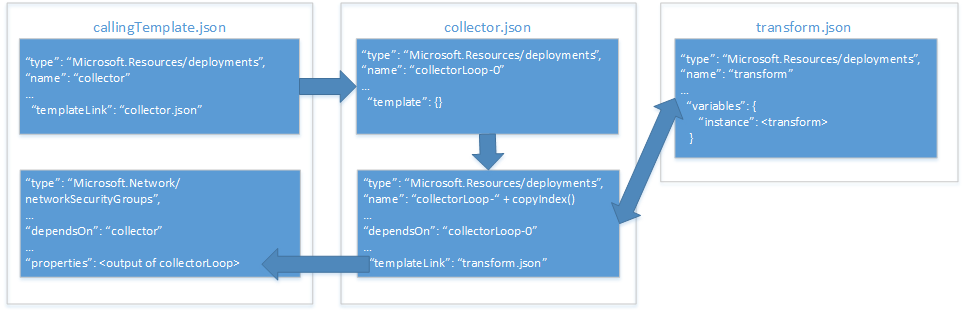

# <a name="implement-a-property-transformer-and-collector-in-an-azure-resource-manager-template"></a>Implementare un trasformatore e un agente di raccolta della proprietà in un modello di Azure Resource Manager

In [Usare un oggetto come parametro in un modello di Azure Resource Manager][objects-as-parameters] si è appreso come archiviare i valori della proprietà della risorsa in un oggetto e applicarli a una risorsa durante la distribuzione. Sebbene questa operazione sia molto utile per gestire i parametri, richiede tuttavia la mappatura delle proprietà dell'oggetto rispetto alle proprietà della risorse ogni volta che la si usa nel modello.

Per risolvere il problema, è possibile implementare un modello di trasformazione e dell'agente di raccolta della proprietà che esegue l'iterazione della matrice dell'oggetto e la trasforma nello schema JSON previsto dalla risorsa.

> [!IMPORTANT]
> Per attuare questo approccio è necessario conoscere approfonditamente i modelli e le funzioni di Resource Manager.

Viene ora illustrato come implementare un agente di raccolta e un trasformatore della proprietà con un esempio che consente di distribuire un [gruppo di sicurezza di rete][nsg]. Il diagramma seguente mostra la relazione tra i modelli e le risorse all'interno di questi modelli:



Il **modello di chiamata** include due risorse:
* un collegamento del modello che richiama il **modello dell'agente di raccolta**;
* la risorsa NSG da distribuire.

Il **modello dell'agente di raccolta** include due risorse:
* una risorsa di **ancoraggio**;
* un collegamento del modello che richiama il modello di trasformazione in un ciclo di copia.

Il **modello di trasformazione** include una sola risorsa: un modello vuoto con una variabile che trasforma il JSON `source` nello schema JSON previsto dalla risorsa NSG nel **modello principale**.

## <a name="parameter-object"></a>Oggetto parametro

Verrà usato l'oggetto parametro `securityRules` di [oggetti come parametri][objects-as-parameters]. Il **modello di trasformazione** trasformerà ogni oggetto della matrice `securityRules` nello schema JSON previsto per la risorsa NSG nel **modello di chiamata**.

```json
{
    "$schema": "https://schema.management.azure.com/schemas/2015-01-01/deploymentParameters.json#",
    "contentVersion": "1.0.0.0",
    "parameters":{ 
      "networkSecurityGroupsSettings": {
      "value": {
          "securityRules": [
            {
              "name": "RDPAllow",
              "description": "allow RDP connections",
              "direction": "Inbound",
              "priority": 100,
              "sourceAddressPrefix": "*",
              "destinationAddressPrefix": "10.0.0.0/24",
              "sourcePortRange": "*",
              "destinationPortRange": "3389",
              "access": "Allow",
              "protocol": "Tcp"
            },
            {
              "name": "HTTPAllow",
              "description": "allow HTTP connections",
              "direction": "Inbound",
              "priority": 200,
              "sourceAddressPrefix": "*",
              "destinationAddressPrefix": "10.0.1.0/24",
              "sourcePortRange": "*",
              "destinationPortRange": "80",
              "access": "Allow",
              "protocol": "Tcp"
            }
          ]
        }
      }
    }
  }
```

Prima di tutto viene esaminato il **modello di trasformazione**.

## <a name="transform-template"></a>Modello di trasformazione

Il **modello di trasformazione** include due parametri che vengono passati dal **modello dell'agente di raccolta**: 
* `source` è un oggetto che riceve uno degli oggetti valore della proprietà dalla matrice della proprietà. In questo esempio, gli oggetti della matrice `"securityRules"` verranno passati uno alla volta.
* `state` è una matrice che riceve i risultati concatenati di tutte le trasformazioni precedenti. Questa è la raccolta di JSON trasformati.

I parametri sono simili ai seguenti:

```json
{
  "$schema": "http://schema.management.azure.com/schemas/2015-01-01/deploymentTemplate.json#",
  "contentVersion": "1.0.0.0",
  "parameters": {
    "source": { "type": "object" },
    "state": {
      "type": "array",
      "defaultValue": [ ]
    }
  },
```

Il modello definisce anche una variabile denominata `instance`. Esegue la trasformazione effettiva dell'oggetto `source` nello schema JSON richiesto:

```json
  "variables": {
    "instance": [
      {
        "name": "[parameters('source').name]",
        "properties":{
            "description": "[parameters('source').description]",
            "protocol": "[parameters('source').protocol]",
            "sourcePortRange": "[parameters('source').sourcePortRange]",
            "destinationPortRange": "[parameters('source').destinationPortRange]",
            "sourceAddressPrefix": "[parameters('source').sourceAddressPrefix]",
            "destinationAddressPrefix": "[parameters('source').destinationAddressPrefix]",
            "access": "[parameters('source').access]",
            "priority": "[parameters('source').priority]",
            "direction": "[parameters('source').direction]"            
        }
      }
    ]

  },
```

Infine, `output` di questo modello consente di concatenare le trasformazioni raccolte del parametro `state` con la trasformazione corrente eseguita dalla variabile `instance`:

```json
  "outputs": {
    "collection": {
      "type": "array",
      "value": "[concat(parameters('state'), variables('instance'))]"
    }
```

Successivamente, viene esaminato il **modello dell'agente di raccolta** per vedere come passa i valori nel parametro.

## <a name="collector-template"></a>Modello dell'agente di raccolta

Il **modello dell'agente di raccolta** include tre parametri:
* `source` è la matrice completa dell'oggetto parametro. Viene passata dal **modello di chiamata**. Ha lo stesso nome del parametro `source` nel **modello di trasformazione**, ma c'è una differenza fondamentale che probabilmente l'utente avrà già notato: è la matrice completa, ma solo un elemento alla volta della matrice viene passato al **modello di trasformazione**.
* `transformTemplateUri` è l'URI del **modello di trasformazione**. In questa sede viene definito come parametro per il riutilizzo del modello.
* `state` è una matrice inizialmente vuota che viene passata al **modello di trasformazione**. Archivia la raccolta di oggetti parametro trasformati quando il ciclo di copia è stato completato.

I parametri sono simili ai seguenti:

```json
  "parameters": {
    "source": { "type": "array" },
    "transformTemplateUri": { "type": "string" },
    "state": {
      "type": "array",
      "defaultValue": [ ]
    }
``` 

Successivamente, viene definita una variabile denominata `count`. Il suo valore è la lunghezza della matrice dell'oggetto parametro `source`:

```json
  "variables": {
    "count": "[length(parameters('source'))]"
  },
```

Come si può immaginare, viene usata per il numero di iterazioni nel ciclo di copia.

Osservare ora le risorse. Si definiscono due risorse:
* `loop-0` è la risorsa in base zero per il ciclo di copia.
* `loop-` è concatenata al risultato della funzione `copyIndex(1)` per generare un nome univoco basato sull'iterazione per la risorsa, che inizia con `1`.

Le risorse sono simili a quanto segue:

```json
  "resources": [
    {
      "type": "Microsoft.Resources/deployments",
      "apiVersion": "2015-01-01",
      "name": "loop-0",
      "properties": {
        "mode": "Incremental",
        "parameters": { },
        "template": {
          "$schema": "http://schema.management.azure.com/schemas/2015-01-01/deploymentTemplate.json#",
          "contentVersion": "1.0.0.0",
          "parameters": { },
          "variables": { },
          "resources": [ ],
          "outputs": {
            "collection": {
              "type": "array",
              "value": "[parameters('state')]"
            }
          }
        }
      }
    },
    {
      "type": "Microsoft.Resources/deployments",
      "apiVersion": "2015-01-01",
      "name": "[concat('loop-', copyindex(1))]",
      "copy": {
        "name": "iterator",
        "count": "[variables('count')]",
        "mode": "serial"
      },
      "dependsOn": [
        "loop-0"
      ],
      "properties": {
        "mode": "Incremental",
        "templateLink": { "uri": "[parameters('transformTemplateUri')]" },
        "parameters": {
          "source": { "value": "[parameters('source')[copyindex()]]" },
          "state": { "value": "[reference(concat('loop-', copyindex())).outputs.collection.value]" }
        }
      }
    }
  ],
```

Vengono adesso descritti dettagliatamente i parametri passati al **modello di trasformazione** nel modello annidato. Come indicato in precedenza, il parametro `source` passa l'oggetto corrente nella matrice dell'oggetto parametro `source`. Nel parametro `state` viene eseguita la raccolta, in quanto prende l'output dell'iterazione del ciclo copia precedente&mdash;si noti che la funzione `reference()` usa la funzione `copyIndex()` senza parametri per fare riferimento a `name` dell'oggetto modello collegato precedente&mdash;e lo passa all'iterazione corrente.

Infine, `output` del modello restituisce `output` dell'ultima iterazione del **modello di trasformazione**:

```json
  "outputs": {
    "result": {
      "type": "array",
      "value": "[reference(concat('loop-', variables('count'))).outputs.collection.value]"
    }
  }
```
Potrebbe sembrare illogico restituire `output` dell'ultima iterazione del **modello di trasformazione** al **modello di chiamata** perché sembrava che venisse archiviato nel parametro `source`. Tenere tuttavia presente che l'ultima iterazione del **modello di trasformazione** contiene la matrice completa degli oggetti proprietà trasformati e il risultato che si desidera restituire.

Infine, è opportuno esaminare come chiamare il **modello dell'agente di raccolta** dal **modello di chiamata**.

## <a name="calling-template"></a>Modello di chiamata

Il **modello di chiamata** definisce un solo parametro denominato `networkSecurityGroupsSettings`:

```json
...
"parameters": {
    "networkSecurityGroupsSettings": {
        "type": "object"
    }
```

Successivamente, il modello definisce una sola variabile denominata `collectorTemplateUri`:

```json
"variables": {
    "collectorTemplateUri": "[uri(deployment().properties.templateLink.uri, 'collector.template.json')]"
  }
```

Come previsto, si tratta dell'URI per il **modello dell'agente di raccolta** che verrà usato dalla risorsa del modello collegato:

```json
{
    "apiVersion": "2015-01-01",
    "name": "collector",
    "type": "Microsoft.Resources/deployments",
    "properties": {
        "mode": "Incremental",
        "templateLink": {
            "uri": "[variables('linkedTemplateUri')]",
            "contentVersion": "1.0.0.0"
        },
        "parameters": {
            "source" : {"value": "[parameters('networkSecurityGroupsSettings').securityRules]"},
            "transformTemplateUri": { "value": "[uri(deployment().properties.templateLink.uri, 'transform.json')]"}
        }
    }
}
```

Vengono passati due parametri al **modello dell'agente di raccolta**:
* `source` è la matrice dell'oggetto proprietà. In questo esempio è il parametro `networkSecurityGroupsSettings`.
* `transformTemplateUri` è la variabile definita con l'URI del **modello dell'agente di raccolta**.

Infine, la risorsa `Microsoft.Network/networkSecurityGroups` assegna direttamente `output` del modello collegato `collector` alla proprietà `securityRules`:

```json
    {
      "apiVersion": "2015-06-15",
      "type": "Microsoft.Network/networkSecurityGroups",
      "name": "networkSecurityGroup1",
      "location": "[resourceGroup().location]",
      "properties": {
        "securityRules": "[reference('firstResource').outputs.result.value]"
      }
    }
  ],
  "outputs": {
      "instance":{
          "type": "array",
          "value": "[reference('firstResource').outputs.result.value]"
      }

  }
```

## <a name="next-steps"></a>Passaggi successivi

* Queste tecniche sono implementate nel [progetto dei blocchi predefiniti del modello](https://github.com/mspnp/template-building-blocks) e nelle [architetture di riferimento di Azure](/azure/architecture/reference-architectures/). È possibile usarle per creare la propria architettura o distribuire un'architettura di riferimento.

<!-- links -->
[objects-as-parameters]: ./objects-as-parameters.md
[resource-manager-linked-template]: /azure/azure-resource-manager/resource-group-linked-templates
[resource-manager-variables]: /azure/azure-resource-manager/resource-group-template-functions-deployment
[nsg]: /azure/virtual-network/virtual-networks-nsg
