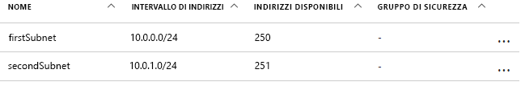
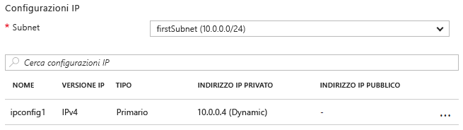

# <a name="update-a-resource-in-an-azure-resource-manager-template"></a>Aggiornare una risorsa in un modello di Azure Resource Manager

Esistono alcuni scenari in cui è necessario aggiornare una risorsa durante una distribuzione. Questo scenario si potrebbe verificare quando non è possibile specificare tutte le proprietà per una risorsa finché non vengono create altre risorse dipendenti. Ad esempio, se si crea un pool di back-end per un bilanciamento del carico, si potrebbero aggiornare le interfacce di rete (NIC) nelle macchine virtuali (VM) per includerle nel pool di back-end. Sebbene Gestione risorse supporti l'aggiornamento delle risorse durante la distribuzione, è necessario progettare il modello in modo corretto per evitare errori e verificare che la distribuzione venga gestita come un aggiornamento.

In primo luogo, è necessario fare riferimento alla risorsa quando si trova nel modello per crearla, successivamente è necessario fare riferimento alla risorsa con lo stesso nome per aggiornarla in un secondo momento. Tuttavia, se due risorse hanno lo stesso nome in un modello, Resource Manager genera un'eccezione. Per evitare questo errore, specificare la risorsa aggiornata in un secondo modello che è collegato o incluso come sotto-modello usando il tipo di risorsa `Microsoft.Resources/deployments`.

In seguito specificare il nome della proprietà esistente da modificare o un nuovo nome per una proprietà da aggiungere nel modello annidato. È anche necessario specificare anche le proprietà originali e i relativi valori originali. Se non si riesce a specificare le proprietà e i valori originali, Gestione risorse presuppone che si desideri creare una nuova risorsa ed elimina la risorsa originale.

## <a name="example-template"></a>Modello di esempio

Viene ora illustrato un modello di esempio che illustra questa operazione. Il modello distribuisce una rete virtuale denominata `firstVNet` che include una subnet denominata `firstSubnet`. Distribuisce quindi un'interfaccia di rete virtuale denominata `nic1` e la associa alla subnet. Quindi, una risorsa di distribuzione denominata `updateVNet` include un modello annidato che aggiorna la risorsa `firstVNet` mediante l'aggiunta di una seconda subnet denominata `secondSubnet`.

```json
{
  "$schema": "https://schema.management.azure.com/schemas/2015-01-01/deploymentTemplate.json#",
  "contentVersion": "1.0.0.0",
  "parameters": {},
  "resources": [
      {
      "apiVersion": "2016-03-30",
      "name": "firstVNet",
      "location":"[resourceGroup().location]",
      "type": "Microsoft.Network/virtualNetworks",
      "properties": {
          "addressSpace":{"addressPrefixes": [
              "10.0.0.0/22"
          ]},
          "subnets":[
              {
                  "name":"firstSubnet",
                  "properties":{
                    "addressPrefix":"10.0.0.0/24"
                  }
              }
            ]
      }
    },
    {
        "apiVersion": "2015-06-15",
        "type":"Microsoft.Network/networkInterfaces",
        "name":"nic1",
        "location":"[resourceGroup().location]",
        "dependsOn": [
            "firstVNet"
        ],
        "properties": {
            "ipConfigurations":[
                {
                    "name":"ipconfig1",
                    "properties": {
                        "privateIPAllocationMethod":"Dynamic",
                        "subnet": {
                            "id": "[concat(resourceId('Microsoft.Network/virtualNetworks','firstVNet'),'/subnets/firstSubnet')]"
                        }
                    }
                }
            ]
        }
    },
    {
      "apiVersion": "2015-01-01",
      "type": "Microsoft.Resources/deployments",
      "name": "updateVNet",
      "dependsOn": [
          "nic1"
      ],
      "properties": {
        "mode": "Incremental",
        "parameters": {},
        "template": {
          "$schema": "https://schema.management.azure.com/schemas/2015-01-01/deploymentTemplate.json#",
          "contentVersion": "1.0.0.0",
          "parameters": {},
          "variables": {},
          "resources": [
              {
                  "apiVersion": "2016-03-30",
                  "name": "firstVNet",
                  "location":"[resourceGroup().location]",
                  "type": "Microsoft.Network/virtualNetworks",
                  "properties": {
                      "addressSpace": "[reference('firstVNet').addressSpace]",
                      "subnets":[
                          {
                              "name":"[reference('firstVNet').subnets[0].name]",
                              "properties":{
                                  "addressPrefix":"[reference('firstVNet').subnets[0].properties.addressPrefix]"
                                  }
                          },
                          {
                              "name":"secondSubnet",
                              "properties":{
                                  "addressPrefix":"10.0.1.0/24"
                                  }
                          }
                     ]
                  }
              }
          ],
          "outputs": {}
          }
        }
    }
  ],
  "outputs": {}
}
```

Osservare innanzitutto l'oggetto risorsa per la risorsa `firstVNet`. Si noti che vengono specificate nuovamente le impostazioni per `firstVNet` in un modello annidato &mdash; perché Gestione risorse non consente lo stesso nome di distribuzione nello stesso modello e i modelli annidati sono considerati come modelli diversi. Specificando di nuovo i valori per la risorsa `firstSubnet`, si richiede a Gestione risorse l'aggiornamento della risorsa esistente invece dell'eliminazione e della ridistribuzione. Infine, le nuove impostazioni per `secondSubnet` vengono prelevate durante l'aggiornamento.

## <a name="try-the-template"></a>Provare il modello

Un modello di esempio è disponibile in [GitHub][github]. Per distribuire il modello, eseguire questi comandi dell'[interfaccia della riga di comando di Azure][cli]:

```bash
az group create --location <location> --name <resource-group-name>
az group deployment create -g <resource-group-name> \
    --template-uri https://raw.githubusercontent.com/mspnp/template-examples/master/example1-update/deploy.json
```

Al termine della distribuzione, aprire il gruppo di risorse specificato nel portale. Viene visualizzata una rete virtuale denominata `firstVNet` e una scheda di interfaccia di rete denominata `nic1`. Fare clic su `firstVNet`, quindi fare clic su `subnets`. Viene visualizzato il `firstSubnet` che è stato originariamente creato e viene visualizzato il `secondSubnet` che è stato aggiunto nella risorsa `updateVNet`.



Quindi, tornare al gruppo di risorse, fare clic su `nic1` e quindi fare clic su `IP configurations`. Nella sezione `IP configurations` il `subnet` è impostato su `firstSubnet (10.0.0.0/24)`.



L'originale `firstVNet` è stato aggiornato anziché ricreato. Se `firstVNet` era stato ricreato, `nic1` potrebbe non essere associato a `firstVNet`.

## <a name="next-steps"></a>Passaggi successivi

* Informazioni su come distribuire una risorsa in base a una condizione, come ad esempio la presenza o meno del valore di un parametro. Vedere [Distribuire in modo condizionale una risorsa in un modello di Azure Resource Manager](./conditional-deploy.md).

[cli]: /cli/azure/?view=azure-cli-latest
[github]: https://github.com/mspnp/template-examples
