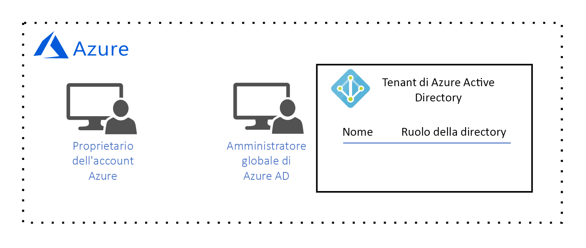
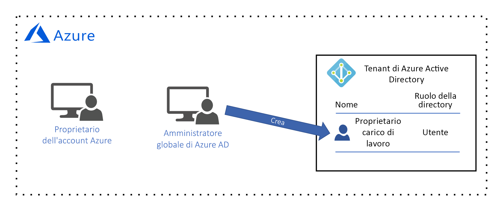
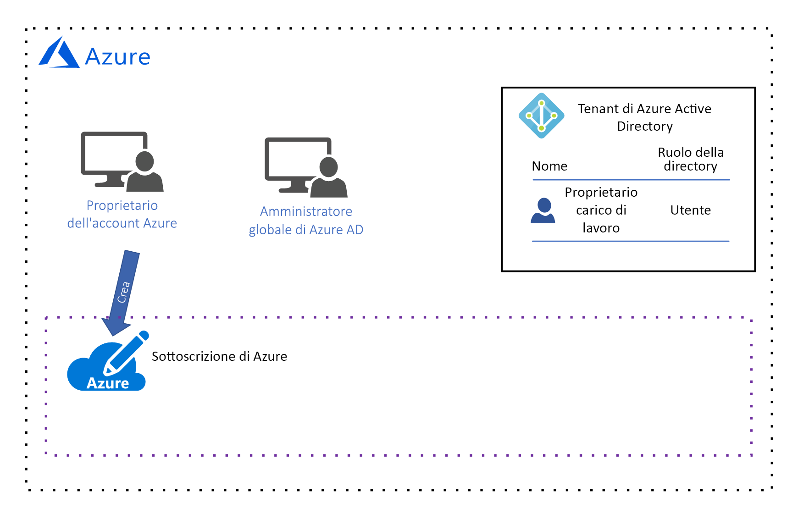
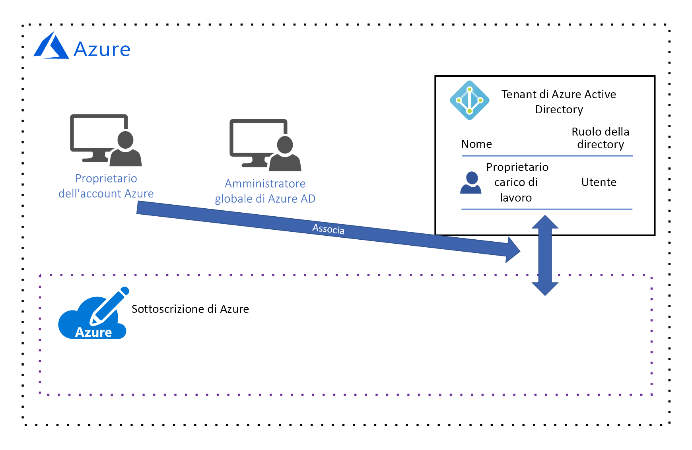
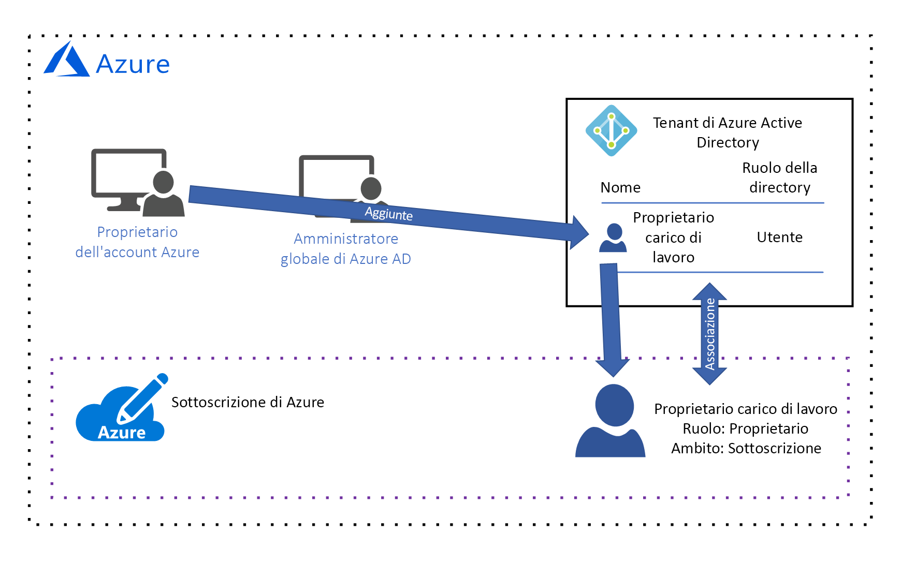
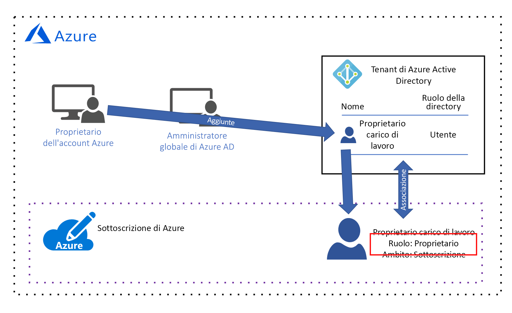
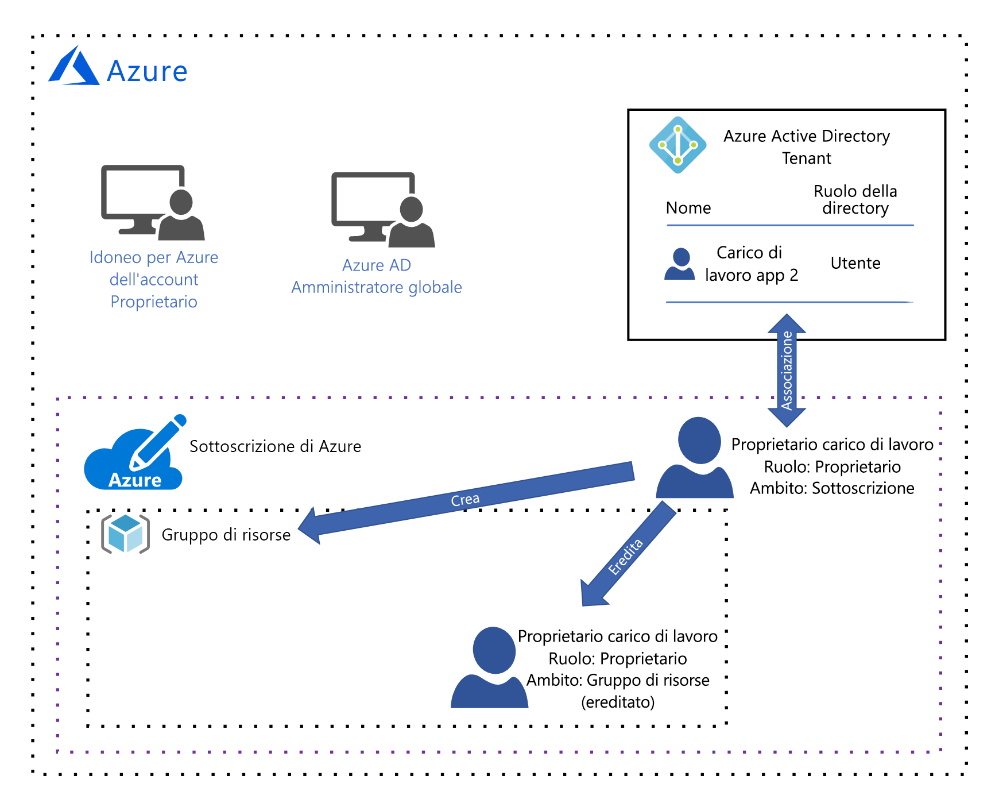
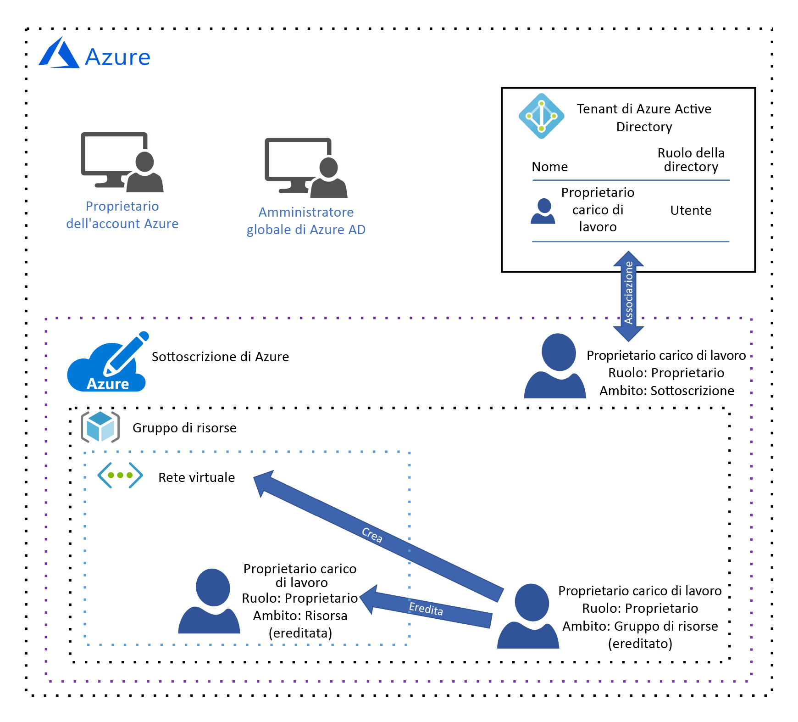

# Guida alla progettazione della governance di AzureAzure governance design guide

Il destinatario di questa guida alla progettazione è il responsabile dell'*IT centrale* dell'organizzazione.The audience for this design guide is the *central IT* persona in your organization. L'*IT centrale* è responsabile della progettazione e dell'implementazione dell'architettura di governance cloud dell'organizzazione.*Central IT* is responsible for designing and implementing your organization's cloud governance architecture. Come si è appreso in [Informazioni sulla governance delle risorse cloud](governance-explainer.md), per governance si intende il processo continuativo di gestione, monitoraggio e controllo dell'uso delle risorse di Azure per soddisfare gli obiettivi e i requisiti dell'organizzazione.As you learned in the [what is cloud resource governance?](governance-explainer.md) explainer, governance refers to the ongoing process of managing, monitoring, and auditing the use of Azure resources to meet the goals and requirements of your organization.

L'obiettivo di questa guida è apprendere il processo di progettazione dell'architettura di governance dell'organizzazione esaminando una serie di ipotetici obiettivi e requisiti di governance.The goal of this guidance is to help you learn the process of designing your organization's governance architecture by looking at a set of hypothetical governance goals and requirements. Verrà quindi illustrato come configurare gli strumenti di governance di Azure per conseguire gli obiettivi e soddisfare i requisiti.Then, we'll discuss how to configure Azure's governance tools to meet them. 

Nella fase di adozione iniziale, l'obiettivo è distribuire un carico di lavoro semplice in Azure.In the foundational adoption stage, our goal is to deploy a simple workload to Azure. Ne derivano i requisiti seguenti:This results in the following requirements:
* Gestione delle identità per un singolo **proprietario del carico di lavoro** responsabile della distribuzione e della gestione del carico di lavoro semplice.Identity management for a single **workload owner** who is responsible for deploying and maintaining the simple workload. Il proprietario del carico di lavoro necessita di autorizzazioni per creare, leggere, aggiornare ed eliminare risorse, nonché dell'autorizzazione a delegare questi diritti ad altri utenti nel sistema di gestione delle identità.The workload owner requires permission to create, read, update, and delete resources as well as permission to delegate these rights to other users in the identity management system.
* Gestire tutte le risorse per il carico di lavoro semplice come un'unica unità di gestione.Manage all resources for the simple workload as a single management unit.

## Licenze di AzureLicensing Azure

Prima di iniziare a progettare il modello di governance, è importante capire come avviene la concessione in licenza di Azure,Before we begin designing our governance model, it's important to understand how Azure is licensed. perché gli account amministrativi associati alla licenza di Azure hanno il massimo livello di accesso a tutte le risorse di Azure.This is because the administrative accounts associated with your Azure license have the highest level of access to all of your Azure resources. Questi account amministrativi costituiscono la base del modello di governance.These administrative accounts form the basis of your governance model.  

> [!NOTE]
> Se l'organizzazione ha già un [Contratto Enterprise Microsoft](https://www.microsoft.com/en-us/licensing/licensing-programs/enterprise.aspx) che non include Azure, è possibile aggiungere Azure assumendo un impegno monetario iniziale.If your organization has an existing [Microsoft Enterprise Agreement](https://www.microsoft.com/en-us/licensing/licensing-programs/enterprise.aspx) that does not include Azure, Azure can be added by making an upfront monetary commitment. Per altre informazioni, vedere [Licenze di Azure per l'azienda](https://azure.microsoft.com/pricing/enterprise-agreement/).See [licensing Azure for the enterprise](https://azure.microsoft.com/pricing/enterprise-agreement/) for more information. 

Quando Azure è stato aggiunto al Contratto Enterprise Microsoft, all'organizzazione è stato chiesto di creare un **account Azure**.When Azure added to your organization's Enterprise Agreement, your organization was prompted to create an **Azure account**. Durante il processo di creazione dell'account, sono stati creati un **proprietario dell'account Azure** e un tenant di Azure Active Directory (Azure AD) con un account di **amministratore globale**.During the account creation process, an **Azure account owner** was created, as well as an Azure Active Directory (Azure AD) tenant with a **global administrator** account. Un tenant di Azure AD è un costrutto logico che rappresenta un'istanza sicura e dedicata di Azure AD.An Azure AD tenant is a logical construct that represents a secure, dedicated instance of Azure AD.

*Figura 1. Un account Azure con un proprietario dell'account e un amministratore globale di Azure AD.*
*Figure 1. An Azure account with an Account Manager and Azure AD Global Administrator.*

## Gestione delle identitàIdentity management

Azure considera attendibile solo [Azure AD](/azure/active-directory) per autenticare gli utenti e autorizzare l'accesso degli utenti alle risorse, quindi Azure AD è il sistema di gestione delle identità.Azure only trusts [Azure AD](/azure/active-directory) to authenticate users and authorize user access to resources, so Azure AD is our identity management system. L'amministratore globale di Azure AD ha il livello massimo di autorizzazioni e può eseguire tutte le azioni relative all'identità, incluse la creazione di utenti e l'assegnazione di autorizzazioni.The Azure AD global administrator has the highest level of permissions and can perform all actions related to identity, including creating users and assigning permissions. 

Il requisito è la gestione delle identità per un singolo **proprietario del carico di lavoro** responsabile della distribuzione e della gestione del carico di lavoro semplice.Our requirement is identity management for a single **workload owner** who is responsible for deploying and maintaining the simple workload. Il proprietario del carico di lavoro necessita di autorizzazioni per creare, leggere, aggiornare ed eliminare risorse, nonché dell'autorizzazione a delegare questi diritti ad altri utenti nel sistema di gestione delle identità.The workload owner requires permission to create, read, update, and delete resources as well as permission to delegate these rights to other users in the identity management system.

L'amministratore globale di Azure AD creerà l'account del **proprietario del carico di lavoro** per il **proprietario del carico di lavoro**:Our Azure AD global administrator will create the **workload owner** account for the **workload owner**:

*Figura 2. L'amministratore globale di Azure AD crea l'account utente del proprietario del carico di lavoro.*
*Figure 2. The Azure AD global administrator creates the workload owner user account.*

Non è possibile assegnare autorizzazioni di accesso alle risorse fino a quando questo utente non viene aggiunto a una **sottoscrizione**, quindi questa operazione verrà eseguita nelle prossime due sezioni.We aren't able to assign resource access permission until this user is added to a **subscription**, so we'll do that in the next two sections. 

## Ambito di gestione delle risorseResource management scope

Con l'aumento del numero di risorse distribuite dall'organizzazione, cresce anche la complessità della governance di tali risorse.As the number of resources deployed by your organization grows, the complexity of governing those resources grows as well. Azure implementa una gerarchia di contenitori logica per consentire all'organizzazione di gestire le risorse in gruppi a vari livelli di granularità, noti anche come **ambito**.Azure implements a logical container hierarchy to enable your organization to manage your resources in groups at various levels of granularity, also known as **scope**. 

Il livello massimo dell'ambito di gestione delle risorse è il livello **sottoscrizione**.The top level of resource management scope is the **subscription** level. La sottoscrizione viene creata dal **proprietario dell'account** Azure, che stabilisce l'impegno finanziario ed è responsabile del pagamento di tutte le risorse di Azure associate alla sottoscrizione:A subscription is created by the Azure **account owner**, who establishes the financial commitment and is responsible for paying for all Azure resources associated with the subscription:

*Figura 3. Il proprietario dell'account Azure crea una sottoscrizione.*
*Figure 3. The Azure account owner creates a subscription.*

Quando viene creata la sottoscrizione, il **proprietario dell'account Azure** associa alla sottoscrizione un tenant di Azure AD che viene usato per l'autenticazione e l'autorizzazione degli utenti:When the subscription is created, the Azure **account owner** associates an Azure AD tenant with the subscription, and this Azure AD tenant is used for authenticating and authorizing users:

*Figura 4. Il proprietario dell'account Azure associa il tenant di Azure AD alla sottoscrizione.*
*Figure 4. The Azure account owner associates the Azure AD tenant with the subscription.*

Si sarà notato che attualmente non c'è alcun utente associato alla sottoscrizione; ciò significa che nessuno è autorizzato a gestire le risorse.You may have noticed that there is currently no user associated with the subscription, which means that no one has permission to manage resources. In realtà, il **proprietario dell'account** è il proprietario della sottoscrizione ed è autorizzato a eseguire qualsiasi azione su una risorsa della sottoscrizione.In reality, the **account owner** is the owner of the subscription and has permission to take any action on a resource in the subscription. In termini pratici, il **proprietario dell'account** sarà tuttavia molto probabilmente un responsabile della divisione finanziaria dell'organizzazione e non si occuperà delle operazioni di creazione, lettura, aggiornamento ed eliminazione delle risorse; tali attività saranno svolte dal **proprietario del carico di lavoro**.However, in practical terms the **account owner** is more than likely a finance person in your organization and is not responsible for creating, reading, updating, and deleting resources - those tasks will be performed by the **workload owner**. È quindi necessario aggiungere il **proprietario del carico di lavoro** alla sottoscrizione e assegnare le autorizzazioni.Therefore, we need to add the **workload owner** to the subscription and assign permissions.

Essendo l'unico utente attualmente autorizzato ad aggiungere il **proprietario del carico di lavoro** alla sottoscrizione, il **proprietario dell'account** aggiungerà il **proprietario del carico di lavoro** alla sottoscrizione:Since the **account owner** is currently the only user with permission to add the **workload owner** to the subscription, they add the **workload owner** to the subscription:

*Figura 5. Il proprietario dell'account Azure aggiunge il proprietario del carico di lavoro alla sottoscrizione.*
*Figure 5. The Azure account owner adds the workload owner to the subscription.*

Il **proprietario dell'account** Azure concede le autorizzazioni al **proprietario del carico di lavoro** assegnando un [ruolo di controllo degli accessi in base al ruolo](/azure/role-based-access-control/).The Azure **account owner** grants permissions to the **workload owner** by assigning a [role-based access control (RBAC)](/azure/role-based-access-control/) role. Il ruolo di controllo degli accessi in base al ruolo specifica un insieme di autorizzazioni assegnate al **proprietario del carico di lavoro** per un singolo tipo di risorsa o un insieme di tipi di risorsa.The RBAC role specifies a set of permissions that the **workload owner** has for an individual resource type or a set of resource types.

Si noti che in questo esempio il **proprietario dell'account** ha assegnato il ruolo di [proprietario **predefinito**](/azure/role-based-access-control/built-in-roles#owner):Notice that in this example, the **account owner** has assigned the [built-in **owner** role](/azure/role-based-access-control/built-in-roles#owner): 

*Figura 6. Al proprietario del carico di lavoro è stato assegnato il ruolo di proprietario predefinito.*
*Figure 6. The workload owner was assigned the built-in owner role.*

Il ruolo di **proprietario** predefinito concede tutte le autorizzazioni al **proprietario del carico di lavoro** nell'ambito della sottoscrizione.The built-in **owner** role grants all permissions to the **workload owner** at the subscription scope. 

> [!IMPORTANT]
> Il **proprietario dell'account** Azure è responsabile dell'impegno finanziario associato alla sottoscrizione, ma il **proprietario del carico di lavoro** ha le stesse autorizzazioni.The Azure **acount owner** is responsible for the financial committment associated with the subscription, but the **workload owner** has the same permissions. Il **proprietario dell'account** deve considerare il **proprietario del carico di lavoro** affidabile per la distribuzione delle risorse che rientrano nel budget della sottoscrizione.The **account owner** must trust the **workload owner** to deploy resources that are within the subscription budget.

Il livello successivo dell'ambito di gestione è il livello **risorsa di gruppo**.The next level of management scope is the **resource group** level. Un gruppo di risorse è un contenitore logico per le risorse.A resource group is a logical container for resources. Le operazioni a livello di gruppo di risorse si applicano a tutte le risorse di un gruppo.Operations applied at the resource group level apply to all resources in a group. È anche importante notare che le autorizzazioni per ogni utente vengono ereditate dal livello superiore successivo, a meno che non vengano esplicitamente modificate in quell'ambito.Also, it's important to note that permissions for each user are inherited from the next level up unless they are explicitly changed at that scope. 

Per spiegare questo concetto, di seguito è illustrato cosa accade quando il **proprietario del carico di lavoro** crea un gruppo di risorse:To illustrate this, let's look at what happens when the **workload owner** creates a resource group:

*Figura 7. Il proprietario del carico di lavoro crea un gruppo di risorse ed eredita il ruolo di proprietario predefinito nell'ambito del gruppo di risorse.*
*Figure 7. The workload owner creates a resource group and inherits the built-in owner role at the resource group scope.*

Il ruolo di **proprietario** predefinito concede tutte le autorizzazioni al **proprietario del carico di lavoro** nell'ambito del gruppo di risorse.Again, the built-in **owner** role grants all permissions to the **workload owner** at the resource group scope. Come accennato in precedenza, questo ruolo viene ereditato dal livello di sottoscrizione.As we discussed earlier, this role is inherited from the subscription level. Se a questo utente è assegnato un ruolo diverso in questo ambito, questo ruolo sarà applicabile solo a questo ambito.If a different role is assigned to this user at this scope, it applies to this scope only.

Il livello più basso dell'ambito di gestione è il livello **risorsa**.The lowest level of management scope is at the **resource** level. Le operazioni a livello di risorsa si applicano solo alla risorsa stessa.Operations applied at the resource level apply only to the resource itself. Le autorizzazioni a livello di risorsa vengono ereditate dall'ambito del gruppo di risorse.And once again, permissions at the resource level are inherited from resource group scope. Se ad esempio il **proprietario del carico di lavoro** distribuisce una [rete virtuale](/azure/virtual-network/virtual-networks-overview) nel gruppo di risorse:For example, let's look at what happens if the **workload owner** deploys a [virtual network](/azure/virtual-network/virtual-networks-overview) into the resource group:

*Figura 8. Il proprietario del carico di lavoro crea una risorsa ed eredita il ruolo di proprietario predefinito nell'ambito della risorsa.*
*Figure 8. The workload owner creates a resource and inherits the built-in owner role at the resource scope.*

Il **proprietario del carico di lavoro** eredita il ruolo di proprietario nell'ambito della risorsa, ovvero ha tutte le autorizzazioni per la rete virtuale.The **workload owner** inherits the owner role at the resource scope, which means the workload owner has all permissions for the virtual network. 

## SummarySummary

In questo articolo si è appreso quanto segue:In this article, you learned:

* Azure considera attendibile solo Azure AD per la gestione delle identità.Azure only trusts Azure AD for identity management.
* Una sottoscrizione ha l'ambito più elevato di gestione delle risorse e ogni sottoscrizione è associata a un tenant di Azure AD.A subscription has the highest scope of resource management, and each subscription is associated with an Azure AD tenant. Solo gli utenti del tenant di Azure AD associato possono accedere alle risorse della sottoscrizione.Only users in the associated Azure AD tenant can access resources in the subscription.
* Esistono tre livelli di ambito di gestione delle risorse: sottoscrizione, gruppo di risorse e risorsa.There are three levels of resource management scope: subscription, resource group, and resource. Le autorizzazioni vengono assegnate a ogni ambito tramite i ruoli di controllo degli accessi in base al ruolo.Permissions are assigned at each scope using RBAC roles. I ruoli di controllo degli accessi in base al ruolo vengono ereditati dall'ambito superiore all'ambito inferiore.RBAC roles are inherited from higher scope to lower scope.

## Passaggi successiviNext steps

Tornare alla [panoramica della fase di adozione iniziale](overview.md) per apprendere come implementare questo modello di goverance.Return to the [foundational adoption stage overview](overview.md) to learn how to implement this goverance model. Selezionare quindi un tipo di carico di lavoro e apprendere come distribuirlo.Then, select a type of workload and learn how to deploy it.