# Guida alla progettazione della governance: nuovo sviluppo in Azure per più teamGovernance design guide: new development in Azure for multiple teams

Questa guida illustra come progettare un modello di governance delle risorse in Azure.The goal of this guidance is to help you learn the process for designing a resource governance model in Azure.  Verranno esaminati alcuni ipotetici requisiti di governance, quindi verranno illustrate diverse implementazioni di esempio che soddisfano tali requisiti.We'll look at a set of hypothetical governance requirements, then go through several example implementations that satisfy those requirements. 

I requisiti sono i seguenti:Our requirements are:
* Gestione delle identità per più team con diversi requisiti di accesso alle risorse in Azure.Identity management for multiple teams with different resource access requirements in Azure. Il sistema di gestione delle identità memorizza l'identità degli utenti seguenti:The identity management system stores the identity of the following users:
  1. L'utente dell'organizzazione responsabile della proprietà delle **sottoscrizioni**.The individual in our organization responsible for ownership of **subscriptions**.
  2. L'utente dell'organizzazione responsabile delle **risorse dell'infrastruttura condivisa** usate per connettere la rete locale a una rete virtuale di Azure.The individual in our organization responsible for the **shared infrastructure resources** used to connect our on-premises network to an Azure virtual network. 
  3. Due utenti dell'organizzazione responsabili della gestione di un **carico di lavoro**.Two individuals in our organization responsible for managing a **workload**. 
* Supporto di più **ambienti**.Support for multiple **environments**. Come illustrato precedenza, un ambiente è un raggruppamento logico di risorse con requisiti di gestione e sicurezza simili.As you learned earlier, an environment is a logical grouping of resources with similar management and security requirements. Sono necessari tre ambienti:We require three environments:
  1. Un **ambiente di infrastruttura condivisa** che include risorse condivise dai carichi di lavoro in altri ambienti.A **shared infrastructure environment** that includes resources shared by workloads in other environments. Ad esempio, una rete virtuale con una subnet gateway che fornisce connettività all'ambiente locale.For example, a virtual network with a gateway subnet that provides connectivity to on-premises.
  2. Un **ambiente di produzione** con i criteri di sicurezza più restrittivi.A **production environment** with the most restrictive security policies. Può includere carichi di lavoro interni o rivolti all'esterno.May include internal or external facing workloads.
  3. Un **ambiente di sviluppo** per la verifica e i test.A **development environment** for proof-of-concept and testing work. Questo ambiente ha criteri di sicurezza, conformità e costi diversi da quelli dell'ambiente di produzione.This environment has security, compliance, and cost policies that differ from those in the production environment.
* Un **modello di autorizzazione con privilegi minimi** in cui gli utenti non hanno autorizzazioni predefinite.A **permissions model of least privilege** in which users have no permissions by default. Il modello deve supportare quanto segue:The model must support the following:
  * Un singolo utente attendibile nell'ambito della sottoscrizione con l'autorizzazione ad assegnare i diritti di accesso alle risorse.A single trusted user at the subscription scope with permission to assign resource access rights.
  * Per impostazione predefinita, a ogni proprietario del carico di lavoro viene negato l'accesso alle risorse.Each workload owner is denied access to resources by default. I diritti di accesso alle risorse vengono concessi esplicitamente dal singolo utente attendibile nell'ambito della sottoscrizione.Resource access rights are granted explicitly by the single trusted user at the subscription scope.
  * Accesso di gestione per le risorse dell'infrastruttura condivisa limitato al proprietario dell'infrastruttura condivisa.Management access for the shared infrastructure resources limited to the shared infrastructure owner.  
  * Accesso di gestione per ogni carico di lavoro limitato al proprietario del carico di lavoro.Management access for each workload restricted to the workload owner.
  * Uso di soli [ruoli di Controllo degli accessi in base al ruolo predefiniti][rbac-built-in-roles].Use of [built-in RBAC roles][rbac-built-in-roles] only. Nessun ruolo di Controllo degli accessi in base al ruolo personalizzato.No custom RBAC roles.
* Monitoraggio dei costi in base al nome del proprietario del carico di lavoro, all'ambiente o a entrambi.Cost tracking by workload owner name, environment, or both. 

## Gestione delle identitàIdentity management

Prima di poter progettare la gestione delle identità per il modello di governance, è importante comprendere le quattro aree principali che lo compongono:Before we can design identity management for our governance model, it's important to understand the four major areas it encompasses:

* Amministrazione: i processi e gli strumenti per la creazione, la modifica e l'eliminazione dell'identità utente.Administration: the processes and tools for creating, editing, and deleting user identity.
* Autenticazione: verifica dell'identità utente tramite la convalida di credenziali quali nome utente e password.Authentication: verifying user identity by validating credentials, such as a user name and password.
* Autorizzazione: determinare a quali risorse un utente autenticato può accedere o quali operazioni è autorizzato a eseguire.Authorization: determining which resources an authenticated user is allowed to access or what operations they have permission to perform.
* Controllo: analisi periodica di log e altre informazioni per rilevare problemi di sicurezza correlati all'identità utente.Auditing: periodically reviewing logs and other information to discover security issues related to user identity. Include l'analisi di modelli di utilizzo sospetti, l'esame periodico delle autorizzazioni dell'utente per verificare che siano corrette e altre funzioni.This includes reviewing suspicious usage patterns, periodically reviewing user permissions to verify they are accurate, and other functions.

Azure ritiene attendibile un solo servizio per l'identità, ovvero Azure Active Directory (AD).There is only one service trusted by Azure for identity, and that is Azure Active Directory (AD). Verranno aggiunti utenti ad Azure AD e questo servizio verrà usato per tutte le funzioni elencate in precedenza.We'll be adding users to Azure AD and using it for all of the functions listed above. Prima di esaminare come verrà configurato Azure AD, è importante comprendere gli account con privilegi che vengono usati per gestire l'accesso a questi servizi.But before we look at how we'll configure Azure AD, it's important to understand the privileged accounts that are used to manage access to these services.

Quando l'organizzazione ha effettuato l'iscrizione per un account di Azure, è stato assegnato almeno un **proprietario dell'account Azure** ed è stato creato un **tenant** di Azure AD, se non era già presente uno associato all'uso di altri servizi Microsoft da parte dell'organizzazione, ad esempio Office 365.When your organization signed up for an Azure account, at least one Azure **account owner** was assigned and an Azure AD **tenant** was created if there was not already an Azure AD tenant associated with your organization's use of other Microsoft services such as Office 365. Un **amministratore globale**  con autorizzazioni complete per il tenant di Azure AD è stato associato al momento della creazione.A **global administrator** with full permissions on the Azure AD tenant was associated when it was created. 

Sia il proprietario dell'account Azure che l'amministratore globale di Azure AD sono archiviati in un sistema di identità altamente sicuro gestito da Microsoft.Both of the Azure Account Owner and Azure AD global administrator user identities are stored in a highly secure identity system that is managed by Microsoft. Il proprietario dell'account Azure è autorizzato a creare, aggiornare ed eliminare sottoscrizioni.The Azure Account Owner is authorized to create, update, and delete subscriptions. L'amministratore globale di Azure AD è autorizzato a eseguire molte azioni in Azure AD, ma questa guida alla progettazione si concentrerà sulla creazione e sull'eliminazione dell'identità utente.The Azure AD global administrator is authorized to perform many actions in Azure AD, but for this design guide we'll focus on the creation and deletion of user identity. 

> [!NOTE]
> L'organizzazione potrebbe già avere un tenant di Azure AD se all'account è associata una licenza Office 365 o Intune esistente.Your organization may already have an existing Azure AD tenant if there's an existing Office 365 or Intune license associated with your account.

Il proprietario dell'account Azure è autorizzato a creare, aggiornare ed eliminare sottoscrizioni:The Azure Account Owner has permission to create, update, and delete subscriptions: 

*Figura 1. Un account Azure con un proprietario dell'account e un amministratore globale di Azure AD.*
*Figure 1. An Azure account with an Account Manager and Azure AD Global Administrator.*

L'amministratore globale di **Azure AD** è autorizzato a creare account utente:The Azure AD **global administrator** has permission to create user accounts:  

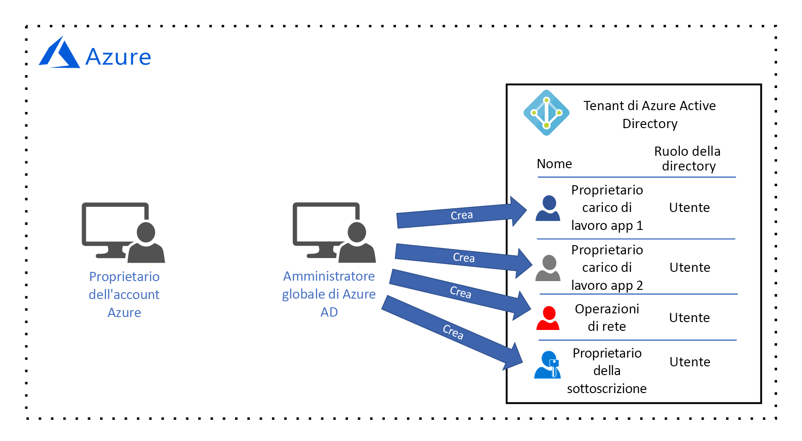
*Figura 2. L'amministratore globale di Azure AD crea gli account utente necessari nel tenant.*
*Figure 2. The Azure AD Global Administrator creates the required user accounts in the tenant.*

I primi due account, **App1 Workload Owner** e **App2 Workload Owner**, sono associati a un utente dell'organizzazione responsabile della gestione di un carico di lavoro.The first two accounts, **App1 Workload Owner** and **App2 Workload Owner** are each associated with an individual in our organization responsible for managing a workload. L'account **Network Operations** è di proprietà dell'utente responsabile delle risorse dell'infrastruttura condivisa.The **network operations** account is owned by the individual that is responsible for the shared infrastructure resources. Infine, l'account **Subscription Owner** è associato al responsabile della proprietà delle sottoscrizioni.Finally, the **subscription owner** account is associated with the individual responsible for ownership of subscriptions.

## Modello di autorizzazioni di accesso alle risorse con privilegi minimiResource access permissions model of least privilege

Ora che sono disponibili il sistema di gestione delle identità e gli account utente, è necessario decidere come applicare i ruoli di Controllo degli accessi in base al ruolo a ogni account per supportare un modello di autorizzazioni con privilegi minimi.Now that we have our identity management system and user accounts created, we have to decide how we'll apply role-based access control (RBAC) roles to each account to support a permissions model of least privilege.

L'altro requisito prevede che le risorse associate a ogni carico di lavoro siano isolate l'una dall'altra in modo che nessun proprietario di un carico di lavoro abbia accesso di gestione ad altri carichi di lavoro di cui non è proprietario.Our other requirement is for the resources associated with each workload be isolated from one another such that no one workload owner has management access to any other workload they do not own. Questo modello deve essere implementato usando solo [ruoli predefiniti di Controllo degli accessi in base al ruolo di Azure][rbac-built-in-roles].We have a requirement to implement this model using only [built-in roles for Azure RBAC][rbac-built-in-roles].

Ogni ruolo di Controllo degli accessi in base al ruolo viene applicato a uno di tre ambiti in Azure: **sottoscrizione**, **gruppo di risorse** e singola **risorsa**.Each RBAC role is applied at one of three scopes in Azure: **subscription**, **resource group**, then an individual **resource**. I ruoli vengono ereditati negli ambiti inferiori.Roles are inherited at lower scopes. Ad esempio, se a un utente viene assegnato il [ruolo di proprietario predefinito][rbac-built-in-owner] a livello di sottoscrizione, tale ruolo verrà assegnato a quell'utente anche a livello di gruppo di risorse e di singola risorsa, a meno che non venga sostituito da un altro ruolo.For example, if a user is assigned the [built-in owner role][rbac-built-in-owner] at the subscription level, that role is also assigned to that user at the resource group and individual resource level unless it's overridden.

Per creare un modello di accesso con privilegi minimi è necessario decidere le azioni che un particolare tipo di utente può eseguire in ognuno di questi tre ambiti.Therefore, to create a model of least privilege access we have to decide the actions a particular type of user is allowed to take at each of these three scopes. Ad esempio, il requisito prevede che il proprietario di un carico di lavoro sia autorizzato a gestire l'accesso solo alle risorse associate al proprio carico di lavoro e non ad altre.For example, our requirement is for a workload owner to have permission to manage access to only the resources associated with their workload and no others. Se si dovesse assegnare il [ruolo di proprietario predefinito][rbac-built-in-owner] a livello di sottoscrizione, ogni proprietario del carico di lavoro avrebbe accesso di gestione a tutti i carichi di lavoro.If we were to assign the [built-in owner role][rbac-built-in-owner] at the subscription scope, each workload owner would have management access to all workloads.

Di seguito sono riportati due modelli di autorizzazioni di esempio per comprendere meglio questo concetto.Let's take a look at two example permission models to understand this concept a little better. Nel primo esempio, il modello consente solo all'amministratore del servizio di creare gruppi di risorse.In the first example, our model trusts only the service administrator to create resource groups. Nel secondo esempio, il modello assegna il ruolo di proprietario predefinito a ogni proprietario del carico di lavoro nell'ambito della sottoscrizione.In the second example, our model assigns the built-in owner role to each workload owner at the subscription scope. 

In entrambi gli esempi, a un amministratore del servizio della sottoscrizione è assegnato il [ruolo di proprietario predefinito][rbac-built-in-owner] nell'ambito della sottoscrizione.In both examples, we have a subscription service administrator that is assigned the [built-in owner role][rbac-built-in-owner] at the subscription scope. Il [ruolo di proprietario predefinito][rbac-built-in-owner] concede tutte le autorizzazioni, inclusa la gestione dell'accesso alle risorse.Recall that the [built-in owner role][rbac-built-in-owner] grants all permissions including the management of access to resources.

*Figura 3. Una sottoscrizione con un amministratore del servizio al quale è assegnato il ruolo di proprietario predefinito.*
*Figure 3. A subscription with a service administrator assigned the built-in owner role.* 

1. Nel primo esempio è presente il **proprietario del carico di lavoro A** senza autorizzazioni a livello della sottoscrizione, per impostazione predefinita senza diritti di gestione dell'accesso alle risorse.In our first example, we have **workload owner A** with no permissions at the subscription scope - they have no resource access management rights by default. Questo utente vuole distribuire e gestire le risorse per il proprio carico di lavoro.This user wants to deploy and manage the resources for their workload. Deve contattare l'**amministratore del servizio** per richiedere la creazione di un gruppo di risorse.They must contact the **service administrator** to request creation of a resource group.
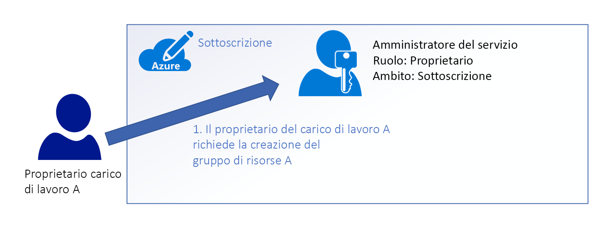  

2. L'**amministratore del servizio** esamina la richiesta e crea il **gruppo di risorse A**. In questo momento, il **proprietario del carico di lavoro A**  non è ancora autorizzato ad eseguire alcuna operazione.The **service administrator** reviews their request and creates **resource group A**. At this point, **workload owner A** still doesn't have permission to do anything.
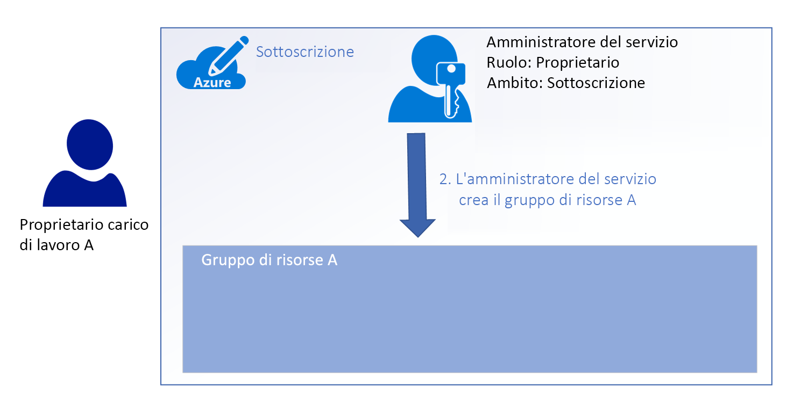

3. L'**amministratore del servizio** aggiunge il **proprietario del carico di lavoro A** al **gruppo di risorse A** e assegna il [ruolo di collaboratore predefinito](/azure/role-based-access-control/built-in-roles#contributor).The **service administrator** adds **workload owner A** to **resource group A** and assigns the [built-in contributor role](/azure/role-based-access-control/built-in-roles#contributor). Il ruolo di collaboratore concede tutte le autorizzazioni per il **gruppo di risorse A**, tranne la gestione delle autorizzazioni di accesso.The contributor role grants all permissions on **resource group A** except managing access permission.
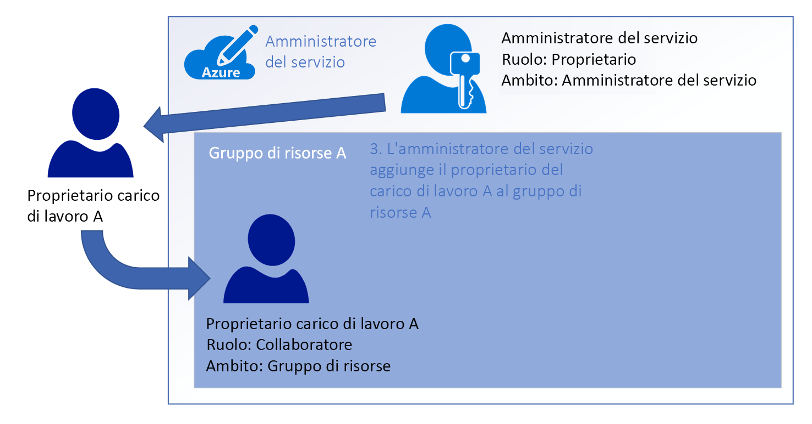

4. Si supponga che il **proprietario del carico di lavoro A** debba consentire a un paio di componenti del team di visualizzare i dati di monitoraggio della CPU e del traffico di rete nell'ambito della pianificazione delle capacità del carico di lavoro.Let's assume that **Workload owner A** has a requirement for a pair of team members to view the CPU and network traffic monitoring data as part of capacity planning for the workload. Dato che al **proprietario del carico di lavoro A** è assegnato il ruolo di collaboratore, non è autorizzato ad aggiungere utenti al **gruppo di risorse A**. Deve inviare questa richiesta all'**amministratore del servizio**.Because **workload owner A** is assigned the contributor role, they do not have permission to add a user to **resource group A**. They must send this request to the **service administrator**.
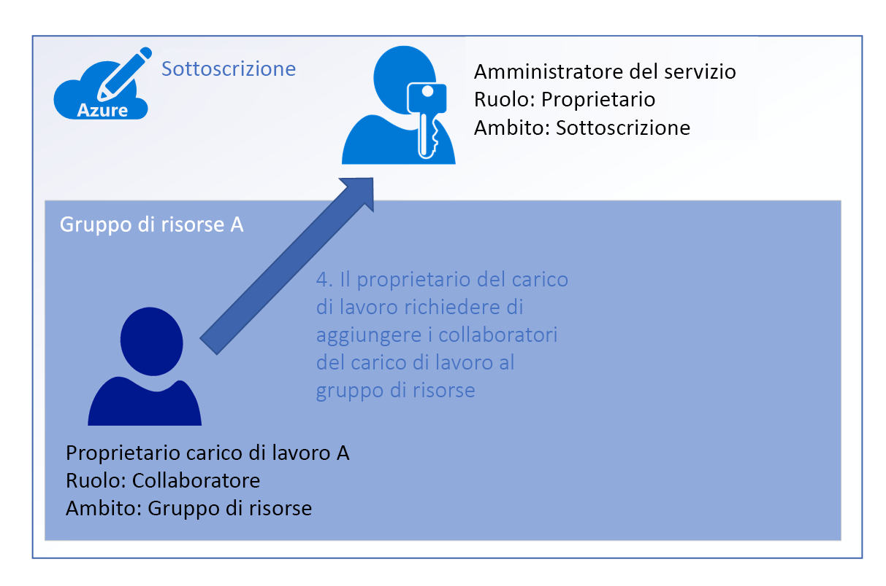

5. L'**amministratore del servizio** esamina la richiesta e aggiunge due utenti **collaboratori del carico di lavoro** al **gruppo di risorse A**. Nessuno di questi due utenti richiede l'autorizzazione a gestire le risorse, quindi viene assegnato il ruolo di [lettore predefinito](/azure/role-based-access-control/built-in-roles#contributor).The **service administrator** reviews the request, and adds the two **workload contributor** users to **resource group A**. Neither of these two users require permission to manage resources, so they are assigned the [built-in reader role](/azure/role-based-access-control/built-in-roles#contributor). 
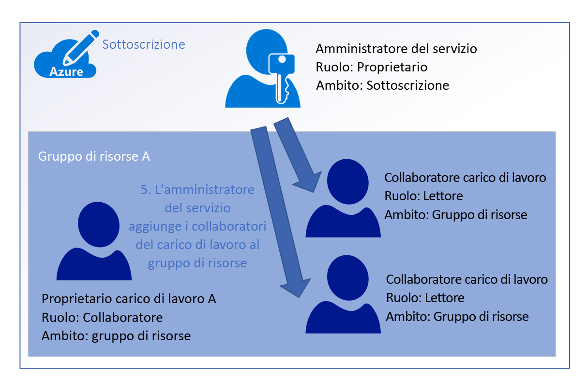

6. Successivamente, anche il **proprietario del carico di lavoro B** richiede che un gruppo di risorse contenga le risorse per il proprio carico di lavoro.Next, **workload owner B** also requires a resource group to contain the resources for their workload. Come il **proprietario del carico di lavoro A**, il **proprietario del carico di lavoro B** non è inizialmente autorizzato a eseguire azioni a livello di sottoscrizione, quindi deve inviare una richiesta all'**amministratore del servizio**.As with **workload owner A**, **workload owner B** initially does not have permission to take any action at the subscription scope so they must send a request to the **service administrator**. 
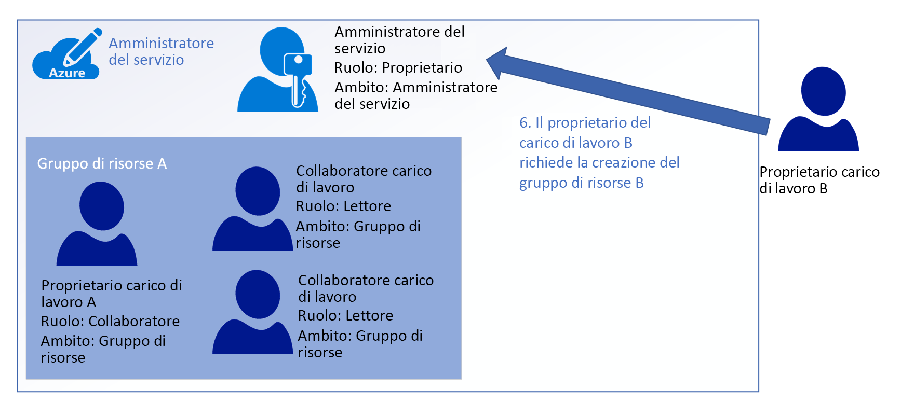

7. L'**amministratore del servizio** esamina la richiesta e crea il **gruppo di risorse B**. 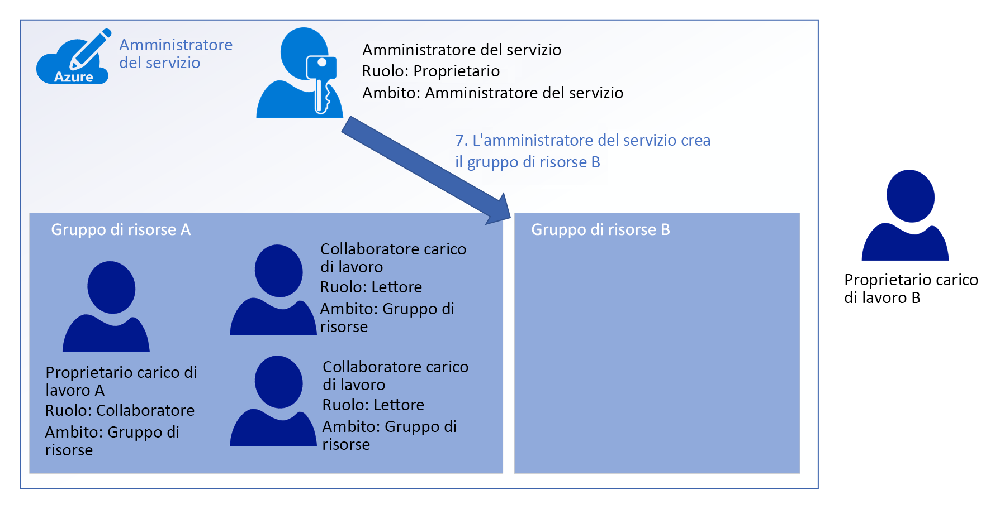The **service administrator** reviews the request and creates **resource group B**. 

8. L'**amministratore del servizio** aggiunge quindi il **proprietario del carico di lavoro B** al **gruppo di risorse B** e assegna il [ruolo di collaboratore predefinito](https://docs.microsoft.com/en-us/azure/role-based-access-control/built-in-roles#contributor).The **service administrator** then adds **workload owner B** to **resource group B** and assigns the [built-in contributor role](https://docs.microsoft.com/en-us/azure/role-based-access-control/built-in-roles#contributor). 
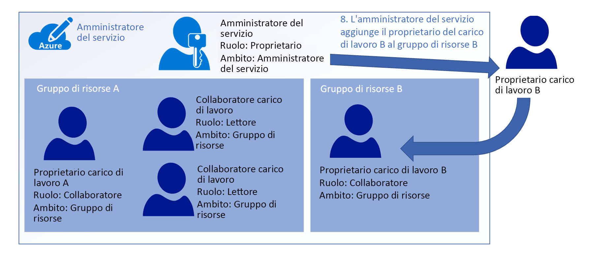

A questo punto, ogni proprietario del carico di lavoro è isolato nel proprio gruppo di risorse.At this point, each of the workload owners is isolated in their own resource group. I proprietari del carico di lavoro o i componenti dei loro team non hanno accesso alle risorse di altri gruppi di risorse.None of the workload owners or their team members have management access to the resources in any other resource group. 

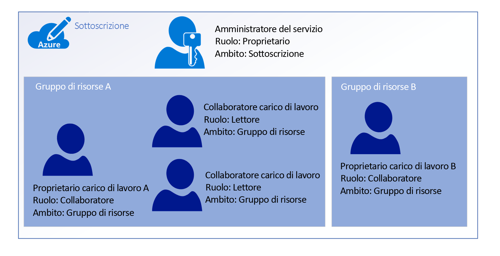
*Figura 4. Una sottoscrizione con due proprietari di carichi di lavoro isolati con il proprio gruppo di risorse.*
*Figure 4. A subscription with two workload owners isolated with their own resource group.*

Questo modello è un modello con privilegi minimi: a ogni utente sono assegnate le autorizzazioni corrette nell'ambito della corretta gestione delle risorse.This model is a least privilege model - each user is assigned the correct permission at the correct resource management scope.

Si consideri tuttavia che ogni attività in questo esempio è stata eseguita dall'**amministratore del servizio**.However, consider that every task in this example was performed by the **service administrator**. Anche se in un esempio semplice come questo può non sembrare un problema perché ci sono solo due proprietari del carico di lavoro, è facile immaginare i problemi che ne deriverebbero per una grande organizzazione.While this is a simple example and may not appear to be an issue because there were only two workload owners, it's easy to imagine the types of issues that would result for a large organization. Ad esempio, l'**amministratore del servizio** può andare incontro a un collo di bottiglia con un gran numero di richieste arretrate che causano ritardi.For example, the **service administrator** can become a bottleneck with a large backlog of requests that result in delays.  

Di seguito è riportato un secondo esempio che riduce il numero di attività eseguite dall'**amministratore del servizio**.Let's take a look at second example that reduces the number of tasks performed by the **service administrator**. 

1. In questo modello, al **proprietario del carico di lavoro A** è assegnato il [ruolo di proprietario predefinito][rbac-built-in-owner] a livello della sottoscrizione, che consente di creare il proprio gruppo di risorse (**gruppo di risorse A**). 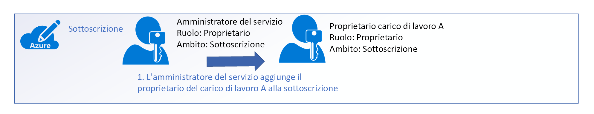In this model, **workload owner A** is assigned the [built-in owner role][rbac-built-in-owner] at the subscription scope, enabling them to create their own resource group: **resource group A**. 

2. Quando viene creato il **gruppo di risorse A**, il **proprietario del carico di lavoro A** viene aggiunto per impostazione predefinita ed eredita il ruolo di [proprietario predefinito][rbac-built-in-owner] dall'ambito della sottoscrizione.When **resource group A** is created, **workload owner A** is added by default and inherits the [built-in owner][rbac-built-in-owner] role from the subscription scope.
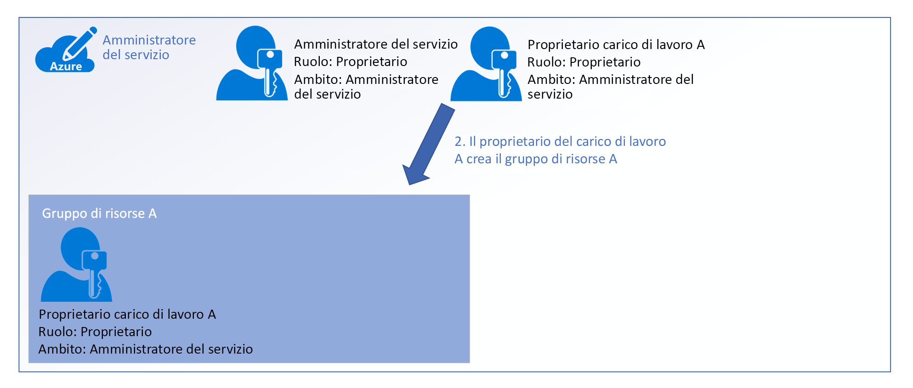

3. Il [ruolo di proprietario predefinito][rbac-built-in-owner] concede al **proprietario del carico di lavoro A**  l'autorizzazione a gestire l'accesso al gruppo di risorse.The [built-in owner role][rbac-built-in-owner] grants **workload owner A** permission to manage access to the resource group. Il **proprietario del carico di lavoro A** aggiunge due **collaboratori del carico di lavoro**  e assegna il ruolo di [lettore predefinito ][rbac-built-in-owner] a ognuno di essi.**Workload owner A** adds two **workload contributors** and assigns the [built-in reader role][rbac-built-in-owner] to each of them. 
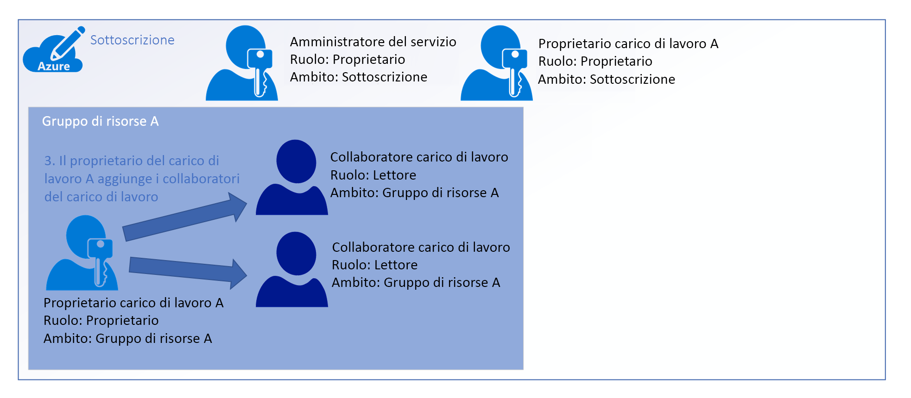

4. **L'amministratore del servizio** aggiunge ora il **proprietario del carico di lavoro B** alla sottoscrizione con il ruolo di proprietario predefinito.**Service administrator** now adds **workload owner B** to the subscription with the built-in owner role. 

5. **Il proprietario del carico di lavoro B** crea il  **gruppo di risorse B** e viene aggiunto per impostazione predefinita.**Workload owner B** creates **resource group B** and is added by default. Anche in questo caso, il **proprietario del carico di lavoro B** eredita il ruolo di proprietario predefinito dall'ambito della sottoscrizione.Again, **workload owner B** inherits the built-in owner role from the subscription scope.
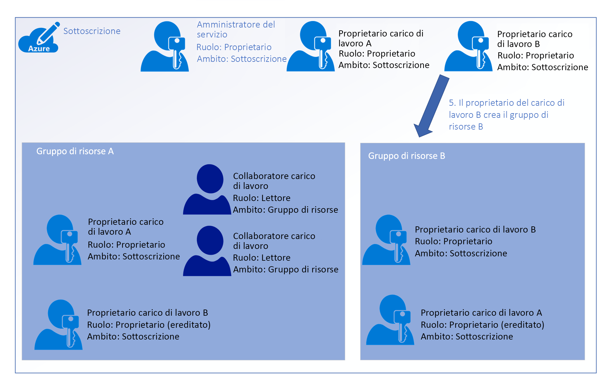

Si noti che in questo modello l'**amministratore del servizio** ha eseguito meno azioni rispetto al primo esempio, avendo delegato l'accesso di gestione a ognuno dei proprietari dei carichi di lavoro.Note that in this model, the **service administrator** performed fewer actions than they did in the first example due to the delegation of management access to each of the individual workload owners.

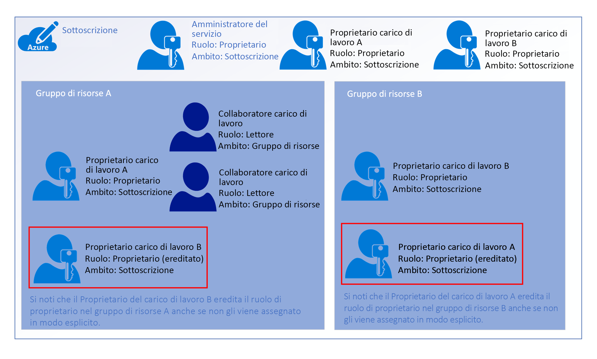
*Figura 5. Una sottoscrizione con un amministratore del servizio e due proprietari dei carichi di lavoro, ai quali è assegnato il ruolo di proprietario predefinito.*
*Figure 5. A subscription with a service administrator and two workload owners, all assigned the built-in owner role.*

Dato che tuttavia sia il **proprietario del carico di lavoro A** che il  **proprietario del carico di lavoro B** hanno il ruolo di proprietario predefinito nell'ambito della sottoscrizione, ognuno di essi ha ereditato il ruolo di proprietario predefinito per il gruppo di risorse dell'altro.However, because both **workload owner A** and **workload owner B** are assigned the built-in owner role at the subscription scope, they have each inherited the built-in owner role for each other's resource group. Ciò significa che non solo hanno pieno accesso alle risorse dell'altro, ma possono anche delegare l'accesso di gestione al gruppo di risorse dell'altro.This means that not only do they have full access to one another's resources, they are also able to delegate management access to each other's resource groups. Ad esempio, il **proprietario del carico di lavoro B** è autorizzato ad aggiungere qualsiasi altro utente al **gruppo di risorse A** e può assegnare agli utenti qualsiasi ruolo, incluso il ruolo di proprietario predefinito.For example, **workload owner B** has rights to add any other user to **resource group A** and can assign any role to them, including the built-in owner role.

Se si confronta ogni esempio con i requisiti definiti, entrambi gli esempi supportano un singolo utente attendibile nell'ambito della sottoscrizione, autorizzato a concedere diritti di accesso alle risorse ai due proprietari dei carichi di lavoro.If we compare each example to our requirements, we see that both examples support a single trusted user at the subscription scope with permission to grant resource access rights to our two workload owners. Nessuno dei due proprietari dei carichi di lavoro aveva accesso alla gestione delle risorse per impostazione predefinita e doveva richiedere all'**amministratore del servizio** di assegnare esplicitamente le autorizzazioni.Each of the two workload owners did not have access to resource management by default and required the **service administrator** to explicitly assign permissions to them. Solo il primo esempio supporta tuttavia il requisito secondo il quale le risorse associate a ciascun carico di lavoro debbano essere isolate l'una dall'altra, in modo tale che nessun proprietario del carico di lavoro abbia accesso alle risorse degli altri carichi di lavoro.However, only the first example supports the requirement that the resources associated with each workload are isolated from one another such that no workload owner has access to the resources of any other workload.

## Modello di gestione delle risorseResource management model

Ora che è stato progettato un modello di autorizzazioni con privilegi minimi, verranno esaminate alcune applicazioni pratiche di questi modelli di governance.Now that we've designed a permissions model of least privilege, let's move on to take a look at some practical applications of these governance models. Secondo i requisiti definiti, è necessario supportare i tre ambienti seguenti:Recall from our requirements that we must support the following three environments:
1. **Infrastruttura condivisa:** un singolo gruppo di risorse condivise da tutti i carichi di lavoro.**Shared infrastructure:** a single group of resources shared by all workloads. Si tratta di risorse quali gateway di rete, firewall e servizi di sicurezza.These are resources such as network gateways, firewalls, and security services.  
2. **Sviluppo:** più gruppi di risorse che rappresentano più carichi di lavoro non di produzione.**Development:** multiple groups of resources representing multiple non-production ready workloads. Queste risorse vengono usate per verifiche, test e altre attività di sviluppo.These resources are used for proof-of-concept, testing, and other developer activities. Possono avere un modello di governance meno rigido per aumentare la flessibilità degli sviluppatori.These resources may have a more relaxed governance model because to allow for increased developer agility.
3. **Produzione:** più gruppi di risorse che rappresentano più carichi di lavoro di produzione.**Production:** multiple groups of resources representing multiple production workloads. Queste risorse vengono usate per ospitare elementi privati e pubblici delle applicazioni.These resources are used to host the private and public facing application artifacts. Queste risorse hanno in genere i modelli di governance e sicurezza più rigorosi per proteggere le risorse, il codice delle applicazioni e i dati da accessi non autorizzati.These resources typically have the tightest governance and security models to protect the resources, application code, and data from unauthorized access.

Per ognuno di questi tre ambienti è necessario tenere traccia dei dati sui costi per **proprietario del carico di lavoro**, **ambiente** o entrambi.For each of these three environments, we have a requirement to track cost data by **workload owner**, **environment**, or both. In altre parole, è necessario conoscere il costo corrente dell'**infrastruttura condivisa**, i costi sostenuti dai singoli utenti negli ambienti di **sviluppo** e **produzione** e infine il costo complessivo dello **sviluppo** e della **produzione**.That is, we want to know the ongoing cost of our **shared infrastructure**, the costs incurred by individuals in both the **development** and **production** environments, and finally the overall cost of **development** and **production**. 

Si è già appreso che le risorse sono suddivise in due livelli: **sottoscrizione** e **gruppo di risorse**.You have already learned that resources are scoped to two levels: **subscription** and **resource group**. La prima decisione da prendere è quindi come organizzare gli ambienti per **sottoscrizione**.Therefore, our first decision is how to organize our environments by **subscription**. Sono disponibili solo due opzioni: una singola sottoscrizione o più sottoscrizioni.There are only two possibilities: a single subscription, or, multiple subscriptions. 

Prima di esaminare gli esempi di ognuno di questi modelli, verrà esaminata la struttura di gestione per le sottoscrizioni in Azure.Before we look at examples of each of these models, let's review the management structure for subscriptions in Azure. 

Secondo i requisiti definiti, un utente dell'organizzazione è responsabile delle sottoscrizioni e ha l'account **proprietario della sottoscrizione** nel tenant di Azure AD.Recall from our requirements that we have an individual in our organization that is responsible for subscriptions, and this user owns the **subscription owner** account in our Azure AD tenant. Questo account non è tuttavia autorizzato a creare sottoscrizioni.However, this account does not have permission to create subscriptions. Solo il **proprietario dell'account Azure** ha tale autorizzazione: 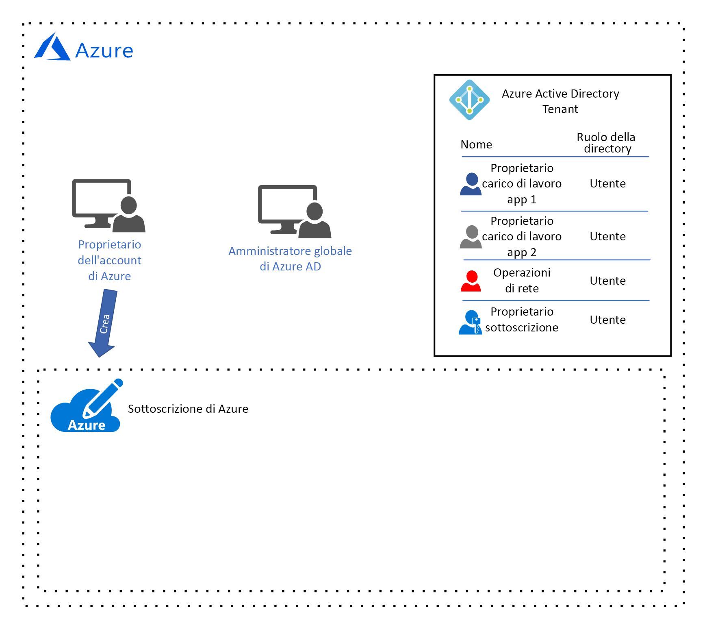
*Figura 6. Il proprietario di un account Azure crea una sottoscrizione.*Only the **Azure Account Owner** has permission to do this: 
*Figure 6. An Azure Account Owner creates a subscription.*

Una volta creata la sottoscrizione, il **proprietario dell'account Azure** può aggiungere l'account **proprietario della sottoscrizione** alla sottoscrizione con il ruolo **proprietario**:Once the subscription has been created, the **Azure Account Owner** can add the **subscription owner** account to the subscription with the **owner** role:

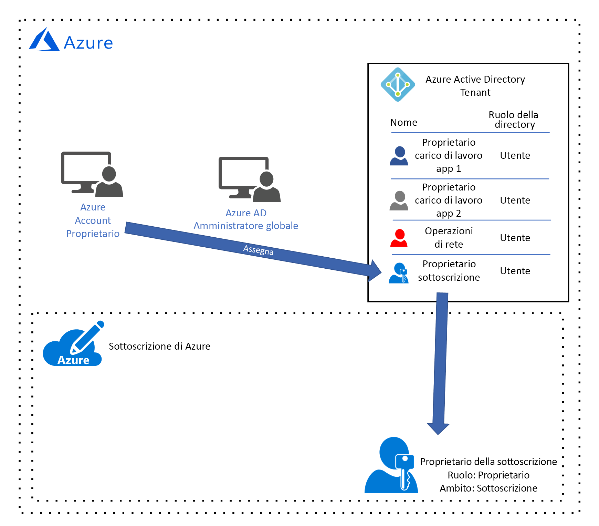
*Figura 7. Il proprietario dell'account Azure aggiunge l'account utente **proprietario della sottoscrizione** alla sottoscrizione con il ruolo **proprietario**.*
*Figure 7. The Azure Account Owner adds the **subscription owner** user account to the subscription with the **owner** role.*

Il **proprietario della sottoscrizione** può ora creare **gruppi di risorse** e delegare la gestione dell'accesso alle risorse.The **subscription owner** can now create **resource groups** and delegate resource access management.

Verrà ora esaminato un esempio di modello di gestione delle risorse che usa una sottoscrizione singola.First let's look at an example resource management model using a single subscription. La prima decisione da prendere è come allineare i gruppi di risorse ai tre ambienti.Our first decision is how to align resource groups to the three environments. Sono disponibili due opzioni:We have two options:
1. Allineare ogni ambiente a un singolo gruppo di risorse.Align each environment to a single resource group. Tutte le risorse dell'infrastruttura condivisa vengono distribuite in un singolo gruppo di risorse dell'**infrastruttura condivisa**.All shared infrastructure resources are deployed to a single **shared infrastructure** resource group. Tutte le risorse associate ai carichi di lavoro di sviluppo vengono distribuite in un singolo gruppo di risorse di **sviluppo**.All resources associated with development workloads are deployed to a single **development** resource group. Tutte le risorse associate ai carichi di lavoro di produzione vengono distribuite in un singolo gruppo di risorse di **produzione**  per l'ambiente di **produzione**.All resources associated with production workloads are deployed into a single **production** resource group for the **production** environment. 
2. Allineare i carichi di lavoro a un gruppo di risorse separato, usando una convenzione di denominazione e tag per allineare i gruppi di risorse a ognuno dei tre ambienti.Align workloads with a separate resource group, using a naming convention and tags to align resource groups with each of the three environments.  

Verrà ora valutata la prima opzione.Let's begin by evaluating the first option. Si userà il modello di autorizzazioni illustrato nella sezione precedente, con un solo amministratore del servizio della sottoscrizione che crea i gruppi di risorse e aggiunge gli utenti ai gruppi con il ruolo di **collaboratore** o **lettore**.We'll be using the permissions model that we discussed in the previous section, with a single subscription service administrator that creates resource groups and adds users to them with either the built-in **contributor** or **reader** role. 

1. Il primo gruppo di risorse distribuito rappresenta l'ambiente dell'**infrastruttura condivisa**.The first resource group deployed represents the **shared infrastructure** environment. Il **proprietario della sottoscrizione** crea un gruppo di risorse per le risorse dell'infrastruttura condivisa denominato **netops-shared-rg**.The **subscription owner** creates a resource group for the shared infrastructure resources named **netops-shared-rg**. 
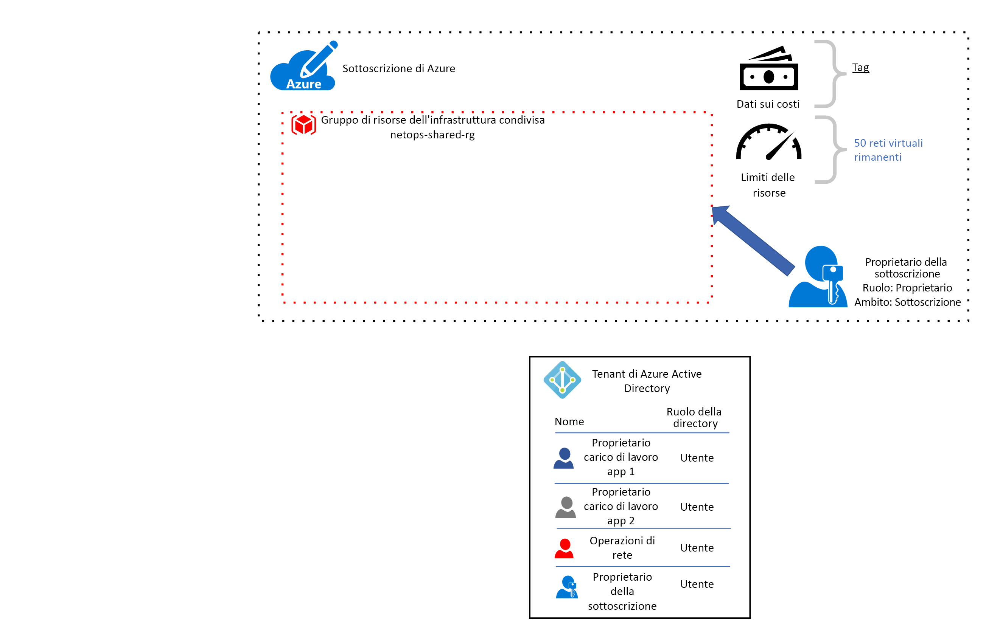
2. Il **proprietario della sottoscrizione** aggiunge l'account **utente delle operazioni di rete** al gruppo risorse e assegna il ruolo di **collaboratore**.The **subscription owner** adds the **network operations user** account to the resource group and assigns the **contributor** role. 
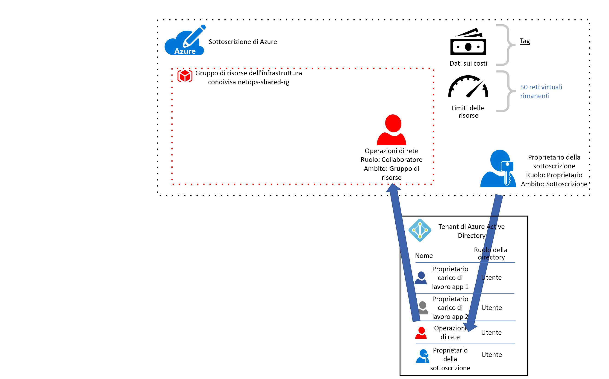
3. L'**utente delle operazioni di rete** crea un [gateway VPN](/azure/vpn-gateway/vpn-gateway-about-vpngateways) e lo configura per la connessione all'appliance VPN locale.The **network operations user** creates a [VPN gateway](/azure/vpn-gateway/vpn-gateway-about-vpngateways) and configures it to connect to the on-premises VPN appliance. L'**utente delle operazioni di rete** applica anche una coppia di [tag](/azure/azure-resource-manager/resource-group-using-tags) a ognuna delle risorse: *environment:shared* e *managedBy:netOps*.The **network operations** user also applies a pair of [tags](/azure/azure-resource-manager/resource-group-using-tags) to each of the resources: *environment:shared* and *managedBy:netOps*. Quando l'**amministratore del servizio della sottoscrizione** esporta un report sui costi, i costi verranno allineati a ognuno di questi tag.When the **subscription service administrator** exports a cost report, costs will be aligned with each of these tags. L'**amministratore del servizio della sottoscrizione** può così organizzare i costi usando i tag *environment* e *managedBy*.This allows the **subscription service administrator** to pivot costs using the *environment* tag and the *managedBy* tag. Si noti il contatore dei **limiti delle risorse** in alto a destra nella figura.Notice the **resource limits** counter at the top right-hand side of the figure. Ogni sottoscrizione di Azure ha [limiti del servizio](/azure/azure-subscription-service-limits). Per comprendere l'effetto di questi limiti si seguirà il limite della rete virtuale per ogni sottoscrizione.Each Azure subscription has [service limits](/azure/azure-subscription-service-limits), and to help you understand the effect of these limits we'll follow the virtual network limit for each subscription. Esiste un limite predefinito di 50 reti virtuali per ogni sottoscrizione e dopo la distribuzione della prima rete virtuale restano disponibili 49 reti.There is a default limit of 50 virtual networks per subscription, and after the first virtual network is deployed there are now 49 available.
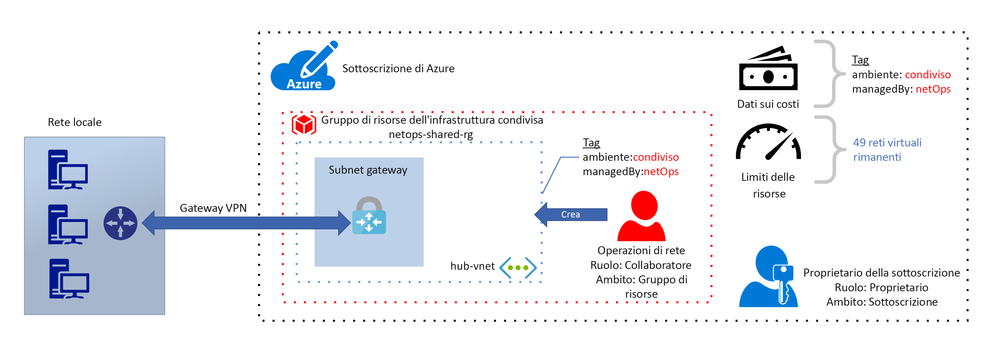
4. Vengono distribuiti altri due gruppi di risorse, il primo dei quali è denominato *prod-rg*.Two more resource groups are deployed, the first is named *prod-rg*. Questo gruppo di risorse è allineato all'ambiente di **produzione**.This resource group is aligned with the **production** environment. Il secondo è denominato *dev-rg* ed è allineato all'ambiente di **sviluppo**.The second is named *dev-rg* and is aligned with the **development** environment. Tutte le risorse associate ai carichi di lavoro di produzione sono distribuite nell'ambiente di **produzione** e tutte le risorse associate ai carichi di lavoro di sviluppo sono distribuite nell'ambiente di **sviluppo**.All resources associated with production workloads are deployed to the **production** environment and all resources associated with development workloads are deployed to the **development** environment. In questo esempio verranno distribuiti solo due carichi di lavoro in ognuno di questi due ambienti, quindi non si incontrerà alcun limite di servizio della sottoscrizione di Azure.In this example we'll only deploy two workloads to each of these two environments so we won't encounter any Azure subscription service limits. È tuttavia importante considerare che ogni gruppo di risorse ha un limite di 800 risorse.However, it's important to consider that each resource group has a limit of 800 resources per resource group. Se quindi si continua ad aggiungere carichi di lavoro a ogni gruppo di risorse, è possibile che questo limite venga raggiunto.Therefore, if we keep adding workloads to each resource group it is possible that this limit will be reached. 
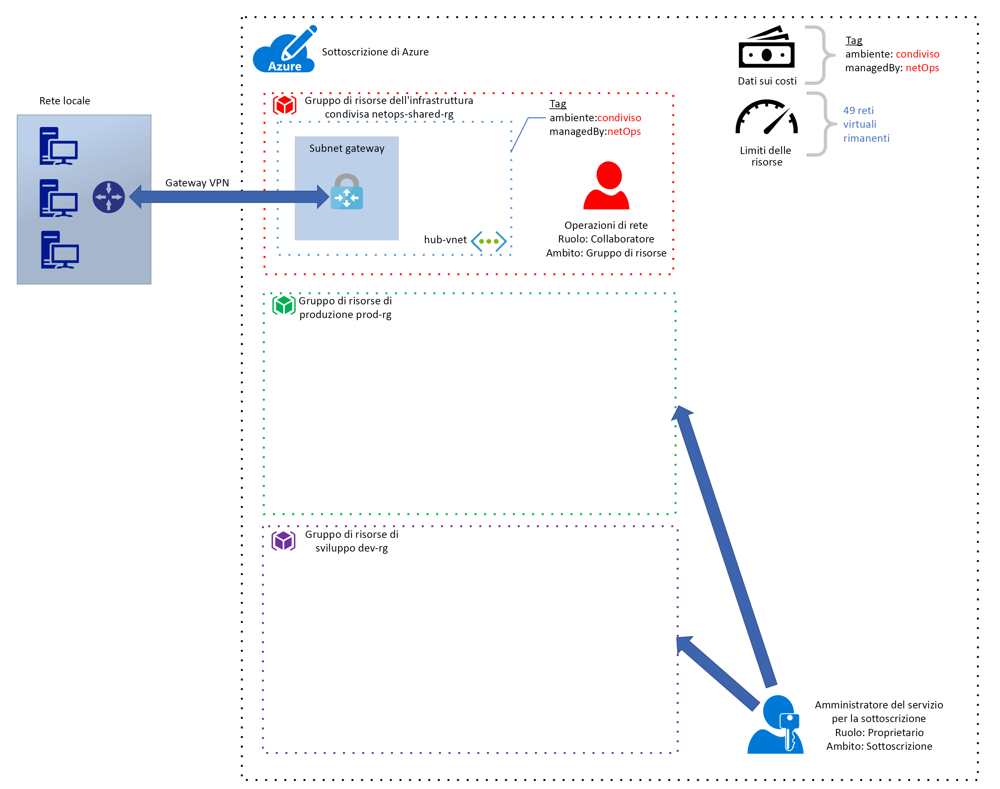
5. Il primo **proprietario del carico di lavoro** invia una richiesta all'**amministratore del servizio della sottoscrizione** e viene aggiunto a ognuno dei gruppo di risorse di **sviluppo** e **produzione** con il ruolo di **collaboratore**.The first **workload owner** sends a request to the **subscription service administrator** and is added to each of the **development** and **production** environment resource groups with the **contributor** role. Come si è appreso in precedenza, il ruolo di **collaboratore** consente all'utente di eseguire qualsiasi operazione, tranne l'assegnazione di un ruolo a un altro utente.As you learned earlier, the **contributor** role allows the user to perform any operation other than assigning a role to another user. Il primo **proprietario del carico di lavoro** può ora creare le risorse associate al proprio carico di lavoro.The first **workload owner** can now create the resources associated with their workload.
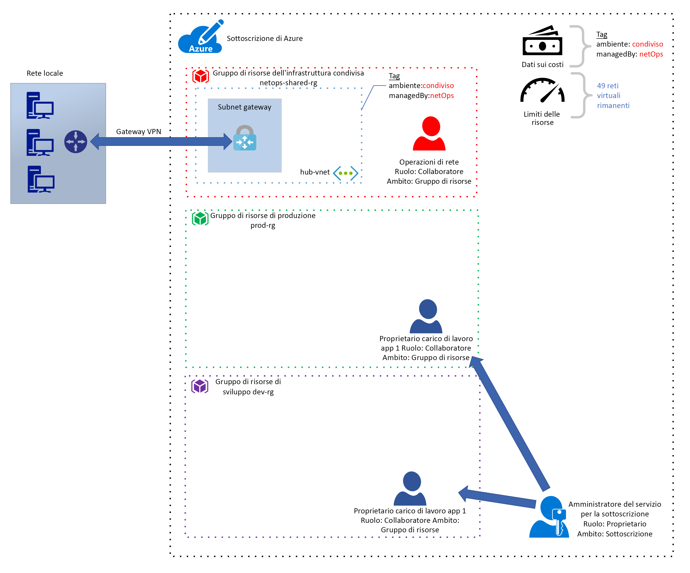
6. Il primo **proprietario del carico di lavoro** crea una rete virtuale in ognuno dei due gruppi di risorse con una coppia di macchine virtuali in ciascuno.The first **workload owner** creates a virtual network in each of the two resource groups with a pair of virtual machines in each. Il primo **proprietario del carico di lavoro** applica i tag *environment* e *managedBy* a tutte le risorse.The first **workload owner** applies the *environment* and *managedBy* tags to all resources. Si noti che il contatore dei limiti del servizio di Azure indica ora 47 reti virtuali rimanenti.Note that the Azure service limit counter is now at 47 virtual networks remaining.
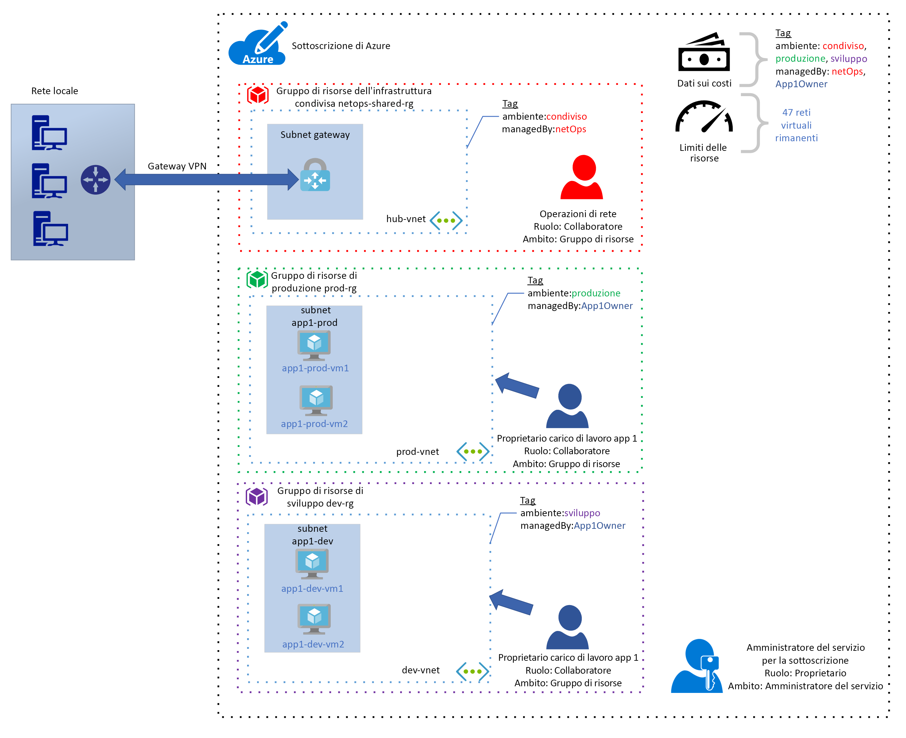
7. Nessuna delle reti virtuali ha connettività con l'ambiente locale al momento della creazione.Each of the virtual networks does not have connectivity to on-premises when they are created. In questo tipo di architettura, è necessario eseguire il peering di ogni rete virtuale con *hub-vnet* nell'ambiente dell'**infrastruttura condivisa**.In this type of architecture, each virtual network must be peered to the *hub-vnet* in the **shared infrastructure** environment. Il peering di rete virtuale crea una connessione tra due reti virtuali separate e consente al traffico di rete di passare da una rete all'altra.Virtual network peering creates a connection between two separate virtual networks and allows network traffic to travel between them. Si noti che il peering di rete virtuale non è intrinsecamente transitivo.Note that virtual network peering is not inherently transitive. È necessario specificare un peering in ognuna delle due reti virtuali connesse. Se solo una delle reti virtuali specifica un peering, la connessione è incompleta.A peering must be specified in each of the two virtual networks that are connected, and if only one of the virtual networks specifies a peering the connection is incomplete. Per illustrare l'effetto, il primo **proprietario del carico di lavoro** specifica un peering tra **prod-vnet** e **hub-vnet**.To illustrate the effect of this, the first **workload owner** specifies a peering between **prod-vnet** and **hub-vnet**. Il primo peering è stato creato, ma il traffico non viene trasmesso perché il peering complementare da **hub-vnet**  a **prod-vnet** non è stato ancora specificato.The first peering is created, but no traffic flows because the complementary peering from **hub-vnet** to **prod-vnet** has not yet been specified. Il primo **proprietario del carico di lavoro** contatta l'utente delle **operazioni di rete** e richiede questa connessione di peering complementare.The first **workload owner** contacts the **network operations** user and requests this complementary peering connection.
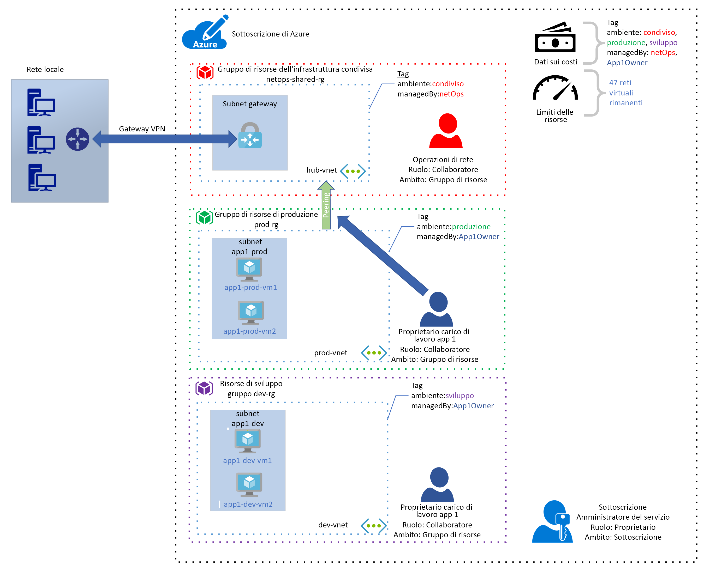
8. L'utente delle **operazioni di rete** esamina la richiesta, la approva e quindi specifica il peering nelle impostazioni di **hub-vnet**.The **network operations** user reviews the request, approves it, then specifies the peering in the settings for the **hub-vnet**. La connessione peering è ora completa e il traffico di rete viene trasmesso tra le due reti virtuali.The peering connection is now complete and network traffic flows between the two virtual networks.
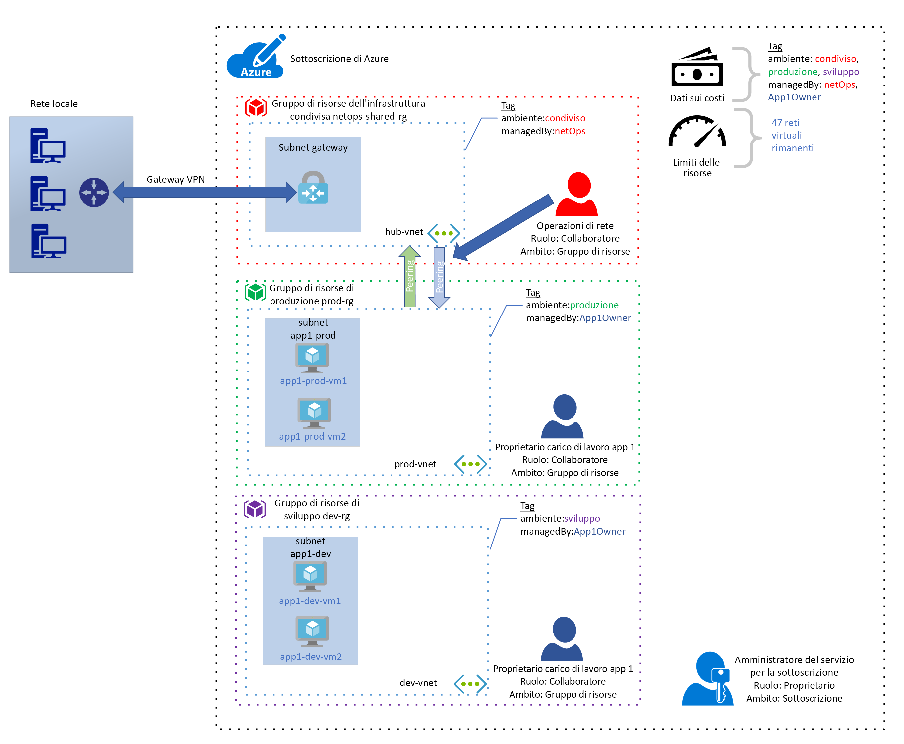
9. Un secondo **proprietario del carico di lavoro**  invia ora una richiesta all'**all'amministratore del servizio della sottoscrizione** e viene aggiunto ai gruppi di risorse degli ambienti di **produzione** e **sviluppo** esistenti con il ruolo di **collaboratore**.Now, a second **workload owner** sends a request to the **subscription service administrator** and is added to the existing **production** and **development** environment resource groups with the **contributor** role. Il secondo **proprietario del carico di lavoro** ha per tutte le risorse le stesse autorizzazioni del primo **proprietario del carico di lavoro** in ogni gruppo di risorse.The second **workload owner** has the same permissions on all resources as the first **workload owner** in each resource group. 
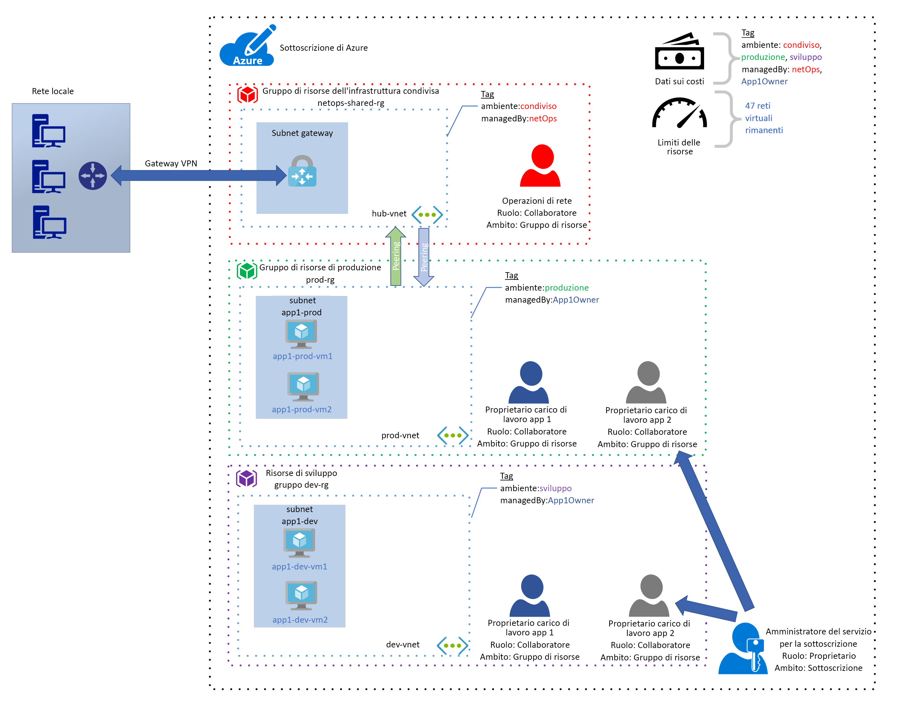
10. Il secondo **proprietario del carico di lavoro** crea una subnet nella rete virtuale **prod-vnet**, quindi aggiunge due macchine virtuali.The second **workload owner** creates a subnet in the **prod-vnet** virtual network, then adds two virtual machines. Il secondo **proprietario del carico di lavoro** applica i tag *environment* e *managedBy* a ogni risorsa.The second **workload owner** applies the *environment* and *managedBy* tags to each resource.
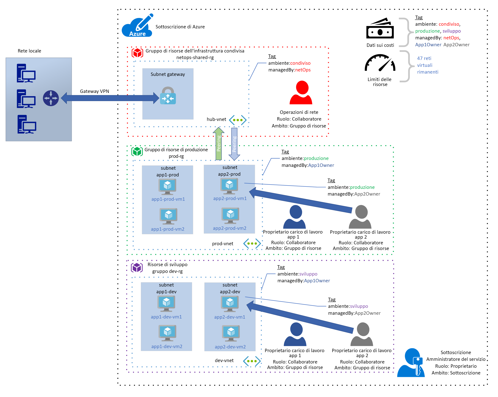 

Questo modello di esempio per la gestione delle risorse consente di gestire le risorse nei tre ambienti richiesti.This example resource management model enables us to manage our resources in the three required environments. Le risorse dell'infrastruttura condivisa sono protette perché nella sottoscrizione è presente un solo utente autorizzato ad accedere a tali risorse.Our shared infrastructure resources are protected because there's only a single user in the subscription with permission to access those resources. Ognuno dei proprietari del carico di lavoro può usare le risorse dell'infrastruttura condivisa senza avere autorizzazioni sulle risorse condivise in sé.Each of our workload owners is able to utilize the share infrastructure resources without having any permissions on the actual shared resources themselves. Questo modello di gestione non soddisfa il requisito di isolamento del carico di lavoro: ognuno dei due **proprietari del carico di lavoro** può accedere alle risorse del carico di lavoro dell'altro.This management model fails our requirement for workload isolation - each of the two **workload owners** are able to access the resources of the other's workload. 

Un'altra considerazione importante per questo modello potrebbe non essere così ovvia.There's another important consideration with this model that may not be immediately obvious. Nell'esempio è stato **app1 workload owner** a richiedere la connessione di peering di rete con **hub-vnet** per ottenere la connettività con l'ambiente locale.In our example, it was **app1 workload owner** that requested the network peering connection with the **hub-vnet** to provide connectivity to on-premises. L'utente delle **operazioni di rete** ha valutato la richiesta in base alle risorse distribuite con tale carico di lavoro.The **network operations** user evaluated that request based on the resources deployed with that workload. Quando il **proprietario della sottoscrizione** ha aggiunto **app2 workload owner** con il ruolo di **collaboratore**, quell'utente aveva i diritti di accesso di gestione per tutte le risorse nel gruppo di risorse **prod-rg**.When the **subscription owner** added **app2 workload owner** with the **contributor** role, that user had management access rights to all resources in the **prod-rg** resource group. 

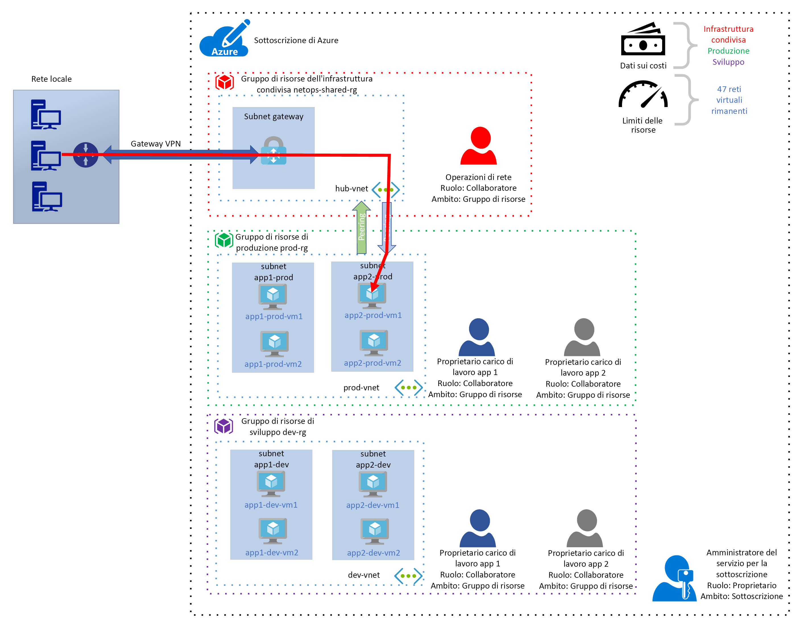

Ciò significa che **app2 workload owner** è autorizzato a distribuire la propria subnet con macchine virtuali nella rete virtuale **prod-vnet**.This means **app2 workload owner** had permission to deploy their own subnet with virtual machines in the **prod-vnet** virtual network. Per impostazione predefinita, tali macchine virtuali hanno ora accesso alla rete locale.By default, those virtual machines now have access to the on-premises network. L'utente delle **operazioni di rete** non è a conoscenza di tali macchine e non ne ha approvato la connettività con l'ambiente locale.The **network operations** user is not aware of those machines and did not approve their connectivity to on-premises.

Si esaminerà ora una sottoscrizione singola con più gruppi di risorse per ambienti e carichi di lavoro diversi.Next, let's look at a single subscription with multiple resources groups for different environments and workloads. Si noti che nell'esempio precedente le risorse per ogni ambiente erano facilmente identificabili perché facevano parte dello stesso gruppo di risorse.Note that in the previous example, the resources for each environment were easily identifiable because they were in the same resource group. Ora che quel raggruppamento non è più disponibile, sarà necessario fare affidamento su una convenzione di denominazione dei gruppi di risorse per ottenere tale funzionalità.Now that we no longer have that grouping, we will have to rely on a resource group naming convention to provide that functionality. 

1. Le risorse dell'**infrastruttura condivisa** avranno ancora un gruppo di risorse separato in questo modello.Our **shared infrastructure** resources will still have a separate resource group in this model, so that remains the same. Ogni carico di lavoro richiede due gruppi di risorse, uno per ognuno degli ambienti di **sviluppo** e **produzione**.Each workload requires two resource groups - one for each of the **development** and **production** environments. Per il primo carico di lavoro, il **proprietario della sottoscrizione** crea due gruppi di risorse.For the first workload, the **subscription owner** creates two resource groups. Il primo è denominato **app1-prod-rg** e il secondo **app1-dev-rg**.The first is named **app1-prod-rg** and the second one is named **app1-dev-rg**. Come illustrato in precedenza, questa convenzione di denominazione identifica le risorse come associate al primo carico di lavoro, **app1**, e all'ambiente **dev** o **prod**.As discussed earlier, this naming convention identifies the resources as being associated with the first workload, **app1**, and either the **dev** or **prod** environment. Anche in questo caso, il proprietario della *sottoscrizione* aggiunge **app1 workload owner** al gruppo di risorse con il ruolo **collaboratore**.Again, the *subscription* owner adds **app1 workload owner** to the resource group with the **contributor** role.
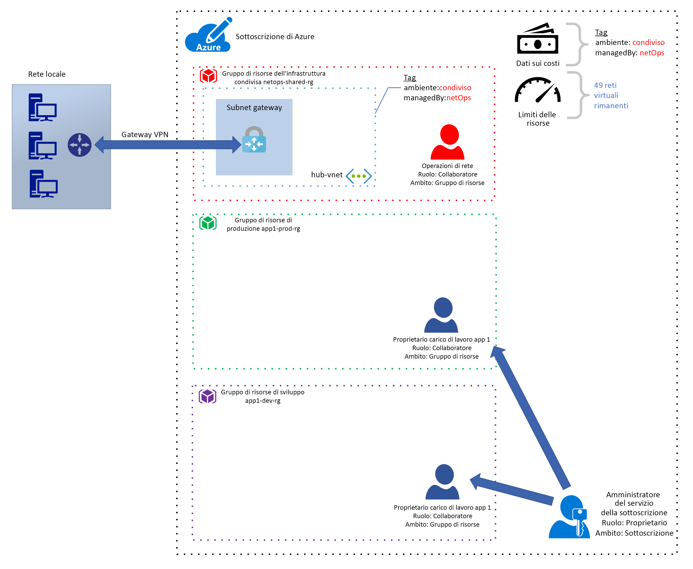
2. In modo simile al primo esempio, **app1 workload owner** distribuisce una rete virtuale denominata **app1-prod-vnet** nell'ambiente di **produzione** e un'altra denominata **app1-dev-vnet**  nell'ambiente di **sviluppo**.Similar to the first example, **app1 workload owner** deploys a virtual network named **app1-prod-vnet** to the **production** environment, and another named **app1-dev-vnet** to the **development** environment. Anche in questo caso, **app1 workload owner** invia una richiesta all'utente delle **operazioni di rete** per la creazione di una connessione di peering.Again, **app1 workload owner** sends a request to the **network operations** user to create a peering connection. Si noti che **app1 workload owner** aggiunge gli stessi tag del primo esempio e il contatore dei limite indica 47 reti virtuali rimanenti nella sottoscrizione.Note that **app1 workload owner** adds the same tags as in the first example, and the limit counter has been decremented to 47 virtual networks remaining in the subscription.
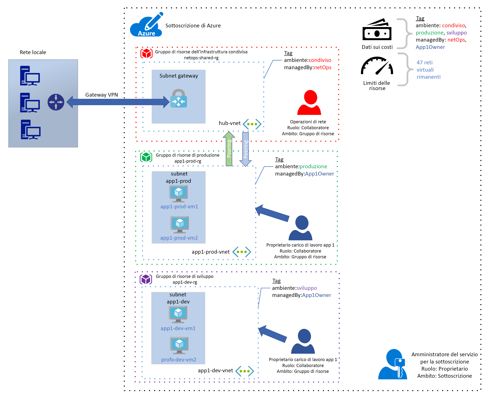
3. Il proprietario della **sottoscrizione** crea ora due gruppi di risorse per **app2 workload owner**.The **subscription owner** now creates two resource groups for **app2 workload owner**. Seguendo le stesse convenzioni valide per **app1 workload owner**, i gruppi di risorse vengono denominati **app2-prod-rg** e **app2-dev-rg**.Following the same conventions as for **app1 workload owner**, the resource groups are named **app2-prod-rg** and **app2-dev-rg**. Il **proprietario della sottoscrizione** aggiunge **app2 workload owner** a ognuno dei gruppi di risorse con il ruolo **collaboratore**.The **subscription owner** adds **app2 workload owner** to each of the resource groups with the **contributor** role.
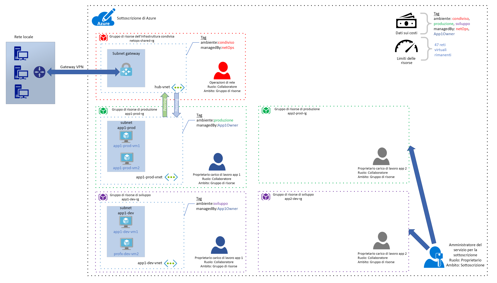
4. *App2 workload owner* distribuisce le reti e le macchine virtuali nei gruppi di risorse con le stesse convenzioni di denominazione.*App2 workload owner* deploys virtual networks and virtual machines to the resource groups with the same naming conventions. Vengono aggiunti i tag e il contatore dei limiti scende a 45 reti virtuali rimanenti nella *sottoscrizione*.Tags are added and the limit counter has been decremented to 45 virtual networks remaining in the *subscription*.
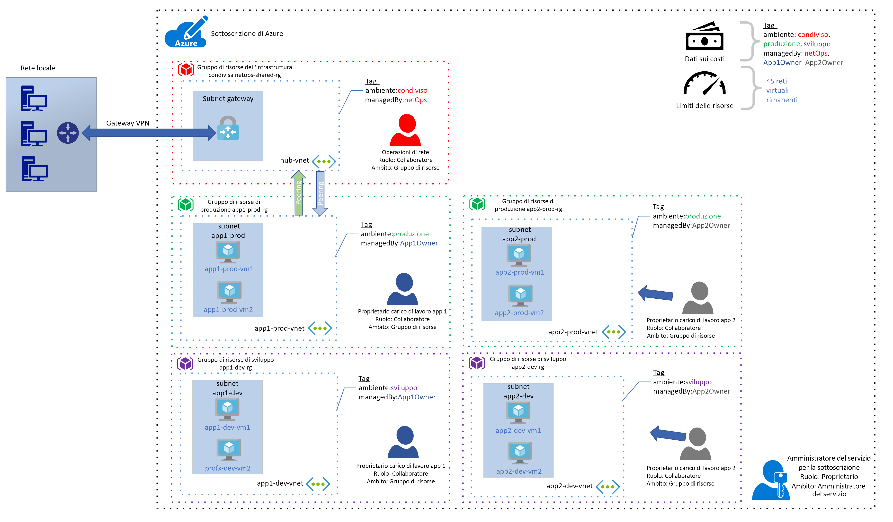
5. *App2 workload owner* invia una richiesta all'utente delle *operazioni di rete* per eseguire il peering di *app2-prod-vnet* con *hub-vnet*.*App2 workload owner* sends a request to the *network operations* user to peer the *app2-prod-vnet* with the *hub-vnet*. L'utente delle *operazioni di rete*  crea la connessione di peering.The *network operations* user creates the peering connection.
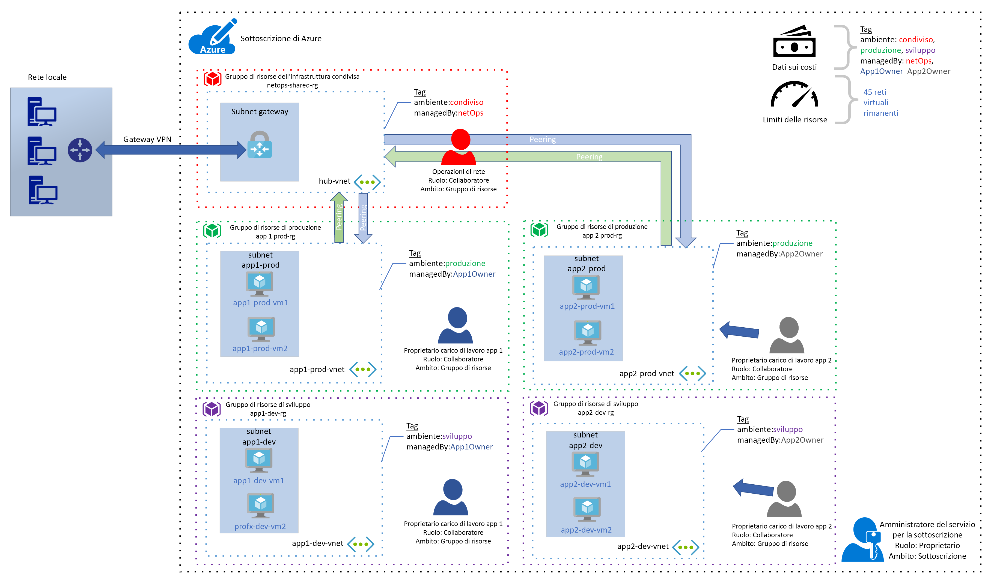

Il modello di gestione ottenuto è simile al primo esempio, con numerose differenze fondamentali:The resulting management model is similar to the first example, with several key differences:
* Ognuno dei due carichi di lavoro è isolato per carico di lavoro e ambiente.Each of the two workloads is isolated by workload and by environment.
* Questo modello richiedeva due reti virtuali in più rispetto al primo modello di esempio.This model required two more virtual networks than the first example model. Pur non trattandosi di una distinzione importante con due soli carichi di lavoro, il limite teorico del numero di carichi di lavoro per questo modello è 24.While this is not an important distinction with only two workloads, the theoretical limit on the number of workloads for this model is 24. 
* Le risorse non sono più raggruppate in un unico gruppo di risorse per ogni ambiente.Resources are no longer grouped in a single resource group for each environment. Il raggruppamento delle risorse richiede la comprensione delle convenzioni di denominazione usate per ogni ambiente.Grouping resources requires an understanding of the naming conventions used for each environment. 
* Ognuna delle connessioni di rete virtuali con peering è stata esaminata e approvata dall'utente delle *operazioni di rete*.Each of the peered virtual network connections was reviewed and approved by the *network operations* user.

Si esaminerà ora un modello di gestione delle risorse con più sottoscrizioni.Now let's look at a resource management model using multiple subscriptions. In questo modello, ognuno dei tre ambienti verrà allineato a una sottoscrizione distinta, ovvero alle sottoscrizioni **servizi condivisi**, **produzione** e infine **sviluppo**.In this model, we'll align each of the three environments to a separate subscription: a **shared services** subscription, **production** subscription, and finally a **development** subscription. Le considerazioni per questo modello sono simili a quelle di un modello che usa una sottoscrizione singola, perché è necessario decidere come allineare i gruppi di risorse ai carichi di lavoro.The considerations for this model are similar to a model using a single subscription in that we have to decide how to align resource groups to workloads. È già stato stabilito che la creazione di un gruppo di risorse per ogni carico di lavoro soddisfa i requisiti di isolamento del carico di lavoro, quindi si seguirà questo modello in questo esempio.We've already determined that creating a resource group for each workload satisfies our workload isolation requirement, so we'll stick with that model in this example.

1. In questo modello sono disponibili tre *sottoscrizioni*: *infrastruttura condivisa*, *produzione* e *sviluppo*.In this model, there are three *subscriptions*: *shared infrastructure*, *production*, and *development*. Ognuna di queste tre sottoscrizioni richiede un *proprietario della sottoscrizione* e in questo esempio semplice si userà lo stesso account utente per tutte e tre.Each of these three subscriptions requires a *subscription owner*, and in our simple example we'll use the same user account for all three. Le risorse dell'*infrastruttura condivisa* sono gestite in modo simile ai primi due esempi precedenti e il primo carico di lavoro è associato ad *app1-rg* nell'ambiente di *produzione* e al gruppo di risorse con lo stesso nome nell'ambiente di *sviluppo*.The *shared infrastructure* resources are managed similarly to the first two examples above, and the first workload is associated with the *app1-rg* in the *production* environment and the same-named resource group in the *development* environment. *App1 workload owner* viene aggiunto a ogni gruppo di risorse con il ruolo di *collaboratore*.The *app1 workload owner* is added to each of the resource group with the *contributor* role. 
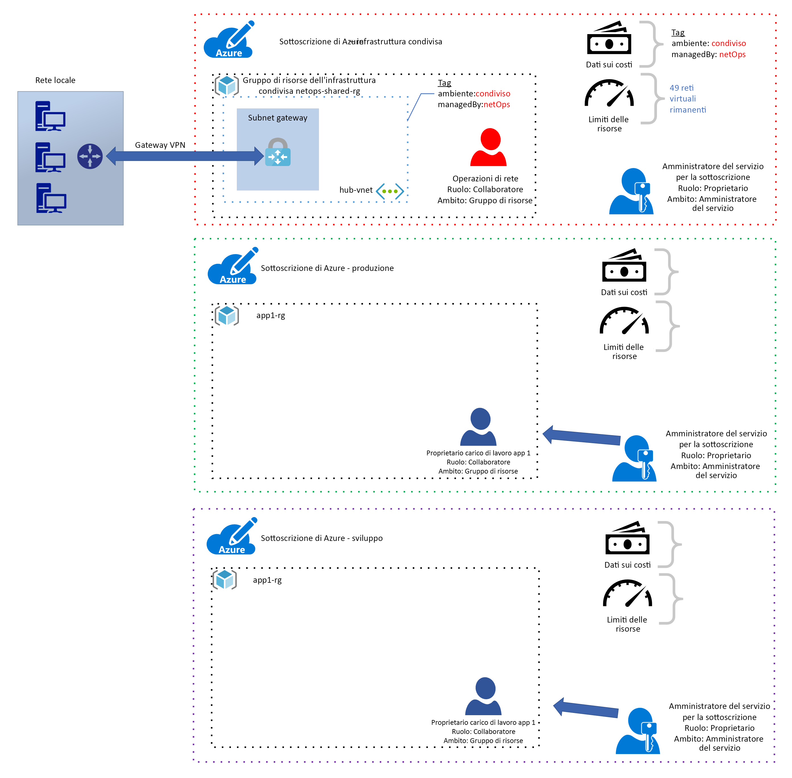
2. Come per gli esempi precedenti, *app1 workload owner* crea le risorse e richiede la connessione di peering con la rete virtuale dell'*infrastruttura condivisa*.As with the earlier examples, *app1 workload owner* creates the resources and requests the peering connection with the *shared infrastructure* virtual network. *App1 workload owner* aggiunge solo il tag *managedBy* perché il tag *environment* non è più necessario.*App1 workload owner* adds only the *managedBy* tag because there is no longer a need for the *environment* tag. In altre parole, le risorse per ogni ambiente sono ora raggruppate nella stessa *sottoscrizione* e il tag *environment* è ridondante.That is, resources are for each environment are now grouped in the same *subscription* and the *environment* tag is redundant. Il contatore dei limiti scende a 49 reti virtuali rimanenti.The limit counter is decremented to 49 virtual networks remaining.
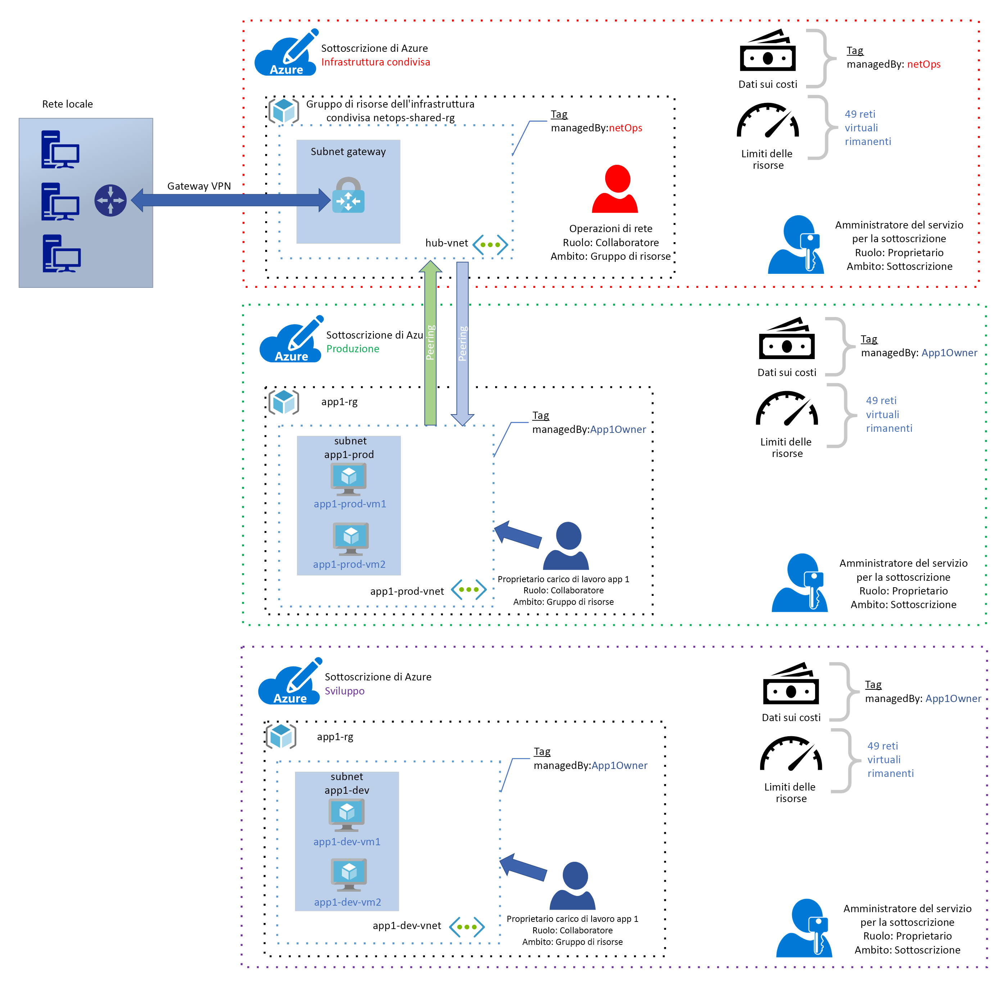
3. Il *proprietario della sottoscrizione* ripete infine il processo per il secondo carico di lavoro, aggiungendo i gruppi di risorse con *app2 workload owner* nel ruolo di \*collaboratore.Finally, the *subscription owner* repeats the process for the second workload, adding the resource groups with the *app2 workload owner* in the \*contributor role. Il contatore dei limiti per ogni sottoscrizione dell'ambiente scende a 48 reti virtuali rimanenti.The limit counter for each of the environment subscriptions is decremented to 48 virtual networks remaining. 

Questo modello di gestione ha i vantaggi del secondo esempio illustrato in precedenza.This management model has the benefits of the second example above. La differenza principale è tuttavia che i limiti non rappresentano un problema reale perché sono distribuiti in due *sottoscrizioni*.However, the key difference is that limits are less of an issue due to the fact that they are spread over two *subscriptions*. Lo svantaggio è che i dati sui costi rilevati dai tag devono essere aggregati per tutte e tre le *sottoscrizioni*.The drawback is that the cost data tracked by tags must be aggregated across all three *subscriptions*. 

È quindi possibile selezionare uno di questi due esempi di modelli di gestione delle risorse a seconda della priorità dei propri requisiti.Therefore, you can select any of these two examples resource management models depending on the priority of your requirements. Se si prevede che l'organizzazione non raggiungerà i limiti del servizio per una sottoscrizione singola, è possibile usare una sottoscrizione singola con più gruppi di risorse.If you anticipate that your organization will not reach the service limits for a single subscription, you can use a single subscription with multiple resource groups. Se invece l'organizzazione prevede molti carichi di lavoro, può essere meglio usare più sottoscrizioni per ogni ambiente.Conversely, if your organization anticipates many workloads, multiple subscriptions for each environment may be better.

<!-- ## Summary

## Next steps -->

<!-- links -->

[rbac-built-in-owner]: /azure/role-based-access-control/built-in-roles#owner
[rbac-built-in-roles]: /azure/role-based-access-control/built-in-roles
