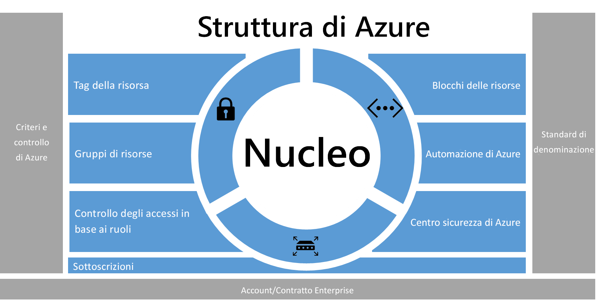
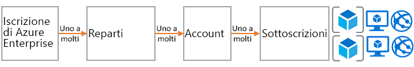
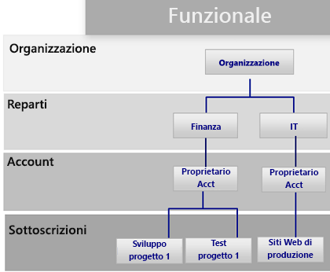
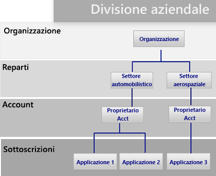
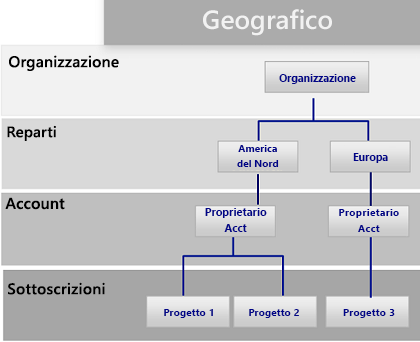
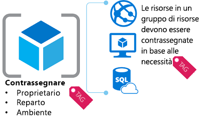
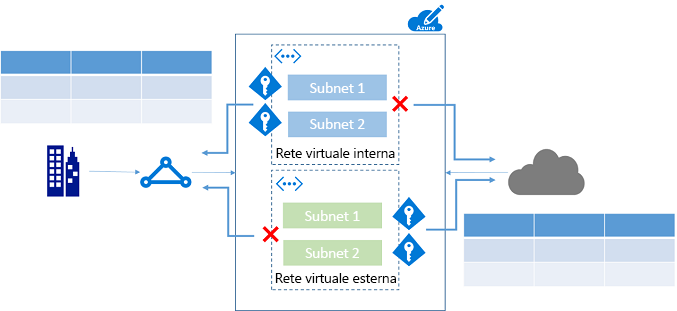
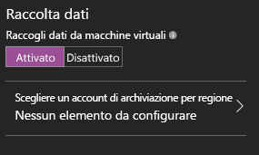

# Scaffold Azure enterprise: governance prescrittiva per le sottoscrizioniAzure enterprise scaffold - prescriptive subscription governance
Le organizzazioni stanno adottando sempre di più il cloud pubblico per la sua agilità e la sua flessibilità.Enterprises are increasingly adopting the public cloud for its agility and flexibility. Usano i punti di forza del cloud per generare ricavi o ottimizzare le risorse per l'azienda.They are utilizing the cloud's strengths to generate revenue or optimize resources for the business. Microsoft Azure fornisce numerosi servizi che le organizzazioni possono assemblare come blocchi predefiniti per affrontare le esigenze di una vasta gamma di applicazioni e carichi di lavoro.Microsoft Azure provides a multitude of services that enterprises can assemble like building blocks to address a wide array of workloads and applications. 

Tuttavia, spesso è difficile capire da dove iniziare.But, knowing where to begin is often difficult. Dopo avere deciso di usare Azure, generalmente sorgono alcune domande:After deciding to use Azure, a few questions commonly arise:

* "Come si soddisfano i requisiti legali soddisfare i requisiti legali per la sovranità dei dati in determinati paesi?""How do I meet our legal requirements for data sovereignty in certain countries?"
* "Come è possibile garantire che un utente non apporti inavvertitamente modifiche a un sistema critico?""How do I ensure that someone does not inadvertently change a critical system?"
* "Come è possibile determinare cosa è supportato da ogni risorsa, in modo da poterlo giustificare e fatturare con precisione?""How do I know what every resource is supporting so I can account for it and bill it back accurately?"

La prospettiva di una sottoscrizione vuota e senza barriere .è scoraggianteThe prospect of an empty subscription with no guard rails is daunting. Questo spazio vuoto può ostacolare la migrazione ad Azure.This blank space can hamper your move to Azure.

In questo articolo viene fornito un punto di partenza per i professionisti tecnici, in modo da aiutarli a soddisfare le esigenze in termini di governance e bilanciarle con la richiesta di agilità.This article provides a starting point for technical professionals to address the need for governance, and balance it with the need for agility. Viene introdotto il concetto di un scaffold enterprise per guidare le organizzazioni nell'implementazione e nella gestione delle loro sottoscrizioni Azure.It introduces the concept of an enterprise scaffold that guides organizations in implementing and managing their Azure subscriptions. 

## Esigenza di governanceNeed for governance
Durante il passaggio ad Azure, è necessario affrontare in anticipo l'argomento della governance per garantire il corretto uso del cloud all'interno dell'organizzazione.When moving to Azure, you must address the topic of governance early to ensure the successful use of the cloud within the enterprise. Purtroppo, il tempo necessario e le procedure per creare un sistema di governance completo implicano che alcuni gruppi aziendali si rivolgano direttamente ai fornitori senza coinvolgere l'IT aziendale.Unfortunately, the time and bureaucracy of creating a comprehensive governance system means some business groups go directly to vendors without involving enterprise IT. Se le risorse non vengono gestite correttamente, questo approccio rischia di lasciare l'azienda in balia delle vulnerabilità.This approach can leave the enterprise open to vulnerabilities if the resources are not properly managed. Le caratteristiche del cloud pubblico, cioè agilità, flessibilità e prezzi in base al consumo, sono importanti per i gruppi aziendali che devono soddisfare rapidamente le richieste dei clienti (interni ed esterni).The characteristics of the public cloud - agility, flexibility, and consumption-based pricing - are important to business groups that need to quickly meet the demands of customers (both internal and external). Tuttavia, l'IT aziendale deve assicurarsi che i dati e i sistemi siano protetti in modo efficace.But, enterprise IT needs to ensure that data and systems are effectively protected.

In uno scenario reale, lo scaffolding viene usato per creare la base della struttura.In real life, scaffolding is used to create the basis of the structure. Lo scaffold descrive la struttura generale e fornisce punti di ancoraggio per il montaggio di sistemi permanenti.The scaffold guides the general outline, and provides anchor points for more permanent systems to be mounted. Un scaffold enterprise è lo stesso: un set di controlli flessibili e funzionalità di Azure che forniscono la struttura per l'ambiente e punti di ancoraggio per servizi basati su cloud pubblico.An enterprise scaffold is the same: a set of flexible controls and Azure capabilities that provide structure to the environment, and anchors for services built on the public cloud. Fornisce ai generatori (IT e gruppi aziendali) una base per creare e collegare nuovi servizi.It provides the builders (IT and business groups) a foundation to create and attach new services.

Lo scaffold si basa su procedure raccolte attraverso le varie interazioni con i client di diverse dimensioni.The scaffold is based on practices we have gathered from many engagements with clients of various sizes. Questi client spaziano da organizzazioni di piccole dimensioni che sviluppano soluzioni nel cloud ad aziende presenti nell'elenco Fortune 500 e fornitori di software indipendenti che stanno eseguendo la migrazione e sviluppando soluzioni nel cloud.Those clients range from small organizations developing solutions in the cloud to Fortune 500 enterprises and independent software vendors who are migrating and developing solutions in the cloud. Lo scaffold enterprise è costruito appositamente in modo da essere flessibile e supportare i carichi di lavoro IT tradizionali e flessibili; ad esempio, gli sviluppatori che creano applicazioni software come un servizio (SaaS) in base alle funzionalità di Azure.The enterprise scaffold is "purpose-built" to be flexible to support both traditional IT workloads and agile workloads; such as, developers creating software-as-a-service (SaaS) applications based on Azure capabilities.

Lo scaffold enterprise deve essere la base di ogni nuova sottoscrizione all'interno di Azure.The enterprise scaffold is intended to be the foundation of each new subscription within Azure. Consente agli amministratori di verificare che i carichi di lavoro soddisfino i requisiti minimi di governance di un'organizzazione senza impedire che i gruppi e gli sviluppatori aziendali soddisfino i propri obiettivi.It enables administrators to ensure workloads meet the minimum governance requirements of an organization without preventing business groups and developers from quickly meeting their own goals.

> [!IMPORTANT]
> La governance è fondamentale per il successo di Azure.Governance is crucial to the success of Azure. In questo articolo è descritta l'implementazione tecnica di uno scaffold enterprise, tuttavia sono illustrati solo il processo più ampio e le relazioni tra i componenti.This article targets the technical implementation of an enterprise scaffold but only touches on the broader process and relationships between the components. La governance dei criteri scorre dall'alto verso il basso e dipende dai risultati che l'azienda desidera ottenere.Policy governance flows from the top down and is determined by what the business wants to achieve. Naturalmente, la creazione di un modello di governance per Azure include rappresentanti dell'IT, ma soprattutto deve prevedere una significativa rappresentanza di leader di gruppo aziendali e gestione di rischi e sicurezza.Naturally, the creation of a governance model for Azure includes representatives from IT, but more importantly it should have strong representation from business group leaders, and security and risk management. Fondamentalmente, uno scaffold enterprise consiste nella riduzione dei rischi aziendali per facilitare la missione e gli obiettivi dell'organizzazione.In the end, an enterprise scaffold is about mitigating business risk to facilitate an organization's mission and objectives.
> 
> 

Nell'immagine seguente vengono descritti i componenti dello scaffold.The following image describes the components of the scaffold. Le fondamenta sono rappresentate da un saldo piano per reparti, account e sottoscrizioni.The foundation relies on a solid plan for departments, accounts, and subscriptions. Le colonne sono i criteri di Resource Manager e saldi standard di denominazione.The pillars consist of Resource Manager policies and strong naming standards. Il resto del scaffold proviene dalle principali funzionalità di Azure e dalle funzionalità che garantiscono un ambiente protetto e gestibile.The rest of the scaffold comes from core Azure capabilities and features that enable a secure and manageable environment.

> [!NOTE]
> Azure è cresciuto rapidamente rispetto alla sua introduzione, nel 2008.Azure has grown rapidly since its introduction in 2008. Questa crescita ha obbligato i team di tecnici Microsoft a ripensare il loro approccio alla gestione e alla distribuzione dei servizi.This growth required Microsoft engineering teams to rethink their approach for managing and deploying services. Il modello di Azure Resource Manager è stato introdotto nel 2014 per sostituire il modello di distribuzione classica.The Azure Resource Manager model was introduced in 2014 and replaces the classic deployment model. Resource Manager consente alle organizzazioni di distribuire, organizzare e controllare le risorse di Azure con maggiore facilità.Resource Manager enables organizations to more easily deploy, organize, and control Azure resources. Resource Manager include la parallelizzazione quando si creano risorse per una distribuzione più veloce di soluzioni complesse e interdipendenti.Resource Manager includes parallelization when creating resources for faster deployment of complex, interdependent solutions. Include anche il controllo granulare degli accessi e la possibilità di contrassegnare le risorse con metadati.It also includes granular access control, and the ability to tag resources with metadata. Microsoft consiglia di creare tutte le risorse tramite il modello di Resource Manager.Microsoft recommends that you create all resources through the Resource Manager model. Lo scaffold enterprise è stato progettato appositamente per il modello di Resource Manager.The enterprise scaffold is explicitly designed for the Resource Manager model.
> 
> 

## Definire la gerarchiaDefine your hierarchy
Alle fondamenta dello scaffold sta l'iscrizione enterprise ad Azure insieme al portale aziendale.The foundation of the scaffold is the Azure Enterprise Enrollment (and the Enterprise Portal). L'iscrizione enterprise definisce la forma e l'uso dei servizi Azure all'interno di una società e la struttura di governance di base.The enterprise enrollment defines the shape and use of Azure services within a company and is the core governance structure. All'interno del contratto enterprise, i clienti possono suddividere ulteriormente l'ambiente in reparti, account e, infine, sottoscrizioni.Within the enterprise agreement, customers are able to further subdivide the environment into departments, accounts, and finally, subscriptions. Una sottoscrizione Azure è l'unità di base che contiene tutte le risorse.An Azure subscription is the basic unit where all resources are contained. Definisce anche diversi limiti all'interno di Azure, ad esempio il numero di memorie centrali, risorse e così via.It also defines several limits within Azure, such as number of cores, resources, etc.

Ogni azienda è diversa e la gerarchia nell'immagine precedente consente una notevole flessibilità nell'organizzazione di Azure all'interno della società.Every enterprise is different and the hierarchy in the previous image allows for significant flexibility in how Azure is organized within the company. Prima di implementare le linee guida contenute in questo documento, è necessario modellare la gerarchia e comprendere l'impatto su fatturazione, accesso alle risorse e complessità.Before implementing the guidance contained in this document, you should model your hierarchy and understand the impact on billing, resource access, and complexity.

I tre modelli comuni per le iscrizioni ad Azure sono:The three common patterns for Azure Enrollments are:

* Il modello **funzionale**The **functional** pattern
  
    
* Il modello **business unit**The **business unit** pattern 
  
    
* Il modello **geografico**The **geographic** pattern
  
    

Lo scaffold viene applicato a livello di sottoscrizione per estendere i requisiti di governance dell'organizzazione nella sottoscrizione.You apply the scaffold at the subscription level to extend the governance requirements of the enterprise into the subscription.

## Standard di denominazioneNaming standards
Il primo pilastro dello scaffolding è lo standard di denominazione.The first pillar of the scaffold is naming standards. Standard di denominazione ben progettati consentono di identificare le risorse nel portale, in una fattura e all'interno degli script.Well-designed naming standards enable you to identify resources in the portal, on a bill, and within scripts. È molto probabile che si disponga già di standard di denominazione per l'infrastruttura locale.Most likely, you already have naming standards for on-premises infrastructure. Quando si aggiunge Azure all'ambiente, è opportuno estendere tali standard di denominazione alle risorse di Azure.When adding Azure to your environment, you should extend those naming standards to your Azure resources. Uno standard di denominazione consente una più efficace gestione dell'ambiente a tutti i livelli.Naming standard facilitate more efficient management of the environment at all levels.

> [!TIP]
> Per le convenzioni di denominazione:For naming conventions:
> * Esaminare [Patterns and Practices guidance (Linee guida su modelli e procedure)](../best-practices/naming-conventions.md) e adottarle dove possibile.Review and adopt where possible the [Patterns and Practices guidance](../best-practices/naming-conventions.md). Queste linee guida consentono di stabilire uno standard di denominazione significativo.This guidance helps you decide on a meaningful naming standard.
> * Usare il sistema camelCasing per i nomi delle risorse (ad esempio myResourceGroup e vnetNetworkName).Use camelCasing for names of resources (such as myResourceGroup and vnetNetworkName). Nota: esistono determinate risorse, ad esempio gli account di archiviazione, in cui l'unica opzione consiste nell'usare lettere minuscole (e nessun altro carattere speciale).Note: There are certain resources, such as storage accounts, where the only option is to use lower case (and no other special characters).
> * È consigliabile usare i criteri di Azure Resource Manager (descritti nella sezione successiva) per applicare gli standard di denominazione.Consider using Azure Resource Manager policies (described in the next section) to enforce naming standards.
> 
> I suggerimenti precedenti consentono di implementare una convenzione di denominazione coerente.The preceding tips help you implement a consistent naming convention.

## Criteri e controlloPolicies and auditing
Il secondo pilastro dello scaffolding comporta la creazione di [criteri di Azure](/azure/azure-policy/azure-policy-introduction) e il [controllo del log attività](/azure/azure-resource-manager/resource-group-audit).The second pillar of the scaffold involves creating [Azure policies](/azure/azure-policy/azure-policy-introduction) and [auditing the activity log](/azure/azure-resource-manager/resource-group-audit). I criteri di Resource Manager consentono di gestire i rischi in Azure.Resource Manager policies provide you with the ability to manage risk in Azure. È possibile definire criteri in grado di garantire la sovranità dei dati attraverso la limitazione, l'applicazione o il controllo di determinate azioni.You can define policies that ensure data sovereignty by restricting, enforcing, or auditing certain actions. 

* Per impostazione predefinita, i criteri sono un sistema **allow**.Policy is a default **allow** system. Le azioni vengono controllate attraverso la definizione e l'assegnazione di criteri a risorse che negano o controllano le azioni sulle risorse.You control actions by defining and assigning policies to resources that deny or audit actions on resources.
* I criteri sono descritti dalle relative definizioni in un linguaggio di definizione dei criteri (condizioni if-then).Policies are described by policy definitions in a policy definition language (if-then conditions).
* I criteri vengono creati attraverso file con formattazione JSON (Javascript Object Notation).You create polices with JSON (Javascript Object Notation) formatted files. Dopo la definizione, un criterio viene assegnato a un determinato ambito: sottoscrizione, gruppo di risorse o risorsa.After defining a policy, you assign it to a particular scope: subscription, resource group, or resource.

I criteri hanno diverse azioni che consentono un approccio più granulare agli scenari.Policies have multiple actions that allow for a fine-grained approach to your scenarios. Le azioni sono:The actions are:

* **Nega**: blocca la richiesta di risorse**Deny**: Blocks the resource request
* **Controlla**: consente la richiesta ma aggiunge una riga al log attività da usare per fornire avvisi o attivare runbook**Audit**: Allows the request but adds a line to the activity log (which can be used to provide alerts or to trigger runbooks)
* **Aggiungi**: aggiunge informazioni specificate alla risorsa.**Append**: Adds specified information to the resource. Ad esempio, se non è presente un tag "CostCenter" in una risorsa, aggiungere il tag con un valore predefinito.For example, if there is not a "CostCenter" tag on a resource, add that tag with a default value.

### Uso comune dei criteri di Resource ManagerCommon uses of Resource Manager policies
I criteri di Azure Resource Manager sono un potente strumento del toolkit di Azure.Azure Resource Manager policies are a powerful tool in the Azure toolkit. Consentono di evitare costi imprevisti, per identificare un centro di costo per le risorse tramite l'assegnazione di tag e per verificare che siano soddisfatti i requisiti di conformità.They enable you to avoid unexpected costs, to identify a cost center for resources through tagging, and to ensure that compliancy requirements are met. Quando i criteri vengono combinati con le funzionalità di controllo incorporate, è possibile personalizzare soluzioni complesse e flessibile.When policies are combined with the built-in auditing features, you can fashion complex and flexible solutions. I criteri consentono alle società di fornire controlli per i carichi di lavoro di tipo "IT tradizionale" e "Agile", come lo sviluppo delle applicazioni dei clienti.Policies allow companies to provide controls for "Traditional IT" workloads and "Agile" workloads; such as, developing customer applications. I modelli più diffusi che vediamo per i criteri sono:The most common patterns we see for policies are:

* **Conformità geografica/sovranità dei dati**: Azure fornisce le aree geografiche di tutto il mondo.**Geo-compliance/data sovereignty** - Azure provides regions across the world. Le aziende spesso desiderano sapere dove vengono create le risorse (per garantire la sovranità dei dati oppure semplicemente assicurarsi che le risorse vengano create vicino ai clienti finali delle risorse).Enterprises often wish to control where resources are created (whether to ensure data sovereignty or just to ensure resources are created close to the end consumers of the resources).
* **Gestione dei costi**: una sottoscrizione Azure può contenere risorse di diversi tipi e scalabilità.**Cost management** - An Azure subscription can contain resources of many types and scale. Le aziende spesso desiderano garantire che le sottoscrizioni standard evitino di usare risorse inutilmente grandi, che possono costare centinaia di dollari al mese o anche di più.Corporations often wish to ensure that standard subscriptions avoid using unnecessarily large resources, which can cost hundreds of dollars a month or more.
* **Governance predefinita attraverso tag obbligatori**: i tag obbligatori sono fra le funzionalità più comuni e più richieste.**Default governance through required tags** - Requiring tags is one of the most common and highly desired features. Grazie ai criteri di Azure Resource Manager, le aziende possono assicurarsi che a una risorsa venga applicato il tag corretto.Using Azure Resource Manager Policies enterprises are able to ensure that a resource is appropriately tagged. I tag più comuni sono: reparto, proprietario della risorsa e tipo ambiente (ad esempio, produzione, test e sviluppo)The most common tags are: Department, Resource Owner, and Environment type (for example - production, test, development)

**esempi****Examples**

Sottoscrizione di tipo "IT tradizionale" per le applicazioni line of business"Traditional IT" subscription for line-of-business applications

* Applicare tag relativi a reparto e proprietario in tutte le risorseEnforce Department and Owner tags on all resources
* Limitare la creazione di risorse all'area dell'America del NordRestrict resource creation to the North American Region
* Limitare la possibilità di creare HDInsight e VM G-SeriesRestrict the ability to create G-Series VMs and HDInsight Clusters

Ambiente di tipo "Agile" per una business unit che crea applicazioni cloud"Agile" Environment for a business unit creating cloud applications

* Per soddisfare requisiti di sovranità dei dati, consentire la creazione di risorse SOLO in un'area geografica specifica.To meet data sovereignty requirements, allow the creation of resources ONLY in a specific region.
* Applicare i tag di ambiente in tutte le risorse.Enforce Environment tag on all resources. Se una risorsa viene creata senza tag, aggiungere il tag **Ambiente: sconosciuto** alla risorsa.If a resource is created without a tag, append the **Environment: Unknown** tag to the resource.
* Controllare quando vengono create risorse al di fuori dell'America del Nord ma non impedirle.Audit when resources are created outside of North America but do not prevent.
* Controllare quando vengono create risorse dal costo elevato.Audit when high-cost resources are created.

> [!TIP]
> L'uso più comune di criteri di Resource Manager nelle organizzazioni consiste nel controllare *dove* è possibile creare le risorse e *quali* tipi di risorse è possibile creare.The most common use of Resource Manager policies across organizations is to control *where* resources can be created and *what* types of resources can be created. Oltre a fornire controlli su *dove* e *quali* tipi, molte aziende usano criteri per garantire che le risorse abbiano i metadati appropriati per la fatturazione del consumo.In addition to providing controls on *where* and *what*, many enterprises use policies to ensure resources have the appropriate metadata to bill back for consumption. Si consiglia di applicare criteri a livello di sottoscrizione per:We recommend applying policies at the subscription level for:
> 
> * Conformità dei dati/sovranità dei datiGeo-compliance/data sovereignty
> * Gestione dei costiCost management
> * Tag obbligatori (in base alle esigenze aziendali, ad esempio BillTo, proprietario dell'applicazione)Required tags (Determined by business need, such as BillTo, Application Owner)
> 
> È possibile applicare altri criteri a livelli inferiori di ambito.You can apply additional policies at lower levels of scope.
> 
> 

### Controllo: cos'è successo?Audit - what happened?
Per visualizzare il funzionamento dell'ambiente, è necessario controllare l'attività dell'utente.To view how your environment is functioning, you need to audit user activity. La maggior parte dei tipi di risorse all'interno di Azure crea log di diagnostica che è possibile analizzare tramite uno strumento di log o in Azure Log Analytics.Most resource types within Azure create diagnostic logs that you can analyze through a log tool or in Azure Log Analytics. È possibile raccogliere log attività tra più sottoscrizioni per fornire una visualizzazione a livello di reparto o di azienda.You can gather activity logs across multiple subscriptions to provide a departmental or enterprise view. I record di controllo sono allo stesso tempo un importante strumento di diagnostica e un meccanismo fondamentale per attivare gli eventi nell'ambiente di Azure.Audit records are both an important diagnostic tool and a crucial mechanism to trigger events in the Azure environment.

I log attività da distribuzioni Resource Manager consentono di determinare le **operazioni** che hanno avuto luogo e chi le ha eseguite.Activity logs from Resource Manager deployments enable you to determine the **operations** that took place and who performed them. I log attività possono essere raccolti e aggregati tramite  strumenti quali Log Analytics.Activity logs can be collected and aggregated using tools like Log Analytics.

## Tag delle risorseResource tags
Man mano che gli utenti all'interno dell'organizzazione aggiungono risorse alla sottoscrizione, diventa sempre più importante associare le risorse al reparto, all'ambiente e ai clienti giusti.As users in your organization add resources to the subscription, it becomes increasingly important to associate resources with the appropriate department, customer, and environment. È possibile allegare metadati alle risorse tramite [tag](/azure/azure-resource-manager/resource-group-using-tags).You can attach metadata to resources through [tags](/azure/azure-resource-manager/resource-group-using-tags). Usare tag per fornire informazioni su risorsa o proprietario.You use tags to provide information about the resource or the owner. I tag consentono non solo di aggregare e raggruppare le risorse in vari modi, ma anche di usare i dati a scopo di chargeback.Tags enable you to not only aggregate and group resources in various ways, but use that data for the purposes of chargeback. È possibile assegnare tag alle risorse con un massimo di 15 coppie di chiave:valore.You can tag resources with up to 15 key:value pairs. 

I tag delle risorse sono flessibili e dovrebbero essere allegati alla maggior parte delle risorse.Resource tags are flexible and should be attached to most resources. Esempi di tag di risorse comuni sono:Examples of common resource tags are:

* BillToBillTo
* Reparto (o Business unit)Department (or Business Unit)
* Ambiente (Produzione, Fase, Sviluppo)Environment (Production, Stage, Development)
* Livello (Livello Web, Livello di applicazione)Tier (Web Tier, Application Tier)
* Proprietario dell'applicazioneApplication Owner
* ProjectNameProjectName

Per altri esempi di tag, vedere [Recommended Naming Conventions for Azure Resources](../best-practices/naming-conventions.md) (Convenzioni di denominazione consigliate per le risorse di Azure).For more examples of tags, see [Recommended naming conventions for Azure resources](../best-practices/naming-conventions.md).

> [!TIP]
> Si consiglia di creare un criterio che ordini l'assegnazione di tag per:Consider making a policy that mandates tagging for:
> 
> * Gruppi di risorseResource groups
> * ArchiviazioneStorage
> * Macchine virtualiVirtual Machines
> * Ambienti di servizi delle applicazioni/server WebApplication Service Environments/web servers
> 
> Questa strategia di assegnazione dei tag identifica all'interno delle sottoscrizioni quali metadati servono per azienda, finanze, sicurezza, gestione dei rischi e gestione globale dell'ambiente.This tagging strategy identifies across your subscriptions what metadata is needed for the business, finance, security, risk management, and overall management of the environment. 

## Gruppo di risorseResource group
Resource Manager consente di inserire le risorse in gruppi significativi per gestione, fatturazione o affinità naturale.Resource Manager enables you to put resources into meaningful groups for management, billing, or natural affinity. Come accennato in precedenza, Azure offre due modelli di distribuzione.As mentioned earlier, Azure has two deployment models. Nel modello di distribuzione classica, quello precedente, l'unità di base per la gestione era la sottoscrizione.In the earlier Classic model, the basic unit of management was the subscription. Era difficile suddividere le risorse all'interno di una sottoscrizione e questo comportava la creazione di un numero elevato di sottoscrizioni.It was difficult to break down resources within a subscription, which led to the creation of large numbers of subscriptions. Con il modello di Resource Manager, sono stati introdotti i gruppi di risorse.With the Resource Manager model, we saw the introduction of resource groups. I gruppi di risorse sono contenitori di risorse che hanno un ciclo di vita comune o condividono un attributo, ad esempio "tutti i server SQL" o "Applicazione A".Resource groups are containers of resources that have a common lifecycle or share an attribute such as "all SQL servers" or "Application A".

I gruppi di risorse non possono essere contenuti in un altro gruppo di risorse e le risorse possono appartenere a un solo gruppo di risorse.Resource groups cannot be contained within each other and resources can only belong to one resource group. Determinate azioni possono essere applicate a tutte le risorse di un gruppo di risorse.You can apply certain actions on all resources in a resource group. Ad esempio, l'eliminazione di un gruppo di risorse comporta la rimozione di tutte le risorse all'interno del gruppo di risorse.For example, deleting a resource group removes all resources within the resource group. In genere, un'intera applicazione o il sistema correlato vengono posizionati nello stesso gruppo di risorse.Typically, you place an entire application or related system in the same resource group. Ad esempio, un'applicazione a tre livelli denominata Applicazione Web Contoso conterrebbe il server Web, il server applicazioni e il server SQL nello stesso gruppo di risorse.For example, a three-tier application called Contoso Web Application would contain the web server, application server and SQL server in the same resource group.

> [!TIP]
> La modalità di organizzazione dei gruppi di risorse può variare da carichi di lavoro di tipo "IT tradizionale" a carichi di lavoro di tipo "IT agile":How you organize your resource groups may vary from "Traditional IT" workloads to "Agile IT" workloads:
> 
> * I carichi di lavoro di tipo "IT tradizionale" sono più comunemente raggruppati in base agli elementi all'interno di uno stesso ciclo di vita, ad esempio un'applicazione."Traditional IT" workloads are most commonly grouped by items within the same lifecycle, such as an application. Il raggruppamento in base all'applicazione consente la gestione di singole applicazioni.Grouping by application allows for individual application management.
> * I carichi di lavoro di tipo "IT agile" tendono a concentrarsi su applicazioni cloud orientate ai clienti esterni."Agile IT" workloads tend to focus on external customer-facing cloud applications. I gruppi di risorse devono riflettere i livelli di distribuzione (ad esempio livello Web, un livello di app) e la gestione.The resource groups should reflect the layers of deployment (such as Web Tier, App Tier) and management.
> 
> Conoscere il carico di lavoro aiuta a sviluppare una strategia di gruppo di risorse.Understanding your workload helps you develop a resource group strategy.

## Controllo degli accessi in base al ruoloRole-based access control
Probabilmente ci si sta domandando chi deve avere accesso alle risorseYou probably are asking yourself "who should have access to resources?" e come è possibile controllare tale accesso.and "how do I control this access?" È fondamentale consentire o impedire l'accesso al Portale di Azure e controllare l'accesso alle risorse del portale.Allowing or disallowing access to the Azure portal, and controlling access to resources in the portal is crucial. 

Quando Azure è stato originariamente rilasciato, i controlli degli accessi a una sottoscrizione erano elementari: Amministratore o Coamministratore.When Azure was initially released, access controls to a subscription were basic: Administrator or Co-Administrator. L'accesso a una sottoscrizione nel modello classico implicava l'accesso a tutte le risorse del portale.Access to a subscription in the Classic model implied access to all the resources in the portal. Questa mancanza di un controllo granulare ha portato alla proliferazione di sottoscrizioni per fornire un livello ragionevole di controllo degli accessi per un'iscrizione ad Azure.This lack of fine-grained control led to the proliferation of subscriptions to provide a level of reasonable access control for an Azure Enrollment.

La proliferazione di sottoscrizioni non è più necessaria.This proliferation of subscriptions is no longer needed. Con il controllo degli accessi in base al ruolo, è possibile assegnare ruoli standard agli utenti (ad esempio tipi di ruoli comuni come "lettore" e "scrittore").With role-based access control, you can assign users to standard roles (such as common "reader" and "writer" types of roles). È inoltre possibile definire ruoli personalizzati.You can also define custom roles.

> [!TIP]
> Per implementare il controllo degli accessi in base al ruolo:To implement role-based access control:
> * Connettere l'archivio identità aziendale (più comunemente detto Active Directory) ad Azure Active Directory tramite lo strumento AD Connect.Connect your corporate identity store (most commonly Active Directory) to Azure Active Directory using the AD Connect tool.
> * Controllare chi è l'amministratore/il coamministratore di una sottoscrizione tramite un'identità gestita.Control the Admin/Co-Admin of a subscription using a managed identity. **Non** assegnare il ruolo di amministratore o coamministratore a un nuovo proprietario di sottoscrizione.**Don't** assign Admin/Co-admin to a new subscription owner. Usare invece i ruoli RBAC per fornire i diritti di **proprietario** a un gruppo o a un singolo utente.Instead, use RBAC roles to provide **Owner** rights to a group or individual.
> * Aggiungere gli utenti di Azure a un gruppo (ad esempio, Proprietari dell'applicazione X) in Active Directory.Add Azure users to a group (for example, Application X Owners) in Active Directory. Utilizzare il gruppo sincronizzato per fornire ai membri del gruppo i diritti appropriati per gestire il gruppo di risorse contenente l'applicazione.Use the synced group to provide group members the appropriate rights to manage the resource group containing the application.
> * Seguire il principio di concedere il **privilegio minimo** necessario per svolgere il lavoro previsto.Follow the principle of granting the **least privilege** required to do the expected work. Ad esempio: For example:
>   * Gruppo di distribuzione: un gruppo che può solo distribuire risorse.Deployment Group: A group that is only able to deploy resources.
>   * Gestione delle macchine virtuali: un gruppo che può riavviare le VM (per le operazioni)Virtual Machine Management: A group that is able to restart VMs (for operations)
> 
> Questi suggerimenti aiutano a gestire l'accesso utente nella sottoscrizione.These tips help you manage user access across your subscription.

## Blocchi per le risorse di AzureAzure resource locks
Man mano che l'organizzazione aggiunge servizi di base alla sottoscrizione, diventa sempre più importante garantire che tali servizi siano disponibili per evitare l'interruzione delle attività aziendali.As your organization adds core services to the subscription, it becomes increasingly important to ensure that those services are available to avoid business disruption. I [blocchi per le risorse](/azure/azure-resource-manager/resource-group-lock-resources) consentono di limitare le operazioni sulle risorse di valore elevato in cui la modifica o l'eliminazione potrebbe avere un impatto significativo sulle applicazioni o sull'infrastruttura del cloud.[Resource locks](/azure/azure-resource-manager/resource-group-lock-resources) enable you to restrict operations on high-value resources where modifying or deleting them would have a significant impact on your applications or cloud infrastructure. È possibile applicare blocchi a una sottoscrizione, a un gruppo di risorse o a una risorsa.You can apply locks to a subscription, resource group, or resource. Generalmente, i blocchi vengono applicati a risorse fondamentali come reti virtuali, gateway e account di archiviazione.Typically, you apply locks to foundational resources such as virtual networks, gateways, and storage accounts. 

I blocchi di risorse attualmente supportano due valori: CanNotDelete e ReadOnly.Resource locks currently support two values: CanNotDelete and ReadOnly. CanNotDelete significa che gli utenti con i diritti appropriati possono continuare a leggere o a modificare una risorsa ma non possono eliminarla.CanNotDelete means that users (with the appropriate rights) can still read or modify a resource but cannot delete it. ReadOnly significa che gli utenti autorizzati non possono eliminare o modificare una risorsa.ReadOnly means that authorized users can't delete or modify a resource.

Per creare o eliminare i blocchi di gestione, è necessario avere accesso alle azioni `Microsoft.Authorization/*` o `Microsoft.Authorization/locks/*`.To create or delete management locks, you must have access to `Microsoft.Authorization/*` or `Microsoft.Authorization/locks/*` actions.
Fra i ruoli predefiniti, solo a Proprietario e Amministratore Accesso utenti sono concesse tali azioni.Of the built-in roles, only Owner and User Access Administrator are granted those actions.

> [!TIP]
> Le opzioni di rete di base devono essere protette con blocchi.Core network options should be protected with locks. L'eliminazione accidentale di una VPN gateway da sito a sito sarebbe disastrosa per una sottoscrizione di Azure.Accidental deletion of a gateway, site-to-site VPN would be disastrous to an Azure subscription. Azure non consente di eliminare una rete virtuale in uso, tuttavia sarebbe una precauzione utile applicare più restrizioni.Azure doesn't allow you to delete a virtual network that is in use, but applying more restrictions is a helpful precaution. 
> 
> * Rete virtuale: CanNotDeleteVirtual Network: CanNotDelete
> * Gruppo di sicurezza di rete: CanNotDeleteNetwork Security Group: CanNotDelete
> * Criteri: CanNotDeletePolicies: CanNotDelete
> 
> Anche i criteri sono fondamentali per la manutenzione dei controlli appropriati.Policies are also crucial to the maintenance of appropriate controls. Si consiglia di applicare un blocco **CanNotDelete** ai criteri in uso.We recommend that you apply a **CanNotDelete** lock to polices that are in use.

## Risorse di rete di baseCore networking resources
È possibile accedere alle risorse dall'interno (nella rete di un'azienda) o dall'esterno (tramite Internet).Access to resources can be either internal (within the corporation's network) or external (through the internet). Può capitare che gli utenti interni all'organizzazione inseriscano involontariamente le risorse nel punto sbagliato e le rendano vulnerabili all'accesso di utenti malintenzionati.It is easy for users in your organization to inadvertently put resources in the wrong spot, and potentially open them to malicious access. Come per i dispositivi locali, le aziende devono aggiungere controlli appropriati per accertarsi che gli utenti di Azure prendano le decisioni giuste.As with on-premises devices, enterprises must add appropriate controls to ensure that Azure users make the right decisions. Per la governance delle sottoscrizioni, vengono identificate le risorse principali che garantiscono il controllo di base degli accessi.For subscription governance, we identify core resources that provide basic control of access. Le risorse principali sono:The core resources consist of:

* **Reti virtuali**, cioè oggetti contenitore per le subnet.**Virtual networks** are container objects for subnets. Sebbene non sia strettamente necessario, vengono spesso usate per la connessione delle applicazioni alle risorse aziendali interne.Though not strictly necessary, it is often used when connecting applications to internal corporate resources.
* **Gruppi di sicurezza di rete**, che sono simili a un firewall e specificano le regole con cui una risorsa può comunicare sulla rete.**Network security groups** are similar to a firewall and provide rules for how a resource can "talk" over the network. Forniscono un controllo granulare su come (o se) una subnet (o una macchina virtuale) può connettersi a Internet o ad altre subnet della stessa rete virtuale.They provide granular control over how/if a subnet (or virtual machine) can connect to the Internet or other subnets in the same virtual network.

> [!TIP]
> Per le reti:For networking:
> * Creare reti virtuali dedicate ai carichi di lavoro orientati all'esterno o all'interno.Create virtual networks dedicated to external-facing workloads and internal-facing workloads. Questo approccio riduce il rischio di posizionare inavvertitamente in uno spazio esterno le macchine virtuali destinate ai carichi di lavoro interni.This approach reduces the chance of inadvertently placing virtual machines that are intended for internal workloads in an external facing space.
> * Configurare gruppi di sicurezza di rete per limitare l'accesso.Configure network security groups to limit access. È necessario almeno bloccare l'accesso a Internet da reti virtuali interne e l'accesso alla rete aziendale da reti virtuali esterne.At a minimum, block access to the internet from internal virtual networks, and block access to the corporate network from external virtual networks.
> 
> Questi suggerimenti aiutano a implementare risorse di rete sicure.These tips help you implement secure networking resources.

### AutomazioneAutomation
La gestione singola delle risorse è sia dispendiosa in termini di tempo che potenzialmente soggetta a errori per certe operazioni.Managing resources individually is both time-consuming and potentially error prone for certain operations. Azure offre varie funzionalità di automazione tra cui Automazione di Azure, App per la logica e Funzioni di Azure.Azure provides various automation capabilities including Azure Automation, Logic Apps, and Azure Functions. [Automazione di Azure](/azure/automation/automation-intro) consente agli amministratori di creare e definire i runbook per gestire attività comuni nella gestione delle risorse.[Azure Automation](/azure/automation/automation-intro) enables administrators to create and define runbooks to handle common tasks in managing resources. I runbook vengono creati attraverso un edito di codice PowerShell o un editor grafico.You create runbooks by using either a PowerShell code editor or a graphical editor. È possibile creare flussi di lavoro complessi in più fasi.You can produce complex multi-stage workflows. Automazione di Azure è spesso usata per gestire attività comuni quali l'arresto di risorse inutilizzate o la creazione di risorse in risposta a un trigger specifico senza bisogno dell'intervento umano.Azure Automation is often used to handle common tasks such as shutting down unused resources, or creating resources in response to a specific trigger without needing human intervention.

> [!TIP]
> Per l'automazione:For automation:
> * Creare un account di Automazione di Azure ed esaminare i runbook disponibili (sia grafici che della riga di comando), che è possibile trovare in [Runbook Gallery (Raccolta di runbook)](/azure/automation/automation-runbook-gallery).Create an Azure Automation account and review the available runbooks (both graphical and command line) available in the [Runbook Gallery](/azure/automation/automation-runbook-gallery).
> * Importare e personalizzare i runbook chiave per l'uso personale.Import and customize key runbooks for your own use.
> 
> Uno scenario comune è la possibilità di avviare/arrestare macchine virtuali in una pianificazione.A common scenario is the ability to Start/Shutdown virtual machines on a schedule. Alcuni runbook di esempio disponibili nella raccolta consentono sia di gestire questo scenario che di spiegare come espanderlo.There are example runbooks that are available in the Gallery that both handle this scenario and teach you how to expand it.
> 
> 

## Centro sicurezza di AzureAzure Security Center
Forse uno dei principali ostacoli per l'adozione del cloud è rappresentato dalle preoccupazioni legate alla sicurezza.Perhaps one of the biggest blockers to cloud adoption has been the concerns over security. I responsabili della gestione dei costi dell'IT e i reparti della sicurezza devono assicurarsi che le risorse in Azure siano al sicuro.IT risk managers and security departments need to ensure that resources in Azure are secure. 

Il [Centro sicurezza di Azure](/azure/security-center/security-center-intro) fornisce un punto di vista centralizzato dello stato della sicurezza delle risorse nelle sottoscrizioni e indicazioni che aiutano a evitare di compromettere le risorse.The [Azure Security Center](/azure/security-center/security-center-intro) provides a central view of the security status of resources in the subscriptions, and provides recommendations that help prevent compromised resources. Può consentire criteri più granulari (ad esempio, l'applicazione di criteri a gruppi di risorse specifici che consentono all'azienda di adattare il loro modo di reagire ai rischi che stanno affrontando).It can enable more granular policies (for example, applying policies to specific resource groups that allow the enterprise to tailor their posture to the risk they are addressing). Infine, il Centro sicurezza di Azure è una piattaforma aperta che consente ai partner Microsoft e ai fornitori di software indipendenti di creare un software che si inserisce nel Centro sicurezza di Azure per migliorarne le funzionalità.Finally, Azure Security Center is an open platform that enables Microsoft partners and independent software vendors to create software that plugs into Azure Security Center to enhance its capabilities. 

> [!TIP]
> Il Centro sicurezza di Azure è abilitato per impostazione predefinita in ogni sottoscrizione.Azure Security Center is enabled by default in each subscription. Tuttavia, è necessario abilitare la raccolta di dati dalle macchine virtuali per consentire al Centro sicurezza di Azure di installare l'agente e avviare la raccolta di dati.However, you must enable data collection from virtual machines to allow Azure Security Center to install its agent and begin gathering data.
> 
> 
> 
> 

## Passaggi successiviNext steps
* Ora che sono state acquisite informazioni sulla governance delle sottoscrizioni, è il momento di vedere l'applicazione pratica di questi consigli.Now that you have learned about subscription governance, it's time to see these recommendations in practice. Vedere [Examples of implementing Azure subscription governance](subscription-governance-examples.md) (Esempi di implementazione della governance delle sottoscrizioni di Azure).See [Examples of implementing Azure subscription governance](subscription-governance-examples.md).
