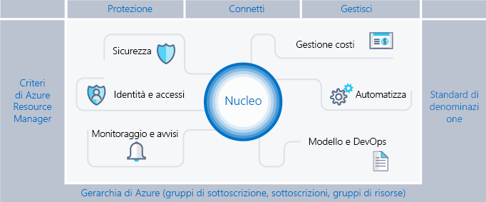

# Scaffold Azure enterprise: governance prescrittiva per le sottoscrizioni

Le organizzazioni stanno adottando sempre di più il cloud pubblico per la sua agilità e la sua flessibilità. Utilizzano i punti di forza del cloud per generare ricavi e ottimizzare l'uso delle risorse per l'azienda. Microsoft Azure fornisce numerosi servizi e funzionalità che le organizzazioni assemblano come blocchi predefiniti per affrontare le esigenze di una vasta gamma di applicazioni e carichi di lavoro.

L'unico punto di partenza per ottenere i vantaggi del cloud è decidere di usare Microsoft Azure. Il secondo passaggio è comprendere come l'azienda può usare Azure in modo efficace e identificare le funzionalità di base da adottare per rispondere a domande come:

* "Mi preoccupa la sovranità dei dati. Come è possibile assicurarsi che i dati e i sistemi soddisfino i requisiti normativi?"
* "Come è possibile determinare cosa è supportato da ogni risorsa, in modo da poterlo giustificare e fatturare con precisione?"
* "Vorrei avere la certezza che tutto ciò che viene distribuito o eseguito nel cloud pubblico abbia come priorità la sicurezza. Come posso fare?"

La prospettiva di una sottoscrizione vuota e senza barriere .è scoraggiante Questo spazio vuoto può ostacolare la migrazione ad Azure.

Questo articolo offre un punto di partenza per i professionisti tecnici, in modo da aiutarli a soddisfare le esigenze in termini di governance e bilanciarle con la richiesta di agilità. Introduce il concetto di un scaffold enterprise per guidare le organizzazioni nell'implementazione e nella gestione degli ambienti Azure in un modo sicuro. Fornisce il framework per sviluppare controlli efficienti ed efficaci.

## Esigenza di governance

Durante il passaggio ad Azure, è necessario affrontare in anticipo l'argomento della governance per garantire il corretto uso del cloud all'interno dell'organizzazione. Purtroppo, il tempo necessario e le procedure per creare un sistema di governance completo implicano che alcuni gruppi aziendali si rivolgano direttamente ai provider senza coinvolgere l'IT aziendale. Se le risorse non vengono gestite correttamente, questo approccio rischia di lasciare l'azienda in balia dei compromessi. Le caratteristiche del cloud pubblico, cioè agilità, flessibilità e prezzi in base al consumo, sono importanti per i gruppi aziendali che devono soddisfare rapidamente le richieste dei clienti (interni ed esterni). Tuttavia, l'IT aziendale deve assicurarsi che i dati e i sistemi siano protetti in modo efficace.

Quando si costruisce un edificio, viene usata un'impalcatura (in inglese scaffold) per creare l'intelaiatura della struttura. Questa impalcatura descrive la struttura generale e fornisce punti di ancoraggio per il montaggio di sistemi più permanenti. Un scaffold enterprise è lo stesso: un set di controlli flessibili e funzionalità di Azure che forniscono la struttura per l'ambiente e punti di ancoraggio per servizi basati su cloud pubblico. Fornisce ai generatori (IT e gruppi aziendali) una base per creare e collegare nuovi servizi, tenendo a mente l'importanza della velocità di distribuzione.

Lo scaffold si basa su procedure raccolte attraverso le varie interazioni con i client di diverse dimensioni. Questi client spaziano da organizzazioni di piccole dimensioni che sviluppano soluzioni nel cloud a grandi aziende e fornitori di software indipendenti che stanno eseguendo la migrazione dei carichi di lavoro e sviluppando soluzioni con cloud nativo. Lo scaffold enterprise è costruito appositamente in modo da essere flessibile e supportare i carichi di lavoro IT tradizionali e flessibili; ad esempio, gli sviluppatori che creano applicazioni software come servizio (SaaS) in base alle funzionalità della piattaforma Azure.

Lo scaffold enterprise deve essere la base di ogni nuova sottoscrizione all'interno di Azure. Consente agli amministratori di verificare che i carichi di lavoro soddisfino i requisiti minimi di governance di un'organizzazione senza impedire che i gruppi e gli sviluppatori aziendali soddisfino i propri obiettivi. La nostra esperienza mostra che questo accelera notevolmente, invece di ostacolare, la crescita del cloud pubblico.

> [!NOTE]
> Microsoft ha rilasciato in anteprima una nuova funzionalità denominata [Azure Blueprint](/azure/governance/blueprints/overview) che consentirà di creare pacchetti, gestire e distribuire immagini, modelli, criteri e script comuni tra le sottoscrizioni e i gruppi di gestione. Questa funzionalità fa da ponte tra lo scopo dello scaffold come modello di riferimento e la distribuzione di tale modello all'organizzazione.
>
L'immagine seguente mostra i componenti dello scaffold. Le fondamenta sono rappresentate da un saldo piano per la gerarchia di gestione e le sottoscrizioni. Le colonne sono i criteri di Resource Manager e saldi standard di denominazione. Il resto dello scaffold è rappresentato dalle principali funzionalità di Azure e dalle funzioni che garantiscono e connettono un ambiente protetto e gestibile.

## Definire la gerarchia

Le fondamenta dello scaffold sono rappresentate dalla gerarchia e dalla relazione tra l'iscrizione ad Azure enterprise e le sottoscrizioni e i gruppi di risorse. L'iscrizione enterprise definisce la forma e l'uso dei servizi Azure all'interno di una società da un punto di vista contrattuale. All'interno del contratto enterprise, è possibile suddividere ulteriormente l'ambiente in reparti, account e, infine, sottoscrizioni e gruppi di risorse che corrispondano alla struttura dell'organizzazione.

Una sottoscrizione Azure è l'unità di base che contiene tutte le risorse. Definisce anche diversi limiti all'interno di Azure, ad esempio il numero di memorie centrali, reti virtuali e altre risorse. I gruppi di risorse di Azure vengono usati per perfezionare il modello di sottoscrizione e consentire un raggruppamento di risorse più naturale.

Ogni azienda è diversa e la gerarchia nell'immagine sopra consente una notevole flessibilità nell'organizzazione di Azure all'interno della società. La creazione di un modello della gerarchia per riflettere le esigenze della società in termini di fatturazione, gestione delle risorse e accesso alle risorse è la prima decisione, nonché la più importante, da prendere quando si inizia a usare il cloud pubblico.

### Reparti e account

I tre modelli comuni per le iscrizioni ad Azure sono:

* Il modello **funzionale**

    
* Il modello **business unit**

    
* Il modello **geografico**

    

Anche se ognuno di questi modelli ha un suo posto, il modello **business unit** viene sempre più spesso adottato per la sua flessibilità nella creazione di modelli di costo dell'organizzazione e per riflettere il campo di controllo. Il gruppo Microsoft Core Engineering and Operations ha creato un set secondario molto efficace del modello **business unit**, modellato su **Federal**, **State** e **Local**. Per altre informazioni, vedere [Organizing subscriptions and resource groups within the Enterprise](https://azure.microsoft.com/blog/organizing-subscriptions-and-resource-groups-within-the-enterprise/) (Organizzare sottoscrizioni e gurppi di risorse all'interno dell'azienda).

### Gruppi di gestione

Di recente Microsoft ha rilasciato un nuovo modo di creare modelli per la gerarchia: [i gruppi di gestione di Azure](/azure/azure-resource-manager/management-groups-overview). I gruppi di gestione sono molto più flessibili rispetto a reparti e account e possono essere nidificati fino a sei livelli. I gruppi di gestione consentono di creare una gerarchia separata dalla gerarchia di fatturazione, esclusivamente per la gestione efficiente delle risorse. I gruppi di gestione possono eseguire il mirroring della gerarchia di fatturazione e spesso le aziende iniziano in questo modo. Tuttavia, la potenza dei gruppi di gestione si afferma quando vengono usati per creare un modello per l'organizzazione in cui le sottoscrizioni correlate &mdash; indipendentemente dal fatto che si trovino nella gerarchia di fatturazione &mdash; vengono raggruppate e hanno bisogno di ruoli comuni assegnati, nonché di criteri e iniziative. Alcuni esempi:

* **Ambiente di produzione/non di produzione**. Alcune organizzazioni creano gruppi di gestione per identificare le sottoscrizioni di produzione e non di produzione. I gruppi di gestione consentono a questi clienti di gestire più facilmente ruoli e criteri. Ad esempio, la sottoscrizione non di produzione può consentire agli sviluppatori l'accesso in qualità di collaboratore, ma nell'ambiente di produzione tali sviluppatori hanno solo l'accesso di lettore.
* **Servizi interni/esterni**. In modo molto simile agli ambienti di produzione/non di produzione, le aziende hanno spesso requisiti, criteri e ruoli diversi per servizi interni ed esterni (destinati ai clienti).

I gruppi di gestione ben congegnati sono, insieme a criteri e iniziative di Azure, la base di una governance efficiente di Azure.

### Sottoscrizioni

Quando si prendono decisioni su reparti e account (o gruppi di gestione), principalmente si cerca di capire come dividere l'ambiente di Azure per farlo corrispondere all'organizzazione. Le sottoscrizioni, tuttavia, sono i punti in cui viene eseguito il lavoro reale e le decisioni che le riguardano influiscono su sicurezza, scalabilità e fatturazione.  Molte organizzazioni cercano come guide i criteri seguenti:

* **Applicazione/Servizio**: la sottoscrizione rappresenta un'applicazione o un servizio (un portfolio di applicazioni)
* **Ciclo di vita**: le sottoscrizioni rappresentano il ciclo di vita di un servizio, ad esempio produzione o sviluppo.
* **Reparto**: le sottoscrizioni rappresentano i reparti dell'organizzazione.

I primi due criteri, quelli più usati, sono entrambi vivamente consigliati. L'approccio "ciclo di vita" è appropriato per la maggior parte delle organizzazioni. In questo caso, il consiglio generale è quello di usare due sottoscrizioni di base, "di produzione" e "non di produzione" e quindi usare i gruppi di risorse per suddividere ulteriormente gli ambienti.

### Gruppi di risorse

Azure Resource Manager consente di inserire le risorse in gruppi significativi per gestione, fatturazione o affinità naturale. I gruppi di risorse sono contenitori di risorse che hanno un ciclo di vita comune o condividono un attributo, ad esempio "Tutti i server SQL" o "Applicazione A".

I gruppi di risorse non possono essere nidificati e le risorse possono appartenere a un solo gruppo di risorse. Alcune azioni possono essere applicate a tutte le risorse di un gruppo di risorse. Ad esempio, l'eliminazione di un gruppo di risorse comporta la rimozione di tutte le risorse all'interno del gruppo di risorse. Come per le sottoscrizioni, ci sono criteri comuni durante la creazione di gruppi di risorse, che variano da carichi di lavoro di tipo "IT tradizionale" a "IT agile":

* I carichi di lavoro di tipo "IT tradizionale" sono più comunemente raggruppati in base agli elementi all'interno di uno stesso ciclo di vita, ad esempio un'applicazione. Il raggruppamento in base all'applicazione consente la gestione di singole applicazioni.
* I carichi di lavoro di tipo "IT agile" tendono a concentrarsi su applicazioni cloud orientate ai clienti esterni. I gruppi di risorse spesso riflettono i livelli di distribuzione (ad esempio livello Web, livello app) e gestione.

> [!NOTE]
> Conoscere il carico di lavoro aiuta a sviluppare una strategia di gruppo di risorse. Questi modelli possono essere mischiati e combinati. Ad esempio, un gruppo di risorse di servizi condivisi nella stessa sottoscrizione come gruppi di risorse "agile".

## Standard di denominazione

Il primo pilastro dello scaffolding è uno standard di denominazione coerente. Standard di denominazione ben progettati consentono di identificare le risorse nel portale, in una fattura e all'interno degli script. È probabile che si disponga già di standard di denominazione per l'infrastruttura locale. Quando si aggiunge Azure all'ambiente, è opportuno estendere tali standard di denominazione alle risorse di Azure.

> [!TIP]
> Per le convenzioni di denominazione:
> * Esaminare [Patterns and Practices guidance (Linee guida su modelli e procedure)](https://docs.microsoft.com/en-us/azure/architecture/best-practices/naming-conventions) e adottarle dove possibile. Queste linee guida consentono di stabilire uno standard di denominazione significativo e offre esempi dettagliati.
> * Usare i criteri di Resource Manager per applicare gli standard di denominazione
>
>Occorre tenere presente che è difficile modificare i nomi in un secondo momento, pertanto spendere alcuni minuti a farlo a questo punto consentiranno di non dover affrontare problemi più avanti.

È necessario concentrare gli standard di denominazione sulle risorse usate e cercate più comunemente.  Ad esempio, tutti i gruppi di risorse devono seguire uno standard sicuro per maggiore chiarezza.

### Tag delle risorse

I tag delle risorse sono strettamente allineati agli standard di denominazione. Man mano che le risorse vengono aggiunte alle sottoscrizioni, diventa sempre più importante categorizzarle in maniera logica a scopo di fatturazione, gestione e svolgimento delle operazioni. Per altre informazioni, vedere [Usare tag per organizzare le risorse di Azure](https://docs.microsoft.com/en-us/azure/azure-resource-manager/resource-group-using-tags).

> [!IMPORTANT]
> I tag possono contenere informazioni personali ed essere sottoposti alle normative del GDPR. Pianificare con attenzione la gestione dei tag. Per informazioni generali sul GDPR, vedere la sezione di [Service Trust Portal](https://servicetrust.microsoft.com/ViewPage/GDPRGetStarted) dedicata al GDPR.

I tag vengono usati in molti modi, oltre a fatturazione e gestione. Spesso vengono usati nell'ambito dell'automazione (vedere la sezione successiva). Se non affrontati in anticipo, possono verificarsi conflitti. La procedura consigliata consiste nell'identificare tutti i tag comuni a livello aziendale (ad esempio ApplicationOwner, CostCenter) e applicarli in modo coerente quando si distribuiscono risorse usando l'automazione.

## Iniziative e criteri di Azure

Il secondo pilastro dello scaffolding comporta l'uso di [iniziative e criteri di Azure](/azure/azure-policy/azure-policy-introduction) per gestire i rischi con l'applicazione di regole (con effetti) su risorse e servizi nelle proprie sottoscrizioni. Le iniziative di Azure sono raccolte di criteri progettati per raggiungere un unico obiettivo. Le iniziative e i criteri di Azure vengono quindi assegnati a un ambito di risorse per iniziare l'applicazione dei criteri specifici.
<Immagine di iniziative/criteri/assegnazioni>

Le iniziative e criteri di Azure sono ancora più potenti quando usati con i gruppi di gestione indicati in precedenza. I gruppi di gestione consentono l'assegnazione di un'iniziativa o dei criteri a un intero set di sottoscrizioni.

### Uso comune dei criteri di Resource Manager

I criteri e le risorse di Azure sono potenti strumenti del toolkit di Azure. I criteri consentono alle società di offrire controlli per i carichi di lavoro "IT tradizionale" che garantiscono la stabilità necessaria per le applicazioni line-of-business, consentendo allo stesso tempo carichi di lavoro "agile", ad esempio, lo sviluppo di applicazioni dei clienti senza esporre l'azienda ad altri rischi. I modelli più diffusi che vediamo per i criteri sono:

* **Conformità geografica/sovranità dei dati**. Azure dispone di un elenco sempre crescente di aree geografiche in tutto il mondo. Le aziende spesso devono garantire che le risorse in un ambito specifico restino in un'area geografica per soddisfare i requisiti normativi.
* **Evitare di esporre pubblicamente i server**. I criteri di Azure possono impedire la distribuzione di determinati tipi di risorse. Un uso comune consiste nel creare un criterio per impedire la creazione di un indirizzo IP pubblico all'interno di un determinato ambito, evitando l'esposizione non prevista di un server a Internet.
* **Gestione dei costi e metadati**. I tag delle risorse vengono spesso usati per aggiungere importanti dati di fatturazione e gruppi di risorse, ad esempio CostCenter, Owner e altro ancora. Questi tag hanno un'importanza inestimabile per fatturare e gestire con precisione le risorse. I criteri possono imporre l'applicazione di tag a tutte le risorse distribuite, rendendole più facili da gestire.

### Usi comuni delle iniziative

L'introduzione delle iniziative offre alle aziende un modo per raggruppare i criteri logici e tenerne traccia nel complesso. Le iniziative supportano ulteriormente l'azienda per soddisfare le esigenze dei carichi di lavoro di tipo "agile" e "tradizionale". Si è assistito a usi molto creativi delle iniziative, ma comunemente si osservano i casi seguenti:

* **Abilitare il monitoraggi nel Centro sicurezza di Azure**. Si tratta di un'iniziativa predefinita in Criteri di Azure e di un esempio eccellente di cos'è un'iniziativa. Abilita i criteri che identificano i database SQL non crittografati, le vulnerabilità delle macchine virtuali e le esigenze più comuni legate alla sicurezza.
* **Iniziativa specifica in base ai requisiti normativi**. Spesso le aziende raggruppano i criteri comuni a un requisito normativo (ad esempio HIPAA) in modo che i controlli e la conformità a tali controlli vengano monitorati in modo efficiente.
* **SKU e tipi di risorse**. La creazione di un'iniziativa che limita i tipi di risorse che possono essere distribuite, nonché gli SKU che possono essere distribuiti, può contribuire a controllare i costi e a garantire che l'organizzazione distribuisca solo le risorse per le quali il team dispone delle procedure.

> [!TIP]
> È consigliabile usare sempre le definizioni delle iniziative invece di quelle dei criteri. Dopo aver assegnato un'iniziativa a un ambito, ad esempio una sottoscrizione o un gruppo di gestione, è possibile aggiungere facilmente un altro criterio all'iniziativa senza dover modificare le assegnazioni. In questo modo si semplificano la comprensione di ciò che viene applicato e il monitoraggio della conformità.

### Assegnazioni di criteri e iniziative

Dopo aver creato i criteri e averli raggruppati in iniziative logiche, è necessario assegnarli a un ambito, che può essere un gruppo di gestione, una sottoscrizione o perfino un gruppo di risorse. Le assegnazioni consentono anche di escludere un ambito secondario dall'assegnazione dei criteri. Ad esempio, se si nega la creazione di indirizzi IP pubblici in una sottoscrizione, è possibile creare un'assegnazione con un'esclusione per un gruppo di risorse connesso alla rete perimetrale protetta.

Sono disponibili diversi esempi di criteri che mostrano come iniziative e criteri possono essere applicati a varie risorse all'interno di Azure in questo repository [GitHub](https://github.com/Azure/azure-policy).

## Gestione delle identità e dell'accesso

Una delle prime e più cruciali domande che ci si pone quando si inizia a usare il cloud pubblico è chi deve avere accesso alle risorse e come è possibile controllare tale accesso. È fondamentale consentire o impedire l'accesso al portale di Azure e controllare l'accesso alle risorse del portale per garantire il successo e la sicurezza a lungo termine delle risorse nel cloud.

Per portare a termine l'attività di protezione dell'accesso alle risorse, innanzitutto bisognerà configurare il provider di identità, quindi ruoli e accessi. Azure Active Directory (Azure AD), connesso ad Active Directory locale, è la base dell'identità di Azure. È però necessario tenere a mente che Azure AD *non* è Active Directory ed è importante comprendere che cos'è un tenant di Azure AD e qual è la sua relazione con l'iscrizione ad Azure.  Consultare le [informazioni](../getting-started/azure-resource-access.md) disponibili per acquisire solide conoscenze di base su Azure AD e AD. Per connettere e sincronizzare Active Directory ad Azure AD, installare e configurare lo [strumento AD Connect](/azure/active-directory/connect/active-directory-aadconnect) in locale.

Quando Azure è stato originariamente rilasciato, i controlli degli accessi a una sottoscrizione erano elementari: Amministratore o Coamministratore. L'accesso a una sottoscrizione nel modello classico implicava l'accesso a tutte le risorse del portale. Questa mancanza di un controllo granulare ha portato alla proliferazione di sottoscrizioni per fornire un livello ragionevole di controllo degli accessi per un'iscrizione ad Azure. La proliferazione di sottoscrizioni non è più necessaria. Con il controllo degli accessi in base al ruolo, è possibile assegnare utenti ai ruoli standard che garantiscono i tipi di accesso più comuni, ad esempio "proprietario", "collaboratore" o "lettore"; è perfino possibile creare ruoli personalizzati

Quando si implementa l'accesso in base al ruolo, è consigliabile tenere presente gli aspetti seguenti:

* Controllare l'amministratore/il coamministratore di una sottoscrizione, perché questi ruoli dispongono delle autorizzazioni complete. È necessario aggiungere il proprietario della sottoscrizione come coamministratore solo se deve gestire distribuzioni classiche di Azure.

* Usare i gruppi di gestione per assegnare i [ruoli](/azure/azure-resource-manager/management-groups-overview#management-group-access) in più sottoscrizioni e ridurre il carico derivante dalla gestione a livello di sottoscrizione.
* Aggiungere gli utenti di Azure a un gruppo (ad esempio, Proprietari dell'applicazione X) in Active Directory. Utilizzare il gruppo sincronizzato per fornire ai membri del gruppo i diritti appropriati per gestire il gruppo di risorse contenente l'applicazione.
* Seguire il principio di concedere il **privilegio minimo** necessario per svolgere il lavoro previsto.

> [!IMPORTANT]
>È consigliabile usare le funzionalità di [Azure AD Privileged Identity Management](/azure/active-directory/privileged-identity-management/pim-configure), Azure [Multi-Factor Authentication](/azure/active-directory/authentication/howto-mfa-getstarted) e [accesso condizionale](/azure/active-directory/active-directory-conditional-access-azure-portal) per offrire migliore protezione e maggiore visibilità sulle azioni amministrative nelle sottoscrizioni di Azure. Queste funzionalità provengono da una licenza Azure AD Premium valida (a seconda della funzione) per proteggere e gestire ulteriormente l'identità. Azure AD PIM fornisce all'accesso amministrativo "JIT" il flusso di lavoro di approvazione, oltre al controllo completo delle attività e delle attivazioni dell'amministratore. Azure MFA è un'altra funzionalità critica, che consente la verifica in due passaggi per l'accesso al portale di Azure. In combinazione con i controlli per l'accesso condizionale, consente di gestire efficacemente il rischio di compromissione.

Una delle migliori strategie per mitigare i rischi che è possibile adottare ed è consigliabile considerare obbligatoria per ogni distribuzione consiste nel pianificare e preparare l'identità e i controlli degli accessi e seguire la procedura consigliata di Azure Identity Management ([collegamento](/azure/security/azure-security-identity-management-best-practices)).

## Sicurezza

Uno dei principali ostacoli per l'adozione del cloud è generalmente rappresentato dalle preoccupazioni legate alla sicurezza. I responsabili della gestione dei costi dell'IT e i reparti della sicurezza devono assicurarsi che le risorse in Azure siano al sicuro e protette per impostazione predefinita. Azure offre numerose funzionalità che è possibile usare per proteggere le risorse e rilevare o impedire le minacce per tali risorse.

### Centro sicurezza di Azure

Il [Centro sicurezza di Azure](/azure/security-center/security-center-intro) offre una visualizzazione unificata dello stato della sicurezza delle risorse nell'intero ambiente oltre alla protezione avanzata dalle minacce. Il Centro sicurezza di Azure è una piattaforma aperta che consente ai partner Microsoft di creare un software che si inserisce al suo interno e ne migliora le funzionalità. Le funzionalità di base del Centro sicurezza di Azure (livello gratuito) forniscono una valutazione e consigli che consentono di migliorare le condizioni di sicurezza. I livelli a pagamento offrono funzionalità aggiuntive e preziose, ad esempio l'accesso amministrativo JIT e controlli adattivi delle applicazioni (creazione dell'elenco di elementi consentiti).

> [!TIP]
>Il Centro sicurezza di Azure è uno strumento molto potente che viene costantemente migliorato e incorpora nuove funzionalità che è possibile sfruttare per rilevare le minacce e proteggere l'azienda. È altamente consigliabile abilitare sempre il Centro sicurezza di Azure.

### Blocchi per le risorse di Azure

Man mano che l'organizzazione aggiunge servizi di base alle sottoscrizioni, diventa sempre più importante evitare l'interruzione delle attività aziendali. Un tipo di interruzione che è possibile notare spesso è costituito dalle conseguenze impreviste di script e strumenti che ostacolano le sottoscrizioni di Azure eliminando accidentalmente le risorse. I [blocchi per le risorse](/azure/azure-resource-manager/resource-group-lock-resources) consentono di limitare le operazioni sulle risorse di valore elevato in cui la modifica o l'eliminazione potrebbe avere un impatto significativo. I blocchi vengono applicati a una sottoscrizione, a un gruppo di risorse o persino a singole risorse. Il caso d'uso più comune consiste nell'applicare blocchi a risorse fondamentali come reti virtuali, gateway, gruppi di sicurezza di rete e account di archiviazione delle chiavi.

### Toolkit Secure DevOps

"Secure DevOps Kit for Azure" (AzSK) è una raccolta di script, strumenti, estensioni, automazioni e così via, originariamente creata dal team IT di Microsoft e rilasciata in OpenSource tramite Github ([collegamento](https://github.com/azsk/DevOpsKit-docs)). AzSK soddisfa le esigenze di sicurezza delle risorse e delle sottoscrizioni end-to-end di Azure per i team usando un'automazione completa e integrando perfettamente la sicurezza nei flussi di lavoro DevOps nativi per aiutare a eseguire operazioni di sviluppo sicure in queste 6 aree:

* Proteggere la sottoscrizione
* Offrire uno sviluppo sicuro
* Integrare la sicurezza nelle procedure CICD
* Controllo continuativo
* Invio di avvisi e monitoraggio
* Governance dei rischi per il cloud

AzSK è un set completo di strumenti, script e informazioni importanti per un piano di governance di Azure completo e la sua integrazione nello scaffold è fondamentale per supportare gli obiettivi di gestione dei rischi delle organizzazioni

### Gestione aggiornamenti di Azure

Una delle attività principali da eseguire per proteggere l'ambiente è garantire che i server vengano protetti con gli aggiornamenti più recenti. Sebbene vi siano molti strumenti per eseguire questa operazione, Azure offre la soluzione [Gestione aggiornamenti di Azure](/azure/automation/automation-update-management) per risolvere l'identificazione e l'implementazione di patch critiche per il sistema operativo.  Usa Automazione di Azure (descritta nella sezione [Automatizzare](#automate), più avanti in questa guida.

## Monitoraggio e avvisi

Raccogliere e analizzare i dati di telemetria che forniscono una visuale sulle attività, le metriche delle prestazioni, l'integrità e la disponibilità dei servizi in uso in tutte le sottoscrizioni di Azure è essenziale per gestire in modo proattivo le applicazioni e l'infrastruttura, inoltre è un'esigenza fondamentale per ogni sottoscrizione di Azure. Ogni servizio di Azure genera dati di telemetria sotto forma di log attività, metriche e log di diagnostica.

* I **log attività** descrivono tutte le operazioni eseguite sulle risorse nelle sottoscrizioni
* Le **metriche** sono informazioni numeriche generate all'interno di una risorsa che ne descrivono le prestazioni e l'integrità
* I **log di diagnostica** sono generati da un servizio di Azure e offrono dati completi e frequenti sul funzionamento del servizio stesso.

È possibile visualizzare e intervenire su queste informazioni su più livelli e vengono introdotti miglioramenti costanti. Azure offre funzionalità di monitoraggio **condivise**, **fondamentali** e **approfondite** sulle risorse di Azure attraverso i servizi descritti nel diagramma seguente.

### Funzionalità condivise

* **Avvisi**: è possibile raccogliere ogni log, evento e metrica dalle risorse di Azure, ma, senza la possibilità di ricevere comunicazioni sulle condizioni critiche e agire, i dati sono utili solo a scopi statistici e di indagine. Gli avvisi di Azure comunicano in modo proattivo le condizioni definite dall'utente in tutte le applicazioni e nell'infrastruttura. Le regole di avviso vengono create in log, eventi e metriche che usano gruppi di azioni per comunicare a gruppi di destinatari. I gruppi di azioni offrono anche la possibilità di automatizzare la correzione tramite azioni esterne, ad esempio i webhook per eseguire i runbook di Automazione di Azure e Funzioni di Azure.

* **Dashboard**: i dashboard consentono di aggregare le viste di monitoraggio e combinare i dati all'interno di risorse e sottoscrizioni per offrire una visualizzazione a livello aziendale dei dati di telemetria delle risorse di Azure. È possibile creare e configurare le proprie visualizzazioni e condividerle con altri utenti. Ad esempio, è possibile creare un dashboard costituito da diverse sezioni per fare in modo che gli amministratori di database offrano informazioni in tutti i servizi di database di Azure, tra cui database SQL di Azure, database di Azure per PostgreSQL e database di Azure per MySQL.

* **Esplora metriche**: le metriche sono valori numerici generati dalle risorse di Azure (ad esempio % della CPU, I/O disco), che consentono di comprendere il funzionamento e le prestazioni delle risorse. Usando Esplora metriche è possibile definire e inviare a Log Analytics le metriche a cui si è interessati per l'aggregazione e l'analisi.

### Monitoraggio di base

* **Monitoraggio di Azure**: è il servizio di piattaforma di base che mette a disposizione un'unica origine per monitorare le risorse di Azure. L'interfaccia del portale di Azure per Monitoraggio di Azure rappresenta un punto di partenza centralizzato per tutte le funzioni di monitoraggio di Azure, incluse le funzionalità di monitoraggio approfondito garantite da Application Insights, Log Analytics, monitoraggio della rete, soluzioni di monitoraggio e mapping dei servizi. Con Monitoraggio di Azure è possibile visualizzare, eseguire query, instradare, archiviare ed effettuare operazioni sulle metriche e sui log provenienti dalle risorse di Azure nell'intero cloud. Oltre che con il portale, è possibile recuperare i dati tramite i cmdlet di PowerShell di monitoraggio, l'interfaccia della riga di comando tra piattaforme o le API REST di Monitoraggio di Azure.

* **Azure Advisor**: monitora costantemente i dati di telemetria nelle sottoscrizioni e negli ambienti e fornisce consigli sulle procedure consigliate per ottimizzare le risorse di Azure in modo da risparmiare denaro e aumentare prestazioni, sicurezza e disponibilità delle risorse che compongono le applicazioni.

* **Integrità dei servizi**: identifica eventuali problemi con i servizi di Azure che potrebbero influire sulle applicazioni e assistere nella programmazione delle finestre di manutenzione pianificata.

* **Log attività**: descrive tutte le operazioni eseguite sulle risorse nelle sottoscrizioni. Offre un audit trail per determinare il cosa, il chi e il quando di qualsiasi operazione di creazione, aggiornamento ed eliminazione effettuata sulle risorse. Gli eventi del log attività vengono archiviati nella piattaforma e sono disponibili per le query per 90 giorni. È possibile inserire i log attività in Log Analytics per periodi di conservazione più lunghi e query e analisi più approfondite in varie risorse.

### Monitoraggio avanzato delle applicazioni

* **Application Insights**: consente di raccogliere dati di telemetria specifici delle applicazioni e monitorare prestazioni, disponibilità e uso delle applicazioni nel cloud o in locale. È possibile instrumentare l'applicazione con SDK supportati per più linguaggi, tra cui .NET, JavaScript, JAVA, Node. js, Ruby e Python. Gli eventi di Application Insights vengono inseriti nello stesso archivio dati di Log Analytics che supporta l'infrastruttura e il monitoraggio della protezione per consentire di correlare e aggregare gli eventi nel tempo grazie a un linguaggio di query avanzato.

### Monitoraggio avanzato dell'infrastruttura

* **Log Analytics**: svolge un ruolo essenziale nel monitoraggio di Azure, raccogliendo dati di telemetria e di altro tipo da diverse origini e fornendo un linguaggio di query e un motore di analisi che offrono informazioni dettagliate sul funzionamento delle applicazioni e delle risorse. È possibile interagire direttamente con i dati di Log Analytics tramite ricerche nei log e visualizzazioni dalle prestazioni elevate oppure è possibile usare gli strumenti di analisi in altri servizi di Azure che archiviano i rispettivi dati in Log Analytics, ad esempio Application Insights o il Centro sicurezza di Azure.

* **Monitoraggio di rete**: i servizi di monitoraggio di rete di Azure consentono di acquisire informazioni su flusso, prestazioni, sicurezza, connettività e colli di bottiglia del traffico di rete. Una rete ben progettata deve includere la configurazione di servizi di monitoraggio di rete di Azure, ad esempio Network Watcher ed ExpressRoute Monitor.

* **Soluzioni di gestione**: sono pacchetti di set di logica, informazioni e query di Log Analytics predefinite per un'applicazione o un servizio. Si basano su Log Analytics per archiviare e analizzare i dati dell'evento. Esempi di soluzioni di gestione includono il monitoraggio dei contenitori e l'analisi dl database SQL di Azure.

* **Mapping dei servizi**: fornisce una panoramica grafica dei componenti dell'infrastruttura, dei loro processi e delle interconnessioni con altri computer e processi esterni. Integra eventi, dati sulle prestazioni e soluzioni di gestione in Log Analytics.

> [!TIP]
> Prima di creare singoli avvisi, creare e gestire un insieme di gruppi di azioni condivisi che possano essere usati negli avvisi di Azure. Questo consentirà di gestire a livello centrale il ciclo di vita degli elenchi di destinatari, i metodi di recapito delle notifiche (indirizzi di posta elettronica, numeri di telefono per gli SMS) e i webhook per le azioni esterne (runbook di Automazione di Azure, Funzioni di Azure/App per la logica, Gestione dei servizi IT).

## Gestione dei costi

Una delle principali modifiche che si dovranno affrontare al momento del passaggio dal cloud locale al cloud pubblico è il passaggio da CAPEX (acquisto dell'hardware) a OPEX (pagamento per il servizio in base all'uso). Questo passaggio introduce anche la necessità di gestire i costi con maggiore attenzione. Il vantaggio del cloud è che consente di influire in modo significativo e positivo sul costo di un servizio in uso, semplicemente disabilitandolo (o ridimensionandolo) quando non serve. La gestione deliberata dei costi nel cloud è una procedura consigliata che i clienti più accorti svolgono ogni giorno.

Microsoft offre vari strumenti che consentono di visualizzare, controllare e gestire i costi. Viene inoltre offerto un set completo di API per personalizzare e integrare la gestione dei costi negli strumenti e nei dahsboard degli utenti. Questi strumenti sono raggruppati in modo generico in funzionalità del portale di Azure e funzionalità esterne

### Funzionalità del portale di Azure

Sono strumenti per fornire informazioni immediate sul costo, nonché la possibilità di eseguire azioni

* **Costo delle risorse di sottoscrizione**: la visualizzazione con l'[analisi dei costi di Azure](/azure/cost-management/overview) consente di osservare rapidamente i costi e le informazioni sulla spesa giornaliera in base alla risorsa o al gruppo di risorse.
* **Gestione costi di Azure**: questo prodotto, che deriva dall'acquisto di Cloudyn da parte di Microsoft, consente di gestire e analizzare la spesa di Azure e i costi legati ad altri provider di cloud pubblico. Esistono sia livelli gratuiti che a pagamento, con l'ampia gamma di funzionalità viste nella [panoramica](/azure/cost-management/overview).
* **Budget di Azure e gruppi di azioni**: conoscere i costi di qualcosa e intervenire per controllarli ha comportato finora soprattutto attività manuali. Con l'introduzione dei budget e delle API di Azure, è ora possibile creare azioni (come illustrato in [questo](https://channel9.msdn.com/Shows/Azure-Friday/Managing-costs-with-the-Azure-Budgets-API-and-Action-Groups) esempio) quando i costi raggiungono una soglia. Ad esempio, arrestare un gruppo di risorse di test quando raggiunge il 100% del budget dedicato o [altro esempio].
* **Azure Advisor**: conoscere i costi di qualcosa è solo uno dei punti fondamentali; l'altro è sapere a quale scopo usare tali informazioni. [Azure Advisor](/azure/advisor/advisor-overview) offre consigli su come intervenire per risparmiare denaro, migliorare l'affidabilità o perfino aumentare la sicurezza.

### Strumenti esterni per la gestione dei costi

* **Informazioni dettagliate sul consumo di Azure per Power BI**. Se si desidera creare visualizzazioni personalizzate per l'organizzazione, il pacchetto di contenuto Informazioni dettagliate sul consumo di Azure per Power BI è lo strumento da scegliere. Usando questo pacchetto di contenuto e Power BI è possibile creare visualizzazioni personalizzate per rappresentare l'organizzazione, eseguire un'analisi più approfondita sui costi e aggiungere altre origini dati per un ulteriore arricchimento.

* **API sul consumo**. Le [API sul consumo](/rest/api/consumption/) offrono l'accesso programmatico ai dati su costi e uso, nonché informazioni su budget, istanze riservate e addebiti sul marketplace. Queste API sono accessibili solo per le iscrizioni Enterprise e alcune sottoscrizioni dirette sul Web, tuttavia offrono la possibilità di integrare i dati dei costi nei propri strumenti e data warehouse. È anche possibile accedere a queste API tramite l'interfaccia della riga di comando di Azure, come descritto [qui](/cli/azure/consumption?view=azure-cli-latest).

Osservando i clienti che usano il cloud da molto tempo e hanno acquisito familiarità, notiamo che ci sono diverse procedure consigliate

* **Monitorare attivamente i costi**. Le organizzazioni che hanno familiarità con Azure monitorano costantemente i costi e intraprendono azioni quando necessario. Alcune organizzazioni dispongono perfino di persone dedicate a effettuare analisi e suggerire modifiche all'uso; il costo di queste persone per l'organizzazione viene ammortizzato già dalla prima volta che trovano un cluster HDInsight inutilizzato in uso da mesi.
* **Usare istanze riservate**. Un altro tenant chiave per gestire i costi nel cloud consiste nell'usare lo strumento appropriato per il processo. Se si dispone di una macchina virtuale IaaS che deve restare attiva 24 ore al giorno, 7 giorni la settimana, l'uso di un'istanza riservata garantisce un risparmio significativo. Per trovare il giusto equilibrio tra l'automatizzazione dell'arresto delle macchine virtuali e l'uso delle istanze riservate servono analisi ed esperienza.
* **Usare l'automazione in modo efficace**: molti carichi di lavoro non richiedono l'esecuzione quotidiana. Perfino la disabilitazione di una macchina virtuale per 4 ore al giorno può garantire un risparmio del 15% sui costi. I costi dell'automazione verranno ammortizzati rapidamente.
* **Usare i tag delle risorse per acquisire visibilità**: come descritto in un altro punto di questo documento, l'uso dei tag delle risorse garantisce una migliore analisi dei costi.

La gestione costi è una disciplina fondamentale per eseguire un cloud pubblico in modo efficiente ed efficace. Le aziende che raggiungono il successo saranno in grado di controllare i costi e associarli alla domanda effettiva anziché effettuare acquisti in eccesso e sperare che arrivino richieste.

## Automatizzare

Una delle molte funzionalità che distinguono la familiarità delle organizzazioni con l'uso di provider cloud è il livello di automazione incorporato.  L'automazione è un processo che non finisce mai e, man mano che l'organizzazione passa al cloud, richiede un investimento di risorse e denaro.  L'automazione viene usata per molti scopi, tra cui l'implementazione costante di risorse (che si ricollega direttamente a un altro concetto di base dello scaffolding, cioè modelli e DevOps) per la correzione dei problemi.  L'automazione è il tessuto connettivo dello scaffold Azure e tiene insieme ogni area.

Durante lo sviluppo di questa funzionalità sono disponibili diversi strumenti, da strumenti Microsoft, come Automazione di Azure, Griglia di eventi e interfaccia della riga di comando di Azure, fino a un'ampia gamma di strumenti di terze parti come Terraform, Jenkins, Chef e Puppet (solo per citarne alcuni). Le basi che consentono al team addetto alle operazioni di procedere con l'automazione sono Automazione di Azure, Griglia di eventi e Azure Cloud Shell:

* **Automazione di Azure**: è una funzionalità basata sul cloud che consente di creare runbook (in PowerShell o Python) e di automatizzare i processi, configurare le risorse e perfino applicare patch.  [Automazione di Azure](/azure/automation/automation-intro) dispone di un'ampia gamma di funzionalità multipiattaforma che sono parte integrante della distribuzione ma sono troppo vaste per essere descritte in modo approfondito in questo articolo.
* **Griglia di eventi**: questo [servizio](/azure/event-grid) è un sistema per il routing di eventi completamente gestito che consente di rispondere agli eventi all'interno dell'ambiente Azure. Proprio come l'automazione è il tessuto connettivo delle organizzazioni cloud con esperienza, Griglia di eventi è il tessuto connettivo di una buona automazione. Con Griglia di eventi, è possibile creare un'azione semplice e serverless per inviare un messaggio di posta elettronica a un amministratore ogni volta che viene creata una nuova risorsa e registrare tale risorsa in un database. Questa stessa griglia di eventi può comunicare quando una risorsa viene eliminata e rimuovere l'elemento dal database.
* **Azure Cloud Shell**: è una [shell](/azure/cloud-shell/overview) interattiva e basata sul browser per gestire le risorse in Azure. Offre un ambiente completo per PowerShell o Bash, che viene avviato quando serve (ed è gestito per l'utente), in modo da disporre di un ambiente coerente da cui eseguire gli script. Azure Cloud Shell offre accesso a strumenti chiave aggiuntivi (già installati) per automatizzare l'ambiente, tra cui [interfaccia della riga di comando di Azure](/cli/azure/get-started-with-azure-cli?view=azure-cli-latest), [Terraform](/azure/virtual-machines/linux/terraform-install-configure) e un elenco sempre crescente di altri [strumenti](https://azure.microsoft.com/updates/cloud-shell-new-cli-tools-and-font-size-selection/) per gestire contenitori, database (sqlcmd) e altro ancora.

L'automazione è un processo a tempo pieno e diventerà rapidamente una delle attività operative più importanti per il team dedicato al cloud. Le organizzazioni che adottano l'approccio "automatizzare prima di tutto" hanno più successo quando usano Azure:

* Gestione dei costi: si impegnano attivamente per cercare opportunità e creare automazione al fine di ridimensionare le risorse, aumentare/ridurre le prestazioni e disabilitare le risorse inutilizzate.
* Flessibilità operativa: tramite l'uso dell'automazione (insieme a modelli e DevOps) si ottiene un livello di ripetibilità che aumenta la disponibilità, incrementa la sicurezza e consente al team di concentrarsi sulla risoluzione dei problemi aziendali.

## Modelli e DevOps

Come evidenziato nella sezione sull'automazione, l'obiettivo in qualità di organizzazione dovrebbe essere effettuare il provisioning delle risorse tramite script e modelli controllati attraverso il codice sorgente e ridurre al minimo la configurazione interattiva degli ambienti. Questo approccio, denominato di "infrastruttura come codice", insieme a un processo DevOps disciplinato per la distribuzione continua può garantire la coerenza e ridurre le differenze nei vari ambienti. Quasi tutte le risorse di Azure possono essere distribuite tramite [modelli JSON di Azure Resource Manager](/azure/azure-resource-manager/resource-group-template-deploy) in combinazione con PowerShell o con l'interfaccia della riga di comando multipiattaforma di Azure e strumenti come Terraform di Hashicorp (che garantisce un eccellente supporto ed è integrato in Azure Cloud Shell).

Gli articoli come [questo](https://blogs.msdn.microsoft.com/mvpawardprogram/2018/05/01/azure-resource-manager/) offrono ottime opportunità di discussione sulle procedure consigliate e sulle lezioni apprese applicando un approccio DevOps a modelli di Azure Resource Manager con la catena di strumenti [Azure DevOps](/azure/devops/user-guide/?view=vsts). Occorre dedicare un po' di tempo e di impegno a sviluppare un set di base di modelli specifici per i requisiti dell'organizzazione e a sviluppare pipeline per il recapito continuo con le catene di strumenti DevOps (Azure DevOp, Jenkins, Bamboo, Teamcity, Concourse), in particolare per gli ambienti di produzione e controllo di qualità. In GitHub è presente una vasta libreria di [modelli di avvio rapido di Azure](https://github.com/Azure/azure-quickstart-templates) che è possibile usare come punto di partenza per i modelli, inoltre è possibile creare rapidamente pipeline di distribuzione basate sul cloud con Azure DevOps.

Come procedura consigliata per le sottoscrizioni di produzione o i gruppi di risorse, l'obiettivo dovrebbe essere l'uso della protezione con controllo degli accessi in base al ruolo per impedire per impostazione predefinita gli utenti interattivi e utilizzare pipeline automatizzate di recapito continuo basate su entità servizio per effettuare il provisioning di tutte le risorse e distribuire tutto il codice dell'applicazione. Nessun amministratore o sviluppatore deve toccare il portale di Azure per configurare le risorse in modo interattivo. Questo livello di DevOps richiede un impegno congiunto e utilizza tutti i concetti dello scaffold Azure e offre un ambiente coerente e più sicuro che consentirà alle organizzazioni di aumentare il ridimensionamento.

> [!TIP]
> Durante la progettazione e lo sviluppo di modelli di Azure Resource Manager complessi, usare [modelli collegati](/azure/azure-resource-manager/resource-group-linked-templates) per organizzare ed effettuare il refactoring di relazioni complesse di risorse da file JSON compatti. Ciò consentirà di gestire le risorse singolarmente e rendere i modelli più leggibili, testabili e riutilizzabili.

Azure è un provider cloud di iperscalabilità e, nel passaggio dell'organizzazione dal mondo dei server locali al cloud, l'utilizzo degli stessi concetti usati dai provider cloud e dalle applicazioni SaaS consentirà all'organizzazione di rispondere alle esigenze dell'azienda in modo notevolmente più efficiente.

## Rete core

Il componente finale del modello di riferimento dello scaffold Azure è la base per la modalità in cui l'organizzazione accede ad Azure, in modo sicuro. È possibile accedere alle risorse dall'interno (nella rete di un'azienda) o dall'esterno (tramite Internet). Può capitare che gli utenti interni all'organizzazione inseriscano involontariamente le risorse nel punto sbagliato e le rendano vulnerabili all'accesso di utenti malintenzionati. Come per i dispositivi locali, le aziende devono aggiungere controlli appropriati per accertarsi che gli utenti di Azure prendano le decisioni giuste. Per la governance delle sottoscrizioni, vengono identificate le risorse principali che garantiscono il controllo di base degli accessi. Le risorse principali sono:

* **Reti virtuali**, cioè oggetti contenitore per le subnet. Sebbene non sia strettamente necessario, vengono spesso usate per la connessione delle applicazioni alle risorse aziendali interne.
* **Route definite dall'utente**, che consentono di modificare la tabella di routing in una subnet, consentendo di inviare traffico attraverso una appliance virtuale di rete o a un gateway remoto in una rete virtuale con peering.
* **Peering di rete virtuale**, che consente di connettere facilmente due o più reti virtuali di Azure, creando reti di servizi condivisi o modelli hub-spoke più complessi.
* **Endpoint servizio**. In passato, i servizi PaaS si basavano sui diversi metodi per proteggere l'accesso a queste risorse dalle reti virtuali. Gli endpoint servizio consentono di proteggere l'accesso ai servizi PaaS abilitati SOLO da endpoint connessi, aumentando la protezione complessiva.
* **Gruppi di sicurezza**, cioè un set completo di regole che offrono la possibilità di consentire o impedire il traffico in ingresso e in uscita da/verso le risorse di Azure. I [gruppi di sicurezza](/azure/virtual-network/security-overview) sono formati da regole di sicurezza, che possono essere incrementati con **tag di servizio** (che definiscono servizi comuni di Azure come Azure Key Vault, SQL e altri) e **gruppi di applicazioni** (che definiscono una struttura di applicazione, come server Web, server app e così via)

> [!TIP]
> Usare i tag di servizio e i gruppi di applicazioni nei gruppi di sicurezza di rete non solo per migliorare la leggibilità delle regole, che è fondamentale per comprendere l'impatto, ma anche per consentire un'efficace micro-segmentazione entro una subnet più grande, riducendo l'espansione e aumentando la flessibilità.

### Data center virtuale

Azure offre sia funzionalità interne che funzionalità di terze parti provenienti dalla nostra ampia rete di partner, che consentono di disporre di una posizione di sicurezza efficace. Cosa ancora più importante, Microsoft fornisce procedure consigliate e informazioni sotto forma di [data center virtuale di Azure](/azure/architecture/vdc/networking-virtual-datacenter). Quando si passa da un singolo carico di lavoro a più carichi di lavoro che sfruttano funzionalità ibride, le informazioni sul data center virtuale forniranno la "ricetta" per abilitare una rete flessibile in grado di crescere di pari passo con i carichi di lavoro di Azure.  

## Passaggi successivi

La governance è fondamentale per il successo di Azure. In questo articolo è descritta l'implementazione tecnica di uno scaffold enterprise, tuttavia sono illustrati solo il processo più ampio e le relazioni tra i componenti. La governance dei criteri scorre dall'alto verso il basso e dipende dai risultati che l'azienda desidera ottenere. Naturalmente, la creazione di un modello di governance per Azure include rappresentanti dell'IT, ma soprattutto deve prevedere una significativa rappresentanza di leader di gruppo aziendali e gestione di rischi e sicurezza. In definitiva, uno scaffold enterprise consiste nella riduzione dei rischi aziendali per facilitare la missione e gli obiettivi dell'organizzazione

Ora che sono state acquisite informazioni sulla governance delle sottoscrizioni, è il momento di vedere l'applicazione pratica di questi consigli. Vedere [Examples of implementing Azure subscription governance](azure-scaffold-examples.md) (Esempi di implementazione della governance delle sottoscrizioni di Azure).
