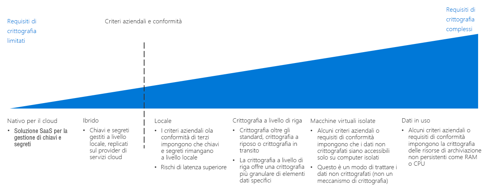

# Guida alle decisioni relative alla crittografia

La crittografia protegge i dati dall'accesso non autorizzato. Criteri di crittografia correttamente implementati forniscono ulteriori livelli di sicurezza per i carichi di lavoro basati sul cloud e li proteggono dalle azioni di utenti malintenzionati e altri utenti non autorizzati sia all'interno che all'esterno dell'organizzazione e delle reti.

Per quanto sia generalmente desiderabile, la crittografia delle risorse comporta dei costi che possono aumentare la latenza e l'utilizzo complessivo delle risorse. Per i carichi di lavoro complessi, trovare il giusto equilibrio fra crittografia e prestazioni è essenziale.

Passare a: [Gestione delle chiavi](#key-management) | [Crittografia dei dati](#data-encryption) | [Altre informazioni](#learn-more)

Il punto di flesso nella determinazione di una strategia di crittografia cloud è incentrato sui criteri aziendali e sui requisiti di conformità.

È possibile implementare la crittografia in un ambiente cloud in diversi modi, che si differenziano per costo e complessità. I criteri aziendali e la conformità di terze parti sono fattori decisivi nella pianificazione di una strategia di crittografia. Quasi tutte le soluzioni basate sul cloud offrono meccanismi standard per la crittografia dei dati, inattivi o in transito. Tuttavia, per i criteri e i requisiti di conformità che richiedono controlli più rigorosi, come i segreti standardizzati e la gestione delle chiavi, la crittografia dei dati in uso o la crittografia specifica dei dati, sarà probabilmente necessario implementare una soluzione complessa.

## Gestione delle chiavi

I moderni sistemi di gestione delle chiavi dovrebbero offrire supporto per l'archiviazione delle chiavi usando moduli di protezione hardware per una maggiore protezione. Pertanto, un sistema di gestione delle chiavi è fondamentale per la capacità dell'organizzazione di creare e archiviare chiavi di crittografia, password importanti, stringhe di connessione e altre informazioni IT riservate.

Nell'ambito della pianificazione di una migrazione al cloud, la tabella seguente descrive come è possibile archiviare e gestire le chiavi, i certificati e i segreti di crittografia, che hanno un'importanza fondamentale per la creazione di distribuzioni cloud sicure e gestibili:

| Domanda | Reti cloud native | Ibrido | Locale |
|---------------------------------------------------------------------------------------------------------------------------------------|--------------|--------|-------------|
| Nell'organizzazione manca una soluzione di gestione centralizzata di chiavi e segreti?                                                                    | Sì          | No      | No           |
| Sarà necessario limitare la creazione di chiavi e segreti nei dispositivi all'hardware locale, quando si usano queste chiavi nel cloud? | No            | Sì    | No           |
| Nell'organizzazione sono in vigore regole o criteri che impediscono di archiviare chiavi e segreti fuori sede?                | No            | No      | Sì         |

### Cloud nativo

Con la gestione delle chiavi nativa del cloud, tutte le chiavi e i segreti vengono generati, gestiti e archiviati in un insieme di credenziali basato sul cloud. Questo approccio semplifica molte attività IT correlate alla gestione delle chiavi.

Presupposti relativi alla gestione delle chiavi nativa del cloud. L'uso di un sistema di gestione delle chiavi nativo del cloud presuppone le condizioni seguenti:

- Si considera attendibile la soluzione cloud di gestione delle chiavi con la creazione, la gestione e l'hosting di chiavi e segreti dell'organizzazione.
- Si abilitano tutte le applicazioni e i servizi locali che si basano sull'accesso a servizi di crittografia o segreti ad accedere al sistema di gestione delle chiavi nel cloud.

### Gestione ibrida (BYOK, Bring Your Own Key)

L'approccio BYOK consiste nel generare chiavi nell'hardware HSM dedicato nell'ambiente locale, per poi trasferirle in un sistema di gestione delle chiavi sicuro nel cloud e usarle con le risorse cloud.

Presupposti relativi alla gestione delle chiavi ibrida. L'uso di un sistema di gestione delle chiavi ibrido presuppone le condizioni seguenti:

- Si considera attendibile l'infrastruttura sottostante della piattaforma cloud a livello di sicurezza e controllo di accesso per l'hosting e l'uso di chiavi e segreti.
- I criteri normativi o organizzativi richiedono di mantenere nell'ambiente locale la creazione e la gestione dei segreti e delle chiavi dell'organizzazione.

### Gestione locale (HYOK, Hold Your Own Key)

In alcune situazioni potrebbero esserci normative, criteri o motivi tecnici che impediscono di archiviare le chiavi in un sistema di gestione delle chiavi fornito da un servizio cloud pubblico. In questi casi è necessario mantenere le chiavi nell'hardware locale e fornire un meccanismo che consenta alle risorse basate sul cloud di accedere a queste chiavi ai fini della crittografia. Tenere presente che un approccio HYOK potrebbe non essere compatibile con tutti i servizi cloud.

Presupposti relativi alla gestione delle chiavi locale. L'uso di un sistema di gestione delle chiavi locale presuppone le condizioni seguenti:

- I criteri normativi o organizzativi richiedono di mantenere nell'ambiente locale la creazione, la gestione e l'hosting dei segreti e delle chiavi dell'organizzazione.
- Tutte le applicazioni o i servizi basati sul cloud che si basano sull'accesso a servizi di crittografia o segreti possono accedere al sistema di gestione delle chiavi locale.

## Crittografia dei dati

I dati possono avere numerosi stati diversi con esigenze di crittografia diverse da considerare quando si pianificano i criteri di crittografia:

| Stato dei dati | Dati |
|-----|-----|
| Dati in transito | Traffico di rete interno, connessioni Internet, connessioni fra data center o reti virtuali |
| Dati inattivi    | Database, file, unità virtuali, archivio PaaS |
| Dati in uso     | Dati caricati nella RAM o in cache della CPU |

### Dati in transito

I dati in transito sono dati che si spostano tra le risorse nella rete interna, tra i data center, in reti esterne o su Internet.

La crittografia dei dati in transito avviene in genere richiedendo i protocolli SSL/TLS per il traffico. Il traffico in transito tra le risorse ospitate nel cloud e una rete esterna o la rete Internet pubblica deve sempre essere crittografato. Per impostazione predefinita, le risorse PaaS in genere applicano anche la crittografia SSL/TLS al traffico. La decisione di applicare la crittografia al traffico tra le risorse IaaS ospitate all'interno della rete virtuale spetta al team di adozione del cloud e al proprietario del carico di lavoro ed è generalmente consigliata.

**Presupposti relativi alla crittografia dei dati in transito**. L'implementazione dei criteri di crittografia corretti per i dati in transito presuppone le condizioni seguenti:

- Tutti gli endpoint accessibili pubblicamente nell'ambiente cloud comunicheranno con la rete Internet pubblica tramite i protocolli SSL/TLS.
- Per stabilire la connessione tra una rete cloud e la rete locale o un'altra rete esterna attraverso la rete Internet pubblica, si usano i protocolli VPN crittografati.
- Per stabilire la connessione tra una rete cloud e la rete locale o un'altra rete esterna attraverso una connessione WAN dedicata come ExpressRoute, si userà una VPN o un'altra appliance di crittografia locale associata a una VPN o un'altra appliance di crittografia virtuale corrispondente distribuita nella rete cloud.
- In presenza di dati sensibili che non devono essere inclusi nei log sul traffico o in altri report di diagnostica visibili al personale IT, si crittograferà tutto il traffico tra le risorse nella rete virtuale.

### Dati inattivi

I dati inattivi sono i dati che non vengono spostati o elaborati attivamente e includono file, database, unità di macchine virtuali, account di archiviazione PaaS o risorse simili. La crittografia dei dati archiviati protegge i dispositivi virtuali o i file dall'accesso non autorizzato che può avvenire tramite penetrazione da una rete esterna, rilasci accidentali o utenti interni malintenzionati.

Per le risorse di database e archiviazione PaaS generalmente la crittografia è applicata per impostazione predefinita. Le risorse virtuali IaaS possono essere protette mediante crittografia del disco virtuale usando le chiavi di crittografia archiviate nel sistema di gestione delle chiavi.

La crittografia dei dati inattivi comprende anche tecniche di crittografia dei database più avanzate, come la crittografia a livello di colonna e di riga, che offre un controllo notevolmente superiore sui dati esatti da proteggere.

I criteri e i requisiti di conformità complessivi, il livello di riservatezza dei dati archiviati e i requisiti di prestazioni dei carichi di lavoro dovrebbero determinare quali risorse debbano essere crittografate.

**Presupposti relativi alla crittografia dei dati inattivi**. La crittografia dei dati inattivi presuppone le condizioni seguenti:

- Si archiviano i dati che non sono destinati all'utilizzo pubblico.
- I carichi di lavoro possono accettare i costi di latenza aggiuntivi per la crittografia dei dischi.

### Dati in uso

La crittografia dei dati in uso implica la protezione dei dati in una risorsa di archiviazione non permanente, come la RAM o la cache della CPU, oltre all'uso di tecnologie come la crittografia della memoria completa o di tecnologie enclave come Secure Guard Extensions (SGX) di Intel. Sono incluse anche tecniche di crittografia come la crittografia omomorfica, che può essere usata per creare ambienti di esecuzione sicuri e affidabili.

**Presupposti relativi alla crittografia dei dati in uso**. La crittografia dei dati in uso presuppone le condizioni seguenti:

- La proprietà dei dati deve essere sempre mantenuta separata dalla piattaforma cloud sottostante, anche a livello di RAM e CPU.

## Altre informazioni

Vedere i collegamenti seguenti per altre informazioni sulla crittografia e la gestione delle chiavi nella piattaforma Azure.

- [Panoramica della crittografia di Azure](/azure/security/security-azure-encryption-overview). Descrizione dettagliata del modo in cui Azure usa la crittografia per proteggere i dati inattivi e i dati in transito.
- [Azure Key Vault](/azure/key-vault/key-vault-overview). Key Vault è il principale sistema di gestione delle chiavi per l'archiviazione e la gestione di chiavi, segreti e certificati di crittografia in Azure.
- [Confidential computing in Azure](/solutions/confidential-compute). L'iniziativa Confidential computing di Azure offre strumenti e tecnologie per creare ambienti di esecuzione affidabili o altri meccanismi di crittografia per la protezione dei dati in uso.

## Passaggi successivi

Informazioni su come le reti definite dal software forniscono funzionalità di rete virtuale per le distribuzioni cloud.

> [!div class="nextstepaction"]
> [Qual è il modello di rete definita dal software migliore per la propria distribuzione?](../software-defined-network/overview.md)
