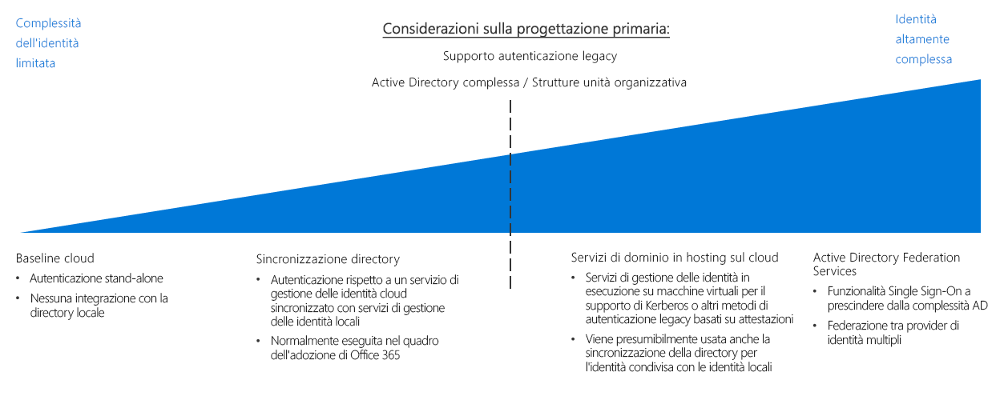

# Guida alle decisioni relative alla gestione delle identità

In qualsiasi ambiente, che sia locale, ibrido o cloud, l'IT deve avere il controllo su quali amministratori, utenti e gruppi hanno accesso alle risorse. I servizi di gestione delle identità e degli accessi (IAM) consentono di gestire il controllo di accesso nel cloud.

Passare a: [Determinare i requisiti di integrazione della soluzione di gestione delle identità](#determine-identity-integration-requirements) | [Infrastruttura nativa del cloud](#cloud-baseline) | [Sincronizzazione della directory](#directory-synchronization) | [Servizi di dominio ospitati nel cloud](#cloud-hosted-domain-services) | [Active Directory Federation Services](#active-directory-federation-services) | [Evoluzione dell'integrazione delle identità](#evolving-identity-integration) | [Altre informazioni](#learn-more)

È possibile gestire l'identità in un ambiente cloud in diversi modi, che si differenziano per costo e complessità. Un fattore chiave nella strutturazione dei servizi di gestione delle identità basati sul cloud è il livello di integrazione necessario con l'infrastruttura di gestione delle identità locale esistente.

Le soluzioni di gestione delle identità SaaS basate sul cloud offrono un livello base di controllo di accesso e gestione delle identità per le risorse cloud. Se però l'infrastruttura di Active Directory (AD) dell'organizzazione ha una struttura di foresta complessa o unità organizzative personalizzate, i carichi di lavoro basati sul cloud potrebbero richiedere la replica di directory nel cloud per ottenere un set coerente di identità, gruppi e ruoli tra l'ambiente locale e l'ambiente cloud. Se la replica di directory è necessaria per una soluzione globale, la complessità può aumentare notevolmente. Inoltre, per supportare le applicazioni che dipendono da meccanismi di autenticazione legacy potrebbe essere necessario distribuire servizi di dominio nel cloud.

## Determinare i requisiti di integrazione della soluzione di gestione delle identità

| Domanda | Infrastruttura nativa del cloud | Sincronizzazione della directory | Servizi di dominio ospitati nel cloud | Active Directory Federation Services |
|------|------|------|------|------|
| Attualmente manca un servizio directory locale? | Sì | No  | No  | No  |
| I carichi di lavoro devono essere autenticati con servizi di gestione delle identità locali? | No  | Sì | No  | No  |
| I carichi di lavoro dipendono da meccanismi di autenticazione legacy, come Kerberos o NTLM? | No  | No  | Sì | No  |
| L'integrazione tra i servizi di gestione delle identità cloud e locali è impossibile? | No  | No  | Sì | No  |
| È necessario il Single Sign-On tra più provider di identità? | No  | No  | No  | Sì |

Nell'ambito della pianificazione della migrazione ad Azure, è necessario determinare il modo migliore per integrare i servizi di gestione delle identità esistenti con i servizi cloud. Di seguito sono descritti alcuni scenari di integrazione comuni.

### Infrastruttura nativa del cloud

Le piattaforme cloud pubbliche forniscono un sistema IAM nativo che concede a utenti e gruppi l'accesso alle funzionalità di gestione. Se l'organizzazione non dispone di una soluzione di gestione delle identità locale rilevante e si prevede di eseguire la migrazione dei carichi di lavoro in modo che siano compatibili con i meccanismi di autenticazione basati sul cloud, occorre creare l'infrastruttura di gestione delle identità usando un servizio di gestione delle identità nativo del cloud.

**Presupposti per un'infrastruttura nativa del cloud**. L'uso di un'infrastruttura di gestione delle identità completamente nativa del cloud presuppone le condizioni seguenti:

- Le risorse basate sul cloud non hanno dipendenze dai servizi directory locali o da server Active Directory oppure è possibile modificare i carichi di lavoro per rimuovere queste dipendenze.
- I carichi di lavoro di applicazioni o servizi di cui eseguire la migrazione supportano meccanismi di autenticazione compatibili con i provider di identità cloud o possono essere facilmente modificati per supportarli. I provider di identità nativi del cloud usano meccanismi di autenticazione basati su Internet come SAML, OAuth e OpenID Connect. I carichi di lavoro esistenti che dipendono da metodi di autenticazione legacy che usano protocolli come Kerberos o NTLM potrebbero dover essere sottoposti a refactoring prima della migrazione al cloud.

> [!TIP]
> La maggior parte dei servizi di gestione delle identità nativi del cloud non sostituisce completamente le directory locali tradizionali. Le funzionalità di directory come la gestione dei computer o i criteri di gruppo potrebbero non essere disponibili se non si usano strumenti o servizi aggiuntivi.

La migrazione completa dei servizi di gestione delle identità a un provider basato sul cloud elimina la necessità di mantenere l'infrastruttura di gestione delle identità locale, semplificando notevolmente la gestione IT.

### Sincronizzazione della directory

Per le organizzazioni che hanno già un'infrastruttura di gestione delle identità la sincronizzazione della directory è spesso la soluzione migliore per mantenere la gestione esistente di utenti e accessi e fornire al contempo le funzionalità IAM necessarie per gestire le risorse cloud. Questo processo replica continuamente le informazioni della directory tra gli ambienti cloud e locale, consentendo il Single Sign-On (SSO) per gli utenti e un sistema di gestione di identità, ruoli e autorizzazioni coerente nell'intera organizzazione.

Nota: le organizzazioni che hanno adottato Office 365 potrebbero avere già implementato la [sincronizzazione della directory](/office365/enterprise/set-up-directory-synchronization) fra la propria infrastruttura Active Directory locale e Azure Active Directory.

**Presupposti relativi alla sincronizzazione della directory**. L'uso di una soluzione di gestione delle identità sincronizzata presuppone le condizioni seguenti:

- È necessario mantenere un set comune di account utente e di gruppi nell'infrastruttura cloud e in quella locale.
- I servizi di gestione delle identità locali supportano la replica con il provider di identità cloud.
- Sono necessari meccanismi di Single Sign-On per gli utenti che accedono ai provider di identità cloud e locali.

> [!TIP]
> Qualsiasi carico di lavoro basato sul cloud che dipende da meccanismi di autenticazione legacy non supportati da servizi di gestione delle identità basati sul cloud come Azure AD avrà ancora bisogno di connettività ai servizi di dominio locali o ai server virtuali nell'ambiente cloud che forniscono questi servizi. L'uso di servizi di gestione delle identità locali introduce anche dipendenze a livello di connettività tra la rete cloud e la rete locale.

### Servizi di dominio ospitati nel cloud

In presenza di carichi di lavoro che dipendono da un meccanismo di autenticazione basata sulle attestazioni che usa protocolli legacy come Kerberos o NTLM, e che non possono essere sottoposti a refactoring per accettare protocolli di autenticazione moderni come SAML o OAuth e OpenID Connect, potrebbe essere necessario eseguire la migrazione di alcuni servizi di dominio al cloud nell'ambito della distribuzione cloud.

Questo tipo di distribuzione implica la distribuzione di macchine virtuali che eseguono Active Directory nelle reti virtuali aziendali basate sul cloud al fine di fornire servizi di dominio per le risorse nel cloud. Le applicazioni e i servizi esistenti trasferiti nella rete cloud dovrebbero poter usare questi server di directory ospitati nel cloud con modifiche minime.

Probabilmente le directory e i servizi di dominio esistenti continueranno a essere usati nell'ambiente locale. In questo scenario è consigliabile usare anche la sincronizzazione della directory per fornire un set comune di utenti e ruoli sia nell'ambiente cloud che in quello locale.

**Presupposti relativi ai servizi di dominio ospitati nel cloud**. L'esecuzione di una migrazione di directory presuppone le condizioni seguenti:

- I carichi di lavoro dipendono da un meccanismo di autenticazione basata sulle attestazioni che usa protocolli come Kerberos o NTLM.
- Le macchine virtuali dei carichi di lavoro devono essere aggiunte a un dominio ai fini della gestione o dell'applicazione di criteri di gruppo di Active Directory.

> [!TIP]
> Benché la migrazione della directory associata a servizi di dominio ospitati nel cloud assicuri un'ottima flessibilità per la migrazione dei carichi di lavoro esistenti, l'hosting di macchine virtuali nella rete virtuale cloud per fornire questi servizi aumenta la complessità delle attività di gestione IT. Man mano che la propria esperienza di migrazione nel cloud matura, esaminare i requisiti di manutenzione a lungo termine per l'hosting di questi server. Stabilire se il refactoring dei carichi di lavoro esistenti per la compatibilità con provider di identità cloud come Azure Active Directory può ridurre la necessità di questi server ospitati nel cloud.

### Active Directory Federation Services

La federazione delle identità stabilisce relazioni di trust fra più sistemi di gestione delle identità per abilitare funzionalità comuni di autenticazione e autorizzazione. È quindi possibile supportare funzionalità di Single Sign-On in più domini all'interno dell'organizzazione oppure sistemi di gestione delle identità gestiti da clienti o partner commerciali.

Azure AD supporta la federazione di domini Active Directory locali tramite [Active Directory Federation Services](/azure/active-directory/hybrid/how-to-connect-fed-whatis) (AD FS). Vedere l'architettura di riferimento [Estendere Active Directory Federation Services in Azure](../../../reference-architectures/identity/adfs.md) per informazioni su come implementarla in Azure.

## Evoluzione dell'integrazione delle identità

L'integrazione delle identità è un processo iterativo. È consigliabile iniziare con una soluzione nativa del cloud con un piccolo gruppo di utenti e di ruoli corrispondenti per una distribuzione iniziale. Man mano che l'esperienza di migrazione matura, si può considerare l'adozione di un modello federato o l'esecuzione di una migrazione della directory completa dei servizi di gestione delle identità locali nel cloud. Rivedere la propria strategia di gestione delle identità in ogni iterazione del processo di migrazione.

## Altre informazioni

Vedere i collegamenti seguenti per altre informazioni sui servizi di gestione delle identità nella piattaforma Azure.

- [Azure AD](https://azure.microsoft.com/services/active-directory). Azure AD fornisce servizi di gestione delle identità basati sul cloud. Consente di gestire l'accesso alle risorse di Azure e di controllare la gestione delle identità, la registrazione dei dispositivi, il provisioning degli utenti, il controllo di accesso alle applicazioni e la protezione dei dati.
- [Azure AD Connect](/azure/active-directory/hybrid/whatis-hybrid-identity). Lo strumento Azure AD Connect consente di connettere istanze di Azure AD alle soluzioni di gestione delle identità esistenti, permettendo la sincronizzazione della directory esistente nel cloud.
- [Controllo degli accessi in base al ruolo](/azure/role-based-access-control/overview). Azure AD offre funzionalità di controllo degli accessi in base al ruolo che consentono di gestire in modo efficiente e sicuro l'accesso alle risorse nel piano di gestione. I processi e le responsabilità sono organizzati in ruoli e gli utenti sono assegnati a questi ruoli. Il controllo degli accessi in base al ruolo consente di controllare chi ha accesso a una risorsa e quali azioni possono essere eseguite dall'utente su quella risorsa.
- [Azure AD Privileged Identity Management](/azure/active-directory/privileged-identity-management/pim-configure) (PIM). PIM riduce il tempo di esposizione dei privilegi di accesso alle risorse e aumenta la visibilità sul loro utilizzo tramite report e avvisi. Consente agli utenti di assumere i loro privilegi soltanto "just in time" (JIT) oppure li assegna loro per una durata più breve, dopo la quale i privilegi vengono revocati automaticamente.
- [Integrare i domini Active Directory locali con Azure Active Directory](../../../reference-architectures/identity/azure-ad.md). Questa architettura di riferimento fornisce un esempio di sincronizzazione della directory tra domini Active Directory locali e Azure AD.
- [Estendere Active Directory Domain Services in Azure](../../../reference-architectures/identity/adds-extend-domain.md). Questa architettura di riferimento fornisce un esempio di distribuzione di server AD DS per estendere i servizi di dominio alle risorse basate sul cloud.
- [Estendere Active Directory Federation Services in Azure](../../../reference-architectures/identity/adfs.md). Questa architettura di riferimento configura Active Directory Federation Services (AD FS) per l'esecuzione dell'autenticazione federata e dell'autorizzazione con la directory Azure AD.

## Passaggi successivi

Informazioni su come implementare l'applicazione dei criteri nel cloud.

> [!div class="nextstepaction"]
> [Applicazione dei criteri](../policy-enforcement/overview.md)
