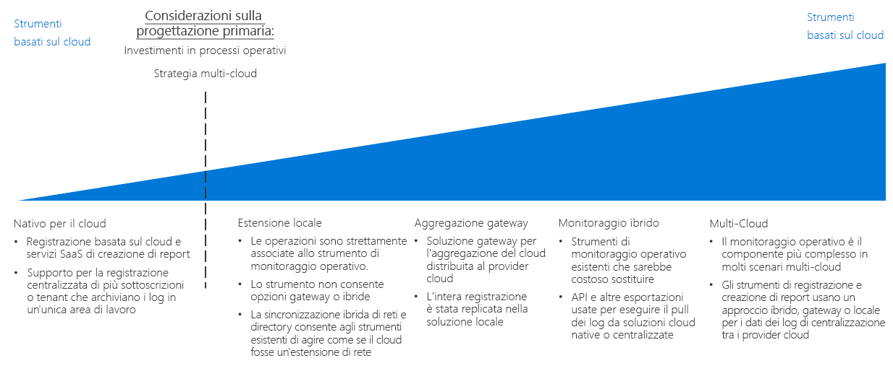

# Guida alle decisioni relative a registrazione e creazione di reportLogging and reporting decision guide

Tutte le organizzazioni hanno bisogno di meccanismi per notificare ai team IT le problematiche di prestazioni, tempo di attività e sicurezza prima che diventino problemi gravi.All organizations need mechanisms for notifying IT teams of performance, uptime, and security issues before they become serious problems. Una strategia di monitoraggio vincente consente di conoscere le prestazioni dei singoli componenti che costituiscono i carichi di lavoro e l'infrastruttura di rete.A successful monitoring strategy allows you to understand how the individual components that make up your workloads and networking infrastructure are performing. Nell'ambito di una migrazione cloud pubblico, per essere certi che l'organizzazione raggiunga gli obiettivi di tempo di attività, sicurezza e conformità ai criteri, è cruciale integrare la registrazione e la creazione di report con i sistemi di monitoraggio esistenti, inviando al contempo gli eventi e le metriche importanti al personale IT appropriato.Within the context of a public cloud migration, integrating logging and reporting with any of your existing monitoring systems, while surfacing important events and metrics to the appropriate IT staff, is critical in ensuring your organization is meeting uptime, security, and policy compliance goals.

Passare a: [Pianificazione dell'infrastruttura di monitoraggio](#planning-your-monitoring-infrastructure) | [Cloud nativo](#cloud-native) | [Estensione locale](#on-premises-extension) | [Aggregazione tramite il gateway](#gateway-aggregation) | [Monitoraggio ibrido (locale)](#hybrid-monitoring-on-premises) | [Monitoraggio ibrido (basato sul cloud)](#hybrid-monitoring-cloud-based) | [Multi-cloud](#multi-cloud) | [Altre informazioni](#learn-more)Jump to: [Planning your monitoring infrastructure](#planning-your-monitoring-infrastructure) | [Cloud native](#cloud-native) | [On-premises extension](#on-premises-extension) | [Gateway aggregation](#gateway-aggregation) | [Hybrid monitoring (on-premises)](#hybrid-monitoring-on-premises) | [Hybrid monitoring (cloud-based)](#hybrid-monitoring-cloud-based) | [Multi-cloud](#multi-cloud) | [Learn more](#learn-more)

Il punto di flesso quando si stabilisce una strategia di gestione delle identità cloud è determinato principalmente dagli investimenti esistenti fatti dall'organizzazione nei processi operativi e, in una certa misura, dagli eventuali requisiti necessari per supportare una strategia multi-cloud.The inflection point when determining a cloud identity strategy is based primarily on existing investments your organization has made in operational processes, and to some degree any requirements you have to support a multi-cloud strategy.

Ci sono diversi modi per registrare e creare report sulle attività nel cloud.There are multiple ways to log and report on activities in the cloud. Il cloud nativo e la registrazione centralizzata sono due comuni opzioni di software come un servizio (SaaS), basate sul tipo di sottoscrizione e sul numero di sottoscrizioni.Cloud native and centralized logging are two common software as a service (SaaS) options that are driven by the subscription design and the number of subscriptions.

## Pianificazione dell'infrastruttura di monitoraggioPlanning your monitoring infrastructure

Quando si pianifica la distribuzione, è necessario considerare dove sono archiviati i dati di registrazione e come si integreranno i servizi di monitoraggio e creazione di report basati su cloud con gli strumenti e i processi esistenti.When planning your deployment, you need to consider where logging data is stored and how you will integrate cloud-based reporting and monitoring services with your existing processes and tools.

| DomandaQuestion | Cloud nativoCloud native | Estensione localeOn-premises extension | Monitoraggio ibridoHybrid monitoring | Aggregazione tramite il gatewayGateway aggregation |
|-----|-----|-----|-----|-----|
| È già disponibile un'infrastruttura di monitoraggio locale?Do you have an existing on-premises monitoring infrastructure? | No No | SìYes | SìYes |  No No |
| Esistono requisiti che impediscono l'archiviazione dei dati dei log in posizioni di archiviazione esterne?Do you have requirements preventing storage of log data on external storage locations? | No No | SìYes | No No | No No |
| È necessario integrare il monitoraggio cloud con i sistemi locali?Do you need to integrate cloud monitoring with on-premises systems? | No No | No No | SìYes | No No |
È necessario elaborare o filtrare i dati di telemetria prima di inviarli ai sistemi di monitoraggio?Do you need to process or filter telemetry data before submitting it to your monitoring systems? | No No | No No | No No | SìYes |

### Cloud nativoCloud native

Se attualmente l'organizzazione è priva di sistemi di registrazione e creazione di report definiti o se non è necessario integrare la distribuzione cloud con i sistemi di monitoraggio locali o altri esterni esistenti, una soluzione SaaS cloud nativa è la scelta più semplice.If your organization currently lacks established logging and reporting systems, or if your planned cloud deployment does not need to be integrated with existing on-premises or other external monitoring systems, a cloud native SaaS solution is the simplest choice.

In questo scenario i dati dei log vengono registrati e archiviati nello stesso ambiente cloud del carico di lavoro, mentre gli strumenti di registrazione e creazione di report che elaborano e inviano le informazioni al personale IT sono offerti come parte della piattaforma cloud.In this scenario, log data is recorded and stored in the same cloud environment as your workload, while the logging and reporting tools that process and surface information to IT staff are offered as part of the cloud platform.

Si possono implementare soluzioni di registrazione cloud native ad hoc in base alla sottoscrizione o al carico di lavoro per le distribuzioni più piccole o sperimentali. Tali soluzioni vengono organizzate in modo centralizzato per monitorare i dati dei log nell'intero ambiente cloud.Cloud native logging solutions can be implemented ad hoc per subscription or workload for smaller or experimental deployments and are organized in a centralized manner to monitor log data across your entire cloud estate.

**Presupposti del cloud nativo**.**Cloud native assumptions**. L'uso di un sistema cloud nativo per la registrazione e la creazione di report presuppone quanto segue:Using a cloud native logging and reporting system assumes the following:

- Non è necessario integrare nei sistemi locali esistenti i dati dei log dei carichi di lavoro cloud.You do not need to integrate the log data from you cloud workloads into existing on-premises systems.
- Non si useranno i sistemi di creazione di report basati sul cloud per monitorare i sistemi locali.You will not be using your cloud-based reporting systems to monitor on-premises systems.

### Estensione localeOn-premises extension

Negli scenari in cui è necessario integrare i dati di telemetria cloud con i sistemi locali che non supportano la registrazione e la creazione di report ibride o che supportano la migrazione di applicazioni e servizi con una quantità minima di nuove attività di sviluppo, sarà necessario distribuire gli agenti di monitoraggio nelle macchine virtuali che invieranno i dati dei log direttamente ai sistemi locali, invece di archiviarli nell'ambiente cloud.In scenarios where you need to integrate cloud telemetry with on-premises systems that do not support hybrid logging and reporting, or support the migration of applications and services with a minimum amount of redevelopment, you will need to deploy monitoring agents to VMs that will send log data directly to your on-premises systems, rather than storing it in the cloud environment.

Per supportare questo approccio, le risorse cloud dovranno poter comunicare direttamente con i sistemi locali tramite una combinazione di [rete ibrida](../software-defined-network/hybrid.md) e di [servizi del dominio ospitati nel cloud](../identity/overview.md#cloud-hosted-domain-services).In order to support this approach, your cloud resources will need to be able to communicate directly with your on-premises systems through a combination of [hybrid networking](../software-defined-network/hybrid.md) and [cloud hosted domain services](../identity/overview.md#cloud-hosted-domain-services). In questo modo, la rete virtuale cloud funge da estensione di rete dell'ambiente locale.With this in place, the cloud virtual network functions as a network extension of the on-premises environment. I carichi di lavoro ospitati nel cloud possono quindi comunicare direttamente con il sistema di registrazione e creazione di report locale.Therefore, cloud hosted workloads can communicate directly with your on-premises logging and reporting system.

Questo approccio sfrutta gli investimenti esistenti negli strumenti di monitoraggio con modifiche minime alle applicazioni o ai servizi distribuiti nel cloud.This approach capitalizes on your existing investment in monitoring tooling with limited modification to any cloud-deployed applications or services. Si tratta spesso dell'approccio più rapido per supportare il monitoraggio durante una migrazione lift-and-shift.This is often the fastest approach to support monitoring during a lift-and-shift migration. Non verranno tuttavia acquisiti i dati dei log generati dalle risorse PaaS e SaaS basate sul cloud e verranno omessi i log relativi alle macchine virtuali generati direttamente dalla piattaforma cloud, ad esempio quelli sullo stato delle macchine virtuali.However, it won’t capture log data produced by cloud-based PaaS and SaaS resources, and it will omit any VM-related logs generated by the cloud platform itself such as VM status. Di conseguenza, questo modello dovrà essere una soluzione temporanea da adottare solo finché non verrà implementata una soluzione di monitoraggio ibrida più completa.As a result, this pattern should be a temporary solution until a more comprehensive hybrid monitoring solution is implemented.

Presupposti solo dell'estensione locale:On-premises only assumptions:

- È necessario mantenere i dati dei log solo nell'ambiente locale, a supporto dei requisiti tecnici oppure a causa dei requisiti normativi o relativi ai criteri.You need to maintain log data only in your on-premises environment only, either in support of technical requirements or due to regulatory or policy requirements.
- I sistemi locali non supportano le soluzioni di registrazione e creazione di report ibride o di aggregazione tramite il gateway.Your on-premises systems do not support hybrid logging and reporting or gateway aggregation solutions.
- Le applicazioni basate sul cloud possono inviare i dati di telemetria direttamente ai sistemi di registrazione locali oppure gli agenti di monitoraggio che inviano i dati all'ambiente locale possono essere distribuiti nelle macchine virtuali dei carichi di lavoro.Your cloud-based applications can submit telemetry directly to your on-premises logging systems or monitoring agents that submit to on-premises can be deployed to workload VMs.
- I carichi di lavoro non dipendono da servizi PaaS o SaaS che richiedono la registrazione e la creazione di report basate sul cloud.Your workloads are not dependent on PaaS or SaaS services that require cloud-based logging and reporting.

### Aggregazione tramite il gatewayGateway aggregation

Per gli scenari in cui la quantità di dati di telemetria basati sul cloud è molto elevata o in cui i sistemi di monitoraggio locali esistenti devono modificare i dati dei log prima di poterli elaborare, potrebbe essere necessario un servizio di [aggregazione tramite il gateway](../../../patterns/gateway-aggregation.md) dei dati del log.For scenarios where the amount of cloud-based telemetry data is very large or existing on-premises monitoring systems need log data modified before it can be processed, a log data [gateway aggregation](../../../patterns/gateway-aggregation.md) service may be required.

Un servizio gateway viene distribuito al provider di servizi cloud.A gateway service is deployed to your cloud provider. Le applicazioni e i servizi pertinenti vengono quindi configurati per inviare i dati di telemetria al gateway invece che a un sistema di registrazione predefinito.Then, relevant applications and services are configured to submit telemetry data to the gateway instead of a default logging system. Il gateway può quindi elaborare i dati: prima li aggrega, li combina o li formatta in altro modo, quindi li invia al servizio di monitoraggio per l'inserimento e l'analisi.The gateway can then process the data: aggregating, combining, or otherwise formatting it before then submitting it to your monitoring service for ingestion and analysis.

Un gateway può essere usato anche per aggregare e pre-elaborare i dati di telemetria associati per i sistemi nativi del cloud o ibridi.Also, a gateway can be used to aggregate and preprocess telemetry data bound for cloud-native or hybrid systems.

Presupposti dell'aggregazione tramite il gateway:Gateway aggregation assumptions:

- Si prevedono livelli molto elevati di dati di telemetria dalle applicazioni o dai servizi basati sul cloud.You expect very high levels of telemetry data from your cloud-based applications or services.
- È necessario formattare o ottimizzare in altro modo i dati di telemetria prima di inviarli ai sistemi di monitoraggio.You need to format or otherwise optimize telemetry data before submitting it to your monitoring systems.
- I sistemi di monitoraggio dispongono di API o altri meccanismi per l'inserimento dei dati dei log dopo l'elaborazione tramite il gateway.Your monitoring systems have APIs or other mechanisms available to ingest log data after processing by the gateway.

### Monitoraggio ibrido (locale)Hybrid monitoring (on-premises)

Un soluzione di monitoraggio ibrido combina i dati dei log sia delle risorse locali che di quelle cloud per offrire una visualizzazione integrata dello stato operativo dell'ambiente IT.A hybrid monitoring solution combines log data from both your on-premises and cloud resources to provide an integrated view into your IT estate's operational status.

Se è stato fatto un investimento in sistemi di monitoraggio locali che sarebbero difficili o costosi da sostituire, potrebbe essere necessario integrare dati di telemetria dei carichi di lavoro cloud nelle soluzioni di monitoraggio locali preesistenti.If you have an existing investment in on-premises monitoring systems that would be difficult or costly to replace, you may need to integrate the telemetry from your cloud workloads into preexisting on-premises monitoring solutions. In un sistema di monitoraggio locale ibrido i dati di telemetria locali continuano a usare il sistema di monitoraggio locale esistente.In a hybrid on-premises monitoring system, on-premises telemetry data continues to use the existing on-premises monitoring system. I dati di telemetria basati sul cloud vengono inviati al sistema di monitoraggio cloud direttamente oppure vengono archiviati nel cloud insieme ai carichi di lavoro e compilati e inseriti nel sistema locale a intervalli regolari.Cloud-based telemetry data is either sent to the cloud monitoring system directly, or the data is stored on the cloud alongside your workloads and then compiled and ingested into the on-premises system at regular intervals.

**Presupposti del monitoraggio ibrido locale**.**On-premises hybrid monitoring assumptions**. L'uso di un sistema di registrazione e di creazione di report locale per il monitoraggio ibrido presuppone quanto segue:Using an on-premises logging and reporting system for hybrid monitoring assumes the following:

- È necessario usare i sistemi di creazione di report locali esistenti per monitorare i carichi di lavoro cloud.You need to use existing on-premises reporting systems to monitor cloud workloads.
- È necessario mantenere la proprietà dei dati dei log in locale.You need to maintain ownership of log data on-premises.
- I sistemi di gestione locali dispongono di API o di altri meccanismi per inserire i dati dei log dai sistemi basati su cloud.Your on-premises management systems have APIs or other mechanisms available to ingest log data from cloud-based systems.

> [!TIP]
> Data la natura iterativa della migrazione cloud, è probabile che si effettuerà la transizione da soluzioni di monitoraggio native del cloud e locali distinte a un approccio ibrido parziale.As part of the iterative nature of cloud migration, transitioning from distinct cloud-native and on-premises monitoring to a partial hybrid approach is likely. Assicurarsi che le modifiche apportate all'architettura di monitoraggio siano in linea con i processi IT e operativi generali.Make sure to keep changes to your monitoring architecture in line with your overall IT and operational processes.

### Monitoraggio ibrido (basato sul cloud)Hybrid monitoring (cloud-based)

Se non è assolutamente necessario mantenere un sistema di monitoraggio locale o si vogliono sostituire i sistemi di monitoraggio locali con una soluzione SaaS, è anche possibile scegliere di integrare i dati dei log locali con un sistema di monitoraggio centralizzato basato sul cloud.If you do not have a compelling need to maintain an on-premises monitoring system, or you want to replace on-premises monitoring systems with a SaaS solution, you can also choose to integrate on-premises log data with a centralized cloud-based monitoring system.

Rispecchiando l'approccio centralizzato locale, in questo scenario i carichi di lavoro cloud usano il meccanismo di registrazione cloud predefinito e le applicazioni e i servizi locali inviano la directory di telemetria al sistema di registrazione basato sul cloud o li aggregano per l'inserimento nel sistema cloud a intervalli regolari.Mirroring the on-premises centered approach, in this scenario cloud workloads would use their default cloud logging mechanism, and on-premises applications and services would either send telemetry directory to the cloud-based logging system, or aggregate that data for ingestion into the cloud system at regular intervals. Il sistema di monitoraggio basato su cloud funge quindi da sistema di monitoraggio e creazione di report principale per l'intero ambiente IT.The cloud-based monitoring system would then serve as your primary monitoring and reporting system for your entire IT estate.

Presupposti del monitoraggio ibrido basato sul cloud: L'uso di sistemi di registrazione e di creazione di report basati sul cloud per il monitoraggio ibrido presuppone quanto segue:Cloud-based hybrid monitoring assumptions: Using cloud-based logging and reporting systems for hybrid monitoring assumes the following:

- Non si è dipendenti dai sistemi di monitoraggio locali esistenti.You are not dependent upon existing on-premises monitoring systems.
- I carichi di lavoro non hanno requisiti normativi o relativi ai criteri che prevedono l'archiviazione dei dati dei log in locale.Your workloads do not have regulatory or policy requirements to store log data on-premises.
- I sistemi di monitoraggio basato sul cloud dispongono di API o di altri meccanismi per inserire i dati dei log dalle applicazioni e dai servizi locali.Your cloud-based monitoring systems have APIs or other mechanisms available to ingest log data from on-premises applications and services.

### Multi-cloudMulti-cloud

L'integrazione di funzionalità di registrazione e creazione di report in una piattaforma multi-cloud può risultare complessa.Integrating logging and reporting capabilities across a multiple-cloud platform can be complicated. I servizi offerti nelle piattaforme spesso non sono direttamente confrontabili e sono diverse anche le funzionalità di registrazione e telemetria fornite da questi servizi.Services offered between platforms are often not directly comparable, and logging and telemetry capabilities provided by these services differ as well.
Il supporto per la registrazione multi-cloud spesso richiede l'uso di servizi gateway per elaborare i dati dei log in un formato comune prima di inviare i dati a una soluzione di registrazione ibrida.Multi-cloud logging support often requires the use of gateway services to process log data into a common format before submitting data to a hybrid logging solution.

## Altre informazioniLearn more

[Monitoraggio di Azure](/azure/azure-monitor/overview) è il servizio predefinito di monitoraggio e creazione di report per Azure.[Azure Monitor](/azure/azure-monitor/overview) is the default reporting and monitoring service for Azure. Fornisce:It provides:

- Una piattaforma unificata per la raccolta di dati di telemetria delle app, dati di telemetria host (ad esempio, le macchine virtuali), metriche dei contenitori, metriche della piattaforma Azure e log eventi.A unified platform for collecting app telemetry, host telemetry (such as VMs), container metrics, Azure platform metrics, and event logs.
- Visualizzazione, query, avvisi e strumenti di analisi.Visualization, queries, alerts, and analytical tools. Può fornire informazioni dettagliate su macchine virtuali, sistemi operativi guest, reti virtuali ed eventi delle applicazioni dei carichi di lavoro.It can provide insights into virtual machines, guest operating systems, virtual networks, and workload application events.
- [API REST](/azure/monitoring-and-diagnostics/monitoring-rest-api-walkthrough) per l'integrazione con i servizi esterni e l'automazione dei servizi di monitoraggio e avviso[REST APIs](/azure/monitoring-and-diagnostics/monitoring-rest-api-walkthrough) for integration with external services and automation of monitoring and alerting services
- [Integrazione](/azure/monitoring-and-diagnostics/monitoring-partners) con molti noti fornitori di terze parti.[Integration](/azure/monitoring-and-diagnostics/monitoring-partners) with many popular third-party vendors.
