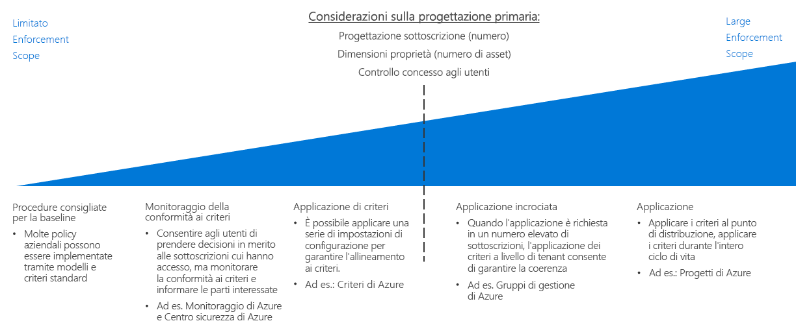

# Guida decisionale di imposizione dei criteriPolicy enforcement decision guide

La definizione di criteri dell'organizzazione non è efficace a meno che non ci sia un modo di applicarla all'interno dell'organizzazione.Defining organizational policy is not effective unless there is a way to enforce it across your organization. Un aspetto fondamentale per la pianificazione di qualsiasi migrazione cloud consiste nel determinare il modo migliore di combinare gli strumenti implementati dalla piattaforma cloud con i processi IT esistenti, per ottimizzare la conformità ai criteri dell'intero gruppo di cloud.A key aspect to planning any cloud migration is determining how best to combine tools provided by the cloud platform with your existing IT processes to maximize policy compliance across your entire cloud estate.

Passare a: [Procedure di base consigliate](#baseline-recommended-practices) | [Monitoraggio della conformità ai criteri](#policy-compliance-monitoring) | [Imposizione dei criteri](#policy-enforcement) | [Criteri tra organizzazioni](#cross-organization-policy) | [Imposizione automatizzata](#automated-enforcement)Jump to: [Baseline recommended practices](#baseline-recommended-practices) | [Policy compliance monitoring](#policy-compliance-monitoring) | [Policy enforcement](#policy-enforcement) | [Cross-organization policy](#cross-organization-policy) | [Automated enforcement](#automated-enforcement)

All'aumentare dei cloud si avrà di conseguenza la necessità di mantenere e applicare criteri a un array più grande di risorse, sottoscrizioni e tenant.As your cloud estate grows, you will be faced with a corresponding need to maintain and enforce policy across a larger array of resources, subscriptions, and tenants. Più un estate è grande, più i meccanismi di imposizione dovranno essere complessi per garantire una conformità coerente e un rilevamento veloce delle violazioni.The larger your estate, the more complex your enforcement mechanisms will need to be to ensure consistent adherence and fast violation detection. I meccanismi di imposizione dei criteri implementati dalla piattaforma a livello di risorse o sottoscrizione sono in genere sufficienti per distribuzioni cloud più piccole, mentre per le distribuzioni più grandi potrebbe essere necessario sfruttare i vantaggi dei meccanismi più sofisticati che interessano gli standard di distribuzione, il raggruppamento di risorse, l'organizzazione e l'integrazione di imposizione dei criteri con i sistemi di log e di report.Platform-provided policy enforcement mechanisms at the resource or subscription level are usually sufficient for smaller cloud deployments, while larger deployments may need to take advantage of more sophisticated mechanisms involving deployment standards, resource grouping and organization, and integrating policy enforcement with your logging and reporting systems.

Il punto critico nella scelta della complessità di una strategia di imposizione dei criteri consiste principalmente nel numero di sottoscrizioni o di tenant richiesti dalla [progettazione di una sottoscrizione](../subscriptions/overview.md).The key inflection point when choosing the complexity of your policy enforcement strategy is primarily focused on the number of subscriptions or tenants required by your [subscription design](../subscriptions/overview.md). Il grado di controllo concesso ai diversi ruoli utente all'interno di un gruppo di cloud potrebbe influenzare anche queste decisioni.The amount of control granted to various user roles within your cloud estate might influence these decisions as well.

## Procedure di base consigliateBaseline recommended practices

Per le distribuzioni cloud semplici e le sottoscrizioni singole, è possibile applicare molti criteri aziendali usando funzioni native alla maggior parte delle piattaforme cloud.For single subscription and simple cloud deployments, many corporate policies can be enforced using features that are native to most cloud platforms. Anche in questo livello relativamente basso di complessità di distribuzione, l'uso coerente dei modelli illustrati in tutte le [guide decisionali](../overview.md) del CAF contribuisce a stabilire un livello di conformità ai criteri di base.Even at this relatively low level of deployment complexity, the consistent use of the patterns discussed throughout the CAF [decision guides](../overview.md) can help establish a baseline level of policy compliance.

Ad esempio: For example:

- [I modelli di distribuzione](../resource-consistency/overview.md) possono effettuare il provisioning delle risorse con struttura e configurazione standardizzate.[Deployment templates](../resource-consistency/overview.md) can provision resources with standardized structure and configuration.
- [L'assegnazione di tag e standard di denominazione](../resource-tagging/overview.md) consente di organizzare le operazioni e supportare i requisiti di business e dell'account.[Tagging and naming standards](../resource-tagging/overview.md) can help organize operations and support accounting and business requirements.
- Le restrizioni di rete e la gestione del traffico possono essere implementate grazie a [reti definite dal software](../software-defined-network/overview.md).Traffic management and networking restrictions can be implemented through [software defined networking](../software-defined-network/overview.md).
- Il [controllo degli accessi in base al ruolo](../identity/overview.md) consente di proteggere e isolare le risorse cloud.[Role-based access control](../identity/overview.md) can secure and isolate your cloud resources.

La pianificazione dell'imposizione dei criteri del cloud si avvia esaminando come l'applicazione dei modelli standard descritti nel corso di queste guide consenta di soddisfare i requisiti dell'organizzazione.Start your cloud policy enforcement planning by examining how the application of the standard patterns discussed throughout these guides can help meet your organizational requirements.

## Monitoraggio della conformità ai criteriPolicy compliance monitoring

Un altro fattore importante, anche per le distribuzioni cloud di dimensioni relativamente ridotte, è la capacità di verificare che i servizi e le applicazioni basate su cloud siano conformi ai criteri dell'organizzazione, avvisando tempestivamente i responsabili se una risorsa diventasse non conforme.Another key factor, even for relatively small cloud deployments, is the ability to verify that cloud-based applications and services comply with organizational policy, promptly notifying the responsible parties if a resource becomes noncompliant. La [creazione di log e report](../log-and-report/overview.md) efficaci sullo stato di conformità dei carichi di lavoro nel cloud è una parte essenziale della strategia di imposizione dei criteri aziendali.Effectively [logging and reporting](../log-and-report/overview.md) the compliance status of your cloud workloads is a critical part of a corporate policy enforcement strategy.

Se un gruppo di cloud aumenta, strumenti aggiuntivi, ad esempio il [Centro sicurezza di Azure](/azure/security-center/), garantiscono la sicurezza integrata e il rilevamento delle minacce e consentono di applicare la gestione centralizzata dei criteri e degli avvisi per entrambe le risorse locali e cloud.As your cloud estate grows, additional tools such as [Azure Security Center](/azure/security-center/) can provide integrated security and threat detection, and help apply centralized policy management and alerting for both your on-premises and cloud assets.

## Imposizione dei criteriPolicy enforcement

È inoltre possibile applicare le impostazioni di configurazione e le regole per la creazione di risorse a livello di sottoscrizione per assicurare l'allineamento dei criteri.You can also apply configuration settings and resource creation rules at the subscription level to help ensure policy alignment.

[Criteri di Azure](/azure/governance/policy/overview) è un servizio di Azure per la creazione, l'assegnazione e la gestione dei criteri.[Azure Policy](/azure/governance/policy/overview) is an Azure service for creating, assigning, and managing policies. Questi criteri applicano regole ed effetti diversi alle risorse, in modo che le risorse rimangano conformi ai contratti di servizio e agli standard dell'azienda.These policies enforce different rules and effects over your resources, so those resources stay compliant with your corporate standards and service level agreements. Criteri di Azure valuta le risorse per la mancata conformità con i criteri assegnati.Azure Policy evaluates your resources for noncompliance with assigned policies. Ad esempio, è possibile limitare le dimensioni SKU di macchine virtuali nell'ambiente in uso.For example, you might want to limit the SKU size of virtual machines in your environment. Dopo aver implementato i criteri corrispondenti, le risorse nuove ed esistenti vengono valutate per la conformità.Once a corresponding policy is implemented, new and existing resources would be evaluated for compliance. Con i criteri corretti, le risorse esistenti possono essere rese conformi.With the right policy, existing resources can be brought into compliance.

## Criteri tra organizzazioniCross-organization policy

Se il gruppo di cloud aumenta estendendosi su più sottoscrizioni che richiedono un'imposizione, è necessario concentrarsi su una strategia per l'applicazione a livello di tenant per garantire la coerenza dei criteri.As your cloud estate grows to span many subscriptions that require enforcement, you will need to focus on a tenant-wide enforcement strategy to ensure policy consistency.

La [progettazione di una sottoscrizione](../subscriptions/overview.md) dovrà prendere in considerazione i criteri relativi alla struttura dell'organizzazione.Your [subscription design](../subscriptions/overview.md) will need to account for policy as it relates to your organizational structure. Oltre ad aiutare a supportare un'organizzazione complessa all'interno della progettazione di una sottoscrizione, i [gruppi di gestione di Azure](../subscriptions/overview.md#management-groups) possono essere usati per assegnare le regole dei criteri di Azure tra più sottoscrizioni.In addition to helping support complex organization within your subscription design, [Azure management groups](../subscriptions/overview.md#management-groups) can be used to assign Azure Policy rules across multiple subscriptions.

## Imposizione automatizzataAutomated enforcement

Anche se i modelli di distribuzione sono validi in scala ridotta, [Azure Blueprints](/azure/governance/blueprints/overview) consente di effettuare il provisioning e l'orchestrazione della distribuzione su larga scala e in maniera standard delle soluzioni di Azure.While standardized deployment templates are effective at a smaller scale, [Azure Blueprints](/azure/governance/blueprints/overview) allows large-scale standardized provisioning and deployment orchestration of Azure solutions. I carichi di lavoro tra più sottoscrizioni possono essere distribuiti con impostazioni dei criteri coerenti per tutte le risorse create.Workloads across multiple subscriptions can be deployed with consistent policy settings for any resources created.

Per gli ambienti IT che integrano risorse cloud e locali, potrebbe essere necessario usare sistemi di log e di report per offrire funzionalità di monitoraggio ibrido.For IT environments integrating cloud and on-premises resources, you may need use logging and reporting systems to provide hybrid monitoring capabilities. I sistemi di monitoraggio operativi di terze parti o personalizzati possono offrire funzionalità aggiuntive di imposizione dei criteri.Your third-party or custom operational monitoring systems may offer additional policy enforcement capabilities. Per gruppi di cloud più complessi, prendere in considerazione il modo migliore per integrare i sistemi con le risorse cloud.For complicated cloud estates, consider how best to integrate these systems with your cloud assets.

## Passaggi successiviNext steps

Informazioni su come usare la coerenza delle risorse per organizzare e standardizzare le distribuzioni cloud per supportare la progettazione della sottoscrizione e gli obiettivi di governance.Learn how resource consistency is used to organize and standardize cloud deployments in support of subscription design and governance goals.

> [!div class="nextstepaction"]
> [Coerenza delle risorseResource consistency](../resource-consistency/overview.md)
