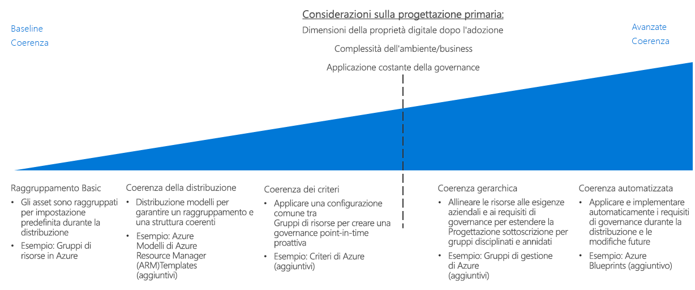

# CAF: Guida alle decisioni relative alla coerenza delle risorse

Azure [progettazione di una sottoscrizione](../subscriptions/overview.md) definisce la modalità di organizzazione gli asset cloud in relazione alla struttura dell'organizzazione, procedure consigliate di accounting e i requisiti del carico di lavoro. Oltre a questo livello di struttura, l'indirizzamento i requisiti dei criteri di governance dell'organizzazione attraverso i tuoi cloud richiede la possibilità di organizzare, distribuire e gestire le risorse all'interno di una sottoscrizione in modo coerente.

Passare a: [Raggruppamento di base](#basic-grouping) | [Coerenza di distribuzione](#deployment-consistency) | [Coerenza dei criteri](#policy-consistency) | [Coerenza gerarchica](#hierarchical-consistency) | [Coerenza automatizzata](#automated-consistency)

Le decisioni che riguardano il livello di requisiti di coerenza di risorse dei tuoi cloud sono principalmente determinate dai fattori seguenti: dimensioni estate digitale di post-migrazione, business o i requisiti dell'ambiente che non rientrano all'interno della sottoscrizione esistente gli approcci di progettazione o la necessità di applicare la governance nel tempo dopo che sono state distribuite le risorse. 

Questi fattori aumento priorità, i vantaggi di garantire una distribuzione coerente, raggruppamento e la gestione delle risorse basate su cloud diventa più importante. Ottenere più avanzate livelli di coerenza di risorse in base alle esigenze crescenti richiede uno sforzo impiegato in automazione, strumenti e imposizione della coerenza e ciò comporta un più tempo impiegato per la gestione delle modifiche e di rilevamento.

## Raggruppamento di base

In Azure i [gruppi di risorse](/azure/azure-resource-manager/resource-group-overview#resource-groups) sono un meccanismo principale di organizzazione delle risorse che consente di raggruppare le risorse in modo logico all'interno di una sottoscrizione.

I gruppi di risorse fungono da contenitori per le risorse con un ciclo di vita comune o vincoli di gestione condivisi, ad esempio criteri o requisiti di controllo degli accessi in base al ruolo. I gruppi di risorse non possono essere nidificati e le risorse possono appartenere a un solo gruppo di risorse. Alcune azioni possono essere applicate a tutte le risorse di un gruppo di risorse. Ad esempio, l'eliminazione di un gruppo di risorse comporta la rimozione di tutte le risorse all'interno di quel gruppo. La creazione di gruppi di risorse prevede degli schemi comuni, generalmente divisi in due categorie:

- Carichi di lavoro IT tradizionali: sono più comunemente raggruppati in base agli elementi all'interno di uno stesso ciclo di vita, ad esempio un'applicazione. Il raggruppamento in base all'applicazione consente la gestione di singole applicazioni.
- Carichi di lavoro IT Agile: sono incentrati sulle applicazioni cloud orientate ai clienti esterni. Questi gruppi di risorse spesso riflettono i livelli funzionali di distribuzione (ad esempio livello Web o livello app) e gestione.

## Coerenza di distribuzione

Basando la risorsa di base meccanismo di raggruppamento, la piattaforma Azure fornisce un sistema per l'uso di modelli per distribuire le risorse nell'ambiente cloud. È possibile usare i modelli per creare convenzioni di denominazione e organizzazione coerenti per distribuire i carichi di lavoro, applicando i vari aspetti della progettazione della distribuzione e gestione delle risorse.

I [modelli di Azure Resource Manager](/azure/azure-resource-manager/resource-group-overview#template-deployment) consentono di distribuire ripetutamente le risorse in uno stato coerente usando una configurazione e una struttura dei gruppi di risorse predeterminate. Con questi modelli è possibile definire facilmente un set di standard come base delle distribuzioni.

Ad esempio, è possibile avere un modello standard per la distribuzione di un carico di lavoro server web che contiene due macchine virtuali come server web combinati con un servizio di bilanciamento del carico per distribuire il traffico tra i server. È quindi possibile riutilizzare questo modello per creare set strutturalmente identico di macchine virtuali e il bilanciamento del carico ogni volta che questo tipo di carico di lavoro è necessario, pertanto è necessario solo modificare il nome della distribuzione e gli indirizzi IP.

È anche possibile distribuire questi modelli a livello di codice e integrarli con i sistemi CI/CD.

## Coerenza dei criteri

Per assicurare che i criteri di governance siano applicati al momento della creazione delle risorse, parte della progettazione del raggruppamento delle risorse prevede l'uso di una configurazione comune per distribuire le risorse.

Combinando gruppi di risorse e modelli di Resource Manager standardizzati, è possibile applicare standard relativi alle impostazioni necessarie in una distribuzione e alle regole di [Criteri di Azure](/azure/governance/policy/overview) da applicare a ogni gruppo di risorse o risorsa.

Supponiamo ad esempio che esista un requisito in base al quale tutte le macchine virtuali distribuite all'interno della sottoscrizione devono connettersi a una subnet comune gestita dal team IT centrale. È possibile creare un modello standard per la distribuzione di macchine virtuali del carico di lavoro che crea un gruppo di risorse separato per il carico di lavoro e vi distribuisce le macchine virtuali necessarie. Questo gruppo di risorse deve avere una regola dei criteri che consente di aggiungere alla subnet condivisa solo le interfacce di rete all'interno del gruppo di risorse.

Per una discussione più approfondita in merito all'applicazione delle decisioni relative ai criteri in una distribuzione cloud, vedere [Imposizione dei criteri](../policy-enforcement/overview.md).

## Coerenza gerarchica

Gruppi di risorse consente di supportare ulteriori livelli di gerarchia all'interno dell'organizzazione all'interno della sottoscrizione, applicano le regole di criteri di Azure e accedere ai controlli a livello di gruppo di risorse. Tuttavia, man mano che aumenta le dimensioni dei tuoi cloud, potrebbe essere necessario supportare i requisiti di governance tra sottoscrizioni più complessi che è possibile supportare usando gerarchia dell'organizzazione/reparto/Account/sottoscrizione del contratto Enterprise di Azure. 

[I gruppi di gestione di Azure](../subscriptions/overview.md#management-groups) consente alle sottoscrizioni dell'organizzazione in strutture organizzative più sofisticate dalle sottoscrizioni di raggruppamento in una gerarchia alternativa a quello definito dalla struttura del contratto enterprise. Questa gerarchia alternativa consente di applicare meccanismi di imposizione dei criteri e controllo di accesso a più sottoscrizioni e le risorse che contengono. Gerarchie di gruppi di gestione sono utilizzabile in modo che corrispondano sottoscrizioni dei tuoi cloud con operazioni o i requisiti di governance aziendali. 

## Coerenza automatizzata

Per le distribuzioni cloud di grandi dimensioni, la governance globale diventa tanto più importante quanto più complessa. È fondamentale applicare automaticamente i requisiti di governance durante la distribuzione delle risorse, oltre a soddisfare i requisiti aggiornati per le distribuzioni esistenti.

[Azure Blueprints](/azure/governance/blueprints/overview) consente alle organizzazioni di supportare la governance globale di ambienti cloud estesi in Azure. Blueprints va oltre le funzionalità fornite da modelli di Azure Resource Manager standard, permettendo di creare orchestrazioni di distribuzione complete in grado di distribuire le risorse e applicare regole dei criteri. Blueprints supporta il controllo delle versioni, la possibilità di applicare aggiornamenti a tutte le sottoscrizioni in cui è stato usato il piano del corso e la possibilità di bloccare le sottoscrizioni distribuite per evitare la creazione e la modifica non autorizzate di risorse.

Questi pacchetti di distribuzione consentono ai team IT e di sviluppo di distribuire rapidamente nuovi carichi di lavoro e risorse di rete conformi alle variazioni dei requisiti relativi ai criteri organizzativi. Blueprints può anche essere integrato in pipeline CI/CD per applicare standard di governance modificati alle distribuzioni quando vengono aggiornate.

## Passaggi successivi

Informazioni su come vengono usate la denominazione delle risorse e l'applicazione di tag per organizzare ulteriormente e gestire le risorse cloud.

> [!div class="nextstepaction"]
> [Denominazione delle risorse e applicazione di tag](../resource-tagging/overview.md)
