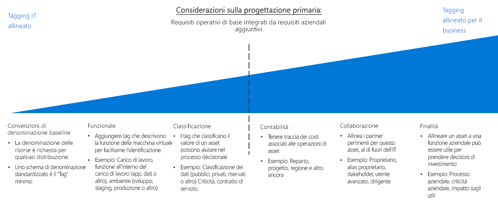

# Guida alle decisioni relative ai tag e all'organizzazione delle risorseResource organization and tagging decision guide

L'organizzazione delle risorse basate sul cloud è una delle attività più importanti per l'IT, a meno che le distribuzioni non siano molto semplici.Organizing cloud-based resources is one of the most important tasks for IT, unless you have very simple deployments. L'organizzazione delle risorse ha tre scopi principali:Organizing your resources serves three primary purposes:

- **Gestione delle risorse**.**Resource Management**. I team IT dovranno trovare rapidamente le risorse associate a specifici carichi di lavoro, ambienti, gruppi di proprietà o altre importanti informazioni.Your IT teams will need to quickly find resources associated with specific workloads, environments, ownership groups, or other important information. L'organizzazione delle risorse è critica per l'assegnazione di ruoli aziendali e di autorizzazioni di accesso per la gestione delle risorse.Organizing resources is critical to assigning organizational roles and access permissions for resource management.
- **Operazioni**.**Operations**. Oltre a rendere più semplice per l'IT la gestione delle risorse, uno schema organizzativo appropriato consente di sfruttare i vantaggi dell'automazione come parte della creazione di risorse, del monitoraggio operativo e della creazione di processi DevOps.In addition to making resources easier for IT to manage, a proper organizational scheme allows you to take advantage of automation as part of resource creation, operational monitoring, and the creation of DevOps processes.
- **Accounting**.**Accounting**. Per fare in modo che i gruppi aziendali siano a conoscenza dell'utilizzo delle risorse cloud, è necessario che l'IT sappia quali sono le risorse usate dai carichi di lavoro e dai team.Making business groups aware of cloud resource consumption requires IT to understand what workloads and teams are using which resources. Per supportare approcci come l'accounting chargeback e showback, è necessario organizzare le risorse cloud in modo che rispecchino la proprietà e l'utilizzo.To support approaches such as chargeback and showback accounting, cloud resources need to be organized to reflect ownership and usage.

## Guida relativa alle decisioni sui tagTagging decision guide

Passare a: [Convenzioni di denominazione di base](#baseline-naming-conventions) | [Modelli di aggiunta di tag alle risorse](#resource-tagging-patterns) | [Criteri di denominazione e di aggiunta di tag](#naming-and-tagging-policy) | [Altre informazioni](#learn-more)Jump to: [Baseline naming conventions](#baseline-naming-conventions) | [Resource tagging patterns](#resource-tagging-patterns) | [Naming and tagging policy](#naming-and-tagging-policy) | [Learn more](#learn-more)

L'approccio ai tag può essere semplice o complesso, con particolare attenzione ad attività che vanno dal supporto dei team IT che gestiscono i carichi di lavoro cloud all'integrazione delle informazioni relative a tutti gli aspetti dell'intera azienda.Your tagging approach can be simple or complex, with the emphasis ranging from supporting IT teams managing cloud workloads to integrating information relating to all aspects of the entire business.

Un'attenzione ai tag allineata all'IT ridurrà la complessità del monitoraggio degli asset e renderà molto più semplice prendere decisioni di gestione basate sulla funzionalità e sulla classificazione.An IT-aligned tagging focus will reduce the complexity of monitoring assets and make management decisions based on functionality and classification much easier.

Gli schemi di assegnazione di tag che includono anche criteri non IT potrebbero richiedere molto più tempo per creare standard di assegnazione di tag basati sugli interessi aziendali e per mantenere tali standard nel corso del tempo.Tagging schemes that also include non-IT policies may require a larger time investment to create tagging standards that reflect business interests and maintain those standards over time. Tuttavia, il risultato di questo processo è un sistema di assegnazione di tag che offre maggiori possibilità di tenere conto dei costi e del valore degli asset IT.However, the result of this process is a tagging system providing an improved ability to account for costs and value of IT assets. Questa associazione tra il valore di un asset e il costo operativo è uno dei primi passi da fare per modificare la percezione dell'IT come centro di costo nell'organizzazione.This association of an asset's value to its operational cost is one of the first steps in changing the cost center perception of IT within your organization.

## Convenzioni di denominazione di baseBaseline naming conventions

Una convenzione di denominazione standard è il punto di partenza per organizzare le risorse ospitate nel cloud.A standardized naming convention is the starting point for organizing your cloud-hosted resources. Un sistema di denominazione strutturato correttamente consente di identificare rapidamente le risorse a fini di gestione e di accounting.A properly structured naming system allows you to quickly identify resources for both management and accounting purposes. Se in altre parti dell'organizzazione esistono convenzioni di denominazione IT, valutare se le convenzioni di denominazione delle risorse cloud devono essere allineate con queste convenzioni o se è meglio stabilire standard separati basati sul cloud.If you have existing IT naming conventions in other parts of your organization, consider whether your cloud resource naming conventions should align with them or if you should establish separate cloud-based standards.

Tenere anche presente che i [requisiti di denominazione](../../../best-practices/naming-conventions.md#naming-rules-and-restrictions) sono diversi a seconda dei tipi di risorsa di Azure.Note also that different Azure resource types have different [naming requirements](../../../best-practices/naming-conventions.md#naming-rules-and-restrictions). Le convenzioni di denominazione devono essere compatibili con questi requisiti di denominazione.Your naming conventions must be compatible with these naming requirements.

## Modelli di tag delle risorseResource tagging patterns

Per un'organizzazione più sofisticata di quella che può garantire una convenzione di denominazione coerente, le piattaforme cloud consentono di applicare tag alle risorse.For more sophisticated organization than a consistent naming convention only can provide, cloud platforms support the ability to tag resources.

I *tag* sono elementi dei metadati collegati alle risorse.*Tags* are metadata elements attached to resources. I tag sono costituiti da coppie di stringhe chiave/valore.Tags consist of pairs of key/value strings. I valori inclusi in queste coppie vengono decisi dall'utente, ma l'applicazione di un set coerente di tag globali, nell'ambito dei criteri di denominazione e applicazione di tag completi, è una parte essenziale dei criteri di governance generali.The values you include in these pairs is up to you, but the application of a consistent set of global tags, as part of a comprehensive naming and tagging policy, is a critical part of an overall governance policy.

Di seguito sono riportati alcuni esempi di modelli di tag comuni:Here are some examples of common tagging patterns:

<!-- markdownlint-disable MD033 -->

| Tipo di tagTag type | EsempiExamples | DESCRIZIONEDescription |
|-----|-----|-----|
| FunzionaleFunctional            | app = catalogsearch1app = catalogsearch1  tier = webtier = web  webserver = apachewebserver = apache env = prodenv = prod  env = stagingenv = staging  env = devenv = dev                 | Classifica le risorse in relazione al loro scopo in un carico di lavoro, all'ambiente in cui sono state distribuite o ad altre funzionalità e dettagli operativi.Categorize resources in relation to their purpose within a workload, what environment they've been deployed to, or other functionality and operational details.                                 |
| classificazioneClassification        | confidentiality=privateconfidentiality=private sla = 24hourssla = 24hours                                 | Classifica una risorsa in base a come viene usata e ai criteri applicatiClassifies a resource by how it is used and what policies apply to it                               |
| ContabilitàAccounting            | department = financedepartment = finance  project = catalogsearchproject = catalogsearch  region = northamericaregion = northamerica | Consente di associare le risorse a determinati gruppi di un'organizzazione per la fatturazioneAllows resource to be associated with specific groups within an organization for billing purposes |
| CollaborazionePartnership           | owner = jsmithowner = jsmith  contactalias = catsearchownerscontactalias = catsearchowners stakeholders = user1;user2;user3stakeholders = user1;user2;user3                        | Fornisce informazioni sulle persone (al di fuori di IT) correlate o altrimenti interessate dalla risorsaProvides information about what people (outside of IT) are related or otherwise affected by the resource                      |
| ScopoPurpose               | businessprocess=supportbusinessprocess=support businessimpact=moderatebusinessimpact=moderate revenueimpact=highrevenueimpact=high   | Allinea le risorse alle funzioni aziendali per supportare meglio le decisioni relative agli investimentiAligns resources to business functions to better support investment decisions  |

<!-- markdownlint-enable MD033 -->

## Criteri di denominazione e applicazione di tagNaming and tagging policy

I criteri di denominazione e applicazione di tag cambieranno nel tempo.Your naming and tagging policy will evolve over time. È tuttavia importante stabilire le principali priorità aziendali all'inizio di una migrazione cloud.However, determining your core organizational priorities at the outset of a cloud migration is critical. Durante il processo di pianificazione, considerare attentamente le domande seguenti:As part of your planning process, carefully consider the following questions:

- Qual è il modo migliore per integrare i criteri di denominazione e applicazione di tag con i criteri di denominazione e aziendali esistenti nell'organizzazione?How best can your naming and tagging policies integrate with existing naming and organizational policies within your organization?
- Si implementerà un sistema di accounting chargeback o showback?Will you implement a chargeback or showback accounting system? Come sono rappresentati i reparti, i gruppi aziendali e i team in questa struttura organizzativa?How are your departments, business groups, and teams represented in this organizational structure?
- Quali informazioni dei tag saranno necessarie per tutte le risorse?What tagging information will be required for all resources? Quali informazioni dei tag verranno implementate o meno a discrezione dei singoli team?What tagging information will be left up to individual teams to implement or not implement?
- I tag devono rappresentare i dettagli come i requisiti di conformità alle normative per una risorsa?Does tagging need to represent details such regulatory compliance requirements for a resource? Quali sono i dettagli operativi, ad esempio i requisiti in termini di tempo di attività, le pianificazioni per l'applicazione di patch o i requisiti di sicurezza?What about operational details such as uptime requirements, patching schedules, or security requirements?

## Altre informazioniLearn more

Per altre informazioni sulla denominazione e l'applicazione di tag in Azure, vedere:For more information about naming and tagging in Azure, see:

- [Convenzioni di denominazione per le risorse di Azure](../../../best-practices/naming-conventions.md).[Naming conventions for Azure resources](../../../best-practices/naming-conventions.md). Fare riferimento a queste linee guida tratte dal sito Concetti fondamentali sul cloud di Azure per le convenzioni di denominazione consigliate per le risorse di Azure.Refer to this guidance from the Azure Cloud Fundamentals site for recommended naming conventions for Azure resources.
- [Usare tag per organizzare le risorse di Azure](/azure/azure-resource-manager/resource-group-using-tags?toc=/azure/billing/TOC.json).[Use tags to organize your Azure resources](/azure/azure-resource-manager/resource-group-using-tags?toc=/azure/billing/TOC.json). È possibile applicare i tag in Azure sia a livello di singole risorse che di gruppo di risorse, ottenendo la flessibilità necessaria in termini di granularità per qualsiasi report di accounting in base ai tag applicati.You can apply tags in Azure at both the resource group and individual resource level, giving you flexibility in the granularity of any accounting reports based on applied tags.

## Passaggi successiviNext steps

Informazioni su come la crittografia viene usata per proteggere i dati negli ambienti cloud.Learn how encryption is used to secure data in cloud environments.

> [!div class="nextstepaction"]
> [CrittografiaEncryption](../encryption/overview.md)
