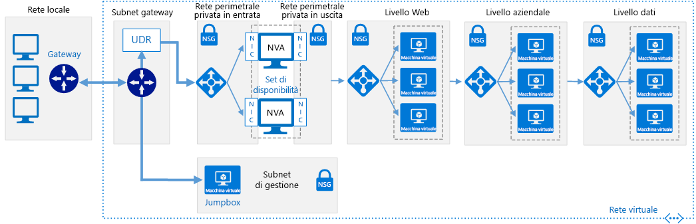

# Reti definite dal software: Reti perimetrali nel cloudSoftware Defined Networks: Cloud DMZ

L'architettura di rete perimetrale nel cloud consente un accesso limitato fra la rete locale e quella basata sul cloud, usando una rete privata virtuale (VPN) per connettere le reti.The Cloud DMZ network architecture allows limited access between your on-premises and cloud-based networks, using a virtual private network (VPN) to connect the networks. Una rete perimetrale viene distribuita nel cloud per proteggere l'accesso alla rete locale da risorse basate sul cloud.A DMZ is deployed in the cloud to secure access to the on-premises network from cloud-based resources.

Questa architettura è progettata per supportare scenari in cui l'organizzazione vuole iniziare a integrare carichi di lavoro basati sul cloud con carichi di lavoro locali, ma potrebbe non aver ancora maturato completamente i criteri di sicurezza nel cloud o acquisito una connessione WAN dedicata sicura fra i due ambienti.This architecture is designed to support scenarios where your organization wants to start integrating cloud-based workloads with on-premises workloads but may not have fully matured cloud security policies or acquired a secure dedicated WAN connection between the two environments. Di conseguenza le reti cloud devono essere trattate come una rete perimetrale per garantire la sicurezza dei servizi locali.As a result, cloud networks should be treated like a demilitarized zone to ensure on-premises services are secure.

La rete perimetrale distribuisce appliance virtuali di rete per implementare funzionalità di sicurezza quali firewall e ispezione dei pacchetti.The DMZ deploys network virtual appliances (NVAs) to implement security functionality such as firewalls and packet inspection. Il traffico che passa tra le applicazioni o i servizi locali e quelli basati sul cloud deve passare attraverso la rete perimetrale, dove può essere controllato.Traffic passing between on-premises and cloud-based applications or services must pass through the DMZ where it can be audited. Le connessioni VPN e le regole che determinano il traffico consentito attraverso la rete perimetrale sono rigidamente controllate dai team di sicurezza IT.VPN connections and the rules determining what traffic is allowed through the DMZ network are strictly controlled by IT security teams.

## Presupposti relativi alle reti perimetrali nel cloudCloud DMZ assumptions

La distribuzione di una rete perimetrale nel cloud presuppone le condizioni seguenti:Deploying a Cloud DMZ assumes the following:

- I team di sicurezza non hanno allineato completamente i requisiti e i criteri di sicurezza locali e basati sul cloud.Your security teams have not fully aligned on-premises and cloud-based security requirements and policies.
- I carichi di lavoro basati sul cloud richiedono accesso limitato ai servizi ospitati nelle reti locali o di terze parti oppure gli utenti o le applicazioni nell'ambiente locale hanno bisogno di accesso limitato alle risorse ospitate nel cloud.Your cloud-based workloads require limited access to services hosted on your on-premises or third-party networks, or your users or applications in your on-premises environment need limited access to cloud-hosted resources.
- L'implementazione di una connessione VPN tra le reti locali e un provider di servizi cloud non è impedita da criteri aziendali, requisiti normativi o problemi di compatibilità tecnica.Implementing a VPN connection between your on-premises networks and cloud provider is not prevented by corporate policy, regulatory requirements, or technical compatibility issues.
- I carichi di lavoro non richiedono più sottoscrizioni per ignorare i limiti delle risorse di sottoscrizione oppure comportano più sottoscrizioni, ma non richiedono la gestione centrale della connettività o dei servizi condivisi usati dalle risorse distribuite in più sottoscrizioni.Your workloads either do not require multiple subscriptions to bypass subscription resource limits, or they involve multiple subscriptions but don't require central management of connectivity or shared services used by resources spread across multiple subscriptions.

Il team di adozione del cloud deve tenere presenti i problemi seguenti relativamente all'implementazione di un'architettura di rete virtuale basata su rete perimetrale nel cloud:Your Cloud Adoption team should consider the following issues when looking at implementing a Cloud DMZ virtual networking architecture:

- La connessione di reti locali a reti cloud aumenta la complessità dei requisiti di sicurezza.Connecting on-premises networks with cloud networks increases the complexity of your security requirements. Anche se le connessioni tra reti cloud e ambiente locale sono protette, è sempre necessario assicurarsi che le risorse cloud siano protette.Even though the connection between cloud networks and the on-premises environment are secured, you still need to ensure cloud resources are secured.
- L'architettura di rete perimetrale nel cloud viene generalmente usata come tappa in attesa che la connettività venga ulteriormente protetta e i criteri di sicurezza tra le reti locale e cloud vengano allineati, consentendo una più ampia adozione di un'architettura di rete ibrida completa.The Cloud DMZ architecture is commonly used as a stepping stone while connectivity is further secured and security policy aligned between on-premises and cloud networks, allowing a broader adoption of a full-scale hybrid networking architecture.

## Altre informazioniLearn more

Vedere il collegamento seguente per altre informazioni sull'implementazione di una rete perimetrale nel cloud nella piattaforma Azure.See the following for more information about the implementing a Cloud DMZ in the Azure platform.

- [Implementare una rete perimetrale tra Azure e il data center locale](../../../reference-architectures/dmz/secure-vnet-hybrid.md).[Implement a DMZ between Azure and your on-premises datacenter](../../../reference-architectures/dmz/secure-vnet-hybrid.md). Questo articolo illustra come implementare un'architettura di rete ibrida sicura in Azure.This article discusses how to implement a secure hybrid network architecture in Azure.
