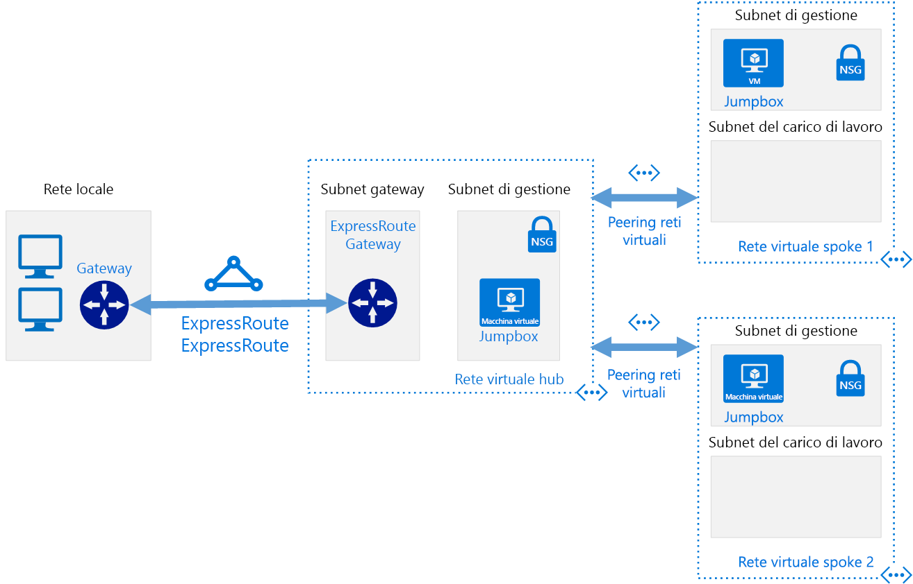

# Reti definite dal software: hub-spokeSoftware Defined Networks: Hub and Spoke

Il modello di rete hub-spoke organizza l'infrastruttura di rete cloud basata su Azure in più reti virtuali connesse.The hub and spoke networking model organizes your Azure-based cloud network infrastructure into multiple connected virtual networks. Questo modello consente di gestire in modo più efficiente i comuni requisiti di comunicazione o sicurezza e le potenziali limitazioni delle sottoscrizioni.This model allows you to more efficiently manage common communication or security requirements and deal with potential subscription limitations.

Nel modello hub-spoke l'*hub* è una rete virtuale che funge da posizione centrale per la gestione della connettività esterna e l'hosting dei servizi usati da più carichi di lavoro.In the hub and spoke model, the *hub* is a virtual network that acts as a central location for managing external connectivity and hosting services used by multiple workloads. Gli *spoke* sono reti virtuali che ospitano i carichi di lavoro e si connettono all'hub centrale tramite il [peering di rete virtuale](/virtual-network/virtual-network-peering-overview).The *spokes* are virtual networks that host workloads and connect to the central hub through [virtual network peering](/virtual-network/virtual-network-peering-overview).

Tutto il traffico in ingresso o in uscita dalle reti spoke dei carichi di lavoro viene instradato tramite la rete hub dove può essere indirizzato, controllato o altrimenti gestito dalle regole o dai processi IT gestiti in modo centralizzato.All traffic passing in or out of the workload spoke networks is routed through the hub network where it can be routed, inspected, or otherwise managed by centrally managed IT rules or processes.

Questo modello contribuisce a risolvere i problemi seguenti:This model aims to address the following issues:

- Risparmio sui costi ed efficienza della gestione.Cost savings and management efficiency. Centralizzando in un'unica posizione i servizi che possono essere condivisi da più carichi di lavoro, ad esempio appliance virtuali di rete e server DNS, l'IT può ridurre al minimo le risorse ridondanti e il lavoro richiesto dalla gestione in più carichi di lavoro.Centralizing services that can be shared by multiple workloads, such as network virtual appliances (NVAs) and DNS servers, in a single location allows IT to minimize redundant resources and management effort across multiple workloads.
- Superamento dei limiti delle sottoscrizioni.Overcoming subscriptions limits. Per i carichi di lavoro di grandi dimensioni basati sul cloud, potrebbe essere necessario usare più risorse di quelle consentite in una singola sottoscrizione di Azure. Vedere [Limiti delle sottoscrizioni](/azure/azure-subscription-service-limits).Large cloud-based workloads may require the use of more resources than are allowed within a single Azure subscription (see [subscription limits](/azure/azure-subscription-service-limits)). Il peering delle reti virtuali dei carichi di lavoro da sottoscrizioni diverse a un hub centrale consente di superare tali limiti.Peering workload virtual networks from different subscriptions to a central hub can overcome these limits.
- Separazione dei compiti.Separation of concerns. Possibilità di distribuire singoli carichi di lavoro tra i team IT centrali e i team responsabili dei carichi di lavoro.The ability to deploy individual workloads between central IT teams and workloads teams.

Il diagramma seguente illustra un'architettura hub-spoke di esempio che include la connettività ibrida gestita in modo centralizzato.The following diagram shows an example hub and spoke architecture including centrally managed hybrid connectivity.

L'architettura hub-spoke viene spesso usata insieme all'architettura di rete ibrida, fornendo una connessione gestita a livello centrale all'ambiente locale condiviso tra più carichi di lavoro.The hub and spoke architecture is often used alongside the hybrid networking architecture, providing a centrally managed connection to your on-premises environment shared between multiple workloads. In questo scenario tutto il traffico esistente tra i carichi di lavoro e l'ambiente locale passa attraverso l'hub dove può essere gestito e protetto.In this scenario, all traffic traveling between the workloads and on-premises passes through the hub where it can be managed and secured.

## Presupposti dell'architettura hub-spokeHub and spoke assumptions

L'implementazione di un'architettura di rete virtuale hub-spoke presuppone quanto segue:Implementing a hub and spoke virtual networking architecture assumes the following:

- Le distribuzioni cloud coinvolgono carichi di lavoro ospitati in ambienti di lavoro distinti, ad esempio sviluppo, test e produzione, tutti basati su un set di servizi comuni, ad esempio DNS o i servizi directory.Your cloud deployments will involve workloads hosted in separate working environments, such as development, test, and production, that all rely on a set of common services such as DNS or directory services.
- Non è necessario che i carichi di lavoro comunichino tra loro, ma hanno comunicazioni esterne comuni e requisiti di servizi condivisi.Your workloads do not need to communicate with each other but have common external communications and shared services requirements.
- I carichi di lavoro richiedono più risorse di quelle disponibili in una singola sottoscrizione di Azure.Your workloads require more resources than are available within a single Azure subscription.
- È necessario fornire ai team responsabili dei carichi di lavoro i diritti di gestione delegata sulle risorse mantenendo al contempo il controllo della sicurezza centrale sulla connettività esterna.You need to provide workload teams with delegated management rights over their own resources while maintaining central security control over external connectivity.

## Hub-spoke globaleGlobal hub and spoke

Le architetture hub-spoke vengono comunemente implementate con le reti virtuali distribuite nella stessa area di Azure per ridurre al minimo la latenza tra le reti.Hub and spoke architectures are commonly implemented with virtual networks deployed to the same Azure Region to minimize latency between networks. Per le organizzazioni di grandi dimensioni con copertura globale potrebbe tuttavia essere necessario distribuire i carichi di lavoro tra più aree per soddisfare i requisiti di disponibilità, ripristino di emergenza o normativi.However, large organizations with global reach may need to deploy workloads across multiple regions for availability, disaster recovery, or regulatory requirements. Usando il [peering di rete virtuale globale](/azure/virtual-network/virtual-network-peering-overview), il modello hub-spoke può estendere la gestione centralizzata e i servizi condivisi tra le aree per supportare la distribuzione dei carichi di lavoro in tutto il mondo.Through the use of Azure [global virtual network peering](/azure/virtual-network/virtual-network-peering-overview), the hub and spoke model can extend centralized management and shared services across regions to support workloads distributed across the world.

## Altre informazioniLearn more

Per esempi di implementazione delle reti hub-spoke in Azure, vedere gli esempi seguenti nel sito Architetture di riferimento di Azure:For examples of how to implement hub and spoke networks on Azure, see the following examples on the Azure Reference Architectures site:

- [Implementare una topologia di rete hub-spoke in AzureImplement a hub-spoke network topology in Azure](../../../reference-architectures/hybrid-networking/hub-spoke.md)
- [Implementare una topologia di rete hub-spoke con servizi condivisi in AzureImplement a hub-spoke network topology with shared services in Azure](../../../reference-architectures/hybrid-networking/shared-services.md)
