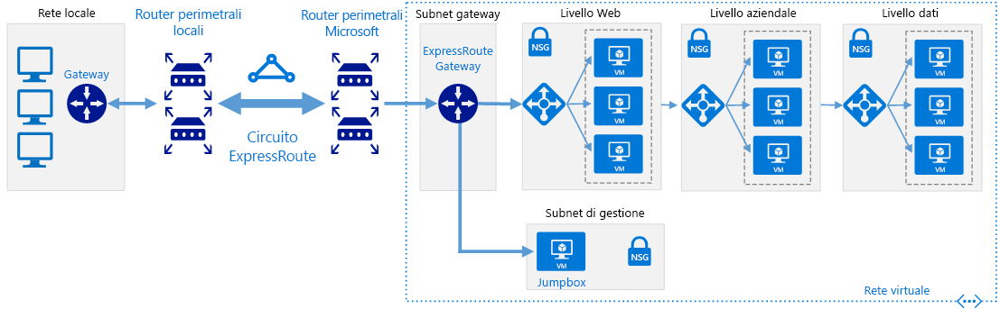

# Reti definite dal software: Rete ibridaSoftware Defined Networks: Hybrid network

L'architettura di rete del cloud ibrido consente alle reti virtuali di accedere a risorse locali e servizi e vice versa usando una connessione WAN dedicata, ad esempio ExpressRoute o un altro metodo di connessione per connettersi direttamente alle reti.The hybrid cloud network architecture allows virtual networks to access your on-premises resources and services and vice versa, using a Dedicated WAN connection such as ExpressRoute or other connection method to directly connect the networks.

Durante la compilazione dell'architettura di rete virtuale nativa del cloud, viene isolata una rete virtuale ibrida al momento della creazione.Building on the cloud native virtual network architecture, a hybrid virtual network is isolated when initially created. L'aggiunta della connettività all'ambiente locale concede l'accesso da e verso la rete locale, anche se è necessario consentire in modo esplicito tutte le altre risorse di destinazione di traffico in ingresso nella rete virtuale.Adding connectivity to the on-premises environment grants access to and from the on-premises network, although all other inbound traffic targeting resources in the virtual network need to be explicitly allowed. È possibile proteggere la connessione tramite i dispositivi virtuali firewall e le regole di gestione per limitare l'accesso oppure specificare esattamente quali servizi possono essere accessibili tra le due reti, usando le funzionalità di routing nativo del cloud o la distribuzione di appliance virtuali di rete (NVA) per la gestione del traffico.You can secure the connection using virtual firewall devices and routing rules to limit access or you can specify exactly what services can be accessed between the two networks using cloud-native routing features or deploying network virtual appliances (NVAs) to manage traffic.

Anche se l'architettura di rete ibrida supporta le connessioni VPN, le connessioni WAN dedicate, ad esempio ExpressRoute, sono in genere preferibili grazie alle prestazioni più elevate e a una maggiore sicurezza.Although the hybrid networking architecture supports VPN connections, dedicated WAN connections like ExpressRoute are generally preferred due to higher performance and increased security.

## Presupposti della connessione ibridaHybrid assumptions

La distribuzione di una rete virtuale ibrida presuppone quanto segue:Deploying a hybrid virtual network assumes the following:

- I team della sicurezza IT si sono allineati ai criteri di sicurezza di rete locale e basata su cloud, per garantire che le reti virtuali basate su cloud possano essere considerate attendibili per comunicare direttamente con i sistemi locali.Your IT security teams have aligned on-premises and cloud-based network security policy to ensure cloud-based virtual networks can be trusted to communicated directly with on-premises systems.
- I carichi di lavoro basati su cloud richiedono l'accesso alle risorse di archiviazione, alle applicazioni e ai servizi ospitati sulle reti locali o di terze parti, oppure agli utenti e alle applicazioni in locale che devono accedere alle risorse ospitate nel cloud.Your cloud-based workloads require access to storage, applications, and services hosted on your on-premises or third-party networks, or your users or applications in your on-premises need access to cloud-hosted resources.
- È necessario eseguire la migrazione delle applicazioni e dei servizi esistenti che dipendono da risorse locali, ma non si vogliono impiegare le risorse in un nuovo sviluppo per rimuovere tali dipendenze.You need to migrate existing applications and services that depend on on-premises resources, but don't want to expend the resources on redevelopment to remove those dependencies.
- L'implementazione di una VPN o di una connessione WAN dedicata tra le reti locali e un provider di servizi cloud non è impedita da criteri aziendali, requisiti normativi o problemi di compatibilità tecnica.Implementing a VPN or dedicated WAN connection between your on-premises networks and cloud provider is not prevented by corporate policy, regulatory requirements, or technical compatibility issues.
- I carichi di lavoro non richiedono più sottoscrizioni per ignorare i limiti delle risorse di sottoscrizione OPPURE i carichi di lavoro comportano più sottoscrizioni, ma non richiedono la gestione centrale della connettività o i servizi di condivisione usati dalle risorse distribuite in più sottoscrizioni.Your workloads either do not require multiple subscriptions to bypass subscription resource limits, OR your workloads involve multiple subscriptions but do not require central management of connectivity or shared services used by resources spread across multiple subscriptions.

Il team di adozione del cloud deve tenere presente i problemi seguenti, quando si esamina l'implementazione di un'architettura di rete virtuale ibrida:Your Cloud Adoption team should consider the following issues when looking at implementing a hybrid virtual networking architecture:

- La connessione di reti locali a reti cloud aumenta la complessità dei requisiti di sicurezza.Connecting on-premises networks with cloud networks increases the complexity of your security requirements. Entrambe le reti devono essere protette contro le vulnerabilità esterne e gli accessi non autorizzati da entrambi i lati dell'ambiente ibrido.Both networks need to be secured against external vulnerabilities and unauthorized access from both sides of the hybrid environment.
- Il ridimensionamento del numero e delle dimensioni di carichi di lavoro all'interno di un ambiente cloud ibrido può implicare una complessità significativa nella gestione di routing e traffico.Scaling the number and size of workloads within a hybrid cloud environment can add significant complexity to routing and traffic management.
- Sarà necessario sviluppare criteri di controllo di accesso e di gestione compatibili per mantenere la governance coerente in tutta l'organizzazione.You will need to develop compatible management and access control policies to maintain consistent governance throughout your organization.

## Altre informazioniLearn more

Vedere gli argomenti seguenti per altre informazioni sulle reti ibride nella piattaforma Azure.See the following for more information about hybrid networking in the Azure platform.

- [Architetture di riferimento della rete ibrida di Azure](../../../reference-architectures/hybrid-networking/expressroute.md).[Hybrid network reference architecture](../../../reference-architectures/hybrid-networking/expressroute.md). Le reti virtuali ibride di Azure usano entrambe un circuito ExpressRoute o VPN di Azure per connettere la rete virtuale alle esistenti risorse IT non di Azure ospitate dell'organizzazione.Azure hybrid virtual networks use either an ExpressRoute circuit or Azure VPN to connect your virtual network with your organization's existing non-Azure hosted IT assets. Questo articolo illustra le opzioni per la creazione di una rete ibrida in Azure.This article discusses the options for creating a hybrid network in Azure.
