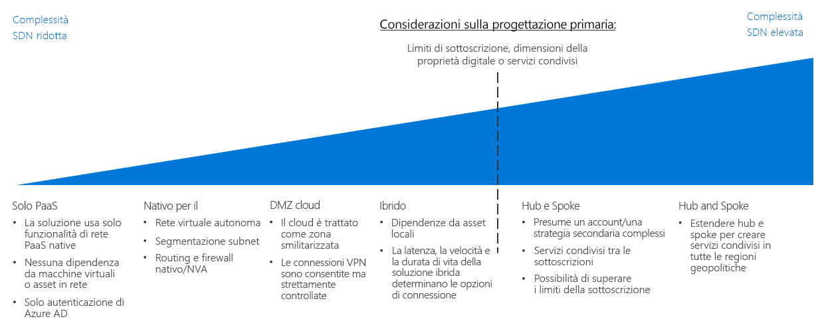

# CAF: Guida decisionale per la rete definita dal softwareCAF: Software Defined Network decision guide

La rete definita dal software (SDN, Software Defined Networking) è un'architettura di rete progettata per consentire funzionalità di rete virtualizzata che possono essere gestite, configurate e modificate in modo centralizzato tramite software.Software Defined Networking (SDN) is a network architecture designed to allow virtualized networking functionality that can be centrally managed, configured, and modified through software. La tecnologia SDN offre un livello di astrazione sull'infrastruttura di rete fisica e abilitagli equivalenti virtuali a di router, firewall e altri componenti hardware di rete fisici che si trovano in una rete locale.SDN provides an abstraction layer over the physical networking infrastructure, and enables the virtualized equivalent to physical routers, firewalls, and other networking hardware you would find in an on-premises network.

L'SDN consente al personale IT di configurare e distribuire strutture di rete e funzionalità che supportano le esigenze del carico di lavoro usando risorse virtualizzate.SDN allows IT staff to configure and deploy network structures and capabilities that support workload needs using virtualized resources. La flessibilità della gestione della distribuzione basata su software consente rapide modifiche delle risorse di rete e può supportare entrambi i modelli di distribuzione, tradizionale e agile.The flexibility of software-based deployment management enables rapid modification of networking resources and allows the ability to support both agile and traditional deployment models. Le reti virtualizzate create con tecnologia SDN sono fondamentali per creare reti sicure su una piattaforma di cloud pubblico.Virtualized networks created with SDN technology are critical to creating secure networks on a public cloud platform.

## Guida decisionale di reteNetworking decision guide

Passare a: [Solo PaaS](paas-only.md) | [Reti cloud native](cloud-native.md) | | [Reti perimetrali nel cloud](cloud-dmz.md) [Ibrido](hybrid.md) | [Modello hub-spoke](hub-spoke.md) | [Altre informazioni](#learn-more)Jump to: [PaaS Only](paas-only.md) | [Cloud native](cloud-native.md) | | [Cloud DMZ](cloud-dmz.md) [Hybrid](hybrid.md) | [Hub/Spoke model](hub-spoke.md) | [Learn more](#learn-more)

LSDN offre diverse opzioni con vari livelli di prezzo e complessità.SDN provides several options with varying degrees of pricing and complexity. La guida di individuazione sopra riportata rappresenta un riferimento per personalizzare rapidamente queste opzioni per allinearsi al meglio con le specifiche strategie aziendali e tecnologiche.The above discovery guide provides a reference to quickly personalize these options to best align with specific business and technology strategies.

Il punto critico in questa guida dipende da diverse decisioni chiave prese dal team per la strategia cloud prima di prendere altre sull'architettura di rete.The inflection point in this guide depends on several key decisions that your Cloud Strategy team have made before making decisions about networking architecture. Le più importanti tra queste sono le decisioni riguardanti la [definizione del digital estate](../../digital-estate/overview.md) e la [progettazione della sottoscrizione](../subscriptions/overview.md) (per cui possono essere necessari anche input da decisioni prese correlate alla contabilità cloud e alle strategie dei mercati globali).Most important among these are decisions involving your [Digital Estate definition](../../digital-estate/overview.md) and [Subscription Design](../subscriptions/overview.md) (which may also require inputs from decisions made related to your cloud accounting and global markets strategies).

Le distribuzioni di aree singole di piccole dimensioni di meno di 1.000 macchine virtuali hanno meno probabilità di essere influenzate in modo significativo da questo punto critico.Small, single region deployments of less than 1,000 VMs are less likely to be significantly affected by this inflection point. Al contrario, il grande lavoro di adozione richiesto con più di 1.000 macchine virtuali, più business unit o più mercati geo-politici può essere influenzato notevolmente dalla scelta della SDN e da questo punto critico.Conversely, large adoption efforts with more than 1,000 VMs, multiple business units, or multiple geo-politic markets, could be substantially affected by your SDN decision and this key inflection point.

## Scegliere le architetture di rete virtuale appropriateChoosing the right virtual networking architectures

Questa sezione sviluppa la guida decisionale per aiutare a scegliere le architetture di rete virtuale appropriate.This section expands on the decision guide to help you choose the right virtual networking architectures.

Esistono diversi modi per implementare le tecnologie SDN per creare reti virtuali basate su cloud.There are many ways to implement SDN technologies to create cloud-based virtual networks. Il modo in cui le reti virtuali usate nella migrazione si strutturano e interagiscono con l'infrastruttura IT esistente dipende da una combinazione dei requisiti del carico di lavoro e della governance.How you structure the virtual networks used in your migration and how those networks interact with your existing IT infrastructure will depend on a combination of the workload requirements and your governance requirements.

Quando si pianifica quale architettura di rete virtuale o combinazione di architetture considerare durante la pianificazione della migrazione cloud, bisogna considerare le domande seguenti per determinare quale sia quella più appropriata per l'azienda:When planning which virtual networking architecture or combination of architectures to consider when planning your cloud migration, consider the following questions to help determine what's right for your organization:

| DomandaQuestion | Solo PaaSPaaS Only | Reti cloud nativeCloud Native | Reti perimetrali nel cloudCloud DMZ | IbridoHybrid | Modello hub-spokeHub and Spoke |
|-----|-----|-----|-----|-----|-----|
| Il carico di lavoro usa solo i servizi PaaS e non richiede funzionalità di rete oltre a quelle fornite dagli stessi servizi?Will your workload only use PaaS services and not require networking capabilities beyond those provided by the services themselves? | SìYes | No No | No No | No No | No No |
| Il carico di lavoro richiede l'integrazione con applicazioni locali?Does your workload require integration with on-premises applications? | No No | No No | SìYes | SìYes | SìYes |
| Sono stati stabiliti criteri di sicurezza avanzati e connettività sicura tra le reti locali e cloud?Have you established mature security policies and secure connectivity between your on-premises and cloud networks? | No No | No No | No No | SìYes | SìYes |
| Il carico di lavoro richiede servizi di autenticazione non supportati tramite i servizi di identità cloud oppure serve un accesso diretto ai controller di dominio locali?Does your workload require authentication services not supported through cloud identity services, or do you need direct access to on-premises domain controllers? | No No | No No | No No | SìYes | SìYes |
| È necessario distribuire e gestire un numero elevato di macchine virtuali e di carichi di lavoro?Will you need to deploy and manage a large number of VMs and workloads? | No No | No No | No No | No No | SìYes |
| È necessario fornire gestione centralizzata e connettività locale in fase di delega controllo sulle risorse ai singoli team del carico di lavoro?Will you need to provide centralized management and on-premises connectivity while delegating control over resources to individual workload teams? | No No | No No | No No | No No | SìYes |

## Architetture di rete virtualeVirtual networking architectures

Altre informazioni sulle architetture di rete primarie definite dal software:Learn more about the primary software defined networking architectures:

- [**Solo PaaS**](paas-only.md): i prodotti PaaS (piattaforma distribuita come servizio) supportano un set limitato di funzionalità di rete predefinite e può non essere necessaria una rete definita dal software definita in modo esplicito per supportare i requisiti del carico di lavoro.[**PaaS Only**](paas-only.md): Platform as a service (PaaS) products support a limited set of built-in networking features and may not require an explicitly defined software defined network to support workload requirements.
- [**Reti cloud native**](cloud-native.md): una rete virtuale cloud nativa è l'architettura di rete definita dal software predefinita quando si distribuiscono risorse a una piattaforma cloud.[**Cloud Native**](cloud-native.md): A cloud native virtual network is the default software defined networking architecture when deploying resources to a cloud platform.
- [**Reti perimetrali nel cloud**](cloud-dmz.md): forniscono connettività limitata tra la rete locale e quella cloud protetta tramite l'implementazione di una zona demilitarizzata nell'ambiente cloud.[**Cloud DMZ**](cloud-dmz.md): Provides limited connectivity between your on-premises and cloud network which is secured through the implementation of a demilitarized zone on the cloud environment.
- [**Ibrido**](hybrid.md): l'architettura di rete del cloud ibrido consente alle reti virtuali di accedere alle risorse in locale e viceversa.[**Hybrid**](hybrid.md): The hybrid cloud network architecture allows virtual networks to access your on-premises resources and vice versa.
- [**Modello hub-spoke**](hub-spoke.md): l'architettura hub-spoke consente di gestire la connettività esterna e i servizi condivisi, di isolare singoli carichi di lavoro e di superare i limiti potenziali della sottoscrizione in modo centralizzato.[**Hub and Spoke**](hub-spoke.md): The hub and spoke architecture allows you to centrally manage external connectivity and shared services, isolate individual workloads, and overcome potential subscription limits.

## Altre informazioniLearn more

Vedere gli argomenti seguenti per altre informazioni sulle reti definite dal software nella piattaforma Azure.See the following for more information about software defined networking in the Azure platform.

- [Rete virtuale di Azure](/azure/virtual-network/virtual-networks-overview).[Azure Virtual Network](/azure/virtual-network/virtual-networks-overview). In Azure la funzionalità chiave di SDN viene fornita dalla rete virtuale di Azure che agisce come un cloud analogo alle reti locali fisiche.On Azure, the core SDN capability is provided by Azure Virtual Network, which acts as a cloud analog to physical on-premises networks. Le reti virtuali fungono anche da limite di isolamento predefinito tra le risorse della piattaforma.Virtual networks also act as a default isolation boundary between resources on the platform.
- [Procedure consigliate per la sicurezza della rete di Azure](/azure/security/azure-security-network-security-best-practices).[Azure Network Security Best Practices](/azure/security/azure-security-network-security-best-practices). Indicazioni del team di sicurezza di Azure su come configurare le reti virtuali per ridurre al minimo le vulnerabilità di sicurezza.Recommendations from the Azure Security team on how to configure your virtual networks to minimize security vulnerabilities.

## Passaggi successiviNext steps

Informazioni su come log, monitoraggio e report vengono usati dai team di operazioni per gestire l'integrità e la conformità dei criteri dei carichi di lavoro cloud.Learn how logs, monitoring, and reporting are used by operations teams to manage the health and policy compliance of cloud workloads.

> [!div class="nextstepaction"]
> [Log e reportLogs and Reporting](../log-and-report/overview.md)
