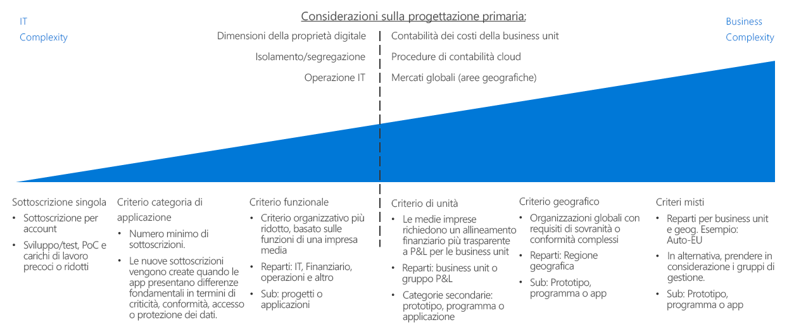
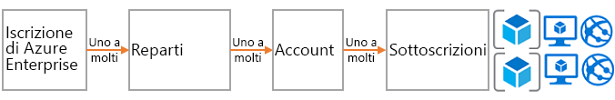
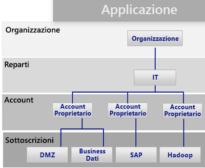
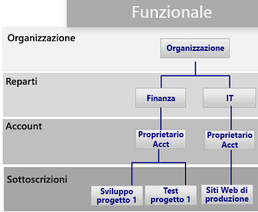
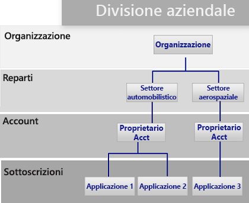
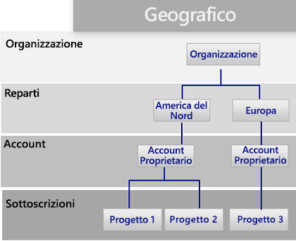

# Guida alle decisioni relative alle sottoscrizioni

Tutte le piattaforme cloud si basano su un modello di proprietà di base che offre alle organizzazioni numerose opzioni di gestione delle risorse e della fatturazione. La struttura usata da Azure è diversa da quella degli altri provider di servizi cloud perché include varie opzioni di supporto per la gerarchia aziendale e la proprietà delle sottoscrizioni raggruppate. Indipendentemente da ciò, esiste in genere una singola persona responsabile della fatturazione e un'altra assegnata come proprietario principale per la gestione delle risorse.

Passare a: [Progettazione delle sottoscrizioni e contratti Enterprise di Azure](#subscriptions-design-and-azure-enterprise-agreements) | [Schemi progettuali delle sottoscrizioni](#subscription-design-patterns) | [Gruppi di gestione](#management-groups) | [Organizzazione a livello di sottoscrizione](#organization-at-the-subscription-level)

La progettazione delle sottoscrizioni è una delle strategie più comuni usate dalle società per stabilire una struttura o organizzare gli asset durante l'adozione del cloud.

**Gerarchia delle sottoscrizioni**: Una *sottoscrizione* è una raccolta logica di servizi di Azure (ad esempio, macchine virtuali, database SQL, servizi app o contenitori). Ogni asset in Azure viene distribuito in una singola sottoscrizione. Ogni sottoscrizione è quindi di proprietà di un solo *account*. Questo account è un account utente (o preferibilmente un account del servizio) che fornisce l'accesso amministrativo e alla fatturazione in una sottoscrizione. Per i clienti che si sono impegnati a usare una quantità specifica di Azure tramite un contratto Enterprise (EA), viene aggiunto un altro livello di controllo, chiamato *reparto*. Nel portale EA la sottoscrizione, gli account e i reparti possono essere usati per creare una gerarchia per scopi di fatturazione e gestione.

La complessità delle progettazioni delle sottoscrizioni varia. Le decisioni che riguardano una strategia di progettazione includono punti di flesso univoci, perché in genere comportano vincoli aziendali e IT. Prima di prendere decisioni tecniche, gli architetti IT e i decision maker dovrebbero collaborare con gli stakeholder aziendali e il team per la strategia cloud per comprendere l'approccio al cloud accounting desiderato, le procedure di contabilità industriale all'interno delle business unit e le esigenze di mercato generali dell'organizzazione.

**Punto di flesso**: La linea tratteggiata nell'immagine precedente fa riferimento a un punto di flesso tra gli schemi semplici e quelli più complessi per la progettazione delle sottoscrizioni. Altri aspetti relativi alle decisioni tecniche basati sulle dimensioni del digital estate rispetto ai limiti della sottoscrizione di Azure, sui criteri di isolamento e separazione e sulle divisioni operative IT hanno in genere un impatto significativo sulla progettazione delle sottoscrizioni.

**Altre considerazioni**: Un aspetto importante da considerare quando si seleziona una progettazione di sottoscrizione è che le sottoscrizioni non sono l'unico modo per raggruppare le risorse o le distribuzioni. Le sottoscrizioni sono state create ai primordi di Azure, di conseguenza presentano limitazioni correlate alle soluzioni di Azure precedenti, ad esempio Azure Service Manager.

La struttura della distribuzione, l'automazione e i nuovi approcci al raggruppamento delle risorse possono influire sulla progettazione delle sottoscrizioni della struttura. Prima di finalizzare la progettazione di una sottoscrizione, considerare come le decisioni relative alla [coerenza delle risorse](../resource-consistency/overview.md) potrebbero influenzare le scelte di progettazione. Ad esempio, una grande organizzazione multinazionale inizialmente potrebbe considerare uno schema complesso per la gestione delle sottoscrizioni. Tuttavia, la stessa società potrebbe ottenere maggiori vantaggi con uno schema di business unit più semplice aggiungendo una gerarchia di gruppi di gestione.

## Progettazione di sottoscrizioni e contratti Enterprise di Azure

Tutte le sottoscrizioni di Azure sono associate a un solo account, che è connesso al controllo di accesso alla fatturazione e di primo livello per ogni sottoscrizione. Un singolo account può essere proprietario di più sottoscrizioni e offrire un livello di base di organizzazione delle sottoscrizioni.

Per le piccole distribuzioni di Azure, una sottoscrizione singola o una piccola raccolta di sottoscrizioni potrebbe costituire l'intero ambiente cloud. Tuttavia, è probabilmente necessario che le grandi distribuzioni di Azure si estendano a più sottoscrizioni per supportare la struttura organizzativa e ignorare [quote e limiti delle sottoscrizioni](/azure/azure-subscription-service-limits).

Ogni contratto Enterprise di Azure offre un'ulteriore possibilità di organizzare le sottoscrizioni e gli account in gerarchie che rispecchiano le priorità aziendali. L'iscrizione enterprise aziendale definisce la forma e l'uso dei servizi di Azure all'interno di una società da un punto di vista contrattuale. All'interno di ogni contratto Enterprise è possibile suddividere ulteriormente l'ambiente in reparti, account e sottoscrizioni che corrispondano alla struttura dell'organizzazione.

## Schemi progettuali per sottoscrizioni

Ogni azienda è diversa. La gerarchia reparto/account/sottoscrizione abilitata in un contratto Enterprise di Azure consente quindi una notevole flessibilità nell'organizzazione di Azure. La creazione di un modello di gerarchia dell'organizzazione per riflettere le esigenze della società in termini di fatturazione, gestione delle risorse e accesso alle risorse è la prima decisione, nonché la più importante, da prendere quando si inizia a usare il cloud pubblico.

I modelli di sottoscrizione seguenti riflettono un incremento generale della complessità della progettazione delle sottoscrizioni per supportare le potenziali priorità aziendali:

### Singola sottoscrizione

Una sottoscrizione singola per account potrebbe essere sufficiente per le organizzazioni che devono distribuire un numero ridotto di risorse ospitate nel cloud. Questo è spesso il primo modello di sottoscrizione che si implementa quando si inizia il processo di adozione del cloud, consentendo alle distribuzioni basate sul modello di verifica o sperimentali su scala ridotta di esplorare le funzionalità di una piattaforma cloud.

Possono tuttavia esistere limitazioni tecniche al numero di risorse che una sottoscrizione singola potrà supportare. Man mano che aumentano le dimensioni dell'ambiente cloud, sarà probabilmente necessario supportare anche l'organizzazione delle risorse per organizzare meglio i criteri e il controllo di accesso in un modo non supportato con una sottoscrizione singola.

### Modello di categoria delle applicazioni

Man mano che aumentano le dimensioni del footprint cloud di un'organizzazione, l'uso di più sottoscrizioni diventa sempre più probabile. In questo scenario le sottoscrizioni vengono in genere create per supportare le applicazioni che presentano differenze significative nel livello di criticità aziendale, nei requisiti di conformità, nei controlli di accesso o nelle esigenze di protezione dati. Le sottoscrizioni e gli account che supportano queste categorie di applicazioni sono tutti organizzati in un singolo reparto che è di proprietà ed è amministrato dal personale operativo IT centrale.

Ogni organizzazione sceglierà di classificare le applicazioni in modo diverso, spesso separando le sottoscrizioni in base a specifiche applicazioni o servizi oppure secondo le caratteristiche degli archetipi delle applicazioni. I carichi di lavoro che possa giustificare una sottoscrizione separata in questo modello includono:

- Applicazioni sperimentali o a basso rischio
- Applicazioni con i dati protetti
- Carichi di lavoro cruciali
- Applicazioni soggette a requisiti normativi (ad esempio, HIPAA o FedRAMP)
- Carichi di lavoro di Batch
- Carichi di lavoro di Big Data, ad esempio Hadoop
- Carichi di lavoro in contenitori che usano agenti di orchestrazione di distribuzione, ad esempio Kubernetes
- Carichi di lavoro di Analytics

Questo modello supporta più proprietari di account responsabili di carichi di lavoro specifici. Essendo privo di una struttura più complessa a livello di reparto della gerarchia del contratto Enterprise, questo modello non richiede un contratto Enterprise di Azure per l'implementazione.

### Modello funzionale

Questo modello organizza le sottoscrizioni e gli account in base alle caratteristiche funzionali, ad esempio finanza, vendite o supporto IT, usando la gerarchia azienda/reparto/account/sottoscrizione fornita ai clienti con contratto Enterprise di Azure.

### Modello business unit

Questo modello raggruppa le sottoscrizioni e gli account in base a categoria di profitti e perdite, business unit, divisione, centro di profitti o una struttura aziendale simile usando la gerarchia del contratto Enterprise di Azure.

### Modello geografico

Per le organizzazioni con operazioni globali, questo modello raggruppa le sottoscrizioni e gli account in base alle aree geografiche usando la gerarchia del contratto Enterprise di Azure.

### Modelli misti

Gerarchia azienda/reparto/account/sottoscrizioni. È tuttavia possibile combinare i modelli, ad esempio area geografica e business unit, in modo che rispecchino strutture di fatturazione e organizzative più complesse all'interno della società. Inoltre, la [progettazione della coerenza delle risorse](../resource-consistency/overview.md) può estendere ulteriormente la struttura di governance e organizzativa delle progettazione delle sottoscrizioni.

I gruppi di gestione, come descritto nella sezione seguente, consentono di supportare strutture organizzative più complesse.

I gruppi di gestione, descritti nella sezione seguente, consentono di supportare strutture organizzative più complesse.

## Gruppi di gestione

Oltre alla struttura basata su reparti e organizzazione fornita dai contratti Enterprise, i [gruppi di gestione di Azure](/azure/governance/management-groups/index) offrono una maggiore flessibilità per l'organizzazione di criteri, controllo di accesso e conformità in più sottoscrizioni. I gruppi di gestione possono essere annidati fino a sei livelli, consentendo di creare una gerarchia separata dalla gerarchia di fatturazione, esclusivamente per la gestione efficiente delle risorse.

I gruppi di gestione possono eseguire il mirroring della gerarchia di fatturazione e spesso le aziende iniziano in questo modo. Tuttavia, la potenza dei gruppi di gestione si afferma quando vengono usati per creare un modello per l'organizzazione in cui le sottoscrizioni correlate, indipendentemente dal fatto che si trovino nella gerarchia di fatturazione, vengono raggruppate e hanno bisogno di ruoli comuni assegnati, nonché di criteri e iniziative.

Tra gli esempi sono inclusi:

- Ambiente di produzione/non di produzione: Alcune organizzazioni creano gruppi di gestione per identificare le sottoscrizioni di produzione e non di produzione. I gruppi di gestione consentono a questi clienti di gestire più facilmente ruoli e criteri. Ad esempio, la sottoscrizione non di produzione può consentire agli sviluppatori l'accesso in qualità di collaboratore, ma nell'ambiente di produzione tali sviluppatori hanno solo l'accesso di lettore.
- Servizi interni/esterni: In modo molto simile agli ambienti di produzione/non di produzione, le aziende hanno spesso requisiti, criteri e ruoli diversi per servizi interni ed esterni destinati ai clienti.

## Organizzazione a livello di sottoscrizione

Quando si determinano i reparti e gli account (o gruppi di gestione), principalmente sarà necessario decidere come dividere l'ambiente di Azure per farlo corrispondere all'organizzazione. Le sottoscrizioni, tuttavia, sono i punti in cui viene eseguito il lavoro reale e queste decisioni influiranno su sicurezza, scalabilità e fatturazione.

Come guida, prendere in considerazione i modelli seguenti:

- **Applicazione/servizio**: le sottoscrizioni rappresentano un'applicazione o un servizio (ossia un portfolio di applicazioni).

- **Ciclo di vita**: le sottoscrizioni rappresentano un ciclo di vita di un servizio, ad esempio produzione o sviluppo.

- **Reparto**: le sottoscrizioni rappresentano i reparti dell'organizzazione.

I primi due criteri, quelli più usati, sono entrambi vivamente consigliati. L'approccio "ciclo di vita" è appropriato per la maggior parte delle organizzazioni. In questo caso, la raccomandazione generale è quella di usare due sottoscrizioni di base: produzione e non produzione e quindi usare i gruppi di risorse per suddividere ulteriormente gli ambienti.

Per una descrizione generale di come le sottoscrizioni e i gruppi di risorse di Azure vengono usati per raggruppare e gestire le risorse, vedere[Gestione dell'accesso alle risorse in Azure](../../getting-started/azure-resource-access.md).

## Passaggi successivi

Informazioni su come i servizi di gestione delle identità vengono usati per il controllo di accesso e la gestione nel cloud.

> [!div class="nextstepaction"]
> [Identità](../identity/overview.md)
