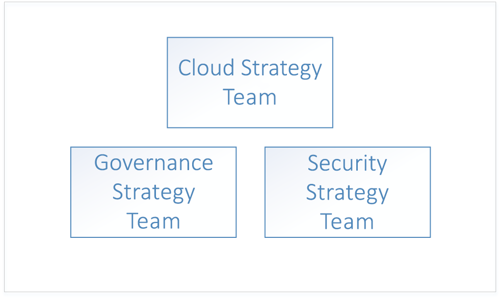
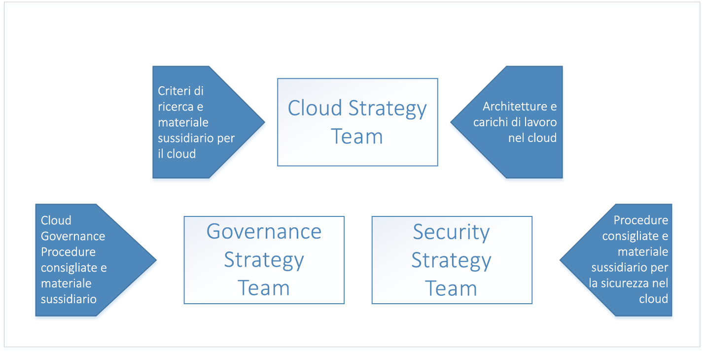
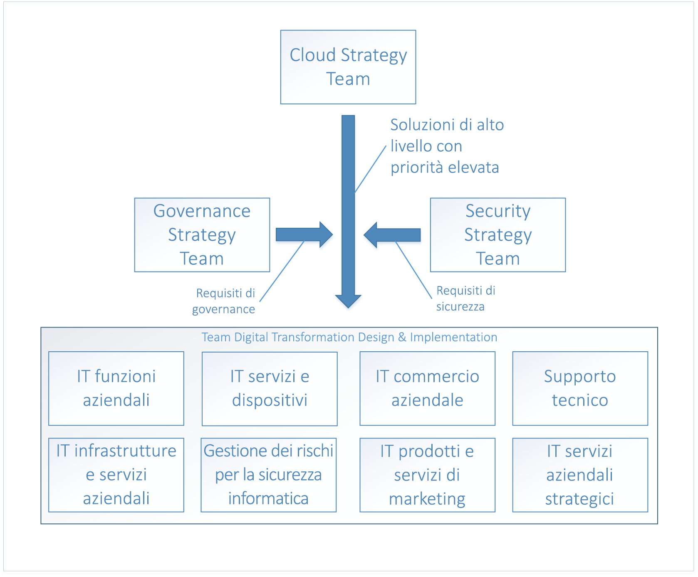

# Adozione del cloud nell'organizzazione: Introduzione 

La **trasformazione digitale** al cloud computing rappresenta un passaggio dal lavoro in locale al lavoro nel cloud. Questo passaggio include nuovi modi per condurre un'attività commerciale, ad esempio, la trasformazione digitale consente di passare dalle spese di capitale per software e hardware del data center a spese operative per l'uso di risorse cloud. 

## Trasformazione digitale: processo

Per adottare il cloud correttamente, è necessario che l'azienda prepari la propria organizzazione, il personale e i processi alla trasformazione digitale. La struttura organizzativa è diversa per ogni azienda, pertanto non esiste un approccio unico alla preparazione dell'organizzazione. Questo documento delinea la procedura di alto livello che l'azienda può adottare per prepararsi. L'organizzazione dovrà dedicare del tempo a sviluppare un piano dettagliato per eseguire ogni singolo passaggio elencato.

Il processo di alto livello per la trasformazione digitale consiste nel:

1. Creare un team per la strategia cloud. Questo team ha la responsabilità di condurre la trasformazione digitale. È anche importante in questa fase formare un team di governance e un team per la sicurezza dedicati alla trasformazione digitale.
2. I membri del team per la strategia cloud apprendono le novità e le differenze delle tecnologie cloud.  
3. Il team per la strategia cloud prepara l'azienda creando il caso aziendale per la trasformazione digitale: enumera tutte le lacune attuali della strategia aziendale e determina soluzioni di alto livello per eliminarle.
4. Allineare le soluzioni di alto livello con i gruppi aziendali. Identificare gli stakeholder in ogni gruppo aziendale a cui saranno affidati la progettazione e l'implementazione di ogni soluzione.
5. Traslare i ruoli, le competenze e il processo esistenti per includere i ruoli, le competenze e il processo cloud.  
<!--6. Develop processes for operating in the cloud to make solutions more robust in terms of availability, resiliency, and security. 
7. Optimize solutions for performance, scalability, and cost efficiency.-->

## Passaggio 1: Creare un team per la strategia cloud

Il primo passaggio nella trasformazione digitale dell'organizzazione è incaricare i leader aziendali dell'organizzazione a creare un team per la strategia cloud. Questo team è costituito da leader aziendali dei reparti finanza, infrastruttura IT e dei gruppi per le applicazioni. I team possono agevolare la fase di analisi e quella di sperimentazione del cloud.

Ad esempio, un team per la strategia cloud potrebbe essere guidato dal CTO e costituito da membri del team architettura enterprise, finanza IT, esperti senior di diversi gruppi di applicazioni IT, risorse umane, finanza e così via, e dai leader dei team di infrastruttura, sicurezza e rete.  

È anche importante formare altri due team di alto livello: un team di governance e un team per la sicurezza. Questi sono responsabili della progettazione, dell'implementazione e del controllo continuo della governance e dei criteri di sicurezza aziendali. Il team di governance deve essere composto da membri che hanno lavorato con la protezione degli asset, la gestione dei costi, i criteri di gruppo e gli argomenti correlati. Il team per la sicurezza deve essere composto da membri abbastanza esperti di standard di sicurezza attuali del settore, nonché di requisiti di sicurezza aziendale.

Il team di governance è responsabile della progettazione e dell'implementazione di un modello di governance aziendale nel cloud, nonché della distribuzione e della manutenzione degli asset dell'infrastruttura condivisa che fanno parte della trasformazione digitale. Questi asset includono risorse hardware, software e cloud necessarie per connettere la rete locale alla rete virtuale nel cloud.

Il team per la sicurezza è responsabile della progettazione e dell'implementazione di criteri di sicurezza aziendali nel cloud e lavora a stretto contatto con il team di governance. Il team per la sicurezza possiede l'estensione del limite di sicurezza della rete locale per includere la rete virtuale nel cloud. Questo potrebbe avvenire tramite il possesso e la manutenzione dei firewall in entrata e in uscita nella rete virtuale cloud nonché garantendo che gli strumenti e i criteri impediscono la distribuzione di risorse non autorizzate.

## Passaggio 2: Apprendere le novità del cloud
 
Il passaggio successivo nella trasformazione digitale dell'organizzazione è dedicato ai membri del team per la strategia cloud che apprenderanno in che modo la tecnologia cloud cambierà le attività aziendali dell'organizzazione. Consiste nella preparazione e nella pianificazione dei cambiamenti dell'azienda, del personale e delle tecnologie. È importante che i membri del team per la strategia cloud comprendano le novità e le differenze del cloud rispetto al sistema locale.

Il punto di partenza per comprendere il cloud consiste nell'imparare [come funziona Azure](what-is-azure.md) a livello elevato. Successivamente si apprendono le nozioni di base della [governance in Azure](what-is-governance.md) per prepararsi a [capire la gestione dell'accesso alle risorse](azure-resource-access.md).

Per informazioni approfondite, il team di governance deve esaminare i concetti e le guide di progettazione nella sezione relativa alla governance del sommario. Le sezioni dedicate all'infrastruttura e ai carichi di lavoro sono utili per apprendere le architetture tipiche e i carichi di lavoro nel cloud.

## Passaggio 3: Identificare le lacune nella strategia aziendale

Il passaggio successivo riguarda il team per la strategia cloud, il quale deve enumerare i problemi aziendali che richiedono una soluzione di trasformazione digitale. Ad esempio, un'azienda può disporre di un data center locale esistente il cui hardware ha raggiunto la fine del ciclo di vita e deve essere sostituito. In un altro esempio, un'azienda potrebbe avere difficoltà nell'immissione sul mercato delle nuove funzionalità e dei servizi e potrebbe essere in ritardo rispetto alla concorrenza. Queste lacune rappresentano gli *obiettivi* della trasformazione digitale dell'organizzazione.

Le lacune della strategia aziendale possono essere classificate nelle categorie seguenti:

|Categoria|DESCRIZIONE|
|-----|-----|
|Gestione dei costi|Rappresenta una lacuna nel modo in cui l'organizzazione paga per la tecnologia.|
|Governance|Rappresenta una lacuna nei processi usati dall'azienda per proteggere i propri asset da un uso improprio che potrebbe generare costi eccessivi, problemi di sicurezza o di conformità. | 
|Conformità|Rappresenta una lacuna nel modo in cui l'organizzazione rispetta i propri processi e criteri interni, oltre a leggi, normative e standard esterni. |
|Security|Rappresenta una lacuna nel modo in cui l'organizzazione protegge gli asset di dati e la tecnologia da minacce esterne. |
|Governance dei dati|Rappresenta una lacuna nel modo in cui un'azienda gestisce i dati, in particolare i dati dei clienti. Il nuovo Regolamento generale sulla protezione dei dati, o GDPR, dell'Unione europea, ad esempio, ha requisiti rigorosi per la protezione dei dati dei clienti che potrebbero richiedere nuovi hardware e software.|    

Dopo che l'azienda ha classificato tutte le lacune della strategia aziendale in queste categorie, il passaggio successivo consiste nel determinare una soluzione di alto livello per ogni problema.

La tabella seguente illustra alcuni esempi:

|Lacune della strategia aziendale|Categoria &nbsp; &nbsp; &nbsp; &nbsp; &nbsp;|Soluzione &nbsp;&nbsp;&nbsp;&nbsp;&nbsp;&nbsp;&nbsp;&nbsp;&nbsp;&nbsp;&nbsp;&nbsp;&nbsp;&nbsp;|
|-----|-----|-----|
| I servizi attualmente ospitati in locale riscontrano problemi di disponibilità, resilienza e scalabilità nella fase dei picchi della domanda, che rappresenta approssimativamente il 10% dell'uso. I server nel data center locale hanno raggiunto la fine del ciclo di vita. L'IT aziendale consiglia di acquistare un nuovo hardware locale per il data center con specifiche per gestire i picchi della domanda.| Gestione dei costi | Eseguire la migrazione dei carichi di lavoro locali esistenti interessati a risorse scalabili nel cloud, pagando solo per l'uso. |
| Le normative e le leggi sulla gestione dei dati esterni richiedono all'azienda di aderire a un insieme di controlli standard che prevedono la crittografia dei dati inattivi con un nuovo hardware e software. | Governance dei dati | Spostare i dati nella crittografia del servizio di archiviazione di Azure per dati inattivi. |
| Per i servizi ospitati nel data center locale si verificano attacchi Distributed Denial of Service nei servizi pubblici. È difficile mitigare gli attacchi, sono necessari un nuovo hardware e un nuovo software oltre a personale di sicurezza per gestire la situazione in modo efficace. | Security | Eseguire la migrazione di servizi in Azure e sfruttare la protezione DDoS di Azure.|

Dopo aver enumerato tutti le lacune della strategia aziendale e aver definito le soluzioni di alto livello, classificare l'elenco. Questa operazione può essere effettuata allineando le lacune della strategia aziendale con gli obiettivi a breve e a lungo termine dell'azienda per ogni categoria. Ad esempio, se un obiettivo a breve termine dell'azienda è ridurre i costi IT nei due trimestri fiscali successivi, le lacune aziendali nella categoria *gestione dei costi* possono essere classificate in base al risparmio previsto associato ad ognuna di esse.

Il risultato di questo processo è un elenco classificato per stack di soluzioni di alto livello allineate con le categorie aziendali. 

## Passaggio 4: Allineare le soluzioni di alto livello con i gruppi aziendali per eseguirne la progettazione 

Dopo aver enumerato e classificato gli obiettivi della trasformazione digitale e aver proposto soluzioni di alto livello, il passaggio successivo richiede che il team per la strategia cloud allinei ogni soluzione di alto livello con i team di progettazione e implementazione in ciascun gruppo aziendale. 

Prendendo in considerazione gli elenchi classificati, i team analizzano ogni soluzione di alto livello per eseguirne la progettazione. Il processo di progettazione comporta la specifica della nuova infrastruttura e dei nuovi carichi di lavoro. È anche possibile che vengano modificati i ruoli del personale e i processi che seguono. È inoltre estremamente importante in questa fase per ogni team di progettazione coinvolgere sia i team di governance che i team per la sicurezza, per analizzare ogni progetto. Tutti i progetti devono rispettare i criteri e le procedure definite dai team di governance e per la sicurezza, e questi ultimi devono essere coinvolti nella finalizzazione di ciascun progetto.

La progettazione di ogni soluzione è un'attività complessa e quando i progetti vengono creati è necessario considerarli nel contesto della progettazione delle soluzioni di altri team. Ad esempio, se molti di questi progetti comportano una migrazione di servizi e applicazioni locali esistenti nel cloud, potrebbe essere più efficiente raggrupparli e progettare una strategia di migrazione globale. In un altro esempio, potrebbe non essere possibile eseguire la migrazione di alcune applicazioni e servizi locali esistenti e la soluzione potrebbe consistere nel sostituirli con nuovi progetti di sviluppo o servizi di terze parti. In questo caso potrebbe essere più efficiente raggrupparli e determinarne la sovrapposizione per stabilire se un servizio di terze parti può essere usato per più di una soluzione.

Dopo aver completato la progettazione della soluzione, il team passa alla fase di implementazione per ogni progetto. La fase di implementazione per ogni progettazione di soluzione può consistere in un'esecuzione con processi di gestione del progetto standard.

## Passaggio 5: Traslare processi, competenze e ruoli esistenti per il cloud

In ogni fase evolutiva della storia del settore IT i cambiamenti più importanti del settore sono spesso caratterizzati dai cambiamenti dei ruoli del personale. Durante la transizione da sistemi mainframe a modelli client/server, il ruolo del tecnico informatico in gran parte è scomparso, sostituito dall'amministratore di sistema. Quando è arrivata l'era della virtualizzazione, la necessità di personale addetto ai server fisici si è ridotta, sostituita dall'esigenza di avere esperti di virtualizzazione. Analogamente, quando gli istituti di istruzione passeranno al cloud computing, molto probabilmente ci sarà un nuovo cambiamento nei ruoli. Gli esperti di data center, ad esempio, potrebbero essere sostituiti dagli analisti finanziari del cloud. Anche nei casi in cui le posizioni IT non sono state modificate, le mansioni giornaliere si sono evolute in modo significativo. 

I membri del personale IT potrebbero avere dei dubbi sui propri ruoli e sulle proprie posizioni perché si rendono conto che per supportare le soluzioni cloud sono necessarie competenze diverse. I dipendenti svegli che amano curiosare e apprendere le nuove tecnologie cloud non devono preoccuparsi. Possono guidare l'adozione di servizi cloud e aiutare l'organizzazione a comprendere e ad accettare i cambiamenti che ne derivano. 

### Comprendere i problemi

Durante la trasformazione digitale, ogni team deve comprendere eventuali problemi del personale quando questi emergono. Quando si cerca di comprendere i problemi, identificare gli elementi seguenti: 
* Il tipo di problema. Ad esempio, i dipendenti potrebbero non accettare i cambiamenti delle mansioni derivanti dalla trasformazione digitale.
* L'impatto del problema se non si viene risolto. La resistenza alla trasformazione digitale, ad esempio, potrebbe causare lentezza dei dipendenti nell'apportare le modifiche necessarie. 
* L'area idonea per affrontare il problema. Ad esempio, se i dipendenti del reparto IT sono riluttanti ad acquisire nuove competenze, l'area degli stakeholder IT è più idonea a risolvere questo problema. L'identificazione dell'area può risultare chiara per alcuni dei problemi e in questi casi potrebbe essere necessario rivolgersi alla dirigenza. 

### Identificare le lacune

Un altro aspetto del risolvere i problemi della trasformazione digitale dell'organizzazione consiste nell'identificare le **lacune**. Una lacuna è un ruolo, una competenza o un processo necessari alla trasformazione digitale che attualmente non esiste nell'organizzazione. 

Per iniziare, enumerare le nuove responsabilità che accompagnano la trasformazione digitale, con particolare attenzione alle nuove responsabilità e a quelle attuali da eliminare. Identificare l'area allineata con ogni responsabilità. Per le nuove responsabilità, determinarne l'allineamento con l'area. Alcune responsabilità possono riguardare più aree e questo rappresenta un'opportunità per migliorare l'allineamento che deve essere considerato un problema da affrontare. Si ha una lacuna se non viene identificata alcuna area responsabile.

Si passa quindi a identificare le competenze necessarie per supportare la responsabilità. Determinare se l'azienda dispone di risorse esistenti con queste competenze. Se non ce ne sono, determinare i programmi di formazione o di un'acquisizione dei talenti necessari. Determinare l'intervallo di tempo entro il quale è necessario supportare la responsabilità per continuare la trasformazione digitale in modo corretto.

Infine, identificare i ruoli che eseguiranno le competenze. Alcuni dipendenti già presenti si assumeranno parti del ruolo e in altri casi potrebbe essere necessario un ruolo completamente nuovo. 

### Partner tra i team

Le competenze necessarie per colmare le lacune della trasformazione digitale dell'organizzazione in genere non saranno limitate a un singolo ruolo o a un singolo reparto. Queste potranno essere in relazione e dipendere da un solo ruolo o da più ruoli, e tali ruoli potrebbero essere presenti in diversi reparti. Ad esempio, il proprietario di un carico di lavoro potrebbe richiedere l'impiego di un ruolo IT che possieda risorse di base, ad esempio sottoscrizioni e gruppi di risorse.

Queste dipendenze rappresentano i nuovi processi che l'organizzazione implementa per gestire il flusso di lavoro tra i ruoli. Nell'esempio precedente esistono diversi tipi di processo in grado di supportare la relazione tra il proprietario del carico di lavoro e il ruolo IT. Ad esempio, è possibile creare uno strumento del flusso di lavoro per gestire il processo oppure è possibile usare un semplice modello di messaggio di posta elettronica.

Tenere traccia di queste dipendenze e prendere nota dei processi che le supporteranno e dell'eventuale esistenza del processo al momento della trasformazione. Per i processi che richiedono strumenti, verificare che la sequenza temporale per la distribuzione degli strumenti sia allineata con la pianificazione della trasformazione digitale complessiva.

## Passaggi successivi

La trasformazione digitale è un processo iterativo e a ogni iterazione i team coinvolti diventano più efficienti. 

> [!div class="nextstepaction"]
> [Comprendere il funzionamento di Azure](what-is-azure.md)