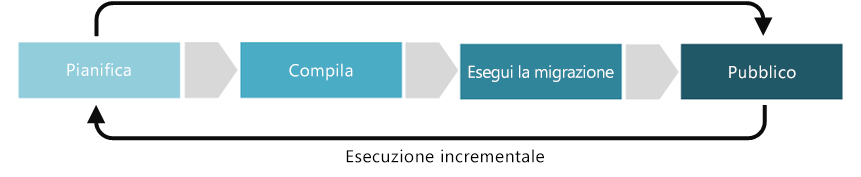

# Miglioramento della disciplina Accelerazione della distribuzione

La disciplina di Accelerazione della distribuzione si concentra sulla definizione di criteri che garantiscano che le risorse siano distribuite e configurate in modo coerente e ripetibile e rimangano conformi per tutto il loro ciclo di vita. Nell'ambito delle cinque discipline della governance del cloud, l'accelerazione della distribuzione include decisioni riguardanti l'automazione delle distribuzioni, il controllo alla fonte degli artefatti di distribuzione, il monitoraggio delle risorse distribuite per mantenere lo stato desiderato e la verifica di eventuali problemi di conformità.

Questo articolo delinea alcuni potenziali compiti che l'azienda può svolgere per sviluppare e maturare al meglio la disciplina di accelerazione della distribuzione. Queste attività possono essere suddivise nelle fasi di pianificazione, costruzione, adozione e funzionamento dell'implementazione di una soluzione cloud, che vengono poi ripetute per consentire lo sviluppo di un [approccio incrementale alla governance del cloud](../journeys/overview.md#an-incremental-approach-to-cloud-governance).

*Figura 1. Fasi di adozione dell'approccio incrementale alla governance del cloud.*

È impossibile tener conto per qualsiasi documento dei requisiti di tutte le aziende. Di conseguenza, questo articolo delinea le attività di esempio minime e potenziali suggerite per ogni fase del processo di maturazione della governance. L'obiettivo iniziale di queste attività è quello di permettere di costruire un [MVP dei criteri](../journeys/overview.md#an-incremental-approach-to-cloud-governance) e stabilire un framework per l'evoluzione incrementale dei criteri di Azure. Il team di governance del cloud dovrà decidere quanto investire in queste attività per migliorare le capacità di governance della baseline di identità.

> [!CAUTION]
> Nessuna delle attività minime o potenziali descritte in questo articolo è allineata a specifici criteri aziendali o requisiti di conformità di terzi. Queste linee guida sono state progettate per facilitare le conversazioni che porteranno all'allineamento di entrambi i requisiti con un modello di governance del cloud.

## Pianificazione e preparazione

Questa fase di maturità della governance colma il divario tra i risultati aziendali e le strategie attuabili. Durante questo processo, il team di leadership definisce metriche specifiche, associa tali metriche al patrimonio digitale e inizia a pianificare l'impegno complessivo richiesto per la migrazione.

**Attività minime suggerite:**

- Valutare la [toolchain per di Accelerazione della distribuzione](toolchain.md) e implementare una strategia ibrida adatta alla propria organizzazione.
- Sviluppare una bozza di linee guida sull'architettura e distribuirla ai principali stakeholder.
- Educare e coinvolgere le persone e i team interessati dallo sviluppo delle linee guida sull'architettura.
- Eseguire il training dei team di sviluppo e del personale IT per riconoscere i principi e le strategie di DevSecOps e l'importanza di distribuzioni completamente automatizzate nella disciplina di accelerazione della distribuzione.

**Attività potenziali:**

- Definire i ruoli e le assegnazioni che regoleranno l'accelerazione della distribuzione nel cloud.

## Compilazione e pre-distribuzione

**Attività minime suggerite:**

- Per le nuove applicazioni basate sul cloud, introdurre distribuzioni completamente automatizzate nelle prime fasi del processo di sviluppo. Questo investimento migliorerà l'affidabilità dei processi di testing e garantirà la coerenza tra gli ambienti di sviluppo, di controllo qualità e di produzione.
- Conservare tutti gli artefatti di distribuzione come i modelli di distribuzione o gli script di configurazione usando una piattaforma di controllo delle fonti come GitHub o Azure DevOps.
- Considerare un test pilota prima di implementare la [toolchain di Accelerazione della distribuzione](toolchain.md), in modo da ottimizzare il più possibile le distribuzioni. Applicare commenti e suggerimenti emersi dai test pilota durante la fase di pre-distribuzione, ripetendoli se necessario.
- Valutare l'architettura logica e fisica delle applicazioni e identificare le possibilità di automatizzare la distribuzione delle risorse applicative o di migliorare parti dell'architettura usando altre risorse basate sul cloud.
- Aggiornare il documento sulle linee guida dell'architettura per includere piani di distribuzione e adozione da parte degli utenti e distribuirlo ai principali stakeholder.
- Continuare a formare le persone e i team più interessati dalle linee guida dell'architettura.

**Attività potenziali:**

- Definire una pipeline di integrazione e distribuzione continua (CI/CD) per gestire completamente il rilascio di aggiornamenti alla propria applicazione tramite gli ambienti di sviluppo, di controllo qualità e di produzione.

## Adottare ed eseguire la migrazione

La migrazione è un processo incrementale incentrato sullo spostamento, il testing e l'adozione di applicazioni o carichi di lavoro in un patrimonio digitale esistente.

**Attività minime suggerite:**

- Eseguire la migrazione della [toolchain di Accelerazione della distribuzione](toolchain.md) dallo sviluppo alla produzione.
- Aggiornare il documento relativo alle linee guida sull'architettura e distribuirlo ai principali stakeholder.
- Sviluppare materiale didattico e documentazione, comunicazioni di sensibilizzazione, incentivi e altri programmi per aiutare a guidare gli sviluppatori e l'adozione dell'IT.

**Attività potenziali:**

- Verificare che le procedure consigliate definite durante le fasi di compilazione e pre-distribuzione siano eseguite correttamente.
- Assicurarsi che ogni applicazione o carico di lavoro si allinei alla strategia di accelerazione della distribuzione prima del rilascio.

## Operazione e post-implementazione

Al termine della trasformazione, la governance e le operazioni devono continuare a funzionare per il ciclo di vita naturale di un'applicazione o di un carico di lavoro. Questa fase di maturità della governance si basa principalmente sulle attività che vengono svolte in genere dopo che la soluzione è stata implementata e il ciclo di trasformazione ha iniziato a stabilizzarsi.

**Attività minime suggerite:**

- Personalizzare la [toolchain di Accelerazione della distribuzione](toolchain.md) in base alle modifiche delle mutevoli esigenze di identità dell'organizzazione.
- Automatizzare le notifiche e i report in modo che possano avvisare in merito a potenziali problemi di configurazione o minacce dannose.
- Monitorare e creare report sull'utilizzo delle applicazioni e delle risorse.
- Creare report sulle metriche di post-distribuzione e distribuirle alle parti interessate.
- Rivedere le linee guida sull'architettura per guidare i futuri processi di adozione.
- Continuare a comunicare ed eseguire il training alle persone e ai team interessati per garantire la continua osservanza delle linee guida sull'architettura.

**Attività potenziali:**

- Configurare uno strumento di monitoraggio e reporting della configurazione dello stato desiderato.
- Riesaminare regolarmente gli strumenti di configurazione e gli script per migliorare i processi e identificare i problemi comuni.
- Lavorare con i team di sviluppo, operativi e di sicurezza per aiutare a maturare le pratiche di DevSecOps e abbattere i silos organizzativi che causano inefficienze.

## Passaggi successivi

Una volta compreso il concetto di governance dell'identità del cloud, esaminare il [toolchain della Baseline di identità](toolchain.md) per identificare gli strumenti e le funzionalità di Azure di cui si avrà bisogno per sviluppare la disciplina di governance della Baseline di identità sulla piattaforma Azure.

> [!div class="nextstepaction"]
> [Toolchain della Baseline di identità per Azure](toolchain.md)
