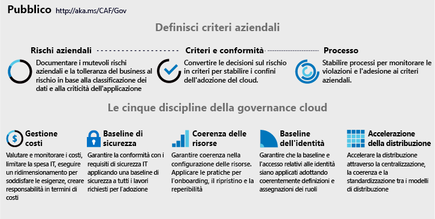

# Le cinque discipline della governance del cloud

<!-- markdownlint-disable MD033 -->

<ul class="panelContent cardsI">
<li style="display: flex; flex-direction: column;">
    

        

            

                

Qualsiasi modifica apportata a processi di business o piattaforme tecnologiche introduce dei rischi. I team di governance del cloud, i cui membri sono talvolta definiti come responsabili del cloud, hanno il compito di ridurre tali rischi, con un'interruzione minima per gli interventi di adozione o innovazione.  Il modello di governance CAF guida queste decisioni indipendentemente dalla piattaforma cloud scelta, concentrandosi sullo <a href="#corporate-policy">sviluppo di criteri aziendali</a> e sulle <a href="#disciplines-of-cloud-governance">discipline della governance del cloud</a>. Le <a href="#actionable-journeys">Guide alla progettazione operativa</a> illustrano questo modello usando i servizi di Azure. Questo articolo funge da pagina di destinazione per le cinque discipline del modello di governance CAF.
                

            

        

    

</li>
<li style="display: flex; flex-direction: column;">
    <a href="../_images/operational-transformation-govern-highres.png" style="display: flex; flex-direction: column; flex: 1 0 auto;">
        

            

                

                    

 
<i>Figura 1. Oggetto visivo relativo alle cinque discipline di governance del cloud e ai criteri aziendali</i>
                    

                

            

        

    </a>
</li>
</ul>

<!-- markdownlint-enable MD033 -->

## Discipline della governance del cloud

In ogni provider di servizi cloud è presente una serie di discipline di governance del cloud comuni che possono essere usate come guida informativa sui criteri e sull'allineamento di toolchain. Le discipline guidano le decisioni riguardo il livello appropriato di automazione e riguardo l'imposizione di criteri aziendali nei vari provider di servizi cloud.

<!-- markdownlint-disable MD033 -->

<ul class="panelContent cardsA">
<li style="display: flex; flex-direction: column;">
    <a href="./cost-management/overview.md" style="display: flex; flex-direction: column; flex: 1 0 auto;">
        

            

                

                    

                        

                            
                        

                    

                    

                        <h3>Gestione costi</h3>
                        
Il costo è una delle preoccupazioni principali per gli utenti del cloud. Sviluppare criteri per il controllo dei costi per tutte le piattaforme cloud.

                    

                

            

        

    </a>
</li>
<li style="display: flex; flex-direction: column;">
    <a href="./security-baseline/overview.md" style="display: flex; flex-direction: column; flex: 1 0 auto;">
        

            

                

                    

                        

                            
                        

                    

                    

                        <h3>Baseline di sicurezza</h3>
                        
La sicurezza è un argomento complesso e personale, univoco per ogni azienda. Una volta stabiliti i requisiti di sicurezza, i criteri e l'imposizione di governance del cloud applicano questi requisiti nelle configurazioni di rete, dati e asset.

                    

                

            

        

    </a>
</li>
<li style="display: flex; flex-direction: column;">
    <a href="./identity-baseline/overview.md" style="display: flex; flex-direction: column; flex: 1 0 auto;">
        

            

                

                    

                        

                            
                        

                    

                    

                        <h3>Baseline di identità</h3>
                        
Le incoerenze nell'applicazione dei requisiti di identità possono aumentare il rischio di violazione. La disciplina Baseline di identità è incentrata sui modi per verificare che l'identità venga applicata in modo uniforme tra gli interventi di adozione del cloud.

                    

                

            

        

    </a>
</li>
<li style="display: flex; flex-direction: column;">
    <a href="./resource-consistency/overview.md" style="display: flex; flex-direction: column; flex: 1 0 auto;">
        

            

                

                    

                        

                            
                        

                    

                    

                        <h3>Coerenza delle risorse</h3>
                        
Le operazioni cloud dipendono dalla coerenza nelle configurazioni delle risorse. Tramite gli strumenti di governance, le risorse possono essere configurate in modo coerente per ridurre i rischi correlati a onboarding, desincronizzazione, individuabilità e ripristino.

                    

                

            

        

    </a>
</li>
<li style="display: flex; flex-direction: column;">
    <a href="./deployment-acceleration/overview.md" style="display: flex; flex-direction: column; flex: 1 0 auto;">
        

            

                

                    

                        

                            
                        

                    

                    

                        <h3>Accelerazione della distribuzione</h3>
                        
Centralizzazione, standardizzazione e coerenza negli approcci di distribuzione e configurazione migliorano le procedure di governance. Quando resi disponibili tramite gli strumenti di governance basati sul cloud, creano un fattore cloud che consente di velocizzare le attività di distribuzione.

                    

                

            

        

    </a>
</li>
</ul>

<!-- markdownlint-enable MD033 -->
