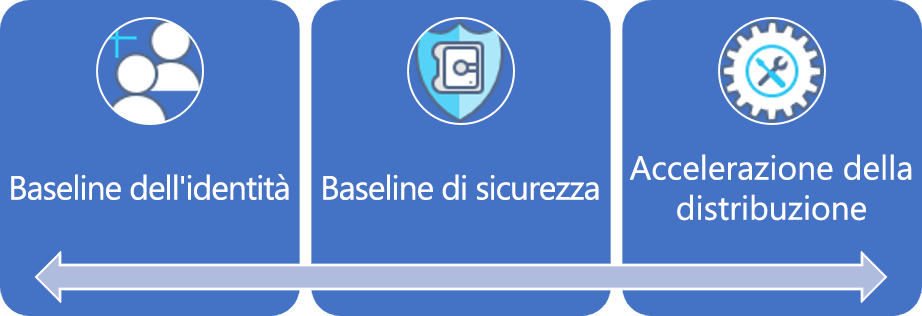
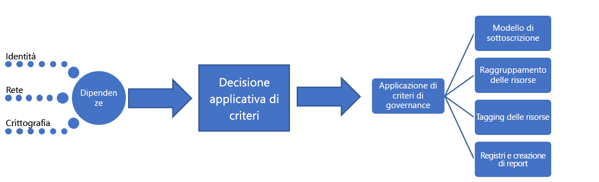

# Grandi imprese: Spiegazione delle procedure consigliate

Il percorso di governance inizia con un set di [criteri aziendali](./initial-corporate-policy.md) iniziali. Questi criteri vengono usati per stabilire un prodotto minimo funzionante (MVP, Minimum Viable Product) per la governance che sia conforme alle [procedure consigliate](./overview.md).

Questo articolo illustra le strategie di alto livello necessarie per creare un MVP per la governance. L'elemento centrale dell'MVP per la governance è la disciplina [Accelerazione della distribuzione](../../deployment-acceleration/overview.md). Gli strumenti e i modelli applicati in questa fase renderanno possibili le evoluzioni incrementali necessarie per espandere la governance in futuro.

## MVP per la governance (Cloud Adoption Foundation)

Un'adozione rapida dei criteri di governance e aziendali è possibile, grazie ad alcuni semplici principi e a strumenti di governance basati sul cloud. Di seguito sono descritte le prime tre discipline a cui fare riferimento in qualsiasi processo di governance. Ognuna verrà approfondita in questo articolo.

Per iniziare, questo articolo illustra le strategie di alto livello alla base delle discipline Baseline di identità, Baseline di sicurezza e Accelerazione della distribuzione necessarie per creare un MVP per la governance, che verrà utilizzato come base per qualsiasi processo di adozione.

## Processo di implementazione

L'implementazione dell'MVP per la governance dipende direttamente da identità, sicurezza e rete. Dopo aver risolto le dipendenze, il team di governance del cloud stabilirà alcuni aspetti relativi alla governance. Le decisioni del team di governance del cloud e dei team di supporto verranno implementate tramite un singolo pacchetto di asset per l'imposizione di criteri.

Questa implementazione può essere descritta anche usando un semplice elenco di controllo:

1. Sollecitare decisioni relative alle dipendenze principali: identità, rete e crittografia.
2. Determinare il modello da usare durante l'imposizione dei criteri aziendali.
3. Determinare i modelli di governance appropriati per le discipline Coerenza delle risorse, Assegnazione di tag alle risorse e Registrazione e creazione di report.
4. Implementare gli strumenti di governance conformi al modello di imposizione dei criteri scelto per applicare decisioni dipendenti e di governance.

[!INCLUDE [implementation-process](../../../../../includes/cloud-adoption/governance/implementation-process.md)]

## Applicazione di modelli di governance

Il team di governance del cloud sarà responsabile delle decisioni e delle implementazioni seguenti. In molti casi, sarà necessario il contributo di altri team, ma è probabile che il team di governance del cloud si occupi sia delle decisioni che delle implementazioni. Le sezioni seguenti illustrano le decisioni prese per questo caso d'uso e i dettagli relativi a ogni decisione.

### Modello di sottoscrizione

Per le sottoscrizioni di Azure, è stato scelto un modello **misto**.

- Quando si presentano nuove richieste per le risorse di Azure, è consigliabile stabilire un "reparto" per ogni unità aziendale principale in ogni area geografica operativa. All'interno di ciascun reparto, devono essere create "sottoscrizioni" per ogni archetipo di applicazione.
- Un archetipo di applicazione consente di raggruppare le applicazioni con esigenze simili. Alcuni esempi comuni sono: applicazioni con dati protetti, applicazioni gestite (ad esempio, HIPAA o FedRAMP), applicazioni a basso rischio, applicazioni con dipendenze in locale, SAP o altri sistemi mainframe in Azure o applicazioni che estendono SAP o i sistemi mainframe in locale. Ogni organizzazione ha esigenze specifiche che dipendono dalla classificazione dei dati e dai tipi di applicazioni che supportano le attività aziendali. Il mapping delle dipendenze del patrimonio digitale consente di definire gli archetipi di applicazione in un'organizzazione.
- Nell'ambito della progettazione delle sottoscrizioni, è opportuno concordare una convenzione di denominazione comune in base ai due punti precedenti dell'elenco.

### Coerenza delle risorse

Come modello di coerenza delle risorse è stata scelta la **coerenza gerarchica**.

- Per ogni applicazione è necessario creare gruppi di risorse. Per ogni archetipo di applicazione è necessario creare gruppi di gestione. A tutte le sottoscrizioni nel gruppo di gestione associato è necessario applicare Criteri di Azure.
- Come parte del processo di distribuzione, i modelli di coerenza delle risorse per tutti gli asset devono essere archiviati nel controllo del codice sorgente.
- Ogni gruppo di risorse deve essere allineato a un'applicazione o a un carico di lavoro specifico.
- La gerarchia dei gruppi di gestione di Azure definita deve rappresentare la responsabilità di fatturazione e la proprietà delle applicazioni in base a gruppi nidificati.
- Un'implementazione estesa di Criteri di Azure può richiedere al team più tempo del previsto e non offrire particolare valore a questo punto. È tuttavia opportuno creare e applicare semplici criteri predefiniti per imporre le prime definizioni dei criteri di governance del cloud. Ciò consente di definire l'implementazione di requisiti di governance specifici che può quindi essere applicata a tutti gli asset distribuiti.

### Assegnazione di tag alle risorse

Per l'assegnazione di tag alle risorse, è stato scelto un modello di **contabilità**.

- Agli asset distribuiti devono essere assegnati tag con i valori seguenti: reparto/unità di fatturazione, area geografica, classificazione dei dati, criticità, contratto di servizio, ambiente, archetipo di applicazione, applicazione e proprietario dell'applicazione.
- Questi valori, insieme al gruppo di gestione e alla sottoscrizione di Azure associati a un asset distribuito, saranno alla base delle decisioni relative a governance, operazioni e sicurezza.

### Registrazione e creazione di report

A questo punto, da ogni team di sviluppo viene suggerito, ma non richiesto obbligatoriamente, un modello **ibrido**.

- Attualmente non sono stati definiti requisiti di governance relativi a punti dati specifici da raccogliere per la registrazione o la creazione di report. Questo aspetto è specifico di questo scenario fittizio e deve essere considerato un antimodello. Gli standard di registrazione devono essere determinati e applicati appena possibile.
- È necessario eseguire altre analisi prima del rilascio di eventuali dati protetti o carichi di lavoro cruciali.
- Prima del supporto di dati protetti o carichi di lavoro cruciali, è necessario garantire l'accesso della soluzione di monitoraggio locale esistente all'area di lavoro usata per la registrazione. Le applicazioni devono soddisfare i requisiti di sicurezza e registrazione associati all'uso del tenant, se l'applicazione deve essere supportata con un contratto di servizio definito.

## Evoluzione dei processi di governance

Alcune delle definizioni dei criteri non possono o non devono essere controllate da strumenti automatizzati. Altri criteri richiederanno un impegno periodico da parte dei team responsabili della sicurezza IT e della baseline di identità locale. Il team di governance del cloud dovrà controllare i processi seguenti per implementare le ultime otto definizioni dei criteri:

**Modifiche ai criteri aziendali**: il team di governance del cloud apporterà modifiche alla progettazione dell'MVP per la governance per l'adozione dei nuovi criteri. L'MVP per la governance consentirà l'imposizione automatica dei nuovi criteri.

**Accelerazione dell'adozione**: il team di governance del cloud ha esaminato gli script di distribuzione tra più team. Ha mantenuto un set di script da utilizzare come modelli di distribuzione. Tali modelli possono essere usati dai team di adozione del cloud e dai team di DevOps per definire più rapidamente le distribuzioni. Ogni script contiene i requisiti per l'applicazione dei criteri di governance e non richiede alcun impegno aggiuntivo da parte dei tecnici di adozione del cloud. Come responsabili di questi script, possono implementare più rapidamente le modifiche dei criteri. Possono anche essere considerati come acceleratori del processo di adozione. Ciò garantisce distribuzioni coerenti senza un'imposizione rigorosa della conformità.

**Training per i tecnici**: il team di governance del cloud offre sessioni di training bimestrali e ha messo a punto due video destinati ai tecnici. Entrambe le risorse sono utili ai tecnici per implementare più velocemente la cultura della governance e la modalità di esecuzione delle distribuzioni. Il team sta provvedendo ad aggiungere asset di training per illustrare la differenza tra le distribuzioni di produzione e quelle non di produzione, per consentire ai tecnici di comprendere l'impatto dei nuovi criteri sul processo di adozione. Ciò garantisce distribuzioni coerenti senza un'imposizione rigorosa della conformità.

**Pianificazione della distribuzione**: prima della distribuzione di asset contenenti dati protetti, il team di governance del cloud sarà responsabile di esaminare gli script di distribuzione per convalidarne la conformità alla governance. I team esistenti con le distribuzioni approvate in precedenza verranno controllati tramite strumenti automatici.

**Controllo mensile e creazione di report**: ogni mese, il team di governance del cloud esegue un controllo di tutte le distribuzioni cloud per convalidarne la costante conformità ai criteri. Eventuali deviazioni individuate vengono documentate e condivise con i team di adozione del cloud. Quando non si rischia un'interruzione dell'attività o una perdita dei dati, i criteri vengono imposti automaticamente. Al termine del controllo, il team di governance del cloud crea un report destinato al team per la strategia cloud e a ogni team di adozione del cloud per comunicare l'aderenza complessiva ai criteri. Il report viene inoltre archiviato a scopo legale e di controllo.

**Revisione trimestrale dei criteri**: ogni trimestre, il team di governance del cloud e il team per la strategia cloud esaminano i risultati dei controlli e suggeriscono le modifiche necessarie da apportare ai criteri aziendali. Molti di questi suggerimenti sono il risultato di strategie di miglioramento costanti e dell'osservazione dei modelli di utilizzo. Le modifiche ai criteri approvate vengono integrate negli strumenti di governance durante i cicli di controllo successivi.

## Modelli alternativi

Se uno qualsiasi dei modelli scelti in questo percorso di governance non è conforme ai requisiti del lettore, sono disponibili alternative per ogni modello:

- [Modelli di crittografia](../../../decision-guides/encryption/overview.md)
- [Modelli di identità](../../../decision-guides/identity/overview.md)
- [Modelli di registrazione e creazione di report](../../../decision-guides/log-and-report/overview.md)
- [Modelli di imposizione dei criteri](../../../decision-guides/policy-enforcement/overview.md)
- [Modelli di coerenza delle risorse](../../../decision-guides/resource-consistency/overview.md)
- [Modelli di assegnazione di tag alle risorse](../../../decision-guides/resource-tagging/overview.md)
- [Modelli di reti definite dal software](../../../decision-guides/software-defined-network/overview.md)
- [Modelli di progettazione delle sottoscrizioni](../../../decision-guides/subscriptions/overview.md)

## Passaggi successivi

Dopo aver implementato queste linee guida, ogni team di adozione del cloud può contare su una solida base di conoscenze relative alla governance. Il team di governance del cloud agirà in parallelo per aggiornare continuamente i criteri aziendali e le discipline di governance.

Entrambi i team useranno gli indicatori di tolleranza per identificare la successiva evoluzione necessaria per continuare a supportare l'adozione del cloud. Il passaggio successivo per l'azienda in questo percorso è l'evoluzione della baseline della governance per supportare le applicazioni con requisiti di autenticazione a più fattori legacy o di terze parti.

> [!div class="nextstepaction"]
> [Evoluzione della baseline di identità](./identity-baseline-evolution.md)
