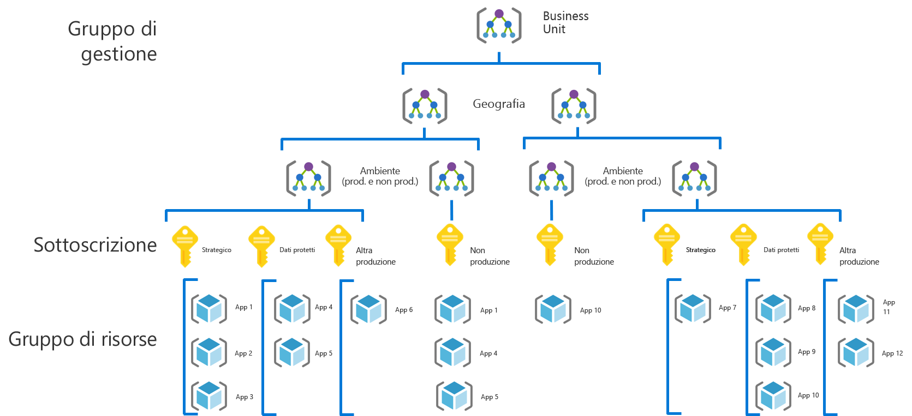
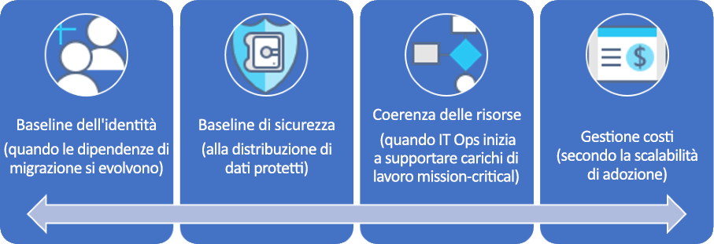

# CAF: Percorso di governance per aziende di grandi dimensioni

## Panoramica delle procedure consigliate

Questo percorso di governance segue le esperienze di una società fittizia attraverso le diverse fasi di evoluzione della governance. Il percorso è basato su percorsi di clienti reali. Le procedure consigliate si basano sui vincoli e sulle esigenze della società fittizia.

Come punto di partenza rapido, questa panoramica definisce un prodotto minimo funzionante (MVP) per la governance basato su procedure consigliate. Vengono inoltre forniti collegamenti ad alcune forme di evoluzione della governance che offrono altre procedure consigliate in base all'emergere di nuovi rischi tecnici o aziendali.

> [!WARNING]
> Questo MVP è solo un punto di partenza, fondato su un insieme di ipotesi. Anche questo insieme minimo di procedure consigliate è basato su criteri aziendali determinati da rischi commerciali e tolleranze di rischio speciali. Per determinare se queste ipotesi si applicano alla propria situazione, vedere lo [scenario più approfondito](./narrative.md) che segue questo articolo.

### Procedura consigliata per la governance

Questa procedura consigliata funge da base di cui può servirsi un'organizzazione per aggiungere in modo rapido e coerente misure di tutela per la governance tra più sottoscrizioni di Azure.

### Organizzazione delle risorse

Il diagramma seguente mostra la gerarchia dell'MVP per la governance per organizzare le risorse.

Tutte le applicazioni devono essere distribuite nell'area appropriata della gerarchia di gruppi di gestione, sottoscrizioni e gruppi di risorse. Durante la pianificazione della distribuzione, il team di governance del cloud creerà i nodi necessari nella gerarchia per i team responsabili dell'adozione del cloud.

1. Un gruppo di gestione per ogni business unit con una gerarchia dettagliata che rifletta geografia, e tipo di ambiente (produzione, non di produzione).
2. Una sottoscrizione per ogni combinazione univoca di business unit, geografia, ambiente e "Categorizzazione delle applicazioni".
3. Un gruppo di risorse separato per ogni applicazione.
4. È necessario applicare una nomenclatura coerente a ogni livello di questa gerarchia di gruppi.

Questi modelli lasciano un certo spazio per la crescita senza complicare inutilmente la gerarchia.

[!INCLUDE [governance-of-resources](../../../../../includes/cloud-adoption/governance/governance-of-resources.md)]

## Evoluzioni della governance

Una volta distribuito l'MVP, è possibile integrare livelli aggiuntivi di governance nell'ambiente. Ecco alcuni modi in cui trasformare l'MVP per soddisfare esigenze aziendali specifiche:

- [Baseline di sicurezza dei dati protetti](./security-baseline-evolution.md)
- [Configurazioni delle risorse per applicazioni cruciali](./resource-consistency-evolution.md)
- [Controlli per Gestione dei costi](./cost-management-evolution.md)
- [Controlli per l'evoluzione multi-cloud](./multi-cloud-evolution.md)

<!-- markdownlint-disable MD026 -->

## Qual è lo scopo di questa procedura consigliata?

Nell'MVP vengono definiti strumenti e procedure della disciplina di [accelerazione della distribuzione](../../deployment-acceleration/overview.md) per applicare rapidamente criteri aziendali. In particolare, l'MVP usa Azure Blueprints, Criteri di Azure e gruppi di gestione di Azure per applicare alcuni criteri aziendali di base, secondo quanto definito nello scenario per questa società fittizia. Questi criteri aziendali vengono applicati tramite modelli di Resource Manager e criteri di Azure per stabilire una baseline minima per identità e sicurezza.

## Evoluzione della procedura consigliata

Con il passare del tempo, questo MVP per la governance verrà usato per adeguare le procedure necessarie. Con il progredire dell'adozione, aumentano i rischi aziendali. Diverse discipline all'interno del modello di governance del framework per l'adozione del cloud evolveranno per mitigare questi rischi. Gli articoli successivi di questa serie illustrano l'evoluzione di criteri aziendali che interessano la società fittizia. Queste evoluzioni avvengono in tre discipline:

- Baseline di identità, con le dipendenze della migrazione che si evolvono nel testo descrittivo
- Gestione dei costi, con il ridimensionarsi dell'adozione.
- Baseline di sicurezza, man mano che vengono distribuiti dati protetti.
- Coerenza delle risorse, man mano che il team responsabile delle operazioni IT inizia a supportare carichi di lavoro cruciali.

## Passaggi successivi

Ora che si ha familiarità con l'MVP per la governance e un'idea delle evoluzioni della governance da seguire, consultare lo scenario associato per altre informazioni sul contesto.

> [!div class="nextstepaction"]
> [Consultare lo scenario associato](./narrative.md)
