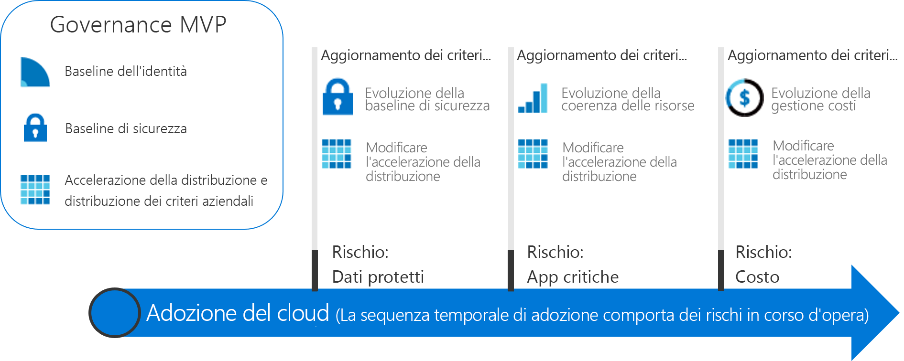

# Percorsi di governance di utilità pratica

I percorsi di governance in questa sezione illustrano l'approccio incrementale del modello di governance CAF. È possibile definire una piattaforma di governance agile in grado di evolvere per soddisfare le esigenze di qualsiasi scenario di governance del cloud.

## Esaminare e adottare le procedure consigliate per la governance del cloud

Per avviare un percorso di adozione, sceglierne uno dei seguenti. Ogni percorso illustra una serie di procedure consigliate, in base a un set di esperienze del cliente fittizie. Per i lettori che non hanno familiarità con l'approccio incrementale del modello di governance CAF, è consigliabile rivedere l'introduzione teorica generale alla governance riportata di seguito, prima di adottare una procedura consigliata.

<!-- markdownlint-disable MD033 -->

<ul class="panelContent cardsZ">
<li style="display: flex; flex-direction: column;">
    <a href="./small-to-medium-enterprise/overview.md" style="display: flex; flex-direction: column; flex: 1 0 auto;">
        

            

                

                    

                        <h3>Piccole e medie imprese</h3>
                        
Percorso di governance per le aziende proprietarie di meno di cinque data center e che gestiscono i costi tramite un modello con IT centralizzato o di showback.

                    

                

            

        

    </a>
</li>
<li style="display: flex; flex-direction: column;">
    <a href="./large-enterprise/overview.md" style="display: flex; flex-direction: column; flex: 1 0 auto;">
        

            

                

                    

                        <h3>Grandi imprese</h3>
                        
Percorso di governance per le aziende proprietarie di più di cinque data center e che gestiscono i costi per più business unit.

                    

                

            

        

    </a>
</li>
</ul>

<!-- markdownlint-enable MD033 -->

## Approccio incrementale alla governance del cloud

L'adozione del cloud è un viaggio, non una destinazione. Lungo il percorso, si incontrano fasi cardine chiare e vantaggi aziendali concreti. Lo stato finale di adozione del cloud è tuttavia in genere sconosciuto per l'azienda al momento di intraprendere il viaggio. La governance del cloud definisce le misure cautelative, ovvero i guardrail che mantengono l'azienda su un percorso sicuro per l'intero viaggio.

Questi percorsi di governance descrivono le esperienze di società fittizie, basate sui percorsi di clienti reali. Ogni percorso guida il cliente attraverso i vari aspetti della governance per l'adozione del cloud.

### Definizione di uno stato finale

Un viaggio senza una destinazione è semplice vagabondare. È importante stabilire una visione approssimativa dello stato finale prima di partire. L'infografica seguente offre una cornice di riferimento per lo stato finale. Non è il punto di partenza, ma mostra la potenziale destinazione.

Il modello di governance CAF identifica le aree principali di importanza durante il percorso. Ogni area è correlata ai tipi di rischi diversi che la società deve affrontare man mano che adotta ulteriori servizi cloud. Entro questa cornice, il percorso di governance identifica le azioni necessarie per il team di governance del cloud. Lungo il percorso viene descritto in maggiore dettaglio ogni principio del modello di governance CAF. In generale, sono inclusi i principi seguenti:

**Criteri aziendali**. I criteri aziendali sono alla base della governance del cloud. Il percorso di governance è incentrato su aspetti specifici dei criteri aziendali:

- Rischi aziendali: identificare e conoscere i rischi aziendali.
- Criteri e conformità: convertire i rischi in definizioni dei criteri che supportano eventuali requisiti di conformità.
- Processi: garantire la conformità ai criteri definiti.

**Cinque discipline della governance del cloud**. Queste discipline supportano i criteri aziendali. Ogni disciplina consente di proteggere l'azienda da potenziali insidie:

- Gestione costi
- Baseline di sicurezza
- Coerenza delle risorse
- Baseline di identità
- Accelerazione della distribuzione

In pratica, i criteri aziendali fungono da sistema di preavviso per rilevare potenziali problemi. Le discipline aiutano l'azienda a mitigare i rischi e creare le misure cautelative.

### Crescita fino allo stato finale

I requisiti di governance sono soggetti a evolversi lungo l'intero percorso di adozione del cloud, quindi è necessario un approccio diverso alla governance. Le aziende non possono più aspettare che un piccolo team crei i guardrail e le mappe per ogni autostrada *prima di affrontare la prima tappa*. È previsto che i risultati aziendali arrivino più rapidamente e con maggiore fluidità. La governance IT deve anche prevedere reazioni rapide e restare al passo con le esigenze aziendali per mantenere coerenza durante l'adozione del cloud ed evitare il "shadow IT".

Un approccio di **governance incrementale** supporta questi requisiti. La governance incrementale si basa su un piccolo set di criteri, processi e strumenti aziendali per gettare le fondamenta per l'adozione e la governance. Queste fondamenta sono note come **prodotto minimo funzionante (MVP, Minimum Viable Product)**. Un MVP consente al team di governance di incorporare velocemente la governance nelle implementazioni per l'intero ciclo di vita di adozione. È possibile stabilire un MVP in qualsiasi momento durante il processo di adozione del cloud. Tuttavia, è consigliabile adottare un MVP il prima possibile.

La possibilità di rispondere rapidamente a rischi mutevoli offre al team di governance del cloud l'opportunità di agire in modi nuovi. Il team di governance del cloud può unirsi al team di strategia del cloud per agire come esploratori in avanscoperta rispetto ai team di adozione del cloud, per tracciare la rotta e stabilire velocemente le misure cautelative necessarie per mitigare i rischi associati ai piani di adozione. Questi livelli di governance JIT sono noti come **evoluzioni della governance**. Con questo approccio, l'evoluzione della strategia di governance è un passo avanti rispetto ai team di adozione del cloud.

Il diagramma seguente mostra un semplice MVP per la governance e tre evoluzioni della governance. Durante le evoluzioni vengono definiti criteri aziendali aggiuntivi per la mitigazione di nuovi rischi. La disciplina Accelerazione della distribuzione applica quindi tali variazioni a ogni distribuzione.

> [!NOTE]
> La governance non è da intendersi come sostituto di funzioni chiave come sicurezza, rete, identità, finanza, DevOps o operazioni. Lungo il percorso vi saranno interazioni e dipendenze con i membri di ogni funzione. Tali membri dovrebbero essere inclusi nel team di governance del cloud per accelerare decisioni e azioni.

## Scelta di un percorso di governance

I percorsi dimostrano come implementare un MVP per la governance. Da qui, ogni percorso mostra come il team di governance del cloud può lavorare in anticipo rispetto ai team di adozione del cloud, come partner per accelerare le attività di adozione. Il modello di governance CAF rappresenta una guida per l'applicazione della governance dalle fondamenta e attraverso le evoluzioni successive.

Per iniziare un percorso di governance, scegliere una delle due opzioni seguenti. Le opzioni sono basate su esperienze dei clienti sintetizzate. I titoli sono basati sulle dimensioni dell'azienda per semplificare l'esplorazione. La decisione del lettore può essere tuttavia più complessa. Le tabelle seguenti illustrano le differenze tra le due opzioni.

> [!NOTE]
> È improbabile che uno dei percorsi si adatti completamente alla propria situazione. Scegliere il percorso più in linea e usarlo come punto di partenza. Per tutto il percorso vengono fornite informazioni aggiuntive che consentono di personalizzare le decisioni in modo da soddisfare criteri specifici.

### Caratteristiche dell'azienda

|                                            | Piccole e medie imprese                                                                              | Grandi imprese                                                                                               |
|--------------------------------------------|---------------------------------------------------------------------------------------------------------|----------------------------------------------------------------------------------------------------------------|
| Geografia (paese o area geopolitica) | I clienti o il personale si trovano in gran parte in un'unica area geografica                                                      | I clienti o il personale si trovano in gran parte in più aree geografiche                                                              |
| Business unit interessate                    | Singola business unit                                                                                    | Più business unit                                                                                        |
| Budget IT                                  | Singolo budget IT                                                                                        | Budget allocati alle diverse business unit                                                                         |
| Investimenti IT                             | Gli investimenti come spese in conto capitale (CapEx) sono pianificati su base annuale e riguardano in genere solo la manutenzione di base. | Gli investimenti come spese in conto capitale sono pianificati su base annuale e spesso includono la manutenzione e un ciclo di aggiornamento di 3-5 anni. |

### Stato corrente prima di adottare la governance del cloud

|                                             | Piccole e medie imprese                                                                               | Grandi imprese                                                                                                          |
|---------------------------------------------|----------------------------------------------------------------------------------------------------------|---------------------------------------------------------------------------------------------------------------------------|
| Data center o provider di hosting di terze parti | Meno di cinque data center                                                                                  | Più di cinque data center                                                                                                   |
| Rete                                  | Nessuna rete WAN o 1-2 provider WAN                                                                             | Rete complessa o WAN globale                                                                                             |
| Identità                                    | Foresta singola, dominio singolo. Nessun requisito per l'autenticazione basata su attestazioni o dispositivi MFA di terze parti. | Struttura complessa, più foreste, più domini. Per le applicazioni sono richiesti l'autenticazione basata su attestazioni o dispositivi MFA di terze parti. |

### Stato futuro desiderato dopo l'evoluzione della governance del cloud

|                                              | Piccole e medie imprese                                                                        | Grandi imprese                                                                                        |
|----------------------------------------------|---------------------------------------------------------------------------------------------------|---------------------------------------------------------------------------------------------------------|
| Gestione dei costi - Cloud accounting           | Modello di showback. La fatturazione è centralizzata tramite IT.                                                | Modello di chargeback. La fatturazione potrebbe essere distribuita tramite approvvigionamento IT.                                  |
| Baseline di sicurezza - Dati protetti           | Dati finanziari e proprietà intellettuale dell'azienda. Dati sui clienti limitati. Nessun requisito di conformità di terze parti.     | Più raccolte di dati finanziari e personali dei clienti. Potrebbe essere necessario tenere conto della conformità di terze parti. |
| Coerenza delle risorse - Applicazioni cruciali | Le interruzioni sono spiacevoli, ma non comportano danni finanziari. Le operazioni IT esistenti sono relativamente immature. | Per le interruzioni esistono effetti finanziari definiti e monitorati. Le operazioni IT sono definite e mature.         |

Questi due percorsi rappresentano i due estremi dell'esperienza per i clienti che investono nella governance del cloud. Per la maggior parte delle aziende sarà applicabile una combinazione dei due scenari precedenti. Dopo aver esaminato il percorso, usare il modello di governance CAF per avviare la conversazione sulla governance e modificare i percorsi della baseline per soddisfare al meglio le esigenze specifiche.

## Passaggi successivi

Scegliere uno di questi percorsi:

> [!div class="nextstepaction"]
> [Percorso di governance per piccole e medie imprese](./small-to-medium-enterprise/overview.md)
>
> [Percorso di governance per grandi imprese](./large-enterprise/overview.md)
