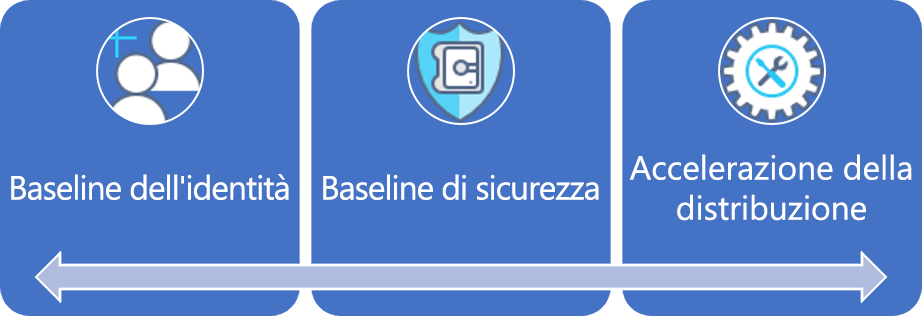

# Percorso di governance per piccole e medie impreseSmall-to-medium enterprise governance journey

## Panoramica delle procedure consigliateBest practice overview

Questo percorso di governance segue le esperienze di una società fittizia attraverso le diverse fasi di evoluzione della governance.This governance journey follows the experiences of a fictional company through various stages of governance maturity. Il percorso è basato su percorsi di clienti reali.It is based on real customer journeys. Le procedure consigliate si basano sui vincoli e sulle esigenze della società fittizia.The suggested best practices are based on the constraints and needs of the fictional company.

Come punto di partenza rapido, questa panoramica definisce un prodotto minimo funzionante (MVP) per la governance basato su procedure consigliate.As a quick starting point, this overview defines a minimum viable product (MVP) for governance based on best practices. Vengono inoltre forniti collegamenti ad alcune forme di evoluzione della governance che offrono altre procedure consigliate in base all'emergere di nuovi rischi tecnici o aziendali.It also provides links to some governance evolutions that add further best practices as new business or technical risks emerge.

> [!WARNING]
> Questo MVP è solo un punto di partenza, fondato su un insieme di ipotesi.This MVP is a baseline starting point, based on a set of assumptions. Anche questo insieme minimo di procedure consigliate è basato su criteri aziendali determinati da rischi commerciali e tolleranze di rischio speciali.Even this minimal set of best practices is based on corporate policies driven by unique business risks and risk tolerances. Per determinare se queste ipotesi si applicano alla propria situazione, vedere lo [scenario più approfondito](./narrative.md) che segue questo articolo.To see if these assumptions apply to you, read the [longer narrative](./narrative.md) that follows this article.

## Procedura consigliata per la governanceGovernance best practice

Questa procedura consigliata funge da base di cui può servirsi un'organizzazione per aggiungere in modo rapido e coerente misure di tutela per la governance tra più sottoscrizioni di Azure.This best practice serves as a foundation that an organization can use to quickly and consistently add governance guardrails across multiple Azure subscriptions.

### Organizzazione delle risorseResource organization

Il diagramma seguente mostra la gerarchia dell'MVP per la governance per organizzare le risorse.The following diagram shows the governance MVP hierarchy for organizing resources.

Tutte le applicazioni devono essere distribuite nell'area appropriata della gerarchia di gruppi di gestione, sottoscrizioni e gruppi di risorse.Every application should be deployed in the proper area of the management group, subscription, and resource group hierarchy. Durante la pianificazione della distribuzione, il team di governance del cloud creerà i nodi necessari nella gerarchia per i team responsabili dell'adozione del cloud.During deployment planning, the Cloud Governance team will create the necessary nodes in the hierarchy to empower the cloud adoption teams.  

1. Un gruppo di gestione per ogni tipo di ambiente (ad esempio produzione, sviluppo e test).A management group for each type of environment (such as Production, Development, and Test).
2. Una sottoscrizione per ogni "categorizzazione delle applicazioni".A subscription for each "application categorization".
3. Un gruppo di risorse separato per ogni applicazione.A separate resource group for each application.
4. È necessario applicare una nomenclatura coerente a ogni livello di questa gerarchia di gruppi.Consistent nomenclature should be applied at each level of this grouping hierarchy.

Ecco un esempio di questo modello in uso:Here is an example of this pattern in use:

Questi modelli lasciano un certo spazio per la crescita senza complicare inutilmente la gerarchia.These patterns provide room for growth without complicating the hierarchy unnecessarily.

[!INCLUDE [governance-of-resources](../../../../../includes/cloud-adoption/governance/governance-of-resources.md)]

## Evoluzioni della governanceGovernance evolutions

Una volta distribuito l'MVP, è possibile integrare livelli aggiuntivi di governance nell'ambiente.Once this MVP has been deployed, additional layers of governance can be quickly incorporated into the environment. Ecco alcuni modi in cui trasformare l'MVP per soddisfare esigenze aziendali specifiche:Here are some ways to evolve the MVP to meet specific business needs:

- [Baseline di sicurezza dei dati protettiSecurity Baseline for protected data](./security-baseline-evolution.md)
- [Configurazioni delle risorse per applicazioni crucialiResource configurations for mission-critical applications](./resource-consistency-evolution.md)
- [Controlli per Gestione dei costiControls for Cost Management](./cost-management-evolution.md)
- [Controlli per l'evoluzione multi-cloudControls for multi-cloud evolution](./multi-cloud-evolution.md)

<!-- markdownlint-disable MD026 -->

## Qual è lo scopo di questa procedura consigliata?What does this best practice do?

Nell'MVP vengono definiti strumenti e procedure della disciplina di [accelerazione della distribuzione](../../deployment-acceleration/overview.md) per applicare rapidamente criteri aziendali.In the MVP, practices and tools from the [Deployment Acceleration](../../deployment-acceleration/overview.md) discipline are established to quickly apply corporate policy. In particolare, l'MVP usa Azure Blueprints, Criteri di Azure e gruppi di gestione di Azure per applicare alcuni criteri aziendali di base, secondo quanto definito nello scenario per questa società fittizia.In particular, the MVP uses Azure Blueprints, Azure Policy, and Azure management groups to apply a few basic corporate policies, as defined in the narrative for this fictional company. Questi criteri aziendali vengono applicati tramite modelli di Resource Manager e criteri di Azure per stabilire una baseline minima per identità e sicurezza.Those corporate policies are applied using Resource Manager templates and Azure policies to establish a very small baseline for identity and security.

## Evoluzione della procedura consigliataEvolving the best practice

Con il passare del tempo, questo MVP per la governance verrà usato per adeguare le procedure necessarie.Over time, this governance MVP will be used to evolve the governance practices. Con il progredire dell'adozione, aumentano i rischi aziendali.As adoption advances, business risk grows. Diverse discipline all'interno del modello di governance del framework per l'adozione del cloud evolveranno per mitigare questi rischi.Various disciplines within the CAF governance model will evolve to mitigate those risks. Gli articoli successivi di questa serie illustrano l'evoluzione di criteri aziendali che interessano la società fittizia.Later articles in this series discuss the evolution of corporate policy affecting the fictional company. Queste evoluzioni avvengono in tre discipline:These evolutions happen across three disciplines:

- Gestione dei costi, con il ridimensionarsi dell'adozione.Cost Management, as adoption scales.
- Baseline di sicurezza, man mano che vengono distribuiti dati protetti.Security Baseline, as protected data is deployed.
- Coerenza delle risorse, man mano che il team responsabile delle operazioni IT inizia a supportare carichi di lavoro cruciali.Resource Consistency, as IT Operations begins supporting mission-critical workloads.

## Passaggi successiviNext steps

Ora che si ha familiarità con l'MVP per la governance e un'idea delle evoluzioni della governance da seguire, consultare lo scenario associato per altre informazioni sul contesto.Now that you’re familiar with the governance MVP and have an idea of the governance evolutions to follow, read the supporting narrative for additional context.

> [!div class="nextstepaction"]
> [Consultare lo scenario associatoRead the supporting narrative](./narrative.md)
