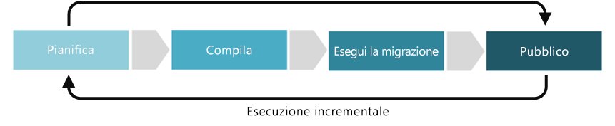

# Miglioramento della disciplina Coerenza delle risorseResource Consistency discipline improvement

La disciplina Coerenza delle risorse riguarda le modalità di definizione dei criteri di gestione operativa di un ambiente, applicazione o carico di lavoro.The Resource Consistency discipline focuses on ways of establishing policies related to the operational management of an environment, application, or workload. Tra le cinque discipline della governance del cloud, la coerenza delle risorse include il monitoraggio dell'applicazione, del carico di lavoro e delle prestazioni degli asset.Within the five disciplines of Cloud Governance, Resource Consistency includes monitoring of applications, workload, and asset performance. Comprende inoltre le attività necessarie per soddisfare le esigenze di scalabilità e correggere e prevenire dinamicamente le violazioni dei contratti di servizio tramite una procedura di correzione automatizzata.It also includes the tasks required to meet scale demands, remediate performance Service Level Agreement (SLA) violations, and proactively avoid SLA violations through automated remediation.

Questo articolo delinea alcune attività potenziali che l'azienda può svolgere al fine di sviluppare ed evolvere al meglio la disciplina Coerenza delle risorse.This article outlines some potential tasks your company can engage in to better develop and mature the Resource Consistency discipline. Queste attività possono essere suddivise nelle fasi di pianificazione, costruzione, adozione e funzionamento dell'implementazione di una soluzione cloud, che vengono poi ripetute per consentire lo sviluppo di un [approccio incrementale alla governance del cloud](../journeys/overview.md#an-incremental-approach-to-cloud-governance).These tasks can be broken down into planning, building, adopting, and operating phases of implementing a cloud solution, which are then iterated on allowing the development of an [incremental approach to cloud governance](../journeys/overview.md#an-incremental-approach-to-cloud-governance).

*Figura 1. Fasi di adozione dell'approccio incrementale alla governance del cloud.**Figure 1. Adoption phases of the incremental approach to cloud governance.*

È impossibile tener conto per qualsiasi documento dei requisiti di tutte le aziende.It's impossible for any one document to account for the requirements of all businesses. Di conseguenza, questo articolo delinea le attività di esempio minime e potenziali suggerite per ogni fase del processo di maturazione della governance.As such, this article outlines suggested minimum and potential example activities for each phase of the governance maturation process. L'obiettivo iniziale di queste attività è quello di permettere di costruire un [MVP dei criteri](../journeys/overview.md#an-incremental-approach-to-cloud-governance) e stabilire un framework per l'evoluzione incrementale dei criteri di Azure.The initial objective of these activities is to help you build a [Policy MVP](../journeys/overview.md#an-incremental-approach-to-cloud-governance) and establish a framework for incremental policy evolution. Il team di governance del cloud dovrà decidere quanto investire in queste attività per migliorare le capacità di governance della coerenza delle risorse.Your Cloud Governance team will need to decide how much to invest in these activities to improve your Resource Consistency governance capabilities.

> [!CAUTION]
> Nessuna delle attività minime o potenziali descritte in questo articolo è allineata a specifici criteri aziendali o requisiti di conformità di terzi.Neither the minimum or potential activities outlined in this article are aligned to specific corporate policies or third party compliance requirements. Queste linee guida sono state progettate per facilitare le conversazioni che porteranno all'allineamento di entrambi i requisiti con un modello di governance del cloud.This guidance is designed to help facilitate the conversations that will lead to alignment of both requirements with a cloud governance model.

## Pianificazione e preparazionePlanning and readiness

Questa fase di maturità della governance colma il divario tra i risultati aziendali e le strategie attuabili.This phase of governance maturity bridges the divide between business outcomes and actionable strategies. Durante questo processo, il team di leadership definisce metriche specifiche, associa tali metriche al patrimonio digitale e inizia a pianificare l'impegno complessivo richiesto per la migrazione.During this process, the leadership team defines specific metrics, maps those metrics to the digital estate, and begins planning the overall migration effort.

**Attività minime suggerite:****Minimum suggested activities:**

* Valutare le opzioni della [toolchain di Coerenza delle risorse](toolchain.md).Evaluate your [Resource Consistency toolchain](toolchain.md) options.
* Comprendere i requisiti di licenza per la strategia cloud.Understand the licensing requirements for your cloud strategy.
* Sviluppare una bozza di linee guida sull'architettura e distribuirla ai principali stakeholder.Develop a draft Architecture Guidelines document and distribute to key stakeholders.
* Acquisire familiarità con la gestione delle risorse usata per distribuire, gestire e monitorare tutte le risorse per la soluzione come gruppo.Become familiar with the resource manager you use to deploy, manage, and monitor all the resources for your solution as a group.
* Formare e coinvolgere le persone e i team interessati allo sviluppo delle linee guida sull'architettura.Educate and involve the people and teams affected by the development of architecture guidelines.
* Aggiungere attività di distribuzione delle risorse con priorità al backlog di migrazione.Add prioritized resource deployment tasks to your migration backlog.

**Attività potenziali:****Potential activities:**

* Lavorare con gli stakeholder aziendali e/o il team di strategia cloud per comprendere l'approccio di contabilità cloud e le procedure di contabilità desiderati all'interno della business unit e dell'organizzazione nel suo complesso.Work with the business stakeholders and/or your cloud strategy team to understand the desired cloud accounting approach and cost accounting practices within your business units and organization as a whole.
* Definire i requisiti di [applicazione dei criteri e di monitoraggio](compliance-processes.md).Define your [monitoring and policy enforcement](compliance-processes.md) requirements.
* Esaminare il valore di business e il costo dovuto alle interruzioni per definire i criteri di correzione e i requisiti del contratto di servizio.Examine the business value and cost of outage to define remediation policy and SLA requirements.
* Determinare se verrà distribuito una strategia di governance per le risorse con [carico di lavoro semplice](./governance-simple-workload.md) oppure [multi-team](./governance-multiple-teams.md).Determine whether you'll deploy a [simple workload](./governance-simple-workload.md) or [multi-team](./governance-multiple-teams.md) governance strategy for your resources.
* Determinare i requisiti di scalabilità per carichi di lavoro pianificati.Determine scalability requirements for your planned workloads.

## Compilazione e pre-distribuzioneBuild and pre-deployment

Sono necessari una serie di prerequisiti tecnici e non per eseguire la migrazione di un ambiente con esito positivo.A number of technical and nontechnical prerequisites are required to successful migrate an environment. Questo processo è incentrato sulle decisioni, sulla conformità e sull'infrastruttura di base che consente una migrazione.This process focuses on the decisions, readiness, and core infrastructure that proceeds a migration.

**Attività minime suggerite:****Minimum suggested activities:**

* Implementare la [toolchain della Coerenza delle risorse](toolchain.md) in una fase di pre-distribuzione.Implement your [Resource Consistency toolchain](toolchain.md) by rolling out in a pre-deployment phase.
* Aggiornare il documento relativo alle linee guida sull'architettura e distribuirlo ai principali stakeholder.Update the Architecture Guidelines document and distribute to key stakeholders.
* Implementare le attività relative alla distribuzione delle risorse nel backlog di migrazione con priorità.Implement resource deployment tasks on your prioritized migration backlog.
* Sviluppare materiali didattici e documentazione, comunicazioni di sensibilizzazione, incentivi e altri programmi per guidare l'adozione da parte degli utenti.Develop educational materials and documentation, awareness communications, incentives, and other programs to help drive user adoption.

**Attività potenziali:****Potential activities:**

* Scegliere una [strategia di progettazione della sottoscrizione](../../decision-guides/subscriptions/overview.md), scegliere i criteri per la sottoscrizione che meglio soddisfano le esigenze dell'organizzazione e del carico di lavoro.Decide on a [subscription design strategy](../../decision-guides/subscriptions/overview.md), choosing the subscription patterns that best fit your organization and workload needs.
* Usare la strategia [della coerenza delle risorse](../../decision-guides/resource-consistency/overview.md) per applicare le linee guida per l'architettura nel tempo.Use a [resource consistency](../../decision-guides/resource-consistency/overview.md) strategy to enforce architecture guidelines over time.
* Implementare la [denominazione delle risorse e l'assegnazione di tag standard](../../decision-guides/resource-tagging/overview.md) perché le risorse corrispondano ai requisiti organizzativi e contabili.Implement [resource naming, and tagging standards](../../decision-guides/resource-tagging/overview.md) for your resources to match your organizational and accounting requirements.
* Per creare governance proattive temporizzate usare i modelli e l'automazione della distribuzione per applicare le configurazioni comuni e una struttura di raggruppamento coerente durante la distribuzione di risorse e gruppi di risorse.To create proactive point-in-time governance, use deployment templates and automation to enforce common configurations and a consistent grouping structure when deploying resources and resource groups.
* Stabilire almeno un modello di autorizzazione con privilegi minimi in cui gli utenti non hanno autorizzazioni predefinite.Establish a least privilege permissions model, where users have no permissions by default.
* Determinare quali utenti dell'organizzazione sono proprietari di ogni carico di lavoro e di ogni account e chi dovrà accedere per gestire o modificare queste risorse.Determine who in your organization owns each workload and account, and who will need to access to maintain or modify these resources. Definire i ruoli e le responsabilità del cloud che corrispondono a queste esigenze e usano questi ruoli come base per il controllo di accesso.Define cloud roles and responsibilities that match these needs and use these roles as the basis for access control.
* Definire le dipendenze tra le risorse.Define dependencies between resources.
* Implementare il ridimensionamento automatico delle risorse per osservare i requisiti definiti in fase di pianificazione.Implement automated resource scaling to match requirements defined in the Plan stage.
* Ottenere le prestazioni di accesso per misurare la qualità dei servizi ricevuti.Conduct access performance to measure the quality of services received.
* È consigliabile distribuire [criteri](/azure/governance/policy/overview) per gestire l'applicazione del contratto di servizio usando le impostazioni di configurazione e regole per la creazione di risorse.Consider deploying [policy](/azure/governance/policy/overview) to manage SLA enforcement using configuration settings and resource creation rules.

## Adottare ed eseguire la migrazioneAdopt and migrate

La migrazione è un processo incrementale incentrato sullo spostamento, il testing e l'adozione di applicazioni o carichi di lavoro in un patrimonio digitale esistente.Migration is an incremental process that focuses on the movement, testing, and adoption of applications or workloads in an existing digital estate.

**Attività minime suggerite:****Minimum suggested activities:**

* Eseguire la migrazione della [toolchain della Coerenza delle risorse](toolchain.md) dall'ambiente di pre-distribuzione a quello di produzione.Migrate your [Resource Consistency toolchain](toolchain.md) from pre-deployment to production.
* Aggiornare il documento relativo alle linee guida sull'architettura e distribuirlo ai principali stakeholder.Update the Architecture Guidelines document and distribute to key stakeholders.
* Sviluppare materiali didattici e documentazione, comunicazioni di sensibilizzazione, incentivi e altri programmi per guidare l'adozione da parte degli utenti.Develop educational materials and documentation, awareness communications, incentives, and other programs to help drive user adoption.
* Eseguire la migrazione di qualsiasi script o strumento di correzione automatizzato esistente per supportare i requisiti del contratto di servizio stabiliti.Migrate any existing automated remediation scripts or tools to support defined SLA requirements.

**Attività potenziali:****Potential activities:**

* Completare ed eseguire il test dei dati di monitoraggio e di creazione di reportComplete and test monitoring and reporting data. con la scelta di una soluzione locale, gateway cloud o ibrida.with your chosen on-premises, cloud gateway, or hybrid solution.
* Determinare se le modifiche devono essere apportate al contratto di servizio o ai criteri di gestione delle risorse.Determine if changes need to be made to SLA or management policy for resources.
* Migliorare le attività operative implementando funzionalità di query al fine di trovare la risorsa nel cloud estate in modo efficiente.Improve operations tasks by implementing query capabilities to efficiently find resource across your cloud estate.
* Allineare le risorse alle mutevoli esigenze aziendali e ai requisiti di governance.Align resources to changing business needs and governance requirements.
* Assicurarsi che macchine virtuali, reti virtuali e account di archiviazione rispettino le esigenze di accesso alle risorse effettive per ogni versione e adattarle se necessario.Ensure that your virtual machines, virtual networks, and storage accounts reflect actual resource access needs during each release, and adjust as necessary.
* Verificare che il ridimensionamento automatico delle risorse soddisfi i requisiti di accesso.Verify automated scaling of resources meets access requirements.
* Verificare l'accesso utente a risorse, gruppi di risorse e sottoscrizioni di Azure e adattarne i controlli di accesso in base alle esigenze.Review user access to resources, resource groups, and Azure subscriptions, and adjust access controls as necessary.
* Monitorare le modifiche ai piani di accesso alle risorse e verificare con gli stakeholder se sono necessarie altre approvazioni.Monitor changes in resource access plans and validate with stakeholders if additional sign-offs are needed.
* Aggiornare le modifiche al documento delle linee guida sull'architettura in modo da riflettere i costi effettivi.Update changes to the Architecture Guidelines document to reflect actual costs.
* Determinare se l'organizzazione richiede un allineamento al conto Profitti e perdite più chiaro da un punto di vista finanziario per la business unit di riferimento.Determine whether your organization requires clearer financial alignment to P&Ls for business units.
* Per le organizzazioni globali, implementare i requisiti di sovranità o conformità al contratto di servizio.For global organizations, implement your SLA compliance or sovereignty requirements.
* Per l'aggregazione al cloud, distribuire una soluzione gateway a un provider di servizi cloud.For cloud aggregation, deploy a gateway solution to a cloud provider.
* Per gli strumenti che non consentono opzioni ibride o gateway, accoppiare perfettamente il monitoraggio con uno strumento di monitoraggio operativo.For tools that don't allow for hybrid or gateway options, tightly couple monitoring with an operational monitoring tool.

## Operazione e post-implementazioneOperate and post-implementation

Al termine della trasformazione, la governance e le operazioni devono continuare a funzionare per il ciclo di vita naturale di un'applicazione o di un carico di lavoro.Once the transformation is complete, governance and operations must live on for the natural lifecycle of an application or workload. Questa fase di maturità della governance si basa principalmente sulle attività che vengono svolte in genere dopo che la soluzione è stata implementata e il ciclo di trasformazione ha iniziato a stabilizzarsi.This phase of governance maturity focuses on the activities that commonly come after the solution is implemented and the transformation cycle begins to stabilize.

**Attività minime suggerite:****Minimum suggested activities:**

* Personalizzare la [toolchain di Coerenza delle risorse](toolchain.md) in base ai mutevoli aggiornamenti delle esigenze di Gestione costi della tua organizzazione.Customize your [Resource Consistency toolchain](toolchain.md) based on updates to your organization’s changing Cost Management needs.
* Valutare l'opportunità di automatizzare le notifiche e i report in modo da riflettere l'utilizzo effettivo.Consider automating any notifications and reports to reflect actual resource usage.
* Perfezionare le linee guida sull'architettura per fornire indicazioni precise sui processi di adozione futuri.Refine Architecture Guidelines to guide future adoption processes.
* Dedicarsi periodicamente alla formazione dei team interessati per assicurarsi che vengano costantemente rispettate le linee guida sull'architettura.Educate affected teams periodically to ensure ongoing adherence to the architecture guidelines.

**Attività potenziali:****Potential activities:**

* Modificare i piani su base trimestrale in base alle modifiche alle risorse effettive.Adjust plans quarterly to reflect changes to actual resources.
* Applicare e garantirne la continua applicazione automatica dei requisiti di governance delle distribuzioni future.Automatically apply and enforce governance requirements during future deployments.
* Valutare le risorse che sono state sfruttate in modo non soddisfacente e determinare se vale la pena mantenerle.Evaluate underused resources and determine if they're worth continuing.
* Rilevare eventuali disallineamenti e anomalie tra l'uso pianificato e quello effettivo.Detect misalignments and anomalies between planned and actual resource usage.
* Aiutare i team di adozione del cloud e il team per la strategia cloud a comprendere e risolvere queste anomalie.Assist the cloud adoption teams and the Cloud Strategy team in understanding and resolving these anomalies.
* Determinare se sono necessarie modifiche alla Coerenza delle risorse a scopo di fatturazione e di contratti di servizio.Determine if changes need to be made to Resource Consistency for billing and SLAs.
* Valutare gli strumenti di registrazione e monitoraggio per determinare se la soluzione locale, gateway cloud o ibrida necessiti di modifiche.Evaluate logging and monitoring tools to determine whether your on-premises, cloud gateway, or hybrid solution needs adjusting.
* Per le unità aziendali e i gruppi distribuiti geograficamente, determinare se per l'organizzazione è consigliabile usare le funzionalità di gestione cloud aggiuntive (ad esempio [Gruppi di gestione di Azure](/azure/governance/management-groups/)) per applicare in modo ottimale criteri centralizzati e soddisfare i requisiti del contratto di servizio.For business units and geographically distributed groups, determine if your organization should consider using additional cloud management features (for example [Azure management groups](/azure/governance/management-groups/)) to better apply centralized policy and meet SLA requirements.

## Passaggi successiviNext steps

Ora che si è appreso il concetto di governance delle risorse cloud, si approfondirà [come viene gestito l'accesso alle risorse](azure-resource-access.md) in Azure, quindi come progettare un modello di governance per un [carico di lavori semplice ](governance-simple-workload.md) o per [più team](governance-multiple-teams.md).Now that you understand the concept of cloud resource governance, move on to learn more about [how resource access is managed](azure-resource-access.md) in Azure in preparation for learning how to design a governance model for a [simple workload](governance-simple-workload.md) or for [multiple teams](governance-multiple-teams.md).

> [!div class="nextstepaction"]
> [Informazioni sull'accesso alle risorse in Azure](azure-resource-access.md)
> [Informazioni sui contratti di servizio per Azure](https://azure.microsoft.com/support/legal/sla/)
> [Informazioni registrazione, creazione di report e monitoraggio](../../decision-guides/log-and-report/overview.md)[Learn about resource access in Azure](azure-resource-access.md)
[Learn about SLAs for Azure](https://azure.microsoft.com/support/legal/sla/)
[Learn about logging, reporting, and monitoring](../../decision-guides/log-and-report/overview.md)
