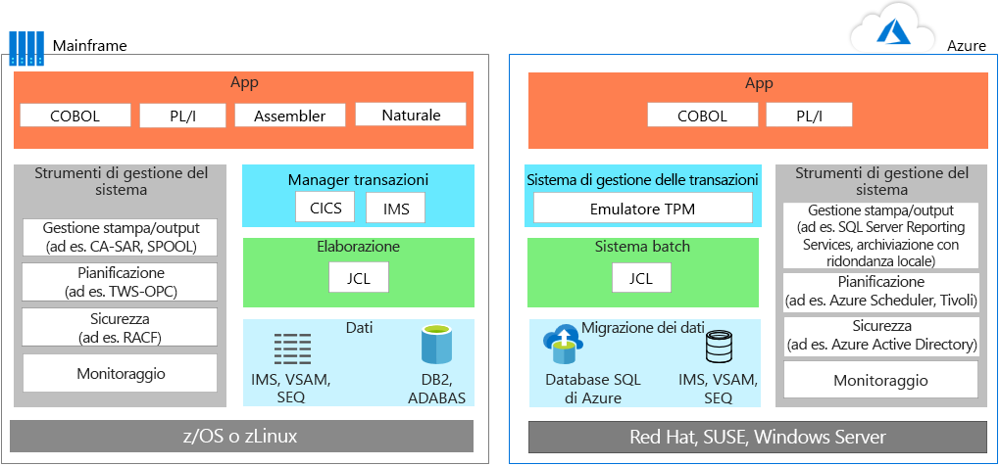
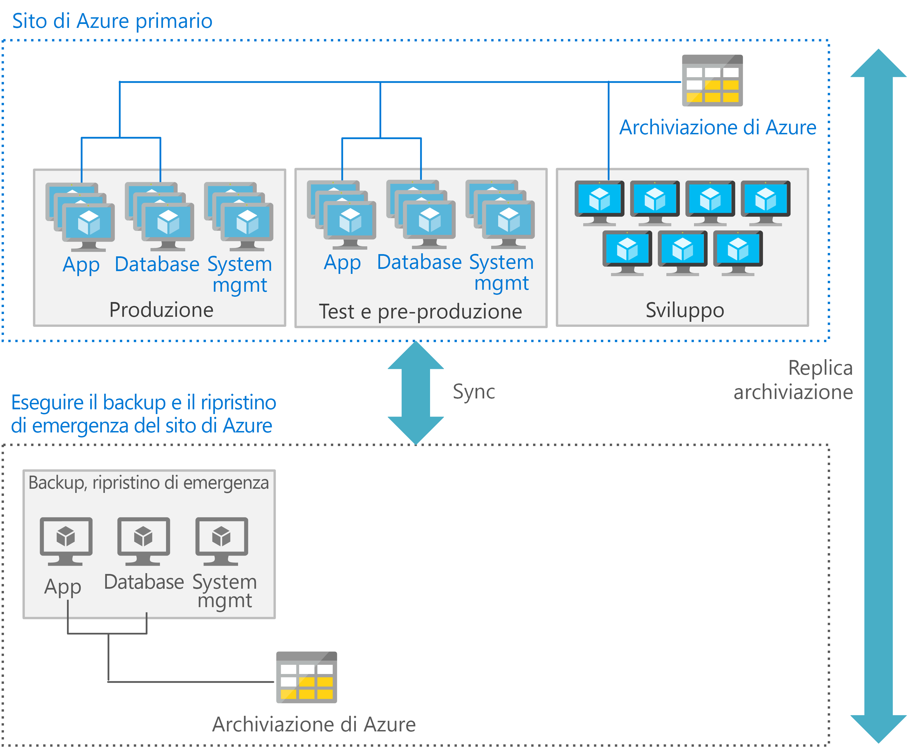

# Migrazione delle applicazioni mainframeMainframe application migration

Per la migrazione delle applicazioni da ambienti mainframe ad Azure, la maggior parte dei team adotta un approccio pragmatico: riutilizzare tutto ciò che è possibile, quindi avviare una distribuzione in più fasi in cui le applicazioni vengono riscritte o sostituite.When migrating applications from mainframe environments to Azure, most teams follow a pragmatic approach: reuse wherever and whenever possible, and then start a phased deployment where applications are rewritten or replaced.

La migrazione delle applicazioni in genere prevede una o più delle seguenti strategie:Application migration typically involves one or more of the following strategies:

- Rehosting: è possibile spostare dal mainframe il codice, i programmi e le applicazioni esistenti e quindi ricompilare il codice per l'esecuzione in un emulatore mainframe ospitato in un'istanza cloud.Rehost: You can move existing code, programs, and applications from the mainframe, and then recompile the code to run in a mainframe emulator hosted in a cloud instance. Questo approccio in genere inizia con lo spostamento delle applicazioni in un emulatore basato sul cloud e quindi con la migrazione del database in un database basato sul cloud.This approach typically starts with moving applications to a cloud-based emulator, and then migrating the database to a cloud-based database. Sono necessarie alcune operazioni di progettazione e refactoring, oltre che conversioni di dati e file.Some engineering and refactoring are required along with data and file conversions.

    In alternativa, è possibile eseguire il rehosting mediante un provider di hosting tradizionale.Alternatively, you can rehost using a traditional hosting provider. Uno dei principali vantaggi del cloud è l'outsourcing della gestione dell'infrastruttura.One of the principal benefits of the cloud is outsourcing infrastructure management. È possibile trovare un provider di data center che ospiterà i carichi di lavoro del mainframe.You can find a datacenter provider that will host your mainframe workloads for you. Questo modello può consentire di risparmiare tempo, ridurre la dipendenza dal fornitore e produrre temporanee riduzioni dei costi.This model may buy time, reduce vendor lock in, and produce interim cost savings.

- Ritiro: tutte le applicazioni che non sono più necessarie devono essere ritirate prima della migrazione.Retire: All applications that are no longer needed should be retired before migration.

- Ricostruzione: alcune organizzazioni scelgono di riscrivere completamente i programmi usando tecniche moderne.Rebuild: Some organizations choose to completely rewrite programs using modern techniques. Per i costi e la complessità superiori, questo approccio è meno comune rispetto al trasferimento in modalità lift-and-shift.Given the added cost and complexity of this approach, it’s not as common as a lift-and-shift approach. Spesso dopo questo tipo di migrazione è opportuno iniziare a sostituire i moduli e il codice tramite motori di trasformazione del codice.Often after this type of migration, it makes sense to begin replacing modules and code using code transformation engines.

- Sostituire: Questo approccio sostituisce le funzionalità del mainframe con funzionalità equivalenti nel cloud.Replace: This approach replaces mainframe functionality with equivalent features in the cloud. Un'opzione è il software come un servizio (SaaS), che usa una soluzione creata in modo specifico per un problema aziendale, ad esempio in ambito finanziario, delle risorse umane, della produzione o ERP (Enterprise Resource Planning).Software as a service (SaaS) is one option, which is using a solution created specifically for an enterprise concern, such as finance, human resources, manufacturing, or enterprise resource planning. Inoltre, ora sono disponibili molte app specifiche del settore per risolvere i problemi che in precedenza venivano risolti tramite soluzioni mainframe personalizzate.In addition, many industry-specific apps are now available to solve problems that custom mainframe solutions used to previously solve.

È consigliabile valutare se partire dalla pianificazione dei carichi di lavoro di cui eseguire la migrazione inizialmente e quindi determinare i requisiti per lo spostamento delle applicazioni, delle basi di codice legacy e dei database associati.You should consider starting by planning those workloads that you want to initially migrate, and then determine those requirements for moving associated applications, legacy codebases, and databases.

## Emulazione di mainframe in AzureMainframe emulation in Azure

I servizi cloud di Azure sono in grado di emulare gli ambienti mainframe tradizionali, consentendo di riutilizzare le applicazioni e il codice mainframe esistenti.Azure cloud services can emulate traditional mainframe environments, enabling you to reuse existing mainframe code and applications. Alcuni componenti server comuni che è possibile emulare includono OLTP (Online Transaction Processing), batch e sistemi di inserimento dati.Common server components that you can emulate include online transaction processing (OLTP), batch, and data ingestion systems.

### Sistemi OLTPOLTP systems

Numerosi mainframe dispongono di sistemi OLTP che elaborano migliaia o milioni di aggiornamenti per un numero molto elevato di utenti.Many mainframes have OLTP systems that process thousands or millions of updates for huge numbers of users. Queste applicazioni spesso usano software per l'elaborazione delle transazioni e la gestione di moduli e schermate, come sistemi CICS (Customer Information Control System), IMS (Information Management System) e TIP (Terminal Interface Processor).These applications often use transaction processing and screen-form handling software, such as customer information control system (CICS), information management systes (IMS), and terminal interface processor (TIP).

Quando si spostano applicazioni OLTP in Azure, emulatori per il monitoraggio dell'elaborazione delle transazioni mainframe sono disponibili per l'esecuzione come infrastruttura distribuita come servizio (IaaS) tramite macchine virtuali in Azure.When moving OLTP applications to Azure, emulators for mainframe transaction processing (TP) monitors are available to run as infrastructure as a service (IaaS) using virtual machines (VMs) on Azure. Anche le funzionalità di gestione dei moduli e delle schermate possono essere implementate tramite server Web.The screen handling and form functionality can also be implemented by web servers. Questo approccio può essere combinato con API di database, ad esempio ADO (ActiveX Data Objects), ODBC (Open Database Connectivity) e JDBC (Java Database Connectivity) per l'accesso ai dati e le transazioni.This approach can be combined with database APIs, such as ActiveX data object (ADO), open database connectivity (ODBC), and Java database connectivity (JDBC) for data access and transactions.

### Aggiornamenti in batch con vincoli di tempoTime-constrained batch updates

Molti sistemi mainframe eseguono aggiornamenti mensili o annuali di milioni di record di account, come quelli usati nel settore bancario, nelle assicurazioni e nella Pubblica Amministrazione.Many mainframe systems perform monthly or annual updates of millions of account records, such as those used in banking, insurance, and government. I mainframe gestiscono questi tipi di carichi di lavoro offrendo sistemi di gestione dei dati con una velocità effettiva elevata.Mainframes handle these types of workloads by offering high-throughput data handling systems. I processi batch mainframe sono generalmente di natura seriale e dipendono dalle operazioni di I/O al secondo (IOPS) fornite dal backbone del mainframe per le prestazioni.Mainframes batch jobs are typically serial in nature and depend on the input/output operations per second (IOPS) provided by the mainframe backbone for performance.

Gli ambienti batch basati sul cloud usano soluzioni di calcolo parallele e reti ad alta velocità per le prestazioni.Cloud-based batch environments use parallel compute and high-speed networks for performance. Se è necessario ottimizzare le prestazioni dei batch, Azure offre numerose opzioni di calcolo, archiviazione e rete.If you need to optimize batch performance, Azure provides various compute, storage, and networking options.

### Sistemi di inserimento datiData ingestion systems

I mainframe eseguono l'inserimento di batch di dati di grandi dimensioni da soluzioni per la vendita al dettaglio, i servizi finanziari, la produzione e di altro tipo.Mainframes ingest large batches of data from retail, financial services, manufacturing, and other solutions for processing. Con Azure è possibile usare semplici utilità della riga di comando, come [AzCopy](/azure/storage/common/storage-use-azcopy), per copiare dati da e verso una posizione di archiviazione.With Azure, you can use simple command-line utilities such as [AzCopy](/azure/storage/common/storage-use-azcopy) for copying data to and from storage location. È anche possibile usare il servizio [Azure Data Factory](/azure/data-factory/introduction), che consente di inserire dati da archivi dati eterogenei per creare e pianificare flussi di lavoro basati sui dati.You can also use the [Azure Data Factory](/azure/data-factory/introduction) service, enabling you to ingest data from disparate data stores to create and schedule data-driven workflows.

Oltre agli ambienti di emulazione, Azure fornisce funzionalità di piattaforma distribuita come servizio (PaaS) e servizi di analisi che possono migliorare gli ambienti mainframe esistenti.In addition to emulation environments, Azure provides platform as a service (PaaS) and analytics services that can enhance existing mainframe environments.

## Migrazione dei carichi di lavoro OLTP ad AzureMigrate OLTP workloads to Azure

L'approccio lift-and-shift è un'opzione senza codice per eseguire rapidamente la migrazione delle applicazioni esistenti in Azure.The lift-and-shift approach is the no code option for quickly migrating existing applications to Azure. Ogni applicazione viene sottoposta a migrazione così com'è e ciò offre i vantaggi del cloud senza i rischi o i costi delle modifiche al codice.Each application is migrated as is, which provides the benefits of the cloud without the risks or costs of making code changes. L'uso di un emulatore per il monitoraggio dell'elaborazione delle transazioni mainframe in Azure supporta questo approccio.Using an emulator for mainframe transaction processing (TP) monitors on Azure supports this approach.

Soluzioni di monitoraggio dell'elaborazione delle transazioni sono disponibili da diversi produttori e possono essere eseguite in macchine virtuali, un'opzione di infrastruttura distribuita come servizio (IaaS) in Azure.TP monitors are available from various vendors and run on virtual machines, an infrastructure as a service (IaaS) option on Azure. I diagrammi seguenti illustrano una migrazione di un'applicazione online supportata da IBM DB2, un sistema di gestione di database relazionali (DBMS), in un mainframe IBM z/OS.The following before and after diagrams show a migration of an online application backed by IBM DB2, a relational database management system (DBMS), on an IBM z/OS mainframe. DB2 per z/OS usa i file VSAM (Virtual Storage Access Method) per archiviare i dati e ISAM (Indexed Sequential Access Method) per i file flat.DB2 for z/OS uses virtual storage access method (VSAM) files to store the data and Indexed Sequential Access Method (ISAM) for flat files. Questa architettura usa anche CICS per il monitoraggio delle transazioni.This architecture also uses CICS for transaction monitoring.

In Azure vengono usati ambienti di emulazione per eseguire la gestione dell'elaborazione delle transazioni e i processi batch che usano JCL.On Azure, emulation environments are used to run the TP manager and the batch jobs that use JCL. Nel livello dati, DB2 viene sostituito dal [database SQL di Azure](/azure/sql-database/sql-database-technical-overview), sebbene sia possibile usare anche Microsoft SQL Server, DB2 LUW o Oracle Database.In the data tier, DB2 is replaced by [Azure SQL Database](/azure/sql-database/sql-database-technical-overview), although Microsoft SQL Server, DB2 LUW, or Oracle Database can also be used. Un emulatore supporta IMS, VSAM e SEQ.An emulator supports IMS, VSAM, and SEQ. Gli strumenti di gestione dei sistemi del mainframe vengono sostituiti da servizi di Azure e software di altri fornitori, che vengono eseguiti in macchine virtuali.The mainframe’s system management tools are replaced by Azure services, and software from other vendors, that run in VMs.

Le funzionalità di gestione delle schermate e immissione nei moduli è solitamente implementata mediante server Web, che possono essere combinati con API di database, ad esempio ADO, ODBC e JDBC per l'accesso ai dati e le transazioni.The screen handling and form entry functionality is commonly implemented using web servers, which can be combined with database APIs, such as ADO, ODBC, and JDBC for data access and transactions. L'esatta gamma di componenti IaaS di Azure da usare dipende dal sistema operativo preferito.The exact line-up of Azure IaaS components to use depends on the operating system you prefer. Ad esempio: For example:

- Macchine virtuali basate su Windows: Internet Information Server (IIS) con ASP.NET per la gestione delle schermate e la logica di business.Windows–based VMs: Internet Information Server (IIS) along with ASP.NET for the screen handling and business logic. Usare ADO.NET per l'accesso ai dati e le transazioni.Use ADO.NET for data access and transactions.

- Macchine virtuali basate su Linux: i server applicazioni basati su Java disponibili, ad esempio Apache Tomcat per la gestione delle schermate e le funzionalità aziendali basate su Java.Linux–based VMs: The Java-based application servers that are available, such as Apache Tomcat for screen handling and Java-based business functionality. Usare JDBC per l'accesso ai dati e le transazioni.Use JDBC for data access and transactions.

## Migrazione dei carichi di lavoro batch ad AzureMigrate batch workloads to Azure

Le operazioni batch in Azure sono diverse dal tipico ambiente batch nei mainframe.Batch operations in Azure differ from the typical batch environment on mainframes. I processi batch mainframe sono generalmente di natura seriale e dipendono dalle operazioni di I/O al secondo fornite dal backbone del mainframe per le prestazioni.Mainframe batch jobs are typically serial in nature and depend on the IOPS provided by the mainframe backbone for performance. Gli ambienti batch basati sul cloud usano soluzioni di calcolo parallele e reti ad alta velocità per le prestazioni.Cloud-based batch environments use parallel computing and high-speed networks for performance.

Per ottimizzare le prestazioni batch con Azure, valutare le opzioni di [calcolo](/azure/virtual-machines/windows/overview), [archiviazione](/azure/storage/blobs/storage-blobs-introduction), [rete](https://azure.microsoft.com/blog/maximize-your-vm-s-performance-with-accelerated-networking-now-generally-available-for-both-windows-and-linux/) e [monitoraggio](/azure/azure-monitor/overview) indicate di seguito.To optimize batch performance using Azure, consider the [compute](/azure/virtual-machines/windows/overview), [storage](/azure/storage/blobs/storage-blobs-introduction), [networking](https://azure.microsoft.com/blog/maximize-your-vm-s-performance-with-accelerated-networking-now-generally-available-for-both-windows-and-linux/), and [monitoring](/azure/azure-monitor/overview) options as follows.

### CalcoloCompute

Usare:Use:

- Macchine virtuali con la massima velocità di clock.VMs with the highest clock speed. Le applicazioni mainframe sono spesso a thread singolo e le CPU dei mainframe hanno una velocità di clock molto elevata.Mainframe applications are often single-threaded and mainframe CPUs have a very high clock speed.

- Macchine virtuali con grandi capacità di memoria per consentire la memorizzazione nella cache dei dati e delle aree di lavoro delle applicazioni.VMs with large memory capacity to allow caching of data and application work areas.

- Macchine virtuali con vCPU di maggiore densità per sfruttare i vantaggi dell'elaborazione multithread, se l'applicazione supporta più thread.VMs with higher density vCPUs to take advantage of multi-threaded processing if the application supports multiple threads.

- Elaborazione parallela, dal momento che Azure può essere facilmente ampliato per questo tipo di elaborazione, in modo da offrire maggiore potenza di calcolo per un'esecuzione batch.Parallel processing, as Azure easily scales out for parallel processing, delivering more compute power for a batch run.

### ArchiviazioneStorage

Usare:Use:

- [Azure Premium SSD](/azure/virtual-machines/windows/premium-storage) o [Azure Ultra SSD](/azure/virtual-machines/windows/disks-ultra-ssd) per il massimo di operazioni di I/O al secondo disponibili.[Azure Premium SSD](/azure/virtual-machines/windows/premium-storage) or [Azure Ultra SSD](/azure/virtual-machines/windows/disks-ultra-ssd) for maximum available IOPS.

- Striping con più dischi per un aumento delle operazioni di I/O al secondo per ogni dimensione di archiviazione.Striping with multiple disks for more IOPS per storage size.

- Partizionamento dell'archiviazione per distribuire l'I/O su più dispositivi di archiviazione di Azure.Partitioning for storage to spread IO over multiple Azure storage devices.

### ReteNetworking

- Usare [Rete accelerata di Azure](/azure/virtual-network/create-vm-accelerated-networking-powershell) per ridurre al minimo la latenza.Use [Azure Accelerated Networking](/azure/virtual-network/create-vm-accelerated-networking-powershell) to minimize latency.

### MonitoraggioMonitoring

- Gli strumenti di monitoraggio, [Monitoraggio di Azure](/azure/azure-monitor/overview), [Azure Application Insights](/azure/application-insights/app-insights-overview) e anche i log di Azure consentono agli amministratori di monitorare le prestazioni delle esecuzioni batch ed eliminare i colli di bottiglia.Use monitoring tools, [Azure Monitor](/azure/azure-monitor/overview), [Azure Application Insights](/azure/application-insights/app-insights-overview), and even the Azure logs enable administrators to monitor any over performance of batch runs and help eliminate bottlenecks.

## Migrazione degli ambienti di sviluppoMigrate development environments

Le architetture distribuite del cloud sono basate su un diverso set di strumenti di sviluppo, che offrono i vantaggi delle procedure e dei linguaggi di programmazione moderni.The cloud’s distributed architectures rely on a different set of development tools that provide the advantage of modern practices and programming languages. Per facilitare la transizione, è possibile usare un ambiente di sviluppo con altri strumenti progettati per emulare gli ambienti IBM z/OS.To ease this transition, you can use a development environment with other tools that are designed to emulate IBM z/OS environments. L'elenco seguente illustra le opzioni offerte da Microsoft e altri fornitori:The following list shows options from Microsoft and other vendors:

| ComponenteComponent        | Opzioni di AzureAzure Options                                                                                                                                  |
|------------------|---------------------------------------------------------------------------------------------------------------------------------------------------|
| z/OSz/OS             | Windows, Linux o UNIXWindows, Linux, or UNIX                                                                                                                      |
| CICSCICS             | Servizi di Azure offerti da Micro Focus, Oracle, GT Software (Fujitsu), TmaxSoft, Raincode e NTT Data o riscrittura con KubernetesAzure services offered by Micro Focus, Oracle, GT Software (Fujitsu), TmaxSoft, Raincode, and NTT Data, or rewrite using Kubernetes |
| IMSIMS              | Servizi di Azure offerti da Micro Focus e OracleAzure services offered by Micro Focus and Oracle                                                                                  |
| AssemblerAssembler        | Servizi di Azure offerti da Raincode e TmaxSoft, COBOL, C o Java oppure mapping alle funzioni del sistema operativoAzure services from Raincode and TmaxSoft; or COBOL, C, or Java, or map to operating system functions               |
| JCLJCL              | JCL, PowerShell o altri strumenti di scriptingJCL, PowerShell, or other scripting tools                                                                                                   |
| COBOLCOBOL            | COBOL, C o JavaCOBOL, C, or Java                                                                                                                            |
| NaturalNatural          | Natural, COBOL, C o JavaNatural, COBOL, C, or Java                                                                                                                  |
| FORTRAN e PL/IFORTRAN and PL/I | FORTRAN, PL/I, COBOL, C o JavaFORTRAN, PL/I, COBOL, C, or Java                                                                                                           |
| REXX e PL/IREXX and PL/I    | REXX, PowerShell o altri strumenti di scriptingREXX, PowerShell, or other scripting tools                                                                                                  |

## Migrazione di database e datiMigrate databases and data

La migrazione delle applicazioni in genere comporta il rehosting del livello dati.Application migration usually involves rehosting the data tier. È possibile eseguire con facilità la migrazione dei database SQL Server, open source e di altri database relazionali in soluzioni completamente gestite in Azure, come [Istanza gestita di database SQL di Azure](/azure/sql-database/sql-database-managed-instance), il [servizio Database di Azure per PostgreSQL](/azure/postgresql/overview) e [Database di Azure per MySQL](/azure/mysql/overview) con il [Servizio Migrazione del database di Azure](/azure/dms/dms-overview).You can migrate SQL Server, open-source, and other relational databases to fully-managed solutions on Azure, such as [Azure SQL Database Managed Instance](/azure/sql-database/sql-database-managed-instance), [Azure Database Service for PostgreSQL](/azure/postgresql/overview), and [Azure Database for MySQL](/azure/mysql/overview) with [Azure Database Migration Service](/azure/dms/dms-overview).

È ad esempio possibile eseguire la migrazione se il livello dati del mainframe utilizza:For example, you can migrate if the mainframe data tier uses:

- IBM DB2 o un database IMS - usare database SQL di Azure, SQL Server, DB2 LUW o Oracle Database in Azure.IBM DB2 or an IMS database, use Azure SQL database, SQL Server, DB2 LUW, or Oracle Database on Azure.

- VSAM e altri file flat - usare i file flat ISAM (Indexed Sequential Access Method) per SQL di Azure, SQL Server, DB2 LUW o Oracle.VSAM and other flat files, use Indexed Sequential Access Method (ISAM) flat files for Azure SQL, SQL Server, DB2 LUW, or Oracle.

- Generation Data Group (GDG) - eseguire la migrazione a file in Azure con una convenzione di denominazione ed estensioni per i nomi di file con funzionalità simili ai GDG.Generation Date Groups (GDGs), migrate to files on Azure that use a naming convention and filename extensions that provide similar functionality to GDGs.

Il livello dati IBM include diversi altri componenti chiave di cui è necessario eseguire la migrazione.The IBM data tier includes several key components that you must also migrate. Ad esempio, quando si esegue la migrazione di un database, è anche necessario eseguire la migrazione di una raccolta di dati contenuti nei pool, ognuno dei quali contiene dbextent, costituiti da set di dati VSAM z/OS.For example, when you migrate a database, you also migrate a collection of data contained in pools, each containing dbextents, which are z/OS VSAM data sets. La migrazione deve includere la directory che identifica i percorsi dei dati nei pool di archiviazione.Your migration must include the directory that identifies data locations in the storage pools. Inoltre, il piano di migrazione deve prendere in considerazione il log del database, che contiene una registrazione delle operazioni eseguite nel database.Also, your migration plan must consider the database log, which contains a record of operations performed on the database. Un database può avere uno, due (doppio o alternativo) oppure quattro log (doppio e alternativo).A database can have one, two (dual or alternate), or four (dual and alternate) logs.

La migrazione del database include anche questi componenti:Database migration also includes these components:

- Gestione database: fornisce l'accesso ai dati nel database.Database manager: Provides access to data in the database. La funzionalità di gestione database viene eseguita in una specifica partizione in un ambiente z/OS.The database manager runs in its own partition in a z/OS environment.

- Richiedente applicazioni: accetta le richieste dalle applicazioni prima di passarle a un server applicazioni.Application requester: Accepts requests from applications before passing them to an application server.

- Adattatore risorse online: include i componenti del richiedente applicazioni per l'uso nelle transazioni CICS.Online resource adapter: Includes application requester components for use in CICS transactions.

- Adattatore risorse batch: implementa i componenti del richiedente applicazioni per le applicazioni batch z/OS.Batch resource adapter: Implements application requester components for z/OS batch applications.

- Interactive SQL (ISQL): viene eseguito come un'applicazione CICS e un'interfaccia che consente agli utenti di immettere istruzioni SQL o comandi dell'operatore.Interactive SQL (ISQL): Runs as a CICS application and interface enabling users to enter SQL statements or operator commands.

- Applicazione CICS: viene eseguita sotto il controllo di CICS, usando le risorse e le origini dati disponibili in CICS.CICS application: Runs under the control of CICS, using available resources and data sources in CICS.

- Applicazione batch: esegue la logica di elaborazione senza una comunicazione interattiva con gli utenti, ad esempio per produrre aggiornamenti dei dati in blocco o generare report da un database.Batch application: Runs process logic without interactive communication with users to, for example, produce bulk data updates or generate reports from a database.

## Ottimizzare la scalabilità e la velocità effettiva per AzureOptimize scale and throughput for Azure

In generale, i mainframe impiegano la scalabilità verticale, mentre nel cloud viene usata la scalabilità orizzontale. Per ottimizzare la scalabilità e la velocità effettiva delle applicazioni di tipo mainframe in esecuzione in Azure, è importante comprendere in che modo i mainframe possono separare e isolare le applicazioni.Generally speaking, mainframes scale up, while the cloud scales out. To optimize scale and throughput of mainframe-style applications running on Azure, it is important that you understand at how mainframes can separate and isolate applications. Un mainframe z/OS usa una funzionalità denominata partizioni logiche (LPAR) per isolare e gestire le risorse per un'applicazione specifica in una singola istanza.A z/OS mainframe uses a feature called Logical Partitions (LPARS) to isolate and manage the resources for a specific application on a single instance.

Ad esempio, un mainframe potrebbe usare una partizione logica (LPAR) per un'area CICS con i programmi COBOL associati e una LPAR distinta per DB2.For example, a mainframe might use one logical partition (LPAR) for a CICS region with associated COBOL programs, and a separate LPAR for DB2. LPAR aggiuntive vengono spesso usate per attività di sviluppo, test e ambienti di gestione temporanea.Additional LPARs are often used for the development, testing, and staging environments.

In Azure è più comune l'uso di macchine virtuali distinte per lo stesso scopo.On Azure, it’s more common to use separate VMs to serve this purpose. In genere, nelle architetture di Azure vengono distribuiti un set di macchine virtuali per il livello applicazione, un altro set di macchine virtuali per il livello dati, un ulteriore set per lo sviluppo e così via.Azure architectures typically deploy VMs for the application tier, a separate set of VMs for the data tier, another set for development, and so on. Ogni livello di elaborazione può essere ottimizzato usando il tipo di macchine virtuali e le funzionalità più adatti per l'ambiente corrispondente.Each tier of processing can be optimized using the most suitable type of VMs and  features for that environment.

Inoltre, ogni livello può anche fornire servizi di ripristino di emergenza appropriati.In addition, each tier can also provide appropriate disaster recovery services. Ad esempio, le macchine virtuali di produzione e dei database possono richiedere il ripristino a caldo, mentre le macchine virtuali di test e sviluppo supportano il ripristino a freddo.For example, production and database VMs might require a hot or warm recovery, while the development and testing VMs support a cold recovery.

La figura seguente illustra una possibile distribuzione di Azure usando un sito primario e uno secondario.The following figure shows a possible Azure deployment using a primary and a secondary site. Nel sito primario, le macchine virtuali per l'ambiente di produzione, pre-produzione e test sono distribuite con disponibilità elevata.In the primary site, the production, preproduction, and testing VMs are deployed with high availability. Il sito secondario è destinato al backup e al ripristino di emergenza.The secondary site is for backup and disaster recovery.

## Eseguire una migrazione in diverse fasi di un mainframe in AzurePerform a staged mainframe to Azure

Lo spostamento di soluzioni da un mainframe in Azure può comportare una migrazione *in diverse fasi*, in cui prima vengono spostate alcune applicazioni, mentre altre rimangono sul mainframe temporaneamente o definitivamente.Moving solutions from a mainframe to Azure may involve a *staged* migration, whereby some applications are moved first, and others remain on the mainframe temporarily or permanently. Questo approccio in genere richiede sistemi che consentano l'interazione delle applicazioni e dei database tra il mainframe e Azure.This approach typically requires systems that allow applications and databases to interoperate between the mainframe and Azure.

Uno scenario comune consiste nello spostare un'applicazione in Azure, mantenendo i dati usati dall'applicazione sul mainframe.A common scenario is to move an application to Azure while keeping the data used by the application on the mainframe. Viene usato software specifico per abilitare le applicazioni in Azure per l'accesso ai dati dal mainframe.Specific software is used to enable the applications on Azure to access data from the mainframe. Fortunatamente, una vasta gamma di soluzioni garantisce l'integrazione tra Azure e gli ambienti mainframe esistenti, il supporto per gli scenari ibridi e la migrazione nel corso del tempo.Fortunately, a wide range of solutions provide integration between Azure and existing mainframe environments, support for hybrid scenarios, and migration over time. Numerosi partner Microsoft, fornitori di software indipendenti e integratori di sistemi possono offrire tutta l'assistenza necessaria.Microsoft partners, independent software vendors, and system integrators can help you on your journey.

Una possibile opzione è [Microsoft Host Integration Server](https://docs.microsoft.com/host-integration-server/) (HIS), una soluzione che fornisce l'architettura DRDA (Distributed Relational Database Architecture) necessaria per consentire alle applicazioni in Azure di accedere ai dati in DB2 che rimangono sul mainframe.One option is [Microsoft Host Integration Server](https://docs.microsoft.com/host-integration-server/) (HIS), a solution that provides the distributed relational database architecture (DRDA) required for applications in Azure to access data in DB2 that remains on the mainframe. Altre opzioni per l'integrazione dei mainframe in Azure includono soluzioni di IBM, Attunity, Codit, altri fornitori e opzioni open source.Other options for mainframe-to-Azure integration include solutions from IBM, Attunity, Codit, other vendors, and open source options.

## Soluzioni partnerPartner solutions

Se si sta valutando la migrazione di un mainframe, è disponibile un vasto ecosistema di partner in grado di offrire assistenza.If you are considering a mainframe migration, the partner ecosystem is available to assist you.

Azure fornisce un'infrastruttura scalabile, collaudata e a disponibilità elevata per i sistemi attualmente in esecuzione su mainframe.Azure provides a proven, highly available, and scalable infrastructure for systems that currently run on mainframes. La migrazione di alcuni carichi di lavoro può essere eseguita con relativa facilità.Some workloads can be migrated with relative ease. Per altri carichi di lavoro che dipendono dal software di sistemi legacy, come CICS e IMS, è possibile eseguire il rehosting tramite le soluzioni dei partner ed effettuare la migrazione ad Azure nel corso del tempo.Other workloads that depend on legacy system software, such as CICS and IMS, can be rehosted using partner solutions and migrated to Azure over time. Indipendentemente dall'opzione scelta, Microsoft e i relativi partner sono disponibili per semplificare l'ottimizzazione di Azure mantenendo le funzionalità del software del sistema mainframe.Regardless of the choice you make, Microsoft and our partners are available to assist you in optimizing for Azure while maintaining mainframe system software functionality.

Per indicazioni dettagliate sulla scelta di una soluzione dei partner, vedere [Platform Modernization Alliance](https://www.platformmodernization.org/pages/mainframe.aspx).For detailed guidance about choosing a partner solution, refer to the [Platform Modernization Alliance](https://www.platformmodernization.org/pages/mainframe.aspx).

## Altre informazioniLearn more

Per altre informazioni, vedere le seguenti risorse:For more information, see the following resources:

- [Inizia a usare AzureGet started with Azure](/azure)

- [Platform Modernization Alliance: Migrazione dei mainframePlatform Modernization Alliance: Mainframe migration](https://www.platformmodernization.org/pages/mainframe.aspx)

- [Distribuire IBM DB2 pureScale in AzureDeploy IBM DB2 pureScale on Azure](https://azure.microsoft.com/resources/deploy-ibm-db2-purescale-on-azure)

- [Documentazione di Host Integration Server (HIS)Host Integration Server (HIS) documentation](https://docs.microsoft.com/host-integration-server/)
