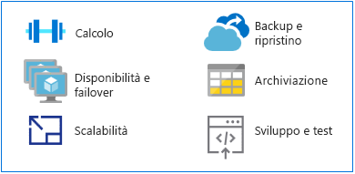

# Transizione dai mainframe ad Azure

In quanto piattaforma alternativa per l'esecuzione delle applicazioni mainframe tradizionali, Azure offre servizi di calcolo e archiviazione con iperscalabilità in un ambiente a disponibilità elevata. Si ottengono il valore e la flessibilità di una piattaforma moderna basata sul cloud, senza i costi associati a un ambiente mainframe.

Questa sezione include indicazioni tecniche per la transizione da una piattaforma mainframe ad Azure.

## MIPS e vCPU

Non esiste alcuna formula di mapping universale per determinare la quantità di unità di elaborazione centrale virtuali (vCPU) necessarie per eseguire i carichi di lavoro mainframe. Tuttavia, la metrica MIPS (un milione di istruzioni al secondo) viene spesso mappata a vCPU in Azure. La metrica MIPS misura la potenza di calcolo complessiva di un mainframe, fornendo un valore costante del numero di cicli al secondo per un determinato computer.

Una piccola organizzazione potrebbe richiedere meno di 500 MIPS, mentre un'organizzazione grande usa in genere più di 5.000 MIPS. Con un costo di circa 1.000 dollari per singola unità MIPS, una grande organizzazione spende circa 5 milioni di dollari all'anno per distribuire un'infrastruttura da 5.000 MIPS. Il costo stimato annuale per una distribuzione tipica di Azure della stessa scala è circa un decimo del costo di un'infrastruttura MIPS. Per informazioni dettagliate, vedere la tabella 4 nel white paper [Demystifying Mainframe-to-Azure Migration](https://azure.microsoft.com/resources/demystifying-mainframe-to-azure-migration) (Demistificazione della migrazione da mainframe ad Azure).

Un calcolo preciso del rapporto tra MIPS e vCPU con Azure dipende dal tipo di vCPU e dal carico di lavoro esatto in esecuzione. Tuttavia, esistono studi di benchmark che offrono un buon punto di partenza per stimare il numero e il tipo di vCPU che saranno necessari. Un [benchmark zREF HPE](https://h20195.www2.hpe.com/v2/getpdf.aspx/4aa4-2452enw.pdf) recente indica le stime seguenti:

- 288 MIPS per ogni core basato su Intel in esecuzione in server HP Proliant per i processi (CICS) online.

- 170 MIPS per ogni core Intel per i processi batch COBOL.

Questa guida stima 200 MIPS per ogni vCPU per l'elaborazione online e 100 MIPS per ogni vCPU per l'elaborazione batch.

> [!NOTE]
> Queste stime sono soggette a modifiche con l'introduzione di una nuova serie di macchine virtuali in Azure.

## Disponibilità elevata e failover

I sistemi mainframe offrono spesso una disponibilità a cinque 9 (99,999%) quando vengono usati l'accoppiamento mainframe e Parallel Sysplex. Gli operatori di sistema devono comunque ancora pianificare tempi di inattività per la manutenzione e l'IPL (Initial Program Load). La disponibilità effettiva si avvicina a due o tre 9, in modo analogo a server basati su Intel di fascia alta.

Azure offre invece contratti di servizio basati su impegno (SLA), in cui la disponibilità a più 9 è la norma, ottimizzata con la replica locale o geografica dei servizi.

Azure offre maggiore disponibilità grazie alla replica dei dati da più dispositivi di archiviazione, in locale o in altre aree geografiche. Nel caso di un errore basato su Azure, le risorse di calcolo possono accedere i dati replicati a livello locale o di area.

Quando si usano risorse della piattaforma Azure come un servizio (PaaS), ad esempio [database SQL di Azure](/azure/sql-database/sql-database-technical-overview) e [database Azure Cosmos](/azure/cosmos-db/introduction), Azure può gestire automaticamente i failover. Quando si usa l'infrastruttura di Azure distribuita come servizio (IaaS), il failover si basa su funzionalità specifiche del sistema, ad esempio AlwaysOn di SQL Server, istanze di cluster di failover e gruppi di disponibilità.

## Scalabilità

I mainframe supportano in genere la scalabilità verticale, mentre gli ambienti cloud supportano lo scale-out. Lo scale-out dei mainframe può avvenire tramite strutture CF (Coupling Facility), ma i costi elevati di hardware e archiviazione lo rendono molto oneroso.

Inoltre, una struttura CF offre risorse di calcolo ad accoppiamento stretto, mentre le funzionalità di scale-out di Azure sono ad accoppiamento lasco. Il cloud può essere ampliato o ridotto per soddisfare esattamente le specifiche dell'utente, con potenza del computer, risorse di archiviazione e servizi ridimensionabili su richiesta con un modello di fatturazione basato sull'utilizzo.

## Backup e ripristino

I clienti di mainframe si avvalgono in genere di siti di ripristino di emergenza o si rivolgono a un provider di mainframe indipendente per le contingenze di emergenza. La sincronizzazione con un sito di ripristino di emergenza avviene in genere tramite copie offline dei dati. Entrambe le opzioni comportano costi elevati.

È anche disponibile la ridondanza geografica automatizzata tramite la struttura CF del mainframe, sebbene a costi elevati, in genere riservata ai sistemi cruciali. Al contrario, Azure offre opzioni semplici da implementare e convenienti per [backup](/azure/backup/backup-introduction-to-azure-backup), [ripristino](/azure/site-recovery/site-recovery-overview) e [ridondanza](/azure/storage/common/storage-redundancy) a livello locale o di area oppure tramite la ridondanza geografica.

## Archiviazione

Per capire come funzionano i mainframe è in parte necessario decodificare vari termini usati in modo intercambiabile. I termini memoria centrale, memoria reale, archiviazione reale e archiviazione principale, ad esempio, in genere si riferiscono tutti alle risorse di archiviazione collegate direttamente al processore del mainframe.

L'hardware mainframe include processori e molti altri dispositivi, ad esempio dispositivi di memoria ad accesso diretto (DASD), unità nastro magnetiche e diversi tipi di console utente. I nastri e i dispositivi DASD vengono usati per le funzioni di sistema e dai programmi per gli utenti.

I tipi di archiviazione fisica per i sistemi mainframe includono:

- Memoria centrale: posizionata direttamente nel processore del mainframe, è nota anche come memoria del processore o memoria reale.

- Memoria ausiliaria: posizionata separatamente dal mainframe, include lo spazio di archiviazione nei dispositivi DASD ed è nota anche come memoria di paging.

Il cloud offre un'ampia gamma di opzioni flessibili e scalabili, consentendo di pagare solo per le opzioni effettivamente necessarie. [Archiviazione di Azure](/azure/storage/common/storage-introduction) offre un archivio a scalabilità elevata per oggetti dati, un servizio di file system per il cloud, un archivio di messaggistica affidabile e un archivio NoSQL. Per le macchine virtuali, i dischi gestiti e non gestiti offrono risorse di archiviazione su disco persistenti e sicure.

## Sviluppo e test per il mainframe

Uno dei motivi principali a favore dei progetti di migrazione dei mainframe è l'evoluzione dello sviluppo di applicazioni. Le organizzazioni vogliono ambienti di sviluppo più agili e reattivi per soddisfare le esigenze aziendali.

I mainframe si avvalgono in genere di partizioni logiche separate (LPAR) per sviluppo e test, ad esempio LPAR per i controlli di qualità e la gestione temporanea. Le soluzioni di sviluppo mainframe includono compilatori (COBOL, PL/I, Assembler) ed editor. Il più comune è ISPF (Interactive System Productivity Facility) per il sistema operativo z/OS in esecuzione su mainframe IBM. Altri sono RPF (ROSCOE Programming Facility) e strumenti di Computer Associates, come CA Librarian e CA-Panvalet.

Gli ambienti di emulazione e i compilatori sono disponibili su piattaforme x86, pertanto sviluppo e test possono essere in genere tra i primi carichi di lavoro di cui eseguire la migrazione da un mainframe ad Azure. La disponibilità e l'uso diffuso di [strumenti DevOps in Azure](https://azure.microsoft.com/solutions/devops/) stanno accelerando la migrazione degli ambienti di sviluppo e test.

Quando le soluzioni vengono sviluppate e testate in Azure e si è pronti per la distribuzione nel mainframe, sarà necessario copiare e compilare il codice nel mainframe.

## Passaggi successivi

> [!div class="nextstepaction"]
> [Migrazione delle applicazioni mainframe](application-strategies.md)
