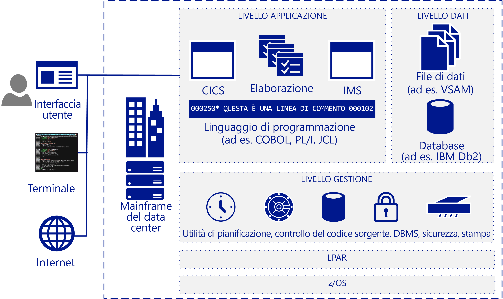

# Panoramica della migrazione dei mainframeMainframe migration overview

Molte aziende e organizzazioni possono trarre vantaggio della migrazione nel cloud di alcuni o tutti i carichi di lavoro, le applicazioni e i database su mainframe.Many companies and organizations benefit from moving some or all their mainframe workloads, applications, and databases to the cloud. Azure offre funzionalità simili a quelle dei mainframe su scala cloud, senza molti degli svantaggi associati ai mainframe.Azure provides mainframe-like features at cloud scale without many of the drawbacks associated with mainframes.

Il termine mainframe in genere fa riferimento a un sistema informatico di grandi dimensioni, ma la maggior parte dei mainframe attualmente distribuiti è costituita da server IBM System Z o sistemi compatibili con IBM che eseguono MVS, DOS, VSE, OS/390 o z/OS.The term mainframe generally refers to a large computer system, but the vast majority currently of mainframes deployed are IBM System Z servers or IBM plug-compatible systems running MVS, DOS, VSE, OS/390, or z/OS. I sistemi mainframe continuano a essere usati in numerosi settori per eseguire sistemi con informazioni importanti e in scenari estremamente specifici, ad esempio ambienti IT con un uso intensivo di transazioni di grandi dimensioni e con volumi elevati.Mainframe systems continue to be used in many industries to run vital information systems, and they have a place in highly-specific scenarios, such as large, high-volume, transaction intensive IT environments.

La migrazione al cloud consente alle aziende di modernizzare la propria infrastruttura.Migrating to the cloud enables companies to modernize their infrastructure. Con i servizi cloud è possibile rendere le applicazioni mainframe, e il relativo valore, disponibili come un carico di lavoro ogni volta che l'organizzazione ne ha bisogno.With cloud services you can make mainframe applications, and the value that they provide, available as a workload whenever your organization needs it. Molti carichi di lavoro possono essere trasferiti in Azure con semplici modifiche del codice, ad esempio aggiornando i nomi dei database.Many workloads can be transferred to Azure with only minor code changes, such as updating the names of databases. È possibile eseguire la migrazione dei carichi di lavoro più complessi con un approccio graduale.You can migrate more complex workloads using a phased approach.

La maggior parte delle aziende Fortune 500 esegue già Azure per i propri carichi di lavoro critici.Most Fortune 500 companies are already running Azure for their critical workloads. I notevoli vantaggi di Azure in termini economici incentivano molti progetti di migrazione.Azure's significant bottom-line incentives motivate many migration projects. Le aziende in genere spostano in Azure prima i carichi di lavoro di sviluppo e test, quindi DevOps, la posta elettronica e il ripristino di emergenza come servizio.Companies typically move development and test workloads to Azure first, followed by DevOps, email, and disaster recovery as a service.

## DestinatariIntended audience

Questa guida è destinata ai professionisti che stanno valutando una migrazione o l'aggiunta di servizi cloud come un'opzione per il proprio ambiente IT.If you’re considering a migration or the addition of cloud services as an option for your IT environment, this guide is for you.

Le indicazioni fornite consentono alle organizzazioni IT di avviare la conversazione sulla migrazione.This guidance helps IT organizations start the migration conversation. Poiché è probabile che si abbia maggiore familiarità con Azure e le infrastrutture basate sul cloud rispetto ai mainframe, la guida inizia con una panoramica del funzionamento dei mainframe e prosegue illustrando varie strategie per determinare di quali elementi eseguire la migrazione e come procedere.You may be more familiar with Azure and cloud-based infrastructures than you are with mainframes, so this guide starts with an overview of how mainframes work, and continues with various strategies for determining what and how to migrate.

## Architettura dei mainframeMainframe architecture

I mainframe sono stati progettati alla fine degli anni '50 come server con scalabilità verticale per l'esecuzione di volumi elevati di transazioni online ed elaborazione batch.In the late 1950s, mainframes were designed as scale-up servers to run high-volume online transactions and batch processing. Per questo motivo, i mainframe dispongono di software per moduli di transazioni online (talvolta denominati "schermate verdi") e sistemi di I/O ad alte prestazioni per l'elaborazione delle esecuzioni batch.Because of this, mainframes have software for online transaction forms (sometimes called green screens) and high-performance I/O systems for processing batch runs.

I mainframe vengono considerati sistemi con una disponibilità e un'affidabilità molto elevate e sono noti per la capacità di eseguire un numero enorme di transazioni online e processi batch.Mainframes have a reputation for high reliability and availability, and are known for their ability to run huge online transactions and batch jobs. Una transazione è costituita da un elemento di elaborazione avviato da una singola richiesta, in genere un utente a un terminale.A transaction results from a piece of processing initiated by a single request, typically from a user at a terminal. Le transazioni possono anche provenire da altre origini, come pagine Web, workstation remote e applicazioni di altri sistemi informatici.Transactions can also come from multiple other sources, including web pages, remote workstations, and applications from other information systems. Una transazione può anche essere attivata automaticamente a un orario predefinito, come mostrato nella figura seguente.A transaction can also be triggered automatically at a predefined time as the following figure shows.

Una tipica architettura mainframe IBM include i seguenti componenti comuni:A typical IBM mainframe architecture includes these common components:

- **Sistemi front-end:** gli utenti possono avviare le transazioni da terminali, pagine Web o workstation remote.**Front-end systems:** Users can initiate transactions from terminals, web pages, or remote workstations. Le applicazioni mainframe spesso dispongono di interfacce utente personalizzate che possono essere conservate dopo la migrazione ad Azure.Mainframe applications often have custom user interfaces that can be preserved after migration to Azure. Vengono ancora usati emulatori di terminali per l'accesso alle applicazioni mainframe, anch'essi denominati "schermate verdi".Terminal emulators are still used to access mainframe applications, and are also called green-screen terminals.

- **Livello applicazione:** i mainframe in genere includono un sistema CICS (Customer Information Control System), una suite di gestione delle transazioni per i mainframe IBM z/OS che viene spesso usata con IBM Information Management System (IMS), una funzionalità di gestione delle transazioni basata su messaggi.**Application tier:** Mainframes typically include a customer information control system (CICS), a leading transaction management suite for the IBM z/OS mainframe that is often used with IBM Information Management System (IMS), a message-based transaction manager. I sistemi batch gestiscono gli aggiornamenti dei dati con una velocità effettiva elevata per grandi volumi di record di account.Batch systems handle high-throughput data updates for large volumes of account records.

- **Codice:** i linguaggi di programmazione usati dai mainframe includono COBOL, Fortran, PL/I e Natural.**Code:** Programming languages used by mainframes include COBOL, Fortran, PL/I, and Natural. Job Control Language (JCL) viene usato per lavorare con z/OS.Job control language (JCL) is used to work with z/OS.

- **Livello database:** un sistema di gestione di database relazionali (DBMS) molto comune per z/OS è IBM DD2.**Database tier:** A common relational database management system (DBMS) for z/OS is IBM DD2. Gestisce strutture di dati denominate *dbspace*, che contengono una o più tabelle e vengono assegnate a pool di archiviazione di set di dati fisici denominati *dbextent*.It manages data structures called *dbspaces* that contain one or more tables and are assigned to storage pools of physical data sets called *dbextents*. Due importanti componenti dei database sono la directory che identifica i percorsi dei dati nei pool di archiviazione e il log che contiene una registrazione delle operazioni eseguite nel database.Two important database components are the directory that identifies data locations in the storage pools, and the log that contains a record of operations performed on the database. Sono supportati vari formati di dati per i file flat.Various flat-file data formats are supported. DB2 per z/OS in genere usa set di dati VSAM (Virtual Storage Access Method) per archiviare i dati.DB2 for z/OS typically uses virtual storage access method (VSAM) datasets to store the data.

- **Livello di gestione:** i mainframe IBM includono software di pianificazione come TWS-OPC, strumenti per la gestione della stampa e dell'output come CA-SAR e SPOOL e un sistema di controllo del codice sorgente.**Management tier:** IBM mainframes include scheduling software such as TWS-OPC, tools for print and output management such as CA-SAR and SPOOL, and a source control system for code. Il controllo di accesso sicuro per z/OS viene gestito da Resource Access Control Facility (RACF).Secure access control for z/OS is handled by resource access control facility (RACF). Una funzionalità di gestione database fornisce l'accesso ai dati nel database e viene eseguita in una specifica partizione in un ambiente z/OS.A database manager provides access to data in the database and runs in its own partition in a z/OS environment.

- **LPAR:** le partizioni logiche, o LPAR, vengono usate per dividere le risorse di calcolo.**LPAR:** Logical partitions, or LPARs, are used to divide compute resources. Un mainframe fisico è suddiviso in più LPAR.A physical mainframe is partitioned into multiple LPARs.

- **z/OS:** un sistema operativo a 64 bit usato principalmente per i mainframe IBM.**z/OS:** A 64-bit operating system that is most commonly used for IBM mainframes.

I sistemi IBM utilizzano un sistema di monitoraggio delle transazioni come CICS per registrare e gestire tutti gli aspetti di una transazione aziendale.IBM systems use a transaction monitor such as CICS to track and manage all aspects of a business transaction. CICS gestisce la condivisione delle risorse, l'integrità dei dati e l'assegnazione delle priorità di esecuzione.CICS manages the sharing of resources, the integrity of data, and prioritization of execution. CICS autorizza gli utenti, alloca le risorse e passa le richieste per il database dall'applicazione a una funzionalità di gestione database, ad esempio IBM DB2.CICS authorizes users, allocates resources, and passes database requests by the application to a database manager, such as IBM DB2.

Per un'ottimizzazione più precisa, CICS viene solitamente usato con IMS/TM (in precedenza denominato IMS/Data Communications o IMS/DC).For more precise tuning, CICS is commonly used with IMS/TM (formerly IMS/Data Communications or IMS/DC). IMS è stato progettato per ridurre la ridondanza dei dati tramite la gestione di una sola copia dei dati.IMS was designed to reduce data redundancy by maintaining a single copy of the data. Integra CICS nel monitoraggio delle transazioni, attraverso la gestione dello stato nel corso di tutto il processo e la registrazione delle funzioni di business in un archivio dati.It complements CICS as a transaction monitor by maintaining state throughout the process and recording business functions in a data store.

## Operazioni dei mainframeMainframe operations

Di seguito sono illustrate le tipiche operazioni dei mainframe:The following are typical mainframe operations:

- **Online:** i carichi di lavoro includono l'elaborazione delle transazioni, la gestione dei database e le connessioni.**Online:** Workloads include transaction processing, database management, and connections. Vengono spesso implementati usando connettori IBM DB2, CICS e z/OS.They are often implemented using IBM DB2, CICS, and z/OS connectors.

- **Batch:** processi eseguiti senza alcuna interazione dell'utente, in genere a intervalli regolari, ad esempio ogni mattina nei giorni feriali.**Batch:** Jobs run without user interaction, typically on a regular schedule such as every weekday morning. I processi batch possono essere eseguiti nei sistemi basati su Windows o Linux usando un emulatore JCL come il software Micro Focus Enterprise Server o BMC Control-M.Batch jobs can be run on systems based on Windows or Linux by using a JCL emulator such as Micro Focus Enterprise Server or BMC Control-M software.

- **Job Control Language (JCL):** consente di specificare le risorse necessarie per l'elaborazione dei processi batch.**Job control language (JCL):** Specify resources needed to process batch jobs. JCL fornisce queste informazioni a z/OS attraverso un set di istruzioni di controllo dei processi.JCL conveys this information to z/OS through a set of job control statements. A livello di base, JCL contiene sei tipi di istruzioni: JOB, ASSGN, DLBL, EXTENT, LIBDEF ed EXEC.Basic JCL contains six types of statements: JOB, ASSGN, DLBL, EXTENT, LIBDEF, and EXEC. Un processo può contenere diverse istruzioni EXEC (passaggi) e ogni passaggio può avere diverse istruzioni LIBDEF, ASSGN, DLBL ed EXTENT.A job can contain several EXEC statements (steps), and each step could have several LIBDEF, ASSGN, DLBL, and EXTENT statements.

- **Initial Program Load (IPL):**  indica il caricamento di una copia del sistema operativo dal disco nella memoria reale del processore e la relativa esecuzione.**Initial program load (IPL):**  Refers to loading a copy of the operating system from disk into a processor’s real storage and running it. Gli IPL vengono usati per il ripristino in seguito a tempi di inattività.IPLs are used to recover from downtime. Un IPL è simile all'avvio del sistema operativo nelle macchine virtuali Windows o Linux.An IPL is like booting the operating system on Windows or Linux VMs.

## Passaggi successiviNext steps

> [!div class="nextstepaction"]
> [Falsi miti e fattiMyths and facts](myths-and-facts.md)
