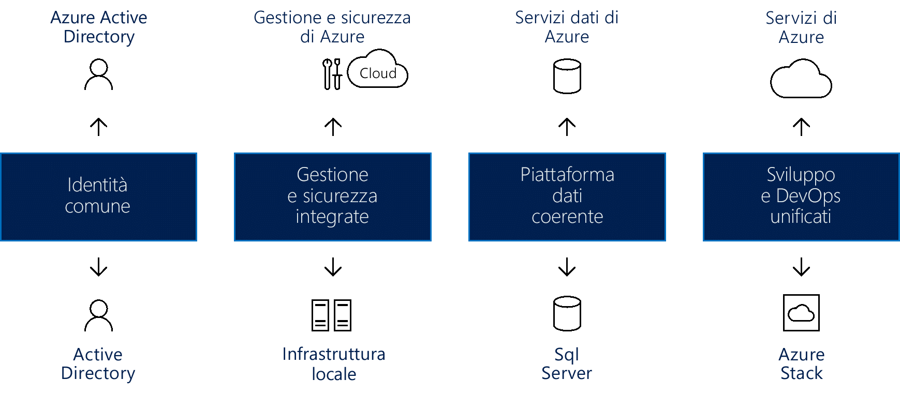

# Creare coerenza del cloud ibrido

Questo articolo illustra gli approcci generali per ottenere la coerenza del cloud ibrido.

I modelli di distribuzione ibrida durante la migrazione possono ridurre il rischio e contribuire a una transizione fluida dell'infrastruttura. Le piattaforme cloud offrono il massimo livello di flessibilità per i processi aziendali. Molte organizzazioni esitano ad affrontare la transizione al cloud, preferendo invece mantenere il controllo completo sui dati più sensibili. Sfortunatamente, i server locali non consentono la stessa velocità di innovazione del cloud. Una soluzione cloud ibrida permette di ottenere il meglio di entrambi questi mondi, ovvero la velocità di innovazione del cloud E la comodità della gestione locale.

## Integrare la coerenza del cloud ibrido

L'uso di una soluzione cloud ibrida consente alle organizzazioni di ridimensionare le risorse di calcolo. Elimina inoltre la necessità di sostenere ingenti spese in conto capitale per gestire picchi nella domanda a breve termine. Quando le variazioni delle attività aziendali rendono necessario liberare risorse locali per i dati o le applicazioni più sensibili, è più semplice, veloce ed economico effettuare il deprovisioning delle risorse cloud. Si pagano solo le risorse usate temporaneamente dall'organizzazione, senza dover acquistare e gestire risorse aggiuntive. In questo modo si riduce la quantità di dispositivi che potrebbero rimanere inattivi per lunghi periodi di tempo. Cloud computing ibrido è una piattaforma "migliore dei mondi possibili" e offre tutti i vantaggi del cloud computing flessibilità, scalabilità e risparmi sui costi che; tutto con il più basso possibile rischio di esposizione dei dati.

*Figura 1. Ottenere la coerenza del cloud ibrido per identità, gestione, sicurezza, dati, sviluppo e DevOps*

Una vera soluzione di cloud ibrido deve fornire quattro componenti, ognuno dei quali apporta notevoli vantaggi, tra cui:

- Identità comune per le applicazioni locali e cloud: ciò migliora la produttività degli utenti offrendo loro l'accesso Single Sign-On (SSO) a tutte le applicazioni. Garantisce inoltre la coerenza quando applicazioni e utenti oltrepassano i limiti di rete/cloud.
- Gestione e sicurezza integrate per il cloud ibrido: ciò offre un modo coerente per monitorare, gestire e proteggere l'ambiente, consentendo maggiore visibilità e controllo.
- Una piattaforma dati coerente per data center e cloud: si ottiene così la portabilità dei dati, in combinazione con l'accesso trasparente ai servizi dati locali e cloud per una visuale approfondita su tutte le origini dati.
- Sviluppo e DevOps unificati tra cloud e data center locali: in questo modo è possibile spostare le applicazioni tra i due ambienti in base alle esigenze, migliorando la produttività degli sviluppatori, perché in entrambe le posizioni è ora disponibile lo stesso ambiente di sviluppo.
  
Alcuni esempi di questi componenti dalla prospettiva di Azure sono:

- Azure Active Directory (Azure AD), che interagisce con Azure AD in locale per fornire l'identità comune per tutti gli utenti. SSO in locale e tramite il cloud per consentire agli utenti di accedere in modo semplice e sicuro alle applicazioni e agli asset di cui hanno bisogno. Gli amministratori possono gestire i controlli di governance e sicurezza in modo che gli utenti possono accedere a ciò che cercano, flessibilità per modificare le autorizzazioni senza compromettere l'esperienza utente.
- Azure offre servizi di gestione e sicurezza integrati sia per il cloud che per l'infrastruttura locale, che includono un set integrato di strumenti per il monitoraggio, la configurazione e la protezione dei cloud ibridi. Questo approccio end-to-end alla gestione consente di gestire nello specifico le sfide del mondo reale che si trovano ad affrontare le organizzazioni che prendono in considerazione una soluzione cloud ibrida.
- Il cloud ibrido di Azure offre strumenti comuni che garantiscono l'accesso sicuro a tutti i dati, in modo fluido ed efficiente. I servizi dati di Azure collaborano con Microsoft SQL Server per creare una piattaforma dati coerente. Un modello di cloud ibrido coerente consente agli utenti di lavorare sia con dati operativi che analitici, fornendo gli stessi servizi in locale e nel cloud per data warehousing, analisi dei dati e visualizzazione dei dati.
- I servizi cloud di Microsoft Azure, i combinazione con Microsoft Azure Stack in locale, offrono sviluppo e DevOps unificati. La coerenza tra cloud e locale significa che il team DevOps può sviluppare applicazioni eseguite in entrambi gli ambienti e distribuirle facilmente nella giusta posizione. È anche possibile riutilizzare i modelli nella soluzione ibrida, semplificando ulteriormente i processi DevOps.

## Azure Stack è un ambiente cloud ibrido

Microsoft Azure Stack è una soluzione cloud ibrida che consente alle organizzazioni di eseguire servizi coerenti con Azure nel proprio data center, offrendo un'esperienza semplificata per lo sviluppo, la gestione e la sicurezza, coerente con i servizi cloud pubblici di Azure. Azure Stack è un'estensione di Azure, che consente di eseguire i servizi di Azure da ambienti locali e quindi di passare al cloud di Azure se e quando necessario.

Azure Stack consente di distribuire e usare componenti sia IaaS e PaaS con gli stessi strumenti e offrendo la stessa esperienza del cloud pubblico di Azure. La gestione di Azure Stack, indipendentemente dal fatto che si scelga il portale dell'interfaccia utente Web o PowerShell, ha un aspetto coerente con Azure per gli amministratori IT e gli utenti finali.

Azure e Azure Stack rendono possibili nuovi casi d'uso ibridi sia per le applicazioni esposte ai clienti che per le applicazioni line-of-business interne, tra cui:

- **Soluzioni disconnesse ed edge**. I clienti possono risolvere i problemi relativi ai requisiti di latenza e di connettività elaborando i dati localmente in Azure Stack e quindi aggregandoli in Azure per altre analisi, tramite la logica dell'applicazione comune in entrambi. Molti clienti sono interessati a questo scenario edge in contesti diversi, tra cui impianti manifatturieri, navi da crociera e impianti minerari.
- **Applicazioni cloud che soddisfano varie normative**. I clienti possono sviluppare e distribuire applicazioni in Azure, con la massima flessibilità di poter scegliere la distribuzione locale in Azure Stack, in modo da soddisfare norme specifiche o requisiti dei criteri, senza che siano necessarie modifiche al codice. Esempi di applicazioni a titolo illustrativo includono applicazioni per controllo globale, creazione di report finanziari, scambio di valuta estera, giochi online ed generazione di report di spesa. In alcuni casi, i clienti desiderano poter distribuire istanze diverse della stessa applicazione in Azure o Azure Stack, a seconda dei requisiti tecnici e aziendali. Mentre Azure soddisfa la maggior parte dei requisiti, Azure Stack integra l'approccio di distribuzione quando necessario.
- **Modello di applicazioni cloud in locale**. I clienti possono usare servizi Web di Azure, contenitori, architetture serverless e architetture di microservizi per aggiornare ed estendere le applicazioni esistenti o crearne di nuove. È possibile usare processi coerenti per DevOps in Azure nel cloud e in Azure Stack in locale. Esiste un crescente interesse per la modernizzazione delle applicazioni, incluse quelle cruciali.

Azure Stack è disponibile tramite due opzioni di distribuzione:

- **Sistemi integrati di Azure Stack**. I sistemi integrati di Azure Stack vengono offerti grazie alla collaborazione tra Microsoft e partner per l'hardware, con la possibilità di creare una soluzione che offre l'innovazione al passo con il cloud bilanciata dalla semplicità di gestione. Dato che Azure Stack è disponibile come sistema integrato di hardware e software, si ottiene il giusto livello di flessibilità e controllo, pur adottando l'innovazione dal cloud. I sistemi integrati Azure Stack hanno dimensioni variabili da 4 a 12 nodi e sono supportati congiuntamente dal partner per l'hardware e Microsoft. Usare i sistemi integrati Azure Stack per rendere possibili nuovi scenari per i carichi di lavoro di produzione.
- **Azure Stack Development Kit**. Microsoft Azure Stack Development Kit è una distribuzione a nodo singolo di Azure Stack, che è possibile usare per valutare e imparare a conoscere Azure Stack. È anche possibile usare il kit come ambiente di sviluppo, in cui è possibile sviluppare usando API e strumenti coerenti con Azure. Azure Stack Development Kit non è destinato all'uso in ambiente di produzione.

## Azure Stack e l'ecosistema unico del cloud

È possibile velocizzare le iniziative di Azure Stack tramite l'ecosistema di Azure completo:

- Azure garantisce che la maggior parte delle applicazioni e dei servizi certificati per Azure funzionerà in Azure Stack. Vari ISV stanno estendendo le loro soluzioni ad Azure Stack, inclusi Bitnami, Docker, Kemp Technologies, Pivotal Cloud Foundry, Red Hat Enterprise Linux e SUSE Linux.
- È possibile scegliere di usare e gestire Azure Stack come servizio completamente gestito. Vari partner offriranno a breve servizi gestiti per Azure e Azure Stack, tra cui Tieto Yourhosting, Revera, Pulsant e NTT. Questi partner offrono già servizi gestiti per Azure tramite il programma Cloud Solution Provider (provider di servizi cloud) e ora intendono estendere le proprie offerte per includere soluzioni ibride.
- A titolo di esempio di soluzione cloud ibrida completa e completamente gestita, Avanade propone un'offerta all-in-one che include servizi di trasformazione cloud, software, infrastruttura, installazione e configurazione, oltre a servizi gestiti continuativi, in modo che i clienti possano utilizzare Azure Stack come fanno già con Azure.
- I system integrator possono promuovere iniziative di modernizzazione delle applicazioni realizzando soluzioni di Azure end-to-end per i clienti, grazie a competenze approfondite per Azure, alle conoscenze del dominio e del settore e all'esperienza per i processi, ad esempio DevOps. Per un system integrator, ogni cloud Azure Stack rappresenta un'opportunità di progettare la soluzione, guidare e delineare la distribuzione del sistema, personalizzare le funzionalità incluse e gestire le attività operative. Sono inclusi system integrator come Avanade, DXC, Dell EMC Services, InFront Consulting Group, HPE Pointnext e Pricewaterhouse Coopers (PwC).
