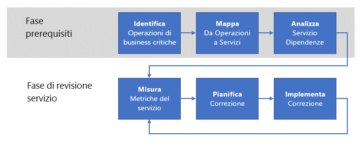

# Stabilire una verifica dell'idoneità operativa

Quando l'azienda inizia a gestire operativamente i carichi di lavoro in Azure, il passaggio successivo consiste nel definire un processo di **verifica dell'idoneità operativa** per enumerare, implementare e verificare in modo iterativo i requisiti **non funzionali** per questi carichi di lavoro. I requisiti _non funzionali_ sono correlati al comportamento operativo previsto del servizio. Esistono cinque categorie essenziali di requisiti non funzionali detti [pilastri della qualità del software](../../guide/pillars.md): scalabilità, disponibilità, resilienza (inclusi continuità aziendale e ripristino di emergenza), gestione e sicurezza. Lo scopo di un processo di verifica dell'idoneità operativa è garantire che i carichi di lavoro cruciali soddisfino le aspettative dell'azienda in relazione ai pilastri della qualità.

Per questo motivo, l'azienda dovrebbe mettere in atto un processo di verifica dell'idoneità operativa per comprendere appieno i problemi risultanti dall'esecuzione del carico di lavoro in un ambiente di produzione, determinare come porvi rimedio e poi risolverli. Questo articolo illustra un processo di verifica dell'idoneità operativa di alto livello che può essere adottato dall'organizzazione per raggiungere questo obiettivo.

## Idoneità operativa a Microsoft

Fin dall'inizio, lo sviluppo della piattaforma Azure è stato un progetto di sviluppo e integrazione continui a cui hanno partecipato molti team all'interno di Microsoft. Sarebbe molto difficile assicurare la qualità e la coerenza per un progetto delle dimensioni e con la complessità di Azure senza un solido processo per l'enumerazione e l'implementazione regolari dei requisiti non funzionali fondamentali.

Questi processi seguiti da Microsoft costituiscono la base per quelli descritti in questo documento.

## Comprensione del problema

Come descritto nell'[Introduzione](../../cloud-adoption/getting-started/overview.md), il primo passaggio per la trasformazione digitale di un'organizzazione consiste nell'identificare i problemi aziendali da risolvere mediante l'adozione di Azure. Il passaggio successivo consiste nel determinare una soluzione di alto livello per il problema, ad esempio la migrazione di un carico di lavoro nel cloud o l'adattamento di un servizio locale esistente per includere le funzionalità del cloud. Infine, la soluzione viene progettata e implementata.

Durante questo processo, al centro dell'attenzione vi sono spesso le _funzionalità_ del servizio. Vale a dire, esiste un set di requisiti _funzionali_ desiderati per il servizio. Ad esempio, un servizio per la spedizione di prodotti richiede funzionalità per determinare le posizioni di origine e di destinazione del prodotto, per tenere traccia del prodotto durante la spedizione, per le notifiche ai clienti e altre.

I requisiti _non funzionali_ si riferiscono invece a proprietà del servizio come la [disponibilità](../../checklist/availability.md), la [resilienza](../../resiliency/index.md) e la [scalabilità](../../checklist/scalability.md). Queste proprietà differiscono dai requisiti funzionali perché non incidono direttamente sulla funzione finale di qualsiasi funzionalità particolare nel servizio. Questi requisiti non funzionali sono invece correlati alle _prestazioni_ e alla _continuità_ del servizio.

È possibile specificare alcuni requisiti non funzionali in termini di contratto di servizio (SLA). Ad esempio, per quanto riguarda la continuità del servizio, un requisito di disponibilità per il servizio può essere espresso come percentuale, ad esempio **disponibilità del 99,99% del tempo**. Altri requisiti non funzionali potrebbero essere più difficili da definire e possono cambiare con l'evolversi delle esigenze di produzione. Ad esempio, per un servizio rivolto ai consumatori potrebbero nascere requisiti di velocità effettiva imprevisti dopo un picco di popolarità.

![NOTE] La definizione dei requisiti per la resilienza, incluse spiegazioni dei concetti di RPO, RTO, contratto di servizio e concetti correlati, sono disponibili in maggiore dettaglio in [Progettazione di applicazioni resilienti per Azure](../../resiliency/index.md#define-your-availability-requirements).

## Processo di verifica dell'idoneità operativa

L'elemento chiave per mantenere le prestazioni e la continuità dei servizi di un'azienda è l'implementazione di un processo di _verifica dell'idoneità operativa_.

A livello generale, il processo prevede due fasi. Nella fase dei prerequisiti, i requisiti vengono stabiliti e abbinati ai servizi di supporto. Questa fase è meno frequente e probabilmente si verifica ogni anno o in caso di introduzione di nuovi processi operativi. L'output della fase dei prerequisiti viene usato nella fase del flusso. La fase del flusso si verifica più frequentemente. Si consiglia ogni mese.

### Fase dei prerequisiti

I passaggi in questa fase sono utili per raccogliere i requisiti necessari per eseguire una verifica regolare dei servizi importanti.

- **Identificare le operazioni aziendali cruciali**. Identificare le operazioni aziendali cruciali dell'organizzazione. Le operazioni aziendali sono indipendenti da qualsiasi funzionalità dei servizi di supporto. In altre parole, le operazioni aziendali rappresentano le attività effettive che l'azienda deve eseguire e che sono supportate da un set di servizi IT. Il termine **cruciale**, o **business critical**, è indicativo delle gravi conseguenze per l'azienda se l'operazione risultasse impedita. Ad esempio, un rivenditore online può avere un'operazione aziendale come "consentire a un cliente di aggiungere un articolo a un carrello" oppure "elaborare un pagamento con carta di credito". Se una di queste operazioni dovesse avere esito negativo, un cliente non sarebbe in grado di completare la transazione e l'azienda non riuscirebbe a realizzare la vendita.

- **Abbinare le operazioni ai servizi**. Abbinare queste operazioni aziendali ai servizi che le supportano. Nel precedente esempio del carrello, possono essere coinvolti diversi servizi: un servizio di gestione delle scorte di magazzino, un servizio per il carrello e altri. Nell'esempio di pagamento con carta di credito precedente, un servizio di pagamento in locale potrebbe interagire con un servizio di elaborazione dei pagamenti di terze parti.

- **Analizzare le dipendenze dei servizi**. La maggior parte delle operazioni aziendali richiede l'orchestrazione tra più servizi di supporto. È importante conoscere le dipendenze tra i servizi e il flusso delle transazioni cruciali attraverso questi servizi. È anche necessario tenere conto delle dipendenze tra i servizi locali e i servizi di Azure. Nell'esempio del carrello, il servizio di gestione delle scorte di magazzino potrebbe essere ospitato in locale e usare i dati immessi dai dipendenti da un magazzino fisico, ma potrebbe anche archiviare i dati in un servizio di Azure, ad esempio [archiviazione di Azure](/azure/storage/common/storage-introduction), o in un database come [Azure Cosmos DB](/azure/cosmos-db/introduction).

Un output da queste attività è un set di **metriche di scorecard** per le operazioni del servizio. Le metriche sono categorizzate in base a criteri non funzionali, ad esempio disponibilità, scalabilità e ripristino di emergenza. Le metriche di scorecard esprimono i criteri che è previsto che il servizio soddisfi a livello operativo. Queste metriche possono essere espresse a qualsiasi livello di granularità appropriato per l'operazione del servizio.

La scorecard deve essere espressa in termini semplici per promuovere scambi di opinioni significativi tra i titolari dell'azienda e il personale tecnico. Ad esempio, una metrica di scorecard di scalabilità potrebbe essere espressa con il colore _verde_ nel caso di prestazioni in linea con i criteri desiderati, con il colore _giallo_ per indicare che le prestazioni non soddisfano i criteri desiderati ma che viene implementata attivamente una soluzione pianificata e con il colore_rosso_ per segnalare che i criteri desiderati non sono soddisfatti senza che esistano piani d'azione.

È importante sottolineare che queste metriche devono riflettere direttamente le esigenze aziendali.

### Fase di verifica del servizio

La fase di verifica del servizio è fondamentale nel processo di verifica dell'idoneità operativa.

- **Misurare le metriche del servizio**. Con le metriche di scorecard, i servizi devono essere monitorati per garantire che soddisfino le aspettative aziendali. Questo significa che il monitoraggio dei servizi è fondamentale. Se non si è in grado di monitorare un set di servizi per quanto riguarda i requisiti non funzionali, le metriche di scorecard corrispondenti devono essere considerate rosse. In questo caso, il primo passaggio per la correzione consiste nell'implementare il monitoraggio del servizio appropriato. Ad esempio, se l'azienda si aspetta una disponibilità del 99,99% per il servizio, ma non esistono strumenti di telemetria della produzione per misurare la disponibilità, si deve presupporre che questo requisito non sia soddisfatto.

- **Pianificare gli interventi correttivi**. Per ogni operazione del servizio con metriche che scendono sotto una soglia accettabile, determinare il costo della correzione del servizio per ottenere di nuovo metriche accettabili per l'operazione. Se il costo di correzione del servizio è maggiore rispetto alla generazione di ricavi prevista del servizio, prendere in considerazione anche i costi non tangibili, come l'esperienza dei clienti. Ad esempio, se i clienti hanno difficoltà a completare un ordine con il servizio, potrebbero optare per un concorrente.

- **Implementare gli interventi correttivi**. Dopo aver definito un piano in grado di mettere d'accordo i titolari dell'azienda e il personale tecnico, è tempo di implementarlo. Lo stato dell'implementazione deve essere segnalato ogni volta che vengono esaminate le metriche di scorecard.

Si tratta di un processo iterativo e idealmente l'organizzazione dovrebbe avere un team dedicato proprietario. Questo team dovrebbe riunirsi regolarmente per esaminare i progetti correttivi esistenti, avviare la verifica degli elementi fondamentali per i nuovi carichi di lavoro e monitorare le scorecard complessive dell'azienda. Il team dovrebbe avere l'autorità per prendersi la responsabilità per i team responsabili delle correzioni che sono in ritardo o non riescono a raggiungere le metriche stabilite.

## Struttura del team di verifica dell'idoneità operativa

Il team di verifica dell'idoneità operativa prevede i seguenti ruoli:

1. **Titolare dell'azienda**. Questo ruolo dispone delle conoscenze dell'azienda necessarie per identificare ogni operazione aziendale cruciale e classificarne la priorità. Questo ruolo, inoltre, è in grado di soppesare il costo delle correzioni in relazione all'impatto aziendale e guida la decisione finale in merito agli interventi correttivi.

2. **Responsabile dell'azienda**. Questo ruolo è responsabile della suddivisione delle operazioni aziendali in parti discrete e del mapping di tali parti a servizi ed elementi infrastrutturali locali e nel cloud. Il ruolo richiede una profonda conoscenza della tecnologia associata a ogni operazione aziendale.

3. **Responsabile tecnico**. Questo ruolo è responsabile per l'implementazione dei servizi associati all'operazione aziendale. Queste persone possono partecipare alla progettazione, implementazione e distribuzione di qualsiasi soluzione per la risoluzione dei problemi relativi ai requisiti non funzionali individuati dal team di verifica dell'idoneità operativa.

4. **Responsabile dei servizi**. Questo ruolo è responsabile dell'operatività delle applicazioni e dei servizi aziendali. Queste persone raccolgono dati di registrazione e utilizzo per questi servizi e applicazioni. Questi dati vengono usati sia per identificare i problemi che per verificare le correzioni dopo la distribuzione.

## Riunione di verifica dell'idoneità operativa

È consigliabile che il team di verifica dell'idoneità operativa si riunisca regolarmente. Ad esempio, il team potrebbe riunirsi mensilmente e preparare report sullo stato e le metriche per la dirigenza con cadenza trimestrale.

I dettagli del processo e delle riunioni devono essere adattati in base alle specifiche esigenze. Come punto di partenza, è consigliabile includere le attività seguenti:

1. Il titolare dell'azienda e il responsabile dell'azienda enumerano e stabiliscono i requisiti non funzionali per ogni operazione aziendale, in base all'input dai responsabili tecnici e dei servizi. Per le operazioni aziendali identificate in precedenza, viene stabilita e verificata la priorità. Alle nuove operazioni aziendali viene assegnata una priorità nell'elenco esistente.

2. I responsabili tecnici e dei servizi abbinano lo **stato corrente** delle operazioni aziendali ai servizi locali e nel cloud corrispondenti. Il mapping è costituito da un elenco dei componenti in ogni servizio, delineati come albero delle dipendenze. Dopo aver generato l'elenco e l'albero delle dipendenze, vengono determinati i **percorsi critici** all'interno dell'albero.

3. I responsabili tecnici e dei servizi verificano lo stato corrente di registrazione e monitoraggio operativi per i servizi elencati nel passaggio precedente. Sono fondamentali procedure solide di registrazione e monitoraggio allo scopo di identificare i componenti dei servizi che contribuiscono all'impossibilità di soddisfare i requisiti non funzionali. Se non sono disponibili strumenti di registrazione e monitoraggio sufficienti, occorre creare e implementare un piano per la loro messa in opera.

4. Vengono create metriche di scorecard per le nuove operazioni aziendali. La scorecard è composta dall'elenco dei componenti costitutivi per ogni servizio identificato nel passaggio 2, allineati ai requisiti non funzionali e a una metrica che rappresenta il livello di corrispondenza del componente al requisito.

5. Per i componenti costitutivi che non soddisfano i requisiti non funzionali, viene progettata soluzione di alto livello e viene assegnato un responsabile tecnico. A questo punto, il titolare dell'azienda e il responsabile dell'azienda devono stabilire un budget per gli interventi correttivi, in base ai ricavi previsti per l'operazione aziendale.

6. Infine, viene effettuata una verifica degli interventi correttivi in corso. Ogni metrica della scorecard per il lavoro in corso viene verificata in base alle metriche previste. Per i componenti costituitivi che soddisfano le metriche, il responsabile dei servizi presenta i dati di registrazione e monitoraggio che confermano tale risultato. Per i componenti costitutivi che non soddisfano le metriche, tutti i responsabili tecnici sono tenuti a spiegare i problemi che impediscono il raggiungimento delle metriche e a presentare eventuali nuovi progetti per la correzione.

## Risorse consigliate

- [Concetti fondamentali della qualità del software](../../guide/pillars.md).
    Questa sezione della Guida all'architettura delle applicazioni Azure descrive i cinque concetti fondamentali per la qualità del software: scalabilità, disponibilità, resilienza, gestione e sicurezza.
- [Dieci principi di progettazione per le applicazioni Azure](../../guide/design-principles/index.md).
    Questa sezione della Guida all'architettura delle applicazioni Azure descrive un set di principi di progettazione per rendere l'applicazione più scalabile, resiliente e gestibile.
- [Progettazione di applicazioni resilienti per Azure](../../resiliency/index.md).
    Questa guida inizia con una definizione del termine resilienza e dei concetti correlati. Quindi, viene descritto un processo per ottenere la resilienza, adottando un approccio strutturato in base alla durata di un'applicazione, dalla progettazione e implementazione alla distribuzione, fino alle operazioni.
- [Modelli di progettazione cloud](../../patterns/index.md).
    Questi modello di progettazione sono utili per i team di progettazione durante lo sviluppo di applicazioni in base ai pilastri della qualità del software.
