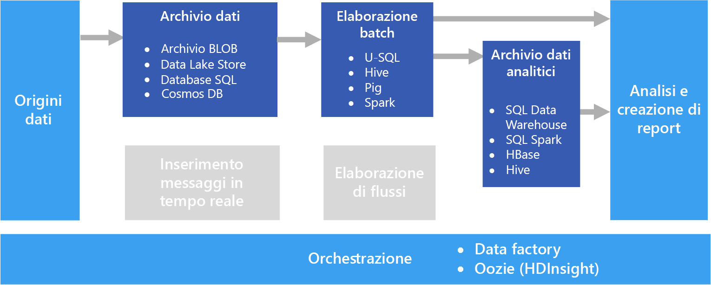

# Elaborazione batch

Uno scenario di Big Data comune è costituito dall'elaborazione batch di dati inattivi. In questo scenario i dati di origine vengono caricati nella risorsa di archiviazione dei dati tramite l'applicazione di origine o da un flusso di lavoro di orchestrazione. I dati vengono quindi elaborati sul posto da un processo parallelizzato, che può essere avviato anche dal flusso di lavoro di orchestrazione. L'elaborazione può includere più passaggi iterativi prima che i risultati trasformati vengano caricati in un archivio dati analitici su cui è possibile eseguire query tramite i componenti di analisi e report.

Ad esempio, i log di un server Web possono essere copiati in una cartella e quindi elaborati durante la notte per generare report giornalieri dell'attività Web.

## Quando usare questa soluzione

L'elaborazione batch viene usata in una vasta gamma di scenari, dalle semplici trasformazioni di dati fino a pipeline ETL (Extract-Transform-Load) più complete. In un contesto di Big Data l'elaborazione batch può funzionare su set di dati di grandi dimensioni, in cui la fase di calcolo richiede tempi molto lunghi. Ad esempio, vedere [Lambda architecture](../big-data/index.md#lambda-architecture) (Architettura lambda). L'elaborazione batch porta in genere a un'ulteriore esplorazione interattiva, fornisce i dati di modellazione per l'apprendimento automatico o scrive i dati in un archivio dati ottimizzato per l'analisi e la visualizzazione.

Un esempio di elaborazione batch è la trasformazione di un ampio set di file flat semistrutturati CSV o JSON in un formato schematizzato e strutturato pronto per altre query. I dati vengono in genere convertiti dai formati non elaborati usati per l'inserimento (ad esempio CSV) in formati binari che risultano più efficienti per l'esecuzione di query poiché archiviano i dati in colonne e offrono spesso indici e statistiche inline sui dati.

## Problematiche

- **Formato di dati e codifica**. Alcuni dei problemi più difficili da correggere si verificano quando i file usano una codifica o un formato non previsto. Ad esempio, i file di origine potrebbero usare una combinazione di codifica UTF-16 e UTF-8 oppure contenere delimitatori imprevisti (spazio anziché tabulazione) o includere caratteri imprevisti. Un altro esempio comune è costituito da campi di testo che contengono tabulazioni, spazi o virgole interpretati come delimitatori. La logica di caricamento e analisi dei dati deve essere sufficientemente flessibile da rilevare e gestire questi problemi.

- **Orchestrazione degli intervalli di tempo.** Spesso i dati di origine sono inseriti in una gerarchia di cartelle che riflette gli intervalli di elaborazione, organizzati per anno, mese, giorno, ora e così via. In alcuni casi, i dati possono arrivare in ritardo. Ad esempio, si supponga che in un server Web si verifichi un errore e che i log relativi al 7 marzo arrivino nella cartella di elaborazione solo il 9 marzo. Sarà necessario stabilire se devono essere semplicemente ignorati a causa del ritardo o se la logica di elaborazione downstream sarà in grado di gestire i record non disponibili.

## Architecture

Un'architettura per l'elaborazione batch include i componenti logici seguenti, illustrati nel diagramma precedente.

- **Archiviazione dati.** In genere si tratta di un archivio di file distribuito che può essere usato come repository per volumi elevati di file di grandi dimensioni in diversi formati. Genericamente, questo tipo di archivio viene spesso definito data lake. 

- **Elaborazione batch.** Poiché i Big Data hanno dimensioni considerevoli, le soluzioni spesso devono elaborare i file di dati mediante processi batch con esecuzione prolungata per filtrare, aggregare e preparare in altro modo i dati per l'analisi. In genere questi processi prevedono la lettura dei file di origine, la relativa elaborazione e la scrittura dell'output in nuovi file. 

- **Archivio dati analitici.** Numerose soluzioni per Big Data sono progettate per preparare i dati per l'analisi e quindi servire i dati elaborati in un formato strutturato su cui è possibile eseguire query con strumenti di analisi. 

- **Analisi e creazione di report.** L'obiettivo della maggior parte delle soluzioni per Big Data è fornire informazioni dettagliate sui dati tramite strumenti di analisi e report. 

- **Orchestrazione.** Con l'elaborazione batch è in genere necessaria un'orchestrazione per eseguire la migrazione o la copia dei dati nella risorsa di archiviazione dati, nell'elaborazione batch, nell'archivio dati analitici e nei livelli per la creazione di report.

## Scelte di tecnologia

Per le soluzioni di elaborazione batch in Azure è consigliabile usare le tecnologie seguenti.

### Archiviazione dei dati

- **Contenitori BLOB del servizio di archiviazione di Azure**. Molti processi aziendali di Azure esistenti prevedono già l'uso di Archiviazione BLOB di Azure. Si tratta quindi di un'ottima scelta per un archivio di Big Data.
- **Azure Data Lake Store**. Azure Data Lake Store offre archiviazione praticamente illimitata per file di ogni dimensione e opzioni di sicurezza complete. Si tratta quindi di un'ottima scelta per soluzioni per Big Data su larga scala che richiedono un archivio centralizzato per i dati in formati eterogenei.

Per altre informazioni, vedere [Archiviazione dei dati](../technology-choices/data-storage.md).

### Elaborazione batch

- **U-SQL**. U-SQL è il linguaggio usato da Azure Data Lake Analytics per l'elaborazione delle query. Combina il carattere dichiarativo di SQL con l'estendibilità procedurale di C#, avvalendosi del parallelismo per consentire un'elaborazione efficiente dei dati su larga scala.
- **Hive**. Hive è un linguaggio simile a SQL ed è supportato in quasi tutte le distribuzioni Hadoop, incluso HDInsight. Consente di elaborare i dati da qualsiasi archivio compatibile con HDFS, inclusi Archiviazione BLOB di Azure e Azure Data Lake Store.
- **Pig**. Pig è un linguaggio di elaborazione di Big Data di carattere dichiarativo usato in molte distribuzioni Hadoop, incluso HDInsight. È particolarmente utile per l'elaborazione di dati non strutturati o semistrutturati.
- **Spark**. Il motore Spark supporta programmi di elaborazione batch scritti in una serie di linguaggi, tra cui Java, Scala e Python. Spark usa un'architettura distribuita per elaborare i dati in parallelo in più nodi di lavoro.

Per altre informazioni, vedere [Elaborazione batch](../technology-choices/batch-processing.md).

### Archivio dati analitici

- **SQL Data Warehouse**. Azure SQL Data Warehouse è un servizio gestito basato su tecnologie di database di SQL Server e ottimizzato per supportare carichi di lavoro di data warehousing su larga scala.
- **Spark SQL**. Spark SQL è un'API basata su Spark che supporta la creazione di dataframe e tabelle su cui è possibile eseguire query usando la sintassi SQL.
- **HBase**. HBase è un archivio NoSQL a bassa latenza che offre un'opzione flessibile e a prestazioni elevate per eseguire query su dati strutturati e semistrutturati.
- **Hive**. Oltre a essere utile per l'elaborazione batch, Hive offre un'architettura di database concettualmente simile a quella di un sistema di gestione di database relazionali tipico. I miglioramenti apportati alle prestazioni di esecuzione delle query Hive attraverso innovazioni come il motore Tez e l'iniziativa Stinger indicano che le tabelle Hive possono essere usate efficacemente come origini per query analitiche in alcuni scenari.

Per altre informazioni, vedere [Archivi dati analitici](../technology-choices/analytical-data-stores.md).

### Analisi e report

- **Azure Analysis Services**. Molte soluzioni per Big Data emulano le architetture di business intelligence aziendale tradizionali introducendo un modello di dati OLAP centralizzato (noto anche come cubo) in base al quale è possibile creare report, dashboard e analisi interattive approfondite. Azure Analysis Services supporta la creazione di modelli multidimensionali e tabulari per soddisfare questa esigenza.
- **Power BI**. Power BI consente agli analisti di dati di creare visualizzazioni dati interattive basate sui modelli di dati di un modello OLAP o direttamente da un archivio dati analitici.
- **Microsoft Excel**. Microsoft Excel è una delle applicazioni software più diffuso al mondo e offre una vasta gamma di funzionalità di visualizzazione e analisi dei dati. Gli analisti di dati possono usare Excel per creare modelli di dati documento dagli archivi dati analitici o per recuperare dati da modelli di dati OLAP e trasferirli in tabelle pivot e grafici interattivi.

Per altre informazioni, vedere [Analisi e report](../technology-choices/analysis-visualizations-reporting.md).

### Orchestrazione

- **Azure Data Factory**. È possibile usare le pipeline di Azure Data Factory per definire una sequenza di attività pianificate per finestre temporali ricorrenti. Queste attività possono avviare operazioni di copia dei dati, nonché processi Hive, Pig, MapReduce o Spark in cluster HDInsight su richiesta. Possono anche avviare processi di U-SQL in Azure Data Lake Analytics e stored procedure in Azure SQL Data Warehouse o nel database SQL di Azure.
- **Oozie** e **Sqoop**. Oozie è un motore di automazione dei processi per l'ecosistema Apache Hadoop e può essere usato per avviare operazioni di copia dei dati, nonché processi Hive, Pig e MapReduce per elaborare i dati e processi Sqoop per copiare i dati tra HDFS e i database SQL.

Per altre informazioni, vedere [Orchestrazione di pipeline](../technology-choices/pipeline-orchestration-data-movement.md)
