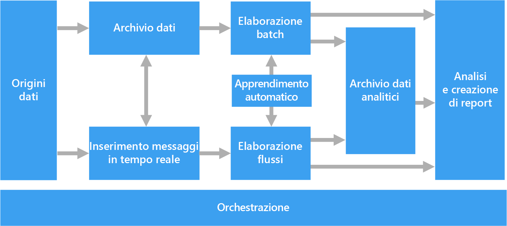
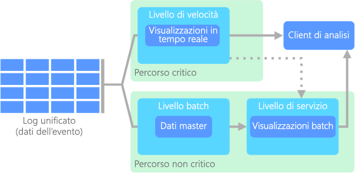
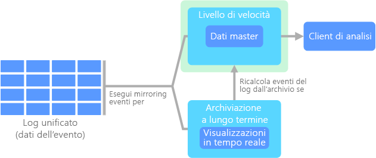
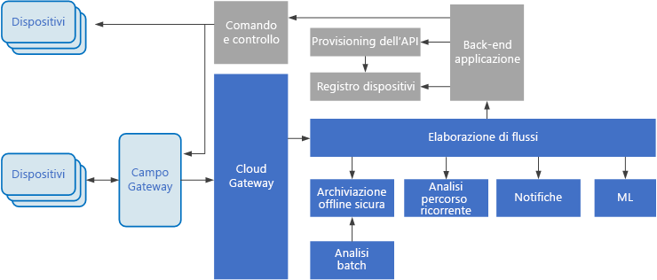

# Architetture per Big Data

Un'architettura per Big Data è progettata per gestire l'inserimento, l'elaborazione e l'analisi di dati troppo grandi o complessi per i sistemi di database tradizionali. Il criterio adottato dalle organizzazioni per individuare la soglia oltre la quale è opportuno preferire soluzioni per Big Data varia a seconda delle capacità degli utenti e degli strumenti a disposizione. Può trattarsi di una quantità di dati dell'ordine di migliaia di gigabyte, ma anche di centinaia di terabyte. Con lo sviluppo di strumenti sempre più avanzati per la gestione di set di Big Data, anche il significato di Big Data si è evoluto. Il termine viene sempre più usato per fare riferimento al valore che è possibile estrarre dai set di dati tramite l'analisi avanzata, anziché esclusivamente alle dimensioni dei dati, anche se in questi casi tendono a essere molto grandi.

Nel corso degli anni, il panorama dei dati ha subito varie trasformazioni. Il concetto di ciò che è possibile fare, o si prevede di poter fare, è cambiato. I costi di archiviazione sono diminuiti notevolmente, mentre i mezzi disponibili per la raccolta dei dati sono in continua espansione. Alcuni dati arrivano a un ritmo veloce, sempre pronti per essere raccolti e osservati. Altri arrivano invece a un ritmo più lento, ma in blocchi di dimensioni molto grandi, spesso sotto forma di dati cronologici relativi a decenni. Può quindi capitare di dover affrontare un problema che richiede una soluzione di analisi avanzata o di apprendimento automatico. Queste sono le sfide che tentano di risolvere le architetture per Big Data.

Le soluzioni per i Big Data implicano in genere uno o più dei seguenti tipi di carico di lavoro:

- L'elaborazione batch di origini di Big Data inattivi.
- L'elaborazione in tempo reale di Big Data in movimento.
- L'esplorazione interattiva di Big Data.
- L'analisi predittiva e il Machine Learning.

Prendere in considerazione l'uso di architetture per Big Data quando è necessario:

- Archiviare ed elaborare i dati in volumi troppo grandi per un database tradizionale.
- Trasformare i dati non strutturati per consentire l'analisi e il reporting.
- Acquisire, elaborare e analizzare i flussi di dati non associati in tempo reale o con una latenza bassa.

## Componenti di un'architettura per Big Data

Il diagramma seguente mostra i componenti logici relativi a un'architettura per Big Data. È comunque possibile che le singole soluzioni non contengano tutti gli elementi illustrati nel diagramma.

La maggior parte delle architetture per i Big Data include alcuni o tutti i seguenti componenti:

- **Origini dati**. Il punto di partenza di tutte le soluzioni per Big Data è costituito da una o più origini dati. Tra gli esempi sono inclusi:

  - Archivi dati di applicazioni, ad esempio database relazionali.
  - File statici generati dalle applicazioni, ad esempio file di log di server Web.
  - Origini dati in tempo reale, ad esempio dispositivi IoT.

- **Archiviazione dei dati**. I dati per le operazioni di elaborazione batch vengono in genere inseriti in un archivio di file distribuito che può contenere volumi elevati di file di grandi dimensioni in vari formati. Questo tipo di archivio viene spesso chiamato *data lake*. Alcune opzioni per l'implementazione di questo tipo di archiviazione sono Azure Data Lake Store o i contenitori BLOB in Archiviazione di Azure.

- **Elaborazione batch**. Poiché i set di dati hanno dimensioni considerevoli, una soluzione per Big Data deve spesso elaborare i file di dati mediante processi batch con esecuzione prolungata per filtrare, aggregare e preparare in altro modo i dati per l'analisi. In genere questi processi prevedono la lettura dei file di origine, la relativa elaborazione e la scrittura dell'output in nuovi file. Le opzioni includono l'esecuzione di processi U-SQL in Azure Data Lake Analytics, l'utilizzo di Hive, Pig o di processi MapReduce personalizzati in un cluster HDInsight Hadoop o l'utilizzo di programmi Java, Scala o Python in un cluster HDInsight Spark.

- **Inserimento di messaggi in tempo reale**. Se la soluzione include origini in tempo reale, l'architettura deve includere un modo per acquisire e archiviare i messaggi in tempo reale per l'elaborazione del flusso. Potrebbe trattarsi di un archivio dati semplice in cui i messaggi in ingresso vengono rilasciati in una cartella per l'elaborazione. Tuttavia, molte soluzioni richiedono che un archivio di inserimento dei messaggi funga da buffer per i messaggi e supporti l'elaborazione scale-out, il recapito affidabile e altri tipi di semantica di accodamento dei messaggi. Questa parte dell'architettura per l'elaborazione del flusso è spesso definita memorizzazione nel buffer del flusso. Le opzioni includono Hub eventi di Azure, l'hub IoT di Azure e Kafka.

- **Elaborazione del flusso**. Dopo avere acquisito i messaggi in tempo reale, la soluzione deve elaborarli filtrando, aggregando e preparando in altro modo i dati per l'analisi. I dati del flusso elaborati vengono quindi scritti in un sink di output. Analisi di flusso di Azure offre un servizio di elaborazione del flusso gestito basato su query SQL in esecuzione perenne che operano su flussi non associati. È possibile anche usare tecnologie di streaming open source di Apache, come Storm e Spark Streaming in un cluster HDInsight.

- **Archivio dati analitici**. Numerose soluzioni per Big Data preparano i dati per l'analisi e quindi servono i dati elaborati in un formato strutturato su cui è possibile eseguire query con strumenti analitici. L'archivio dati analitici usato per rispondere a queste query può essere un data warehouse relazionale in stile Kimball, come nella maggior parte delle soluzioni di business intelligence (BI) tradizionali. In alternativa, i dati possono essere presentati tramite una tecnologia NoSQL a bassa latenza come HBase o un database Hive interattivo che fornisce un'astrazione di metadati sui file di dati nell'archivio dati distribuito. Azure SQL Data Warehouse fornisce un servizio gestito per il data warehousing su larga scala basato su cloud. HDInsight supporta Interactive Hive, HBase e Spark SQL, che possono anche essere usati per fornire dati per l'analisi.

- **Analisi e creazione di report**. L'obiettivo della maggior parte delle soluzioni per Big Data è fornire informazioni dettagliate sui dati tramite strumenti di analisi e report. Per consentire agli utenti di analizzare i dati, l'architettura può includere un livello di modellazione dei dati, ad esempio un cubo OLAP multidimensionale o un modello di dati tabulari in Azure Analysis Services. Potrebbe inoltre supportare la business intelligence in modalità self-service, usando le tecnologie di modellazione e visualizzazione in Microsoft Power BI o Microsoft Excel. L'analisi e il reporting possono anche assumere la forma di esplorazione interattiva dei dati da parte di data scientist o analisti di dati. Per questi scenari, molti servizi di Azure supportano notebook analitici come Jupyter, consentendo a questi utenti di sfruttare le proprie competenze esistenti con Python o R. Per l'esplorazione di dati su larga scala, è possibile usare Microsoft R Server, sia autonomo che con Spark.

- **Orchestrazione**. La maggior parte delle soluzioni per Big Data consiste in operazioni ripetute di elaborazione dei dati, incapsulate in flussi di lavoro, che trasformano i dati di origine, spostano i dati tra più origini e sink, caricano i dati elaborati in un archivio dati analitico o li inseriscono direttamente in un report o in un dashboard. Per automatizzare questi flussi di lavoro, è possibile usare una tecnologia di orchestrazione come Azure Data Factory o Apache Oozie e Sqoop.

## Architettura lambda

Quando si lavora con set di dati di dimensioni molto grandi, può essere necessaria una notevole quantità di tempo per eseguire le query adatte ai requisiti dei client. Le query di questo tipo non possono essere eseguite in tempo reale e spesso richiedono algoritmi, come [MapReduce](https://en.wikipedia.org/wiki/MapReduce), che operano in parallelo sull'intero set di dati. I risultati vengono quindi archiviati separatamente rispetto ai dati non elaborati e usati per ulteriori query.

Uno svantaggio di questo approccio è dato dalla latenza. Se l'elaborazione richiede alcune ore, è possibile che una query restituisca risultati che risalgono a diverse ore prima. L'ideale sarebbe ottenere alcuni risultati in tempo reale, anche se con una perdita di precisione, e combinarli con quelli provenienti dall'analisi in batch.

L'**architettura lambda**, proposta per la prima volta da Nathan Marz, risolve questo problema creando due percorsi per il flusso di dati. Tutti i dati in ingresso nel sistema passano attraverso questi due percorsi:

- Un **livello di elaborazione batch** (percorso ad accesso sporadico) archivia tutti i dati in ingresso nella forma non elaborata ed esegue l'elaborazione batch sui dati. Il risultato di questa elaborazione viene archiviato come **visualizzazione batch**.

- Un **livello di elaborazione rapida** (percorso ad accesso frequente) analizza i dati in tempo reale. Questo livello è stato progettato per offrire una bassa latenza, a scapito della precisione.

Il livello di elaborazione batch confluisce in un **livello di gestione** che indicizza la visualizzazione batch per un'elaborazione efficiente delle query. Il livello di elaborazione rapida aggiorna in modo incrementale il livello di gestione in base ai dati più recenti.

I dati che confluiscono nel percorso ad accesso frequente sono vincolati dai requisiti di latenza imposti dal livello di elaborazione rapida, in modo da essere elaborati il più velocemente possibile. È spesso necessario raggiungere un compromesso tra il livello di precisione dei dati e la velocità con cui risultano disponibili. Si consideri ad esempio uno scenario di Internet delle cose in cui un numero elevato di sensori di temperatura inviano dati di telemetria. Il livello di elaborazione rapida può essere usato per elaborare i dati in ingresso in una finestra temporale scorrevole.

Diversamente da questo flusso, i dati che confluiscono nel percorso ad accesso sporadico non sono soggetti agli stessi requisiti di bassa latenza. In questo modo si può eseguire anche un'elaborazione più precisa di grandi set di dati, che può però richiedere molto tempo.

I percorsi ad accesso frequente e sporadico convergono infine nell'applicazione client usata per l'analisi. Se il client deve visualizzare dati in tempo reale, e quindi immediatamente disponibili anche se meno precisi, acquisirà i risultati dal percorso ad accesso frequente. In caso contrario, selezionerà i risultati dal percorso ad accesso sporadico per visualizzare dati più precisi ma meno immediati. In altre parole, il percorso ad accesso frequente contiene dati per un intervallo di tempo relativamente breve, dopo il quale i risultati possono essere aggiornati con dati più precisi provenienti dal percorso ad accesso sporadico.

I dati non elaborati archiviati al livello di elaborazione batch non sono modificabili. I dati in ingresso vengono sempre aggiunti a quelli già esistenti, che non vengono mai sovrascritti. Le eventuali modifiche apportate al valore di un particolare dato vengono archiviate come un nuovo record di evento con timestamp. Ciò consente di eseguire in qualsiasi momento il ricalcolo sulla cronologia dei dati raccolti. La possibilità di ricalcolare la visualizzazione batch rispetto ai dati originali non elaborati è importante perché consente di creare nuove visualizzazioni di pari passo con l'evoluzione del sistema.

## Architettura kappa

Uno svantaggio dell'architettura lambda è dato dalla sua complessità. La logica di elaborazione viene applicata a due percorsi diversi, ad accesso frequente e sporadico, usando framework distinti. La presenza di due percorsi ha l'effetto di duplicare la logica di calcolo e di rendere più complessa la gestione dell'architettura.

In alternativa all'architettura lamba, Jay Kreps ha proposto l'**architettura kappa**, Prevede gli stessi obiettivi di base dell'architettura lambda, con una distinzione importante: il flusso dei dati transita tramite un singolo percorso, mediante un sistema di elaborazione dei flussi.

Questa architettura presenta alcune analogie con il livello di elaborazione batch dell'architettura lambda, in quanto i dati degli eventi non sono modificabili e vengono raccolti per intero, anziché in subset. I dati vengono inseriti come flusso di eventi in un unico log distribuito a tolleranza di errore. Gli eventi vengono ordinati e lo stato corrente di un evento viene modificato solo in caso di accodamento di un nuovo evento. In modo analogo al livello di elaborazione rapida dell'architettura lambda, l'intera elaborazione degli eventi viene eseguita nel flusso di input e salvata in modo persistente come visualizzazione in tempo reale.

Se è necessario ricalcolare l'intero set di dati, come avviene nel livello di elaborazione batch dell'architettura lambda, è sufficiente riprodurre il flusso. Per completare questo calcolo in modo rapido viene normalmente usato il parallelismo.

## Internet delle cose

Da un punto di vista strettamente pratico, per Internet delle cose si intende qualsiasi dispositivo connesso a Internet, ovvero un PC, uno smartphone, uno smartwatch, un termostato intelligente, un frigorifero smart, un'automobile connessa, un monitor cardiaco impiantabile e qualsiasi altro oggetto che si connette a Internet per inviare o ricevere dati. Il numero di dispositivi connessi cresce di giorno in giorno, di pari passo con la quantità di dati che questi dispositivi raccolgono. In molti casi i dati vengono raccolti in ambienti estremamente limitati, talvolta con una latenza molto elevata. In altri casi, tuttavia, i dati vengono inviati da ambienti a bassa latenza per migliaia o milioni di dispositivi e richiedono quindi un'architettura in grado di inserirli rapidamente ed elaborarli di conseguenza. Per gestire questi vincoli e requisiti specifici è pertanto necessaria un'adeguata pianificazione.

Le architetture guidate dagli eventi sono centrali per le soluzioni IoT. Il diagramma seguente mostra una possibile architettura logica per IoT. Il diagramma evidenzia i componenti del flusso di eventi dell'architettura.

Il **gateway cloud** inserisce gli eventi di dispositivo in corrispondenza dei limiti del cloud, usando un sistema di messaggistica a bassa latenza affidabile.

I dispositivi possono inviare eventi direttamente al gateway cloud oppure attraverso un **gateway sul campo**. Un gateway sul campo è un dispositivo o un prodotto software specializzato, in genere collocato insieme ai dispositivi, che riceve gli eventi e li inoltra al gateway cloud. Il gateway sul campo può anche pre-elaborare gli eventi di dispositivo non elaborati, eseguendo funzioni come l'applicazione di filtri, l'aggregazione o la trasformazione del protocollo.

Dopo l'inserimento, gli eventi passano da uno o più **elaboratori di flussi**, che possono instradare i dati (ad esempio all'archiviazione) o eseguire analisi e altri tipi di elaborazione.

Di seguito vengono indicati alcuni tipi comuni di elaborazione. Naturalmente, l'elenco non è esaustivo.

- Scrittura dei dati di evento nell'archiviazione offline sicura per l'analisi batch.

- Analisi Percorso critico, che analizza il flusso di eventi (quasi) in tempo reale, per rilevare le anomalie, riconoscere i modelli in base a intervalli di tempo ricorrenti o attivare avvisi quando si verifica una condizione specifica nel flusso.

- Gestione di tipi speciali di messaggi non di telemetria dai dispositivi, come le notifiche e gli allarmi.

- Machine Learning.

Le caselle in grigio mostrano i componenti di un sistema IoT non direttamente correlati al flusso di eventi, ma che sono stati inclusi per completezza.

- Il **registro dei dispositivi** è un database dei dispositivi di cui è stato effettuato il provisioning e include gli ID dispositivo e in genere i metadati dei dispositivi, come la posizione.

- L'**API di provisioning** è un'interfaccia esterna comune per il provisioning e la registrazione di nuovi dispositivi.

- Alcune soluzioni IoT consentono l'invio di **messaggi di comando e controllo** ai dispositivi.

Servizi di Azure pertinenti:

- [Hub IoT Azure](https://azure.microsoft.com/services/iot-hub/)
- [Hub eventi di Azure](https://azure.microsoft.com/services/event-hubs/)
- [Azure Stream Analytics](https://azure.microsoft.com/services/stream-analytics/)  

Per altre informazioni sulle soluzioni di Internet delle cose in Azure, vedere [Azure IoT reference architecture](https://azure.microsoft.com/updates/microsoft-azure-iot-reference-architecture-available/) (Architettura di riferimento di Azure IoT).
