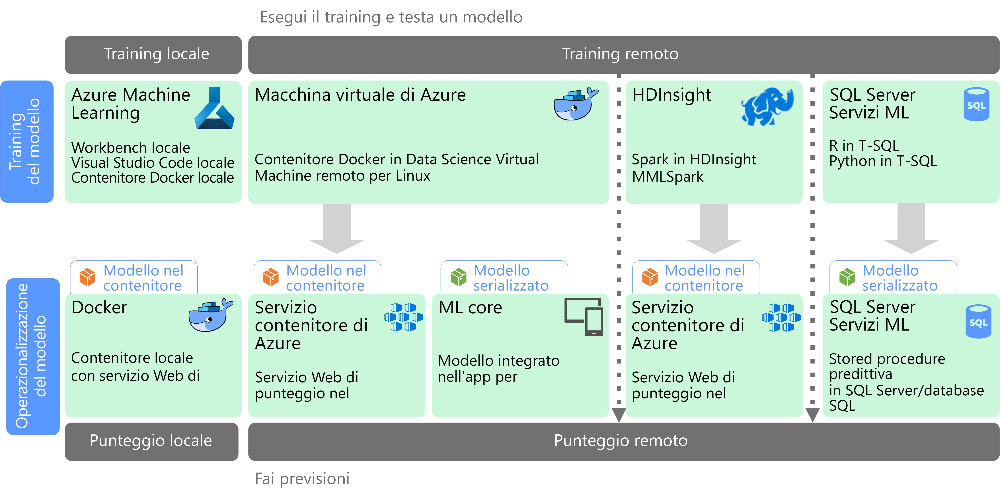

# Apprendimento automatico su larga scala

L'apprendimento automatico è una tecnica usata per eseguire il training di modelli predittivi in base ad algoritmi matematici. L'apprendimento automatico analizza le relazioni tra i campi dati per eseguire la stima di valori sconosciuti.

La creazione e la distribuzione di un modello di apprendimento automatico è un processo iterativo:

* I data scientist analizzano i dati di origine per determinare le relazioni tra *funzionalità* ed *etichette* stimate.
* I data scientist eseguono il training e la convalida di modelli in base ad algoritmi appropriati per individuare il modello ottimale per la stima.
* Il modello ottimale viene distribuito nell'ambiente di produzione, come un servizio Web o un'altra funzione incapsulata.
* Man mano che vengono raccolti nuovi dati, il modello viene periodicamente sottoposto a training per migliorarne l'efficacia.

L'apprendimento automatico su larga scala consente di risolvere due diversi problemi di scalabilità. Il primo riguarda l'esecuzione del training di un modello con set di dati di grandi dimensioni che richiedono funzionalità di scalabilità orizzontale di un cluster per il training. Il secondo riguarda la necessità di rendere operativo il modello appreso in modo che possa ridimensionarsi per soddisfare le esigenze delle applicazioni che lo utilizzano. In genere, questo risultato si ottiene distribuendo le funzionalità predittive come un servizio Web che è possibile scalare orizzontalmente.

L'apprendimento automatico su larga scala offre il vantaggio di produrre funzionalità predittive potenti, perché i modelli migliori si ottengono in genere da una quantità maggiore di dati. Dopo averne eseguito il training, il modello può essere distribuito come servizio Web con scalabilità orizzontale, senza stato e ad elevate prestazioni. 

## Preparazione ed esecuzione del training del modello

Durante la fase di preparazione ed esecuzione del training del modello, i data scientist esplorano i dati in modo interattivo tramite linguaggi come Python ed R per:

* Estrarre esempi da archivi dati di volume elevato.
* Trovare e gestire outlier, duplicati e valori mancanti per pulire i dati.
* Determinare correlazioni e relazioni nei dati tramite analisi statistica e visualizzazione.
* Generare nuove funzionalità calcolate che consentono di migliorare la predittività delle relazioni statistiche.
* Eseguire il training di modelli di apprendimento automatico in base ad algoritmi predittivi.
* Convalidare i modelli sottoposti a training usando i dati rifiutati durante il training.

Per supportare questa fase di analisi interattiva e modellazione, la piattaforma di dati deve consentire ai data scientist di esplorare i dati tramite vari strumenti. Inoltre, il training di un modello di apprendimento automatico complesso può richiedere numerose attività di elaborazione di volumi elevati di dati, sono quindi necessarie risorse sufficienti per la scalabilità orizzontale del training del modello.

## Distribuzione e utilizzo del modello

Quando un modello è pronto per la distribuzione, può essere incapsulato come servizio Web e distribuito nel cloud, a un dispositivo periferico o all'interno di un ambiente aziendale per l'esecuzione dell'apprendimento automatico. Questo processo di distribuzione viene definito operazionalizzazione.

## Problematiche

All'apprendimento automatico su larga scala sono associate alcune problematiche:

- Sono in genere necessari molti dati per eseguire il training di un modello, in particolare per modelli di apprendimento avanzato.
- È necessario preparare questi set di Big Data prima di poter iniziare il training del modello.
- La fase di training del modello deve accedere gli archivi di Big Data. In genere, il training del modello viene eseguito usando lo stesso cluster di Big Data, ad esempio Spark, che viene usato per la preparazione dei dati. 
- Per gli scenari di apprendimento avanzato, è necessario un cluster in grado di fornire scalabilità orizzontale in CPU e costituito da nodi abilitati per la GPU.

## Apprendimento automatico su larga scala in Azure

Prima di decidere quali servizi di apprendimento automatico usare per il training e l'operazionalizzazione, verificare se è necessario eseguire il training di un modello per intero o se un modello predefinito può soddisfare i requisiti richiesti. In molti casi, per usare un modello predefinito è sufficiente chiamare un servizio Web o usare una libreria di apprendimento automatico per caricare un modello esistente. Alcune opzioni includono: 

- Usare i servizi Web forniti da Servizi cognitivi Microsoft.
- Usare i modelli di rete neurale già sottoposti a training forniti da Cognitive Toolkit.
- Incorporare i modelli serializzati forniti da Core ML per app iOS. 

Se un modello predefinito non è adatto ai dati o allo scenario, le opzioni in Azure includono Azure Machine Learning, HDInsight con Spark MLlib e MMLSpark, Azure Databricks, Cognitive Toolkit e SQL Machine Learning Services. Se si decide di usare un modello personalizzato, è necessario progettare una pipeline che includa il training del modello e l'operazionalizzazione. 

Per un elenco di scelte di tecnologia per l'apprendimento automatico in Azure, vedere gli argomenti seguenti:

- [Scelta di una tecnologia di servizi cognitivi](../technology-choices/cognitive-services.md)
- [Scelta di una tecnologia di apprendimento automatico](../technology-choices/data-science-and-machine-learning.md)
- [Scelta di una tecnologia di elaborazione del linguaggio naturale](../technology-choices/natural-language-processing.md)
