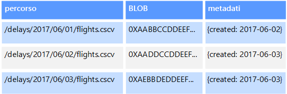

# Dati non relazionali e NoSQL

Un *database non relazionale* è un database che non usa lo schema tabulare di righe e colonne presente nella maggior parte dei sistemi di database tradizionali. I database non relazionali usano invece un modello di archiviazione ottimizzato per i requisiti specifici del tipo di dati da archiviare. I dati, ad esempio, possono essere archiviati come semplici coppie chiave/valore, come documenti JSON o sotto forma di un grafo composto da bordi e vertici. 

Il comune denominatore di tutti questi archivi dati è che non un usano un [modello relazionale](../relational-data/index.md). Tendono invece a essere più specifici in merito al tipo di dati supportato e alle modalità di esecuzione delle query sui dati. Gli archivi dati di serie temporali, ad esempio, sono ottimizzati per query su sequenze di dati basate sul tempo, mentre gli archivi dati a grafo sono ottimizzati per l'esplorazione di relazioni ponderate tra entità. Nessuno dei due formati offrirebbe una generalizzazione corretta per attività di gestione di dati transazioni. 

Il termine *NoSQL* fa riferimento agli archivi dati che non usano SQL per le query ma usano altri costrutti e linguaggi di programmazione per eseguire query sui dati. In pratica, "NoSQL" significa "database non relazionale", anche se molti di questi database supportano query compatibili con SQL. La strategia per l'esecuzione di query sottostanti è in genere molto diversa dal modo in cui un tradizionale sistema RDBMS eseguirebbe la stessa query SQL.

Le sezioni seguenti descrivono le principali categorie di database non relazionali o NoSQL.

## Archivi dati a documento
Un archivio dati a documento gestisce un set di campi stringa denominati e di valori di dati oggetto in un'entità definita *documento*. Questi archivi dati archiviano in genere i dati sotto forma di documenti JSON. Ogni valore di campo può essere un elemento scalare, ad esempio un numero o un elemento composto, come un elenco o una raccolta di tipo padre-figlio. I dati nei campi di un documento possono essere codificati in diversi modi, tra cui XML, YAML, JSON, BSON o anche archiviati come testo normale. I campi nei documenti sono esposti al sistema di gestione dell'archiviazione, consentendo a un'applicazione di eseguire query e filtrare i dati usando i valori in questi campi.  

In genere, un documento contiene tutti i dati di un'entità. Gli elementi che costituiscono un'entità sono specifici dell'applicazione. Un'entità ad esempio può contenere i dettagli di un cliente, un ordine o una combinazione di entrambi. Un singolo documento può contenere informazioni che potrebbero essere distribuite in varie tabelle relazionali in un sistema di gestione di database relazionali. Un archivio di documenti non richiede che tutti i documenti abbiano la stessa struttura. Questo approccio in formato libero offre una notevole flessibilità. Le applicazioni, ad esempio, possono archiviare dati diversi nei documenti in base ai cambiamenti dei requisiti aziendali.  

  

L'applicazione può recuperare i documenti usando la chiave del documento. Questo è un identificatore univoco del documento di cui viene spesso eseguito l'hashing, per poter distribuire i dati in modo uniforme. Alcuni database di documenti creano automaticamente la chiave del documento. Altri consentono di specificare un attributo del documento da usare come chiave. L'applicazione può anche eseguire una query sui documenti in base al valore di uno o più campi. Alcuni database di documenti supportano l'indicizzazione per facilitare la ricerca rapida di documenti in base a uno o più campi indicizzati.  

Molti database di documenti supportano gli aggiornamenti sul posto, consentendo a un'applicazione modificare i valori di campi specifici in un documento senza riscrivere l'intero documento. Le operazioni di lettura e scrittura in più campi in un singolo documento sono in genere atomiche.

Servizio di Azure pertinente:  

- [Azure Cosmos DB](https://azure.microsoft.com/services/cosmos-db/)

## Archivi dati a colonne
Un archivio dati a colonne consente di organizzare i dati in righe e colonne. Nella sua forma più semplice, un archivio dati a colonne può risultare molto simile a un database relazionale, almeno a livello concettuale. L'efficacia di un database a colonne sta nell'approccio denormalizzato per strutturare i dati di tipo sparse, che hanno origine da un approccio all'archiviazione dei dati orientato alle colonne.  

È possibile considerare un archivio dati a colonne come contenente dati tabulari con righe e colonne, ma le colonne sono suddivise in gruppi, noti come famiglie di colonne. Ogni famiglia di colonne contiene un set di colonne logicamente correlate tra loro e, in genere, recuperate o modificate come un'unità. Altri dati di cui si accede separatamente possono essere archiviati in famiglie di colonne separate. All'interno di una famiglia di colonne, è possibile aggiungere nuove colonne in modo dinamico e le righe possono essere di tipo sparse, vale a dire una riga non deve necessariamente avere un valore per ogni colonna. 

Nel diagramma seguente viene illustrato un esempio con due famiglie di colonne, `Identity` e `Contact Info`. I dati per una singola entità contengono la stessa chiave di riga in ogni famiglia di colonne. Questa struttura, in cui le righe per un determinato oggetto in una famiglia di colonne possono variare in modo dinamico, rappresenta un vantaggio importante dell'approccio a colonne, rendendo questa forma di archivio dati molto adatta per l'archiviazione di dati con schemi variabili.

A differenza di un archivio chiave/valore o un di database a documento, la maggior parte dei database a colonne archivia fisicamente i dati in ordine di chiave, anziché calcolando un hash. La chiave di riga viene considerata l'indice primario e consente l'accesso basato su chiave tramite una chiave specifica o un intervallo di chiavi. Alcune implementazioni consentono di creare indici secondari su colonne specifiche in una famiglia di colonne. Gli indici secondari consentono di recuperare i dati in base al valore delle colonne, anziché della chiave di riga.

Su un disco, tutte le colonne all'interno di una famiglia di colonne vengono archiviate nello stesso file, con un determinato numero di righe in ogni file. Con set di dati di grandi dimensioni, questo approccio consente un miglioramento delle prestazioni riducendo la quantità di dati che devono essere letti dal disco quando vengono eseguite query solo su un numero ridotto di colonne. 

Le operazioni di lettura e scrittura per una riga sono in genere atomiche con una singola famiglia di colonne, anche se alcune implementazioni offrono l'atomicità sull'intera riga, con estensione su più famiglie di colonne.

Servizio di Azure pertinente:  

- [HBase in HDInsight](/azure/hdinsight/hdinsight-hbase-overview)

## Archivi dati chiave/valore
Un archivio chiave/valore è essenzialmente una tabella hash di grandi dimensioni. Si associa ciascun valore dei dati con una chiave univoca e l'archivio chiave/valore usa questa chiave per archiviare i dati usando una funzione di hash appropriata. La funzione di hash è selezionata per fornire una distribuzione uniforme delle chiavi con hash nell'archiviazione dei dati.

La maggior parte degli archivi chiave/valore supporta solo semplici operazioni di query, inserimento ed eliminazione. Per modificare parzialmente o completamente un valore, un'applicazione deve sovrascrivere i dati esistenti dell'intero valore. Nella maggior parte delle implementazioni la lettura o scrittura di un singolo valore è un'operazione atomica. Se il valore è di grandi dimensioni, la scrittura può richiedere del tempo.

Un'applicazione può archiviare dati arbitrari come un set di valori, anche se alcuni archivi chiave/valore prevedono limiti per la dimensione massima dei valori. I valori archiviati sono opachi per il software del sistema di archiviazione. Le informazioni sullo schema devono essere fornite e interpretate dall'applicazione. In pratica, i valori sono oggetti BLOB e l'archivio chiave/valore semplicemente recupera o archivia il valore in base alla chiave.

Gli archivi chiave/valore sono altamente ottimizzati per le applicazioni che eseguono ricerche semplici usando il valore della chiave o un intervallo di chiavi, ma sono meno adatti per i sistemi che devono eseguire query sui dati presenti in tabelle chiave/valore diverse, ad esempio per l'unione di dati derivanti da più tabelle. 

Gli archivi chiave/valore, inoltre, non sono ottimizzati per gli scenari in cui l'esecuzione di query o l'applicazione di filtri in base a valori non chiave è importante, a differenza dell'esecuzione di ricerche basate solo su chiavi. Con un database relazionale, ad esempio, è possibile trovare un record usando una clausola WHERE per filtrare le colonne non chiave, ma gli archivi chiave/valore in genere non dispongono di questo tipo di funzionalità di ricerca dei valori o, se ne dispongono, richiedono una lenta scansione di tutti i valori.

Un singolo archivio chiave/valore può essere estremamente scalabile in quanto l'archivio dati può distribuire facilmente i dati tra più nodi in computer separati.

Servizi di Azure pertinenti:  
- [API Tabelle di Azure Cosmos DB](/azure/cosmos-db/table-introduction)  
- [Cache Redis di Azure](https://azure.microsoft.com/services/cache/)  
- [Archiviazione tabelle di Azure](https://azure.microsoft.com/services/storage/tables/)

## Archivi dati a grafo
Un archivio dati a grafo archivia due tipi di informazioni: nodi e bordi. I nodi rappresentano le entità e i bordi specificano le relazioni tra queste entità. I nodi e bordi possono avere proprietà che forniscono informazioni su tale nodo o bordo, analogamente alle colonne in una tabella. I bordi possono avere anche una direzione che indica la natura della relazione.  

Lo scopo di un archivio dati a grafo consiste nel consentire a un'applicazione di eseguire in modo efficiente le query che passano attraverso la rete dei nodi e dei bordi e di analizzare le relazioni tra le entità. Il diagramma seguente illustra un archivio dati del personale di un'organizzazione strutturato come un grafo. Le entità sono i dipendenti e i reparti e i bordi indicano le relazioni gerarchiche e il reparto in cui operano i dipendenti. In questo grafo le frecce sui bordi indicano la direzione delle relazioni.

Questa struttura rende molto semplice eseguire una query, ad esempio "Trova tutti i dipendenti diretti o indiretti di Sara" o "Chi lavora nello stesso reparto di Giorgio?" Per i grafi di grandi dimensioni con un numero elevato di entità e relazioni, è possibile eseguire analisi complesse molto rapidamente. Molti database di grafi forniscono un linguaggio di query che è possibile usare per esaminare in modo efficiente una rete di relazioni.  

Servizio di Azure pertinente:  
- [API Graph di Azure Cosmos DB](/azure/cosmos-db/graph-introduction)  

## Archivi dati di serie temporali
I dati di serie temporali costituiscono un set di valori organizzati in base al tempo e gli archivi dati di serie temporali sono ottimizzati per questo tipo di dati. Gli archivi dati di serie temporali devono supportare un numero molto elevato di scritture, poiché raccolgono in genere grandi quantità di dati in tempo reale da un numero elevato di origini. Gli archivi dati di serie temporali sono ottimizzati per l'archiviazione di dati di telemetria. Gli scenari includono sensori IoT o i contatori di applicazioni/sistemi. Gli aggiornamenti sono rari e le eliminazioni vengono spesso eseguite come operazioni di massa.

Anche se i record scritti in un database di serie temporali sono generalmente di dimensioni ridotte, sono spesso un numero elevato e le dimensioni totali dei dati possono aumentare rapidamente. Gli archivi dati di serie temporali gestiscono anche dati non ordinati o arrivati in ritardo, l'indicizzazione automatica di punti dati e le ottimizzazioni per query descritte in termini di finestre temporali. Quest'ultima funzionalità consente di eseguire rapidamente query su milioni di punti dati e molteplici flussi di dati, in modo da supportare visualizzazioni di serie temporali, che costituiscono uno dei modi principali in cui vengono usati i dati. 

Per altre informazioni, vedere [Soluzioni per serie temporali](../scenarios/time-series.md)

Servizio di Azure pertinente:  
- [Azure Time Series Insights](https://azure.microsoft.com/services/time-series-insights/)  
- [OpenTSDB con HBase in HDInsight](/azure/hdinsight/hdinsight-hbase-overview)

## Archivi dati a oggetti
Gli archivi dati a oggetti sono ottimizzati per l'archiviazione e il recupero di BLOB o oggetti binari di grandi dimensioni come immagini, file di testo, flussi audio e video, documenti e oggetti dati di applicazioni di grandi dimensioni, oltre a immagini disco di macchine virtuali. Un oggetto è costituito dai dati archiviati, da alcuni metadati e da un ID univoco per l'accesso all'oggetto. Gli archivi a oggetti sono progettati per supportare file singolarmente molto grandi, nonché per fornire uno spazio di archiviazione totale molto grande per la gestione di tutti i file.  

Alcuni archivi dati a oggetti replicano un determinato BLOB su più nodi di server, in modo da consentire letture parallele veloci. Questo consente a propria volta di migliorare le prestazioni delle query sui dati contenuti in file di grandi dimensioni, poiché più processi, generalmente in esecuzione su server diversi, possono eseguire contemporaneamente una query su un file di dati di grandi dimensioni.

La condivisione di file di rete costituisce un caso speciale di archivi dati a oggetti. L'uso di condivisioni di file consente di accedere ai file in rete usando protocolli di rete standard come Server Message Block (SMB). Predisponendo la sicurezza e i meccanismi di controllo di accesso simultaneo appropriati, la condivisione dei dati con questo metodo consente ai servizi distribuiti di offrire un accesso ai dati estremamente scalabile per l'esecuzione di operazioni di base di basso livello come semplici richieste di lettura e scrittura.

Servizio di Azure pertinente:   

- [Archivio BLOB di Azure](https://azure.microsoft.com/services/storage/blobs/)  
- [Archivio Data Lake di Azure](https://azure.microsoft.com/services/data-lake-store/)  
- [Archiviazione file di Azure](https://azure.microsoft.com/services/storage/files/)  

## Archivi dati con indici esterni

Gli archivi dati con indici esterni offrono la possibilità di cercare informazioni contenute in altri servizi e archivi dati. Un indice esterno svolge la funzione di indice secondario per qualsiasi archivio dati e può essere usato per indicizzare grandi volumi di dati e fornire un accesso quasi in tempo reale agli indici. 

Un esempio può essere costituito da file di testo archiviati in un file system. La ricerca di un file in base al relativo percorso è un'operazione abbastanza veloce, mentre la ricerca di un file in base al contenuto richiederebbe una scansione di tutti i file, che è un processo piuttosto lento. Con un indice esterno è possibile creare indici di ricerca secondari e quindi trovare rapidamente il percorso dei file che corrispondono ai criteri specificati. Un indice esterno può essere usato anche con archivi chiave/valore che indicizzano solo in base alla chiave. È possibile compilare un indice secondario in base ai valori dei dati e cercare rapidamente la chiave che identifica in modo univoco ogni elemento corrispondente. 

Gli indici vengono creati eseguendo un processo di indicizzazione. Questa operazione può essere effettuata usando un modello pull generato dall'archivio dati o tramite un modello push avviato dal codice dell'applicazione. Gli indici possono essere multidimensionali e possono supportare ricerche di testo libero su grandi volumi di dati di testo. 

Gli archivi dati con indici esterni vengono spesso usati per supportare la ricerca full-text e basata sul Web. In questi casi, la ricerca può essere esatta o fuzzy. Una ricerca fuzzy individua documenti che corrispondono a un set di termini e calcola il grado di corrispondenza. Alcuni indici esterni supportano anche l'analisi linguistica, che può restituire corrispondenze basate su sinonimi, espansioni di genere (ad esempio, la corrispondenza tra "cani" e "animali") e stemming (ad esempio, la ricerca di "avere" cerca anche corrispondenze di "ha" e "avuto"). 

Servizio di Azure pertinente:  

- [Ricerca di Azure](https://azure.microsoft.com/services/search/)

## Requisiti tipici
Gli archivi dati relazionali usano spesso un'architettura di archiviazione diversa da quella usata dai database relazionali. In particolare, tendono a non avere uno schema fisso e, in genere, non supportano transazioni o limitano l'ambito delle transazioni e non includono indici secondari per motivi di scalabilità.

Di seguito vengono confrontati i requisiti per ogni tipo di archivi dati non relazionali:

| Requisito | Dati del documento | Dati a colonne | Dati chiave/valore | Dati a grafo | 
| --- | --- | --- | --- | --- | 
| Normalizzazione | Denormalizzati | Denormalizzati | Denormalizzati | Normalizzati | 
| SCHEMA | Schema in lettura | Famiglie di colonne definite durante la scrittura, schema di colonna in lettura | Schema in lettura | Schema in lettura | 
| Coerenza (tra transazioni simultanee) | Coerenza regolabile, garanzie a livello di documento | Garanzie a livello di colonne | Garanzie a livello di chiave | Garanzie a livello di grafo 
| Atomicità (ambito della transazione) | Raccolta | Tabella | Tabella | Grafico | 
| Strategia di blocco | Ottimistica (senza blocchi) | Pessimistico (blocchi di riga) | Ottimistica (ETag) | 
| Modello di accesso | Accesso casuale | Aggregati di dati in pila/non in pila | Accesso casuale | Accesso casuale |
| Indicizzazione | Indici primari e secondari | Indici primari e secondari | Solo indice primario | Indici primari e secondari | 
| Forma dei dati | Documento | Tabulare con famiglie di colonne contenenti colonne | Chiave e valore | Grafo contenente bordi e i vertici | 
| Sparse | Sì | Sì | Sì | No  | 
| In pila (elevato numero di colonne/attributi) | Sì | Sì | No  | No  |  
| Dimensioni dati | Da piccole (KB) a medie (pochi MB) | Da medie (MB) a grandi (pochi GB) | Piccole (KB) | Piccole (KB) | 
| Scalabilità complessiva (max) | Molto grande (PB) | Molto grande (PB) | Molto grande (PB) | Grande (TB) | 

| Requisito | Dati di serie temporali | Dati di oggetti | Dati di indici esterni |
| --- | --- | --- | --- |
| Normalizzazione | Normalizzati | Denormalizzati | Denormalizzati |
| SCHEMA | Schema in lettura | Schema in lettura | Schema in scrittura | 
| Coerenza (tra transazioni simultanee) | N/D | N/D | N/D | 
| Atomicità (ambito della transazione) | N/D | Oggetto | N/D |
| Strategia di blocco | N/D | Pessimistica (blocchi di BLOB) | N/D |
| Modello di accesso | Aggregazione e accesso casuale | Accesso sequenziale | Accesso casuale | 
| Indicizzazione | Indici primari e secondari | Solo indice primario | N/D |
| Forma dei dati | Tabulare | BLOB e metadati | Documento |
| Sparse | No  | N/D | No  | 
| In pila (elevato numero di colonne/attributi) |  No  | Sì | Sì |  
| Dimensioni dati | Piccole (KB) | Da grandi (GB) a molto grandi (TB) | Piccole (KB) |
| Scalabilità complessiva (max) | Grande (pochi TB)  | Molto grande (PB) | Grande (pochi TB) | 

