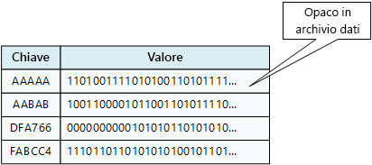

# Dati non relazionali e NoSQLNon-relational data and NoSQL

Un *database non relazionale* è un database che non usa lo schema tabulare di righe e colonne presente nella maggior parte dei sistemi di database tradizionali.A *non-relational database* is a database that does not use the tabular schema of rows and columns found in most traditional database systems. I database non relazionali usano invece un modello di archiviazione ottimizzato per i requisiti specifici del tipo di dati da archiviare.Instead, non-relational databases use a storage model that is optimized for the specific requirements of the type of data being stored. I dati, ad esempio, possono essere archiviati come semplici coppie chiave/valore, come documenti JSON o sotto forma di un grafo composto da bordi e vertici.For example, data may be stored as simple key/value pairs, as JSON documents, or as a graph consisting of edges and vertices. 

Il comune denominatore di tutti questi archivi dati è che non un usano un [modello relazionale](../relational-data/index.md).What all of these data stores have in common is that they don't use a [relational model](../relational-data/index.md). Tendono invece a essere più specifici in merito al tipo di dati supportato e alle modalità di esecuzione delle query sui dati.Also, they tend to be more specific in the type of data they support and how data can be queried. Gli archivi dati di serie temporali, ad esempio, sono ottimizzati per query su sequenze di dati basate sul tempo, mentre gli archivi dati a grafo sono ottimizzati per l'esplorazione di relazioni ponderate tra entità.For example, time series data stores are optimized for queries over time-based sequences of data, while graph data stores are optimized for exploring weighted relationships between entities. Nessuno dei due formati offrirebbe una generalizzazione corretta per attività di gestione di dati transazioni.Neither format would generalize well to the task of managing transactional data. 

Il termine *NoSQL* fa riferimento agli archivi dati che non usano SQL per le query ma usano altri costrutti e linguaggi di programmazione per eseguire query sui dati.The term *NoSQL* refers to data stores that do not use SQL for queries, and instead use other programming languages and constructs to query the data. In pratica, "NoSQL" significa "database non relazionale", anche se molti di questi database supportano query compatibili con SQL.In practice, "NoSQL" means "non-relational database," even though many of these databases do support SQL-compatible queries. La strategia per l'esecuzione di query sottostanti è in genere molto diversa dal modo in cui un tradizionale sistema RDBMS eseguirebbe la stessa query SQL.However, the underlying query execution strategy is usually very different from the way a traditional RDBMS would execute the same SQL query.

Le sezioni seguenti descrivono le principali categorie di database non relazionali o NoSQL.The following sections describe the major categories of non-relational or NoSQL database.

## Archivi dati a documentoDocument data stores
Un archivio dati a documento gestisce un set di campi stringa denominati e di valori di dati oggetto in un'entità definita *documento*.A document data store manages a set of named string fields and object data values in an entity referred to as a *document*. Questi archivi dati archiviano in genere i dati sotto forma di documenti JSON.These data stores typically store data in the form of JSON documents. Ogni valore di campo può essere un elemento scalare, ad esempio un numero o un elemento composto, come un elenco o una raccolta di tipo padre-figlio.Each field value could be a scalar item, such as a number, or a compound element, such as a list or a parent-child collection. I dati nei campi di un documento possono essere codificati in diversi modi, tra cui XML, YAML, JSON, BSON o anche archiviati come testo normale.The data in the fields of a document can be encoded in a variety of ways, including XML, YAML, JSON, BSON, or even stored as plain text. I campi nei documenti sono esposti al sistema di gestione dell'archiviazione, consentendo a un'applicazione di eseguire query e filtrare i dati usando i valori in questi campi.The fields within documents are exposed to the storage management system, enabling an application to query and filter data by using the values in these fields.  

In genere, un documento contiene tutti i dati di un'entità.Typically, a document contains the entire data for an entity. Gli elementi che costituiscono un'entità sono specifici dell'applicazione.What items constitute an entity are application specific. Un'entità ad esempio può contenere i dettagli di un cliente, un ordine o una combinazione di entrambi.For example, an entity could contain the details of a customer, an order, or a combination of both. Un singolo documento può contenere informazioni che potrebbero essere distribuite in varie tabelle relazionali in un sistema di gestione di database relazionali.A single document might contain information that would be spread across several relational tables in a relational database management system (RDBMS). Un archivio di documenti non richiede che tutti i documenti abbiano la stessa struttura.A document store does not require that all documents have the same structure. Questo approccio in formato libero offre una notevole flessibilità.This free-form approach provides a great deal of flexibility. Le applicazioni, ad esempio, possono archiviare dati diversi nei documenti in base ai cambiamenti dei requisiti aziendali.For example, applications can store different data in documents in response to a change in business requirements.  

  

L'applicazione può recuperare i documenti usando la chiave del documento.The application can retrieve documents by using the document key. Questo è un identificatore univoco del documento di cui viene spesso eseguito l'hashing, per poter distribuire i dati in modo uniforme.This is a unique identifier for the document, which is often hashed, to help distribute data evenly. Alcuni database di documenti creano automaticamente la chiave del documento.Some document databases create the document key automatically. Altri consentono di specificare un attributo del documento da usare come chiave.Others enable you to specify an attribute of the document to use as the key. L'applicazione può anche eseguire una query sui documenti in base al valore di uno o più campi.The application can also query documents based on the value of one or more fields. Alcuni database di documenti supportano l'indicizzazione per facilitare la ricerca rapida di documenti in base a uno o più campi indicizzati.Some document databases support indexing to facilitate fast lookup of documents based on one or more indexed fields.  

Molti database di documenti supportano gli aggiornamenti sul posto, consentendo a un'applicazione modificare i valori di campi specifici in un documento senza riscrivere l'intero documento.Many document databases support in-place updates, enabling an application to modify the values of specific fields in a document without rewriting the entire document. Le operazioni di lettura e scrittura in più campi in un singolo documento sono in genere atomiche.Read and write operations over multiple fields in a single document are usually atomic.

Servizio di Azure pertinente:Relevant Azure service:  

- [Azure Cosmos DBAzure Cosmos DB](https://azure.microsoft.com/services/cosmos-db/)

## Archivi dati a colonneColumnar data stores
Un archivio dati a colonne consente di organizzare i dati in righe e colonne.A columnar or column-family data store organizes data into columns and rows. Nella sua forma più semplice, un archivio dati a colonne può risultare molto simile a un database relazionale, almeno a livello concettuale.In its simplest form, a column-family data store can appear very similar to a relational database, at least conceptually. L'efficacia di un database a colonne sta nell'approccio denormalizzato per strutturare i dati di tipo sparse, che hanno origine da un approccio all'archiviazione dei dati orientato alle colonne.The real power of a column-family database lies in its denormalized approach to structuring sparse data, which stems from the column-oriented approach to storing data.  

È possibile considerare un archivio dati a colonne come contenente dati tabulari con righe e colonne, ma le colonne sono suddivise in gruppi, noti come famiglie di colonne.You can think of a column-family data store as holding tabular data with rows and columns, but the columns are divided into groups known as column families. Ogni famiglia di colonne contiene un set di colonne logicamente correlate tra loro e, in genere, recuperate o modificate come un'unità.Each column family holds a set of columns that are logically related and are typically retrieved or manipulated as a unit. Altri dati di cui si accede separatamente possono essere archiviati in famiglie di colonne separate.Other data that is accessed separately can be stored in separate column families. All'interno di una famiglia di colonne, è possibile aggiungere nuove colonne in modo dinamico e le righe possono essere di tipo sparse, vale a dire una riga non deve necessariamente avere un valore per ogni colonna.Within a column family, new columns can be added dynamically, and rows can be sparse (that is, a row doesn't need to have a value for every column). 

Nel diagramma seguente viene illustrato un esempio con due famiglie di colonne, `Identity` e `Contact Info`.The following diagram shows an example with two column families, `Identity` and `Contact Info`. I dati per una singola entità contengono la stessa chiave di riga in ogni famiglia di colonne.The data for a single entity has the same row key in each column family. Questa struttura, in cui le righe per un determinato oggetto in una famiglia di colonne possono variare in modo dinamico, rappresenta un vantaggio importante dell'approccio a colonne, rendendo questa forma di archivio dati molto adatta per l'archiviazione di dati con schemi variabili.This structure, where the rows for any given object in a column family can vary dynamically, is an important benefit of the column-family approach, making this form of data store highly suited for storing data with varying schemas.

A differenza di un archivio chiave/valore o un di database a documento, la maggior parte dei database a colonne archivia fisicamente i dati in ordine di chiave, anziché calcolando un hash.Unlike a key/value store or a document database, most column-family databases physically store data in key order, rather than by computing a hash. La chiave di riga viene considerata l'indice primario e consente l'accesso basato su chiave tramite una chiave specifica o un intervallo di chiavi.The row key is considered the primary index and enables key-based access via a specific key or a range of keys. Alcune implementazioni consentono di creare indici secondari su colonne specifiche in una famiglia di colonne.Some implementations allow you to create secondary indexes over specific columns in a column family. Gli indici secondari consentono di recuperare i dati in base al valore delle colonne, anziché della chiave di riga.Secondary indexes let you retrieve data by columns value, rather than row key.

Su un disco, tutte le colonne all'interno di una famiglia di colonne vengono archiviate nello stesso file, con un determinato numero di righe in ogni file.On disk, all of the columns within a column family are stored together in the same file, with a certain number of rows in each file. Con set di dati di grandi dimensioni, questo approccio consente un miglioramento delle prestazioni riducendo la quantità di dati che devono essere letti dal disco quando vengono eseguite query solo su un numero ridotto di colonne.With large data sets, this approach creates a performance benefit by reducing the amount of data that needs to be read from disk when only a few columns are queried together at a time. 

Le operazioni di lettura e scrittura per una riga sono in genere atomiche con una singola famiglia di colonne, anche se alcune implementazioni offrono l'atomicità sull'intera riga, con estensione su più famiglie di colonne.Read and write operations for a row are usually atomic within a single column family, although some implementations provide atomicity across the entire row, spanning multiple column families.

Servizio di Azure pertinente:Relevant Azure service:  

- [HBase in HDInsightHBase in HDInsight](/azure/hdinsight/hdinsight-hbase-overview)

## Archivi dati chiave/valoreKey/value data stores
Un archivio chiave/valore è essenzialmente una tabella hash di grandi dimensioni.A key/value store is essentially a large hash table. Si associa ciascun valore dei dati con una chiave univoca e l'archivio chiave/valore usa questa chiave per archiviare i dati usando una funzione di hash appropriata.You associate each data value with a unique key, and the key/value store uses this key to store the data by using an appropriate hashing function. La funzione di hash è selezionata per fornire una distribuzione uniforme delle chiavi con hash nell'archiviazione dei dati.The hashing function is selected to provide an even distribution of hashed keys across the data storage.

La maggior parte degli archivi chiave/valore supporta solo semplici operazioni di query, inserimento ed eliminazione.Most key/value stores only support simple query, insert, and delete operations. Per modificare parzialmente o completamente un valore, un'applicazione deve sovrascrivere i dati esistenti dell'intero valore.To modify a value (either partially or completely), an application must overwrite the existing data for the entire value. Nella maggior parte delle implementazioni la lettura o scrittura di un singolo valore è un'operazione atomica.In most implementations, reading or writing a single value is an atomic operation. Se il valore è di grandi dimensioni, la scrittura può richiedere del tempo.If the value is large, writing may take some time.

Un'applicazione può archiviare dati arbitrari come un set di valori, anche se alcuni archivi chiave/valore prevedono limiti per la dimensione massima dei valori.An application can store arbitrary data as a set of values, although some key/value stores impose limits on the maximum size of values. I valori archiviati sono opachi per il software del sistema di archiviazione.The stored values are opaque to the storage system software. Le informazioni sullo schema devono essere fornite e interpretate dall'applicazione.Any schema information must be provided and interpreted by the application. In pratica, i valori sono oggetti BLOB e l'archivio chiave/valore semplicemente recupera o archivia il valore in base alla chiave.Essentially, values are blobs and the key/value store simply retrieves or stores the value by key.

Gli archivi chiave/valore sono altamente ottimizzati per le applicazioni che eseguono ricerche semplici usando il valore della chiave o un intervallo di chiavi, ma sono meno adatti per i sistemi che devono eseguire query sui dati presenti in tabelle chiave/valore diverse, ad esempio per l'unione di dati derivanti da più tabelle.Key/value stores are highly optimized for applications performing simple lookups using the value of the key, or by a range of keys, but are less suitable for systems that need to query data across different tables of keys/values, such as joining data across multiple tables. 

Gli archivi chiave/valore, inoltre, non sono ottimizzati per gli scenari in cui l'esecuzione di query o l'applicazione di filtri in base a valori non chiave è importante, a differenza dell'esecuzione di ricerche basate solo su chiavi.Key/value stores are also not optimized for scenarios where querying or filtering by non-key values is important, rather than performing lookups based only on keys. Con un database relazionale, ad esempio, è possibile trovare un record usando una clausola WHERE per filtrare le colonne non chiave, ma gli archivi chiave/valore in genere non dispongono di questo tipo di funzionalità di ricerca dei valori o, se ne dispongono, richiedono una lenta scansione di tutti i valori.For example, with a relational database, you can find a record by using a WHERE clause to filter the non-key columns, but key/values stores usually do not have this type of lookup capability for values, or if they do it requires a slow scan of all values.

Un singolo archivio chiave/valore può essere estremamente scalabile in quanto l'archivio dati può distribuire facilmente i dati tra più nodi in computer separati.A single key/value store can be extremely scalable, as the data store can easily distribute data across multiple nodes on separate machines.

Servizi di Azure pertinenti:Relevant Azure services:  
- [API Tabelle di Azure Cosmos DBAzure Cosmos DB Table API](/azure/cosmos-db/table-introduction)  
- [Cache Redis di AzureAzure Redis Cache](https://azure.microsoft.com/services/cache/)  
- [Archiviazione tabelle di AzureAzure Table Storage](https://azure.microsoft.com/services/storage/tables/)

## Archivi dati a grafoGraph data stores
Un archivio dati a grafo archivia due tipi di informazioni: nodi e bordi.A graph data store manages two types of information, nodes and edges. I nodi rappresentano le entità e i bordi specificano le relazioni tra queste entità.Nodes represent entities, and edges specify the relationships between these entities. I nodi e bordi possono avere proprietà che forniscono informazioni su tale nodo o bordo, analogamente alle colonne in una tabella.Both nodes and edges can have properties that provide information about that node or edge, similar to columns in a table. I bordi possono avere anche una direzione che indica la natura della relazione.Edges can also have a direction indicating the nature of the relationship.  

Lo scopo di un archivio dati a grafo consiste nel consentire a un'applicazione di eseguire in modo efficiente le query che passano attraverso la rete dei nodi e dei bordi e di analizzare le relazioni tra le entità.The purpose of a graph data store is to allow an application to efficiently perform queries that traverse the network of nodes and edges, and to analyze the relationships between entities. Il diagramma seguente illustra un archivio dati del personale di un'organizzazione strutturato come un grafo.The following diagram shows an organization's personnel data structured as a graph. Le entità sono i dipendenti e i reparti e i bordi indicano le relazioni gerarchiche e il reparto in cui operano i dipendenti.The entities are employees and departments, and the edges indicate reporting relationships and the department in which employees work. In questo grafo le frecce sui bordi indicano la direzione delle relazioni.In this graph, the arrows on the edges show the direction of the relationships.

Questa struttura rende molto semplice eseguire una query, ad esempio "Trova tutti i dipendenti diretti o indiretti di Sara" o "Chi lavora nello stesso reparto di Giorgio?"This structure makes it straightforward to perform queries such as "Find all employees who report directly or indirectly to Sarah" or "Who works in the same department as John?" Per i grafi di grandi dimensioni con un numero elevato di entità e relazioni, è possibile eseguire analisi complesse molto rapidamente.For large graphs with lots of entities and relationships, you can perform very complex analyses very quickly. Molti database di grafi forniscono un linguaggio di query che è possibile usare per esaminare in modo efficiente una rete di relazioni.Many graph databases provide a query language that you can use to traverse a network of relationships efficiently.  

Servizio di Azure pertinente:Relevant Azure service:  
- [API Graph di Azure Cosmos DBAzure Cosmos DB Graph API](/azure/cosmos-db/graph-introduction)  

## Archivi dati di serie temporaliTime series data stores
I dati di serie temporali costituiscono un set di valori organizzati in base al tempo e gli archivi dati di serie temporali sono ottimizzati per questo tipo di dati.Time series data is a set of values organized by time, and a time series data store is optimized for this type of data. Gli archivi dati di serie temporali devono supportare un numero molto elevato di scritture, poiché raccolgono in genere grandi quantità di dati in tempo reale da un numero elevato di origini.Time series data stores must support a very high number of writes, as they typically collect large amounts of data in real time from a large number of sources. Gli archivi dati di serie temporali sono ottimizzati per l'archiviazione di dati di telemetria.Time series data stores are optimized for storing telemetry data. Gli scenari includono sensori IoT o i contatori di applicazioni/sistemi.Scenarios include IoT sensors or application/system counters. Gli aggiornamenti sono rari e le eliminazioni vengono spesso eseguite come operazioni di massa.Updates are rare, and deletes are often done as bulk operations.

Anche se i record scritti in un database di serie temporali sono generalmente di dimensioni ridotte, sono spesso un numero elevato e le dimensioni totali dei dati possono aumentare rapidamente.Although the records written to a time series database are generally small, there are often a large number of records, and total data size can grow rapidly. Gli archivi dati di serie temporali gestiscono anche dati non ordinati o arrivati in ritardo, l'indicizzazione automatica di punti dati e le ottimizzazioni per query descritte in termini di finestre temporali.Time series data stores also handle out-of-order and late-arriving data, automatic indexing of data points, and optimizations for queries described in terms of windows of time. Quest'ultima funzionalità consente di eseguire rapidamente query su milioni di punti dati e molteplici flussi di dati, in modo da supportare visualizzazioni di serie temporali, che costituiscono uno dei modi principali in cui vengono usati i dati.This last feature enables queries to run across millions of data points and multiple data streams quickly, in order to support time series visualizations, which is a common way that time series data is consumed. 

Per altre informazioni, vedere [Soluzioni per serie temporali](../scenarios/time-series.md)For more information, see [Time series solutions](../scenarios/time-series.md)

Servizio di Azure pertinente:Relevant Azure service:  
- [Azure Time Series InsightsAzure Time Series Insights](https://azure.microsoft.com/services/time-series-insights/)  
- [OpenTSDB con HBase in HDInsightOpenTSDB with HBase on HDInsight](/azure/hdinsight/hdinsight-hbase-overview)

## Archivi dati a oggettiObject data stores
Gli archivi dati a oggetti sono ottimizzati per l'archiviazione e il recupero di BLOB o oggetti binari di grandi dimensioni come immagini, file di testo, flussi audio e video, documenti e oggetti dati di applicazioni di grandi dimensioni, oltre a immagini disco di macchine virtuali.Object data stores are optimized for storing and retrieving large binary objects or blobs such as images, text files, video and audio streams, large application data objects and documents, and virtual machine disk images. Un oggetto è costituito dai dati archiviati, da alcuni metadati e da un ID univoco per l'accesso all'oggetto.An object consists of the stored data, some metadata, and a unique ID for accessing the object. Gli archivi a oggetti sono progettati per supportare file singolarmente molto grandi, nonché per fornire uno spazio di archiviazione totale molto grande per la gestione di tutti i file.Object stores are designed to support files that are individually very large, as well provide large amounts of total storage to manage all files.  

Alcuni archivi dati a oggetti replicano un determinato BLOB su più nodi di server, in modo da consentire letture parallele veloci.Some object data stores replicate a given blob across multiple server nodes, which enables fast parallel reads. Questo consente a propria volta di migliorare le prestazioni delle query sui dati contenuti in file di grandi dimensioni, poiché più processi, generalmente in esecuzione su server diversi, possono eseguire contemporaneamente una query su un file di dati di grandi dimensioni.This in turn enables the scale-out querying of data contained in large files, because multiple processes, typically running on different servers, can each query the large data file simultaneously.

La condivisione di file di rete costituisce un caso speciale di archivi dati a oggetti.One special case of object data stores is the network file share. L'uso di condivisioni di file consente di accedere ai file in rete usando protocolli di rete standard come Server Message Block (SMB).Using file shares enables files to be accessed across a network using standard networking protocols like server message block (SMB). Predisponendo la sicurezza e i meccanismi di controllo di accesso simultaneo appropriati, la condivisione dei dati con questo metodo consente ai servizi distribuiti di offrire un accesso ai dati estremamente scalabile per l'esecuzione di operazioni di base di basso livello come semplici richieste di lettura e scrittura.Given appropriate security and concurrent access control mechanisms, sharing data in this way can enable distributed services to provide highly scalable data access for basic, low level operations such as simple read and write requests.

Servizio di Azure pertinente:Relevant Azure service:   

- [Archivio BLOB di AzureAzure Blob Storage](https://azure.microsoft.com/services/storage/blobs/)  
- [Archivio Data Lake di AzureAzure Data Lake Store](https://azure.microsoft.com/services/data-lake-store/)  
- [Archiviazione file di AzureAzure File Storage](https://azure.microsoft.com/services/storage/files/)  

## Archivi dati con indici esterniExternal index data stores

Gli archivi dati con indici esterni offrono la possibilità di cercare informazioni contenute in altri servizi e archivi dati.External index data stores provide the ability to search for information held in other data stores and services. Un indice esterno svolge la funzione di indice secondario per qualsiasi archivio dati e può essere usato per indicizzare grandi volumi di dati e fornire un accesso quasi in tempo reale agli indici.An external index acts as a secondary index for any data store, and can be used to index massive volumes of data and provide near real-time access to these indexes. 

Un esempio può essere costituito da file di testo archiviati in un file system.For example, you might have text files stored in a file system. La ricerca di un file in base al relativo percorso è un'operazione abbastanza veloce, mentre la ricerca di un file in base al contenuto richiederebbe una scansione di tutti i file, che è un processo piuttosto lento.Finding a file by its file path is quick, but searching based on the contents of the file would require a scan of all of the files, which is slow. Con un indice esterno è possibile creare indici di ricerca secondari e quindi trovare rapidamente il percorso dei file che corrispondono ai criteri specificati.An external index lets you create secondary search indexes and then quickly find the path to the files that match your criteria. Un indice esterno può essere usato anche con archivi chiave/valore che indicizzano solo in base alla chiave.Another example application of an external index is with key/value stores that only index by the key. È possibile compilare un indice secondario in base ai valori dei dati e cercare rapidamente la chiave che identifica in modo univoco ogni elemento corrispondente.You can build a secondary index based on the values in the data, and quickly look up the key that uniquely identifies each matched item. 

Gli indici vengono creati eseguendo un processo di indicizzazione.The indexes are created by running an indexing process. Questa operazione può essere effettuata usando un modello pull generato dall'archivio dati o tramite un modello push avviato dal codice dell'applicazione.This can be performed using a pull model, triggered by the data store, or using a push model, initiated by application code. Gli indici possono essere multidimensionali e possono supportare ricerche di testo libero su grandi volumi di dati di testo.Indexes can be multidimensional and may support free-text searches across large volumes of text data. 

Gli archivi dati con indici esterni vengono spesso usati per supportare la ricerca full-text e basata sul Web.External index data stores are often used to support full text and web based search. In questi casi, la ricerca può essere esatta o fuzzy.In these cases, searching can be exact or fuzzy. Una ricerca fuzzy individua documenti che corrispondono a un set di termini e calcola il grado di corrispondenza.A fuzzy search finds documents that match a set of terms and calculates how closely they match. Alcuni indici esterni supportano anche l'analisi linguistica, che può restituire corrispondenze basate su sinonimi, espansioni di genere (ad esempio, la corrispondenza tra "cani" e "animali") e stemming (ad esempio, la ricerca di "avere" cerca anche corrispondenze di "ha" e "avuto").Some external indexes also support linguistic analysis that can return matches based on synonyms, genre expansions (for example, matching "dogs" to "pets"), and stemming (for example, searching for "run" also matches "ran" and "running"). 

Servizio di Azure pertinente:Relevant Azure service:  

- [Ricerca di AzureAzure Search](https://azure.microsoft.com/services/search/)

## Requisiti tipiciTypical requirements
Gli archivi dati relazionali usano spesso un'architettura di archiviazione diversa da quella usata dai database relazionali.Non-relational data stores often use a different storage architecture from that used by relational databases. In particolare, tendono a non avere uno schema fisso e,Specifically, they tend towards having no fixed schema. in genere, non supportano transazioni o limitano l'ambito delle transazioni e non includono indici secondari per motivi di scalabilità.Also, they tend not to support transactions, or else restrict the scope of transactions, and they generally don't include secondary indexes for scalability reasons.

Di seguito vengono confrontati i requisiti per ogni tipo di archivi dati non relazionali:The following compares the requirements for each of the non-relational data stores:

| RequisitoRequirement | Dati del documentoDocument data | Dati a colonneColumn-family data | Dati chiave/valoreKey/value data | Dati a grafoGraph data | 
| --- | --- | --- | --- | --- | 
| NormalizzazioneNormalization | DenormalizzatiDenormalized | DenormalizzatiDenormalized | DenormalizzatiDenormalized | NormalizzatiNormalized | 
| SCHEMASchema | Schema in letturaSchema on read | Famiglie di colonne definite durante la scrittura, schema di colonna in letturaColumn families defined on write, column schema on read | Schema in letturaSchema on read | Schema in letturaSchema on read | 
| Coerenza (tra transazioni simultanee)Consistency (across concurrent transactions) | Coerenza regolabile, garanzie a livello di documentoTunable consistency, document-level guarantees | Garanzie a livello di colonneColumn-family&ndash;level guarantees | Garanzie a livello di chiaveKey-level guarantees | Garanzie a livello di grafoGraph-level guarantees 
| Atomicità (ambito della transazione)Atomicity (transaction scope) | RaccoltaCollection | TabellaTable | TabellaTable | GraficoGraph | 
| Strategia di bloccoLocking Strategy | Ottimistica (senza blocchi)Optimistic (lock free) | Pessimistico (blocchi di riga)Pessimistic (row locks) | Ottimistica (ETag)Optimistic (ETag) | 
| Modello di accessoAccess pattern | Accesso casualeRandom access | Aggregati di dati in pila/non in pilaAggregates on tall/wide data | Accesso casualeRandom access | Accesso casualeRandom access |
| IndicizzazioneIndexing | Indici primari e secondariPrimary and secondary indexes | Indici primari e secondariPrimary and secondary indexes | Solo indice primarioPrimary index only | Indici primari e secondariPrimary and secondary indexes | 
| Forma dei datiData shape | DocumentoDocument | Tabulare con famiglie di colonne contenenti colonneTabular with column families containing columns | Chiave e valoreKey and value | Grafo contenente bordi e i verticiGraph containing edges and vertices | 
| SparseSparse | SìYes | SìYes | SìYes | No No | 
| In pila (elevato numero di colonne/attributi)Wide (lots of columns/attributes) | SìYes | SìYes | No No | No No |  
| Dimensioni datiDatum size | Da piccole (KB) a medie (pochi MB)Small (KBs) to medium (low MBs) | Da medie (MB) a grandi (pochi GB)Medium (MBs) to Large (low GBs) | Piccole (KB)Small (KBs) | Piccole (KB)Small (KBs) | 
| Scalabilità complessiva (max)Overall Maximum Scale | Molto grande (PB)Very Large (PBs) | Molto grande (PB)Very Large (PBs) | Molto grande (PB)Very Large (PBs) | Grande (TB)Large (TBs) | 

| RequisitoRequirement | Dati di serie temporaliTime series data | Dati di oggettiObject data | Dati di indici esterniExternal index data |
| --- | --- | --- | --- |
| NormalizzazioneNormalization | NormalizzatiNormalized | DenormalizzatiDenormalized | DenormalizzatiDenormalized |
| SCHEMASchema | Schema in letturaSchema on read | Schema in letturaSchema on read | Schema in scritturaSchema on write | 
| Coerenza (tra transazioni simultanee)Consistency (across concurrent transactions) | N/DN/A | N/DN/A | N/DN/A | 
| Atomicità (ambito della transazione)Atomicity (transaction scope) | N/DN/A | OggettoObject | N/DN/A |
| Strategia di bloccoLocking Strategy | N/DN/A | Pessimistica (blocchi di BLOB)Pessimistic (blob locks) | N/DN/A |
| Modello di accessoAccess pattern | Aggregazione e accesso casualeRandom access and aggregation | Accesso sequenzialeSequential access | Accesso casualeRandom access | 
| IndicizzazioneIndexing | Indici primari e secondariPrimary and secondary indexes | Solo indice primarioPrimary index only | N/DN/A |
| Forma dei datiData shape | TabulareTabular | BLOB e metadatiBlob and metadata | DocumentoDocument |
| SparseSparse | No No | N/DN/A | No No | 
| In pila (elevato numero di colonne/attributi)Wide (lots of columns/attributes) |  No No | SìYes | SìYes |  
| Dimensioni datiDatum size | Piccole (KB)Small (KBs) | Da grandi (GB) a molto grandi (TB)Large (GBs) to Very Large (TBs) | Piccole (KB)Small (KBs) |
| Scalabilità complessiva (max)Overall Maximum Scale | Grande (pochi TB)Large (low TBs)  | Molto grande (PB)Very Large (PBs) | Grande (pochi TB)Large (low TBs) | 

