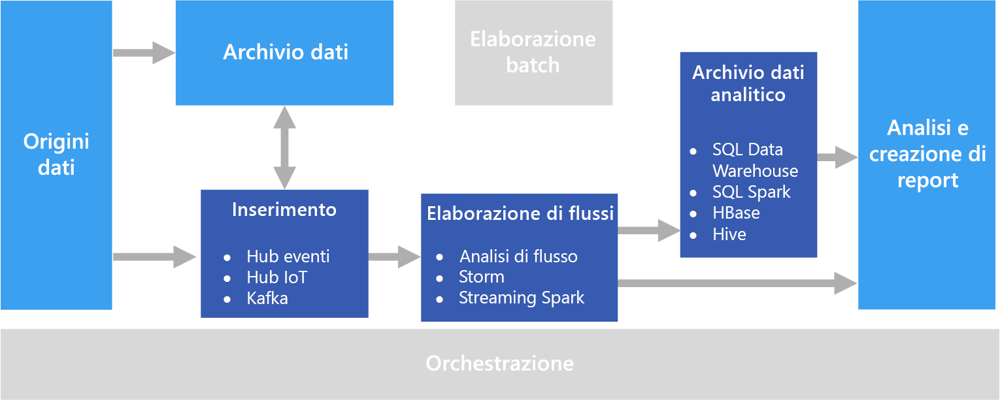

# Elaborazione in tempo realeReal time processing

L'elaborazione in tempo reale riguarda i flussi di dati acquisiti in tempo reale ed elaborati con latenza minima per generare report in tempo reale o quasi in tempo reale oppure risposte automatiche.Real time processing deals with streams of data that are captured in real-time and processed with minimal latency to generate real-time (or near-real-time) reports or automated responses. Ad esempio, un soluzione di monitoraggio del traffico in tempo reale potrebbe usare i dati dei sensori per rilevare volumi elevati di traffico.For example, a real-time traffic monitoring solution might use sensor data to detect high traffic volumes. Tali dati possono essere usati per aggiornare dinamicamente una mappa che mostri le zone di traffico intenso oppure per creare automaticamente corsie ad alta occupazione o avviare altri sistemi di gestione del traffico.This data could be used to dynamically update a map to show congestion, or automatically initiate high-occupancy lanes or other traffic management systems.

L'elaborazione in tempo reale è definita come l'elaborazione del flusso non associato di dati di input, con requisiti di latenza molto breve per l'elaborazione &mdash; misurata in millisecondi o secondi.Real-time processing is defined as the processing of unbounded stream of input data, with very short latency requirements for processing &mdash; measured in milliseconds or seconds. In genere questi dati in ingresso arrivano in formato non strutturato o semistrutturato, ad esempio in formato JSON, e hanno gli stessi requisiti di elaborazione dell'[elaborazione batch](./batch-processing.md), ma con tempi di completamento più brevi per supportare l'utilizzo in tempo reale.This incoming data typically arrives in an unstructured or semi-structured format, such as JSON, and has the same processing requirements as [batch processing](./batch-processing.md), but with shorter turnaround times to support real-time consumption.

I dati elaborati vengono spesso scritti in un archivio dati analitici, ottimizzato per l'analisi e la visualizzazione.Processed data is often written to an analytical data store, which is optimized for analytics and visualization. I dati elaborati possono anche essere inseriti direttamente nei livelli di analisi e report per l'analisi, la business intelligence e la visualizzazione dashboard in tempo reale.The processed data can also be ingested directly into the analytics and reporting layer for analysis, business intelligence, and real-time dashboard visualization.

## ProblematicheChallenges

Uno dei problemi maggiori delle soluzioni di elaborazione in tempo reale è l'inserimento, l'elaborazione e l'archiviazione dei messaggi in tempo reale, soprattutto in volumi elevati.One of the big challenges of real-time processing solutions is to ingest, process, and store messages in real time, especially at high volumes. L'elaborazione deve essere eseguita in modo che non blocchi la pipeline di inserimento.Processing must be done in such a way that it does not block the ingestion pipeline. L'archivio dati deve supportare operazioni di scrittura con volumi elevati.The data store must support high-volume writes. Un altro problema è riuscire ad agire rapidamente sui dati, ad esempio generando avvisi in tempo reale o presentando i dati in un dashboard in tempo reale o quasi in tempo reale.Another challenge is being able to act on the data quickly, such as generating alerts in real time or presenting the data in a real-time (or near-real-time) dashboard.

## ArchitetturaArchitecture

Un'architettura per l'elaborazione in tempo reale include i componenti logici seguenti.A real-time processing architecture has the following logical components.

- **Inserimento di messaggi in tempo reale.****Real-time message ingestion.** L'architettura deve includere un modo per acquisire e archiviare i messaggi in tempo reale per l'utilizzo da parte di un consumer di elaborazione dei flussi.The architecture must include a way to capture and store real-time messages to be consumed by a stream processing consumer. Nei casi semplici questo servizio può essere implementato come un semplice archivio dati in cui i nuovi messaggi vengono inseriti in una cartella.In simple cases, this service could be implemented as a simple data store in which new messages are deposited in a folder. Spesso la soluzione necessita tuttavia di un broker di messaggi, come Hub eventi di Azure, che funge da buffer per i messaggi.But often the solution requires a message broker, such as Azure Event Hubs, that acts as a buffer for the messages. Il broker di messaggi deve supportare l'elaborazione scale-out e il recapito affidabile.The message broker should support scale-out processing and reliable delivery.

- **Elaborazione del flusso.****Stream processing.** Dopo avere acquisito i messaggi in tempo reale, la soluzione deve elaborarli filtrando, aggregando e preparando in altro modo i dati per l'analisi.After capturing real-time messages, the solution must process them by filtering, aggregating, and otherwise preparing the data for analysis.

- **Archivio dati analitici.****Analytical data store.** Numerose soluzioni per Big Data sono progettate per preparare i dati per l'analisi e quindi servire i dati elaborati in un formato strutturato su cui è possibile eseguire query con strumenti di analisi.Many big data solutions are designed to prepare data for analysis and then serve the processed data in a structured format that can be queried using analytical tools.

- **Analisi e creazione di report.****Analysis and reporting.** L'obiettivo della maggior parte delle soluzioni per Big Data è fornire informazioni dettagliate sui dati tramite strumenti di analisi e report.The goal of most big data solutions is to provide insights into the data through analysis and reporting.

## Scelte di tecnologiaTechnology choices

Per le soluzioni di elaborazione in tempo reale in Azure è consigliabile usare le tecnologie seguenti.The following technologies are recommended choices for real-time processing solutions in Azure.

### Inserimento di messaggi in tempo realeReal-time message ingestion

- **Hub eventi di Azure**.**Azure Event Hubs**. Hub eventi di Azure è una soluzione di accodamento dei messaggi per l'inserimento di milioni di messaggi di eventi al secondo.Azure Event Hubs is a message queuing solution for ingesting millions of event messages per second. I dati degli eventi acquisiti possono essere elaborati da più consumer in parallelo.The captured event data can be processed by multiple consumers in parallel.
- **Hub IoT di Azure**.**Azure IoT Hub**. L'hub IoT di Azure garantisce la comunicazione bidirezionale tra i dispositivi connessi a Internet e una coda di messaggi scalabile in grado di gestire milioni di dispositivi connessi contemporaneamente.Azure IoT Hub provides bi-directional communication between Internet-connected devices, and a scalable message queue that can handle millions of simultaneously connected devices.
- **Apache Kafka**.**Apache Kafka**. Kafka è un'applicazione open source di accodamento dei messaggi e di elaborazione dei flussi che è possibile scalare per gestire milioni di messaggi al secondo da più produttori di messaggi e indirizzarli a più consumer.Kafka is an open source message queuing and stream processing application that can scale to handle millions of messages per second from multiple message producers, and route them to multiple consumers. Kafka è disponibile in Azure come tipo di cluster HDInsight.Kafka is available in Azure as an HDInsight cluster type.

Per altre informazioni, vedere [Inserimento di messaggi in tempo reale](../technology-choices/real-time-ingestion.md).For more information, see [Real-time message ingestion](../technology-choices/real-time-ingestion.md).

### Archiviazione dei datiData storage

- **Contenitori BLOB del servizio di archiviazione di Azure** o **Azure Data Lake Store**.**Azure Storage Blob Containers** or **Azure Data Lake Store**. I dati in tempo reale in ingresso in genere vengono acquisiti in un broker di messaggi (vedere sopra), ma in alcuni scenari può essere utile monitorare una cartella per elaborare i nuovi file non appena vengono creati o aggiornati.Incoming real-time data is usually captured in a message broker (see above), but in some scenarios, it can make sense to monitor a folder for new files and process them as they are created or updated. Molte soluzioni di elaborazione in tempo reale combinano inoltre i dati in streaming con i dati di riferimento statici, che possono essere archiviati in un archivio file.Additionally, many real-time processing solutions combine streaming data with static reference data, which can be stored in a file store. L'archiviazione file può essere usata infine come destinazione di output per i dati acquisiti in tempo reale per l'archiviazione o per l'ulteriore elaborazione batch in un'[architettura lambda](../big-data/index.md#lambda-architecture).Finally, file storage may be used as an output destination for captured real-time data for archiving, or for further batch processing in a [lambda architecture](../big-data/index.md#lambda-architecture).

Per altre informazioni, vedere [Archiviazione dei dati](../technology-choices/data-storage.md).For more information, see [Data storage](../technology-choices/data-storage.md).

### Elaborazione del flussoStream processing

- **Analisi di flusso di Azure**.**Azure Stream Analytics**. Analisi di flusso di Azure può eseguire query perpetue su un flusso non associato di dati.Azure Stream Analytics can run perpetual queries against an unbounded stream of data. Tali query utilizzano flussi di dati da risorse di archiviazione o da broker di messaggi, filtrano e aggregano i dati in base a finestre temporali e scrivono i risultati in sink come risorse di archiviazione, database o direttamente in report in Power BI.These queries consume streams of data from storage or message brokers, filter and aggregate the data based on temporal windows, and write the results to sinks such as storage, databases, or directly to reports in Power BI. Analisi di flusso usa un linguaggio di query basato su SQL che supporta costrutti temporali e geospaziali e può essere esteso tramite JavaScript.Stream Analytics uses a SQL-based query language that supports temporal and geospatial constructs, and can be extended using JavaScript.
- **Storm**.**Storm**. Apache Storm è un framework open source per l'elaborazione dei flussi che usa una topologia di spout e bolt per utilizzare, elaborare ed eseguire l'output dei risultati da origini di dati in streaming in tempo reale.Apache Storm is an open source framework for stream processing that uses a topology of spouts and bolts to consume, process, and output the results from real-time streaming data sources. È possibile eseguire il provisioning di Storm in un cluster HDInsight di Azure e implementare una topologia in Java o in C#.You can provision Storm in an Azure HDInsight cluster, and implement a topology in Java or C#.
- **Spark Streaming**.**Spark Streaming**. Apache Spark è una piattaforma distribuita open source per l'elaborazione generale di dati.Apache Spark is an open source distributed platform for general data processing. Spark include l'API Spark Streaming, in cui è possibile scrivere codice in qualsiasi linguaggio Spark supportato, tra cui Java, Scala e Python.Spark provides the Spark Streaming API, in which you can write code in any supported Spark language, including Java, Scala, and Python. Spark 2.0 ha introdotto l'API Spark Structured Streaming, che offre un modello di programmazione più semplice e coerente.Spark 2.0 introduced the Spark Structured Streaming API, which provides a simpler and more consistent programming model. Spark 2.0 è disponibile in Azure come cluster HDInsight.Spark 2.0 is available in an Azure HDInsight cluster.

Per altre informazioni, vedere [Elaborazione del flusso](../technology-choices/stream-processing.md).For more information, see [Stream processing](../technology-choices/stream-processing.md).

### Archivio dati analiticiAnalytical data store

- **SQL Data Warehouse**, **HBase**, **Spark** o **Hive**.**SQL Data Warehouse**, **HBase**, **Spark**, or **Hive**. I dati elaborati in tempo reale possono essere archiviati in un database relazionale come Azure SQL Data Warehouse, in un archivio NoSQL come HBase o sotto forma di file in un'archiviazione distribuita nella quale è possibile definire tabelle di Spark o Hive ed eseguire query su di esse.Processed real-time data can be stored in a relational database such Azure SQL Data Warehouse, a NoSQL store such as HBase, or as files in distributed storage over which Spark or Hive tables can be defined and queried.

Per altre informazioni, vedere [Archivi dati analitici](../technology-choices/analytical-data-stores.md).For more information, see [Analytical data stores](../technology-choices/analytical-data-stores.md).

### Analisi e reportAnalytics and reporting

- **Azure Analysis Services**, **Power BI** e **Microsoft Excel**.**Azure Analysis Services**, **Power BI**, and **Microsoft Excel**. I dati elaborati in tempo reale archiviati in un archivio dati analitici possono essere usati per l'analisi e i report cronologici in modo analogo ai dati di elaborazione batch.Processed real-time data that is stored in an analytical data store can be used for historical reporting and analysis in the same way as batch processed data. Power BI consente inoltre di pubblicare visualizzazioni e report in tempo reale o quasi in tempo reale da origini di dati analitici in cui la latenza è sufficientemente bassa oppure in alcuni casi direttamente dall'output di elaborazione dei flussi.Additionally, Power BI can be used to publish real-time (or near-real-time) reports and visualizations from analytical data sources where latency is sufficiently low, or in some cases directly from the stream processing output.

Per altre informazioni, vedere [Analisi e report](../technology-choices/analysis-visualizations-reporting.md).For more information, see [Analytics and reporting](../technology-choices/analysis-visualizations-reporting.md).

In una soluzione esclusivamente in tempo reale la maggior parte dell'orchestrazione di elaborazione viene gestita dai componenti per l'inserimento dei messaggi e l'elaborazione dei flussi.In a purely real-time solution, most of the processing orchestration is managed by the message ingestion and stream processing components. In un'architettura lambda che combina l'elaborazione batch e l'elaborazione in tempo reale può tuttavia essere necessario usare un framework di orchestrazione come Azure Data Factory o Apache Oozie e Sqoop per gestire i flussi di lavoro batch per i dati acquisiti in tempo reale.However, in a lambda architecture that combines batch processing and real-time processing, you may need to use an orchestration framework such as Azure Data Factory or Apache Oozie and Sqoop to manage batch workflows for captured real-time data.

## Passaggi successiviNext steps

L'architettura di riferimento seguente illustra una pipeline di elaborazione di flussi end-to-end:The following reference architecture shows an end-to-end stream processing pipeline:

- [Elaborazione di flussi con Analisi di flusso di AzureStream processing with Azure Stream Analytics](../../reference-architectures/data/stream-processing-stream-analytics.md)