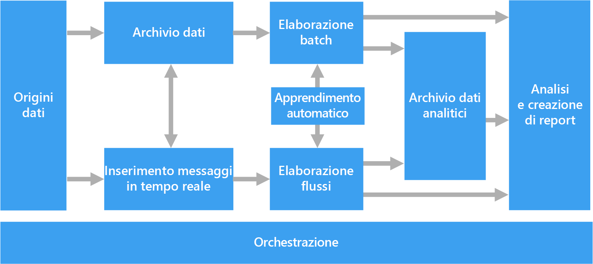
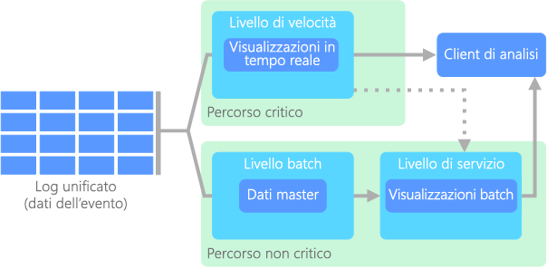
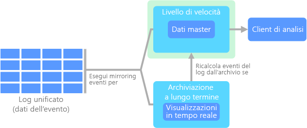

# Architetture per Big DataBig data architectures

Un'architettura per Big Data è progettata per gestire l'inserimento, l'elaborazione e l'analisi di dati troppo grandi o complessi per i sistemi di database tradizionali.A big data architecture is designed to handle the ingestion, processing, and analysis of data that is too large or complex for traditional database systems. Il criterio adottato dalle organizzazioni per individuare la soglia oltre la quale è opportuno preferire soluzioni per Big Data varia a seconda delle capacità degli utenti e degli strumenti a disposizione.The threshold at which organizations enter into the big data realm differs, depending on the capabilities of the users and their tools. Può trattarsi di una quantità di dati dell'ordine di migliaia di gigabyte, ma anche di centinaia di terabyte.For some, it can mean hundreds of gigabytes of data, while for others it means hundreds of terabytes. Con lo sviluppo di strumenti sempre più avanzati per la gestione di set di Big Data, anche il significato di Big Data si è evoluto.As tools for working with big data sets advance, so does the meaning of big data. Il termine viene sempre più usato per fare riferimento al valore che è possibile estrarre dai set di dati tramite l'analisi avanzata, anziché esclusivamente alle dimensioni dei dati, anche se in questi casi tendono a essere molto grandi.More and more, this term relates to the value you can extract from your data sets through advanced analytics, rather than strictly the size of the data, although in these cases they tend to be quite large.

Nel corso degli anni, il panorama dei dati ha subito varie trasformazioni.Over the years, the data landscape has changed. Il concetto di ciò che è possibile fare, o si prevede di poter fare, è cambiato.What you can do, or are expected to do, with data has changed. I costi di archiviazione sono diminuiti notevolmente, mentre i mezzi disponibili per la raccolta dei dati sono in continua espansione.The cost of storage has fallen dramatically, while the means by which data is collected keeps growing. Alcuni dati arrivano a un ritmo veloce, sempre pronti per essere raccolti e osservati.Some data arrives at a rapid pace, constantly demanding to be collected and observed. Altri arrivano invece a un ritmo più lento, ma in blocchi di dimensioni molto grandi, spesso sotto forma di dati cronologici relativi a decenni.Other data arrives more slowly, but in very large chunks, often in the form of decades of historical data. Può quindi capitare di dover affrontare un problema che richiede una soluzione di analisi avanzata o di apprendimento automatico.You might be facing an advanced analytics problem, or one that requires machine learning. Queste sono le sfide che tentano di risolvere le architetture per Big Data.These are challenges that big data architectures seek to solve.

Le soluzioni per Big Data implicano in genere uno o più dei seguenti tipi di carico di lavoro:Big data solutions typically involve one or more of the following types of workload:

* L'elaborazione batch di origini di Big Data inattivi.Batch processing of big data sources at rest.
* L'elaborazione in tempo reale di Big Data in movimento.Real-time processing of big data in motion.
* L'esplorazione interattiva di Big Data.Interactive exploration of big data.
* L'analisi predittiva e il Machine Learning.Predictive analytics and machine learning.

Prendere in considerazione l'uso di architetture per Big Data quando è necessario:Consider big data architectures when you need to:

* Archiviare ed elaborare i dati in volumi troppo grandi per un database tradizionale.Store and process data in volumes too large for a traditional database.
* Trasformare i dati non strutturati per consentire l'analisi e la creazione di report.Transform unstructured data for analysis and reporting.
* Acquisire, elaborare e analizzare i flussi di dati non associati in tempo reale o con una latenza bassa.Capture, process, and analyze unbounded streams of data in real time, or with low latency.

## Componenti di un'architettura per Big DataComponents of a big data architecture

Il diagramma seguente mostra i componenti logici relativi a un'architettura per Big Data.The following diagram shows the logical components that fit into a big data architecture. È comunque possibile che le singole soluzioni non contengano tutti gli elementi illustrati nel diagramma.Individual solutions may not contain every item in this diagram.

 

La maggior parte delle architetture per Big Data include alcuni o tutti i componenti illustrati di seguito:Most big data architectures include some or all of the following components:

* **Origini dati**.**Data sources**. Il punto di partenza di tutte le soluzioni per Big Data è costituito da una o più origini dati.All big data solutions start with one or more data sources. Tra gli esempi sono inclusi:Examples include:

    * Archivi dati di applicazioni, ad esempio database relazionali.Application data stores, such as relational databases.
    * File statici generati dalle applicazioni, ad esempio file di log di server Web.Static files produced by applications, such as web server log files.
    * Origini dati in tempo reale, ad esempio dispositivi IoT.Real-time data sources, such as IoT devices.

* **Archiviazione dei dati**.**Data storage**. I dati per le operazioni di elaborazione batch vengono in genere inseriti in un archivio di file distribuito che può contenere volumi elevati di file di grandi dimensioni in vari formati.Data for batch processing operations is typically stored in a distributed file store that can hold high volumes of large files in various formats. Questo tipo di archivio viene spesso chiamato *data lake*.This kind of store is often called a *data lake*. Alcune opzioni per l'implementazione di questo tipo di archiviazione sono Azure Data Lake Store o i contenitori BLOB in Archiviazione di Azure.Options for implementing this storage include Azure Data Lake Store or blob containers in Azure Storage.

* **Elaborazione batch**.**Batch processing**. Poiché i set di dati hanno dimensioni considerevoli, una soluzione per Big Data deve spesso elaborare i file di dati mediante processi batch con esecuzione prolungata per filtrare, aggregare e preparare in altro modo i dati per l'analisi.Because the data sets are so large, often a big data solution must process data files using long-running batch jobs to filter, aggregate, and otherwise prepare the data for analysis. In genere questi processi prevedono la lettura dei file di origine, la relativa elaborazione e la scrittura dell'output in nuovi file.Usually these jobs involve reading source files, processing them, and writing the output to new files. Le opzioni includono l'esecuzione di processi U-SQL in Azure Data Lake Analytics, l'utilizzo di Hive, Pig o di processi MapReduce personalizzati in un cluster HDInsight Hadoop o l'utilizzo di programmi Java, Scala o Python in un cluster HDInsight Spark.Options include running U-SQL jobs in Azure Data Lake Analytics, using Hive, Pig, or custom Map/Reduce jobs in an HDInsight Hadoop cluster, or using Java, Scala, or Python programs in an HDInsight Spark cluster.

* **Inserimento di messaggi in tempo reale**.**Real-time message ingestion**. Se la soluzione include origini in tempo reale, l'architettura deve includere un modo per acquisire e archiviare i messaggi in tempo reale per l'elaborazione del flusso.If the solution includes real-time sources, the architecture must include a way to capture and store real-time messages for stream processing. Potrebbe trattarsi di un archivio dati semplice in cui i messaggi in ingresso vengono rilasciati in una cartella per l'elaborazione.This might be a simple data store, where incoming messages are dropped into a folder for processing. Tuttavia, molte soluzioni richiedono che un archivio di inserimento dei messaggi funga da buffer per i messaggi e supporti l'elaborazione scale-out, il recapito affidabile e altri tipi di semantica di accodamento dei messaggi.However, many solutions need a message ingestion store to act as a buffer for messages, and to support scale-out processing, reliable delivery, and other message queuing semantics. Questa parte dell'architettura per l'elaborazione del flusso è spesso definita memorizzazione nel buffer del flusso.This portion of a streaming architecture is often referred to as stream buffering. Le opzioni includono Hub eventi di Azure, l'hub IoT di Azure e Kafka.Options include Azure Event Hubs, Azure IoT Hub, and Kafka.

* **Elaborazione del flusso**.**Stream processing**. Dopo avere acquisito i messaggi in tempo reale, la soluzione deve elaborarli filtrando, aggregando e preparando in altro modo i dati per l'analisi.After capturing real-time messages, the solution must process them by filtering, aggregating, and otherwise preparing the data for analysis. I dati del flusso elaborati vengono quindi scritti in un sink di output.The processed stream data is then written to an output sink. Analisi di flusso di Azure offre un servizio di elaborazione del flusso gestito basato su query SQL in esecuzione perenne che operano su flussi non associati.Azure Stream Analytics provides a managed stream processing service based on perpetually running SQL queries that operate on unbounded streams. È possibile anche usare tecnologie di streaming open source di Apache, come Storm e Spark Streaming in un cluster HDInsight.You can also use open source Apache streaming technologies like Storm and Spark Streaming in an HDInsight cluster.

* **Archivio dati analitici**.**Analytical data store**. Numerose soluzioni per Big Data preparano i dati per l'analisi e quindi servono i dati elaborati in un formato strutturato su cui è possibile eseguire query con strumenti analitici.Many big data solutions prepare data for analysis and then serve the processed data in a structured format that can be queried using analytical tools. L'archivio dati analitici usato per rispondere a queste query può essere un data warehouse relazionale in stile Kimball, come nella maggior parte delle soluzioni di business intelligence (BI) tradizionali.The analytical data store used to serve these queries can be a Kimball-style relational data warehouse, as seen in most traditional business intelligence (BI) solutions. In alternativa, i dati possono essere presentati tramite una tecnologia NoSQL a bassa latenza come HBase o un database Hive interattivo che fornisce un'astrazione di metadati sui file di dati nell'archivio dati distribuito.Alternatively, the data could be presented through a low-latency NoSQL technology such as HBase, or an interactive Hive database that provides a metadata abstraction over data files in the distributed data store. Azure SQL Data Warehouse fornisce un servizio gestito per il data warehousing su larga scala basato su cloud.Azure SQL Data Warehouse provides a managed service for large-scale, cloud-based data warehousing. HDInsight supporta Interactive Hive, HBase e Spark SQL, che possono anche essere usati per fornire dati per l'analisi.HDInsight supports Interactive Hive, HBase, and Spark SQL, which can also be used to serve data for analysis.

* **Analisi e creazione di report**.**Analysis and reporting**. L'obiettivo della maggior parte delle soluzioni per Big Data è fornire informazioni dettagliate sui dati tramite funzionalità per l'analisi e la creazione di report.The goal of most big data solutions is to provide insights into the data through analysis and reporting. Per consentire agli utenti di analizzare i dati, l'architettura può includere un livello di modellazione dei dati, ad esempio un cubo OLAP multidimensionale o un modello di dati tabulari in Azure Analysis Services.To empower users to analyze the data, the architecture may include a data modeling layer, such as a multidimensional OLAP cube or tabular data model in Azure Analysis Services. Potrebbe inoltre supportare la business intelligence in modalità self-service, usando le tecnologie di modellazione e visualizzazione in Microsoft Power BI o Microsoft Excel.It might also support self-service BI, using the modeling and visualization technologies in Microsoft Power BI or Microsoft Excel. L'analisi e il reporting possono anche assumere la forma di esplorazione interattiva dei dati da parte di data scientist o analisti di dati.Analysis and reporting can also take the form of interactive data exploration by data scientists or data analysts. Per questi scenari, molti servizi di Azure supportano notebook analitici come Jupyter, consentendo a questi utenti di sfruttare le proprie competenze esistenti con Python o R. Per l'esplorazione di dati su larga scala, è possibile usare Microsoft R Server, sia autonomo che con Spark.For these scenarios, many Azure services support analytical notebooks, such as Jupyter, enabling these users to leverage their existing skills with Python or R. For large-scale data exploration, you can use Microsoft R Server, either standalone or with Spark.

* **Orchestrazione**.**Orchestration**. La maggior parte delle soluzioni per Big Data consiste in operazioni ripetute di elaborazione dei dati, incapsulate in flussi di lavoro, che trasformano i dati di origine, spostano i dati tra più origini e sink, caricano i dati elaborati in un archivio dati analitico o li inseriscono direttamente in un report o in un dashboard.Most big data solutions consist of repeated data processing operations, encapsulated in workflows, that transform source data, move data between multiple sources and sinks, load the processed data into an analytical data store, or push the results straight to a report or dashboard. Per automatizzare questi flussi di lavoro, è possibile usare una tecnologia di orchestrazione come Azure Data Factory o Apache Oozie e Sqoop.To automate these workflows, you can use an orchestration technology such Azure Data Factory or Apache Oozie and Sqoop.

## Data lakeData lake

Nella documentazione relativa ai Big Data può essere presente il termine _data lake_,If you have read anything about big data, it's likely you've seen the term _data lake_. usato per il nome di un prodotto o talvolta anche come termine generico per fare riferimento all'archiviazione di grandi quantità di dati.You may have seen the word used for the name of a product, or perhaps a concept about storing large quantities of data. 

Un data lake prevede un componente di archiviazione e uno di elaborazione.A data lake consists of both storage and processing. L'archiviazione in un data lake viene realizzata per raggiungere vari obiettivi: tolleranza di errore, scalabilità illimitata ed elevata velocità nell'inserimento dei dati con diverse forme e dimensioni.Data lake storage is built with several goals in mind: fault-tolerance, infinite scalability, and high-throughput ingestion of data with varying shapes and sizes. L'elaborazione in un data lake prevede l'uso di uno o più motori creati tenendo presenti questi obiettivi e che sono in grado di elaborare i dati archiviati nel data lake su larga scala.Data lake processing involves one or more processing engines built with these goals in mind, and can operate on data stored in a data lake at scale.

Gli archivi di data lake vengono spesso usati in scenari di Internet delle cose o di flussi di eventi perché sono in grado di salvare in modo persistente grandi quantità di dati relazionali e non relazionali, senza alcuna trasformazione o definizione di schema.Data lake stores are often used in event streaming or IoT scenarios, because they can persist large amounts of relational and nonrelational data without transformation or schema definition. Vengono creati per gestire volumi elevati di piccole operazioni di scrittura a bassa latenza e sono ottimizzati per offrire un'enorme velocità effettiva.They are built to handle high volumes of small writes at low latency, and are optimized for massive throughput.

Un altro termine usato di frequente negli scenari relativi ai dati è _data mart_.Another term commonly used in data scenarios is _data mart_. Per data mart si intende in genere un archivio in cui i dati sono stati puliti, compressi e strutturati per facilitarne l'utilizzo.Typically, a data mart is a store of data that is cleansed, packaged, and structured for easy consumption. A differenza di un data mart, un data lake è pensato per l'inserimento di dati non elaborati. I dati vengono infatti lasciati nella forma originale meno elaborata, per poter essere interrogati in tempi e modi diversi.Unlike a data mart, a data lake is designed to ingest raw data, leaving it in its original or least-processed form to allow questions to be asked in various ways and at various times. Se venissero puliti e strutturati in un modo particolare, come in un data mart, sarebbe difficile adattare la modalità di elaborazione e analisi a eventuali nuovi strumenti o tecniche di interrogazione disponibili in futuro.If the data is cleansed and structured in a specific way, like in a data mart, then it is difficult to adapt how the data is processed and analyzed when new questions or tools come about in the future. È per questo motivo che i componenti di archiviazione ed elaborazione di un data lake vengono trattati come entità separate.This is why a data lake is composed of both storage and processing as separate entities.

Servizio di Azure pertinente:Relevant Azure service:
- [Azure Data LakeAzure Data Lake](https://azure.microsoft.com/scenarios/data-lake/)

## Architettura lambdaLambda architecture

Quando si lavora con set di dati di dimensioni molto grandi, può essere necessaria una notevole quantità di tempo per eseguire le query adatte ai requisiti dei client.When working with very large data sets, it can take a long time to run the sort of queries that clients need. Le query di questo tipo non possono essere eseguite in tempo reale e spesso richiedono algoritmi, come [MapReduce](https://en.wikipedia.org/wiki/MapReduce), che operano in parallelo sull'intero set di dati.These queries can't be performed in real time, and often require algorithms such as [MapReduce](https://en.wikipedia.org/wiki/MapReduce) that operate in parallel across the entire data set. I risultati vengono quindi archiviati separatamente rispetto ai dati non elaborati e usati per ulteriori query.The results are then stored separately from the raw data and used for querying.

Uno svantaggio di questo approccio è dato dalla latenza. Se l'elaborazione richiede alcune ore, è possibile che una query restituisca risultati che risalgono a diverse ore prima.One drawback to this approach is that it introduces latency &mdash; if processing takes a few hours, a query may return results that are several hours old. L'ideale sarebbe ottenere alcuni risultati in tempo reale, anche se con una perdita di precisione, e combinarli con quelli provenienti dall'analisi in batch.Ideally, you would like to get some results in real time (perhaps with some loss of accuracy), and combine these results with the results from the batch analytics.

L'**architettura lambda**, proposta per la prima volta da Nathan Marz, risolve questo problema creando due percorsi per il flusso di dati.The **lambda architecture**, first proposed by Nathan Marz, addresses this problem by creating two paths for data flow. Tutti i dati in ingresso nel sistema passano attraverso questi due percorsi:All data coming into the system goes through these two paths:

* Un **livello di elaborazione batch** (percorso ad accesso sporadico) archivia tutti i dati in ingresso nella forma non elaborata ed esegue l'elaborazione batch sui dati.A **batch layer** (cold path) stores all of the incoming data in its raw form and performs batch processing on the data. Il risultato di questa elaborazione viene archiviato come **visualizzazione batch**.The result of this processing is stored as a **batch view**.

* Un **livello di elaborazione rapida** (percorso ad accesso frequente) analizza i dati in tempo reale.A **speed layer** (hot path) analyzes data in real time. Questo livello è stato progettato per offrire una bassa latenza, a scapito della precisione.This layer is designed for low latency, at the expense of accuracy.

Il livello di elaborazione batch confluisce in un **livello di gestione** che indicizza la visualizzazione batch per un'elaborazione efficiente delle query.The batch layer feeds into a **serving layer** that indexes the batch view for efficient querying. Il livello di elaborazione rapida aggiorna in modo incrementale il livello di gestione in base ai dati più recenti.The speed layer updates the serving layer with incremental updates based on the most recent data.

I dati che confluiscono nel percorso ad accesso frequente sono vincolati dai requisiti di latenza imposti dal livello di elaborazione rapida, in modo da essere elaborati il più velocemente possibile.Data that flows into the hot path is constrained by latency requirements imposed by the speed layer, so that it can be processed as quickly as possible. È spesso necessario raggiungere un compromesso tra il livello di precisione dei dati e la velocità con cui risultano disponibili.Often, this requires a tradeoff of some level of accuracy in favor of data that is ready as quickly as possible. Si consideri ad esempio uno scenario di Internet delle cose in cui un numero elevato di sensori di temperatura inviano dati di telemetria.For example, consider an IoT scenario where a large number of temperature sensors are sending telemetry data. Il livello di elaborazione rapida può essere usato per elaborare i dati in ingresso in una finestra temporale scorrevole.The speed layer may be used to process a sliding time window of the incoming data. 

Diversamente da questo flusso, i dati che confluiscono nel percorso ad accesso sporadico non sono soggetti agli stessi requisiti di bassa latenza.Data flowing into the cold path, on the other hand, is not subject to the same low latency requirements. In questo modo si può eseguire anche un'elaborazione più precisa di grandi set di dati, che può però richiedere molto tempo.This allows for high accuracy computation across large data sets, which can be very time intensive. 

I percorsi ad accesso frequente e sporadico convergono infine nell'applicazione client usata per l'analisi.Eventually, the hot and cold paths converge at the analytics client application. Se il client deve visualizzare dati in tempo reale, e quindi immediatamente disponibili anche se meno precisi, acquisirà i risultati dal percorso ad accesso frequente.If the client needs to display timely, yet potentially less accurate data in real time, it will acquire its result from the hot path. In caso contrario, selezionerà i risultati dal percorso ad accesso sporadico per visualizzare dati più precisi ma meno immediati.Otherwise, it will select results from the cold path to display less timely but more accurate data. In altre parole, il percorso ad accesso frequente contiene dati per un intervallo di tempo relativamente breve, dopo il quale i risultati possono essere aggiornati con dati più precisi provenienti dal percorso ad accesso sporadico.In other words, the hot path has data for a relatively small window of time, after which the results can be updated with more accurate data from the cold path.

I dati non elaborati archiviati al livello di elaborazione batch non sono modificabili.The raw data stored at the batch layer is immutable. I dati in ingresso vengono sempre aggiunti a quelli già esistenti, che non vengono mai sovrascritti.Incoming data is always appended to the existing data, and the previous data is never overwritten. Le eventuali modifiche apportate al valore di un particolare dato vengono archiviate come un nuovo record di evento con timestamp.Any changes to the value of a particular datum are stored as a new timestamped event record. Ciò consente di eseguire in qualsiasi momento il ricalcolo sulla cronologia dei dati raccolti.This allows for recomputation at any point in time across the history of the data collected. La possibilità di ricalcolare la visualizzazione batch rispetto ai dati originali non elaborati è importante perché consente di creare nuove visualizzazioni di pari passo con l'evoluzione del sistema.The ability to recompute the batch view from the original raw data is important, because it allows for new views to be created as the system evolves. 

## Architettura kappaKappa architecture

Uno svantaggio dell'architettura lambda è dato dalla sua complessità.A drawback to the lambda architecture is its complexity. La logica di elaborazione viene applicata a due percorsi diversi, ad accesso frequente e sporadico, usando framework distinti.Processing logic appears in two different places &mdash; the cold and hot paths &mdash; using different frameworks. La presenza di due percorsi ha l'effetto di duplicare la logica di calcolo e di rendere più complessa la gestione dell'architettura.This leads to duplicate computation logic and the complexity of managing the architecture for both paths.

In alternativa all'architettura lamba, Jay Kreps ha proposto l'**architettura kappa**,The **kappa architecture** was proposed by Jay Kreps as an alternative to the lambda architecture. con gli stessi obiettivi di base della precedente, ma una differenza importante. Tutti i flussi di dati passano attraverso un unico percorso, in base a un sistema di elaborazione di flussi.It has the same basic goals as the lambda architecture, but with an important distinction: All data flows through a single path, using a stream processing system. 

Questa architettura presenta alcune analogie con il livello di elaborazione batch dell'architettura lambda, in quanto i dati degli eventi non sono modificabili e vengono raccolti per intero, anziché in subset.There are some similarities to the lambda architecture's batch layer, in that the event data is immutable and all of it is collected, instead of a subset. I dati vengono inseriti come flusso di eventi in un unico log distribuito a tolleranza di errore.The data is ingested as a stream of events into a distributed and fault tolerant unified log. Gli eventi vengono ordinati e lo stato corrente di un evento viene modificato solo in caso di accodamento di un nuovo evento.These events are ordered, and the current state of an event is changed only by a new event being appended. In modo analogo al livello di elaborazione rapida dell'architettura lambda, l'intera elaborazione degli eventi viene eseguita nel flusso di input e salvata in modo persistente come visualizzazione in tempo reale.Similar to a lambda architecture's speed layer, all event processing is performed on the input stream and persisted as a real-time view. 

Se è necessario ricalcolare l'intero set di dati, come avviene nel livello di elaborazione batch dell'architettura lambda, è sufficiente riprodurre il flusso. Per completare questo calcolo in modo rapido viene normalmente usato il parallelismo.If you need to recompute the entire data set (equivalent to what the batch layer does in lambda), you simply replay the stream, typically using parallelism to complete the computation in a timely fashion.

## Internet delle coseInternet of Things (IoT)

Da un punto di vista strettamente pratico, per Internet delle cose si intende qualsiasi dispositivo connesso a Internet,From a practical viewpoint, Internet of Things (IoT) represents any device that is connected to the Internet. ovvero un PC, uno smartphone, uno smartwatch, un termostato intelligente, un frigorifero smart, un'automobile connessa, un monitor cardiaco impiantabile e qualsiasi altro oggetto che si connette a Internet per inviare o ricevere dati.This includes your PC, mobile phone, smart watch, smart thermostat, smart refrigerator, connected automobile, heart monitoring implants, and anything else that connects to the Internet and sends or receives data. Il numero di dispositivi connessi cresce di giorno in giorno, di pari passo con la quantità di dati che questi dispositivi raccolgono.The number of connected devices grows every day, as does the amount of data collected from them. In molti casi i dati vengono raccolti in ambienti estremamente limitati, talvolta con una latenza molto elevata.Often this data is being collected in highly constrained, sometimes high-latency environments. In altri casi, tuttavia, i dati vengono inviati da ambienti a bassa latenza per migliaia o milioni di dispositivi e richiedono quindi un'architettura in grado di inserirli rapidamente ed elaborarli di conseguenza.In other cases, data is sent from low-latency environments by thousands or millions of devices, requiring the ability to rapidly ingest the data and process accordingly. Per gestire questi vincoli e requisiti specifici è pertanto necessaria un'adeguata pianificazione.Therefore, proper planning is required to handle these constraints and unique requirements.

Le architetture guidate dagli eventi sono centrali per le soluzioni IoT.Event-driven architectures are central to IoT solutions. Il diagramma seguente mostra una possibile architettura logica per IoT.The following diagram shows a possible logical architecture for IoT. Il diagramma evidenzia i componenti del flusso di eventi dell'architettura.The diagram emphasizes the event-streaming components of the architecture.

Il **gateway cloud** inserisce gli eventi di dispositivo in corrispondenza dei limiti del cloud, usando un sistema di messaggistica a bassa latenza affidabile.The **cloud gateway** ingests device events at the cloud boundary, using a reliable, low latency messaging system.

I dispositivi possono inviare eventi direttamente al gateway cloud oppure attraverso un **gateway sul campo**.Devices might send events directly to the cloud gateway, or through a **field gateway**. Un gateway sul campo è un dispositivo o un prodotto software specializzato, in genere collocato insieme ai dispositivi, che riceve gli eventi e li inoltra al gateway cloud.A field gateway is a specialized device or software, usually collocated with the devices, that receives events and forwards them to the cloud gateway. Il gateway sul campo può anche pre-elaborare gli eventi di dispositivo non elaborati, eseguendo funzioni come l'applicazione di filtri, l'aggregazione o la trasformazione del protocollo.The field gateway might also preprocess the raw device events, performing functions such as filtering, aggregation, or protocol transformation.

Dopo l'inserimento, gli eventi passano da uno o più **elaboratori di flussi**, che possono instradare i dati (ad esempio all'archiviazione) o eseguire analisi e altri tipi di elaborazione.After ingestion, events go through one or more **stream processors** that can route the data (for example, to storage) or perform analytics and other processing.

Di seguito vengono indicati alcuni tipi comuni di elaborazione.The following are some common types of processing. Naturalmente, l'elenco non è esaustivo.(This list is certainly not exhaustive.)

- Scrittura dei dati di evento nell'archiviazione offline sicura per l'analisi batch.Writing event data to cold storage, for archiving or batch analytics.

- Analisi Percorso critico, che analizza il flusso di eventi (quasi) in tempo reale, per rilevare le anomalie, riconoscere i modelli in base a intervalli di tempo ricorrenti o attivare avvisi quando si verifica una condizione specifica nel flusso.Hot path analytics, analyzing the event stream in (near) real time, to detect anomalies, recognize patterns over rolling time windows, or trigger alerts when a specific condition occurs in the stream. 

- Gestione di tipi speciali di messaggi non di telemetria dai dispositivi, come le notifiche e gli allarmi.Handling special types of nontelemetry messages from devices, such as notifications and alarms. 

- Apprendimento automatico.Machine learning.

Le caselle in grigio mostrano i componenti di un sistema IoT non direttamente correlati al flusso di eventi, ma che sono stati inclusi per completezza.The boxes that are shaded gray show components of an IoT system that are not directly related to event streaming, but are included here for completeness.

- Il **registro dei dispositivi** è un database dei dispositivi di cui è stato effettuato il provisioning e include gli ID dispositivo e in genere i metadati dei dispositivi, come la posizione.The **device registry** is a database of the provisioned devices, including the device IDs and usually device metadata, such as location.

- L'**API di provisioning** è un'interfaccia esterna comune per il provisioning e la registrazione di nuovi dispositivi.The **provisioning API** is a common external interface for provisioning and registering new devices.

- Alcune soluzioni IoT consentono l'invio di **messaggi di comando e controllo** ai dispositivi.Some IoT solutions allow **command and control messages** to be sent to devices.

Servizi di Azure pertinenti:Relevant Azure services:

- [Hub IoT di AzureAzure IoT Hub](https://azure.microsoft.com/services/iot-hub/)
- [Hub eventi di AzureAzure Event Hubs](https://azure.microsoft.com/services/event-hubs/)
- [Analisi di flusso di AzureAzure Stream Analytics](https://azure.microsoft.com/services/stream-analytics/)  

Per altre informazioni sulle soluzioni di Internet delle cose in Azure, vedere [Azure IoT reference architecture](https://azure.microsoft.com/updates/microsoft-azure-iot-reference-architecture-available/) (Architettura di riferimento di Azure IoT).Learn more about IoT on Azure by reading the [Azure IoT reference architecture](https://azure.microsoft.com/updates/microsoft-azure-iot-reference-architecture-available/).

