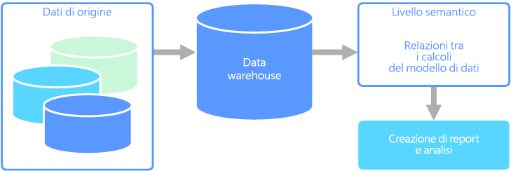

# Modellazione semanticaSemantic modeling

Un modello di dati semantico è un modello concettuale che descrive il significato degli elementi di dati in esso contenuti.A semantic data model is a conceptual model that describes the meaning of the data elements it contains. Le organizzazioni usano spesso i propri termini per elementi o operazioni, talvolta con sinonimi, o persino diversi significati per lo stesso termine.Organizations often have their own terms for things, sometimes with synonyms, or even different meanings for the same term. Un database di inventario potrebbe ad esempio registrare un dispositivo con un ID asset e un numero di serie, ma un database di vendite potrebbe fare riferimento al numero di serie come ID asset.For example, an inventory database might track a piece of equipment with an asset ID and a serial number, but a sales database might refer to the serial number as the asset ID. Non esiste un modo semplice per correlare questi valori senza un modello che descriva la relazione.There is no simple way to relate these values without a model that describes the relationship. 

La modellazione semantica garantisce un livello di astrazione dello schema del database, in modo che non sia necessario che gli utenti conoscano le strutture di dati sottostanti.Semantic modeling provides a level of abstraction over the database schema, so that users don't need to know the underlying data structures. Questo semplifica l'esecuzione di query sui dati per gli utenti finali senza eseguire aggregazioni e join nello schema sottostante.This makes it easier for end users to query data without performing aggregates and joins over the underlying schema. Le colonne inoltre vengono in genere rinominate usando nomi più descrittivi, in modo da rendere più ovvi il contesto e il significato dei dati.Also, usually columns are renamed to more user-friendly names, so that the context and meaning of the data are more obvious.

La modellazione semantica è prevalentemente usata per gli scenari con intensa attività di lettura, ad esempio l'analisi e la business intelligence (OLAP), anziché per l'elaborazione dei dati transazionali con più intensa attività di scrittura (OLTP).Semantic modeling is predominately used for read-heavy scenarios, such as analytics and business intelligence (OLAP), as opposed to more write-heavy transactional data processing (OLTP). Ciò è dovuto principalmente alla natura di un livello semantico tipico:This is mostly due to the nature of a typical semantic layer:

- I comportamenti di aggregazione vengono impostati in modo che gli strumenti di report li visualizzino correttamente.Aggregation behaviors are set so that reporting tools display them properly.
- Vengono definiti i calcoli e la logica di business.Business logic and calculations are defined.
- Vengono inclusi calcoli basati sul tempo.Time-oriented calculations are included.
- I dati sono spesso integrati da più origini.Data is often integrated from multiple sources. 

Per questi motivi in genere il livello semantico è posizionato in un data warehouse.Traditionally, the semantic layer is placed over a data warehouse for these reasons.

Esistono due tipi principali di modelli semantici:There are two primary types of semantic models:

* **Tabulare**.**Tabular**. Usa costrutti di modellazione relazionale (modello, tabelle, colonne).Uses relational modeling constructs (model, tables, columns). Internamente i metadati vengono ereditati da costrutti di modellazione OLAP (cubi, dimensioni, misure).Internally, metadata is inherited from OLAP modeling constructs (cubes, dimensions, measures). Il codice e lo script usano metadati OLAP.Code and script use OLAP metadata.
* **Multidimensionale**.**Multidimensional**. Usa costrutti di modellazione OLAP tradizionali (cubi, dimensioni, misure).Uses traditional OLAP modeling constructs (cubes, dimensions, measures).

Servizio di Azure pertinente:Relevant Azure service:
- [Azure Analysis ServicesAzure Analysis Services](https://azure.microsoft.com/services/analysis-services/)

## Esempio di caso d'usoExample use case

I dati di un'organizzazione sono archiviati in un database di grandi dimensioni.An organization has data stored in a large database. L'organizzazione vuole rendere questi dati disponibili per gli utenti di business e i clienti per la creazione di report e l'esecuzione di analisi.It wants to make this data available to business users and customers to create their own reports and do some analysis. Un'opzione consiste nel dare agli utenti accesso diretto al database.One option is just to give those users direct access to the database. Questa operazione presenta tuttavia numerosi svantaggi, tra cui la gestione della sicurezza e il controllo dell'accesso.However, there are several drawbacks to doing this, including managing security and controlling access. La progettazione del database, inclusi i nomi delle tabelle e delle colonne, potrebbe inoltre essere difficile da comprendere per l'utente.Also, the design of the database, including the names of tables and columns, may be hard for a user to understand. Gli utenti dovrebbero sapere su quali tabelle eseguire le query, come unire le tabelle e conoscere altre regole di logica di business da applicare per ottenere risultati corretti.Users would need to know which tables to query, how those tables should be joined, and other business logic that must be applied to get the correct results. Per poter anche solo iniziare, gli utenti dovrebbero anche conoscere un linguaggio di query come SQL.Users would also need to know a query language like SQL even to get started. Di conseguenza, spesso più utenti usano le stesse metriche ma ottengono risultati diversi.Typically this leads to multiple users reporting the same metrics but with different results.

Un'altra opzione consiste nell'incapsulare tutte le informazioni necessarie in un modello semantico.Another option is to encapsulate all of the information that users need into a semantic model. Per gli utenti può essere più semplice eseguire query su un modello semantico con uno strumento di report di propria scelta.The semantic model can be more easily queried by users with a reporting tool of their choice. Il pull dei dati forniti dal modello semantico è stato eseguito da un data warehouse, consentendo in tal modo a tutti gli utenti di vedere un'unica versione della realtà.The data provided by the semantic model is pulled from a data warehouse, ensuring that all users see a single version of the truth. Il modello semantico garantisce anche nomi descrittivi di colonna e tabella, relazioni tra tabelle, descrizioni, calcoli e sicurezza a livello di riga.The semantic model also provides friendly table and column names, relationships between tables, descriptions, calculations, and row-level security.

## Caratteristiche tipiche della modellazione semanticaTypical traits of semantic modeling

La modellazione semantica e l'elaborazione analitica hanno in genere le caratteristiche seguenti:Semantic modeling and analytical processing tends to have the following traits:

| RequisitoRequirement | DESCRIZIONEDescription |
| --- | --- |
| SCHEMASchema | Schema durante la scrittura, fortemente applicatoSchema on write, strongly enforced|
| Uso delle transazioniUses Transactions | No No |
| Strategia di bloccoLocking Strategy | NessunaNone |
| AggiornabileUpdateable | No (in genere richiede il ricalcolo del cubo)No (typically requires recomputing cube) |
| AccodamentoAppendable | No (in genere richiede il ricalcolo del cubo)No (typically requires recomputing cube) |
| Carico di lavoroWorkload | Operazioni di lettura intense, sola letturaHeavy reads, read-only |
| IndicizzazioneIndexing | Indicizzazione multidimensionaleMultidimensional indexing |
| Dimensioni datiDatum size | Da piccole a medieSmall to medium sized |
| ModelloModel | MultidimensionaleMultidimensional |
| Forma dei dati:Data shape:| Cubo o schema star/snowflakeCube or star/snowflake schema |
| Flessibilità queryQuery flexibility | Flessibilità elevataHighly flexible |
| Scalabilità:Scale: | Grande (10-100 GB)Large (10s-100s GBs) |

## Vedere anche See also

- [Data warehousingData warehousing](../scenarios/data-warehousing.md)
- [OLAP (Online Analytical Processing)Online analytical processing (OLAP)](../scenarios/online-analytical-processing.md)
