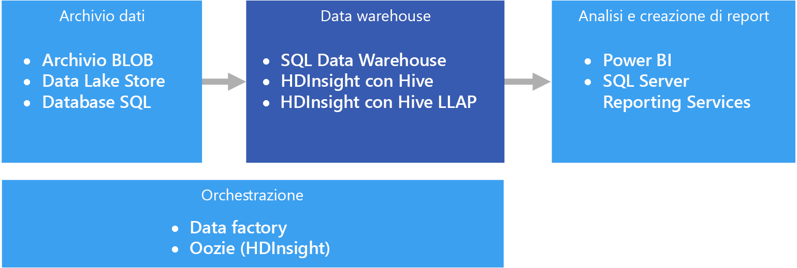

# Data warehousing e data martData warehousing and data marts

Un data warehouse è un repository relazionale centrale con funzione organizzativa contenente i dati integrati da una o più origini diverse in molte o in tutte le aree di interesse.A data warehouse is a central, organizational, relational repository of integrated data from one or more disparate sources, across many or all subject areas. I data warehouse archiviano i dati correnti e quelli cronologici e vengono usati per scopi di report e analisi dei dati in diversi modi.Data warehouses store current and historical data and are used for reporting and analysis of the data in different ways.

I dati da trasferire in un data warehouse vengono estratti con cadenza periodica da varie origini che contengono informazioni aziendali importanti.To move data into a data warehouse, it is extracted on a periodic basis from various sources that contain important business information. Quando vengono trasferiti, i dati possono essere formattati, puliti, convalidati, riassunti e riorganizzati.As the data is moved, it can be formatted, cleaned, validated, summarized, and reorganized. In alternativa, possono essere archiviati nel livello di dettaglio più basso, con visualizzazioni aggregate fornite nel warehouse per scopi di report.Alternately, the data can be stored in the lowest level of detail, with aggregated views provided in the warehouse for reporting. In entrambi i casi, il data warehouse diventa uno spazio di archiviazione permanente per i dati usati per la creazione di report, l'analisi e l'adozione di importanti decisioni aziendali con l'ausilio di strumenti di business intelligence (BI).In either case, the data warehouse becomes a permanent storage space for data used for reporting, analysis, and forming important business decisions using business intelligence (BI) tools.

## Data mart e archivi dati operativiData marts and operational data stores

La gestione dei dati su larga scala è complessa ed è sempre più raro trovare un unico data warehouse che rappresenta i dati dell'intera azienda.Managing data at scale is complex, and it is becoming less common to have a single data warehouse that represents all data across the entire enterprise. Al contrario, le organizzazioni tendono a creare data warehouse più piccoli e più mirati, denominati *data mart*, che espongono i dati desiderati per scopi di analisi.Instead, organizations create smaller, more focused data warehouses, called *data marts*, that expose the desired data for analytics purposes. Grazie a un processo di orchestrazione, i data mart vengono popolati con i dati mantenuti in un archivio dati operativo.An orchestration process populates the data marts from data maintained in an operational data store. L'archivio dati operativi agisce da intermediario tra il sistema transazionale di origine e il data mart.The operational data store acts as an intermediary between the source transactional system and the data mart. I dati gestiti dall'archivio dati operativi sono una versione pulita dei dati presenti nel sistema transazionale di origine. Si tratta in genere di un subset dei dati cronologici manutenuti dal data warehouse o dal data mart.Data managed by the operational data store is a cleaned version of the data present in the source transactional system, and is typically a subset of the historical data that is maintained by the data warehouse or data mart.

## Quando usare questa soluzioneWhen to use this solution

Scegliere un data warehouse quando è necessario convertire le enormi quantità di dati dei sistemi operativi in un formato facilmente comprensibile, aggiornato e preciso.Choose a data warehouse when you need to turn massive amounts of data from operational systems into a format that is easy to understand, current, and accurate. I data warehouse non devono necessariamente riflettere la stessa struttura dati concisa che può essere usata nei database operativi/OLTP.Data warehouses do not need to follow the same terse data structure you may be using in your operational/OLTP databases. È possibile usare nomi di colonna significativi per gli analisti e gli utenti aziendali, ristrutturare lo schema per semplificare le relazioni tra i dati e consolidare più tabelle in una.You can use column names that make sense to business users and analysts, restructure the schema to simplify data relationships, and consolidate several tables into one. Questi passaggi forniscono agli utenti le indicazioni necessarie per creare report ad hoc o per creare report e analizzare i dati nei sistemi di business intelligence, senza il supporto di un amministratore del database (DBA) o uno sviluppatore di dati.These steps help guide users who need to create ad hoc reports, or create reports and analyze the data in BI systems, without the help of a database administrator (DBA) or data developer.

Può essere opportuno usare un data warehouse quando è necessario tenere separati i dati cronologici dai sistemi transazionali di origine per non compromettere le prestazioni.Consider using a data warehouse when you need to keep historical data separate from the source transaction systems for performance reasons. I data warehouse facilitano l'accesso ai dati cronologici da varie posizioni, offrendo un'area centralizzata con formati, chiavi, modelli di dati e metodi di accesso comuni.Data warehouses make it easy to access historical data from multiple locations, by providing a centralized location using common formats, common keys, common data models, and common access methods.

I data warehouse sono ottimizzati per l'accesso in lettura e quindi consentono una generazione più rapida dei report rispetto all'esecuzione dei report a fronte del sistema transazionale di origine.Data warehouses are optimized for read access, resulting in faster report generation compared to running reports against the source transaction system. Inoltre, i data warehouse offrono i vantaggi seguenti:In addition, data warehouses provide the following benefits:

- Tutti i dati cronologici estratti da più origini possono essere archiviati e visualizzati da un data warehouse come SSOT (Single Source of Truth).All historical data from multiple sources can be stored and accessed from a data warehouse as the single source of truth.
- È possibile migliorare la qualità dei dati eseguendo una pulizia durante l'importazione nel data warehouse, fornendo dati più precisi e assegnando codici e descrizioni coerenti.You can improve data quality by cleaning up data as it is imported into the data warehouse, providing more accurate data as well as providing consistent codes and descriptions.
- Gli strumenti di report e i sistemi transazionali di origine non sono in concorrenza per i cicli di elaborazione delle query.Reporting tools do not compete with the transactional source systems for query processing cycles. Un data warehouse consente al sistema transazionale di concentrarsi prevalentemente sulla gestione delle operazioni di scrittura, mentre il data warehouse soddisfa la maggior parte delle richieste di lettura.A data warehouse allows the transactional system to focus predominantly on handling writes, while the data warehouse satisfies the majority of read requests.
- Un data warehouse consente di consolidare i dati di applicazioni software diverse.A data warehouse can help consolidate data from different software.
- Gli strumenti di data mining consentono di trovare modelli nascosti usando metodologie automatiche sui dati archiviati nel warehouse.Data mining tools can help you find hidden patterns using automatic methodologies against data stored in your warehouse.
- I data warehouse consentono di fornire l'accesso sicuro agli utenti autorizzati, limitando al tempo stesso l'accesso agli altri utenti.Data warehouses make it easier to provide secure access to authorized users, while restricting access to others. Non è necessario consentire l'accesso degli utenti aziendali ai dati di origine. In tal modo, si elimina un potenziale vettore di attacco contro uno o più sistemi transazionali di produzione.There is no need to grant business users access to the source data, thereby removing a potential attack vector against one or more production transaction systems.
- I data warehouse facilitano la creazione di soluzioni di business intelligence basate sui dati, ad esempio i [cubi OLAP](online-analytical-processing.md).Data warehouses make it easier to create business intelligence solutions on top of the data, such as [OLAP cubes](online-analytical-processing.md).

## ProblematicheChallenges

La corretta configurazione di un data warehouse per soddisfare le esigenze aziendali presenta alcune complessità, tra cui:Properly configuring a data warehouse to fit the needs of your business can bring some of the following challenges:

- Dedicare il tempo necessario alla corretta modellazione dei concetti aziendali.Committing the time required to properly model your business concepts. Questo passaggio è importante perché i data warehouse sono basati su informazioni e il mapping dei concetti dà impulso al resto del progetto.This is an important step, as data warehouses are information driven, where concept mapping drives the rest of the project. Tale mapping include la standardizzazione di termini aziendali e formati comuni (ad esempio date e valute) e la ristrutturazione dello schema in modo che risulti significativo per gli utenti aziendali ma anche in grado di assicurare la precisione delle relazioni e delle aggregazioni di dati.This involves standardizing business-related terms and common formats (such as currency and dates), and restructuring the schema in a way that makes sense to business users but still ensures accuracy of data aggregates and relationships.

- Pianificazione e configurazione dell'orchestrazione dei dati.Planning and setting up your data orchestration. Prendere in considerazione come copiare i dati dal sistema transazionale di origine al data warehouse e quando spostare i dati cronologici dagli archivi dati operativi al warehouse.Considerations include how to copy data from the source transactional system to the data warehouse, and when to move historical data out of your operational data stores and into the warehouse.

- Mantenimento o miglioramento della qualità dei dati attraverso la pulizia dei dati in fase di importazione nel warehouse.Maintaining or improving data quality by cleaning the data as it is imported into the warehouse.

## Data warehousing in AzureData warehousing in Azure

In Azure possono essere presenti una o più origini di dati, derivanti da transazioni cliente o da varie applicazioni aziendali usate da diversi reparti.In Azure, you may have one or more sources of data, whether from customer transactions, or from various business applications used by various departments. Questi dati vengono in genere archiviati in uno o più database [OLTP](online-transaction-processing.md).This data is traditionally stored in one or more [OLTP](online-transaction-processing.md) databases. I dati possono essere persistenti in altri supporti di archiviazione, ad esempio condivisioni di rete, BLOB di archiviazione di Azure o un servizio Data Lake.The data could be persisted in other storage mediums such as network shares, Azure Storage Blobs, or a data lake. I dati possono anche essere archiviati dal data warehouse stesso o in un database relazionale, ad esempio il database SQL di Azure.The data could also be stored by the data warehouse itself or in a relational database such as Azure SQL Database. Lo scopo del livello dell'archivio dati analitici è quello di rispondere alle query inviate dagli strumenti di analisi e report a fronte del data warehouse o del data mart.The purpose of the analytical data store layer is to satisfy queries issued by analytics and reporting tools against the data warehouse or data mart. In Azure questa capacità di archiviazione analitica può essere assicurata da Azure SQL Data Warehouse o da Azure HDInsight con Hive o Interactive Query.In Azure, this analytical store capability can be met with Azure SQL Data Warehouse, or with Azure HDInsight using Hive or Interactive Query. Inoltre, sarà necessario un determinato livello di orchestrazione per trasferire o copiare periodicamente i dati dalla risorsa di archiviazione dati nel data warehouse. Questa operazione può essere eseguita con Azure Data Factory o con Oozie in Azure HDInsight.In addition, you will need some level of orchestration to periodically move or copy data from data storage to the data warehouse, which can be done using Azure Data Factory or Oozie on Azure HDInsight.

Sono disponibili diverse opzioni per l'implementazione di un data warehouse in Azure, in base alle esigenze specifiche.There are several options for implementing a data warehouse in Azure, depending on your needs. Gli elenchi seguenti sono suddivisi in due categorie: [multielaborazione simmetrica](https://en.wikipedia.org/wiki/Symmetric_multiprocessing) (SMP, Symmetric Multiprocessing) e [elaborazione parallela elevata](https://en.wikipedia.org/wiki/Massively_parallel) (MPP, Massively Parallel Processing).The following lists are broken into two categories, [symmetric multiprocessing](https://en.wikipedia.org/wiki/Symmetric_multiprocessing) (SMP) and [massively parallel processing](https://en.wikipedia.org/wiki/Massively_parallel) (MPP).

SMP:SMP:

- [Database SQL di AzureAzure SQL Database](/azure/sql-database/)
- [SQL Server in una macchina virtualeSQL Server in a virtual machine](/sql/sql-server/sql-server-technical-documentation)

MPP:MPP:

- [Data Warehouse di AzureAzure Data Warehouse](/azure/sql-data-warehouse/sql-data-warehouse-overview-what-is)
- [Apache Hive in HDInsightApache Hive on HDInsight](/azure/hdinsight/hadoop/hdinsight-use-hive)
- [Interactive Query (Hive LLAP) in HDInsightInteractive Query (Hive LLAP) on HDInsight](/azure/hdinsight/interactive-query/apache-interactive-query-get-started)

In generale, i data warehouse basati su SMP sono più adatti per i set di dati di piccole e medie dimensioni (fino a 4-100 TB), mentre quelli basati su MPP vengono spesso usati per i Big Data.As a general rule, SMP-based warehouses are best suited for small to medium data sets (up to 4-100 TB), while MPP is often used for big data. Il limite tra set di dati di piccole e medie dimensioni e Big Data dipende in parte dalla definizione dell'organizzazione e dall'infrastruttura di supporto.The delineation between small/medium and big data partly has to do with your organization's definition and supporting infrastructure. Per informazioni, vedere [Scelta di un archivio dati OLTP](online-transaction-processing.md#scalability-capabilities).(See [Choosing an OLTP data store](online-transaction-processing.md#scalability-capabilities).)

Oltre alle dimensioni dei dati, il tipo di modello di carico di lavoro è probabilmente un fattore ancor più determinante.Beyond data sizes, the type of workload pattern is likely to be a greater determining factor. Ad esempio, le query complesse potrebbero essere troppo lente per una soluzione SMP e richiedere invece una soluzione MPP.For example, complex queries may be too slow for an SMP solution, and require an MPP solution instead. Con i set di dati di piccole dimensioni è probabile che i sistemi basati su MPP impongano una riduzione delle prestazioni dovuta al modo in cui i processi vengono distribuiti e consolidati nei nodi.MPP-based systems are likely to impose a performance penalty with small data sizes, due to the way jobs are distributed and consolidated across nodes. Se le dimensioni dei dati superano già 1 TB e si prevede che continuino a crescere, può essere opportuno scegliere una soluzione MPP.If your data sizes already exceed 1 TB and are expected to continually grow, consider selecting an MPP solution. Tuttavia, se le dimensioni dei dati sono inferiori ma i carichi di lavoro superano le risorse disponibili della soluzione SMP, una soluzione MPP potrebbe essere l'opzione ottimale anche in questo caso.However, if your data sizes are less than this, but your workloads are exceeding the available resources of your SMP solution, then MPP may be your best option as well.

I dati usati o archiviati dal data warehouse possono provenire da svariate origini dati, ad esempio da [Azure Data Lake Store](/azure/data-lake-store/).The data accessed or stored by your data warehouse could come from a number of data sources, including a data lake, such as [Azure Data Lake Store](/azure/data-lake-store/). Per una sessione video di confronto dei diversi punti di forza dei servizi MPP che possono usare Azure Data Lake, vedere [Azure Data Lake and Azure Data Warehouse: Applying Modern Practices to Your App](https://azure.microsoft.com/resources/videos/build-2016-azure-data-lake-and-azure-data-warehouse-applying-modern-practices-to-your-app/) (Azure Data Lake e Azure Data Warehouse: applicazione di procedure moderne all'app).For a video session that compares the different strengths of MPP services that can use Azure Data Lake, see [Azure Data Lake and Azure Data Warehouse: Applying Modern Practices to Your App](https://azure.microsoft.com/resources/videos/build-2016-azure-data-lake-and-azure-data-warehouse-applying-modern-practices-to-your-app/).

I sistemi SMP sono caratterizzati da una singola istanza di un sistema di gestione di database relazionali che condivide tutte le risorse (CPU/memoria/disco).SMP systems are characterized by a single instance of a relational database management system sharing all resources (CPU/Memory/Disk). È possibile aumentare le prestazioni di un sistema SMP.You can scale up an SMP system. Per SQL Server in esecuzione in una macchina virtuale è possibile aumentare le dimensioni della macchina virtuale.For SQL Server running on a VM, you can scale up the VM size. Per il database SQL di Azure è possibile aumentare le prestazioni scegliendo un livello di servizio diverso.For Azure SQL Database, you can scale up by selecting a different service tier.

È possibile aumentare il numero di istanze dei sistemi MPP aggiungendo altri nodi di calcolo, con i propri sottosistemi I/O, CPU e memoria.MPP systems can be scaled out by adding more compute nodes (which have their own CPU, memory and I/O subsystems). L'aumento delle prestazioni di un server presenta limiti fisici, oltre i quali è preferibile aumentare il numero di istanze, a seconda del carico di lavoro.There are physical limitations to scaling up a server, at which point scaling out is more desirable, depending on the workload. Tuttavia, le soluzioni MPP richiedono un set di competenze diverso a causa delle varianze nell'esecuzione di query, nella modellazione e nel partizionamento dei dati, nonché per altri motivi specifici dell'elaborazione parallela.However, MPP solutions require a different skillset, due to variances in querying, modeling, partitioning of data, and other factors unique to parallel processing.

Per decidere quale soluzione SMP usare, vedere [Informazioni dettagliate sul database SQL di Azure e su SQL Server in macchine virtuali di Azure](/azure/sql-database/sql-database-paas-vs-sql-server-iaas#a-closer-look-at-azure-sql-database-and-sql-server-on-azure-vms).When deciding which SMP solution to use, see [A closer look at Azure SQL Database and SQL Server on Azure VMs](/azure/sql-database/sql-database-paas-vs-sql-server-iaas#a-closer-look-at-azure-sql-database-and-sql-server-on-azure-vms).

Azure SQL Data Warehouse può essere usato anche per set di dati di piccole e medie dimensioni, con un carico di lavoro a elevato utilizzo di calcolo e di memoria.Azure SQL Data Warehouse can also be used for small and medium datasets, where the workload is compute and memory intensive. Sono disponibili altre informazioni sui modelli di SQL Data Warehouse e sugli scenari comuni:Read more about SQL Data Warehouse patterns and common scenarios:

- [SQL Data Warehouse Patterns and Anti-Patterns](https://blogs.msdn.microsoft.com/sqlcat/2017/09/05/azure-sql-data-warehouse-workload-patterns-and-anti-patterns/) (Modelli e anti-pattern di SQL Data Warehouse)[SQL Data Warehouse Patterns and Anti-Patterns](https://blogs.msdn.microsoft.com/sqlcat/2017/09/05/azure-sql-data-warehouse-workload-patterns-and-anti-patterns/)

- [SQL Data Warehouse Loading Patterns and Strategies](https://blogs.msdn.microsoft.com/sqlcat/2017/05/17/azure-sql-data-warehouse-loading-patterns-and-strategies/) (Strategie e modelli di caricamento di SQL Data Warehouse)[SQL Data Warehouse Loading Patterns and Strategies](https://blogs.msdn.microsoft.com/sqlcat/2017/05/17/azure-sql-data-warehouse-loading-patterns-and-strategies/)

- [Post di blog Migrazione di dati in Azure SQL Data WarehouseMigrating Data to Azure SQL Data Warehouse](https://blogs.msdn.microsoft.com/sqlcat/2016/08/18/migrating-data-to-azure-sql-data-warehouse-in-practice/)

- [Common ISV Application Patterns Using Azure SQL Data Warehouse](https://blogs.msdn.microsoft.com/sqlcat/2017/09/05/common-isv-application-patterns-using-azure-sql-data-warehouse/) (Modelli di applicazione ISV comuni che usano Azure SQL Data Warehouse)[Common ISV Application Patterns Using Azure SQL Data Warehouse](https://blogs.msdn.microsoft.com/sqlcat/2017/09/05/common-isv-application-patterns-using-azure-sql-data-warehouse/)

## Criteri di scelta principaliKey selection criteria

Per limitare le possibilità di scelta, rispondere prima di tutto a queste domande:To narrow the choices, start by answering these questions:

- Si vuole usare un servizio gestito anziché gestire direttamente i propri server?Do you want a managed service rather than managing your own servers?

- Si usano set di dati di enormi dimensioni o query estremamente complesse a esecuzione prolungata?Are you working with extremely large data sets or highly complex, long-running queries? In caso affermativo, è consigliabile una soluzione MPP.If yes, consider an MPP option.

- Per un set di dati di grandi dimensioni, l'origine dati è strutturata o non strutturata?For a large data set, is the data source structured or unstructured? Per i dati non strutturati può essere necessaria l'elaborazione in un ambiente per Big Data, ad esempio Spark in HDInsight, Azure Databricks, LLAP Hive in HDInsight o Azure Data Lake Analytics.Unstructured data may need to be processed in a big data environment such as Spark on HDInsight, Azure Databricks, Hive LLAP on HDInsight, or Azure Data Lake Analytics. Tutti questi ambienti possono servire da motori ELT (Extract, Load, Transform) ed ETL (Extract, Transform, Load)All of these can serve as ELT (Extract, Load, Transform) and ETL (Extract, Transform, Load) engines. e restituire i dati elaborati come dati strutturati, facilitando le operazioni di caricamento in SQL Data Warehouse o in una delle altre opzioni.They can output the processed data into structured data, making it easier to load into SQL Data Warehouse or one of the other options. Per i dati strutturati, SQL Data Warehouse ha un livello di prestazioni denominato Ottimizzato per il calcolo, specifico per carichi di lavoro a elevato utilizzo di calcolo che richiedono prestazioni estremamente elevate.For structured data, SQL Data Warehouse has a performance tier called Optimized for Compute, for compute-intensive workloads requiring ultra-high performance.

- Si vogliono separare i dati cronologici dai dati operativi correnti?Do you want to separate your historical data from your current, operational data? In caso affermativo, scegliere una delle opzioni in cui è necessaria l'[orchestrazione](../technology-choices/pipeline-orchestration-data-movement.md).If so, select one of the options where [orchestration](../technology-choices/pipeline-orchestration-data-movement.md) is required. Si tratta di warehouse autonomi ottimizzati per l'accesso intenso in lettura e più adatti come archivio dati cronologici separato.These are standalone warehouses optimized for heavy read access, and are best suited as a separate historical data store.

- È necessario integrare dati da più origini, oltre all'archivio dati OLTP?Do you need to integrate data from several sources, beyond your OLTP data store? In caso affermativo, prendere in considerazione le opzioni che facilitano l'integrazione di più origini dati.If so, consider options that easily integrate multiple data sources.

- Si hanno requisiti di multi-tenancy?Do you have a multi-tenancy requirement? In caso affermativo, SQL Data Warehouse non è la soluzione ottimale per questo requisito.If so, SQL Data Warehouse is not ideal for this requirement. Per altre informazioni, vedere [SQL Data Warehouse Patterns and Anti-Patterns](https://blogs.msdn.microsoft.com/sqlcat/2017/09/05/azure-sql-data-warehouse-workload-patterns-and-anti-patterns/) (Modelli e anti-pattern di SQL Data Warehouse).For more information, see [SQL Data Warehouse Patterns and Anti-Patterns](https://blogs.msdn.microsoft.com/sqlcat/2017/09/05/azure-sql-data-warehouse-workload-patterns-and-anti-patterns/).

- Si preferisce un archivio dati relazionale?Do you prefer a relational data store? In caso affermativo, limitare le opzioni a quelle dotate di un archivio dati relazionale, ma notare anche che è possibile usare strumenti come PolyBase per eseguire query, se necessario, su archivi dati non relazionali.If so, narrow your options to those with a relational data store, but also note that you can use a tool like PolyBase to query non-relational data stores if needed. Se, tuttavia, si decide di usare PolyBase, eseguire i test delle prestazioni sui set di dati non strutturati del carico di lavoro.If you decide to use PolyBase, however, run performance tests against your unstructured data sets for your workload.

- Si hanno requisiti per la creazione di report in tempo reale?Do you have real-time reporting requirements? Se sono necessari tempi di risposta rapidi alle query su volumi elevati di inserimenti singleton, limitare le opzioni a quelle in grado di supportare la creazione di report in tempo reale.If you require rapid query response times on high volumes of singleton inserts, narrow your options to those that can support real-time reporting.

- È necessario supportare un numero elevato di connessioni e utenti simultanei?Do you need to support a large number of concurrent users and connections? La capacità di supportare connessioni e utenti simultanei dipende da diversi fattori.The ability to support a number of concurrent users/connections depends on several factors.

  - Per il database SQL di Azure, vedere i [limiti delle risorse documentati](/azure/sql-database/sql-database-resource-limits) in base al livello di servizio.For Azure SQL Database, refer to the [documented resource limits](/azure/sql-database/sql-database-resource-limits) based on your service tier.
  
  - SQL Server consente un massimo di 32.767 connessioni utente.SQL Server allows a maximum of 32,767 user connections. Se è in esecuzione in una macchina virtuale, le prestazioni variano in base alle dimensioni della macchina virtuale e ad altri fattori.When running on a VM, performance will depend on the VM size and other factors.

  - SQL Data Warehouse presenta limiti per quanto riguarda query e connessioni simultanee.SQL Data Warehouse has limits on concurrent queries and concurrent connections. Per altre informazioni, vedere [Gestione della concorrenza e del carico di lavoro in SQL Data Warehouse](/azure/sql-data-warehouse/sql-data-warehouse-develop-concurrency).For more information, see [Concurrency and workload management in SQL Data Warehouse](/azure/sql-data-warehouse/sql-data-warehouse-develop-concurrency). Per superare il problema dei limiti in SQL Data Warehouse, è consigliabile usare servizi complementari, ad esempio [Azure Analysis Services](/azure/analysis-services/analysis-services-overview).Consider using complementary services, such as [Azure Analysis Services](/azure/analysis-services/analysis-services-overview), to overcome limits in SQL Data Warehouse.

- Che tipo di carico di lavoro si esegue?What sort of workload do you have? In generale, le soluzioni warehouse basate su MPP sono ideali per i carichi di lavoro analitici in batch.In general, MPP-based warehouse solutions are best suited for analytical, batch-oriented workloads. Se i carichi di lavoro sono di tipo transazionale, con numerose operazioni di lettura/scrittura di piccole dimensioni o diverse operazioni riga per riga, è consigliabile usare una delle opzioni SMP.If your workloads are transactional by nature, with many small read/write operations or multiple row-by-row operations, consider using one of the SMP options. Fanno eccezione a questa indicazione generale l'uso dell'elaborazione di flussi in un cluster HDInsight, ad esempio Spark Streaming, e l'archiviazione dei dati in una tabella Hive.One exception to this guideline is when using stream processing on an HDInsight cluster, such as Spark Streaming, and storing the data within a Hive table.

## Matrice delle funzionalitàCapability Matrix

Le tabelle seguenti contengono un riepilogo delle differenze principali in termini di funzionalità.The following tables summarize the key differences in capabilities.

### Funzionalità generaliGeneral capabilities

<!-- markdownlint-disable MD033 -->

| | Database SQL di AzureAzure SQL Database | SQL Server (macchina virtuale)SQL Server (VM) | SQL Data WarehouseSQL Data Warehouse | Apache Hive in HDInsightApache Hive on HDInsight | Hive LLAP in HDInsightHive LLAP on HDInsight |
| --- | --- | --- | --- | --- | --- | -- |
| Servizio gestitoIs managed service | YesYes | No No | YesYes | Sì 1Yes 1 | Sì 1Yes 1 |
| Orchestrazione dei dati necessaria (contiene una copia dei dati/dato cronologici)Requires data orchestration (holds copy of data/historical data) | No No | No No | YesYes | SìYes | YesYes |
| Facilità di integrazione di più origini datiEasily integrate multiple data sources | No No | No No | YesYes | SìYes | YesYes |
| Sospensione del calcolo supportataSupports pausing compute | No No | No No | YesYes | No 2No 2 | No 2No 2 |
| Archivio dati relazionaleRelational data store | YesYes | SìYes |  SìYes | No No | No No |
| Creazione di report in tempo realeReal-time reporting | YesYes | SìYes | No No | No No | YesYes |
| Punti di ripristino di backup flessibiliFlexible backup restore points | YesYes | YesYes | No 3No 3 | Sì 4Yes 4 | Sì 4Yes 4 |
| SMP/MPPSMP/MPP | SMPSMP | SMPSMP | MPPMPP | MPPMPP | MPPMPP |

<!-- markdownlint-enable MD033 -->

[1] Configurazione e scalabilità manuali.[1] Manual configuration and scaling.

[2] I cluster HDInsight possono essere eliminati quando non sono necessari e successivamente possono essere ricreati.[2] HDInsight clusters can be deleted when not needed, and then re-created. Collegare al cluster un archivio dati esterno in modo che i dati vengano conservati in caso di eliminazione del cluster.Attach an external data store to your cluster so your data is retained when you delete your cluster. È possibile usare Azure Data Factory per automatizzare il ciclo di vita del cluster creando un cluster HDInsight su richiesta per l'elaborazione del carico di lavoro. Eliminare quindi il cluster al termine dell'elaborazione.You can use Azure Data Factory to automate your cluster's lifecycle by creating an on-demand HDInsight cluster to process your workload, then delete it once the processing is complete.

[3] Con SQL Data Warehouse è possibile ripristinare un database a qualsiasi punto di ripristino disponibile degli ultimi sette giorni.[3] With SQL Data Warehouse, you can restore a database to any available restore point within the last seven days. Gli snapshot vengono eseguiti ogni quattro-otto ore e sono disponibili per sette giorni.Snapshots start every four to eight hours and are available for seven days. Quando uno snapshot supera i sette giorni di vita, scade e il relativo punto di ripristino non è più disponibile.When a snapshot is older than seven days, it expires and its restore point is no longer available.

[4] È consigliabile usare un [metastore Hive esterno](/azure/hdinsight/hdinsight-hadoop-provision-linux-clusters#use-hiveoozie-metastore) di cui può essere eseguito il backup e il ripristino in base alle esigenze.[4] Consider using an [external Hive metastore](/azure/hdinsight/hdinsight-hadoop-provision-linux-clusters#use-hiveoozie-metastore) that can be backed up and restored as needed. Le opzioni di backup e ripristino standard applicabili ad Archiviazione BLOB o a Data Lake Store possono essere usate per il backup dei dati o per soluzioni di backup e ripristino HDInsight di terze parti, ad esempio [Imanis Data](https://azure.microsoft.com/blog/imanis-data-cloud-migration-backup-for-your-big-data-applications-on-azure-hdinsight/) può essere usato per una maggiore flessibilità e semplicità d'uso.Standard backup and restore options that apply to Blob Storage or Data Lake Store can be used for the data, or third party HDInsight backup and restore solutions, such as [Imanis Data](https://azure.microsoft.com/blog/imanis-data-cloud-migration-backup-for-your-big-data-applications-on-azure-hdinsight/) can be used for greater flexibility and ease of use.

### Funzionalità di scalabilitàScalability capabilities

<!-- markdownlint-disable MD033 -->

| | Database SQL di AzureAzure SQL Database | SQL Server (macchina virtuale)SQL Server (VM) |  SQL Data WarehouseSQL Data Warehouse | Apache Hive in HDInsightApache Hive on HDInsight | Hive LLAP in HDInsightHive LLAP on HDInsight |
| --- | --- | --- | --- | --- | --- | -- |
| Server regionali ridondanti per disponibilità elevataRedundant regional servers for high availability  | YesYes | SìYes | SìYes | No No | No No |
| Supporto per la scalabilità orizzontale delle query (query distribuite)Supports query scale out (distributed queries)  | No No | No No | YesYes | SìYes | YesYes |
| Scalabilità dinamicaDynamic scalability | YesYes | No No | Sì 1Yes 1 | No No | No No |
| Supporto per la memorizzazione nella cache dei dati in memoriaSupports in-memory caching of data | YesYes |  SìYes | No No | YesYes | YesYes |

[1] SQL Data Warehouse consente di aumentare o ridurre le prestazioni modificando il numero di unità Data Warehouse (DWU).[1] SQL Data Warehouse allows you to scale up or down by adjusting the number of data warehouse units (DWUs). Vedere [Gestire la potenza di calcolo in Azure SQL Data Warehouse](/azure/sql-data-warehouse/sql-data-warehouse-manage-compute-overview).See [Manage compute power in Azure SQL Data Warehouse](/azure/sql-data-warehouse/sql-data-warehouse-manage-compute-overview).

<!-- markdownlint-enable MD033 -->

### Funzionalità di sicurezzaSecurity capabilities

<!-- markdownlint-disable MD033 -->

|                         |           Database SQL di AzureAzure SQL Database            |  SQL Server in una macchina virtualeSQL Server in a virtual machine  | SQL Data WarehouseSQL Data Warehouse |   Apache Hive in HDInsightApache Hive on HDInsight    |    Hive LLAP in HDInsightHive LLAP on HDInsight     |
|-------------------------|-----------------------------------------|-----------------------------------|--------------------|-------------------------------|-------------------------------|
|     AuthenticationAuthentication      | SQL/Azure Active Directory (Azure AD)SQL / Azure Active Directory (Azure AD) | SQL/Azure AD/Active DirectorySQL / Azure AD / Active Directory |   SQL/Azure ADSQL / Azure AD   | locale/Azure AD 1local / Azure AD 1 | locale/Azure AD 1local / Azure AD 1 |
|      AuthorizationAuthorization      |                   YesYes                   |                SìYes                |        SìYes         |              YesYes              |       Sì 1Yes 1        |
|        ControlloAuditing         |                   YesYes                   |                SìYes                |        SìYes         |              YesYes              |       Sì 1Yes 1        |
| Crittografia di dati inattiviData encryption at rest |            Sì 2Yes 2             |         Sì 2Yes 2          |  Sì 2Yes 2  |       Sì 2Yes 2        |       Sì 1Yes 1        |
|   Sicurezza a livello di rigaRow-level security    |                   YesYes                   |                SìYes                |        SìYes         |              No No               |       Sì 1Yes 1        |
|   Supporto dei firewallSupports firewalls    |                   YesYes                   |                SìYes                |        SìYes         |              YesYes              |       Sì 3Yes 3        |
|  Maschera dati dinamicaDynamic data masking   |                   YesYes                   |                SìYes                |        SìYes         |              No No               |       Sì 1Yes 1        |

<!-- markdownlint-enable MD033 -->

[1] Richiede l'uso di un [cluster HDInsight aggiunto al dominio](/azure/hdinsight/domain-joined/apache-domain-joined-introduction).[1] Requires using a [domain-joined HDInsight cluster](/azure/hdinsight/domain-joined/apache-domain-joined-introduction).

[2] Richiede l'uso della crittografia TDE (Transparent Data Encryption) per crittografare e decrittografare i dati inattivi.[2] Requires using Transparent Data Encryption (TDE) to encrypt and decrypt your data at rest.

[3] Quando è [usato all'interno di una rete virtuale di Azure](/azure/hdinsight/hdinsight-extend-hadoop-virtual-network).[3] Supported when [used within an Azure Virtual Network](/azure/hdinsight/hdinsight-extend-hadoop-virtual-network).

Sono disponibili altre informazioni sulla sicurezza del data warehouse:Read more about securing your data warehouse:

- [Protezione del Database SQLSecuring your SQL Database](/azure/sql-database/sql-database-security-overview#connection-security)

- [Proteggere un database in SQL Data WarehouseSecure a database in SQL Data Warehouse](/azure/sql-data-warehouse/sql-data-warehouse-overview-manage-security)

- [Estendere Azure HDInsight usando Rete virtuale di AzureExtend Azure HDInsight using an Azure Virtual Network](/azure/hdinsight/hdinsight-extend-hadoop-virtual-network)

- [Introduzione alla sicurezza Hadoop con i cluster HDInsight aggiunti al dominioEnterprise-level Hadoop security with domain-joined HDInsight clusters](/azure/hdinsight/domain-joined/apache-domain-joined-introduction)
