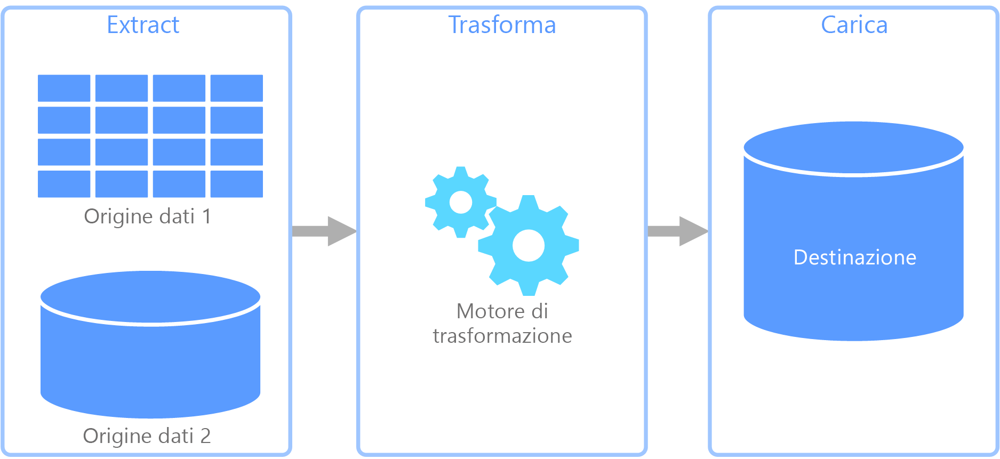
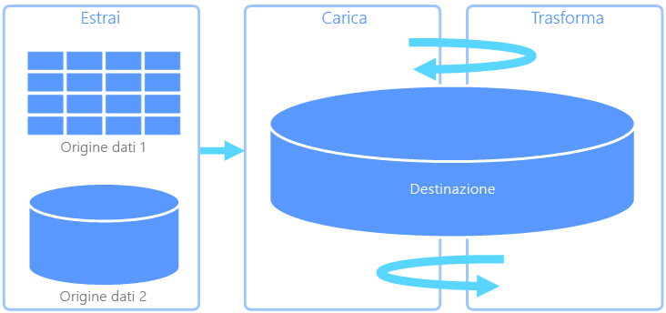
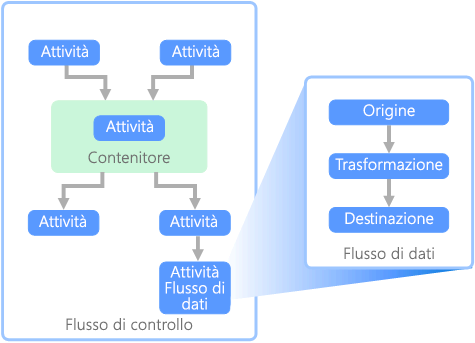

# ETL (Extract, Transform, and Load)

Un problema comune che le organizzazioni si trovano ad affrontare è come raccogliere dati da più origini e in più formati e come spostarli in uno o più archivi dati. La destinazione può essere costituita da un archivio dati diverso rispetto all'origine, spesso il formato è diverso oppure i dati devono essere modellati o puliti prima del caricamento nella destinazione finale.

Nel corso degli anni sono stati sviluppati diversi strumenti, servizi e processi per far fronte a queste problematiche. Indipendentemente dal processo usato, la necessità comune è quella di coordinare le attività e applicare un certo livello di trasformazione dei dati all'interno della pipeline di dati. Le sezioni seguenti illustrano i metodi comuni usati per eseguire queste attività.

## Processo di estrazione, trasformazione e caricamento (ETL)

ETL (Extract, Transform, and Load) è una pipeline di dati usata per raccogliere i dati da diverse origini, trasformarli in base alle regole di business e caricarli in un archivio dati di destinazione. Le operazioni di trasformazione in ETL vengono eseguite in un motore specializzato e spesso comportano l'uso di tabelle di gestione temporanea per memorizzare temporaneamente i dati che vengono trasformati e infine caricati nella rispettiva destinazione.

La trasformazione dei dati che solitamente si verifica include diverse operazioni, ad esempio il filtro, l'ordinamento, l'aggregazione, il join dei dati, la pulizia dei dati, la deduplicazione e la convalida dei dati.

Spesso le tre fasi ETL vengono eseguite in parallelo per ridurre i tempi necessari. Ad esempio, mentre i dati vengono estratti, può essere avviato un processo di trasformazione dei dati già ricevuti, che devono essere preparati per il caricamento. Inoltre, può essere avviato un processo di caricamento dei dati preparati, anziché attendere il completamento dell'intero processo di estrazione.

Servizio di Azure pertinente:

- [Azure Data Factory v2](https://azure.microsoft.com/services/data-factory/)

Altri strumenti:

- [SQL Server Integration Services (SSIS)](/sql/integration-services/sql-server-integration-services)

## ELT (Extract, Load, and Transform)

ELT (Extract, Load, and Transform) si differenzia da ETL solo per il punto in cui avviene la trasformazione. Nella pipeline ELT la trasformazione si verifica nell'archivio dati di destinazione. Per trasformare i dati, anziché usare un motore di trasformazione separato, vengono usate le funzionalità di elaborazione dell'archivio dati di destinazione. Rimuovendo il motore di trasformazione dalla pipeline, l'architettura risulta estremamente semplificata. Un altro vantaggio offerto da questo approccio è il ridimensionamento dell'archivio dati di destinazione, che determina anche un miglioramento delle prestazioni della pipeline ELT. Tuttavia, ELT funziona in modo ottimale solo quando il sistema di destinazione è abbastanza potente da trasformare i dati in modo efficiente.

Casi d'uso tipici di ELT sono quelli che rientrano nell'ambito dei Big Data. Ad esempio, si potrebbe iniziare con l'estrazione di tutti i dati di origine in file flat in una risorsa di archiviazione scalabile, ad esempio Hadoop Distributed File System (HDFS) o Azure Data Lake Store. È quindi possibile usare tecnologie come Spark, Hive o PolyBase per eseguire query sui dati di origine. Il punto chiave di ELT è che l'archivio dati usato per eseguire la trasformazione è lo stesso in cui i dati vengono alla fine utilizzati. Questo archivio dati esegue le operazioni di lettura direttamente dalla risorsa di archiviazione scalabile, anziché caricare i dati in una risorsa di archiviazione proprietaria. Questo approccio consente di ignorare la fase di copia dei dati presente in ETL, che per i set di dati di grandi dimensioni può essere un'operazione molto dispendiosa in termini di tempo.

In pratica, l'archivio dati di destinazione è un [data warehouse](./data-warehousing.md) che usa un cluster Hadoop (con Hive o Spark) oppure un'istanza di SQL Data Warehouse. In generale, in fase di query uno schema viene sovrapposto ai dati dei file flat e archiviato come tabella, consentendo di eseguire query sui dati come qualsiasi altra tabella dell'archivio dati. Vengono definite tabelle esterne perché i dati non si trovano nella risorsa di archiviazione gestita dall'archivio dati ma in una risorsa di archiviazione scalabile esterna.

L'archivio dati gestisce solo lo schema dei dati e lo applica in lettura. Ad esempio, un cluster Hadoop con Hive può descrivere una tabella Hive in cui l'origine dati è effettivamente un percorso di un set di file in HDFS. In SQL Data Warehouse, PolyBase può ottenere lo stesso risultato, creando una tabella a fronte di dati archiviati esternamente nel database stesso. Dopo il caricamento dei dati di origine, i dati presenti nelle tabelle esterne possono essere elaborati usando le funzionalità dell'archivio dati. Negli scenari di Big Data questo significa che l'archivio dati deve essere capace di eseguire un'elaborazione parallela elevata (MPP), durante la quale i dati vengono suddivisi in blocchi più piccoli e l'elaborazione di tali blocchi viene distribuita tra più macchine in parallelo.

La fase finale della pipeline ELT è costituita in genere dalla trasformazione dei dati di origine in un formato finale più efficiente per i tipi di query che devono essere supportati. Ad esempio, i dati possono essere partizionati. Inoltre, ELT può usare formati di archiviazione ottimizzati come Parquet, che archivia i dati basati su righe in colonne e fornisce un'indicizzazione ottimizzata.

Servizio di Azure pertinente:

- [Azure SQL Data Warehouse](/azure/sql-data-warehouse/sql-data-warehouse-overview-what-is)
- [HDInsight con Hive](/azure/hdinsight/hadoop/hdinsight-use-hive)
- [Azure Data Factory v2](https://azure.microsoft.com/services/data-factory/)
- [Oozie in HDInsight](/azure/hdinsight/hdinsight-use-oozie-linux-mac)

Altri strumenti:

- [SQL Server Integration Services (SSIS)](/sql/integration-services/sql-server-integration-services)

## Flusso di dati e flusso di controllo

Nell'ambito delle pipeline di dati, il flusso di controllo assicura l'elaborazione ordinata di un set di attività. Per applicare il corretto ordine di elaborazione di queste attività, vengono usati i vincoli di precedenza. È possibile considerare questi vincoli come connettori in un diagramma di flusso di lavoro, come illustrato nell'immagine seguente. Ogni attività fornisce un risultato, ad esempio operazione riuscita, operazione non riuscita o completamento. Qualsiasi attività successiva viene avviata solo quando quella precedente è terminata con uno dei risultati indicati.

I flussi di controllo eseguono i flussi di dati come un'attività. In un'attività Flusso di dati i dati vengono estratti da un'origine, trasformati o caricati in un archivio dati. L'output di un'attività Flusso di dati può costituire l'input per l'attività Flusso di dati successiva e i flussi di dati possono essere eseguiti in parallelo. A differenza di quanto previsto per i flussi di controllo, non è possibile aggiungere vincoli tra le attività di un flusso di dati. Tuttavia, è possibile aggiungere un visualizzatore per osservare i dati che vengono elaborati da ogni attività.

Nel diagramma precedente sono presenti diverse attività all'interno del flusso di controllo, ognuna della quali è un'attività Flusso di dati. Una delle attività è nidificata all'interno di un contenitore. È possibile usare i contenitori per fornire alle attività una struttura o un'unità di lavoro. Un esempio di questo tipo è costituito dagli elementi ripetitivi all'interno di una raccolta, ad esempio i file di una cartella o le istruzioni di un database.

Servizio di Azure pertinente:

- [Azure Data Factory v2](https://azure.microsoft.com/services/data-factory/)

Altri strumenti:

- [SQL Server Integration Services (SSIS)](/sql/integration-services/sql-server-integration-services)

## Scelte di tecnologia

- [Scelta di un archivio dati OLTP in Azure](./online-transaction-processing.md#oltp-in-azure)
- [Scelta di un archivio dati OLAP in Azure](./online-analytical-processing.md#olap-in-azure)
- [Data warehouse](./data-warehousing.md)
- [Orchestrazione di pipeline](../technology-choices/pipeline-orchestration-data-movement.md)

## Passaggi successivi

L'architettura di riferimento seguente illustra le pipeline ELT end-to-end in Azure:

- [Business intelligence aziendale in Azure con SQL Data Warehouse](../../reference-architectures/data/enterprise-bi-sqldw.md)
- [Business intelligence aziendale automatizzata con SQL Data Warehouse e Azure Data Factory](../../reference-architectures/data/enterprise-bi-adf.md)