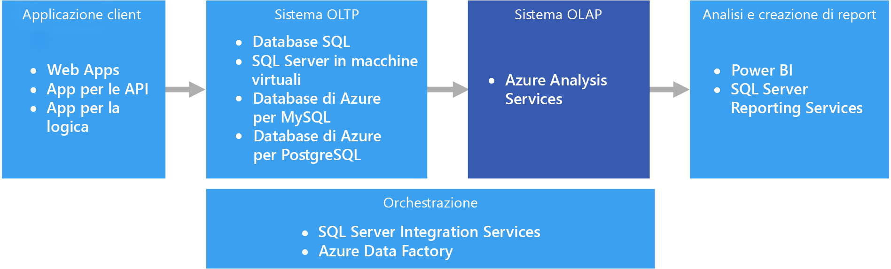
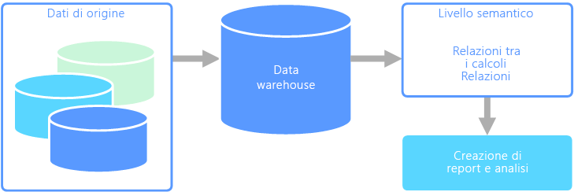

# OLAP (Online Analytical Processing)

OLAP (Online Analytical Processing) è una tecnologia che consente di organizzare i database aziendali di grandi dimensioni e supporta l'esecuzione di analisi complesse. Può essere usata per eseguire query di analisi complesse senza influire negativamente sui sistemi transazionali.

I database usati dalle aziende per archiviare tutti i record e le transazioni sono detti database [OLTP (Online Transaction Processing)](./online-transaction-processing.md). Questi database includono in genere record che sono stati inseriti singolarmente e contengono una grande quantità di informazioni importanti per l'organizzazione. I database usati per l'elaborazione OLTP, tuttavia, non sono stati progettati per l'analisi. Il recupero di informazioni da questi database richiede quindi un impegno notevole in termini di tempo e prestazioni. Per facilitare l'estrazione di queste informazioni di business intelligence sono stati progettati i sistemi OLAP, che sono in grado di offrire prestazioni molto elevate. I database OLAP sono infatti ottimizzati per intensi carichi di lavoro in lettura e carichi di lavoro ridotti in scrittura.

## Modellazione semantica

Un modello di dati semantico è un modello concettuale che descrive il significato degli elementi di dati in esso contenuti. Le organizzazioni usano spesso i propri termini per elementi o operazioni, talvolta con sinonimi, o persino diversi significati per lo stesso termine. Un database di inventario potrebbe ad esempio registrare un dispositivo con un ID asset e un numero di serie, ma un database di vendite potrebbe fare riferimento al numero di serie come ID asset. Non esiste un modo semplice per correlare questi valori senza un modello che descriva la relazione.

La modellazione semantica garantisce un livello di astrazione dello schema del database, in modo che non sia necessario che gli utenti conoscano le strutture di dati sottostanti. Questo semplifica l'esecuzione di query sui dati per gli utenti finali senza eseguire aggregazioni e join nello schema sottostante. Le colonne inoltre vengono in genere rinominate usando nomi più descrittivi, in modo da rendere più ovvi il contesto e il significato dei dati.

La modellazione semantica è prevalentemente usata per gli scenari con intensa attività di lettura, ad esempio l'analisi e la business intelligence (OLAP), anziché per l'elaborazione dei dati transazionali con più intensa attività di scrittura (OLTP). Ciò è dovuto principalmente alla natura di un livello semantico tipico:

- I comportamenti di aggregazione vengono impostati in modo che gli strumenti di report li visualizzino correttamente.
- Vengono definiti i calcoli e la logica di business.
- Vengono inclusi calcoli basati sul tempo.
- I dati sono spesso integrati da più origini.

Per questi motivi in genere il livello semantico è posizionato in un data warehouse.

Esistono due tipi principali di modelli semantici:

- **Tabulare**. Usa costrutti di modellazione relazionale (modello, tabelle, colonne). Internamente i metadati vengono ereditati da costrutti di modellazione OLAP (cubi, dimensioni, misure). Il codice e lo script usano metadati OLAP.
- **Multidimensionale**. Usa costrutti di modellazione OLAP tradizionali (cubi, dimensioni, misure).

Servizio di Azure pertinente:

- [Azure Analysis Services](https://azure.microsoft.com/services/analysis-services/)

## Esempio di caso d'uso

I dati di un'organizzazione sono archiviati in un database di grandi dimensioni. L'organizzazione vuole rendere questi dati disponibili per gli utenti di business e i clienti per la creazione di report e l'esecuzione di analisi. Un'opzione consiste nel dare agli utenti accesso diretto al database. Questa operazione presenta tuttavia numerosi svantaggi, tra cui la gestione della sicurezza e il controllo dell'accesso. La progettazione del database, inclusi i nomi delle tabelle e delle colonne, potrebbe inoltre essere difficile da comprendere per l'utente. Gli utenti dovrebbero sapere su quali tabelle eseguire le query, come unire le tabelle e conoscere altre regole di logica di business da applicare per ottenere risultati corretti. Per poter anche solo iniziare, gli utenti dovrebbero anche conoscere un linguaggio di query come SQL. Di conseguenza, spesso più utenti usano le stesse metriche ma ottengono risultati diversi.

Un'altra opzione consiste nell'incapsulare tutte le informazioni necessarie in un modello semantico. Per gli utenti può essere più semplice eseguire query su un modello semantico con uno strumento di report di propria scelta. Il pull dei dati forniti dal modello semantico è stato eseguito da un data warehouse, consentendo in tal modo a tutti gli utenti di vedere un'unica versione della realtà. Il modello semantico garantisce anche nomi descrittivi di colonna e tabella, relazioni tra tabelle, descrizioni, calcoli e sicurezza a livello di riga.

## Caratteristiche tipiche della modellazione semantica

La modellazione semantica e l'elaborazione analitica hanno in genere le caratteristiche seguenti:

| Requisito | DESCRIZIONE |
| --- | --- |
| SCHEMA | Schema durante la scrittura, fortemente applicato|
| Uso delle transazioni | No  |
| Strategia di blocco | Nessuna |
| Aggiornabile | No (in genere richiede il ricalcolo del cubo) |
| Accodamento | No (in genere richiede il ricalcolo del cubo) |
| Carico di lavoro | Operazioni di lettura intense, sola lettura |
| Indicizzazione | Indicizzazione multidimensionale |
| Dimensioni dati | Da piccole a medie |
| Modello | Multidimensionale |
| Forma dei dati:| Cubo o schema star/snowflake |
| Flessibilità query | Flessibilità elevata |
| Scalabilità: | Grande (10-100 GB) |

## Quando usare questa soluzione

Prendere in considerazione la tecnologia OLAP negli scenari seguenti:

- È necessario eseguire con rapidità query ad hoc e di analisi complesse senza influire negativamente sui sistemi OLTP.
- Si vuole offrire agli utenti aziendali una soluzione semplice per generare report dai dati.
- Si vuole fornire una serie di aggregazioni che consenta agli utenti di ottenere risultati rapidi e coerenti.

OLAP è particolarmente utile per applicare calcoli di aggregazione a grandi quantità di dati. I sistemi OLAP sono ottimizzati per gli scenari che richiedono intensi carichi di lavoro in lettura, ad esempio per le applicazioni di analisi e business intelligence. OLAP consente agli utenti di segmentare i dati multidimensionali in sezioni visualizzabili in due dimensioni, ad esempio in una tabella pivot, o di filtrare i dati in base a valori specifici. Questo processo di segmentazione dei dati può essere eseguito indipendentemente dal fatto che i dati si trovino in diverse origini. Ciò consente agli utenti di individuare tendenze, identificare schemi ricorrenti ed esplorare i dati senza dover conoscere i dettagli dell'analisi dei dati tradizionale.

I modelli semantici consentono agli utenti aziendali di identificare relazioni complesse tra i dati ed eseguirne l'analisi più rapidamente.

## Problematiche

Nonostante tutti i vantaggi offerti, i sistemi OLAP presentano alcune problematiche:

- Mentre i dati nei sistemi OLTP vengono costantemente aggiornati tramite transazioni provenienti da varie origini, gli archivi dati OLAP vengono in genere aggiornati a intervalli meno frequenti, a seconda delle esigenze aziendali. Ciò significa che i sistemi OLAP sono più adatti per prendere decisioni aziendali strategiche anziché reagire in modo tempestivo a eventuali cambiamenti. È inoltre necessario prevedere un certo livello di pulizia e orchestrazione dei dati per mantenere aggiornati gli archivi dati OLAP.
- A differenza delle tabelle tradizionali, normalizzate e relazionali presenti nei sistemi OLTP, i modelli di dati OLAP tendono a essere multidimensionali. Questo rende difficile o impossibile il mapping diretto a modelli di tipo entità-relazione o orientati a oggetti, dove ogni attributo è mappato a una singola colonna. In alternativa alla normalizzazione tradizionale, i sistemi OLAP usano in genere uno schema snowflake o a stella.

## OLAP in Azure

In Azure, i dati contenuti nei sistemi OLTP, come il database SQL di Azure, vengono copiati in un sistema OLAP, ad esempio [Azure Analysis Services](/azure/analysis-services/analysis-services-overview). Gli strumenti per l'esplorazione e la visualizzazione dei dati, come [Power BI](https://powerbi.microsoft.com), Excel e strumenti di terze parti, si connettono ai server di Analysis Services e forniscono agli utenti informazioni dettagliate, altamente interattive e graficamente efficaci, dei dati presenti nel modello. Il flusso dei dati da OLTP a OLAP viene in genere orchestrato tramite SQL Server Integration Services, che è possibile eseguire usando [Azure Data Factory](/azure/data-factory/concepts-integration-runtime).

In Azure tutti gli archivi dati elencati di seguito soddisfano i requisiti di base per OLAP:

- [SQL Server con indici columnstore](/sql/relational-databases/indexes/get-started-with-columnstore-for-real-time-operational-analytics)
- [Azure Analysis Services](/azure/analysis-services/analysis-services-overview)
- [SQL Server Analysis Services (SSAS)](/sql/analysis-services/analysis-services)

SQL Server Analysis Services (SSAS) offre funzionalità OLAP e di data mining per applicazioni di business intelligence. È possibile installare SSAS nei server locali oppure ospitarlo all'interno di una macchina virtuale in Azure. Azure Analysis Services è un servizio completamente gestito che fornisce le stesse funzionalità principali di SSAS. Azure Analysis Services supporta la connessione a [varie origini dati](/azure/analysis-services/analysis-services-datasource) sul cloud e locali nell'organizzazione.

Gli indici columnstore cluster sono disponibili in SQL Server 2014 e versioni successive, oltre che nel database SQL di Azure, e sono ideali per i carichi di lavoro OLAP. Tuttavia, a partire da SQL Server 2016 (incluso il database SQL di Azure), è possibile sfruttare la tecnologia di elaborazione HTAP (Hybrid Transactional/Analytics Processing) usando indici columnstore non cluster aggiornabili. HTAP consente di eseguire l'elaborazione OLTP e OLAP sulla stessa piattaforma, eliminando così la necessità di archiviare più copie dei dati e di usare sistemi OLTP e OLAP distinti. Per altre informazioni, vedere [Introduzione a columnstore per l'analisi operativa in tempo reale](/sql/relational-databases/indexes/get-started-with-columnstore-for-real-time-operational-analytics).

## Criteri di scelta principali

Per limitare le possibilità di scelta, rispondere prima di tutto a queste domande:

- Si vuole usare un servizio gestito anziché gestire direttamente i propri server?

- Si richiede l'autenticazione sicura con Azure Active Directory (Azure AD)?

- Si vogliono eseguire analisi in tempo reale? In caso affermativo, limitare la scelta alle opzioni che supportano l'analisi in tempo reale.

    In questo contesto l'*analisi in tempo reale* si applica a una singola origine dati, ad esempio un'applicazione ERP (Enterprise Resource Planning), che gestisce contemporaneamente un carico di lavoro operativo e un carico di lavoro di analisi. Se si ha la necessità di integrare dati provenienti da più origini o di ottenere prestazioni di analisi estremamente elevate con l'uso di dati preaggregati, ad esempio i cubi, è possibile richiedere un data warehouse separato.

- È necessario usare dati preaggregati, ad esempio per fornire modelli semantici che consentano un'analisi più intuitiva a livello aziendale? In caso affermativo, scegliere un'opzione con il supporto per cubi multidimensionali o modelli semantici tabulari.

    La disponibilità di dati preaggregati può aiutare gli utenti a calcolare le aggregazioni di dati in modo coerente. I dati preaggregati consentono inoltre di migliorare notevolmente le prestazioni quando si gestiscono più colonne per un numero elevato righe. I dati possono essere preaggregati in cubi multidimensionali o in modelli semantici tabulari.

- È necessario integrare dati provenienti da più origini, oltre all'archivio dati OLTP? In caso affermativo, prendere in considerazione le opzioni che facilitano l'integrazione di più origini dati.

## Matrice delle funzionalità

Le tabelle seguenti contengono un riepilogo delle differenze principali in termini di funzionalità.

### Funzionalità generali

<!-- markdownlint-disable MD033 -->

| | Azure Analysis Services | SQL Server Analysis Services | SQL Server con indici columnstore | Database SQL di Azure con indici columnstore |
| --- | --- | --- | --- | --- |
| Servizio gestito | Yes | No  | No  | Yes |
| Supporto per i cubi multidimensionali | No  | Yes | No  | No  |
| Supporto per i modelli semantici tabulari | Yes | Sì | No  | No  |
| Facilità di integrazione di più origini dati | Yes | Yes | No 1 | No 1 |
| Supporto per l'analisi in tempo reale | No  | No  | Yes | Yes |
| Necessità di un processo per copiare i dati da una o più origini | Yes | Sì | No  | No  |
| Integrazione di Azure AD | Yes | No  | No 2 | Yes |

<!-- markdownlint-enable MD033 -->

[1] Anche se SQL Server e il database SQL di Azure non possono essere usati per eseguire query da più origini dati esterne e integrare tali origini, è possibile creare una pipeline che esegua automaticamente questa operazione usando [SSIS](/sql/integration-services/sql-server-integration-services) o [Azure Data Factory](/azure/data-factory/). Con SQL Server ospitato in una macchina virtuale di Azure, è possibile sfruttare opzioni aggiuntive, ad esempio i server collegati e [PolyBase](/sql/relational-databases/polybase/polybase-guide). Per altre informazioni, vedere [Scelta di una tecnologia di orchestrazione di una pipeline di dati in Azure](../technology-choices/pipeline-orchestration-data-movement.md).

[2] La connessione a SQL Server in esecuzione in una macchina virtuale di Azure non è supportata con un account Azure AD. Usare un account Active Directory di dominio.

### Funzionalità di scalabilità

|                                                  | Azure Analysis Services | SQL Server Analysis Services | SQL Server con indici columnstore | Database SQL di Azure con indici columnstore |
|--------------------------------------------------|-------------------------|------------------------------|-------------------------------------|---------------------------------------------|
| Server regionali ridondanti per disponibilità elevata |           Yes           |              No               |                 Yes                 |                     Yes                     |
|             Supporto per la scalabilità orizzontale delle query             |           Yes           |              No               |                 Yes                 |                     No                       |
|          Scalabilità dinamica (aumento delle prestazioni)          |           Yes           |              No               |                 Yes                 |                     No                       |
